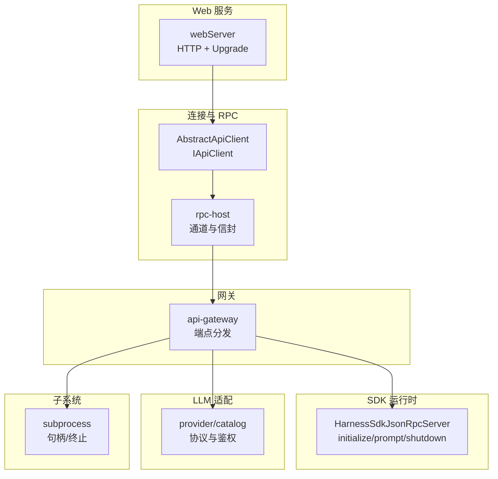
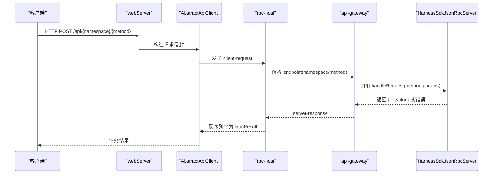
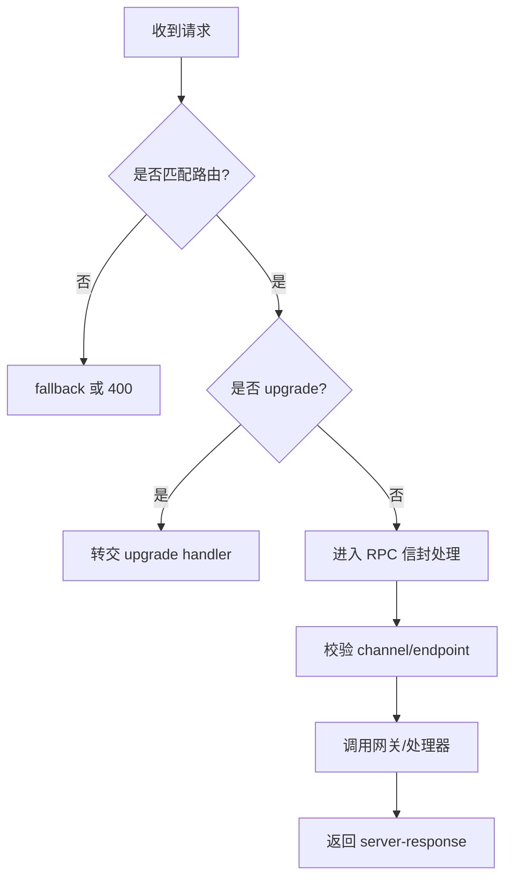
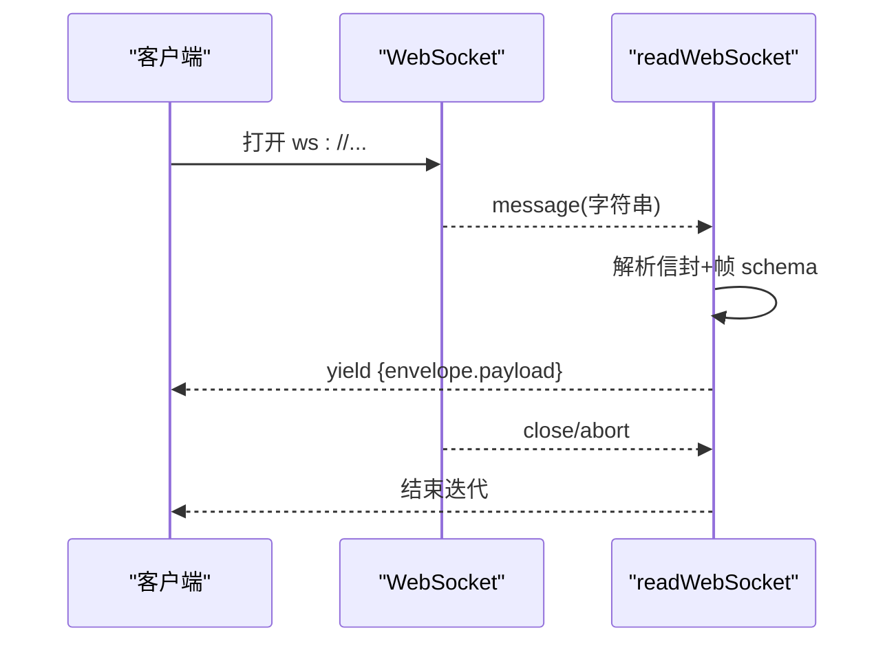
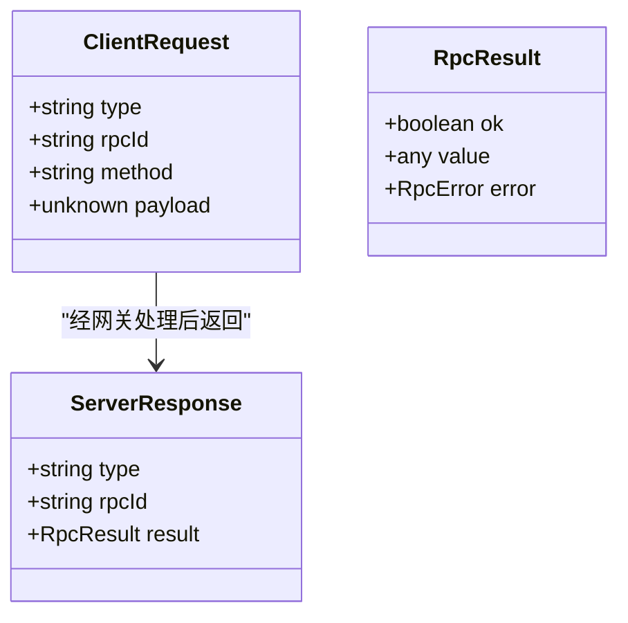
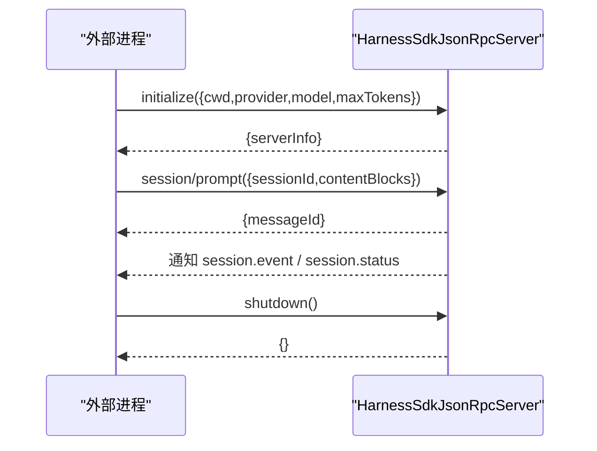
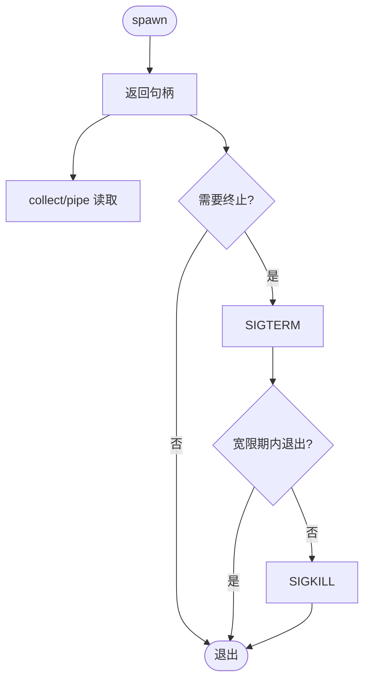
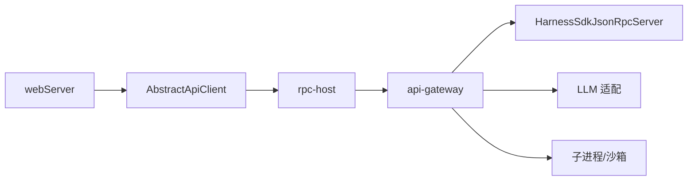

# API 参考

<cite>
**本文引用的文件**
- [packages/host/webserver/src/index.ts](file://packages/host/webserver/src/index.ts)
- [packages/client/connection/src/client/api.ts](file://packages/client/connection/src/client/api.ts)
- [packages/client/connection/src/client/web-api-client.ts](file://packages/client/connection/src/client/web-api-client.ts)
- [packages/host/apiproxy/src/api/rpc.schema.ts](file://packages/host/apiproxy/src/api/rpc.schema.ts)
- [packages/client/connection/src/rpc-host.ts](file://packages/client/connection/src/rpc-host.ts)
- [packages/api/gateway/src/index.ts](file://packages/api/gateway/src/index.ts)
- [packages/sdk/server/src/server.ts](file://packages/sdk/server/src/server.ts)
- [packages/llm/llm-pi-ai/src/provider.ts](file://packages/llm/llm-pi-ai/src/provider.ts)
- [packages/llm/llm-pi-ai/src/catalog.ts](file://packages/llm/llm-pi-ai/src/catalog.ts)
- [docs/subsystems/subprocess.md](file://docs/subsystems/subprocess.md)
- [packages/sandbox/sandbox-windows-acl/src/spawn.ts](file://packages/sandbox/sandbox-windows-acl/src/spawn.ts)
- [packages/subprocess/subprocess-local/src/process-inspector.ts](file://packages/subprocess/subprocess-local/src/process-inspector.ts)
</cite>

## 目录
1. [简介](#简介)
2. [项目结构](#项目结构)
3. [核心组件](#核心组件)
4. [架构总览](#架构总览)
5. [详细组件分析](#详细组件分析)
6. [依赖关系分析](#依赖关系分析)
7. [性能考虑](#性能考虑)
8. [故障排查指南](#故障排查指南)
9. [结论](#结论)
10. [附录](#附录)

## 简介
本 API 参考面向 DeepSeek Harness 的对外接口与内部通信协议，覆盖以下方面：
- RESTful API：HTTP 路由注册、请求/响应信封、认证与安全策略、错误码与限流建议。
- WebSocket 事件通道：连接建立、帧格式、事件类型、实时交互模式。
- JSON-RPC 网关：方法命名空间、参数校验、结果封装、错误模型。
- SDK 运行时（进程外）：初始化、会话提示、生命周期通知与关闭。
- IPC/管道与子进程：数据流、消息传递、进程树终止与同步。
- 安全与速率限制：信任边界、回环限制、鉴权方式。
- 版本兼容与迁移：协议演进与兼容性注意事项。

## 项目结构
DeepSeek Harness 采用多包分层架构：
- Web 服务层：提供 HTTP 路由与升级（WebSocket/SSE）能力。
- 连接与 RPC 层：统一客户端抽象、RPC 信封与通道管理。
- 网关层：将 RPC 端点映射到具体实现，负责鉴权与类型约束。
- SDK 运行时：为外部进程提供 JSON-RPC 接口，驱动 Agent 会话。
- LLM 适配层：按路由配置选择协议与鉴权方式。
- 子系统：子进程、沙箱、存储等能力。

图表来源
- [packages/host/webserver/src/index.ts:1-214](file://packages/host/webserver/src/index.ts#L1-L214)
- [packages/client/connection/src/client/web-api-client.ts:28-101](file://packages/client/connection/src/client/web-api-client.ts#L28-L101)
- [packages/client/connection/src/rpc-host.ts:200-224](file://packages/client/connection/src/rpc-host.ts#L200-L224)
- [packages/api/gateway/src/index.ts:194-235](file://packages/api/gateway/src/index.ts#L194-L235)
- [packages/sdk/server/src/server.ts:53-241](file://packages/sdk/server/src/server.ts#L53-L241)

章节来源
- [packages/host/webserver/src/index.ts:1-214](file://packages/host/webserver/src/index.ts#L1-L214)

## 核心组件
- Web 服务器与路由
  - 支持精确匹配与前缀匹配两种路由模式；支持 HTTP Upgrade 处理（如 WebSocket）。
  - 暴露端口与主机绑定信息；重复路由会抛出异常以保障组合契约。
- 客户端抽象与传输
  - IApiClient/AbstractApiClient 定义统一的调用面；对二进制帧进行丢弃与日志记录。
  - WebSocket 读取器维护 inbox 队列，解析信封并转发帧。
- RPC 信封与通道
  - 使用 client-request/server-response 信封；业务结果通过 { ok, value } 或 { ok, error } 表达。
  - 通道名需符合白名单且保留 /api 不被复用。
- 网关与端点分发
  - 将 namespace/method 形式的端点解析为调用描述符，严格校验 payload 结构。
  - 未知方法或非法 payload 返回结构化错误。
- SDK 运行时（JSON-RPC）
  - initialize：设置 provider/model/maxTokens/cwd，按需加载 LLM 插件。
  - session/prompt：向指定会话追加用户消息并触发 Agent followup。
  - shutdown：有序清理会话、订阅与可选 LLM 插件。
- LLM 适配与鉴权
  - 支持按路由声明协议与 baseURL；API Key 由 Harness 凭证系统注入。
  - OAuth 仅凭已存储凭证工作，未配置时请求失败。

章节来源
- [packages/host/webserver/src/index.ts:24-100](file://packages/host/webserver/src/index.ts#L24-L100)
- [packages/client/connection/src/client/web-api-client.ts:28-101](file://packages/client/connection/src/client/web-api-client.ts#L28-L101)
- [packages/host/apiproxy/src/api/rpc.schema.ts:80-110](file://packages/host/apiproxy/src/api/rpc.schema.ts#L80-L110)
- [packages/client/connection/src/rpc-host.ts:200-224](file://packages/client/connection/src/rpc-host.ts#L200-L224)
- [packages/api/gateway/src/index.ts:194-235](file://packages/api/gateway/src/index.ts#L194-L235)
- [packages/sdk/server/src/server.ts:111-201](file://packages/sdk/server/src/server.ts#L111-L201)
- [packages/llm/llm-pi-ai/src/provider.ts:53-85](file://packages/llm/llm-pi-ai/src/provider.ts#L53-L85)
- [packages/llm/llm-pi-ai/src/catalog.ts:179-197](file://packages/llm/llm-pi-ai/src/catalog.ts#L179-L197)

## 架构总览
下图展示从 Web 入口到 SDK 运行时的端到端调用链，以及 WebSocket 事件通道的双向流式交互。

图表来源
- [packages/host/webserver/src/index.ts:124-135](file://packages/host/webserver/src/index.ts#L124-L135)
- [packages/client/connection/src/client/web-api-client.ts:44-101](file://packages/client/connection/src/client/web-api-client.ts#L44-L101)
- [packages/client/connection/src/rpc-host.ts:200-224](file://packages/client/connection/src/rpc-host.ts#L200-L224)
- [packages/api/gateway/src/index.ts:194-235](file://packages/api/gateway/src/index.ts#L194-L235)
- [packages/sdk/server/src/server.ts:183-201](file://packages/sdk/server/src/server.ts#L183-L201)

## 详细组件分析

### RESTful API：HTTP 路由与升级
- 路由注册
  - 支持 exact 与 prefix 两种匹配模式；路径去尾斜杠；重复注册抛错。
  - 可注册 fallback 处理器用于未命中路由的统一处理。
- 请求/响应
  - 所有业务请求经 RPC 信封包装；响应为 server-response，包含 rpcId 与 result。
- 升级通道
  - 支持 upgrade 事件，将 socket 交给特定处理器（例如 WebSocket）。
- 安全与信任
  - 特权方法强制回环访问；非回环来源将被拒绝。
  - 通用通道可通过 authority 控制信任范围。

图表来源
- [packages/host/webserver/src/index.ts:88-100](file://packages/host/webserver/src/index.ts#L88-L100)
- [packages/host/webserver/src/index.ts:181-214](file://packages/host/webserver/src/index.ts#L181-L214)
- [packages/client/connection/src/rpc-host.ts:200-224](file://packages/client/connection/src/rpc-host.ts#L200-L224)

章节来源
- [packages/host/webserver/src/index.ts:24-100](file://packages/host/webserver/src/index.ts#L24-L100)
- [packages/host/webserver/src/index.ts:181-214](file://packages/host/webserver/src/index.ts#L181-L214)
- [packages/client/connection/src/rpc-host.ts:200-224](file://packages/client/connection/src/rpc-host.ts#L200-L224)

### WebSocket 事件通道
- 连接与帧
  - 客户端通过 readWebSocket 打开 ws/wss 通道，解析 server-request 信封并分派帧。
  - 二进制帧会被丢弃并记录错误；字符串帧经 schema 校验后入队。
- 事件类型
  - mux 与 host 两类事件通道，分别承载会话级与宿主级事件。
- 生命周期
  - 监听 open/message/close/abort；在 finally 中清理监听器并关闭连接。

图表来源
- [packages/client/connection/src/client/web-api-client.ts:28-101](file://packages/client/connection/src/client/web-api-client.ts#L28-L101)

章节来源
- [packages/client/connection/src/client/web-api-client.ts:28-101](file://packages/client/connection/src/client/web-api-client.ts#L28-L101)

### JSON-RPC 网关与信封
- 信封格式
  - client-request：{ type, rpcId, method, payload }
  - server-response：{ type, rpcId, result }，result 为 { ok, value } 或 { ok, error }
- 端点解析
  - 要求 endpoint 形如 namespace/method；payload 必须为单一 args 字段对象。
- 错误模型
  - 使用 rpcErrorSchema 描述错误；未知方法抛错并转为 RPC 错误。

图表来源
- [packages/host/apiproxy/src/api/rpc.schema.ts:80-110](file://packages/host/apiproxy/src/api/rpc.schema.ts#L80-L110)
- [packages/api/gateway/src/index.ts:194-235](file://packages/api/gateway/src/index.ts#L194-L235)

章节来源
- [packages/host/apiproxy/src/api/rpc.schema.ts:80-110](file://packages/host/apiproxy/src/api/rpc.schema.ts#L80-L110)
- [packages/api/gateway/src/index.ts:194-235](file://packages/api/gateway/src/index.ts#L194-L235)

### SDK 运行时（进程外 JSON-RPC）
- 方法
  - initialize(params)：设置 cwd/provider/model/maxTokens；按需加载 LLM 插件。
  - session/prompt(params)：创建或复用会话，投递用户消息并触发 Agent followup。
  - shutdown()：有序清理会话、订阅与可选 LLM 插件。
- 通知
  - session.event、session.status、subagent.started、subagent.finished。
- 错误与状态
  - 未知方法抛错；max-tokens 可按选项视为成功。

图表来源
- [packages/sdk/server/src/server.ts:111-201](file://packages/sdk/server/src/server.ts#L111-L201)
- [packages/sdk/server/src/server.ts:218-239](file://packages/sdk/server/src/server.ts#L218-L239)

章节来源
- [packages/sdk/server/src/server.ts:53-241](file://packages/sdk/server/src/server.ts#L53-L241)

### LLM 适配与鉴权
- 协议与端点
  - 每个路由可声明 wire protocol 与 baseURL；未声明则沿用目录默认。
- 鉴权
  - API Key 由 Harness 凭证系统注入；OAuth 仅依赖已存储凭证。
  - 未配置密钥或未注册适配器会导致请求失败。

章节来源
- [packages/llm/llm-pi-ai/src/provider.ts:53-85](file://packages/llm/llm-pi-ai/src/provider.ts#L53-L85)
- [packages/llm/llm-pi-ai/src/catalog.ts:179-197](file://packages/llm/llm-pi-ai/src/catalog.ts#L179-L197)

### IPC/管道与子进程
- 子进程句柄
  - spawn 立即返回句柄；collect 模式支持偏移读取；pipe 模式流归调用方。
  - terminate 执行 SIGTERM→宽限期→SIGKILL 升级；waitForExit 观察整棵进程树。
- Windows 管道
  - 使用 PeekNamedPipe 轮询读取；错误码区分 EOF/无数据；失败时关闭句柄。
- 进程检查
  - 通过系统调用表与 fdinfo 探测 stdin 可用性。

图表来源
- [docs/subsystems/subprocess.md:132-174](file://docs/subsystems/subprocess.md#L132-L174)
- [packages/sandbox/sandbox-windows-acl/src/spawn.ts:169-202](file://packages/sandbox/sandbox-windows-acl/src/spawn.ts#L169-L202)
- [packages/subprocess/subprocess-local/src/process-inspector.ts:170-208](file://packages/subprocess/subprocess-local/src/process-inspector.ts#L170-L208)

章节来源
- [docs/subsystems/subprocess.md:132-174](file://docs/subsystems/subprocess.md#L132-L174)
- [packages/sandbox/sandbox-windows-acl/src/spawn.ts:169-202](file://packages/sandbox/sandbox-windows-acl/src/spawn.ts#L169-L202)
- [packages/subprocess/subprocess-local/src/process-inspector.ts:170-208](file://packages/subprocess/subprocess-local/src/process-inspector.ts#L170-L208)

## 依赖关系分析
- webServer 提供 HTTP/Upgrade 能力，被上层应用挂载前端与路由。
- AbstractApiClient 屏蔽传输细节，向上暴露统一 IApiClient。
- rpc-host 负责通道校验与信封序列化/反序列化。
- api-gateway 将 RPC 端点分发到具体实现，并执行类型校验。
- HarnessSdkJsonRpcServer 作为 SDK 运行时，桥接 Agent 与外部进程。
- LLM 适配层根据路由配置选择协议与鉴权方式。

图表来源
- [packages/host/webserver/src/index.ts:1-214](file://packages/host/webserver/src/index.ts#L1-L214)
- [packages/client/connection/src/client/web-api-client.ts:28-101](file://packages/client/connection/src/client/web-api-client.ts#L28-L101)
- [packages/client/connection/src/rpc-host.ts:200-224](file://packages/client/connection/src/rpc-host.ts#L200-L224)
- [packages/api/gateway/src/index.ts:194-235](file://packages/api/gateway/src/index.ts#L194-L235)
- [packages/sdk/server/src/server.ts:53-241](file://packages/sdk/server/src/server.ts#L53-L241)

章节来源
- [packages/host/webserver/src/index.ts:1-214](file://packages/host/webserver/src/index.ts#L1-L214)
- [packages/api/gateway/src/index.ts:194-235](file://packages/api/gateway/src/index.ts#L194-L235)

## 性能考虑
- WebSocket 读取器使用 inbox 队列与唤醒机制，避免忙轮询；遇到二进制帧直接丢弃并记录错误，降低无效开销。
- 子进程管道读取采用短睡眠退避，防止事件循环饥饿。
- 网关对 payload 进行严格校验，减少下游无效调用。
- 建议在网关层引入速率限制（如令牌桶），保护后端资源。

[本节为通用指导，不直接分析具体文件]

## 故障排查指南
- 常见错误
  - 未知 RPC 方法：检查 endpoint 命名空间与方法名是否正确。
  - 非法 payload：确保 args 存在且为纯对象。
  - 二进制 WebSocket 帧：客户端应发送 JSON 字符串帧。
  - 权限不足：特权方法需来自回环地址；检查 trustedHosts 与 authority。
- 定位步骤
  - 查看网关日志中的错误码与详情。
  - 核对路由注册是否冲突或重复。
  - 确认 SDK 运行时 initialize 参数合法（如 maxTokens 为正整数）。

章节来源
- [packages/api/gateway/src/index.ts:194-235](file://packages/api/gateway/src/index.ts#L194-L235)
- [packages/host/webserver/src/index.ts:181-214](file://packages/host/webserver/src/index.ts#L181-L214)
- [packages/client/connection/src/client/web-api-client.ts:61-74](file://packages/client/connection/src/client/web-api-client.ts#L61-L74)
- [packages/sdk/server/src/server.ts:111-125](file://packages/sdk/server/src/server.ts#L111-L125)

## 结论
DeepSeek Harness 通过清晰的层次划分与严格的信封/类型约束，提供了稳定的 REST、WebSocket 与 JSON-RPC 接口。结合子进程与沙箱能力，可满足复杂任务编排与隔离需求。建议在生产环境启用速率限制与审计日志，并遵循回环与信任边界策略以确保安全。

[本节为总结性内容，不直接分析具体文件]

## 附录

### RESTful API 端点速查
- 路由注册
  - 方法：register(route)
  - 模式：exact/prefix
  - 行为：重复注册抛错；支持 fallback
- 升级通道
  - 事件：upgrade
  - 用途：WebSocket/SSE 等长连接
- 安全
  - 特权方法：仅限回环
  - 通用通道：authority 控制信任

章节来源
- [packages/host/webserver/src/index.ts:88-100](file://packages/host/webserver/src/index.ts#L88-L100)
- [packages/host/webserver/src/index.ts:181-214](file://packages/host/webserver/src/index.ts#L181-L214)

### WebSocket 事件通道要点
- 通道：mux、host
- 帧：MuxFrame、HostFrame
- 生命周期：open/message/close/abort
- 错误：二进制帧丢弃并记录

章节来源
- [packages/client/connection/src/client/web-api-client.ts:28-101](file://packages/client/connection/src/client/web-api-client.ts#L28-L101)

### JSON-RPC 信封与错误
- 信封：client-request、server-response
- 结果：{ ok, value } 或 { ok, error }
- 错误：rpcErrorSchema 描述

章节来源
- [packages/host/apiproxy/src/api/rpc.schema.ts:80-110](file://packages/host/apiproxy/src/api/rpc.schema.ts#L80-L110)

### SDK 运行时方法
- initialize(params)
- session/prompt(params)
- shutdown()
- 通知：session.event、session.status、subagent.started、subagent.finished

章节来源
- [packages/sdk/server/src/server.ts:111-201](file://packages/sdk/server/src/server.ts#L111-L201)
- [packages/sdk/server/src/server.ts:218-239](file://packages/sdk/server/src/server.ts#L218-L239)

### 子进程与管道
- 句柄：pid/stdin/stdout/stderr/collected/done
- 终止：terminate()/waitForExit()
- Windows 管道：PeekNamedPipe 轮询与错误处理

章节来源
- [docs/subsystems/subprocess.md:132-174](file://docs/subsystems/subprocess.md#L132-L174)
- [packages/sandbox/sandbox-windows-acl/src/spawn.ts:169-202](file://packages/sandbox/sandbox-windows-acl/src/spawn.ts#L169-L202)