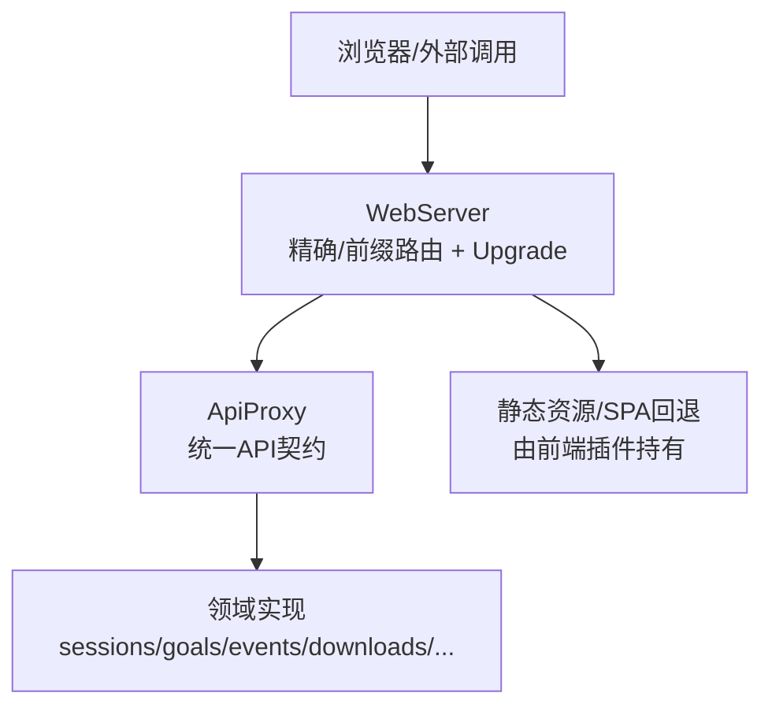
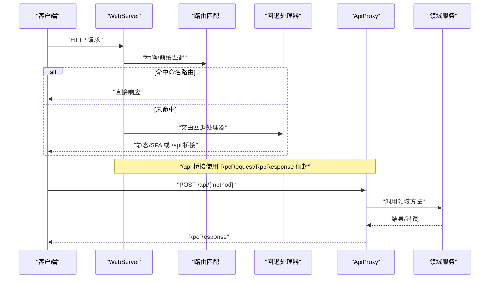
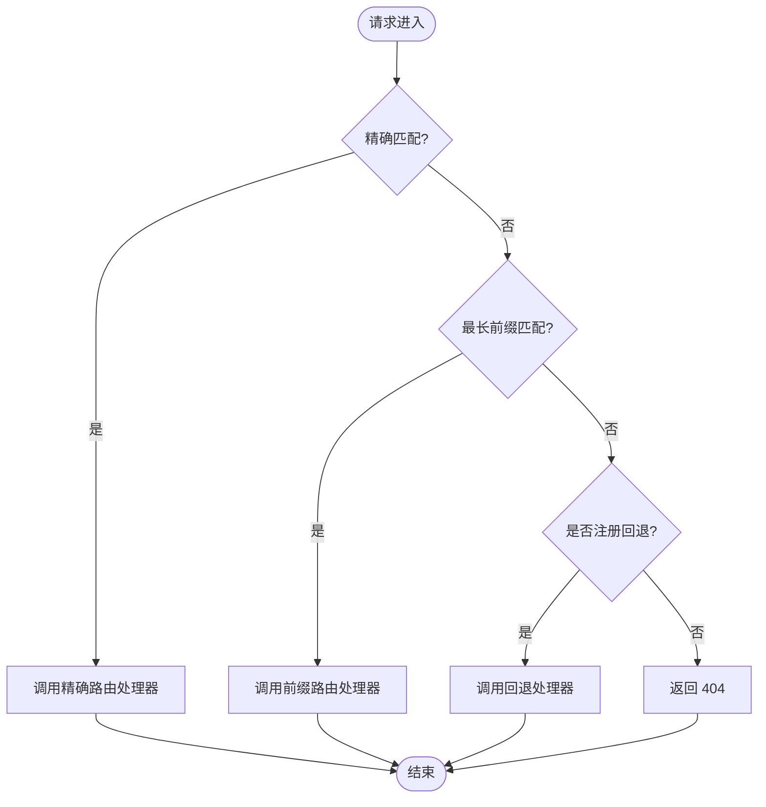
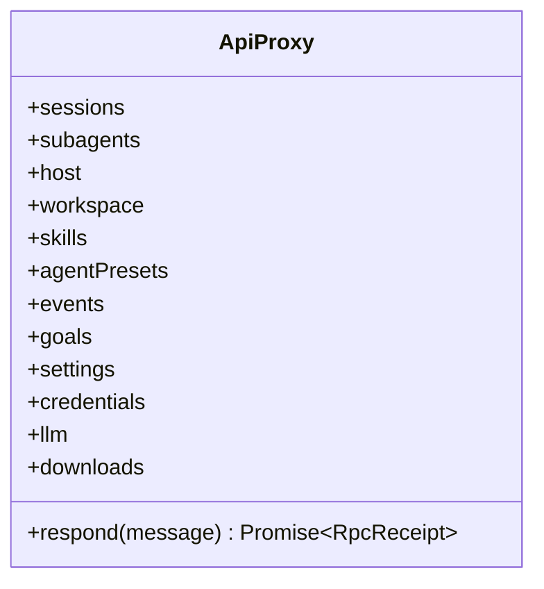
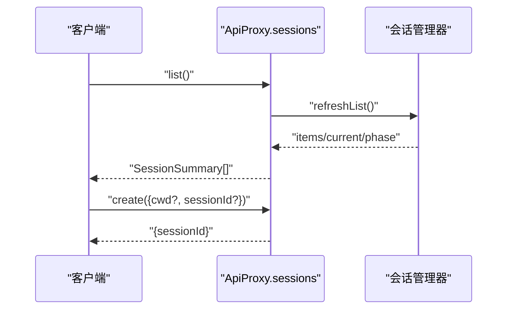
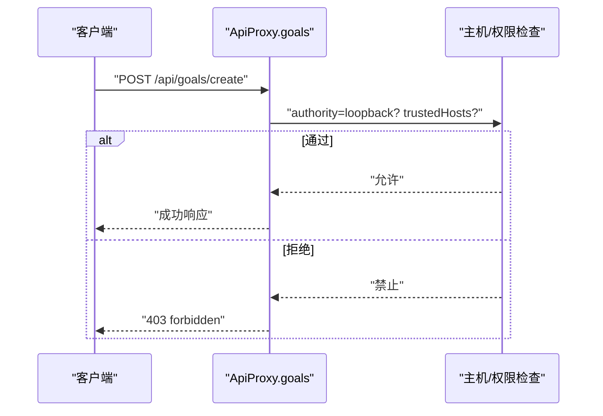
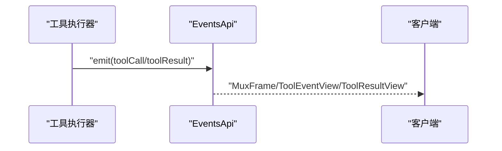
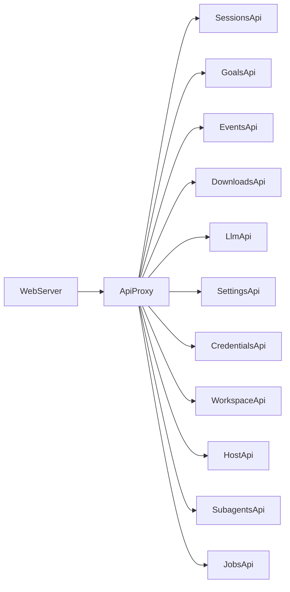

# REST API

<cite>
**本文引用的文件**
- [packages/host/webserver/src/index.ts](file://packages/host/webserver/src/index.ts)
- [packages/host/apiproxy/src/api/index.ts](file://packages/host/apiproxy/src/api/index.ts)
- [packages/host/apiproxy/src/api/sessions.ts](file://packages/host/apiproxy/src/api/sessions.ts)
- [packages/host/apiproxy/src/api/goals.ts](file://packages/host/apiproxy/src/api/goals.ts)
- [packages/host/apiproxy/src/api/events.ts](file://packages/host/apiproxy/src/api/events.ts)
- [packages/host/apiproxy/src/api/downloads.ts](file://packages/host/apiproxy/src/api/downloads.ts)
- [packages/host/apiproxy/src/api/llm.ts](file://packages/host/apiproxy/src/api/llm.ts)
- [packages/host/apiproxy/src/api/settings.ts](file://packages/host/apiproxy/src/api/settings.ts)
- [packages/host/apiproxy/src/api/credentials.ts](file://packages/host/apiproxy/src/api/credentials.ts)
- [packages/host/apiproxy/src/api/workspace.ts](file://packages/host/apiproxy/src/api/workspace.ts)
- [packages/host/apiproxy/src/api/host.ts](file://packages/host/apiproxy/src/api/host.ts)
- [packages/host/apiproxy/src/api/subagents.ts](file://packages/host/apiproxy/src/api/subagents.ts)
- [packages/host/apiproxy/src/api/jobs.ts](file://packages/host/apiproxy/src/api/jobs.ts)
- [packages/host/apiproxy/src/api/rpc.schema.ts](file://packages/host/apiproxy/src/api/rpc.schema.ts)
- [packages/client/connection/tests/node-half.host.spec.ts](file://packages/client/connection/tests/node-half.host.spec.ts)
- [packages/host/webserver/tests/webserver.spec.ts](file://packages/host/webserver/tests/webserver.spec.ts)
- [docs/subsystems/web-server.md](file://docs/subsystems/web-server.md)
</cite>

## 目录
1. [简介](#简介)
2. [项目结构](#项目结构)
3. [核心组件](#核心组件)
4. [架构总览](#架构总览)
5. [详细组件分析](#详细组件分析)
6. [依赖关系分析](#依赖关系分析)
7. [性能与速率限制](#性能与速率限制)
8. [故障排查指南](#故障排查指南)
9. [结论](#结论)
10. [附录：数据模型与类型定义](#附录数据模型与类型定义)

## 简介
本文件为 DeepSeek Harness 的 REST/HTTP 接口文档，聚焦于浏览器侧 HTTP 承载服务（WebServer）以及通过该承载暴露的统一 API 代理（ApiProxy）。内容涵盖：
- HTTP 路由注册、请求匹配与回退机制
- 统一 API 域方法（会话、目标、事件、下载、LLM、设置、凭据、工作区、主机能力、子代理、作业等）
- 认证与安全边界（环回强制、可信主机白名单、特权方法限制）
- 错误码、状态码与错误映射
- 速率限制与最佳实践建议
- 请求/响应数据模型（TypeScript 类型与 JSON Schema 来源）

注意：本仓库未提供显式的 OpenAPI/Swagger 描述；所有端点与契约以 TypeScript 接口与测试断言为准。

## 项目结构
- WebServer：基于 node:http 的轻量级 HTTP 服务器，提供精确路径与前缀路由、HTTP Upgrade 支持、索引注入钩子与单一“回退座位”（fallback seat）。
- ApiProxy：统一 API 契约层，将多个领域（sessions、goals、events、downloads、llm、settings、credentials、workspace、host、subagents、jobs）聚合为一个根接口，并通过 RPC 消息封装在传输通道上复用。
- 连接与安全：客户端连接层对 /api 等通用通道实施信任主机白名单与特权方法环回限制，确保敏感操作仅在本地或受控环境执行。

图表来源
- [packages/host/webserver/src/index.ts:59-263](file://packages/host/webserver/src/index.ts#L59-L263)
- [packages/host/apiproxy/src/api/index.ts:21-42](file://packages/host/apiproxy/src/api/index.ts#L21-L42)
- [docs/subsystems/web-server.md:9-47](file://docs/subsystems/web-server.md#L9-L47)

章节来源
- [packages/host/webserver/src/index.ts:59-263](file://packages/host/webserver/src/index.ts#L59-L263)
- [packages/host/apiproxy/src/api/index.ts:21-42](file://packages/host/apiproxy/src/api/index.ts#L21-L42)
- [docs/subsystems/web-server.md:9-47](file://docs/subsystems/web-server.md#L9-L47)

## 核心组件
- WebServer
  - 监听地址与端口：仅支持 127.0.0.1 与 0.0.0.0；端口为 0 时由系统分配。
  - 路由匹配：精确表优先，其次最长前缀匹配；无匹配则进入回退处理器。
  - 升级通道：按精确路径注册 HTTP Upgrade 处理。
  - 索引注入：允许对 index.html 进行纯函数式转换。
  - 错误隔离：单请求异常不会导致进程退出，返回 400 或销毁套接字。
- ApiProxy
  - 统一根接口：包含 sessions、subagents、host、workspace、skills、agentPresets、events、goals、settings、credentials、llm、downloads 及 respond。
  - 消息层：客户端/服务端请求与响应的信封类型与 JSON Schema 定义。
- 安全边界
  - 特权方法强制环回：如 host.openPath、settings.*、credentials.*、llm.discoverModels、agentPreset.* 等，即使声明了可信主机也仅接受环回来源。
  - 通用通道信任策略：/rpc 等需满足 trustedHosts 配置，否则返回 403。

章节来源
- [packages/host/webserver/src/index.ts:44-50](file://packages/host/webserver/src/index.ts#L44-L50)
- [packages/host/webserver/src/index.ts:88-145](file://packages/host/webserver/src/index.ts#L88-L145)
- [packages/host/webserver/src/index.ts:147-239](file://packages/host/webserver/src/index.ts#L147-L239)
- [packages/host/apiproxy/src/api/index.ts:21-42](file://packages/host/apiproxy/src/api/index.ts#L21-L42)
- [packages/client/connection/tests/node-half.host.spec.ts:164-191](file://packages/client/connection/tests/node-half.host.spec.ts#L164-L191)
- [packages/client/connection/tests/node-half.host.spec.ts:327-357](file://packages/client/connection/tests/node-half.host.spec.ts#L327-L357)

## 架构总览
下图展示一次典型请求从浏览器到领域处理的流程，包括路由匹配、回退、RPC 信封与领域方法调用。

图表来源
- [packages/host/webserver/src/index.ts:147-239](file://packages/host/webserver/src/index.ts#L147-L239)
- [packages/host/apiproxy/src/api/index.ts:21-42](file://packages/host/apiproxy/src/api/index.ts#L21-L42)
- [packages/host/apiproxy/src/api/rpc.schema.ts](file://packages/host/apiproxy/src/api/rpc.schema.ts)

## 详细组件分析

### WebServer 路由与回退
- 路由注册
  - register(route)：添加精确或前缀路由，重复 (kind, path) 抛出配置错误。
  - registerUpgrade(route)：注册精确路径的 HTTP Upgrade 处理。
  - registerFallback(handler)：唯一“回退座位”，用于处理未命中的请求（例如 SPA 静态资源）。
  - tapIndex(transform)/applyIndexTaps(html)：对 index.html 进行注入式转换。
- 匹配顺序
  - 精确表 > 最长前缀 > 回退处理器。
- 错误隔离
  - 单请求异常记录警告并返回 400，或销毁套接字，不导致进程退出。

图表来源
- [packages/host/webserver/src/index.ts:147-239](file://packages/host/webserver/src/index.ts#L147-L239)
- [packages/host/webserver/src/index.ts:241-251](file://packages/host/webserver/src/index.ts#L241-L251)

章节来源
- [packages/host/webserver/src/index.ts:88-145](file://packages/host/webserver/src/index.ts#L88-L145)
- [packages/host/webserver/src/index.ts:147-239](file://packages/host/webserver/src/index.ts#L147-L239)
- [packages/host/webserver/tests/webserver.spec.ts:92-201](file://packages/host/webserver/tests/webserver.spec.ts#L92-L201)
- [docs/subsystems/web-server.md:9-47](file://docs/subsystems/web-server.md#L9-L47)

### 统一 API 代理（ApiProxy）
- 根接口字段
  - sessions、subagents、host、workspace、skills、agentPresets、events、goals、settings、credentials、llm、downloads、respond。
- 消息信封
  - ClientRequest/ServerRequest/ClientResponse/ServerResponse/RpcReceipt 等，配合 JSON Schema 校验。
- 传输通道
  - 通过 WebServer 注册的 /api 等通用通道承载 RPC 调用；具体路径由上层组合决定。

图表来源
- [packages/host/apiproxy/src/api/index.ts:21-42](file://packages/host/apiproxy/src/api/index.ts#L21-L42)

章节来源
- [packages/host/apiproxy/src/api/index.ts:21-42](file://packages/host/apiproxy/src/api/index.ts#L21-L42)
- [packages/host/apiproxy/src/api/rpc.schema.ts](file://packages/host/apiproxy/src/api/rpc.schema.ts)

### 会话管理 API（sessions）
- 能力概览
  - 会话列表、创建、打开、查询投影、搜索等（具体方法签名见 sessions.ts）。
- 典型流程
  - 刷新列表：pending → ready 阶段转换，失败保持错误态但阶段不变。
  - 创建会话：立即合并到列表快照，无需等待刷新。

图表来源
- [packages/host/apiproxy/src/api/sessions.ts](file://packages/host/apiproxy/src/api/sessions.ts)

章节来源
- [packages/host/apiproxy/src/api/sessions.ts](file://packages/host/apiproxy/src/api/sessions.ts)
- [packages/client/runtime/tests/manager.client.spec.ts:166-191](file://packages/client/runtime/tests/manager.client.spec.ts#L166-L191)

### 目标控制 API（goals）
- 能力概览
  - 目标创建、查询、中断等（具体方法签名见 goals.ts）。
- 安全约束
  - 某些方法被标记为环回专用，非环回来源将被拒绝（403）。

图表来源
- [packages/host/apiproxy/src/api/goals.ts](file://packages/host/apiproxy/src/api/goals.ts)
- [packages/client/connection/tests/node-half.host.spec.ts:164-191](file://packages/client/connection/tests/node-half.host.spec.ts#L164-L191)
- [packages/client/connection/tests/node-half.host.spec.ts:327-357](file://packages/client/connection/tests/node-half.host.spec.ts#L327-L357)

章节来源
- [packages/host/apiproxy/src/api/goals.ts](file://packages/host/apiproxy/src/api/goals.ts)
- [packages/client/connection/tests/node-half.host.spec.ts:164-191](file://packages/client/connection/tests/node-half.host.spec.ts#L164-L191)
- [packages/client/connection/tests/node-half.host.spec.ts:327-357](file://packages/client/connection/tests/node-half.host.spec.ts#L327-L357)

### 工具调用与事件流（events）
- 能力概览
  - 工具调用视图、事件多路复用帧、宿主帧等（events.ts）。
- 传输方式
  - 可通过 HTTP Upgrade 或 SSE 等长连接模式推送事件（由具体实现决定）。

图表来源
- [packages/host/apiproxy/src/api/events.ts](file://packages/host/apiproxy/src/api/events.ts)

章节来源
- [packages/host/apiproxy/src/api/events.ts](file://packages/host/apiproxy/src/api/events.ts)

### 文件与下载（downloads）
- 能力概览
  - 主机侧下载表面（GET，无信封），用于直接获取二进制或文本资源。
- 注意事项
  - 通常不受 RPC 信封包裹，直接响应字节流。

章节来源
- [packages/host/apiproxy/src/api/downloads.ts](file://packages/host/apiproxy/src/api/downloads.ts)

### LLM 与模型发现（llm）
- 能力概览
  - 模型发现、提供商视图、会话模型选择等（llm.ts）。
- 认证
  - 部分后端需要 API Key；缺失时可能返回鉴权相关错误。

章节来源
- [packages/host/apiproxy/src/api/llm.ts](file://packages/host/apiproxy/src/api/llm.ts)

### 设置与凭据（settings、credentials）
- 能力概览
  - 设置命名空间视图、路径操作、密钥视图等。
- 安全
  - 多数为环回专用，防止远程读取/修改敏感配置。

章节来源
- [packages/host/apiproxy/src/api/settings.ts](file://packages/host/apiproxy/src/api/settings.ts)
- [packages/host/apiproxy/src/api/credentials.ts](file://packages/host/apiproxy/src/api/credentials.ts)
- [packages/client/connection/tests/node-half.host.spec.ts:164-191](file://packages/client/connection/tests/node-half.host.spec.ts#L164-L191)

### 工作区与主机能力（workspace、host）
- 能力概览
  - 工作区视图、目录列举、主机对话框/路径打开等。
- 安全
  - 主机能力多为环回专用，避免远程触发桌面交互。

章节来源
- [packages/host/apiproxy/src/api/workspace.ts](file://packages/host/apiproxy/src/api/workspace.ts)
- [packages/host/apiproxy/src/api/host.ts](file://packages/host/apiproxy/src/api/host.ts)
- [packages/client/connection/tests/node-half.host.spec.ts:164-191](file://packages/client/connection/tests/node-half.host.spec.ts#L164-L191)

### 子代理与会话投影（subagents）
- 能力概览
  - 子代理地址、目录、中断回执、列表条目、提示回执等（subagents.ts）。
- 错误语义
  - 当投影不可用或会话存储不可用时，返回特定内部错误码。

章节来源
- [packages/host/apiproxy/src/api/subagents.ts](file://packages/host/apiproxy/src/api/subagents.ts)

### 作业（jobs）
- 能力概览
  - 作业视图（jobs.ts），用于后台任务管理与状态查询。

章节来源
- [packages/host/apiproxy/src/api/jobs.ts](file://packages/host/apiproxy/src/api/jobs.ts)

## 依赖关系分析
- WebServer 作为底层 HTTP 承载，被 ApiProxy 所在的上层组合所使用，负责路由分发与回退。
- ApiProxy 聚合各领域的 TypeScript 接口，屏蔽传输细节（HTTP/WebSocket/SSE）。
- 连接层对 /api 等通道施加信任主机与环回限制，保证安全边界。

图表来源
- [packages/host/webserver/src/index.ts:59-263](file://packages/host/webserver/src/index.ts#L59-L263)
- [packages/host/apiproxy/src/api/index.ts:21-42](file://packages/host/apiproxy/src/api/index.ts#L21-L42)

章节来源
- [packages/host/webserver/src/index.ts:59-263](file://packages/host/webserver/src/index.ts#L59-L263)
- [packages/host/apiproxy/src/api/index.ts:21-42](file://packages/host/apiproxy/src/api/index.ts#L21-L42)

## 性能与速率限制
- 速率限制
  - 当前代码库未发现全局内置的速率限制中间件；建议在网关层或上游反向代理中实施（如 Nginx/Cloudflare）。
- 连接与吞吐
  - WebServer 支持长连接（SSE/Upgrade），需注意并发与内存占用；合理设置超时与背压。
- 缓存与压缩
  - 静态资源可启用 gzip/brotli 与缓存头；SPA 回退需正确设置缓存策略。
- 错误隔离
  - 单请求异常不会导致进程退出，便于高可用运行。

[本节为通用指导，不直接分析具体文件]

## 故障排查指南
- 404 未找到
  - 检查是否已注册对应精确/前缀路由；确认回退处理器是否已注册。
- 400 请求错误
  - 常见于 URL 解码失败或请求体异常；查看日志定位具体请求。
- 403 禁止访问
  - 检查是否触发了环回专用方法或信任主机白名单限制。
- 端口占用
  - 启动失败且报 EADDRINUSE；更换端口或释放占用。
- 升级连接异常
  - 检查 Upgrade 头部与路径；确保处理器正确握手与生命周期管理。

章节来源
- [packages/host/webserver/tests/webserver.spec.ts:92-201](file://packages/host/webserver/tests/webserver.spec.ts#L92-L201)
- [packages/client/connection/tests/node-half.host.spec.ts:164-191](file://packages/client/connection/tests/node-half.host.spec.ts#L164-L191)
- [packages/client/connection/tests/node-half.host.spec.ts:327-357](file://packages/client/connection/tests/node-half.host.spec.ts#L327-L357)

## 结论
DeepSeek Harness 的 REST/HTTP 能力由 WebServer 提供基础路由与回退，并由 ApiProxy 统一暴露领域方法。安全方面通过环回强制与信任主机白名单保护敏感操作。建议在生产环境中结合网关层实现速率限制与 TLS 终止，并在应用层做好错误隔离与监控。

[本节为总结性内容，不直接分析具体文件]

## 附录：数据模型与类型定义
- 统一 API 根接口与领域方法
  - 参见 ApiProxy 及各领域接口定义。
- RPC 信封与 Schema
  - ClientRequest/ServerRequest/ClientResponse/ServerResponse/RpcReceipt 及其 JSON Schema。
- 会话相关
  - SessionSummary、HistoryEntry、SessionProjectionsBlock 等。
- 事件相关
  - MuxFrame、ToolCallView、ToolEventView、ToolResultView。
- 其他
  - Workspace、Host、Credentials、Settings、Llm、Subagents、Jobs 等视图类型。

章节来源
- [packages/host/apiproxy/src/api/index.ts:44-99](file://packages/host/apiproxy/src/api/index.ts#L44-L99)
- [packages/host/apiproxy/src/api/rpc.schema.ts](file://packages/host/apiproxy/src/api/rpc.schema.ts)
- [packages/host/apiproxy/src/api/sessions.ts](file://packages/host/apiproxy/src/api/sessions.ts)
- [packages/host/apiproxy/src/api/events.ts](file://packages/host/apiproxy/src/api/events.ts)
- [packages/host/apiproxy/src/api/downloads.ts](file://packages/host/apiproxy/src/api/downloads.ts)
- [packages/host/apiproxy/src/api/llm.ts](file://packages/host/apiproxy/src/api/llm.ts)
- [packages/host/apiproxy/src/api/settings.ts](file://packages/host/apiproxy/src/api/settings.ts)
- [packages/host/apiproxy/src/api/credentials.ts](file://packages/host/apiproxy/src/api/credentials.ts)
- [packages/host/apiproxy/src/api/workspace.ts](file://packages/host/apiproxy/src/api/workspace.ts)
- [packages/host/apiproxy/src/api/host.ts](file://packages/host/apiproxy/src/api/host.ts)
- [packages/host/apiproxy/src/api/subagents.ts](file://packages/host/apiproxy/src/api/subagents.ts)
- [packages/host/apiproxy/src/api/jobs.ts](file://packages/host/apiproxy/src/api/jobs.ts)