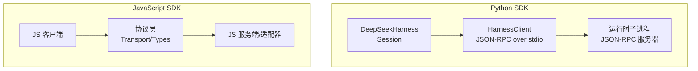
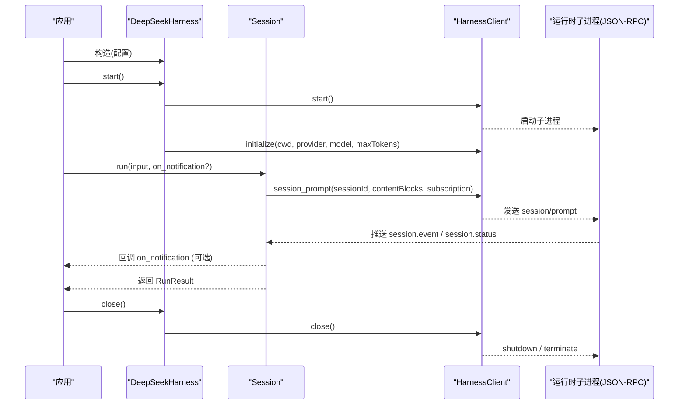
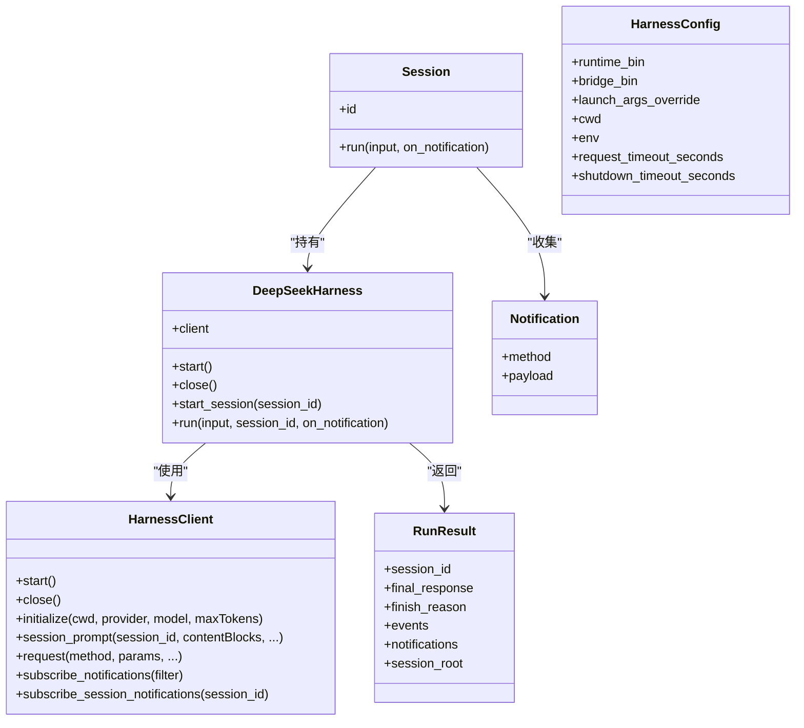
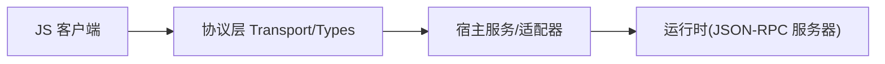
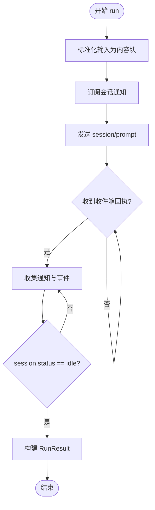
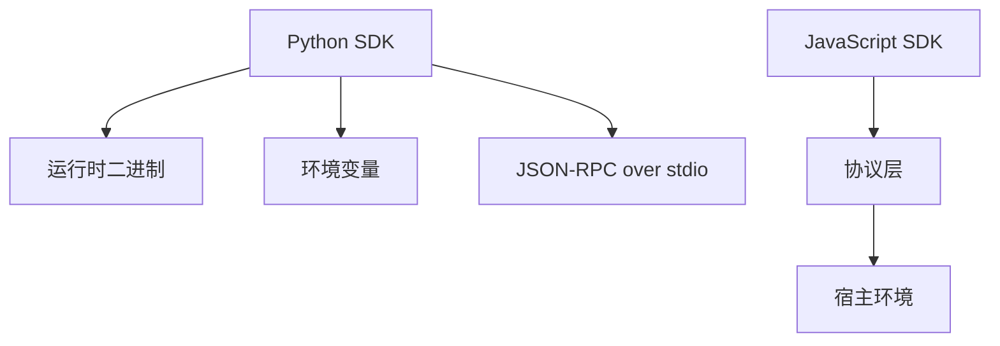

# SDK API

<cite>
**本文引用的文件**
- [python/sdk/src/deepseek_harness/__init__.py](file://python/sdk/src/deepseek_harness/__init__.py)
- [python/sdk/src/deepseek_harness/api.py](file://python/sdk/src/deepseek_harness/api.py)
- [python/sdk/src/deepseek_harness/client.py](file://python/sdk/src/deepseek_harness/client.py)
- [python/sdk/src/deepseek_harness/models.py](file://python/sdk/src/deepseek_harness/models.py)
- [python/sdk/src/deepseek_harness/errors.py](file://python/sdk/src/deepseek_harness/errors.py)
- [python/sdk/README.md](file://python/sdk/README.md)
- [docs/user/guide/python-sdk.md](file://docs/user/guide/python-sdk.md)
- [packages/sdk/client/src/index.ts](file://packages/sdk/client/src/index.ts)
- [packages/sdk/client/src/client.ts](file://packages/sdk/client/src/client.ts)
- [packages/sdk/client/src/api.ts](file://packages/sdk/client/src/api.ts)
- [packages/sdk/client/src/types.ts](file://packages/sdk/client/src/types.ts)
- [packages/sdk/protocol/src/index.ts](file://packages/sdk/protocol/src/index.ts)
- [packages/sdk/protocol/src/transport.ts](file://packages/sdk/protocol/src/transport.ts)
- [packages/sdk/protocol/src/types.ts](file://packages/sdk/protocol/src/types.ts)
- [packages/sdk/server/src/index.ts](file://packages/sdk/server/src/index.ts)
- [packages/sdk/server/src/server.ts](file://packages/sdk/server/src/server.ts)
</cite>

## 目录
1. [简介](#简介)
2. [项目结构](#项目结构)
3. [核心组件](#核心组件)
4. [架构总览](#架构总览)
5. [详细组件分析](#详细组件分析)
6. [依赖关系分析](#依赖关系分析)
7. [性能注意事项](#性能注意事项)
8. [故障排查指南](#故障排查指南)
9. [结论](#结论)
10. [附录](#附录)

## 简介
本文件为 DeepSeek Harness SDK 的 API 文档，覆盖 Python SDK 与 JavaScript SDK 的公共接口、数据模型、事件与错误处理、会话管理、工具注册（通过 Cordis 配置）、异步模式与回调策略，并提供集成示例与迁移建议。Python SDK 通过 JSON-RPC over stdio 驱动本地运行时子进程；JavaScript SDK 提供客户端、协议与服务端实现，便于在 Node.js 或浏览器环境中接入 Harness。

## 项目结构
- Python SDK
  - 入口与导出：[__init__.py](file://python/sdk/src/deepseek_harness/__init__.py)
  - 高层 API：[api.py](file://python/sdk/src/deepseek_harness/api.py)
  - 运行时客户端与传输：[client.py](file://python/sdk/src/deepseek_harness/client.py)
  - 数据模型：[models.py](file://python/sdk/src/deepseek_harness/models.py)
  - 错误类型：[errors.py](file://python/sdk/src/deepseek_harness/errors.py)
  - 使用指南与示例：[README.md](file://python/sdk/README.md)、[python-sdk.md](file://docs/user/guide/python-sdk.md)
- JavaScript SDK
  - 客户端：[client/index.ts](file://packages/sdk/client/src/index.ts)、[client.ts](file://packages/sdk/client/src/client.ts)、[api.ts](file://packages/sdk/client/src/api.ts)、[types.ts](file://packages/sdk/client/src/types.ts)
  - 协议层：[protocol/index.ts](file://packages/sdk/protocol/src/index.ts)、[transport.ts](file://packages/sdk/protocol/src/transport.ts)、[types.ts](file://packages/sdk/protocol/src/types.ts)
  - 服务端：[server/index.ts](file://packages/sdk/server/src/index.ts)、[server.ts](file://packages/sdk/server/src/server.ts)

**图表来源**
- [python/sdk/src/deepseek_harness/api.py:48-124](file://python/sdk/src/deepseek_harness/api.py#L48-L124)
- [python/sdk/src/deepseek_harness/client.py:37-155](file://python/sdk/src/deepseek_harness/client.py#L37-L155)
- [packages/sdk/client/src/client.ts](file://packages/sdk/client/src/client.ts)
- [packages/sdk/protocol/src/transport.ts](file://packages/sdk/protocol/src/transport.ts)

**章节来源**
- [python/sdk/src/deepseek_harness/__init__.py:1-20](file://python/sdk/src/deepseek_harness/__init__.py#L1-L20)
- [python/sdk/README.md:1-52](file://python/sdk/README.md#L1-L52)
- [docs/user/guide/python-sdk.md:1-105](file://docs/user/guide/python-sdk.md#L1-L105)

## 核心组件
- Python SDK
  - DeepSeekHarness：高层同步 API，负责启动/关闭运行时、初始化参数、创建 Session 并执行 run。
  - Session：封装一次会话的运行生命周期，订阅通知、等待空闲状态、汇总结果。
  - RunResult：返回最终响应、结束原因、事件与通知列表。
  - HarnessConfig / DeepSeekHarnessConfig：控制运行时路径、工作目录、环境变量、超时等。
  - HarnessClient：底层 JSON-RPC 客户端，管理子进程、读写线程、请求/通知队列与订阅。
  - NotificationSubscription：会话级通知订阅器，支持 next/drain/close。
- JavaScript SDK
  - 客户端：封装连接、方法调用、事件监听、资源释放。
  - 协议层：定义消息类型、传输抽象与序列化。
  - 服务端：暴露 RPC 方法与通知通道，供宿主应用集成。

**章节来源**
- [python/sdk/src/deepseek_harness/api.py:13-183](file://python/sdk/src/deepseek_harness/api.py#L13-L183)
- [python/sdk/src/deepseek_harness/client.py:24-210](file://python/sdk/src/deepseek_harness/client.py#L24-L210)
- [python/sdk/src/deepseek_harness/models.py:8-33](file://python/sdk/src/deepseek_harness/models.py#L8-L33)
- [packages/sdk/client/src/client.ts](file://packages/sdk/client/src/client.ts)
- [packages/sdk/protocol/src/types.ts](file://packages/sdk/protocol/src/types.ts)

## 架构总览
Python SDK 以“进程内对象 + 子进程运行时”的方式运行 Agent。调用方通过上下文管理器或显式 close 管理生命周期；内部通过 JSON-RPC 发送 initialize、session/prompt 等方法，并基于 session.status 与 session.event 完成活动边界判定。JavaScript SDK 提供跨语言一致的协议与客户端/服务端抽象，便于在 Web/Node 中集成。

**图表来源**
- [python/sdk/src/deepseek_harness/api.py:97-183](file://python/sdk/src/deepseek_harness/api.py#L97-L183)
- [python/sdk/src/deepseek_harness/client.py:63-155](file://python/sdk/src/deepseek_harness/client.py#L63-L155)

## 详细组件分析

### Python SDK 类与方法
- DeepSeekHarness
  - 构造：接受 DeepSeekHarnessConfig 或关键字参数；自动注入环境变量（如 DSH_SESSION_ROOT、DSH_CORDIS_CONFIG、DEEPSEEK_BASE_URL、DEEPSEEK_API_KEY）。
  - start/close：懒启动运行时，initialize 后标记已初始化；close 清理子进程与状态。
  - start_session/run：创建 Session 或直接执行 run，委托给 Session.run。
- Session
  - run：将输入标准化为内容块，订阅会话通知，发送 session/prompt，等待收到收件箱回执与 idle 状态，提取 final_response 与 finish_reason。
  - 事件收集：仅收集根会话事件用于解析最终响应与结束原因。
- HarnessClient
  - 启动与关闭：默认从打包运行时解析启动参数；支持自定义 runtime_bin/bridge_bin/launch_args_override。
  - 请求/通知：request/notify/subscribe_notifications/subscribe_session_notifications；支持过滤与订阅者队列。
  - 超时与诊断：请求超时抛出 TimeoutError；失败时附带 stderr 尾部与退出码。
  - 会话树：记录 subagent.started/finished 的父子关系，以便按会话树过滤通知。
- 数据模型
  - Notification/IncomingRequest/ServerInfo/InitializeResponse：描述通知、入站请求与初始化响应。
- 错误类型
  - HarnessError、TransportClosedError、SdkProtocolError、JsonRpcError：统一异常体系。

**图表来源**
- [python/sdk/src/deepseek_harness/api.py:13-183](file://python/sdk/src/deepseek_harness/api.py#L13-L183)
- [python/sdk/src/deepseek_harness/client.py:24-210](file://python/sdk/src/deepseek_harness/client.py#L24-L210)
- [python/sdk/src/deepseek_harness/models.py:13-33](file://python/sdk/src/deepseek_harness/models.py#L13-L33)

**章节来源**
- [python/sdk/src/deepseek_harness/api.py:13-243](file://python/sdk/src/deepseek_harness/api.py#L13-L243)
- [python/sdk/src/deepseek_harness/client.py:24-558](file://python/sdk/src/deepseek_harness/client.py#L24-L558)
- [python/sdk/src/deepseek_harness/models.py:8-33](file://python/sdk/src/deepseek_harness/models.py#L8-L33)
- [python/sdk/src/deepseek_harness/errors.py:4-24](file://python/sdk/src/deepseek_harness/errors.py#L4-L24)

### JavaScript SDK 客户端与协议
- 客户端
  - 提供连接管理、RPC 调用、事件订阅、资源释放（dispose）能力。
  - 通过类型化接口与协议层解耦传输细节。
- 协议层
  - 定义消息结构、传输抽象（Transport）与通用类型（types），确保跨语言一致性。
- 服务端
  - 暴露 RPC 方法与通知通道，便于宿主应用桥接业务逻辑。

**图表来源**
- [packages/sdk/client/src/client.ts](file://packages/sdk/client/src/client.ts)
- [packages/sdk/protocol/src/transport.ts](file://packages/sdk/protocol/src/transport.ts)
- [packages/sdk/server/src/server.ts](file://packages/sdk/server/src/server.ts)

**章节来源**
- [packages/sdk/client/src/index.ts](file://packages/sdk/client/src/index.ts)
- [packages/sdk/client/src/client.ts](file://packages/sdk/client/src/client.ts)
- [packages/sdk/client/src/api.ts](file://packages/sdk/client/src/api.ts)
- [packages/sdk/client/src/types.ts](file://packages/sdk/client/src/types.ts)
- [packages/sdk/protocol/src/index.ts](file://packages/sdk/protocol/src/index.ts)
- [packages/sdk/protocol/src/transport.ts](file://packages/sdk/protocol/src/transport.ts)
- [packages/sdk/protocol/src/types.ts](file://packages/sdk/protocol/src/types.ts)
- [packages/sdk/server/src/index.ts](file://packages/sdk/server/src/index.ts)
- [packages/sdk/server/src/server.ts](file://packages/sdk/server/src/server.ts)

### 会话管理与事件流
- 会话创建：DeepSeekHarness.start_session 或 run 内部隐式创建。
- 事件边界：等待收件箱回执与 session.status=idle 作为活动区间结束。
- 通知订阅：支持全局订阅与会话树订阅，自动包含子代理会话的通知。
- 结果解析：从事件中提取最后一条 assistant/message 文本作为 final_response；从 turn/end 事件提取 finish_reason。

**图表来源**
- [python/sdk/src/deepseek_harness/api.py:132-183](file://python/sdk/src/deepseek_harness/api.py#L132-L183)

**章节来源**
- [python/sdk/src/deepseek_harness/api.py:132-183](file://python/sdk/src/deepseek_harness/api.py#L132-L183)

### 工具注册与插件组合
- 工具注册通过 Cordis 配置文件声明，Python SDK 通过 DSH_CORDIS_CONFIG 注入配置路径。
- 默认组合包含 JSON-RPC 服务器、Agent 核心、预置 LLM 适配、JSONL 持久化与本地 Bash。
- 自定义组合可挂载第三方 LLM 提供商或工具集，并在配置中选择 provider/model。

**章节来源**
- [python/sdk/README.md:27-43](file://python/sdk/README.md#L27-L43)
- [docs/user/guide/python-sdk.md:83-104](file://docs/user/guide/python-sdk.md#L83-L104)

### 错误处理与调试
- 传输错误：TransportClosedError 表示运行时子进程退出或 stdout 关闭。
- 协议错误：SdkProtocolError 表示运行时数据不符合 SDK 协议约定（例如 turn/end 缺少 reason.kind）。
- JSON-RPC 错误：JsonRpcError 携带 code/message/data。
- 超时：请求超时抛出 TimeoutError，并附带 stderr 尾部与退出码用于诊断。

**章节来源**
- [python/sdk/src/deepseek_harness/errors.py:4-24](file://python/sdk/src/deepseek_harness/errors.py#L4-L24)
- [python/sdk/src/deepseek_harness/client.py:258-296](file://python/sdk/src/deepseek_harness/client.py#L258-L296)
- [python/sdk/src/deepseek_harness/client.py:386-422](file://python/sdk/src/deepseek_harness/client.py#L386-L422)
- [python/sdk/src/deepseek_harness/api.py:225-242](file://python/sdk/src/deepseek_harness/api.py#L225-L242)

## 依赖关系分析
- Python SDK 依赖
  - 运行时二进制：deepseek-harness-runtime-bin（可通过 resolve_bundled_launch_args 获取）。
  - 环境变量：DEEPSEEK_API_KEY、DEEPSEEK_BASE_URL、DSH_SESSION_ROOT、DSH_CORDIS_CONFIG、DSH_CWD。
  - 子进程通信：JSON-RPC over stdio。
- JavaScript SDK 依赖
  - 协议层：Transport/Types 抽象，屏蔽具体传输介质。
  - 宿主环境：Node.js 或浏览器中的 I/O 与事件机制。

**图表来源**
- [python/sdk/src/deepseek_harness/client.py:424-454](file://python/sdk/src/deepseek_harness/client.py#L424-L454)
- [packages/sdk/protocol/src/transport.ts](file://packages/sdk/protocol/src/transport.ts)

**章节来源**
- [python/sdk/src/deepseek_harness/client.py:424-454](file://python/sdk/src/deepseek_harness/client.py#L424-L454)
- [packages/sdk/protocol/src/types.ts](file://packages/sdk/protocol/src/types.ts)

## 性能注意事项
- 复用 Harness 实例：避免频繁启动/关闭子进程，提升吞吐。
- 合理设置超时：根据任务复杂度调整 request_timeout_seconds。
- 控制会话粒度：独立任务使用新 session_id；延续对话复用 session_id。
- 减少不必要的事件处理：仅在需要时启用 on_notification。
- 注意子代理通知范围：使用 subscribe_session_notifications 按会话树过滤，降低无关事件开销。

## 故障排查指南
- 无法定位运行时：安装 deepseek-harness-runtime-bin 或设置 HarnessConfig.runtime_bin。
- 子进程崩溃：检查 stderr 尾部与退出码；确认 DSH_CORDIS_CONFIG 指向有效配置。
- 超时：查看是否长时间无 session.status=idle；必要时增加超时或优化任务。
- 协议不一致：关注 turn/end 事件的 reason.kind；若缺失会抛出 SdkProtocolError。
- 权限与环境：确保 cwd/session_root 为绝对路径；必要时注入 DEEPSEEK_BASE_URL/DEEPSEEK_API_KEY。

**章节来源**
- [python/sdk/src/deepseek_harness/client.py:424-454](file://python/sdk/src/deepseek_harness/client.py#L424-L454)
- [python/sdk/src/deepseek_harness/client.py:386-422](file://python/sdk/src/deepseek_harness/client.py#L386-L422)
- [python/sdk/src/deepseek_harness/api.py:225-242](file://python/sdk/src/deepseek_harness/api.py#L225-L242)

## 结论
DeepSeek Harness SDK 提供了跨语言的 Agent 驱动能力：Python SDK 通过轻量进程与 JSON-RPC 高效执行任务；JavaScript SDK 提供一致协议与客户端/服务端抽象，便于在多种环境中集成。借助会话管理、事件订阅与完善的错误处理，开发者可以稳定地将 Harness 嵌入现有系统。

## 附录

### Python SDK 快速集成示例
- 安装与运行：参考教程与 README。
- 基本用法：使用上下文管理器管理 Harness 生命周期，调用 run 提交任务。
- 自定义配置：通过 DeepSeekHarnessConfig 指定 provider/model/max_tokens/cordis/cwd/session_root/env 等。

**章节来源**
- [docs/user/guide/python-sdk.md:15-81](file://docs/user/guide/python-sdk.md#L15-L81)
- [python/sdk/README.md:10-43](file://python/sdk/README.md#L10-L43)

### JavaScript SDK 集成要点
- 引入客户端与协议层，建立连接并调用 RPC 方法。
- 使用事件订阅接收通知，结合 dispose 管理资源。
- 在服务端暴露必要方法，桥接到宿主业务逻辑。

**章节来源**
- [packages/sdk/client/src/index.ts](file://packages/sdk/client/src/index.ts)
- [packages/sdk/client/src/client.ts](file://packages/sdk/client/src/client.ts)
- [packages/sdk/server/src/server.ts](file://packages/sdk/server/src/server.ts)

### 版本兼容性与迁移指南
- Python SDK
  - 要求 Python 3.10+；推荐通过 PyPI 安装 deepseek-harness-sdk，以获得同版本运行时。
  - 迁移建议：保持 DSH_CORDIS_CONFIG 指向最新组合；关注 turn/end 协议约束。
- JavaScript SDK
  - 遵循协议层版本；升级时需保证客户端与服务端类型一致。
  - 迁移建议：优先使用类型化接口与 dispose 管理资源；避免直接操作底层传输。

**章节来源**
- [docs/user/guide/python-sdk.md:7-27](file://docs/user/guide/python-sdk.md#L7-L27)
- [python/sdk/README.md:10-52](file://python/sdk/README.md#L10-L52)