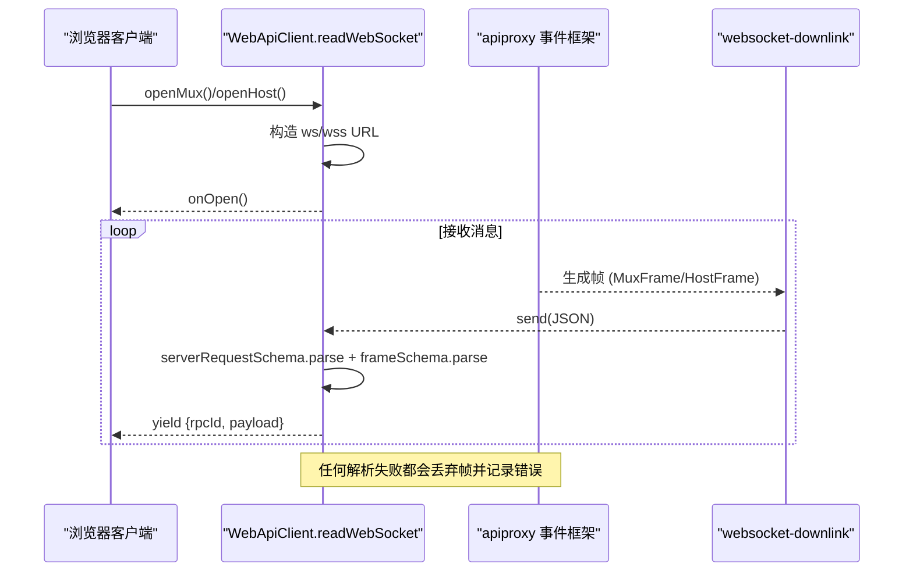
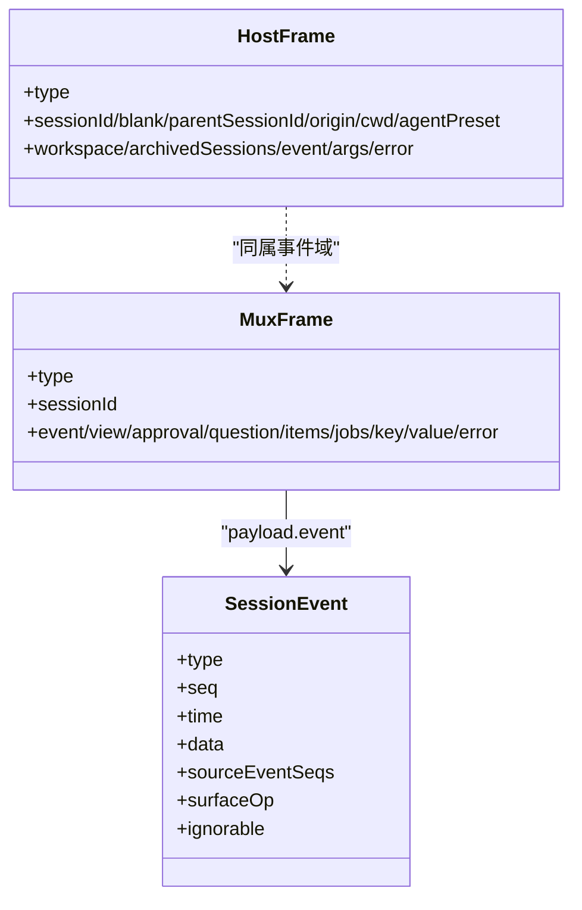
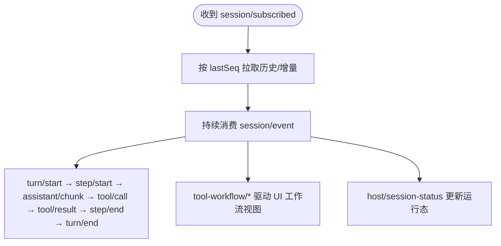
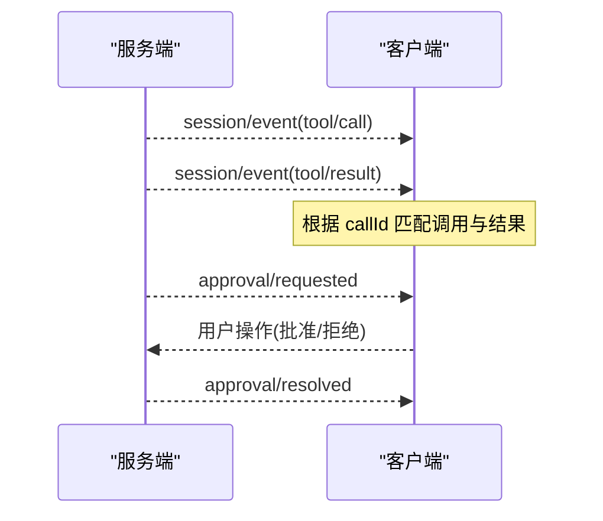
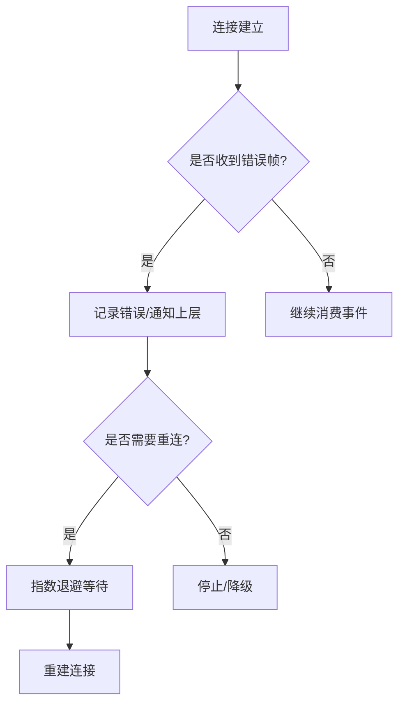
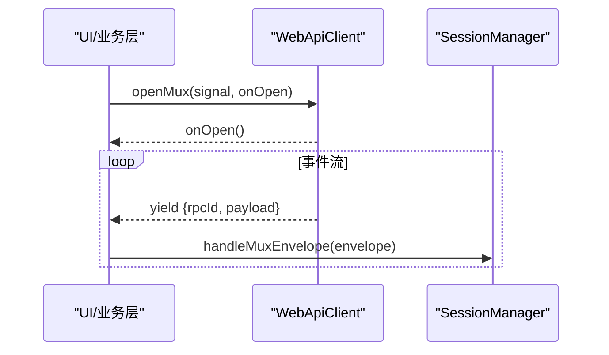
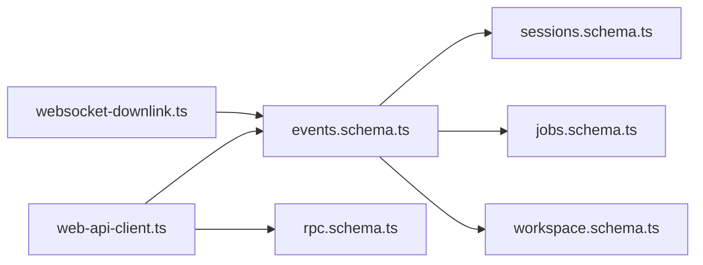

# WebSocket API

<cite>
**本文引用的文件**
- [packages/client/connection/src/client/web-api-client.ts](file://packages/client/connection/src/client/web-api-client.ts)
- [packages/host/apiproxy/src/api/events.schema.ts](file://packages/host/apiproxy/src/api/events.schema.ts)
- [packages/host/apiproxy/src/api/sessions.schema.ts](file://packages/host/apiproxy/src/api/sessions.schema.ts)
- [packages/client/connection/src/websocket-downlink.ts](file://packages/client/connection/src/websocket-downlink.ts)
- [packages/workflow/tool-workflow/src/types.ts](file://packages/workflow/tool-workflow/src/types.ts)
- [packages/workflow/tool-workflow/src/index.ts](file://packages/workflow/tool-workflow/src/index.ts)
- [packages/client/runtime/src/client/sessions/service.ts](file://packages/client/runtime/src/client/sessions/service.ts)
- [packages/client/runtime/src/client/sessions/tool-call-tree.ts](file://packages/client/runtime/src/client/sessions/tool-call-tree.ts)
- [packages/mcp/mcp-client/src/connection.ts](file://packages/mcp/mcp-client/src/connection.ts)
- [docs/subsystems/web-server.md](file://docs/subsystems/web-server.md)
</cite>

## 目录
1. [简介](#简介)
2. [项目结构](#项目结构)
3. [核心组件](#核心组件)
4. [架构总览](#架构总览)
5. [详细组件分析](#详细组件分析)
6. [依赖关系分析](#依赖关系分析)
7. [性能考虑](#性能考虑)
8. [故障排查指南](#故障排查指南)
9. [结论](#结论)
10. [附录](#附录)

## 简介
本文件为 DeepSeek Harness 的 WebSocket API 完整技术文档，聚焦于浏览器端与宿主（Host）之间的实时通信。内容涵盖：
- WebSocket 连接建立、升级与生命周期管理
- 消息协议格式（MuxFrame/HostFrame）、事件类型与实时通信模式
- 会话事件流、Agent 状态变更、工具执行进度、用户交互等消息
- 连接管理、重连机制、错误处理与心跳检测建议
- 客户端连接示例、消息订阅模式与事件处理流程
- 消息序列化/反序列化规则与版本兼容性策略

## 项目结构
WebSocket 能力由“客户端连接层”和“宿主代理层”共同实现：
- 客户端连接层：在浏览器中通过 WebApiClient 打开两个 downlink-only 的 WebSocket 通道，分别用于 Mux 事件流与 Host 事件流。
- 宿主代理层：定义并校验所有帧（frame）的结构，包括会话事件、审批、问题、队列、工作项、投影等；同时提供 RPC 请求封装与错误帧。

```mermaid
graph TB
subgraph "浏览器"
A["WebApiClient<br/>openMux/openHost"] --> B["readWebSocket()<br/>解析 ServerRequest + Frame"]
end
subgraph "宿主"
C["apiproxy 事件框架<br/>events.schema.ts"]
D["sessions.schema.ts<br/>SessionEvent 透传"]
E["websocket-downlink.ts<br/>发送/失败帧/关闭"]
end
B < --> |ws/wss JSON| C
C --> D
C --> E
```

图表来源
- [packages/client/connection/src/client/web-api-client.ts:28-42](file://packages/client/connection/src/client/web-api-client.ts#L28-L42)
- [packages/host/apiproxy/src/api/events.schema.ts:42-93](file://packages/host/apiproxy/src/api/events.schema.ts#L42-L93)
- [packages/host/apiproxy/src/api/sessions.schema.ts:40-49](file://packages/host/apiproxy/src/api/sessions.schema.ts#L40-L49)
- [packages/client/connection/src/websocket-downlink.ts:118-137](file://packages/client/connection/src/websocket-downlink.ts#L118-L137)

章节来源
- [docs/subsystems/web-server.md:1-109](file://docs/subsystems/web-server.md#L1-L109)

## 核心组件
- WebApiClient（浏览器端）
  - 负责基于 fetch 的 HTTP 调用以及基于 WebSocket 的事件流订阅（Mux/Host）。
  - 将接收到的二进制或非法 JSON 帧丢弃并记录错误，保证健壮性。
  - 使用 AbortSignal 控制流的生命周期，并在关闭时清理监听器。
- apiproxy 事件框架（宿主端）
  - 定义 MuxFrame 与 HostFrame 的严格 schema，确保跨进程传输安全。
  - SessionEvent 采用“严格信封 + 宽数据”透传，允许扩展而不破坏契约。
- websocket-downlink（宿主端）
  - 将异步帧序列写入 WebSocket，异常时发送 failureFrame，最终关闭 socket。
  - 提供拒绝未信任升级的能力（HTTP 403）。

章节来源
- [packages/client/connection/src/client/web-api-client.ts:1-102](file://packages/client/connection/src/client/web-api-client.ts#L1-L102)
- [packages/host/apiproxy/src/api/events.schema.ts:1-94](file://packages/host/apiproxy/src/api/events.schema.ts#L1-L94)
- [packages/host/apiproxy/src/api/sessions.schema.ts:1-355](file://packages/host/apiproxy/src/api/sessions.schema.ts#L1-L355)
- [packages/client/connection/src/websocket-downlink.ts:118-153](file://packages/client/connection/src/websocket-downlink.ts#L118-L153)

## 架构总览
下图展示了从浏览器发起连接到接收事件流的端到端流程，包括 Mux 与 Host 两条独立通道。



图表来源
- [packages/client/connection/src/client/web-api-client.ts:44-100](file://packages/client/connection/src/client/web-api-client.ts#L44-L100)
- [packages/host/apiproxy/src/api/events.schema.ts:42-93](file://packages/host/apiproxy/src/api/events.schema.ts#L42-L93)
- [packages/client/connection/src/websocket-downlink.ts:118-137](file://packages/client/connection/src/websocket-downlink.ts#L118-L137)

## 详细组件分析

### 连接建立与消息协议
- 连接建立
  - 浏览器端通过 WebApiClient.openMux/openHost 打开两个独立的 WebSocket 通道，路径分别为 MUX_EVENTS_PATH 与 HOST_EVENTS_PATH。
  - readWebSocket 内部根据当前页面协议自动选择 ws/wss，创建 WebSocket，注册 open/message/close/abort 事件。
  - 收到消息后先以 serverRequestSchema 解析外层信封，再以 frameSchema 解析 payload，成功后再交给上层。
- 消息协议
  - MuxFrame：包含 session/event、session/subscribed、approval/*、question/*、session/queue、session/jobs、session/projection、stream/error 等。
  - HostFrame：包含 host/session-added/removed/status、host/agent-error、host/workspace-*、host/archived-sessions-changed、host/remote-event、stream/error 等。
  - SessionEvent：采用“严格信封（type/seq/time）+ 宽数据（data 未知）”的透传方式，便于扩展。



图表来源
- [packages/host/apiproxy/src/api/events.schema.ts:42-93](file://packages/host/apiproxy/src/api/events.schema.ts#L42-L93)
- [packages/host/apiproxy/src/api/sessions.schema.ts:40-49](file://packages/host/apiproxy/src/api/sessions.schema.ts#L40-L49)

章节来源
- [packages/client/connection/src/client/web-api-client.ts:28-100](file://packages/client/connection/src/client/web-api-client.ts#L28-L100)
- [packages/host/apiproxy/src/api/events.schema.ts:1-94](file://packages/host/apiproxy/src/api/events.schema.ts#L1-L94)
- [packages/host/apiproxy/src/api/sessions.schema.ts:1-355](file://packages/host/apiproxy/src/api/sessions.schema.ts#L1-L355)

### 会话事件流与 Agent 状态
- 会话事件
  - 通过 MuxFrame.session/event 推送 SessionEvent，包含 turn/start/end、step/start/end、user/message、assistant/chunk、assistant/message、tool/call、tool/result、todo/write、request/header/context、session/end-seed 等。
  - session/subscribed 携带 lastSeq，用于客户端增量同步。
- Agent 状态与工作流
  - HostFrame.host/session-status 反映会话运行状态。
  - tool-workflow/* 事件（run-start/agent-start/agent-end/run-end）描述工作流与子 Agent 的执行生命周期。



图表来源
- [packages/host/apiproxy/src/api/events.schema.ts:42-67](file://packages/host/apiproxy/src/api/events.schema.ts#L42-L67)
- [packages/workflow/tool-workflow/src/types.ts:41-64](file://packages/workflow/tool-workflow/src/types.ts#L41-L64)
- [packages/workflow/tool-workflow/src/index.ts:95-131](file://packages/workflow/tool-workflow/src/index.ts#L95-L131)

章节来源
- [packages/host/apiproxy/src/api/events.schema.ts:42-93](file://packages/host/apiproxy/src/api/events.schema.ts#L42-L93)
- [packages/workflow/tool-workflow/src/types.ts:41-64](file://packages/workflow/tool-workflow/src/types.ts#L41-L64)
- [packages/workflow/tool-workflow/src/index.ts:95-131](file://packages/workflow/tool-workflow/src/index.ts#L95-L131)

### 工具执行进度与用户交互
- 工具执行
  - tool/call 与 tool/result 成对出现，callId 关联调用与结果。
  - tool-call-tree 根据 tool/code-dispatch* 事件维护调用树，支持父子调用与结果聚合。
- 用户交互
  - approval/requested/resolved：审批请求与结果。
  - question/requested/resolved：向用户提问与回答。
  - session/queue：消息入队/编排（queued/steering/context）。



图表来源
- [packages/host/apiproxy/src/api/events.schema.ts:42-67](file://packages/host/apiproxy/src/api/events.schema.ts#L42-L67)
- [packages/client/runtime/src/client/sessions/tool-call-tree.ts:52-86](file://packages/client/runtime/src/client/sessions/tool-call-tree.ts#L52-L86)

章节来源
- [packages/host/apiproxy/src/api/events.schema.ts:42-67](file://packages/host/apiproxy/src/api/events.schema.ts#L42-L67)
- [packages/client/runtime/src/client/sessions/tool-call-tree.ts:52-86](file://packages/client/runtime/src/client/sessions/tool-call-tree.ts#L52-L86)

### 连接管理与重连机制
- 连接生命周期
  - 浏览器端通过 AbortSignal 控制流的生命周期；close/abort 会触发 finally 清理并关闭 socket。
  - 宿主端 pump 循环在异常时发送 failureFrame，并最终关闭 socket。
- 重连策略
  - 代码库中存在指数退避的重连逻辑（参考 MCP 客户端），可作为 WebSocket 重连的实现参考：初始延迟、最大重试次数、超时与日志。
- 建议的心跳检测
  - 可在应用层引入 ping/pong 或周期性保活消息，结合 stream/error 事件进行断线检测与恢复。



图表来源
- [packages/client/connection/src/websocket-downlink.ts:118-137](file://packages/client/connection/src/websocket-downlink.ts#L118-L137)
- [packages/mcp/mcp-client/src/connection.ts:214-225](file://packages/mcp/mcp-client/src/connection.ts#L214-L225)

章节来源
- [packages/client/connection/src/client/web-api-client.ts:75-100](file://packages/client/connection/src/client/web-api-client.ts#L75-L100)
- [packages/client/connection/src/websocket-downlink.ts:118-153](file://packages/client/connection/src/websocket-downlink.ts#L118-L153)
- [packages/mcp/mcp-client/src/connection.ts:214-225](file://packages/mcp/mcp-client/src/connection.ts#L214-L225)

### 错误处理与健壮性
- 客户端
  - 非字符串帧或解析失败直接丢弃并记录错误，避免崩溃。
- 服务端
  - 发送失败时尝试发送 failureFrame；若已丢失下游则忽略。
  - 拒绝未信任的升级请求（HTTP 403）。
- 统一错误帧
  - stream/error 作为通用错误通道，承载 rpcErrorSchema 定义的错误信息。

章节来源
- [packages/client/connection/src/client/web-api-client.ts:61-73](file://packages/client/connection/src/client/web-api-client.ts#L61-L73)
- [packages/client/connection/src/websocket-downlink.ts:123-137](file://packages/client/connection/src/websocket-downlink.ts#L123-L137)
- [packages/host/apiproxy/src/api/events.schema.ts:62-67](file://packages/host/apiproxy/src/api/events.schema.ts#L62-L67)

### 客户端连接示例与事件处理
- 连接示例
  - 通过 WebApiClient.openMux/openHost 打开两个 WebSocket 通道，分别订阅 Mux 与 Host 事件。
  - 使用 AbortController.signal 控制订阅生命周期，onOpen 回调可用于初始化 UI。
- 事件处理
  - 在 readWebSocket 中，每个消息被解析为 RpcRequest<F>，上层可依据 type 分派到不同处理器。
  - 会话服务层提供 handleMuxEnvelope/handleHostEnvelope 将 envelope 路由到 SessionManager。



图表来源
- [packages/client/connection/src/client/web-api-client.ts:28-42](file://packages/client/connection/src/client/web-api-client.ts#L28-L42)
- [packages/client/runtime/src/client/sessions/service.ts:448-467](file://packages/client/runtime/src/client/sessions/service.ts#L448-L467)

章节来源
- [packages/client/connection/src/client/web-api-client.ts:28-100](file://packages/client/connection/src/client/web-api-client.ts#L28-L100)
- [packages/client/runtime/src/client/sessions/service.ts:426-467](file://packages/client/runtime/src/client/sessions/service.ts#L426-L467)

### 消息序列化与版本兼容
- 序列化
  - 所有帧均为 JSON 文本；客户端仅接受 string 类型帧，二进制帧将被丢弃。
  - 外层使用 serverRequestSchema 包裹，内层 payload 使用对应 frameSchema 校验。
- 反序列化
  - 使用 Zod schema 严格校验字段类型与约束；未知类型分支保持宽数据以支持扩展。
- 版本兼容
  - SessionEvent.data 为 unknown，允许新增事件类型与字段而不破坏旧客户端。
  - 新增 frame 类型需加入 discriminatedUnion，否则会被拒绝，从而保证向后兼容。

章节来源
- [packages/client/connection/src/client/web-api-client.ts:61-73](file://packages/client/connection/src/client/web-api-client.ts#L61-L73)
- [packages/host/apiproxy/src/api/events.schema.ts:42-93](file://packages/host/apiproxy/src/api/events.schema.ts#L42-L93)
- [packages/host/apiproxy/src/api/sessions.schema.ts:40-49](file://packages/host/apiproxy/src/api/sessions.schema.ts#L40-L49)

## 依赖关系分析
- 客户端依赖
  - web-api-client.ts 依赖 events.schema 中的 muxFrameSchema/hostFrameSchema 与 rpc.schema 中的 serverRequestSchema。
  - 通过 API_PATH 常量确定事件流路径。
- 宿主依赖
  - events.schema.ts 依赖 sessions.schema.ts（SessionEvent 透传）、jobs.schema.ts（任务视图）、workspace.schema.ts（工作区视图）等。
  - websocket-downlink.ts 负责将帧写入 socket，并在异常时发送 failureFrame。



图表来源
- [packages/client/connection/src/client/web-api-client.ts:1-10](file://packages/client/connection/src/client/web-api-client.ts#L1-L10)
- [packages/host/apiproxy/src/api/events.schema.ts:1-18](file://packages/host/apiproxy/src/api/events.schema.ts#L1-L18)
- [packages/client/connection/src/websocket-downlink.ts:118-153](file://packages/client/connection/src/websocket-downlink.ts#L118-L153)

章节来源
- [packages/client/connection/src/client/web-api-client.ts:1-102](file://packages/client/connection/src/client/web-api-client.ts#L1-L102)
- [packages/host/apiproxy/src/api/events.schema.ts:1-94](file://packages/host/apiproxy/src/api/events.schema.ts#L1-L94)
- [packages/client/connection/src/websocket-downlink.ts:118-153](file://packages/client/connection/src/websocket-downlink.ts#L118-L153)

## 性能考虑
- 低开销解析
  - 使用 Zod schema 进行快速校验，避免深层重复验证；对宽数据（如 SessionEvent.data）保持 passthrough，减少导入与解析成本。
- 背压与缓冲
  - 客户端使用 inbox 队列与 wake Promise 协调消息消费，避免阻塞事件循环。
- 批量与分页
  - session/subscribed.lastSeq 支持增量同步；session.history 支持分页拉取，降低首屏压力。
- 资源释放
  - 及时移除事件监听器并关闭 socket，防止内存泄漏与悬挂连接。

[本节为通用指导，不直接分析具体文件]

## 故障排查指南
- 常见错误
  - 二进制帧：客户端仅接受字符串帧，遇到二进制将丢弃并记录错误。
  - 解析失败：serverRequestSchema/frameSchema 校验失败将被丢弃，检查上游是否发送了正确结构的 JSON。
  - 发送失败：宿主端尝试发送 failureFrame；若下游已断开则忽略。
- 定位步骤
  - 检查浏览器控制台错误日志（malformed WebSocket frame）。
  - 检查 stream/error 事件中的错误码与消息。
  - 确认 lastSeq 与历史拉取是否一致，避免事件丢失。
- 恢复策略
  - 基于 stream/error 触发重连；必要时重置 lastSeq 并重新订阅。

章节来源
- [packages/client/connection/src/client/web-api-client.ts:61-73](file://packages/client/connection/src/client/web-api-client.ts#L61-L73)
- [packages/host/apiproxy/src/api/events.schema.ts:62-67](file://packages/host/apiproxy/src/api/events.schema.ts#L62-L67)
- [packages/client/connection/src/websocket-downlink.ts:123-137](file://packages/client/connection/src/websocket-downlink.ts#L123-L137)

## 结论
DeepSeek Harness 的 WebSocket API 通过严格的 schema 校验与清晰的通道划分（Mux/Host），提供了稳定可扩展的实时通信能力。客户端与服务端均具备完善的错误处理与资源管理机制。借助 session/subscribed.lastSeq 与 session.history，可实现高效增量同步。建议在应用层补充心跳检测与指数退避重连，以提升网络波动下的鲁棒性。

[本节为总结，不直接分析具体文件]

## 附录
- 关键事件速查
  - 会话：turn/start、turn/end、step/start、step/end、user/message、assistant/chunk、assistant/message、tool/call、tool/result、todo/write、request/header/context、session/end-seed
  - 审批：approval/requested、approval/resolved
  - 问答：question/requested、question/resolved
  - 队列：session/queue（queued/steering/context）
  - 工作项：session/jobs
  - 投影：session/projection
  - 主机事件：host/session-added/removed/status、host/agent-error、host/workspace-*、host/archived-sessions-changed、host/remote-event
  - 错误：stream/error

[本节为概念性汇总，不直接分析具体文件]