# 插件 API

<cite>
**本文引用的文件**
- [context.md](file://docs/cordis-api/context.md)
- [events.md](file://docs/cordis-api/events.md)
- [registry.md](file://docs/cordis-api/registry.md)
- [service.md](file://docs/cordis-api/service.md)
- [fiber.md](file://docs/cordis-api/fiber.md)
- [01-first-plugin.md](file://docs/cordis-tutorial/01-first-plugin.md)
- [02-lifecycle-and-effects.md](file://docs/cordis-tutorial/02-lifecycle-and-effects.md)
- [03-services.md](file://docs/cordis-tutorial/03-services.md)
- [adding-a-tool.md](file://docs/cookbook/adding-a-tool.md)
- [adding-an-llm-adapter.md](file://docs/cookbook/adding-an-llm-adapter.md)
- [permission-presets.md](file://docs/subsystems/permission-presets.md)
- [sandbox.md](file://docs/subsystems/sandbox.md)
</cite>

## 目录
1. [简介](#简介)
2. [项目结构](#项目结构)
3. [核心组件](#核心组件)
4. [架构总览](#架构总览)
5. [详细组件分析](#详细组件分析)
6. [依赖关系分析](#依赖关系分析)
7. [性能考虑](#性能考虑)
8. [故障排查指南](#故障排查指南)
9. [结论](#结论)
10. [附录](#附录)

## 简介
本参考文档面向 DeepSeek Harness 的插件系统，基于 Cordis 框架提供的能力，系统化说明以下主题：
- 插件生命周期钩子与效果管理（Fiber、Effect）
- 服务注册与依赖注入（Service、Inject、Context）
- 事件系统与分发模式（Events）
- 插件类型开发接口：工具插件、LLM 适配器、文件系统提供者等
- 插件配置、权限控制、沙箱环境与调试支持
- 插件打包、发布与版本管理机制（结合仓库中的示例与约定）

本参考以“从简单到复杂”的方式组织内容，帮助读者快速上手并深入理解插件体系。

## 项目结构
DeepSeek Harness 采用多包工作区组织，Cordis 作为插件与依赖注入内核，位于 vendor/cordis；Harness 各子系统通过 Cordis 暴露服务与事件；教程与手册位于 docs 目录，cookbook 提供具体插件实现指引。

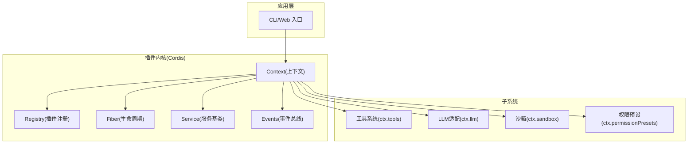

图表来源
- [context.md:1-163](file://docs/cordis-api/context.md#L1-L163)
- [registry.md:1-153](file://docs/cordis-api/registry.md#L1-L153)
- [fiber.md:1-120](file://docs/cordis-api/fiber.md#L1-L120)
- [service.md:1-103](file://docs/cordis-api/service.md#L1-L103)
- [events.md:1-208](file://docs/cordis-api/events.md#L1-L208)

章节来源
- [context.md:1-163](file://docs/cordis-api/context.md#L1-L163)
- [registry.md:1-153](file://docs/cordis-api/registry.md#L1-L153)
- [fiber.md:1-120](file://docs/cordis-api/fiber.md#L1-L120)
- [service.md:1-103](file://docs/cordis-api/service.md#L1-L103)
- [events.md:1-208](file://docs/cordis-api/events.md#L1-L208)

## 核心组件
- Context（上下文）：插件访问所有能力的统一入口，提供 get/provide/accessor/mixin/isolate/extend/intercept 等方法，以及 events/logger/reflect/registry 等内置服务。
- Registry（插件注册器）：加载插件、声明依赖 inject、提供 provide、拦截配置 intercept。
- Fiber（生命周期）：每个插件实例的生命周期状态机、effect 注册、配置更新与重启、错误处理。
- Service（服务基类）：用于将能力以命名服务形式暴露给其他插件消费。
- Events（事件系统）：提供 emit/parallel/serial/bail/waterfall/on/once 等分发模式与监听机制。

章节来源
- [context.md:1-163](file://docs/cordis-api/context.md#L1-L163)
- [registry.md:1-153](file://docs/cordis-api/registry.md#L1-L153)
- [fiber.md:1-120](file://docs/cordis-api/fiber.md#L1-L120)
- [service.md:1-103](file://docs/cordis-api/service.md#L1-L103)
- [events.md:1-208](file://docs/cordis-api/events.md#L1-L208)

## 架构总览
下图展示了插件加载、依赖解析、服务注册与事件分发的整体流程。

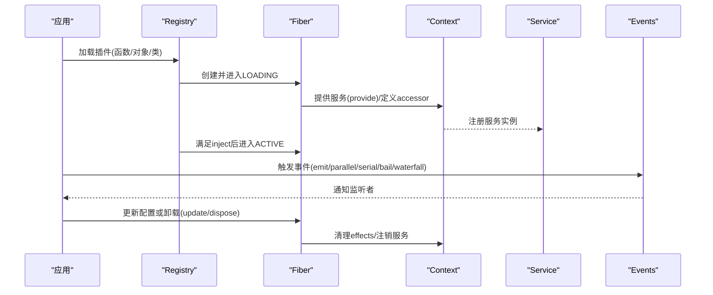

图表来源
- [registry.md:35-56](file://docs/cordis-api/registry.md#L35-L56)
- [fiber.md:68-120](file://docs/cordis-api/fiber.md#L68-L120)
- [context.md:237-365](file://docs/cordis-api/context.md#L237-L365)
- [events.md:8-123](file://docs/cordis-api/events.md#L8-L123)

## 详细组件分析

### 上下文(Context)与服务存取
- 作用：统一的依赖容器与能力门面，支持扩展、隔离、拦截、反射与混入。
- 关键能力：
  - ctx.get/set/provide/accessor/mixin：读取、覆盖、提供、计算属性、方法转发。
  - ctx.extend/isolate/intercept：创建子上下文、按服务名隔离作用域、为下游插件注入拦截配置。
  - ctx.events/logger/reflect/registry：内建服务访问。

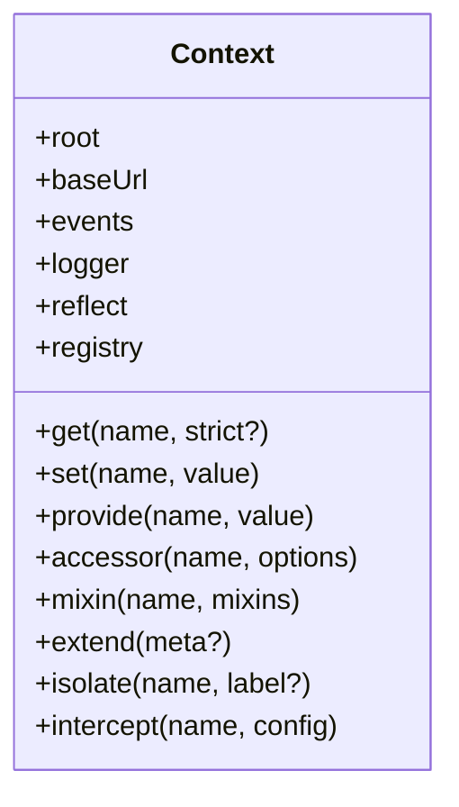

图表来源
- [context.md:14-163](file://docs/cordis-api/context.md#L14-L163)
- [context.md:237-365](file://docs/cordis-api/context.md#L237-L365)

章节来源
- [context.md:14-163](file://docs/cordis-api/context.md#L14-L163)
- [context.md:237-365](file://docs/cordis-api/context.md#L237-L365)

### 插件注册与依赖注入(Registry)
- 插件形态：函数、类、对象（含 apply）。
- 依赖声明：数组或对象形式的 inject，支持拦截配置映射。
- 提供服务：provide 字段声明对外暴露的服务名。
- 配置校验：Config 使用 StandardSchemaV1 在启动前校验。

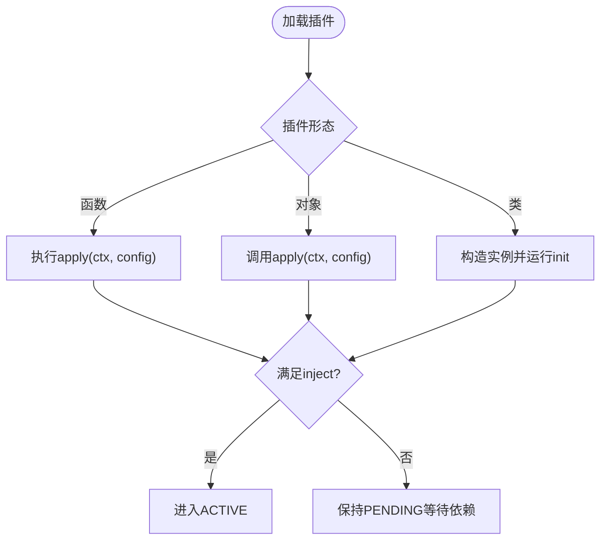

图表来源
- [registry.md:35-56](file://docs/cordis-api/registry.md#L35-L56)
- [registry.md:58-121](file://docs/cordis-api/registry.md#L58-L121)
- [registry.md:123-153](file://docs/cordis-api/registry.md#L123-L153)

章节来源
- [registry.md:35-56](file://docs/cordis-api/registry.md#L35-L56)
- [registry.md:58-121](file://docs/cordis-api/registry.md#L58-L121)
- [registry.md:123-153](file://docs/cordis-api/registry.md#L123-L153)

### 生命周期与效果(Fiber & Effect)
- Fiber 状态机：PENDING → LOADING → ACTIVE → UNLOADING → DISPOSED，失败路径 FAILED。
- effect：注册清理感知的作用，返回 disposer，随 Fiber 卸载反向顺序回收。
- update/restart：热重载与配置更新，内部会触发 internal/update 水线。
- 诊断：getEffects() 可获取当前已注册效果的元数据树。

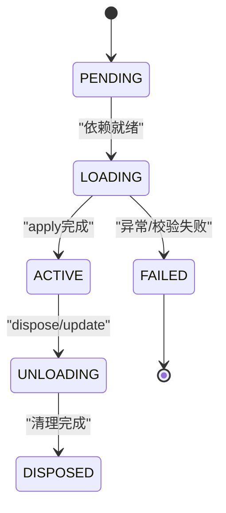

图表来源
- [fiber.md:68-120](file://docs/cordis-api/fiber.md#L68-L120)
- [fiber.md:164-274](file://docs/cordis-api/fiber.md#L164-L274)

章节来源
- [fiber.md:68-120](file://docs/cordis-api/fiber.md#L68-L120)
- [fiber.md:164-274](file://docs/cordis-api/fiber.md#L164-L274)

### 事件系统(Events)
- 分发模式：
  - emit：同步忽略返回值
  - parallel：并发等待所有监听器
  - serial：顺序等待直到某个监听器 bail
  - bail：同步短路
  - waterfall：链式 next 回调
- 监听：on/once，支持 prepend/global 选项。

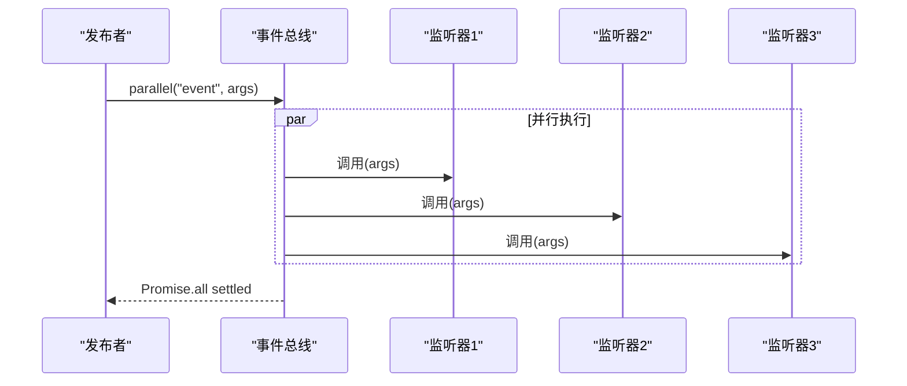

图表来源
- [events.md:8-123](file://docs/cordis-api/events.md#L8-L123)

章节来源
- [events.md:8-123](file://docs/cordis-api/events.md#L8-L123)
- [events.md:125-208](file://docs/cordis-api/events.md#L125-L208)

### 服务(Service)
- 通过继承 Service 并在构造函数中调用 super(ctx, name) 注册服务。
- 静态符号：init/check/config/invoke/extend/tracker/resolveConfig 用于扩展与运行时行为。
- 服务即插件：Service 子类本身可作为插件挂载。

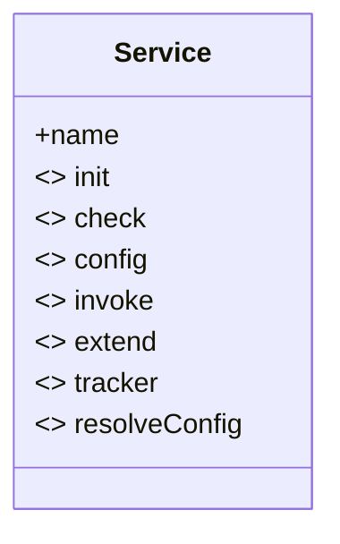

图表来源
- [service.md:1-103](file://docs/cordis-api/service.md#L1-L103)

章节来源
- [service.md:1-103](file://docs/cordis-api/service.md#L1-L103)

### 工具插件开发接口
- 最小形态：通过 defineTool 定义工具名称、描述、参数 schema、输出 schema 与渲染、execute 执行体。
- 执行契约：参数自动校验、不可变执行身份、返回规范 JSON、抛出或无效值视为错误、尊重 exec.signal、可选 presentationMeta、支持后台任务。
- 策略与观测：pre-execute/guard/tools/execute/tools/post-execute/tools/result 等扩展点。
- UI 呈现：presentCall/presentResult 返回 card-tagged 意图，UI 无关于模型结果。

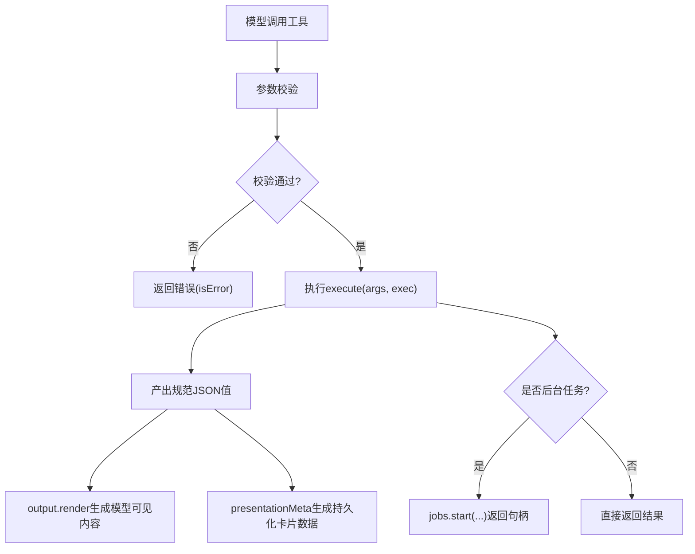

图表来源
- [adding-a-tool.md:7-66](file://docs/cookbook/adding-a-tool.md#L7-L66)
- [adding-a-tool.md:67-95](file://docs/cookbook/adding-a-tool.md#L67-L95)

章节来源
- [adding-a-tool.md:7-66](file://docs/cookbook/adding-a-tool.md#L7-L66)
- [adding-a-tool.md:67-95](file://docs/cookbook/adding-a-tool.md#L67-L95)

### LLM 适配器开发接口
- 基本形态：继承 LlmAdapter，实现 stream(options) 异步迭代，注册到 ctx.llm.registerAdapter。
- 协议义务：usage 在 finish 之前发出；arguments 为原始 JSON 字符串流；block index 分配与复用；错误两条受控路径；尊重 signal；不支持的选项抛错；replayState 携带最小可恢复状态。
- 模型能力：resolveModel 提供中性能力描述；defaultEffort 仅在存在时声明；推理 effort 为有序不透明 id。
- 实现结构：分离 wire types、请求序列化、传输解析、块转换与适配器类。

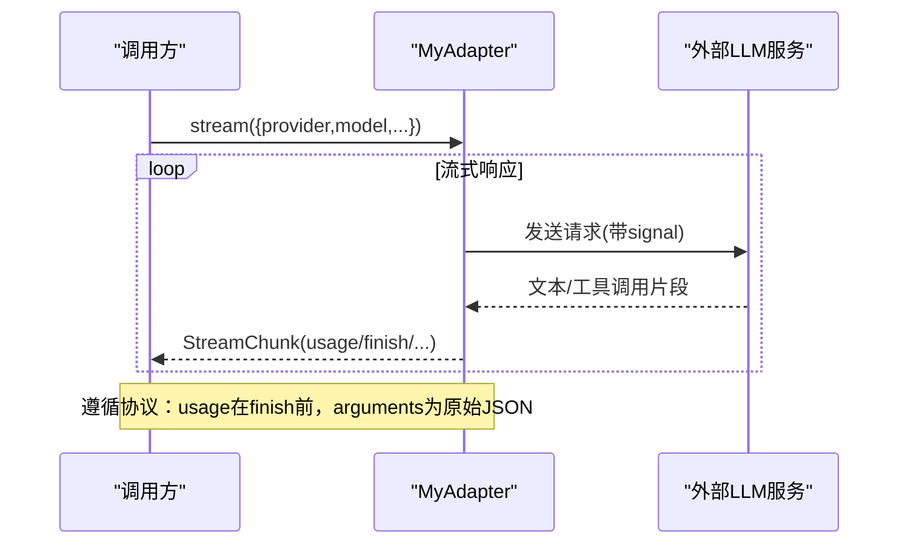

图表来源
- [adding-an-llm-adapter.md:7-39](file://docs/cookbook/adding-an-llm-adapter.md#L7-L39)

章节来源
- [adding-an-llm-adapter.md:7-39](file://docs/cookbook/adding-an-llm-adapter.md#L7-L39)

### 文件系统提供者与沙箱环境
- 沙箱模式：read-only、workspace-write、danger-full-access；enforcement 可为 full 或 partial。
- 每调用策略：SandboxExecutionPolicy/SandboxPolicy 携带 mode、workspaceRoot、sessionId。
- 封装 argv：ConfinedArgv 包含 wrapped argv、enforcement、denialSignatures、runnerFailureRules。
- 抽象服务：ctx.sandbox.confine(argv, policy) 必须返回受限 argv 或在无法使用时 fail-closed。

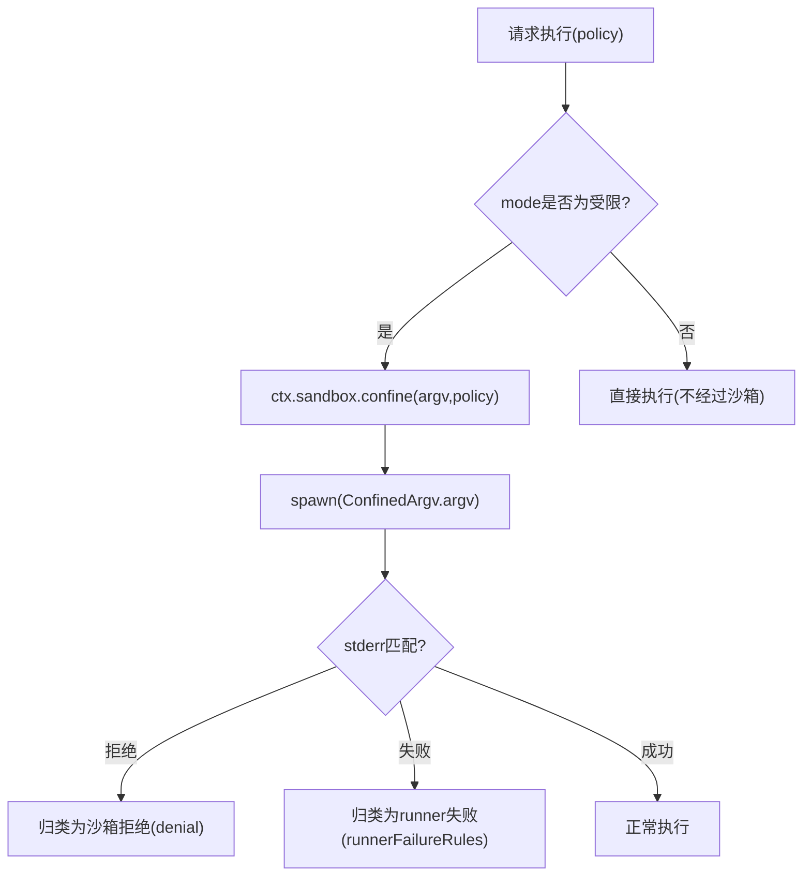

图表来源
- [sandbox.md:9-94](file://docs/subsystems/sandbox.md#L9-L94)
- [sandbox.md:96-157](file://docs/subsystems/sandbox.md#L96-L157)
- [sandbox.md:166-218](file://docs/subsystems/sandbox.md#L166-L218)

章节来源
- [sandbox.md:9-94](file://docs/subsystems/sandbox.md#L9-L94)
- [sandbox.md:96-157](file://docs/subsystems/sandbox.md#L96-L157)
- [sandbox.md:166-218](file://docs/subsystems/sandbox.md#L166-L218)

### 权限控制与预设
- 权限预设：将 sandbox/mode 与 approval/policy 组合为预设表，客户端选择预设即切换两个旋钮。
- 当前预设：current(events) 根据会话事件推导有效预设，未匹配时为 custom。
- 切换：set(session,name) 记录 permission/preset 日志事件，并仅写入变化的旋钮。

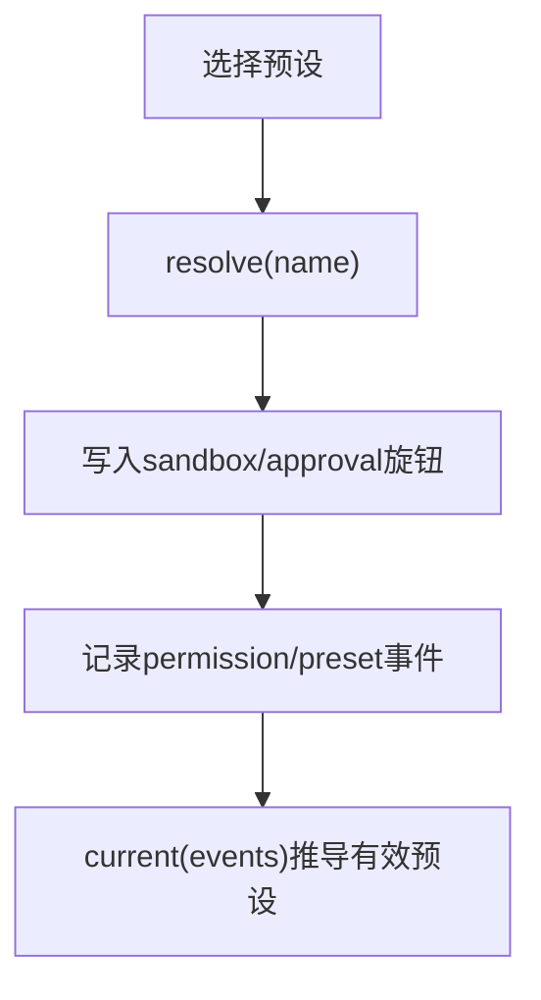

图表来源
- [permission-presets.md:9-68](file://docs/subsystems/permission-presets.md#L9-L68)
- [permission-presets.md:80-132](file://docs/subsystems/permission-presets.md#L80-L132)

章节来源
- [permission-presets.md:9-68](file://docs/subsystems/permission-presets.md#L9-L68)
- [permission-presets.md:80-132](file://docs/subsystems/permission-presets.md#L80-L132)

### 插件配置、调试与HMR
- 配置校验：插件可通过 Config 字段声明 StandardSchemaV1 校验规则，启动前验证。
- 热重载：update(config,noSave) 先触发 internal/update 水线，再重启插件；Fiber 支持 restart。
- 调试：getEffects() 可获取效果树；CordisError/ValidationError 提供稳定错误码；日志通过 ctx.logger。

章节来源
- [registry.md:58-121](file://docs/cordis-api/registry.md#L58-L121)
- [fiber.md:212-274](file://docs/cordis-api/fiber.md#L212-L274)
- [fiber.md:331-376](file://docs/cordis-api/fiber.md#L331-L376)

### 插件开发完整示例（从工具到LLM适配器）
- 第一个插件：导出 name 与 apply(ctx)，通过 cordis.yml 组合加载。
- 生命周期：使用 ctx.effect 管理资源，确保卸载时清理；Fiber 状态机保证正确生命周期。
- 服务：通过 Service 子类注册能力，消费者通过 inject 声明依赖，解耦实现。
- 工具插件：使用 defineTool 注册工具，遵循 execute 契约与 UI 呈现规范。
- LLM 适配器：实现 stream 协议，注册到 ctx.llm，遵循 usage/finish/arguments/replayState 等约束。

章节来源
- [01-first-plugin.md:1-96](file://docs/cordis-tutorial/01-first-plugin.md#L1-L96)
- [02-lifecycle-and-effects.md:1-99](file://docs/cordis-tutorial/02-lifecycle-and-effects.md#L1-L99)
- [03-services.md:1-99](file://docs/cordis-tutorial/03-services.md#L1-L99)
- [adding-a-tool.md:7-95](file://docs/cookbook/adding-a-tool.md#L7-L95)
- [adding-an-llm-adapter.md:7-44](file://docs/cookbook/adding-an-llm-adapter.md#L7-L44)

## 依赖关系分析
- 耦合与内聚：Context 聚合多个子系统服务（events、logger、registry），高内聚低耦合；插件通过 inject 显式声明依赖，降低隐式耦合。
- 循环依赖：通过 PENDING 状态与依赖快照避免循环启动；服务替换时依赖方会卸载并重载。
- 外部依赖：LLM 适配器对接外部模型服务；沙箱后端对接平台限制能力（bwrap/Landlock/Seatbelt/ACL）。

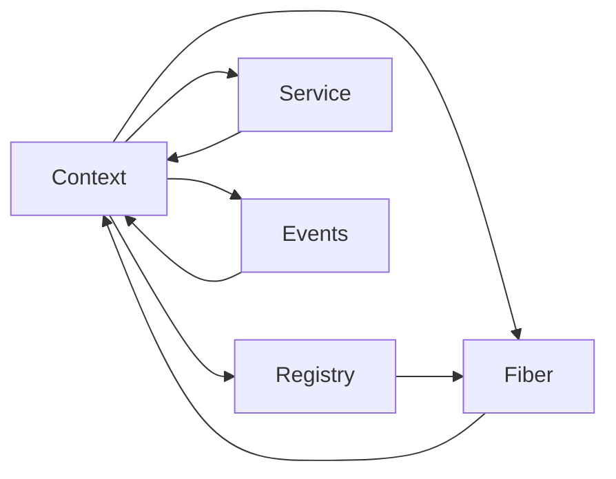

图表来源
- [context.md:1-163](file://docs/cordis-api/context.md#L1-L163)
- [registry.md:35-56](file://docs/cordis-api/registry.md#L35-L56)
- [fiber.md:68-120](file://docs/cordis-api/fiber.md#L68-L120)

章节来源
- [context.md:1-163](file://docs/cordis-api/context.md#L1-L163)
- [registry.md:35-56](file://docs/cordis-api/registry.md#L35-L56)
- [fiber.md:68-120](file://docs/cordis-api/fiber.md#L68-L120)

## 性能考虑
- 事件分发：parallel 适合无副作用的并发监听；serial/bail 适合有优先级或短路逻辑的场景；waterfall 适合链式拦截。
- 依赖解析：inject 延迟加载，避免不必要的启动开销；服务变更触发重加载，注意影响范围。
- 沙箱：confine 可能引入额外开销，按需选择模式；partial enforcement 需在上层做降级或告警。
- LLM 流式：合理缓冲 finish/usage，减少尾部数据抖动；严格遵循协议避免重复或丢失。

[本节为通用指导，无需特定文件引用]

## 故障排查指南
- 插件未启动：检查 cordis.yml 模块解析是否正确；查看 logger 输出；确认 inject 依赖是否满足（PENDING 状态）。
- 配置校验失败：捕获 ValidationError，依据 issues 修正配置。
- 生命周期异常：Fiber.dispose 后继续操作会抛出 INACTIVE_EFFECT；确保在 effect 中安全释放资源。
- 事件未触发：确认 on/once 注册在当前 fiber 作用域；必要时使用 global 选项绕过过滤器。
- 沙箱拒绝：区分 runner failure 与 denial；根据 denialSignatures 与 runnerFailureRules 定位问题。
- 权限预设：current 推导为 custom 表示未匹配任何预设；检查 sandbox/approval 旋钮实际值。

章节来源
- [fiber.md:331-376](file://docs/cordis-api/fiber.md#L331-L376)
- [events.md:125-208](file://docs/cordis-api/events.md#L125-L208)
- [sandbox.md:152-218](file://docs/subsystems/sandbox.md#L152-L218)
- [permission-presets.md:46-68](file://docs/subsystems/permission-presets.md#L46-L68)

## 结论
DeepSeek Harness 的插件系统以 Cordis 为核心，提供了清晰的上下文、生命周期、服务与事件模型。通过工具插件、LLM 适配器与沙箱/权限等子系统，开发者可以构建可扩展、可配置、可观测且安全的插件生态。建议遵循标准配置校验、效应管理与协议约束，以获得最佳的可维护性与稳定性。

[本节为总结性内容，无需特定文件引用]

## 附录
- 插件打包与发布
  - 插件以 npm 包或相对模块形式被 Loader 解析；cordis.yml 作为组合清单。
  - 通过 Config 进行强类型配置校验；Secrets 通过环境变量注入。
  - 版本管理：插件自身语义化版本；依赖通过 workspace 与工作区脚本管理。
- 调试支持
  - 使用 ctx.logger 输出结构化日志；getEffects() 查看效果树；internal/status 事件跟踪 Fiber 状态变化。
- 测试与验证
  - 遵循仓库测试策略；工具与适配器需覆盖真实场景与边界条件。

[本节为补充信息，无需特定文件引用]