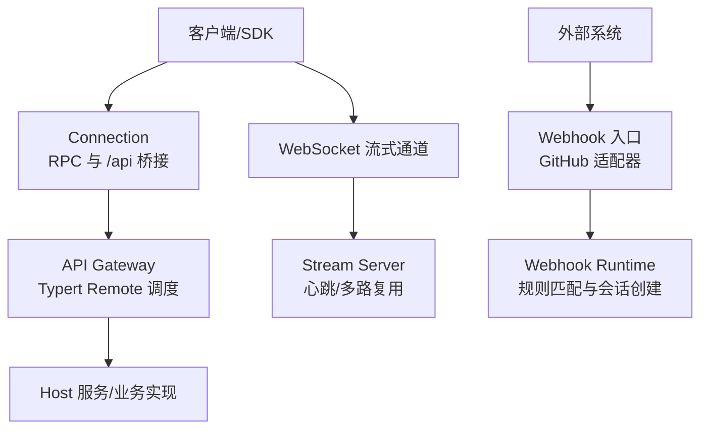
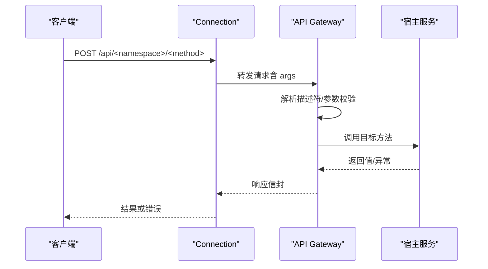
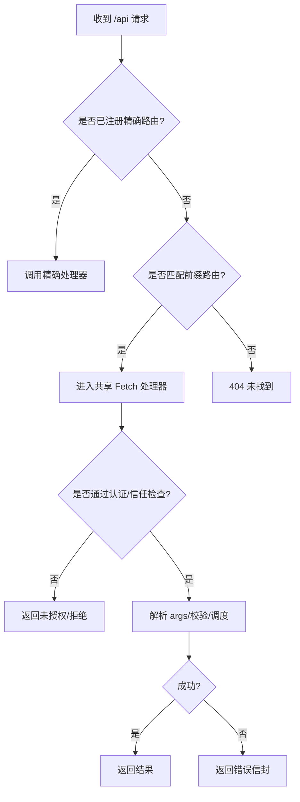
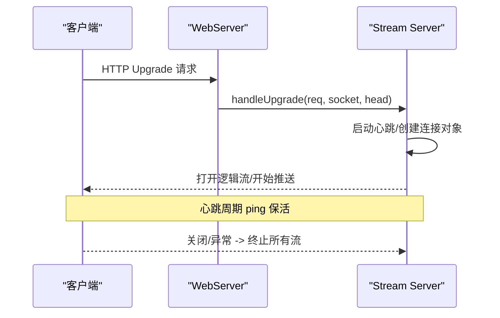
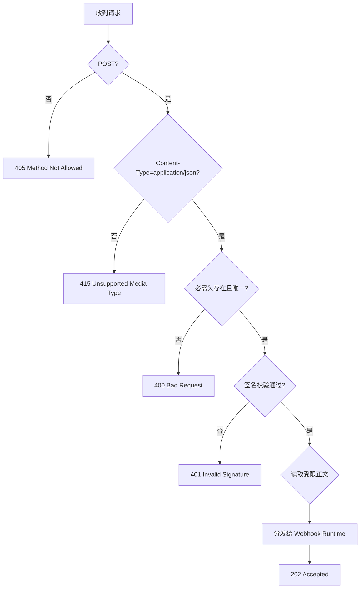
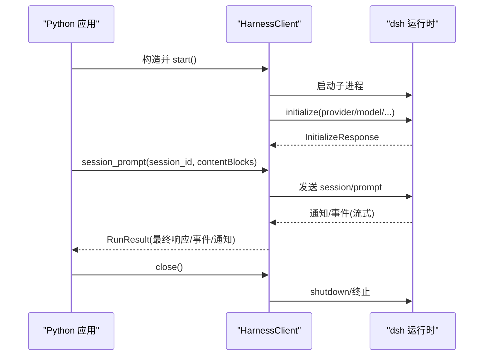
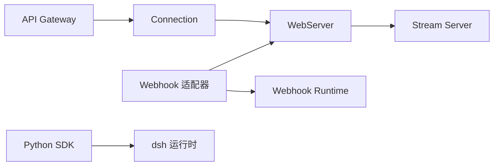

# API与集成

<cite>
**本文引用的文件**
- [packages/api/gateway/tests/gateway.client.spec.ts](file://packages/api/gateway/tests/gateway.client.spec.ts)
- [packages/client/connection/src/rpc-host.ts](file://packages/client/connection/src/rpc-host.ts)
- [packages/host/webserver/src/index.ts](file://packages/host/webserver/src/index.ts)
- [packages/host/webserver/src/index.js](file://packages/host/webserver/src/index.js)
- [packages/experimental/webworker-runtime/src/node/external_packages/ws.ts](file://packages/experimental/webworker-runtime/src/node/external_packages/ws.ts)
- [packages/api/gateway/src/stream-server.ts](file://packages/api/gateway/src/stream-server.ts)
- [packages/webhook/webhook-github/src/handler.ts](file://packages/webhook/webhook-github/src/handler.ts)
- [packages/webhook/webhook-github/tests/handler.spec.ts](file://packages/webhook/webhook-github/tests/handler.spec.ts)
- [python/sdk/README.md](file://python/sdk/README.md)
- [python/sdk/src/deepseek_harness/client.py](file://python/sdk/src/deepseek_harness/client.py)
- [python/sdk/src/deepseek_harness/errors.py](file://python/sdk/src/deepseek_harness/errors.py)
- [docs/api-gateway.md](file://docs/api-gateway.md)
- [docs/subsystems/webhook.md](file://docs/subsystems/webhook.md)
- [apps/cli/tests/github-webhook-real.e2e.ts](file://apps/cli/tests/github-webhook-real.e2e.ts)
</cite>

## 目录
1. [简介](#简介)
2. [项目结构](#项目结构)
3. [核心组件](#核心组件)
4. [架构总览](#架构总览)
5. [详细组件分析](#详细组件分析)
6. [依赖关系分析](#依赖关系分析)
7. [性能考虑](#性能考虑)
8. [故障排查指南](#故障排查指南)
9. [结论](#结论)
10. [附录](#附录)

## 简介
本文件面向集成开发者，系统化说明 DeepSeek Harness 的对外接口与集成方式，覆盖：
- REST API：HTTP 方法、URL 模式、请求/响应格式、认证与错误码。
- WebSocket 实时通信：连接建立、消息协议、事件类型与交互流程。
- Webhook 集成：事件接收、处理与安全校验。
- Python SDK：安装、配置、基本用法与错误处理。
并给出最佳实践、安全注意事项与性能优化建议。

## 项目结构
DeepSeek Harness 将“业务服务”通过 API Gateway 暴露为远程调用；底层由 Connection 提供 RPC 载体与 /api HTTP 桥接；WebServer 负责 HTTP 路由与 WebSocket 升级；Webhook 子系统提供外部事件接入；Python SDK 通过子进程 JSON-RPC 驱动运行时。

**图示来源**
- [packages/client/connection/src/rpc-host.ts:111-130](file://packages/client/connection/src/rpc-host.ts#L111-L130)
- [docs/api-gateway.md:119-127](file://docs/api-gateway.md#L119-L127)
- [packages/host/webserver/src/index.ts:219-253](file://packages/host/webserver/src/index.ts#L219-L253)
- [packages/api/gateway/src/stream-server.ts:39-79](file://packages/api/gateway/src/stream-server.ts#L39-L79)
- [packages/webhook/webhook-github/src/handler.ts:72-130](file://packages/webhook/webhook-github/src/handler.ts#L72-L130)

**章节来源**
- [docs/api-gateway.md:1-165](file://docs/api-gateway.md#L1-L165)
- [packages/host/webserver/src/index.ts:219-253](file://packages/host/webserver/src/index.ts#L219-L253)

## 核心组件
- API Gateway（Typert）：声明式远程方法、严格契约生成、按命名空间路由到宿主服务。
- Connection：统一信任边界、请求关联、取消、响应信封，以及 /api HTTP 桥接。
- WebServer：HTTP 路由、精确/前缀匹配、WebSocket 升级与升级路由管理。
- Webhook：提供商适配（如 GitHub）、签名校验、无状态分发、会话创建。
- Python SDK：子进程 JSON-RPC 客户端，封装启动、初始化、会话提示、通知订阅与超时控制。

**章节来源**
- [docs/api-gateway.md:80-127](file://docs/api-gateway.md#L80-L127)
- [packages/client/connection/src/rpc-host.ts:111-130](file://packages/client/connection/src/rpc-host.ts#L111-L130)
- [packages/host/webserver/src/index.ts:219-253](file://packages/host/webserver/src/index.ts#L219-L253)
- [docs/subsystems/webhook.md:1-38](file://docs/subsystems/webhook.md#L1-L38)
- [python/sdk/README.md:1-73](file://python/sdk/README.md#L1-L73)

## 架构总览
下图展示一次远程调用的端到端路径：客户端通过 Connection 发起 /api/<namespace>/<method> 请求，Gateway 解析描述符并调度宿主服务，返回结构化结果或错误。

**图示来源**
- [packages/client/connection/src/rpc-host.ts:219-245](file://packages/client/connection/src/rpc-host.ts#L219-L245)
- [docs/api-gateway.md:119-127](file://docs/api-gateway.md#L119-L127)

## 详细组件分析

### REST API（/api 网关）
- URL 模式
  - 前缀：/api
  - 远端方法：/api/<namespace>/<method>
  - 请求体：仅包含名为 args 的对象（由 Connection 映射）
- 认证
  - 浏览器传输：在 /api 前缀上执行 Host/Origin 信任检查与持久化 Cookie 认证，未通过则返回未授权。
- 请求/响应
  - 成功：返回对应方法的强类型结果。
  - 失败：返回标准化错误信封（包含 code、message、details）。
- 路由优先级
  - 精确匹配优先于前缀匹配；最长前缀优先；方法级路由可覆盖默认行为。

**图示来源**
- [packages/client/connection/src/rpc-host.ts:111-130](file://packages/client/connection/src/rpc-host.ts#L111-L130)
- [packages/client/connection/src/rpc-host.ts:219-245](file://packages/client/connection/src/rpc-host.ts#L219-L245)
- [packages/host/webserver/src/index.ts:219-253](file://packages/host/webserver/src/index.ts#L219-L253)

**章节来源**
- [docs/api-gateway.md:119-127](file://docs/api-gateway.md#L119-L127)
- [packages/client/connection/src/rpc-host.ts:111-130](file://packages/client/connection/src/rpc-host.ts#L111-L130)
- [packages/client/connection/src/rpc-host.ts:219-245](file://packages/client/connection/src/rpc-host.ts#L219-L245)
- [packages/host/webserver/src/index.ts:219-253](file://packages/host/webserver/src/index.ts#L219-L253)

### WebSocket 实时通信
- 连接建立
  - WebServer 监听 upgrade 事件，按精确路径匹配升级路由，接受后交由上层流服务器处理。
- 消息协议
  - 基于文本帧的 Remote Stream Mux：每个连接维护多个逻辑流，支持心跳保活与关闭时清理。
- 事件类型
  - 服务端周期性 ping 心跳；客户端需保持空闲检测；非法二进制帧会被关闭。
- 交互模式
  - 客户端建立连接后，发送流请求开始数据推送；连接关闭时中止所有活跃流。

**图示来源**
- [packages/host/webserver/src/index.js:124-161](file://packages/host/webserver/src/index.js#L124-L161)
- [packages/api/gateway/src/stream-server.ts:39-79](file://packages/api/gateway/src/stream-server.ts#L39-L79)
- [packages/api/gateway/src/stream-server.ts:86-116](file://packages/api/gateway/src/stream-server.ts#L86-L116)

**章节来源**
- [packages/host/webserver/src/index.js:124-161](file://packages/host/webserver/src/index.js#L124-L161)
- [packages/api/gateway/src/stream-server.ts:39-116](file://packages/api/gateway/src/stream-server.ts#L39-L116)

### Webhook 集成（以 GitHub 为例）
- 事件接收
  - 仅接受 POST application/json，要求携带 x-hub-signature-256、x-github-delivery、x-github-event。
- 安全验证
  - 使用配置的密钥对原始 body 进行签名校验，失败返回 401。
- 处理流程
  - 校验通过后读取受限大小的 UTF-8 正文，构造标准化交付对象，分发给 Webhook Runtime。
  - 立即返回 202，后续会话创建异步进行。
- 错误处理
  - 方法错误返回 405（附带 Allow），内容类型错误返回 415，缺失/重复头返回 400，内部不可用返回 503。

**图示来源**
- [packages/webhook/webhook-github/src/handler.ts:72-130](file://packages/webhook/webhook-github/src/handler.ts#L72-L130)
- [packages/webhook/webhook-github/tests/handler.spec.ts:145-212](file://packages/webhook/webhook-github/tests/handler.spec.ts#L145-L212)

**章节来源**
- [docs/subsystems/webhook.md:1-38](file://docs/subsystems/webhook.md#L1-L38)
- [packages/webhook/webhook-github/src/handler.ts:72-130](file://packages/webhook/webhook-github/src/handler.ts#L72-L130)
- [packages/webhook/webhook-github/tests/handler.spec.ts:145-212](file://packages/webhook/webhook-github/tests/handler.spec.ts#L145-L212)

### Python SDK 使用指南
- 安装
  - 通过包管理器安装 SDK，同时安装对应平台的运行时二进制。
- 启动与配置
  - 通过上下文管理器启动，指定 dsh_home、工作目录、provider、model、推理强度与最大 token 等。
  - 支持通过环境变量或参数注入插件补丁。
- 基本用法
  - initialize 完成握手；session_prompt 提交提示；run 封装完整活动区间并返回最终响应与事件。
  - 支持通知订阅与子代理会话树追踪。
- 错误处理
  - 区分传输关闭、协议错误、JSON-RPC 错误；超时包含所选 profile 的诊断信息。

**图示来源**
- [python/sdk/README.md:1-73](file://python/sdk/README.md#L1-L73)
- [python/sdk/src/deepseek_harness/client.py:133-189](file://python/sdk/src/deepseek_harness/client.py#L133-L189)
- [python/sdk/src/deepseek_harness/client.py:191-330](file://python/sdk/src/deepseek_harness/client.py#L191-L330)

**章节来源**
- [python/sdk/README.md:1-73](file://python/sdk/README.md#L1-L73)
- [python/sdk/src/deepseek_harness/client.py:133-330](file://python/sdk/src/deepseek_harness/client.py#L133-L330)
- [python/sdk/src/deepseek_harness/errors.py:1-24](file://python/sdk/src/deepseek_harness/errors.py#L1-L24)

## 依赖关系分析
- API Gateway 依赖 Connection 提供的 /api 桥接与信任检查。
- WebServer 提供 HTTP 与 WebSocket 升级能力，供 Connection 与 Stream Server 使用。
- Webhook 适配器依赖 WebServer 注册精确路由，并通过 Webhook Runtime 创建会话。
- Python SDK 依赖运行时子进程，通过 JSON-RPC 与 dsh CLI 交互。

**图示来源**
- [docs/api-gateway.md:158-163](file://docs/api-gateway.md#L158-L163)
- [packages/host/webserver/src/index.ts:219-253](file://packages/host/webserver/src/index.ts#L219-L253)
- [packages/api/gateway/src/stream-server.ts:39-79](file://packages/api/gateway/src/stream-server.ts#L39-L79)
- [packages/webhook/webhook-github/src/handler.ts:72-130](file://packages/webhook/webhook-github/src/handler.ts#L72-L130)
- [python/sdk/src/deepseek_harness/client.py:71-92](file://python/sdk/src/deepseek_harness/client.py#L71-L92)

**章节来源**
- [docs/api-gateway.md:158-163](file://docs/api-gateway.md#L158-L163)

## 性能考虑
- 请求体限制：Connection 与 Webhook 均对请求体大小进行限制，避免大负载影响吞吐。
- 心跳与保活：WebSocket 流式通道启用心跳，降低长连接空闲失效风险。
- 并发与取消：Remote 调用支持 AbortSignal，可在客户端侧及时中断耗时任务。
- 资源释放：WebServer 在关闭时确保普通与升级后的套接字全部释放，避免资源泄漏。
- 子进程生命周期：Python SDK 在关闭时先尝试优雅 shutdown，再强制终止，减少阻塞。

[本节为通用指导，不直接分析具体文件]

## 故障排查指南
- REST 层
  - 404：未匹配任何精确或前缀路由。
  - 400：请求体非 JSON 或解析失败。
  - 405：不支持的方法（Webhook 场景）。
  - 415：非 application/json（Webhook 场景）。
  - 401：签名校验失败（Webhook）或认证失败（浏览器）。
  - 503：后端不可用（Webhook 分发失败）。
- WebSocket 层
  - 二进制帧：服务端关闭连接并提示需要文本帧。
  - 升级失败：未注册升级路由或上游错误导致连接断开。
- Python SDK
  - TransportClosedError：子进程退出或 stdout 关闭。
  - SdkProtocolError：运行时返回不符合协议的数据。
  - JsonRpcError：运行时返回 JSON-RPC 错误。
  - 超时：initialize/request 超时包含所选 profile 的诊断信息。

**章节来源**
- [packages/client/connection/src/rpc-host.ts:219-245](file://packages/client/connection/src/rpc-host.ts#L219-L245)
- [packages/webhook/webhook-github/src/handler.ts:72-130](file://packages/webhook/webhook-github/src/handler.ts#L72-L130)
- [packages/webhook/webhook-github/tests/handler.spec.ts:145-212](file://packages/webhook/webhook-github/tests/handler.spec.ts#L145-L212)
- [packages/api/gateway/src/stream-server.ts:86-116](file://packages/api/gateway/src/stream-server.ts#L86-L116)
- [python/sdk/src/deepseek_harness/errors.py:1-24](file://python/sdk/src/deepseek_harness/errors.py#L1-L24)
- [python/sdk/src/deepseek_harness/client.py:133-189](file://python/sdk/src/deepseek_harness/client.py#L133-L189)

## 结论
DeepSeek Harness 通过 API Gateway + Connection + WebServer 的组合，提供了稳定、可扩展的 REST 与实时通信能力；Webhook 子系统以最小侵入方式接入外部事件；Python SDK 简化了本地运行时的集成与调试。遵循本文的接口规范、安全策略与性能建议，可快速构建高可靠的集成方案。

## 附录
- 参考文档
  - API Gateway 编程模型与构建管线
  - Webhook 运行时与 GitHub 适配器
  - Python SDK 安装与示例

[本节为概览性内容，不直接分析具体文件]