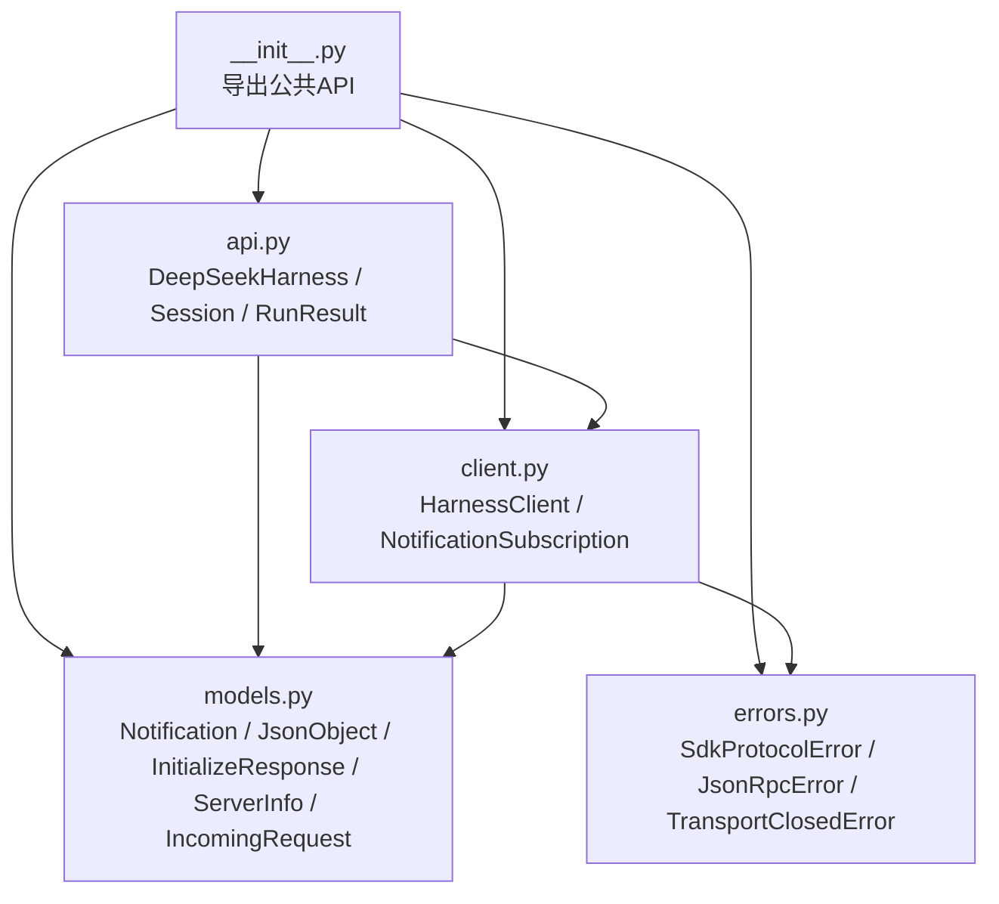
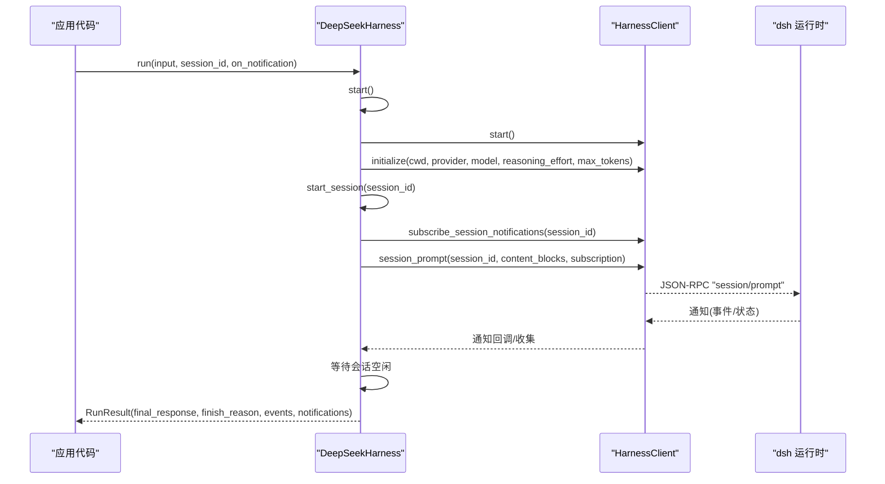
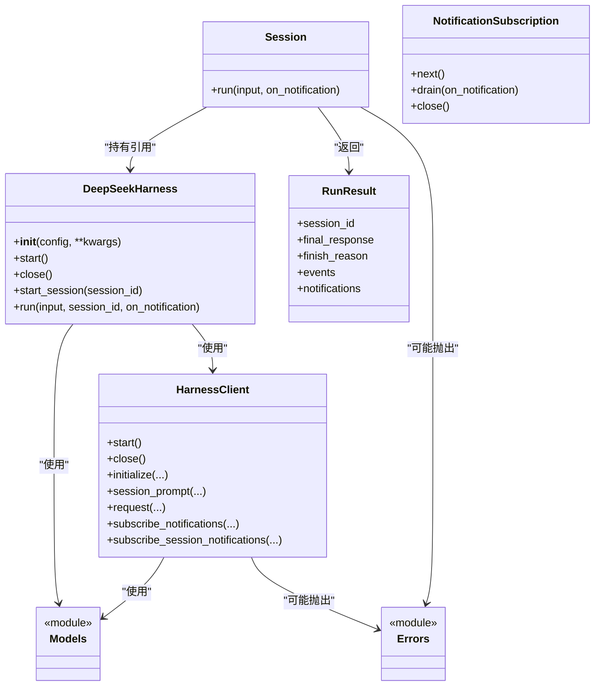

# API参考

<cite>
**本文引用的文件**
- [python/sdk/src/deepseek_harness/__init__.py](file://python/sdk/src/deepseek_harness/__init__.py)
- [python/sdk/src/deepseek_harness/api.py](file://python/sdk/src/deepseek_harness/api.py)
- [python/sdk/src/deepseek_harness/client.py](file://python/sdk/src/deepseek_harness/client.py)
- [python/sdk/src/deepseek_harness/models.py](file://python/sdk/src/deepseek_harness/models.py)
- [python/sdk/src/deepseek_harness/errors.py](file://python/sdk/src/deepseek_harness/errors.py)
- [python/sdk/README.md](file://python/sdk/README.md)
- [python/sdk/examples/minimal.py](file://python/sdk/examples/minimal.py)
</cite>

## 目录
1. [简介](#简介)
2. [项目结构](#项目结构)
3. [核心组件](#核心组件)
4. [架构总览](#架构总览)
5. [详细组件分析](#详细组件分析)
6. [依赖关系分析](#依赖关系分析)
7. [性能与限制](#性能与限制)
8. [故障排查指南](#故障排查指南)
9. [版本兼容性与迁移](#版本兼容性与迁移)
10. [结论](#结论)

## 简介
本API参考面向DeepSeek Harness Python SDK，聚焦公共类与接口：DeepSeekHarness、Session、RunResult、HarnessClient、HarnessConfig、NotificationSubscription以及数据模型（JsonObject、Notification、InitializeResponse、ServerInfo、IncomingRequest）和错误类型（SdkProtocolError、JsonRpcError、TransportClosedError）。文档提供方法签名、参数说明、返回值、异常行为、使用示例、数据类型定义、性能考虑与限制、版本兼容性与迁移建议。

## 项目结构
Python SDK位于 python/sdk/src/deepseek_harness，主要模块职责如下：
- __init__.py：统一导出公共API
- api.py：高层SDK封装（DeepSeekHarness、Session、RunResult及辅助函数）
- client.py：底层JSON-RPC客户端（HarnessClient、NotificationSubscription等）
- models.py：通用数据结构与Pydantic模型
- errors.py：异常类型定义

图表来源
- [python/sdk/src/deepseek_harness/__init__.py:1-19](file://python/sdk/src/deepseek_harness/__init__.py#L1-L19)
- [python/sdk/src/deepseek_harness/api.py:1-249](file://python/sdk/src/deepseek_harness/api.py#L1-L249)
- [python/sdk/src/deepseek_harness/client.py:1-590](file://python/sdk/src/deepseek_harness/client.py#L1-L590)
- [python/sdk/src/deepseek_harness/models.py:1-33](file://python/sdk/src/deepseek_harness/models.py#L1-L33)
- [python/sdk/src/deepseek_harness/errors.py:1-24](file://python/sdk/src/deepseek_harness/errors.py#L1-L24)

章节来源
- [python/sdk/src/deepseek_harness/__init__.py:1-19](file://python/sdk/src/deepseek_harness/__init__.py#L1-L19)

## 核心组件
本节概述公共API的职责与交互方式。

- DeepSeekHarness：可复用的同步SDK入口，负责启动并复用本地运行时子进程，提供run/start_session等方法。
- Session：会话对象，封装一次或多轮对话的运行生命周期，收集事件与通知，返回RunResult。
- RunResult：单次运行的结果，包含最终响应、结束原因、事件列表与通知列表。
- HarnessClient：底层JSON-RPC客户端，管理子进程生命周期、请求/响应、通知订阅与过滤。
- NotificationSubscription：通知订阅句柄，支持next/drain/close。
- 数据模型：JsonObject、Notification、InitializeResponse、ServerInfo、IncomingRequest。
- 错误类型：SdkProtocolError、JsonRpcError、TransportClosedError。

章节来源
- [python/sdk/src/deepseek_harness/api.py:13-189](file://python/sdk/src/deepseek_harness/api.py#L13-L189)
- [python/sdk/src/deepseek_harness/client.py:24-590](file://python/sdk/src/deepseek_harness/client.py#L24-L590)
- [python/sdk/src/deepseek_harness/models.py:1-33](file://python/sdk/src/deepseek_harness/models.py#L1-L33)
- [python/sdk/src/deepseek_harness/errors.py:1-24](file://python/sdk/src/deepseek_harness/errors.py#L1-L24)

## 架构总览
Python SDK通过JSON-RPC over stdio与本地dsh运行时通信。DeepSeekHarness在首次使用时惰性启动子进程，初始化后复用；Session.run发起session/prompt请求，订阅会话及其后代的通知，等待会话空闲后汇总结果。

图表来源
- [python/sdk/src/deepseek_harness/api.py:103-189](file://python/sdk/src/deepseek_harness/api.py#L103-L189)
- [python/sdk/src/deepseek_harness/client.py:133-189](file://python/sdk/src/deepseek_harness/client.py#L133-L189)

## 详细组件分析

### DeepSeekHarness
- 作用：启动并复用运行时子进程，提供高层run/start_session接口。
- 关键方法
  - __init__(config=None, **kwargs)：接受配置或关键字参数，内部构造HarnessConfig并创建HarnessClient。
  - start()：惰性启动子进程并调用initialize设置provider/model等。
  - close()：关闭客户端并重置初始化状态。
  - start_session(session_id=None)：创建或复用Session。
  - run(input, *, session_id=None, on_notification=None)：便捷入口，委托Session.run。
- 参数说明
  - config：DeepSeekHarnessConfig实例，或以下关键字参数：
    - provider：字符串，默认deepseek-official
    - model：字符串，默认deepseek-v4-flash
    - reasoning_effort：可选字符串
    - max_tokens：可选正整数
    - cwd/runtime_cwd：工作目录与运行时工作目录
    - dsh_bin：自定义dsh可执行路径
    - profile：配置文件名，默认sdk
    - patches：补丁文件路径元组
    - dsh_home：必需的非空路径或环境变量DSH_HOME
    - env：注入子进程的环境变量
    - initialize_timeout_seconds：初始化超时，默认30秒
    - request_timeout_seconds：请求超时，可选
    - shutdown_timeout_seconds：关闭超时，默认1秒
    - base_url/api_key：覆盖子进程的DEEPSEEK_BASE_URL/DEEPSEEK_API_KEY
- 返回值：无（start/close），RunResult（run）
- 异常：
  - TypeError：同时传入config与关键字参数
  - ValueError：dsh_home为空或未提供
  - TimeoutError：初始化或请求超时（携带诊断信息）
  - 其他由底层抛出

章节来源
- [python/sdk/src/deepseek_harness/api.py:13-131](file://python/sdk/src/deepseek_harness/api.py#L13-L131)
- [python/sdk/src/deepseek_harness/client.py:71-170](file://python/sdk/src/deepseek_harness/client.py#L71-L170)

### Session
- 作用：封装一次运行区间，从消息入队到会话空闲，收集事件与通知，生成RunResult。
- 关键方法
  - run(input, *, on_notification=None)：发送prompt，订阅通知，等待idle后返回结果。
- 参数说明
  - input：字符串或内容块列表；字符串会被规范化为文本内容块
  - on_notification：可选回调，接收每个通知
- 返回值：RunResult
- 异常：
  - SdkProtocolError：当最后一个turn/end缺少data.reason.kind时抛出
- 内部流程
  - 订阅会话及其后代通知
  - 发送session/prompt并获取messageId
  - 循环读取通知，直到收到该会话的idle状态
  - 从事件中提取final_response与finish_reason

章节来源
- [python/sdk/src/deepseek_harness/api.py:134-189](file://python/sdk/src/deepseek_harness/api.py#L134-L189)
- [python/sdk/src/deepseek_harness/api.py:205-249](file://python/sdk/src/deepseek_harness/api.py#L205-L249)

### RunResult
- 字段
  - session_id：字符串
  - final_response：字符串（最后一次提交的助手文本拼接）
  - finish_reason：字符串或None（最后turn/end的kind）
  - events：根会话事件列表
  - notifications：通知列表（含根会话与已知后代）
- 用途：聚合一次运行的输出与元数据

章节来源
- [python/sdk/src/deepseek_harness/api.py:40-47](file://python/sdk/src/deepseek_harness/api.py#L40-L47)

### HarnessClient
- 作用：JSON-RPC over stdio客户端，管理子进程、请求/响应、通知订阅与过滤。
- 关键方法
  - start()/close()：启动/关闭子进程
  - initialize(cwd, provider, model, reasoning_effort=None, max_tokens=None)：初始化运行时
  - session_prompt(session_id, content_blocks, on_notification=None, notification_subscription=None)：发送prompt并返回messageId
  - request(method, params, response_model, timeout_seconds=None, ...)：通用请求封装
  - notify/next_notification/respond/respond_error：通知与请求处理
  - subscribe_notifications(filter)/subscribe_session_notifications(session_id)：订阅通知
  - next_request/respond：服务端请求处理（用于扩展场景）
- 参数说明
  - HarnessConfig：dsh_bin/profile/patches/dsh_home/cwd/env/initialize_timeout_seconds/request_timeout_seconds/shutdown_timeout_seconds
- 返回值：依具体方法而定（如InitializeResponse、_SessionPromptResponse.messageId等）
- 异常：
  - TransportClosedError：运行时已退出或stdout关闭
  - JsonRpcError：运行时返回JSON-RPC错误
  - TimeoutError：初始化或请求超时（附带诊断信息）
  - ValueError：dsh_home为空或未提供
- 通知过滤：维护会话父子关系，确保只投递属于当前会话树的通知

章节来源
- [python/sdk/src/deepseek_harness/client.py:24-590](file://python/sdk/src/deepseek_harness/client.py#L24-L590)

### NotificationSubscription
- 作用：通知订阅句柄，支持阻塞next、非阻塞drain与显式close。
- 关键方法
  - next()：阻塞获取下一条通知或异常
  - drain(on_notification)：非阻塞批量消费通知
  - close()：取消订阅

章节来源
- [python/sdk/src/deepseek_harness/client.py:539-578](file://python/sdk/src/deepseek_harness/client.py#L539-L578)

### 数据模型
- JsonObject：dict[str, JsonValue]
- JsonValue：标量或嵌套字典/列表
- Notification：method + payload
- IncomingRequest：id + method + payload
- ServerInfo：name/version（可选）
- InitializeResponse：serverInfo（可选）

章节来源
- [python/sdk/src/deepseek_harness/models.py:1-33](file://python/sdk/src/deepseek_harness/models.py#L1-L33)

### 错误类型
- HarnessError：基类
- TransportClosedError：运行时子进程退出或stdout关闭
- SdkProtocolError：协议违规（如turn/end缺少reason.kind）
- JsonRpcError：JSON-RPC错误响应（code/message/data）

章节来源
- [python/sdk/src/deepseek_harness/errors.py:1-24](file://python/sdk/src/deepseek_harness/errors.py#L1-L24)

## 依赖关系分析
- DeepSeekHarness依赖HarnessClient进行进程管理与JSON-RPC通信。
- Session依赖DeepSeekHarness.client以发送prompt与订阅通知。
- 所有模块共享models中的通用类型与数据类。
- 错误类型被多处捕获或抛出，保证一致的错误语义。

图表来源
- [python/sdk/src/deepseek_harness/api.py:13-189](file://python/sdk/src/deepseek_harness/api.py#L13-L189)
- [python/sdk/src/deepseek_harness/client.py:24-590](file://python/sdk/src/deepseek_harness/client.py#L24-L590)
- [python/sdk/src/deepseek_harness/models.py:1-33](file://python/sdk/src/deepseek_harness/models.py#L1-L33)
- [python/sdk/src/deepseek_harness/errors.py:1-24](file://python/sdk/src/deepseek_harness/errors.py#L1-L24)

## 性能与限制
- 子进程复用：DeepSeekHarness惰性启动并复用运行时，避免重复开销。
- 超时控制：
  - initialize_timeout_seconds：默认30秒，初始化失败会终止并附加诊断信息。
  - request_timeout_seconds：可选，未设置则请求无界；建议在高延迟环境设置合理值。
  - shutdown_timeout_seconds：默认1秒，优雅关闭失败时会强制终止。
- 通知流控：Session.run订阅会话及其后代通知，仅在会话idle时结束，避免过早返回。
- 资源隔离：dsh_home必须显式指定，不会隐式读取~/.dsh，便于多实例隔离。
- 限制：
  - 必须提供有效的profile且保留JSON-RPC服务器行。
  - 某些能力（如web profile）不适用于Python SDK选择。
  - 工具与插件需通过profile或补丁安装，脚本不直接传递完整Cordis文件或任意argv。

章节来源
- [python/sdk/README.md:11-72](file://python/sdk/README.md#L11-L72)
- [python/sdk/src/deepseek_harness/client.py:71-170](file://python/sdk/src/deepseek_harness/client.py#L71-L170)
- [python/sdk/src/deepseek_harness/client.py:458-486](file://python/sdk/src/deepseek_harness/client.py#L458-L486)

## 故障排查指南
- 常见异常
  - TransportClosedError：运行时子进程已退出或stdout关闭；检查子进程状态与stderr尾行。
  - JsonRpcError：运行时返回错误码与消息；查看error.data定位问题。
  - SdkProtocolError：turn/end缺少data.reason.kind；检查事件格式是否符合协议。
  - TimeoutError：初始化或请求超时；检查profile、网络、凭据与系统负载。
- 诊断信息
  - 初始化与请求超时会附加运行时诊断（退出码、stderr尾部）。
  - 关闭阶段若失败，也会记录stderr信息。
- 排查步骤
  - 确认dsh_home非空且存在。
  - 确认profile有效且包含JSON-RPC服务器行。
  - 检查DEEPSEEK_API_KEY/DEEPSEEK_BASE_URL是否正确注入。
  - 观察stderr日志与子进程退出码。

章节来源
- [python/sdk/src/deepseek_harness/errors.py:1-24](file://python/sdk/src/deepseek_harness/errors.py#L1-L24)
- [python/sdk/src/deepseek_harness/client.py:133-170](file://python/sdk/src/deepseek_harness/client.py#L133-L170)
- [python/sdk/src/deepseek_harness/client.py:437-456](file://python/sdk/src/deepseek_harness/client.py#L437-L456)

## 版本兼容性与迁移
- 版本绑定：SDK安装时会安装对应版本的deepseek-harness-runtime-bin wheel，确保运行时与客户端版本一致。
- 兼容性要点
  - 必须显式提供dsh_home或环境变量DSH_HOME，禁止隐式~/.dsh。
  - 选择的profile必须保留JSON-RPC服务器行（如@deepseek-ai/dsh-sdk-app）。
  - web profile不可通过Python SDK选择，因其不包含JSON-RPC服务器行。
- 迁移建议
  - 将配置集中到profile与补丁文件，避免在每次调用中硬编码。
  - 使用patches按顺序叠加，后者覆盖前者。
  - 如需切换提供商/模型，通过initialize参数或profile配置实现。
  - 对长时间运行的任务设置request_timeout_seconds以避免无限等待。

章节来源
- [python/sdk/README.md:5-62](file://python/sdk/README.md#L5-L62)
- [python/sdk/src/deepseek_harness/client.py:458-486](file://python/sdk/src/deepseek_harness/client.py#L458-L486)

## 结论
DeepSeek Harness Python SDK提供了简洁的高层API（DeepSeekHarness、Session、RunResult）与可靠的底层JSON-RPC客户端（HarnessClient），通过子进程复用、超时控制与通知订阅机制，实现对Agent会话的稳定驱动。遵循显式配置、合理超时与错误处理的最佳实践，可在不同环境中安全高效地使用SDK。