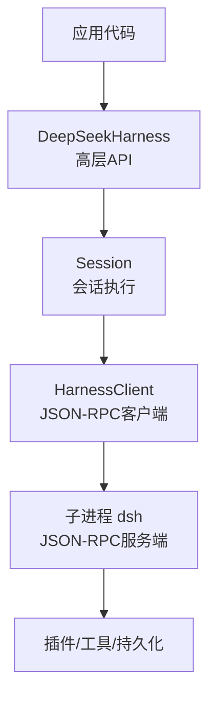
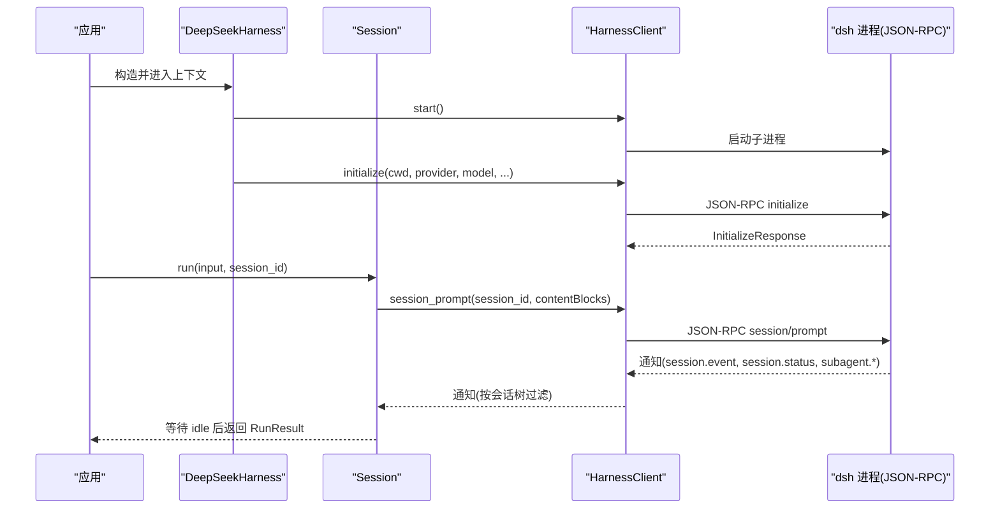
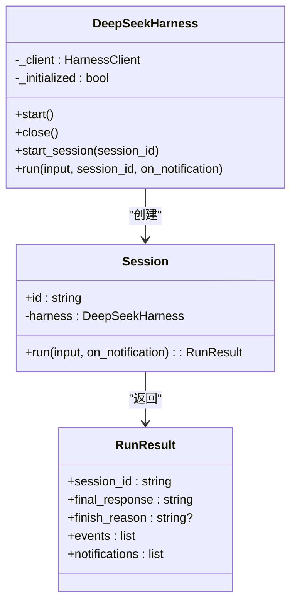
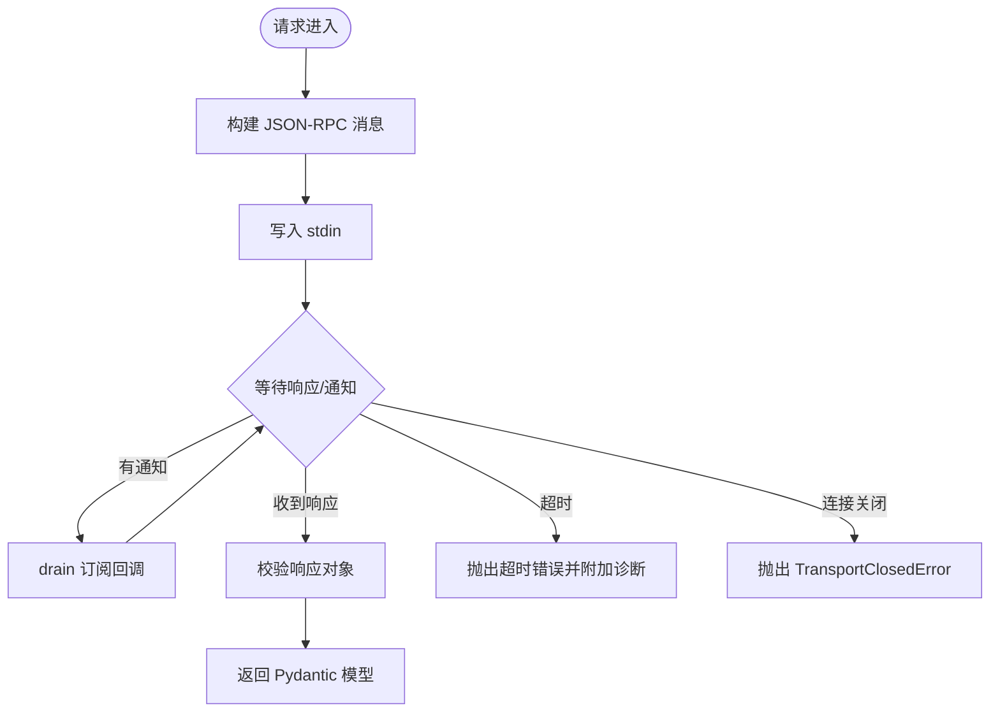
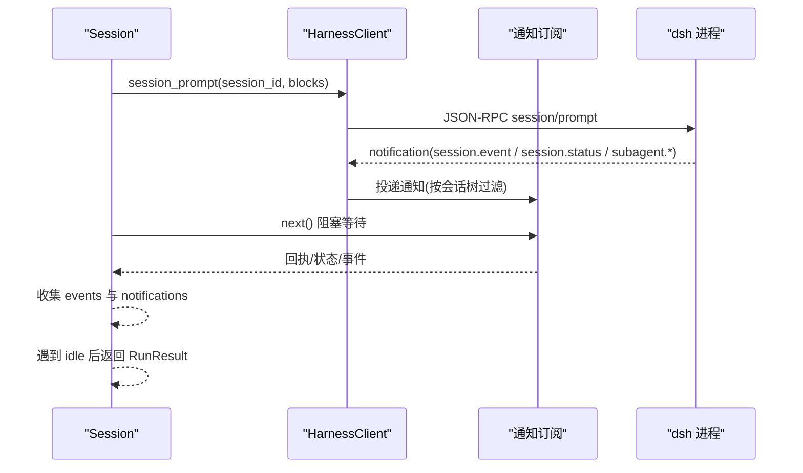
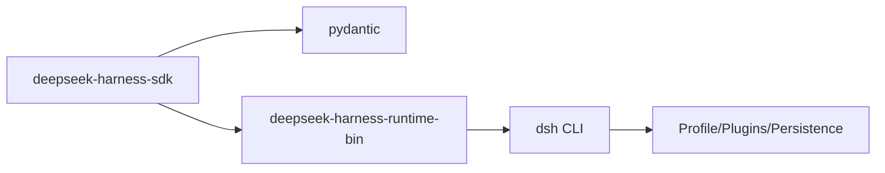

# Python SDK

<cite>
**本文引用的文件**
- [python/sdk/README.md](file://python/sdk/README.md)
- [python/sdk/pyproject.toml](file://python/sdk/pyproject.toml)
- [python/sdk/src/deepseek_harness/__init__.py](file://python/sdk/src/deepseek_harness/__init__.py)
- [python/sdk/src/deepseek_harness/api.py](file://python/sdk/src/deepseek_harness/api.py)
- [python/sdk/src/deepseek_harness/client.py](file://python/sdk/src/deepseek_harness/client.py)
- [python/sdk/src/deepseek_harness/models.py](file://python/sdk/src/deepseek_harness/models.py)
- [python/sdk/src/deepseek_harness/errors.py](file://python/sdk/src/deepseek_harness/errors.py)
- [python/sdk/examples/minimal.py](file://python/sdk/examples/minimal.py)
- [python/sdk/examples/README.md](file://python/sdk/examples/README.md)
- [docs/user/guide/python-sdk.md](file://docs/user/guide/python-sdk.md)
- [packages/sdk/protocol/src/transport.ts](file://packages/sdk/protocol/src/transport.ts)
</cite>

## 目录
1. [简介](#简介)
2. [项目结构](#项目结构)
3. [核心组件](#核心组件)
4. [架构总览](#架构总览)
5. [详细组件分析](#详细组件分析)
6. [依赖关系分析](#依赖关系分析)
7. [性能与并发特性](#性能与并发特性)
8. [故障排查指南](#故障排查指南)
9. [结论](#结论)
10. [附录：安装、配置与示例](#附录安装配置与示例)

## 简介
本文件面向使用 DeepSeek Harness 的 Python 开发者，提供完整的 SDK 使用指南。内容涵盖安装与配置、基本用法、高级特性（会话管理、通知订阅、子代理树追踪）、错误处理机制、以及与 TypeScript 后端的 JSON-RPC 通信协议和数据类型映射。SDK 通过启动本地 `dsh` 进程并以标准输入输出进行 JSON-RPC 通信，实现会话驱动、消息发送、工具调用和结果收集。

## 项目结构
Python SDK 位于仓库的 `python/sdk` 目录，主要包含：
- 包入口与导出：`src/deepseek_harness/__init__.py`
- 高层 API：`api.py`（DeepSeekHarness、Session、RunResult）
- 底层客户端：`client.py`（HarnessClient、通知订阅、JSON-RPC 传输）
- 数据模型：`models.py`（Notification、IncomingRequest、InitializeResponse 等）
- 异常定义：`errors.py`（TransportClosedError、SdkProtocolError、JsonRpcError）
- 示例程序：`examples/minimal.py`
- 文档与说明：`README.md`、`docs/user/guide/python-sdk.md`、`examples/README.md`
- 打包配置：`pyproject.toml`



**图表来源**
- [python/sdk/src/deepseek_harness/api.py:49-131](file://python/sdk/src/deepseek_harness/api.py#L49-L131)
- [python/sdk/src/deepseek_harness/client.py:39-131](file://python/sdk/src/deepseek_harness/client.py#L39-L131)

**章节来源**
- [python/sdk/README.md:1-73](file://python/sdk/README.md#L1-L73)
- [python/sdk/pyproject.toml:1-38](file://python/sdk/pyproject.toml#L1-L38)
- [python/sdk/src/deepseek_harness/__init__.py:1-20](file://python/sdk/src/deepseek_harness/__init__.py#L1-L20)

## 核心组件
- DeepSeekHarness：可复用的同步 SDK，负责启动并初始化运行时、创建会话、执行任务并返回结果。
- Session：封装一次会话的执行生命周期，包括消息投递、事件收集、状态等待与最终响应提取。
- RunResult：封装一次 run 的结果，包括最终回复、结束原因、事件列表与通知列表。
- HarnessClient：底层 JSON-RPC 客户端，管理子进程、读写线程、请求-响应匹配、通知分发与订阅。
- NotificationSubscription：通知订阅句柄，支持过滤、批量消费与上下文管理。
- 数据模型：Notification、IncomingRequest、InitializeResponse、ServerInfo 等。
- 异常体系：TransportClosedError、SdkProtocolError、JsonRpcError。

**章节来源**
- [python/sdk/src/deepseek_harness/api.py:13-131](file://python/sdk/src/deepseek_harness/api.py#L13-L131)
- [python/sdk/src/deepseek_harness/client.py:24-590](file://python/sdk/src/deepseek_harness/client.py#L24-L590)
- [python/sdk/src/deepseek_harness/models.py:1-33](file://python/sdk/src/deepseek_harness/models.py#L1-L33)
- [python/sdk/src/deepseek_harness/errors.py:1-24](file://python/sdk/src/deepseek_harness/errors.py#L1-L24)

## 架构总览
SDK 采用“进程内 Python 客户端 + 外部 dsh 进程”的架构。Python 侧通过标准输入输出以 JSON-RPC 协议与 dsh 进程通信；dsh 进程由所选 profile 管理，承载 Agent 编排、工具执行、持久化、凭据与关闭行为。



**图表来源**
- [python/sdk/src/deepseek_harness/api.py:103-189](file://python/sdk/src/deepseek_harness/api.py#L103-L189)
- [python/sdk/src/deepseek_harness/client.py:133-189](file://python/sdk/src/deepseek_harness/client.py#L133-L189)
- [packages/sdk/protocol/src/transport.ts:112-238](file://packages/sdk/protocol/src/transport.ts#L112-L238)

## 详细组件分析

### 高层 API：DeepSeekHarness 与 Session
- DeepSeekHarness 支持懒启动与复用，内部维护一个 HarnessClient，并在首次使用时完成 initialize。
- Session.run 将字符串或结构化输入归一化为内容块，订阅会话通知，发送 prompt，等待收到收件箱回执与 idle 状态后，从事件中提取最终回复与结束原因。
- RunResult 包含 session_id、final_response、finish_reason、events、notifications。



**图表来源**
- [python/sdk/src/deepseek_harness/api.py:49-189](file://python/sdk/src/deepseek_harness/api.py#L49-L189)

**章节来源**
- [python/sdk/src/deepseek_harness/api.py:49-189](file://python/sdk/src/deepseek_harness/api.py#L49-L189)

### 底层客户端：HarnessClient
- 进程管理：启动 dsh 子进程，分别用独立线程读取 stdout 与 stderr。
- JSON-RPC 请求-响应：为每个请求分配唯一 id，维护等待队列，超时控制，错误包装。
- 通知系统：全局通知队列 + 基于会话树的订阅过滤；记录 subagent.started 父子关系，支持跨订阅保持祖先信息。
- 关闭流程：先发送 shutdown 请求，再尝试优雅退出，必要时 terminate/kill，最后清理资源并唤醒所有等待者。



**图表来源**
- [python/sdk/src/deepseek_harness/client.py:191-330](file://python/sdk/src/deepseek_harness/client.py#L191-L330)
- [python/sdk/src/deepseek_harness/client.py:332-435](file://python/sdk/src/deepseek_harness/client.py#L332-L435)

**章节来源**
- [python/sdk/src/deepseek_harness/client.py:39-590](file://python/sdk/src/deepseek_harness/client.py#L39-L590)

### 数据类型与序列化
- 传输层：每行一条 JSON 文本，遵循 JSON-RPC 2.0 规范（含 request、response、notification）。
- 数据类型：JsonValue、JsonObject、Notification、IncomingRequest、InitializeResponse、ServerInfo。
- 序列化：Python 侧使用 json.dumps 生成紧凑 JSON 并追加换行；后端 TypeScript 侧解析每行 JSON 并路由到对应处理器。

```mermaid
erDiagram
NOTIFICATION {
string method
object payload
}
INCOMING_REQUEST {
string|int id
string method
object payload
}
SERVER_INFO {
string name
string version
}
INITIALIZE_RESPONSE {
ServerInfo serverInfo
}
```

**图表来源**
- [python/sdk/src/deepseek_harness/models.py:1-33](file://python/sdk/src/deepseek_harness/models.py#L1-L33)
- [packages/sdk/protocol/src/transport.ts:201-238](file://packages/sdk/protocol/src/transport.ts#L201-L238)

**章节来源**
- [python/sdk/src/deepseek_harness/models.py:1-33](file://python/sdk/src/deepseek_harness/models.py#L1-L33)
- [packages/sdk/protocol/src/transport.ts:112-238](file://packages/sdk/protocol/src/transport.ts#L112-L238)

### 会话管理与通知订阅
- 会话生命周期：Session.run 通过 session_prompt 投递消息，订阅该会话及其子代理的通知，等待收件箱回执与 idle 状态，然后汇总事件与通知返回。
- 通知过滤：subscribe_session_notifications 自动根据 subagent.started/finished 建立父子关系，确保只接收当前会话树的通知。
- 低层能力：HarnessClient 暴露 next_request/respond/respond_error，便于桥接或扩展。



**图表来源**
- [python/sdk/src/deepseek_harness/api.py:139-189](file://python/sdk/src/deepseek_harness/api.py#L139-L189)
- [python/sdk/src/deepseek_harness/client.py:226-239](file://python/sdk/src/deepseek_harness/client.py#L226-L239)
- [python/sdk/src/deepseek_harness/client.py:492-536](file://python/sdk/src/deepseek_harness/client.py#L492-L536)

**章节来源**
- [python/sdk/src/deepseek_harness/api.py:139-189](file://python/sdk/src/deepseek_harness/api.py#L139-L189)
- [python/sdk/src/deepseek_harness/client.py:226-536](file://python/sdk/src/deepseek_harness/client.py#L226-L536)

### 工具调用与 Agent 操作
- 工具调用由 dsh 进程内的 Agent 编排与插件系统负责；Python SDK 不直接执化工具，而是通过会话事件与通知间接感知工具执行过程。
- 典型事件流：session.event（assistant/message、turn/end 等）、subagent.started/finished、session.status。
- 可通过 on_notification 实时处理工具执行过程中的中间状态。

**章节来源**
- [python/sdk/README.md:64-70](file://python/sdk/README.md#L64-L70)
- [python/sdk/src/deepseek_harness/api.py:149-189](file://python/sdk/src/deepseek_harness/api.py#L149-L189)

### 异步编程支持
- 当前 SDK 为同步设计，使用多线程处理 I/O（reader/stderr），但对外暴露同步接口。
- 若需异步集成，可在应用层使用线程池或协程包装同步调用；SDK 内部未提供 async API。

[本节为概念性说明，不直接分析具体文件]

### 错误处理机制
- 传输层错误：TransportClosedError（子进程退出或 stdout 关闭）。
- 协议错误：SdkProtocolError（如 turn/end 缺少 reason.kind）。
- JSON-RPC 错误：JsonRpcError（携带 code、message、data）。
- 超时：initialize_timeout_seconds 与 request_timeout_seconds 控制初始化与请求超时，失败时附带运行时诊断信息。

**章节来源**
- [python/sdk/src/deepseek_harness/errors.py:1-24](file://python/sdk/src/deepseek_harness/errors.py#L1-L24)
- [python/sdk/src/deepseek_harness/client.py:94-131](file://python/sdk/src/deepseek_harness/client.py#L94-L131)
- [python/sdk/src/deepseek_harness/client.py:133-170](file://python/sdk/src/deepseek_harness/client.py#L133-L170)
- [python/sdk/src/deepseek_harness/client.py:292-330](file://python/sdk/src/deepseek_harness/client.py#L292-L330)
- [python/sdk/src/deepseek_harness/api.py:231-248](file://python/sdk/src/deepseek_harness/api.py#L231-L248)

### 连接池管理
- SDK 不维护连接池；每次 DeepSeekHarness 实例持有单个 dsh 子进程，通过上下文管理器或显式 close 保证资源释放。
- 多实例可并行运行多个独立的 dsh 进程，各自拥有独立的 home、profile、会话与资源。

**章节来源**
- [python/sdk/src/deepseek_harness/api.py:49-118](file://python/sdk/src/deepseek_harness/api.py#L49-L118)
- [python/sdk/src/deepseek_harness/client.py:71-131](file://python/sdk/src/deepseek_harness/client.py#L71-L131)

## 依赖关系分析
- Python SDK 依赖 pydantic 用于数据模型校验，依赖 deepseek-harness-runtime-bin 提供的 dsh 可执行文件。
- 打包与发布：hatchling 构建 wheel，uv 源指向 sdk-runtime 以便开发模式编辑安装。
- 文档与教程：docs/user/guide/python-sdk.md 提供用户级入门与示例运行方式。



**图表来源**
- [python/sdk/pyproject.toml:1-38](file://python/sdk/pyproject.toml#L1-L38)

**章节来源**
- [python/sdk/pyproject.toml:1-38](file://python/sdk/pyproject.toml#L1-L38)
- [docs/user/guide/python-sdk.md:1-151](file://docs/user/guide/python-sdk.md#L1-L151)

## 性能与并发特性
- I/O 并发：stdout/stderr 读取与写入使用独立线程，避免阻塞主线程。
- 通知处理：订阅者在 drain 中批量消费，减少轮询开销。
- 超时控制：initialize 与 request 均支持超时，防止长时间挂起。
- 资源回收：close 流程包含优雅关闭与强制终止，确保进程与线程被正确回收。

[本节为通用性能讨论，不直接分析具体文件]

## 故障排查指南
- 初始化超时：检查 profile 是否包含 JSON-RPC 服务器行；确认 dsh_home 与 patches 有效；查看错误信息中的 profile 名称与运行时诊断。
- 传输关闭：当子进程意外退出或 stdout 关闭时抛出 TransportClosedError；查看 stderr 尾部与退出码定位问题。
- 协议错误：turn/end 缺少 reason.kind 会抛出 SdkProtocolError；检查后端事件是否符合协议。
- 请求超时：设置合适的 request_timeout_seconds；在 on_notification 中观察中间状态，定位卡点。
- 环境变量覆盖：通过 base_url 与 api_key 显式覆盖 DEEPSEEK_BASE_URL 与 DEEPSEEK_API_KEY，确保后端可达。

**章节来源**
- [python/sdk/src/deepseek_harness/client.py:94-170](file://python/sdk/src/deepseek_harness/client.py#L94-L170)
- [python/sdk/src/deepseek_harness/client.py:433-456](file://python/sdk/src/deepseek_harness/client.py#L433-L456)
- [python/sdk/src/deepseek_harness/api.py:231-248](file://python/sdk/src/deepseek_harness/api.py#L231-L248)

## 结论
DeepSeek Harness Python SDK 提供了简洁的高层 API 与稳健的底层 JSON-RPC 客户端，支持会话管理、通知订阅、子代理树追踪与完善的错误处理。通过明确的 home/profile/patches 配置，开发者可以灵活定制 Agent 行为与工具链。结合 TypeScript 后端的 JSON-RPC 协议，SDK 实现了稳定可靠的跨语言通信。建议在生产环境中合理设置超时、隔离 home、并使用上下文管理器确保资源释放。

[本节为总结性内容，不直接分析具体文件]

## 附录：安装、配置与示例

### 安装与前置条件
- 安装 SDK：pip 安装 deepseek-harness-sdk，同时安装匹配的 native runtime wheel。
- 环境要求：Python 3.10+，Linux/macOS/Windows 平台，具备兼容的 DeepSeek API 端点与凭据。
- 工作空间与 Home：必须提供绝对路径的 dsh_home 与工作区 cwd；SDK 不会隐式读取 ~/.dsh。

**章节来源**
- [docs/user/guide/python-sdk.md:7-37](file://docs/user/guide/python-sdk.md#L7-L37)
- [python/sdk/README.md:5-16](file://python/sdk/README.md#L5-L16)

### 基本用法
- 创建 Harness 并运行任务：使用 DeepSeekHarness 上下文管理器，传入 provider、model、max_tokens、cwd、dsh_home、profile 等参数。
- 获取结果：RunResult.final_response 为最后一次提交的助手文本；finish_reason 为最后一个 turn/end 的 kind。

**章节来源**
- [python/sdk/README.md:17-33](file://python/sdk/README.md#L17-L33)
- [python/sdk/examples/minimal.py:13-44](file://python/sdk/examples/minimal.py#L13-L44)

### 高级特性
- 插件与配置：通过 dsh plugin 命令安装外部 bundle；或通过 patches 传递 per-launch 补丁。
- 会话与通知：使用 subscribe_session_notifications 订阅特定会话及其子代理的通知；on_notification 回调可实时处理中间状态。
- 低层能力：HarnessClient 暴露 session_prompt、next_request、respond/respond_error，便于桥接自定义逻辑。

**章节来源**
- [python/sdk/README.md:35-63](file://python/sdk/README.md#L35-L63)
- [python/sdk/src/deepseek_harness/client.py:226-260](file://python/sdk/src/deepseek_harness/client.py#L226-L260)

### 与 TypeScript 后端的通信协议
- 传输格式：每行一条 JSON，遵循 JSON-RPC 2.0；包含 request/response/notification。
- 方法示例：initialize、session/prompt、shutdown；通知包括 session.event、session.status、subagent.started/finished。
- 类型映射：Python 侧使用 Pydantic 模型校验 InitializeResponse、ServerInfo；Notification 与 IncomingRequest 作为通用数据结构。

**章节来源**
- [packages/sdk/protocol/src/transport.ts:112-238](file://packages/sdk/protocol/src/transport.ts#L112-L238)
- [python/sdk/src/deepseek_harness/models.py:1-33](file://python/sdk/src/deepseek_harness/models.py#L1-L33)

### 完整示例参考
- 最小示例脚本：examples/minimal.py 演示如何解析参数、创建 Harness、运行任务并打印最终回复。
- 示例说明：examples/README.md 描述 minimal 模式的工具集、持久化与注意事项。

**章节来源**
- [python/sdk/examples/minimal.py:1-49](file://python/sdk/examples/minimal.py#L1-L49)
- [python/sdk/examples/README.md:1-45](file://python/sdk/examples/README.md#L1-L45)