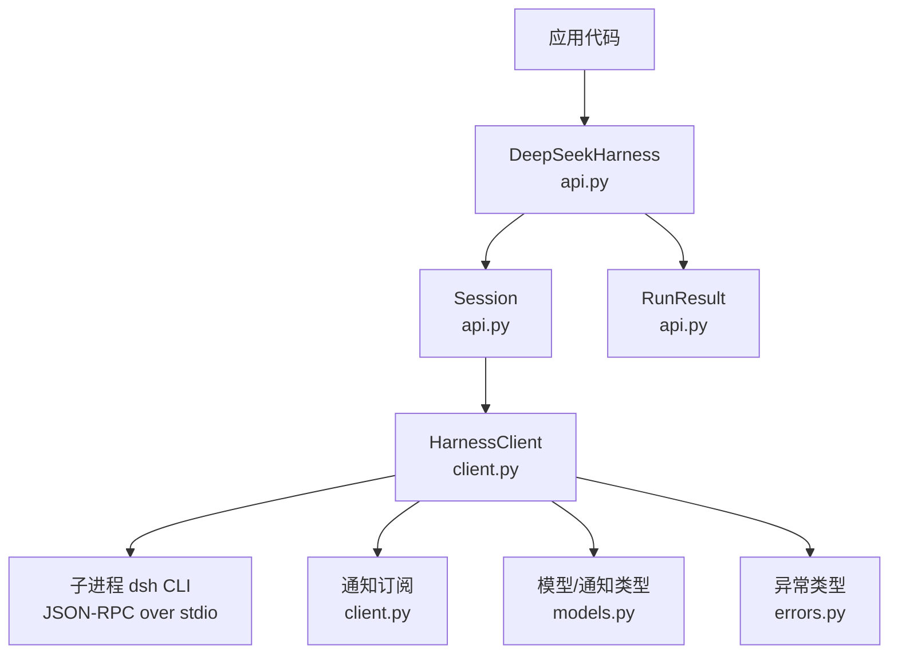
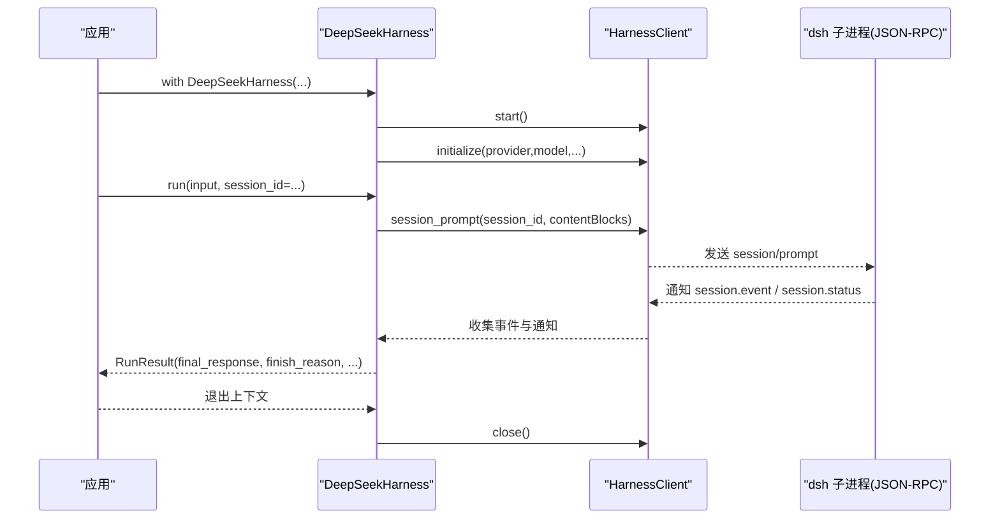
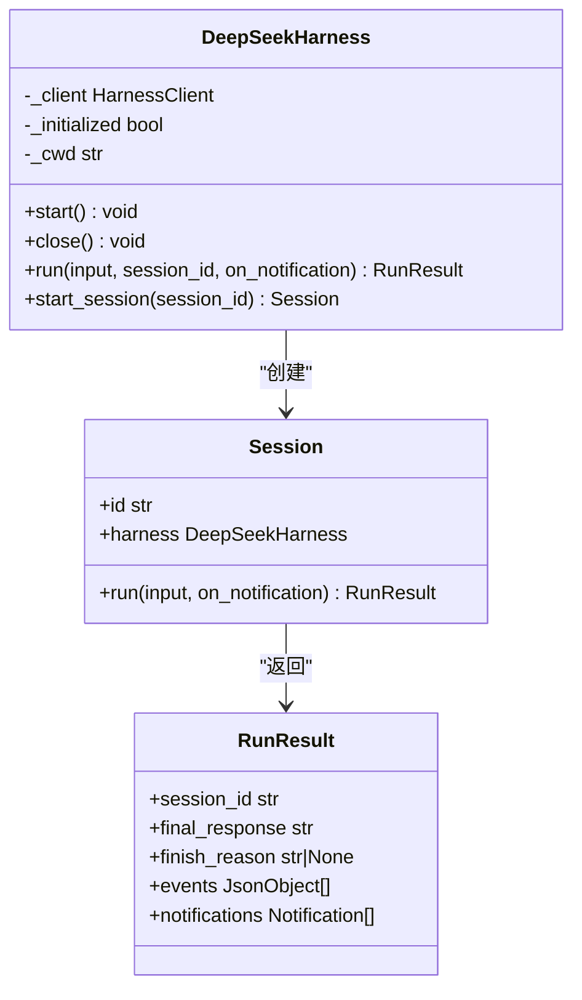
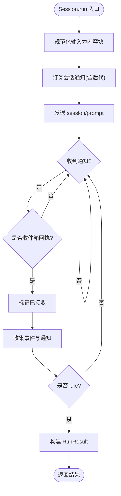
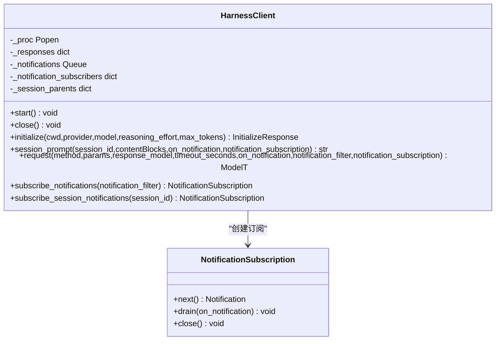
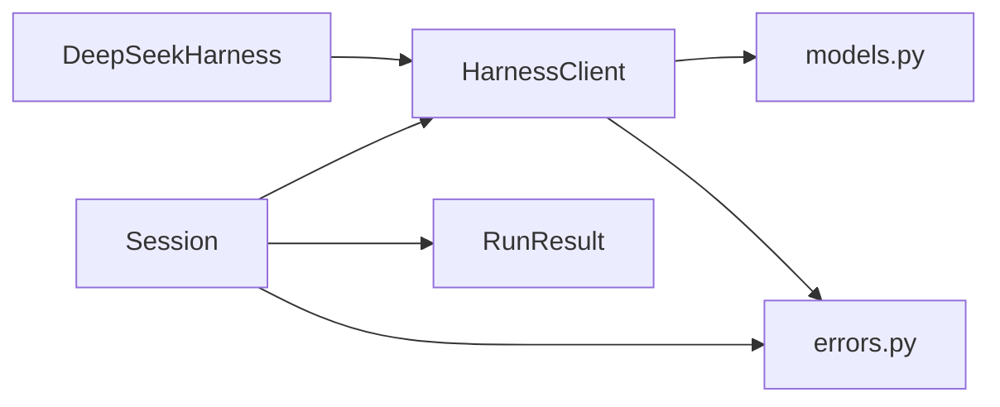

# 基础用法

<cite>
**本文引用的文件**
- [api.py](file://python/sdk/src/deepseek_harness/api.py)
- [client.py](file://python/sdk/src/deepseek_harness/client.py)
- [models.py](file://python/sdk/src/deepseek_harness/models.py)
- [errors.py](file://python/sdk/src/deepseek_harness/errors.py)
- [__init__.py](file://python/sdk/src/deepseek_harness/__init__.py)
- [README.md](file://python/sdk/README.md)
- [README.zh.md](file://python/sdk/README.zh.md)
- [python-sdk.md](file://docs/user/guide/python-sdk.md)
- [minimal.py](file://python/sdk/examples/minimal.py)
</cite>

## 目录
1. [简介](#简介)
2. [项目结构](#项目结构)
3. [核心组件](#核心组件)
4. [架构总览](#架构总览)
5. [详细组件分析](#详细组件分析)
6. [依赖关系分析](#依赖关系分析)
7. [性能与超时](#性能与超时)
8. [故障排查指南](#故障排查指南)
9. [结论](#结论)
10. [附录：完整示例流程](#附录完整示例流程)

## 简介
本章节面向首次接触 DeepSeek Harness Python SDK 的用户，聚焦以下目标：
- 掌握 DeepSeekHarness 类的基本使用模式，尤其是上下文管理器用法
- 理解会话创建与管理（session_id 的作用与会话生命周期）
- 学会发送消息并处理响应（run 方法与 RunResult 的使用）
- 了解异步编程支持与错误处理机制
- 获取从初始化到获取结果的完整流程示例与最佳实践建议

## 项目结构
Python SDK 的核心位于 python/sdk/src/deepseek_harness 目录下，主要模块职责如下：
- api.py：对外暴露的 API（DeepSeekHarness、Session、RunResult、配置等）
- client.py：底层 JSON-RPC 客户端（进程管理、请求/通知收发、订阅）
- models.py：通用数据模型（Notification、IncomingRequest、InitializeResponse 等）
- errors.py：异常类型定义（TransportClosedError、SdkProtocolError、JsonRpcError 等）
- __init__.py：统一导出公共符号

图表来源
- [api.py:49-131](file://python/sdk/src/deepseek_harness/api.py#L49-L131)
- [client.py:39-239](file://python/sdk/src/deepseek_harness/client.py#L39-L239)
- [models.py:13-33](file://python/sdk/src/deepseek_harness/models.py#L13-L33)
- [errors.py:4-24](file://python/sdk/src/deepseek_harness/errors.py#L4-L24)

章节来源
- [__init__.py:1-20](file://python/sdk/src/deepseek_harness/__init__.py#L1-L20)
- [README.md:11-33](file://python/sdk/README.md#L11-L33)

## 核心组件
- DeepSeekHarness：高层封装，负责启动运行时、初始化 provider/model、提供 run() 便捷入口；支持上下文管理器自动关闭
- Session：封装一次会话的运行，维护 session_id，收集事件与通知，返回 RunResult
- RunResult：包含 session_id、final_response、finish_reason、events、notifications
- HarnessClient：底层 JSON-RPC 客户端，管理子进程生命周期、请求/响应队列、通知订阅、超时控制
- NotificationSubscription：通知订阅句柄，支持过滤与批量消费
- 模型与异常：Notification、IncomingRequest、InitializeResponse、ServerInfo；以及 TransportClosedError、SdkProtocolError、JsonRpcError

章节来源
- [api.py:13-47](file://python/sdk/src/deepseek_harness/api.py#L13-L47)
- [api.py:49-189](file://python/sdk/src/deepseek_harness/api.py#L49-L189)
- [client.py:24-63](file://python/sdk/src/deepseek_harness/client.py#L24-L63)
- [client.py:539-578](file://python/sdk/src/deepseek_harness/client.py#L539-L578)
- [models.py:13-33](file://python/sdk/src/deepseek_harness/models.py#L13-L33)
- [errors.py:4-24](file://python/sdk/src/deepseek_harness/errors.py#L4-L24)

## 架构总览
SDK 通过启动本地 dsh CLI 子进程，基于标准输入输出以“按行分隔的 JSON-RPC”进行通信。DeepSeekHarness 在首次使用时懒加载启动，并在上下文退出或显式 close() 时安全关闭。Session.run() 会订阅根会话及其已知后代的通知，直到 agent 进入 idle 状态后结束活动区间并返回结果。

图表来源
- [api.py:92-131](file://python/sdk/src/deepseek_harness/api.py#L92-L131)
- [api.py:139-189](file://python/sdk/src/deepseek_harness/api.py#L139-L189)
- [client.py:71-170](file://python/sdk/src/deepseek_harness/client.py#L71-L170)
- [client.py:172-239](file://python/sdk/src/deepseek_harness/client.py#L172-L239)

## 详细组件分析

### DeepSeekHarness：上下文管理与运行入口
- 懒启动：首次调用 start() 才启动子进程并执行 initialize
- 上下文管理器：__enter__/__exit__ 确保资源释放
- run()：内部创建 Session 并委托其 run()，简化调用方使用
- 配置项：provider、model、reasoning_effort、max_tokens、cwd/runtime_cwd、profile、patches、dsh_home、env、initialize_timeout_seconds、request_timeout_seconds、shutdown_timeout_seconds、base_url、api_key

图表来源
- [api.py:49-131](file://python/sdk/src/deepseek_harness/api.py#L49-L131)
- [api.py:134-189](file://python/sdk/src/deepseek_harness/api.py#L134-L189)
- [api.py:41-47](file://python/sdk/src/deepseek_harness/api.py#L41-L47)

章节来源
- [api.py:13-38](file://python/sdk/src/deepseek_harness/api.py#L13-L38)
- [api.py:49-131](file://python/sdk/src/deepseek_harness/api.py#L49-L131)

### Session：会话生命周期与结果构建
- 会话 ID：由调用方指定或由 SDK 生成，用于隔离对话与资源
- 活动区间：从提示词被持久 inbox 接收开始，到整个 agent 下一次 idle 结束
- 事件收集：仅收集根会话事件，用于提取 final_response 与 finish_reason
- 通知收集：按协议顺序收集根会话及已知后代通知

图表来源
- [api.py:139-189](file://python/sdk/src/deepseek_harness/api.py#L139-L189)
- [api.py:192-208](file://python/sdk/src/deepseek_harness/api.py#L192-L208)
- [api.py:211-248](file://python/sdk/src/deepseek_harness/api.py#L211-L248)

章节来源
- [api.py:134-189](file://python/sdk/src/deepseek_harness/api.py#L134-L189)
- [api.py:192-248](file://python/sdk/src/deepseek_harness/api.py#L192-L248)

### HarnessClient：JSON-RPC 客户端与通知系统
- 子进程管理：start/close，带优雅关闭与诊断信息
- 请求/响应：基于队列与锁实现线程安全，支持超时
- 通知订阅：支持全局订阅与会话树订阅，可过滤
- 会话关系：记录 subagent.started/finished 以识别后代会话

图表来源
- [client.py:39-239](file://python/sdk/src/deepseek_harness/client.py#L39-L239)
- [client.py:539-578](file://python/sdk/src/deepseek_harness/client.py#L539-L578)

章节来源
- [client.py:71-170](file://python/sdk/src/deepseek_harness/client.py#L71-L170)
- [client.py:172-239](file://python/sdk/src/deepseek_harness/client.py#L172-L239)
- [client.py:262-330](file://python/sdk/src/deepseek_harness/client.py#L262-L330)
- [client.py:492-536](file://python/sdk/src/deepseek_harness/client.py#L492-L536)

### 模型与异常
- 模型：Notification、IncomingRequest、InitializeResponse、ServerInfo、JsonObject/JsonValue
- 异常：TransportClosedError（传输关闭）、SdkProtocolError（协议违规）、JsonRpcError（JSON-RPC 错误）

章节来源
- [models.py:13-33](file://python/sdk/src/deepseek_harness/models.py#L13-L33)
- [errors.py:4-24](file://python/sdk/src/deepseek_harness/errors.py#L4-L24)

## 依赖关系分析
- DeepSeekHarness 依赖 HarnessClient 完成底层通信
- Session 依赖 HarnessClient 的 session_prompt 与通知订阅
- RunResult 由 Session 根据事件与通知构建
- 所有模块通过 models.py 共享数据结构，通过 errors.py 统一异常体系

图表来源
- [api.py:49-189](file://python/sdk/src/deepseek_harness/api.py#L49-L189)
- [client.py:39-239](file://python/sdk/src/deepseek_harness/client.py#L39-L239)
- [models.py:13-33](file://python/sdk/src/deepseek_harness/models.py#L13-L33)
- [errors.py:4-24](file://python/sdk/src/deepseek_harness/errors.py#L4-L24)

章节来源
- [__init__.py:1-20](file://python/sdk/src/deepseek_harness/__init__.py#L1-L20)

## 性能与超时
- 懒启动：首次调用时才启动子进程，避免无谓开销
- 初始化超时：默认 30 秒，可通过 initialize_timeout_seconds 调整
- 请求超时：未设置 request_timeout_seconds 时普通轮次不限制；建议设置以避免长时间阻塞
- 关闭超时：shutdown_timeout_seconds 控制优雅关闭等待时间
- 通知流控：订阅支持 drain 批量消费，减少频繁回调开销

章节来源
- [api.py:13-38](file://python/sdk/src/deepseek_harness/api.py#L13-L38)
- [client.py:71-170](file://python/sdk/src/deepseek_harness/client.py#L71-L170)
- [client.py:262-330](file://python/sdk/src/deepseek_harness/client.py#L262-L330)
- [client.py:569-578](file://python/sdk/src/deepseek_harness/client.py#L569-L578)

## 故障排查指南
常见错误与定位要点：
- TransportClosedError：子进程退出或 stdout 关闭，检查环境、路径、权限与日志
- SdkProtocolError：turn/end 缺少 data.reason.kind，检查事件完整性
- JsonRpcError：JSON-RPC 错误码与消息，结合运行时诊断信息定位
- 超时：initialize 或 request 超时，查看所选 profile 与运行时诊断

排查步骤建议：
- 确认 dsh_home 非空且绝对路径正确
- 确认 provider 与 model 可用，必要时设置 base_url 与 api_key
- 捕获异常并打印 stderr 尾部与退出码
- 对长任务设置 request_timeout_seconds，避免无限等待

章节来源
- [errors.py:4-24](file://python/sdk/src/deepseek_harness/errors.py#L4-L24)
- [client.py:94-170](file://python/sdk/src/deepseek_harness/client.py#L94-L170)
- [client.py:420-456](file://python/sdk/src/deepseek_harness/client.py#L420-L456)
- [api.py:231-248](file://python/sdk/src/deepseek_harness/api.py#L231-L248)

## 结论
DeepSeek Harness Python SDK 通过简洁的高层 API 与稳健的底层客户端，提供了易用的会话管理与结果处理能力。推荐始终使用上下文管理器确保资源释放，合理设置超时与凭据，利用通知订阅实现实时反馈，并通过独立 home 与会话 ID 实现隔离与复用。

## 附录：完整示例流程
以下展示从初始化到获取结果的完整流程（不含具体代码内容，仅提供路径参考）：
- 安装与准备：参考教程与 README
- 创建 Harness 并传入必要参数（provider、model、dsh_home、cwd 等）
- 使用上下文管理器包裹运行
- 调用 run() 发送消息并指定 session_id
- 读取 RunResult 的 final_response 与 finish_reason
- 可选：通过 on_notification 或 notifications 列表处理中间通知

参考路径
- [README.md:17-33](file://python/sdk/README.md#L17-L33)
- [README.zh.md:17-33](file://python/sdk/README.zh.md#L17-L33)
- [python-sdk.md:81-106](file://docs/user/guide/python-sdk.md#L81-L106)
- [minimal.py:33-44](file://python/sdk/examples/minimal.py#L33-L44)