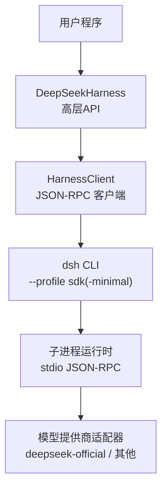
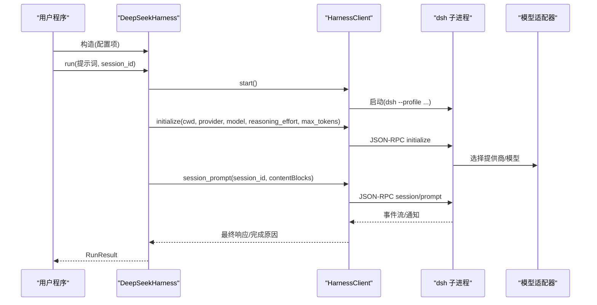
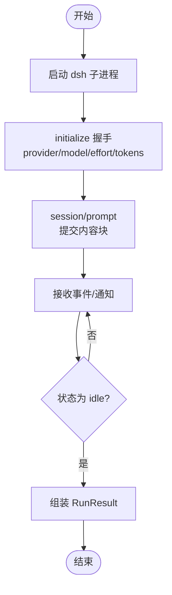
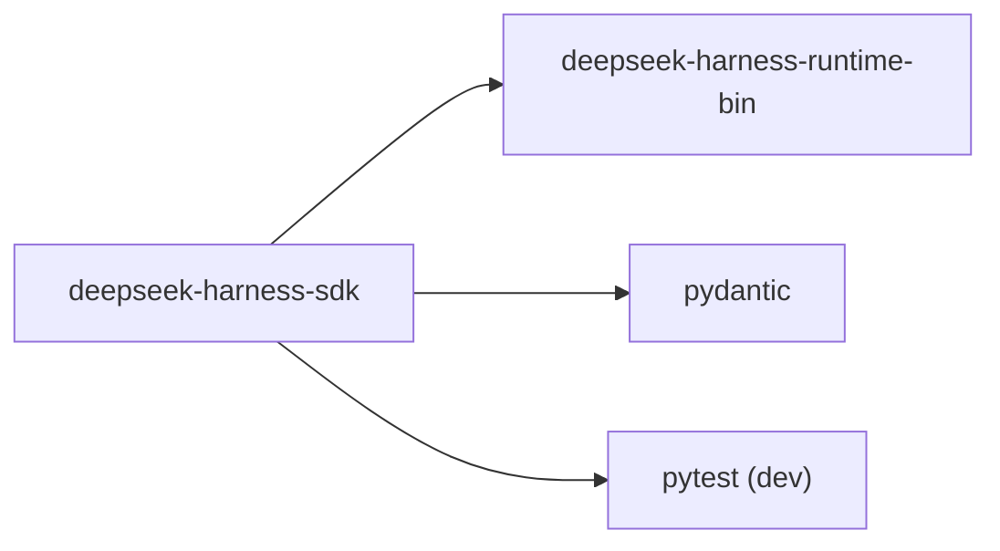

# 安装与配置

<cite>
**本文引用的文件**
- [pyproject.toml](file://python/sdk/pyproject.toml)
- [README.md](file://python/sdk/README.md)
- [api.py](file://python/sdk/src/deepseek_harness/api.py)
- [client.py](file://python/sdk/src/deepseek_harness/client.py)
- [__init__.py](file://python/sdk/src/deepseek_harness/__init__.py)
- [python-sdk.md](file://docs/user/guide/python-sdk.md)
- [minimal.py](file://python/sdk/examples/minimal.py)
</cite>

## 目录
1. [简介](#简介)
2. [项目结构](#项目结构)
3. [核心组件](#核心组件)
4. [架构总览](#架构总览)
5. [详细组件分析](#详细组件分析)
6. [依赖关系分析](#依赖关系分析)
7. [性能注意事项](#性能注意事项)
8. [故障排除指南](#故障排除指南)
9. [结论](#结论)
10. [附录](#附录)

## 简介
本章节面向首次接触 DeepSeek Harness Python SDK 的用户，提供从安装、环境准备到运行配置的完整说明。你将了解：
- 如何通过 pip 安装 SDK 及其运行时依赖
- 环境变量 DSH_HOME、DEEPSEEK_API_KEY、DEEPSEEK_BASE_URL 的作用与设置方式
- DeepSeekHarness 类的初始化参数（如 dsh_home、cwd、provider、model、reasoning_effort、max_tokens、base_url、api_key 等）
- 不同场景下的配置示例（基本、高级、自定义）
- 运行时环境与平台兼容性要求
- 常见安装与运行问题的排查方法

## 项目结构
Python SDK 位于仓库的 python/sdk 目录，核心代码在 src/deepseek_harness 下，包含对外暴露的高层 API 与底层 JSON-RPC 客户端；examples 提供可运行的最小示例；文档位于 docs/user/guide/python-sdk.md。

图表来源
- [api.py:13-38](file://python/sdk/src/deepseek_harness/api.py#L13-L38)
- [client.py:24-37](file://python/sdk/src/deepseek_harness/client.py#L24-L37)
- [client.py:458-486](file://python/sdk/src/deepseek_harness/client.py#L458-L486)

章节来源
- [pyproject.toml:5-16](file://python/sdk/pyproject.toml#L5-L16)
- [python-sdk.md:7-14](file://docs/user/guide/python-sdk.md#L7-L14)

## 核心组件
- DeepSeekHarnessConfig：定义启动运行时所需的全部配置项，包括 provider、model、reasoning_effort、max_tokens、cwd、runtime_cwd、dsh_bin、profile、patches、dsh_home、env、initialize_timeout_seconds、request_timeout_seconds、shutdown_timeout_seconds、base_url、api_key。
- DeepSeekHarness：封装生命周期管理（start/close）、会话创建与任务执行（run），内部维护一个 HarnessClient 实例。
- HarnessConfig/HarnessClient：负责启动 dsh 子进程、建立 stdio JSON-RPC 通道、发送 initialize/session/prompt/shutdown 等请求，并处理超时、诊断信息收集与错误传播。

章节来源
- [api.py:13-38](file://python/sdk/src/deepseek_harness/api.py#L13-L38)
- [api.py:49-131](file://python/sdk/src/deepseek_harness/api.py#L49-L131)
- [client.py:24-37](file://python/sdk/src/deepseek_harness/client.py#L24-L37)
- [client.py:39-170](file://python/sdk/src/deepseek_harness/client.py#L39-L170)

## 架构总览
SDK 通过 Python 进程启动一个独立的 dsh 子进程，使用标准输入输出进行 JSON-RPC 通信。初始化阶段会传递工作目录、提供商、模型、推理强度与 token 上限等参数；后续通过 session/prompt 发起对话轮次，并在空闲时返回结果。

图表来源
- [api.py:103-131](file://python/sdk/src/deepseek_harness/api.py#L103-L131)
- [client.py:71-170](file://python/sdk/src/deepseek_harness/client.py#L71-L170)
- [client.py:172-189](file://python/sdk/src/deepseek_harness/client.py#L172-L189)

## 详细组件分析

### 安装与环境要求
- Python 版本：>= 3.10
- 平台支持：Linux x64/arm64、macOS 14+ arm64、Windows x64
- 依赖：
  - pydantic
  - deepseek-harness-runtime-bin（随 SDK 安装，提供 dsh 二进制）
- 安装命令：
  - Linux/macOS：python -m pip install deepseek-harness-sdk
  - Windows PowerShell：同上（确保已激活虚拟环境）

章节来源
- [python-sdk.md:7-14](file://docs/user/guide/python-sdk.md#L7-L14)
- [python-sdk.md:15-37](file://docs/user/guide/python-sdk.md#L15-L37)
- [pyproject.toml:5-16](file://python/sdk/pyproject.toml#L5-L16)

### 环境变量配置
- DSH_HOME：必须显式设置或作为非空字符串传入 dsh_home；SDK 不会隐式读取 ~/.dsh。用于隔离 profiles、plugins、sessions、credentials、settings 等资源。
- DEEPSEEK_API_KEY：认证凭据。可通过环境变量或 DeepSeekHarnessConfig.api_key/base_url 注入子进程环境。
- DEEPSEEK_BASE_URL：可选，覆盖默认 API 端点。可通过环境变量或 DeepSeekHarnessConfig.base_url 注入。

章节来源
- [client.py:471-479](file://python/sdk/src/deepseek_harness/client.py#L471-L479)
- [api.py:17-20](file://python/sdk/src/deepseek_harness/api.py#L17-L20)
- [api.py:71-74](file://python/sdk/src/deepseek_harness/api.py#L71-L74)
- [python-sdk.md:41-55](file://docs/user/guide/python-sdk.md#L41-L55)

### DeepSeekHarness 初始化参数详解
- provider：提供商路由标识，默认 deepseek-official。由所选 Cordis 组合注册。
- model：模型 ID，默认 deepseek-v4-flash。由适配器解析。
- reasoning_effort：可选，非空字符串，表示该路由的推理强度标识；省略则保留模型默认。
- max_tokens：可选正整数，限制根代理及其进程内后代的输出 token 数；省略则由提供商默认控制。
- cwd：Agent 工作目录；launch 前会被转换为绝对路径。
- runtime_cwd：子进程工作目录；若未设置则与 cwd 相同。
- dsh_bin：可选，指定 dsh 可执行文件路径；否则自动定位打包的 dsh。
- profile：配置文件集，默认 sdk；也可使用 sdk-minimal 等内置独立树。
- patches：补丁文件元组，按顺序追加到 profile 与 home 补丁层之后。
- dsh_home：必须显式设置或来自非空 DSH_HOME；用于隔离资源。
- env：向子进程注入的环境变量字典。
- initialize_timeout_seconds：初始化握手超时，默认 30 秒。
- request_timeout_seconds：请求级超时；None 表示无界。
- shutdown_timeout_seconds：关闭超时，默认 1 秒。
- base_url/api_key：分别覆盖子进程的 DEEPSEEK_BASE_URL/DEEPSEEK_API_KEY。

章节来源
- [api.py:13-38](file://python/sdk/src/deepseek_harness/api.py#L13-L38)
- [api.py:57-89](file://python/sdk/src/deepseek_harness/api.py#L57-L89)
- [client.py:133-170](file://python/sdk/src/deepseek_harness/client.py#L133-L170)
- [client.py:458-486](file://python/sdk/src/deepseek_harness/client.py#L458-L486)

### 使用场景与配置示例
- 基本配置：仅设置 dsh_home、cwd、provider、model，使用默认 profile 与超时。
- 高级配置：增加 reasoning_effort、max_tokens、request_timeout_seconds、shutdown_timeout_seconds、env 注入。
- 自定义配置：使用 sdk-minimal 或其他 profile，并通过 patches 注入应用级补丁；或通过 dsh plugin 持久化插件。

章节来源
- [README.md:17-33](file://python/sdk/README.md#L17-L33)
- [README.md:35-62](file://python/sdk/README.md#L35-L62)
- [python-sdk.md:81-106](file://docs/user/guide/python-sdk.md#L81-L106)
- [python-sdk.md:108-130](file://docs/user/guide/python-sdk.md#L108-L130)
- [minimal.py:13-44](file://python/sdk/examples/minimal.py#L13-L44)

### 运行时流程与数据流
- 启动：DeepSeekHarness.start() 调用 HarnessClient.start() 启动 dsh 子进程。
- 初始化：发送 initialize，携带 cwd、provider、model、reasoning_effort、max_tokens。
- 会话：Session.run() 通过 session_prompt 提交内容块，订阅通知直到 idle。
- 结果：RunResult 包含 final_response、finish_reason、events、notifications。

图表来源
- [api.py:103-131](file://python/sdk/src/deepseek_harness/api.py#L103-L131)
- [api.py:134-189](file://python/sdk/src/deepseek_harness/api.py#L134-L189)
- [client.py:172-189](file://python/sdk/src/deepseek_harness/client.py#L172-L189)

## 依赖关系分析
- 构建系统：hatchling
- 运行依赖：pydantic、deepseek-harness-runtime-bin（平台相关 wheel）
- 开发测试依赖：pytest
- 源码包位置：src/deepseek_harness

图表来源
- [pyproject.toml:1-16](file://python/sdk/pyproject.toml#L1-L16)

章节来源
- [pyproject.toml:1-16](file://python/sdk/pyproject.toml#L1-L16)

## 性能注意事项
- 初始化握手具有独立的 30 秒默认超时；普通请求若无 request_timeout_seconds 则为无界。
- 合理设置 max_tokens 以控制输出长度，避免过长响应影响延迟。
- 复用 Harness 实例可减少子进程启动开销；按需设置 request_timeout_seconds 以避免长时间阻塞。
- 使用 sdk-minimal 可获得更轻量的运行时；full web/profile 包含更多功能但体积更大。

章节来源
- [README.md:33-34](file://python/sdk/README.md#L33-L34)
- [python-sdk.md:132-149](file://docs/user/guide/python-sdk.md#L132-L149)

## 故障排除指南
- 缺少 DSH_HOME：
  - 现象：启动时报错要求显式 dsh_home 或非空 DSH_HOME。
  - 解决：设置环境变量 DSH_HOME 或在构造时传入 dsh_home；SDK 不会隐式使用 ~/.dsh。
- 找不到 dsh 运行时：
  - 现象：导入失败或启动时报 FileNotFoundError。
  - 解决：确保安装了 deepseek-harness-runtime-bin（随 SDK 安装）。
- 初始化超时：
  - 现象：initialize 等待超时并附带所选 profile 的诊断信息。
  - 解决：检查 provider/model 是否可用；适当增大 initialize_timeout_seconds；查看 stderr 尾部诊断。
- 请求超时：
  - 现象：请求等待超时并附带运行时诊断。
  - 解决：设置 request_timeout_seconds；检查网络与提供商可用性。
- 关闭异常：
  - 现象：shutdown 失败或进程未退出。
  - 解决：确认 shutdown_timeout_seconds；必要时强制终止。
- 插件/补丁问题：
  - 现象：自定义 profile 缺失必要行或补丁无效导致启动失败。
  - 解决：确保 profile 包含 SDK JSON-RPC server 行；使用 dsh plugin 管理依赖；校验补丁语法。

章节来源
- [client.py:471-479](file://python/sdk/src/deepseek_harness/client.py#L471-L479)
- [client.py:133-170](file://python/sdk/src/deepseek_harness/client.py#L133-L170)
- [client.py:262-330](file://python/sdk/src/deepseek_harness/client.py#L262-L330)
- [client.py:94-131](file://python/sdk/src/deepseek_harness/client.py#L94-L131)
- [README.md:35-62](file://python/sdk/README.md#L35-L62)

## 结论
DeepSeek Harness Python SDK 通过轻量化的子进程架构，将复杂的 Agent 编排与 LLM 适配封装为简洁的 Python API。正确设置 DSH_HOME 与凭据、选择合适的 provider 与 model、合理配置超时与 token 上限，即可在不同平台上稳定运行。借助 sdk-minimal 与补丁机制，可实现从极简到全功能的灵活定制。

## 附录
- 快速开始命令（Linux/macOS）：
  - 克隆仓库、创建虚拟环境、安装 SDK、设置凭据、运行示例脚本。
- 快速开始命令（Windows PowerShell）：
  - 使用 py -3.10 创建虚拟环境、安装 SDK、设置凭据、运行示例脚本。

章节来源
- [python-sdk.md:15-37](file://docs/user/guide/python-sdk.md#L15-L37)
- [python-sdk.md:41-77](file://docs/user/guide/python-sdk.md#L41-L77)
- [minimal.py:13-44](file://python/sdk/examples/minimal.py#L13-L44)