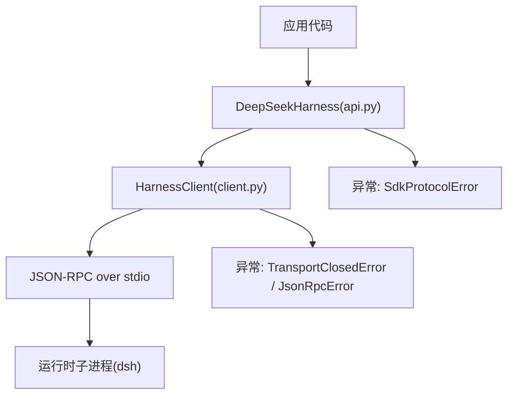
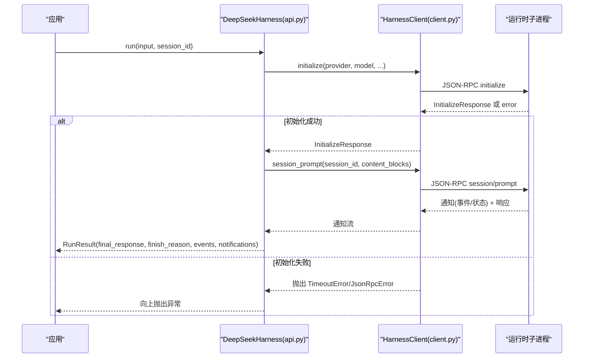
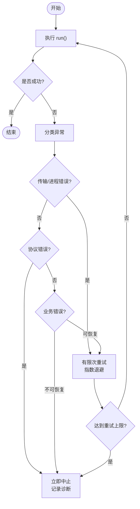
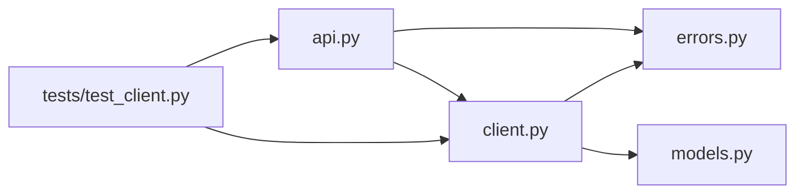

# 错误处理

<cite>
**本文引用的文件**
- [errors.py](file://python/sdk/src/deepseek_harness/errors.py)
- [client.py](file://python/sdk/src/deepseek_harness/client.py)
- [api.py](file://python/sdk/src/deepseek_harness/api.py)
- [models.py](file://python/sdk/src/deepseek_harness/models.py)
- [test_client.py](file://python/sdk/tests/test_client.py)
- [README.md](file://python/sdk/README.md)
</cite>

## 目录
1. [简介](#简介)
2. [项目结构](#项目结构)
3. [核心组件](#核心组件)
4. [架构总览](#架构总览)
5. [详细组件分析](#详细组件分析)
6. [依赖关系分析](#依赖关系分析)
7. [性能与超时特性](#性能与超时特性)
8. [故障排除指南](#故障排除指南)
9. [结论](#结论)
10. [附录：最佳实践清单](#附录最佳实践清单)

## 简介
本文件面向 DeepSeek Harness Python SDK 的错误处理，系统性说明异常类型、错误分类（网络/传输、协议、业务逻辑）、捕获与处理的最佳实践（try-except 模式）、超时与重试策略、日志与调试技巧、常见错误解决方案以及恢复与容错设计。文档基于 SDK 源码与测试用例进行提炼，确保与实际实现一致。

## 项目结构
Python SDK 的错误处理主要分布在以下模块：
- 异常定义：errors.py
- JSON-RPC 客户端与子进程通信：client.py
- 高层 API（会话、结果、事件）：api.py
- 数据模型与通知类型：models.py
- 行为验证与用例：tests/test_client.py
- 使用与配置说明：README.md

图表来源
- [client.py:39-170](file://python/sdk/src/deepseek_harness/client.py#L39-L170)
- [api.py:49-131](file://python/sdk/src/deepseek_harness/api.py#L49-L131)
- [errors.py:4-24](file://python/sdk/src/deepseek_harness/errors.py#L4-L24)

章节来源
- [client.py:39-170](file://python/sdk/src/deepseek_harness/client.py#L39-L170)
- [api.py:49-131](file://python/sdk/src/deepseek_harness/api.py#L49-L131)
- [errors.py:4-24](file://python/sdk/src/deepseek_harness/errors.py#L4-L24)

## 核心组件
- 异常体系
  - HarnessError：SDK 与运行时失败的基类
  - TransportClosedError：运行时子进程退出或 stdout 关闭时抛出
  - SdkProtocolError：运行时发送的数据不符合 SDK 协议约定时抛出
  - JsonRpcError：运行时返回 JSON-RPC 错误响应时抛出，包含 code、message、data
- 客户端与请求流程
  - HarnessClient：负责启动子进程、发送 JSON-RPC 请求、接收响应与通知、管理超时、收集诊断信息并转换为异常
  - DeepSeekHarness：封装初始化与会话运行，聚合通知与事件，并在最后校验 turn/end 的协议字段
- 数据模型
  - Notification、IncomingRequest、InitializeResponse 等用于描述消息与响应结构

章节来源
- [errors.py:4-24](file://python/sdk/src/deepseek_harness/errors.py#L4-L24)
- [client.py:39-170](file://python/sdk/src/deepseek_harness/client.py#L39-L170)
- [api.py:49-131](file://python/sdk/src/deepseek_harness/api.py#L49-L131)
- [models.py:13-33](file://python/sdk/src/deepseek_harness/models.py#L13-L33)

## 架构总览
下图展示了从应用调用到运行时响应的完整路径，以及错误在何处被捕获和转换。

图表来源
- [client.py:133-170](file://python/sdk/src/deepseek_harness/client.py#L133-L170)
- [client.py:172-189](file://python/sdk/src/deepseek_harness/client.py#L172-L189)
- [client.py:262-330](file://python/sdk/src/deepseek_harness/client.py#L262-L330)
- [api.py:124-131](file://python/sdk/src/deepseek_harness/api.py#L124-L131)
- [api.py:139-189](file://python/sdk/src/deepseek_harness/api.py#L139-L189)

## 详细组件分析

### 异常类型与错误分类
- 传输层错误（网络/进程通道）
  - TransportClosedError：当子进程退出、stdout 关闭或写入失败时抛出；错误消息会附带退出码与 stderr 尾部信息，便于定位
  - 触发点：_write_message、_reader_loop、close 等
- 协议层错误（SDK 与运行时约定）
  - SdkProtocolError：当 turn/end 事件缺少 data.reason.kind 字符串时抛出；属于“业务协议”层面的强约束
  - 触发点：finish_reason 对根会话事件的校验
- 业务逻辑错误（JSON-RPC 错误响应）
  - JsonRpcError：当运行时返回 JSON-RPC error 对象时抛出；携带 code、message、data
  - 触发点：_handle_message 解析 error 字段后放入等待队列，上层 request/_request_raw 将其转为异常

章节来源
- [errors.py:4-24](file://python/sdk/src/deepseek_harness/errors.py#L4-L24)
- [client.py:332-343](file://python/sdk/src/deepseek_harness/client.py#L332-L343)
- [client.py:352-369](file://python/sdk/src/deepseek_harness/client.py#L352-L369)
- [client.py:377-396](file://python/sdk/src/deepseek_harness/client.py#L377-L396)
- [api.py:231-248](file://python/sdk/src/deepseek_harness/api.py#L231-L248)

### 超时与重试机制
- 超时
  - 初始化超时：initialize_timeout_seconds（默认 30 秒），超时后 close 并抛出 TimeoutError，同时附加所选 profile 与诊断信息
  - 请求超时：request_timeout_seconds（可选），在 _request_raw 中通过 deadline 控制；超时会附加运行时诊断信息
  - 关闭超时：shutdown_timeout_seconds（默认 1 秒），close 中先尝试优雅 shutdown，再 terminate/kill
- 重试
  - SDK 未内置自动重试；建议在应用层根据异常类型实施重试策略（例如对临时性网络/进程错误进行有限次重试）

章节来源
- [client.py:133-170](file://python/sdk/src/deepseek_harness/client.py#L133-L170)
- [client.py:262-330](file://python/sdk/src/deepseek_harness/client.py#L262-L330)
- [client.py:94-127](file://python/sdk/src/deepseek_harness/client.py#L94-L127)
- [test_client.py:715-743](file://python/sdk/tests/test_client.py#L715-L743)
- [test_client.py:745-780](file://python/sdk/tests/test_client.py#L745-L780)

### 错误捕获与处理最佳实践（try-except）
- 初始化阶段
  - 捕获 TimeoutError：可能由初始化超时引起；可记录所选 profile 与诊断信息，必要时重启或回退
  - 捕获 JsonRpcError：检查 code/message/data，按业务语义决定重试或终止
- 会话运行阶段
  - 捕获 SdkProtocolError：turn/end 协议不合法；应视为严重错误，避免继续使用该会话
  - 捕获 TransportClosedError：子进程异常退出；应清理资源并考虑重建运行时
  - 捕获普通 BaseException：兜底保护，确保上下文管理器正确释放资源
- 通知订阅
  - 订阅 next/drain 可能抛出 BaseException；应在订阅消费循环中捕获并隔离，避免污染健康订阅

章节来源
- [client.py:133-170](file://python/sdk/src/deepseek_harness/client.py#L133-L170)
- [client.py:262-330](file://python/sdk/src/deepseek_harness/client.py#L262-L330)
- [api.py:231-248](file://python/sdk/src/deepseek_harness/api.py#L231-L248)
- [test_client.py:167-200](file://python/sdk/tests/test_client.py#L167-L200)

### 错误日志与调试技巧
- 诊断信息
  - 所有传输/超时相关异常都会附加运行时诊断：包括退出码与 stderr 尾部行
  - 初始化失败时，若为 JsonRpcError，也会追加诊断信息
- 调试建议
  - 查看异常消息中的 stderr tail，快速定位子进程崩溃原因
  - 使用最小化 fake runtime 复现问题（参考测试用例）
  - 通过 on_notification 收集事件序列，结合 finish_reason 判断会话结束原因

章节来源
- [client.py:151-170](file://python/sdk/src/deepseek_harness/client.py#L151-L170)
- [client.py:302-310](file://python/sdk/src/deepseek_harness/client.py#L302-L310)
- [client.py:433-456](file://python/sdk/src/deepseek_harness/client.py#L433-L456)
- [test_client.py:715-743](file://python/sdk/tests/test_client.py#L715-L743)

### 常见错误与解决方案
- 初始化超时
  - 现象：initialize 抛出 TimeoutError，提示 profile 名称与诊断
  - 排查：检查 dsh_bin/profile 是否正确、DSH_HOME 是否有效、子进程是否能正常启动
  - 处理：适当增大 initialize_timeout_seconds 或修复环境
- 请求超时
  - 现象：_request_raw 在 deadline 到达时抛出 TimeoutError，附带诊断
  - 排查：确认运行时是否卡住、是否存在阻塞工具或 LLM 调用
  - 处理：设置合理的 request_timeout_seconds，或在应用层重试
- 子进程异常退出
  - 现象：TransportClosedError，包含退出码与 stderr tail
  - 排查：查看 stderr tail 定位崩溃原因（如缺少依赖、权限不足）
  - 处理：修复环境问题，必要时重启运行时
- 协议不合法
  - 现象：SdkProtocolError，turn/end 缺少 data.reason.kind
  - 排查：检查运行时输出是否符合 SDK 协议约定
  - 处理：修正运行时实现或升级运行时版本

章节来源
- [client.py:133-170](file://python/sdk/src/deepseek_harness/client.py#L133-L170)
- [client.py:262-330](file://python/sdk/src/deepseek_harness/client.py#L262-L330)
- [client.py:433-456](file://python/sdk/src/deepseek_harness/client.py#L433-L456)
- [api.py:231-248](file://python/sdk/src/deepseek_harness/api.py#L231-L248)
- [test_client.py:167-200](file://python/sdk/tests/test_client.py#L167-L200)
- [test_client.py:715-743](file://python/sdk/tests/test_client.py#L715-L743)

### 错误恢复与容错设计模式
- 幂等与可恢复
  - 将 run 包装为可重试单元，仅对可恢复错误（如临时网络/进程错误）重试
- 降级与熔断
  - 连续失败达到阈值后降级（如切换 provider/model、缩短 max_tokens）
- 资源清理
  - 始终使用上下文管理器或显式 close，确保子进程被回收
- 隔离与重试边界
  - 以会话为单位隔离错误，避免全局状态污染；订阅错误隔离到订阅内部

[该图为概念流程图，无需源码映射]

## 依赖关系分析
- 模块耦合
  - api.py 依赖 client.py 与 errors.py，封装高层 API 并产生 SdkProtocolError
  - client.py 依赖 errors.py 与 models.py，负责底层 JSON-RPC 与子进程通信
  - tests/test_client.py 覆盖关键错误路径（超时、关闭、协议校验）
- 外部依赖
  - 子进程 dsh 作为运行时，通过 stdio 进行 JSON-RPC 通信
  - pydantic 用于响应模型校验

图表来源
- [api.py:1-11](file://python/sdk/src/deepseek_harness/api.py#L1-L11)
- [client.py:1-19](file://python/sdk/src/deepseek_harness/client.py#L1-L19)
- [errors.py:1-24](file://python/sdk/src/deepseek_harness/errors.py#L1-L24)
- [models.py:1-33](file://python/sdk/src/deepseek_harness/models.py#L1-L33)
- [test_client.py:1-14](file://python/sdk/tests/test_client.py#L1-L14)

章节来源
- [api.py:1-11](file://python/sdk/src/deepseek_harness/api.py#L1-L11)
- [client.py:1-19](file://python/sdk/src/deepseek_harness/client.py#L1-L19)
- [errors.py:1-24](file://python/sdk/src/deepseek_harness/errors.py#L1-L24)
- [models.py:1-33](file://python/sdk/src/deepseek_harness/models.py#L1-L33)
- [test_client.py:1-14](file://python/sdk/tests/test_client.py#L1-L14)

## 性能与超时特性
- 超时参数
  - initialize_timeout_seconds：控制首次握手时间，默认 30 秒
  - request_timeout_seconds：控制单次请求等待时间，默认无限制
  - shutdown_timeout_seconds：控制优雅关闭时间，默认 1 秒
- 性能影响
  - 过短的超时可能导致误判；过长的超时可能阻塞应用
  - 合理设置与监控是关键；结合重试与熔断策略提升鲁棒性

章节来源
- [client.py:24-36](file://python/sdk/src/deepseek_harness/client.py#L24-L36)
- [client.py:133-170](file://python/sdk/src/deepseek_harness/client.py#L133-L170)
- [client.py:262-330](file://python/sdk/src/deepseek_harness/client.py#L262-L330)
- [client.py:94-127](file://python/sdk/src/deepseek_harness/client.py#L94-L127)

## 故障排除指南
- 快速定位
  - 查看异常消息中的 stderr tail 与退出码
  - 检查 profile、dsh_home、provider/model 配置
- 常见问题
  - 初始化失败：确认 dsh_bin/profile 可用，DSH_HOME 非空且有效
  - 请求卡住：检查是否有阻塞工具或 LLM 调用；调整 request_timeout_seconds
  - 子进程崩溃：依据 stderr tail 修复依赖或权限问题
- 回归验证
  - 使用最小化 fake runtime 复现问题（参考测试用例）
  - 逐步缩小范围，确认是否为 SDK 或运行时问题

章节来源
- [client.py:151-170](file://python/sdk/src/deepseek_harness/client.py#L151-L170)
- [client.py:433-456](file://python/sdk/src/deepseek_harness/client.py#L433-L456)
- [test_client.py:715-743](file://python/sdk/tests/test_client.py#L715-L743)
- [test_client.py:745-780](file://python/sdk/tests/test_client.py#L745-L780)

## 结论
DeepSeek Harness Python SDK 提供了清晰的异常分层与完善的诊断信息，帮助开发者快速识别传输、协议与业务错误。通过合理设置超时、实施应用层重试与熔断、严格捕获与隔离异常，可以构建高可用的集成方案。建议在生产环境中结合日志与指标，持续优化超时与重试策略。

## 附录：最佳实践清单
- 使用上下文管理器管理 Harness 生命周期，确保资源释放
- 为 initialize 与 request 设置合适的超时
- 捕获并按类型处理异常：TimeoutError、JsonRpcError、TransportClosedError、SdkProtocolError
- 利用异常消息中的诊断信息（stderr tail、退出码）快速定位问题
- 在应用层实现有限次重试与指数退避，针对可恢复错误
- 对订阅回调进行异常隔离，避免污染健康订阅
- 使用最小化 fake runtime 进行回归测试与问题复现

章节来源
- [client.py:94-127](file://python/sdk/src/deepseek_harness/client.py#L94-L127)
- [client.py:133-170](file://python/sdk/src/deepseek_harness/client.py#L133-L170)
- [client.py:262-330](file://python/sdk/src/deepseek_harness/client.py#L262-L330)
- [api.py:231-248](file://python/sdk/src/deepseek_harness/api.py#L231-L248)
- [test_client.py:167-200](file://python/sdk/tests/test_client.py#L167-L200)
- [test_client.py:715-743](file://python/sdk/tests/test_client.py#L715-L743)
- [test_client.py:745-780](file://python/sdk/tests/test_client.py#L745-L780)