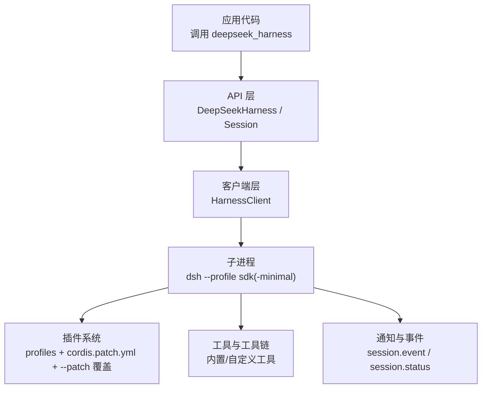
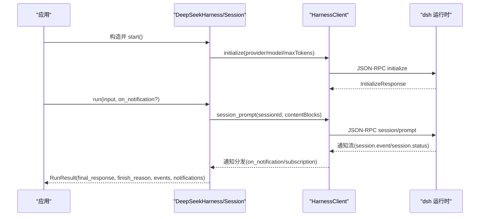
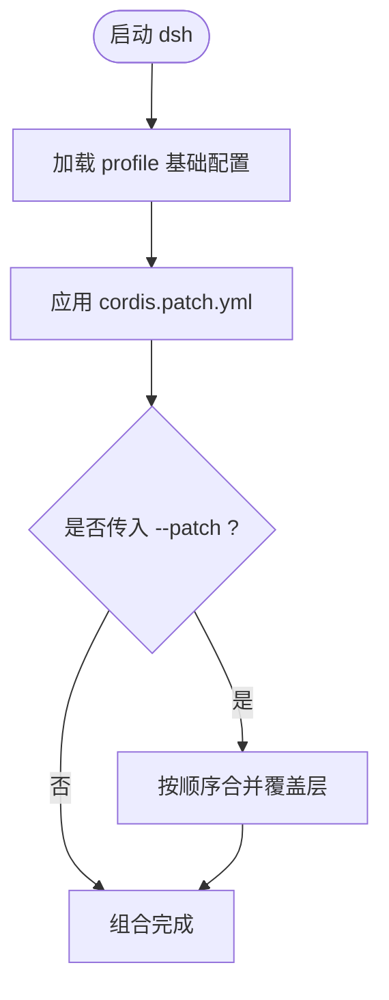
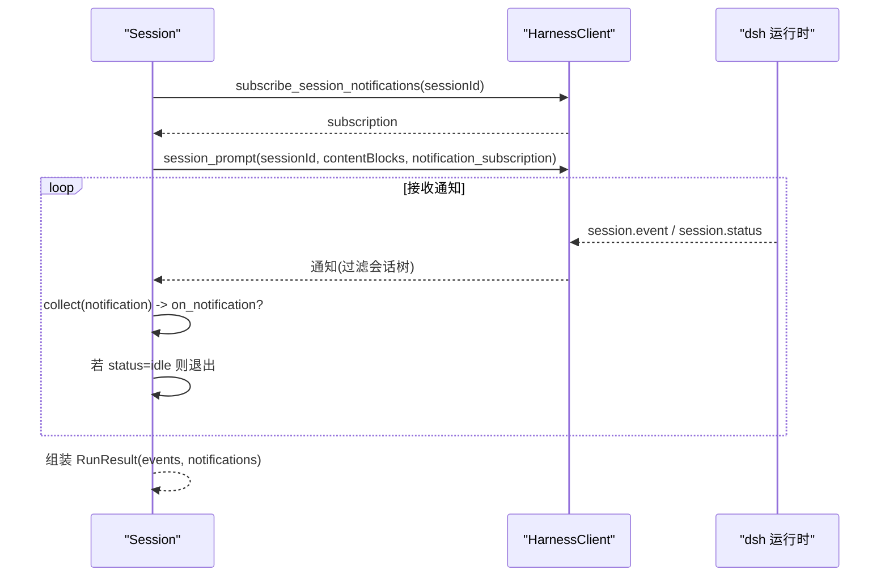
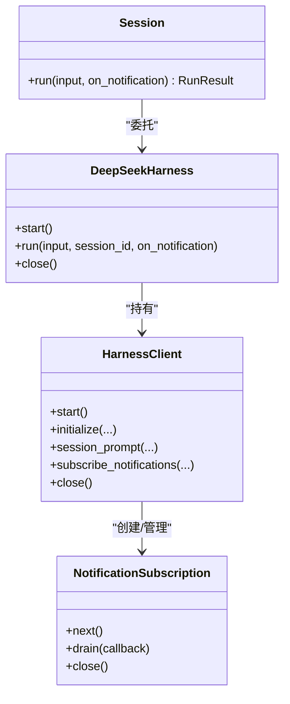
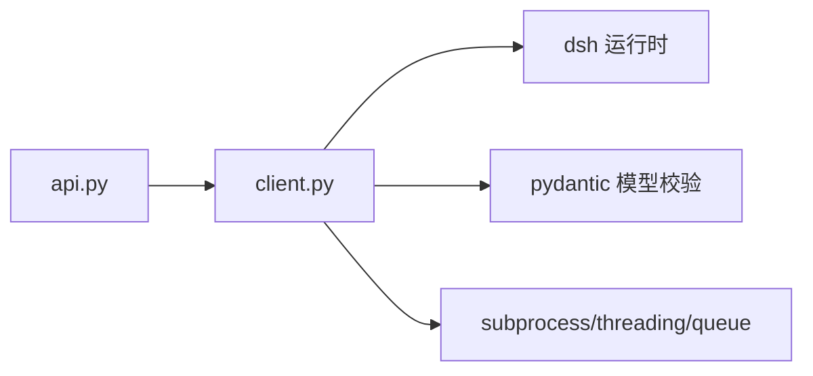

# 高级特性

<cite>
**本文引用的文件**
- [python/sdk/src/deepseek_harness/__init__.py](file://python/sdk/src/deepseek_harness/__init__.py)
- [python/sdk/src/deepseek_harness/api.py](file://python/sdk/src/deepseek_harness/api.py)
- [python/sdk/src/deepseek_harness/client.py](file://python/sdk/src/deepseek_harness/client.py)
- [python/sdk/README.md](file://python/sdk/README.md)
- [python/sdk/examples/minimal.py](file://python/sdk/examples/minimal.py)
- [apps/cli/tests/built-bin.e2e.ts](file://apps/cli/tests/built-bin.e2e.ts)
- [scripts/setup-dsh/templates/profile-web/cordis.yml](file://scripts/setup-dsh/templates/profile-web/cordis.yml)
</cite>

## 目录
1. [简介](#简介)
2. [项目结构](#项目结构)
3. [核心组件](#核心组件)
4. [架构总览](#架构总览)
5. [详细组件分析](#详细组件分析)
6. [依赖关系分析](#依赖关系分析)
7. [性能考虑](#性能考虑)
8. [故障排查指南](#故障排查指南)
9. [结论](#结论)
10. [附录](#附录)

## 简介
本章节面向使用 Python SDK 的高级用户，聚焦以下主题：
- 插件系统与配置：通过 profile 与补丁文件（patch）实现持久化与调用级定制。
- 工具调用高级用法：自定义工具与工具链组合的接入方式与注意事项。
- 通知机制与事件处理：on_notification 回调、会话订阅与子代理树的通知路由。
- 并发与连接池管理：多会话管理与资源生命周期优化。
- 运行时诊断与调试：日志收集、超时诊断与错误上下文增强。
- 复杂场景示例与性能优化建议：端到端流程与最佳实践。

## 项目结构
Python SDK 由三层组成：
- API 层：对外暴露 DeepSeekHarness、Session、RunResult 等高层接口，封装启动、初始化、会话运行与结果解析。
- 客户端层：基于 JSON-RPC over stdio 的 HarnessClient，负责进程管理、消息收发、通知订阅、超时控制与诊断信息收集。
- 运行时层：通过 dsh CLI 以指定 profile 启动，加载插件、配置与补丁，提供 agent 编排、工具执行、会话持久化等能力。

图表来源
- [python/sdk/src/deepseek_harness/api.py:49-131](file://python/sdk/src/deepseek_harness/api.py#L49-L131)
- [python/sdk/src/deepseek_harness/client.py:39-189](file://python/sdk/src/deepseek_harness/client.py#L39-L189)
- [python/sdk/README.md:35-62](file://python/sdk/README.md#L35-L62)

章节来源
- [python/sdk/src/deepseek_harness/__init__.py:1-20](file://python/sdk/src/deepseek_harness/__init__.py#L1-L20)
- [python/sdk/src/deepseek_harness/api.py:49-131](file://python/sdk/src/deepseek_harness/api.py#L49-L131)
- [python/sdk/src/deepseek_harness/client.py:39-189](file://python/sdk/src/deepseek_harness/client.py#L39-L189)
- [python/sdk/README.md:11-62](file://python/sdk/README.md#L11-L62)

## 核心组件
- DeepSeekHarness：可复用的同步入口，支持懒启动、上下文管理器、一次性或多次 run；内部维护 HarnessClient 并负责 initialize 参数注入。
- Session：封装单次会话的运行周期，从 prompt 投递到 idle 结束，聚合 events 与 notifications，提取 final_response 与 finish_reason。
- RunResult：包含 session_id、final_response、finish_reason、events、notifications。
- HarnessConfig/HarnessClient：进程启动、JSON-RPC 请求/响应、通知订阅、超时控制、诊断信息收集。
- NotificationSubscription：会话级通知订阅，支持过滤与 drain。

章节来源
- [python/sdk/src/deepseek_harness/api.py:13-47](file://python/sdk/src/deepseek_harness/api.py#L13-L47)
- [python/sdk/src/deepseek_harness/api.py:120-189](file://python/sdk/src/deepseek_harness/api.py#L120-L189)
- [python/sdk/src/deepseek_harness/client.py:24-37](file://python/sdk/src/deepseek_harness/client.py#L24-L37)
- [python/sdk/src/deepseek_harness/client.py:39-189](file://python/sdk/src/deepseek_harness/client.py#L39-L189)

## 架构总览
SDK 通过 JSON-RPC over stdio 与 dsh 运行时通信。启动时选择 profile，合并持久化补丁与调用级补丁，完成初始化后进入会话循环。通知流按会话及子代理树进行路由，确保根会话与后代会话的事件不互相覆盖。

图表来源
- [python/sdk/src/deepseek_harness/api.py:103-131](file://python/sdk/src/deepseek_harness/api.py#L103-L131)
- [python/sdk/src/deepseek_harness/api.py:139-189](file://python/sdk/src/deepseek_harness/api.py#L139-L189)
- [python/sdk/src/deepseek_harness/client.py:133-189](file://python/sdk/src/deepseek_harness/client.py#L133-L189)

## 详细组件分析

### 插件系统与配置（profile 与补丁）
- 持久化配置：通过 dsh profile 安装外部 bundle，profile 包树内记录已安装依赖与有序层；$DSH_HOME/profiles/<profile>/cordis.patch.yml 为持久化用户补丁。
- 调用级补丁：传入 patches 元组，路径会被转为绝对路径并按顺序追加到 profile 与 home 补丁层之后。
- 组合顺序：profile 用户层与 --patch 覆盖层按序合并，后者优先覆盖前者；缺失条目会报错提示。
- 最小可用 profile：sdk-minimal 是独立显式树，仅保留基础能力；完整 sdk/web 可通过设置、凭据、Web 工具与默认工具集扩展。

图表来源
- [python/sdk/README.md:35-62](file://python/sdk/README.md#L35-L62)
- [apps/cli/tests/built-bin.e2e.ts:976-1015](file://apps/cli/tests/built-bin.e2e.ts#L976-L1015)
- [scripts/setup-dsh/templates/profile-web/cordis.yml:1-4](file://scripts/setup-dsh/templates/profile-web/cordis.yml#L1-L4)

章节来源
- [python/sdk/README.md:35-62](file://python/sdk/README.md#L35-L62)
- [apps/cli/tests/built-bin.e2e.ts:976-1015](file://apps/cli/tests/built-bin.e2e.ts#L976-L1015)
- [scripts/setup-dsh/templates/profile-web/cordis.yml:1-4](file://scripts/setup-dsh/templates/profile-web/cordis.yml#L1-L4)

### 工具调用高级用法（自定义工具与工具链）
- 工具注册与挂载：由所选 Cordis 组合（如 @deepseek-ai/dsh-sdk-app 或 dsh-sdk-jsonrpc-server）负责挂载工具；自定义工具需通过插件 bundle 引入并在组合中启用。
- 工具链组合：可在 profile 或 patch 中调整工具执行策略、权限与上下文；通过 settings 与 provider 路由将不同工具串联成工作流。
- 运行时限制：provider/model/reasoning_effort 在初始化阶段校验；max_tokens 作为根 agent 及其进程内后代的输出 token 上限。

章节来源
- [python/sdk/README.md:60-62](file://python/sdk/README.md#L60-L62)
- [python/sdk/src/deepseek_harness/api.py:103-114](file://python/sdk/src/deepseek_harness/api.py#L103-L114)

### 通知机制与事件处理（on_notification 回调）
- 订阅方式：
  - 低层：HarnessClient.subscribe_notifications(filter) 返回 NotificationSubscription，支持 next()/drain()。
  - 会话级：subscribe_session_notifications(session_id) 自动根据 subagent.started/finished 建立父子关系，过滤属于该会话及其后代的通知。
- 回调集成：
  - Session.run 内部维护一个 collect 函数，将通知写入 RunResult.notifications，同时调用用户提供的 on_notification。
  - 对 session.event 且 sessionId 匹配的消息，提取 event 放入 RunResult.events。
- 边界语义：
  - run 从“收件箱回执”开始到“会话空闲”结束；events 仅包含根会话事件，避免后代输出覆盖根响应。
  - turn/end 若无 data.reason.kind 字符串，将抛出协议错误。

图表来源
- [python/sdk/src/deepseek_harness/api.py:139-189](file://python/sdk/src/deepseek_harness/api.py#L139-L189)
- [python/sdk/src/deepseek_harness/client.py:226-238](file://python/sdk/src/deepseek_harness/client.py#L226-L238)
- [python/sdk/src/deepseek_harness/client.py:506-536](file://python/sdk/src/deepseek_harness/client.py#L506-L536)

章节来源
- [python/sdk/src/deepseek_harness/api.py:139-189](file://python/sdk/src/deepseek_harness/api.py#L139-L189)
- [python/sdk/src/deepseek_harness/client.py:226-238](file://python/sdk/src/deepseek_harness/client.py#L226-L238)
- [python/sdk/src/deepseek_harness/client.py:506-536](file://python/sdk/src/deepseek_harness/client.py#L506-L536)

### 并发处理与连接池管理（多会话与资源优化）
- 单进程多会话：
  - 通过多次 start_session(session_id) 创建多个 Session，每个 Session 拥有独立的订阅与活动区间，互不干扰。
  - 通知路由基于会话 ID 与子代理树，保证并发安全与隔离。
- 资源生命周期：
  - HarnessClient 使用线程守护读取 stdout/stderr，关闭时先发送 shutdown，再尝试 stdin.close、wait/terminate/kill 清理。
  - 所有等待者（responses/subscribers/notifications/requests）在运行时关闭时被统一失败通知。
- 连接复用：
  - DeepSeekHarness 实例可重复使用，内部 HarnessClient 懒启动并保持长连接；适合批量任务复用。

图表来源
- [python/sdk/src/deepseek_harness/api.py:49-131](file://python/sdk/src/deepseek_harness/api.py#L49-L131)
- [python/sdk/src/deepseek_harness/client.py:39-189](file://python/sdk/src/deepseek_harness/client.py#L39-L189)
- [python/sdk/src/deepseek_harness/client.py:539-578](file://python/sdk/src/deepseek_harness/client.py#L539-L578)

章节来源
- [python/sdk/src/deepseek_harness/client.py:94-131](file://python/sdk/src/deepseek_harness/client.py#L94-L131)
- [python/sdk/src/deepseek_harness/client.py:226-238](file://python/sdk/src/deepseek_harness/client.py#L226-L238)
- [python/sdk/src/deepseek_harness/client.py:420-436](file://python/sdk/src/deepseek_harness/client.py#L420-L436)

### 运行时诊断与调试（日志收集与性能分析）
- 诊断信息：
  - 初始化超时：捕获 TimeoutError 并附加所选 profile 名称。
  - 运行时异常：在 close/transport 失败时拼接 stderr 尾部与退出码。
  - 请求超时：在 _request_raw 中计算剩余时间，超时时附加诊断信息。
- 日志收集：
  - stderr 行缓冲（固定长度），便于定位崩溃前最后输出。
  - 子进程状态（exit code）在诊断中呈现。
- 调试建议：
  - 使用 sdk-minimal profile 快速验证模型与 provider。
  - 通过 on_notification 打印关键事件，结合 events 定位问题。
  - 合理设置 initialize_timeout_seconds/request_timeout_seconds/shutdown_timeout_seconds。

章节来源
- [python/sdk/src/deepseek_harness/client.py:133-170](file://python/sdk/src/deepseek_harness/client.py#L133-L170)
- [python/sdk/src/deepseek_harness/client.py:292-330](file://python/sdk/src/deepseek_harness/client.py#L292-L330)
- [python/sdk/src/deepseek_harness/client.py:437-456](file://python/sdk/src/deepseek_harness/client.py#L437-L456)

### 复杂场景示例与最佳实践
- 示例脚本：
  - minimal.py 演示了命令行参数解析、DSH_HOME/workspace/profile/provider/model/max_tokens 的配置与一次 run 的完整流程。
- 推荐实践：
  - 使用独立 dsh_home 隔离配置与持久化资源。
  - 通过 patches 进行调用级覆盖，避免污染持久化 profile。
  - 对长时间任务设置 request_timeout_seconds，避免阻塞。
  - 利用 on_notification 实时观察工具调用与子代理行为。
  - 复用 Harness 实例以减少进程启动开销。

章节来源
- [python/sdk/examples/minimal.py:13-44](file://python/sdk/examples/minimal.py#L13-L44)
- [python/sdk/README.md:11-33](file://python/sdk/README.md#L11-L33)

## 依赖关系分析
- 模块耦合：
  - api.py 依赖 client.py 与 models/errors，向上暴露高层 API。
  - client.py 依赖 pydantic 进行响应模型校验，依赖 subprocess/threading/queue 实现并发与 I/O。
- 外部依赖：
  - dsh 运行时通过 deepseek_harness_runtime 解析 bundled launch args；未安装时会抛出明确错误。
- 配置与组合：
  - profile 与补丁的组合顺序由 CLI 测试覆盖；patch 缺失条目会报错。

图表来源
- [python/sdk/src/deepseek_harness/api.py:1-11](file://python/sdk/src/deepseek_harness/api.py#L1-L11)
- [python/sdk/src/deepseek_harness/client.py:1-20](file://python/sdk/src/deepseek_harness/client.py#L1-L20)
- [python/sdk/src/deepseek_harness/client.py:458-486](file://python/sdk/src/deepseek_harness/client.py#L458-L486)
- [apps/cli/tests/built-bin.e2e.ts:976-1015](file://apps/cli/tests/built-bin.e2e.ts#L976-L1015)

章节来源
- [python/sdk/src/deepseek_harness/api.py:1-11](file://python/sdk/src/deepseek_harness/api.py#L1-L11)
- [python/sdk/src/deepseek_harness/client.py:1-20](file://python/sdk/src/deepseek_harness/client.py#L1-L20)
- [python/sdk/src/deepseek_harness/client.py:458-486](file://python/sdk/src/deepseek_harness/client.py#L458-L486)
- [apps/cli/tests/built-bin.e2e.ts:976-1015](file://apps/cli/tests/built-bin.e2e.ts#L976-L1015)

## 性能考虑
- 进程复用：复用 DeepSeekHarness 实例，避免频繁启动 dsh 子进程。
- 超时控制：合理设置 initialize_timeout_seconds 与 request_timeout_seconds，防止阻塞。
- 通知批处理：使用 NotificationSubscription.drain 批量消费通知，减少回调切换成本。
- 资源释放：确保在 finally 或上下文退出时 close，触发优雅 shutdown 与强制终止兜底。
- 日志缓冲：stderr 尾部有限长度，避免内存增长；必要时在应用侧落盘。

[本节为通用指导，无需特定文件引用]

## 故障排查指南
- 初始化超时：检查 provider/model/reasoning_effort 是否有效；查看所选 profile 名称与诊断信息。
- 传输关闭：当 stdout 关闭或写入失败时，会附带 exit code 与 stderr 尾部；确认子进程是否存活。
- 通知丢失：确认订阅过滤器是否正确；对于子代理通知，依赖 subagent.started/finished 建立的父子关系。
- 协议错误：turn/end 缺少 data.reason.kind 会抛出协议错误；检查事件结构与版本兼容性。

章节来源
- [python/sdk/src/deepseek_harness/client.py:133-170](file://python/sdk/src/deepseek_harness/client.py#L133-L170)
- [python/sdk/src/deepseek_harness/client.py:420-456](file://python/sdk/src/deepseek_harness/client.py#L420-L456)
- [python/sdk/src/deepseek_harness/api.py:231-248](file://python/sdk/src/deepseek_harness/api.py#L231-L248)

## 结论
Python SDK 通过清晰的层次划分与严格的资源管理，提供了可扩展的插件体系、灵活的通知机制、健壮的并发与诊断能力。借助 profile 与补丁的组合，以及 on_notification 回调，开发者可以构建复杂而可靠的自动化流程。在生产环境中，建议重视超时配置、资源释放与日志采集，以获得更好的稳定性与可观测性。

[本节为总结性内容，无需特定文件引用]

## 附录
- 快速上手：参考 minimal.py 与 README 中的基本用法。
- 进阶配置：通过 profile 与补丁文件定制工具链与行为。
- 事件驱动：利用 on_notification 与 Subscription 实现细粒度监控与控制。

[本节为补充说明，无需特定文件引用]