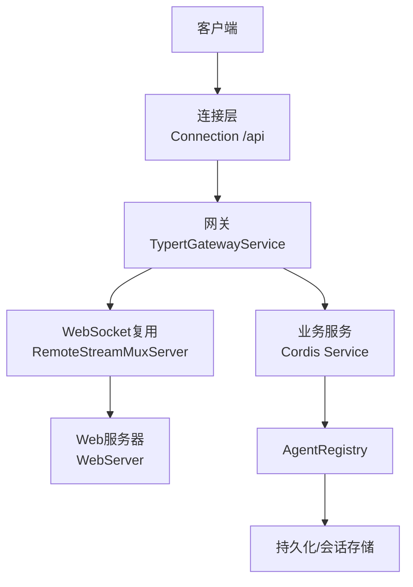
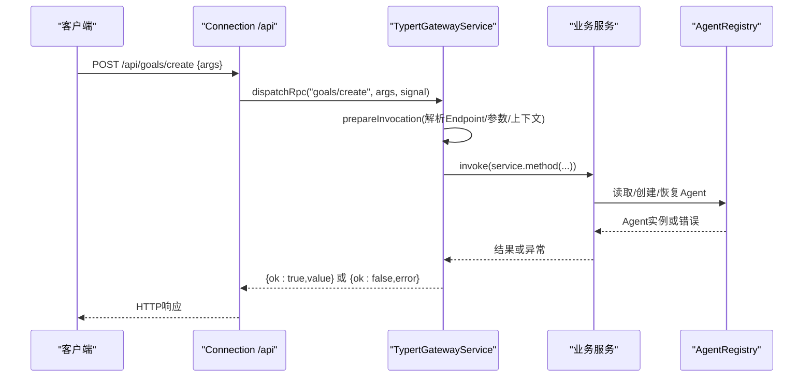
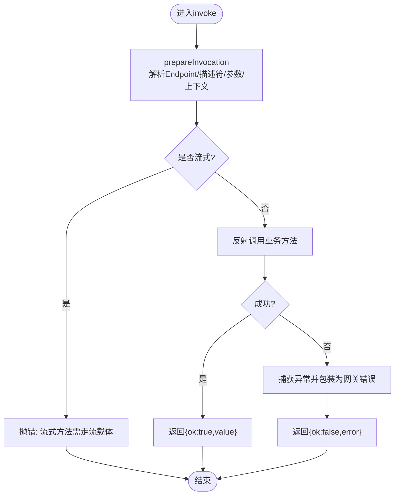
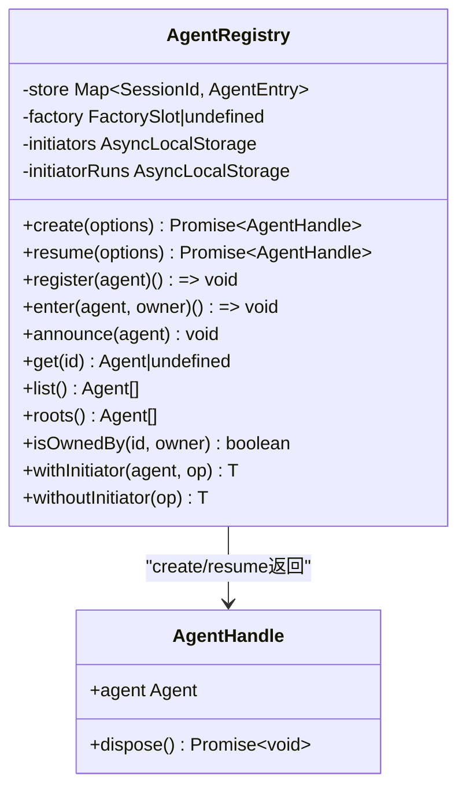
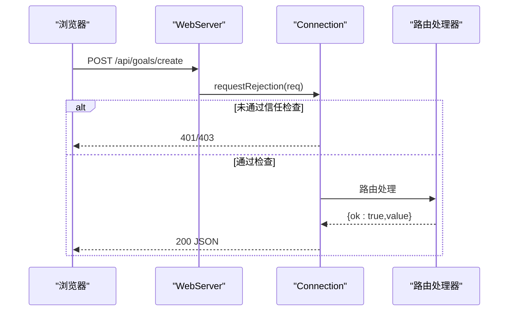
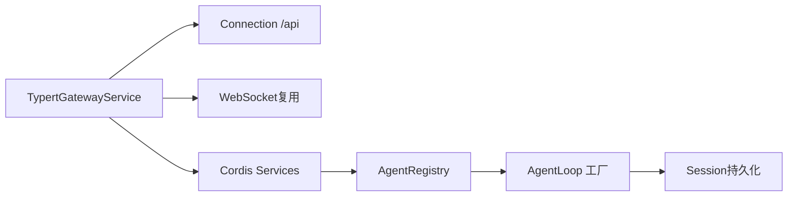

# Agent控制API

<cite>
**本文引用的文件**
- [packages/api/gateway/src/index.ts](file://packages/api/gateway/src/index.ts)
- [packages/core/agent/src/index.ts](file://packages/core/agent/src/index.ts)
- [docs/api-gateway.md](file://docs/api-gateway.md)
- [packages/client/connection/tests/node-half.host.spec.ts](file://packages/client/connection/tests/node-half.host.spec.ts)
- [packages/goal/tool-goal/tests/tool-goal.spec.ts](file://packages/goal/tool-goal/tests/tool-goal.spec.ts)
- [packages/goal/command-goal/tests/command-goal.spec.ts](file://packages/goal/command-goal/tests/command-goal.spec.ts)
- [packages/core/agent-loop/src/index.ts](file://packages/core/agent-loop/src/index.ts)
</cite>

## 目录
1. [简介](#简介)
2. [项目结构](#项目结构)
3. [核心组件](#核心组件)
4. [架构总览](#架构总览)
5. [详细组件分析](#详细组件分析)
6. [依赖关系分析](#依赖关系分析)
7. [性能考虑](#性能考虑)
8. [故障排查指南](#故障排查指南)
9. [结论](#结论)
10. [附录：Agent相关HTTP端点与调用约定](#附录agent相关http端点与调用约定)

## 简介
本文件面向DeepSeek Harness的Agent控制REST API，聚焦通过网关暴露的RPC式HTTP接口对Agent进行注册、启动、停止与监控。系统采用“远程服务 → 网关 → 连接层 → Web服务器”的分层架构，所有Agent相关的业务操作以Typert Remote方法的形式对外暴露，并通过Connection的`/api`路由统一承载为HTTP请求。Agent的生命周期由AgentRegistry与工厂协作管理，支持创建、恢复、注册、列举、归属判定等能力；网关负责参数校验、对象解析、上下文注入、流式方法与事件转发，以及跨边界的错误编码。

## 项目结构
- API网关与远程协议
  - 网关实现位于`packages/api/gateway/src/index.ts`，提供TypertGatewayService，拦截`/api`并分发到具体Remote方法，同时维护WebSocket流复用与远程事件通道。
  - 文档说明位于`docs/api-gateway.md`，描述编程模型、严格生成管线、运行时调用路径、SRC开发回退机制与边界约束。
- Agent生命周期与注册
  - Agent服务位于`packages/core/agent/src/index.ts`，提供AgentRegistry，负责工厂装配、创建/恢复代理、注册/注销、列举、根节点查询、发起者作用域传播等。
- 连接层与HTTP桥
  - 测试用例展示了Connection对`/api`前缀的统一信任检查、认证策略、专用RPC通道与路由声明/撤销行为，覆盖401/403/404等状态码语义。
- 目标与命令驱动
  - 测试中展示了Agent状态（idle/running）与目标（goal）在会话中的交互，体现Agent运行态与任务驱动的耦合。

图表来源
- [packages/api/gateway/src/index.ts:169-229](file://packages/api/gateway/src/index.ts#L169-L229)
- [docs/api-gateway.md:119-128](file://docs/api-gateway.md#L119-L128)

章节来源
- [docs/api-gateway.md:1-165](file://docs/api-gateway.md#L1-L165)
- [packages/api/gateway/src/index.ts:169-229](file://packages/api/gateway/src/index.ts#L169-L229)

## 核心组件
- TypertGatewayService
  - 职责：拦截`/api`请求，解析Endpoint，查找或构建InvocationDescriptor，解析参数与上下文，调用业务方法，封装结果或错误，处理流式方法与远程事件。
  - 关键能力：
    - 统一拦截`/api`并委派给dispatchRpc/invoke/stream。
    - 注册WebSocket升级路由用于流式传输。
    - 维护远程事件源与客户端队列，支持广播与瀑布式回调。
    - 严格校验参数、返回值与签名，抛出类型化的网关错误。
- AgentRegistry
  - 职责：装配AgentFactory，提供create/resume/register/list/roots/isOwnedBy/get等能力；维护进程内Agent集合与作用域传播。
  - 关键能力：
    - setFactory绑定创建/恢复逻辑，create/resume委托工厂执行。
    - register/enter/announce/emitDisposed保证发布顺序与回滚安全。
    - withInitiator/withoutInitiator维护发起者作用域，便于审计与追踪。
    - list/roots/get/isOwnedBy提供运行时可见性与所有权判断。

章节来源
- [packages/api/gateway/src/index.ts:169-229](file://packages/api/gateway/src/index.ts#L169-L229)
- [packages/core/agent/src/index.ts:250-425](file://packages/core/agent/src/index.ts#L250-L425)
- [packages/core/agent/src/index.ts:445-612](file://packages/core/agent/src/index.ts#L445-L612)

## 架构总览
Agent控制的HTTP调用遵循以下路径：
- 客户端通过Connection调用`/api/<namespace>/<method>`，携带JSON `args`。
- Connection执行信任检查与认证，随后将请求交给TypertGatewayService。
- Gateway根据Endpoint查找严格定义或SRC标记，解析参数（包括lookup/Context），构造接收者与参数列表，调用业务方法。
- 若为流式方法，通过WebSocket复用器打开流；否则返回单值响应。
- 错误按网关错误分类返回，业务错误保持原始错误码。

图表来源
- [packages/api/gateway/src/index.ts:298-350](file://packages/api/gateway/src/index.ts#L298-L350)
- [packages/api/gateway/src/index.ts:590-629](file://packages/api/gateway/src/index.ts#L590-L629)
- [docs/api-gateway.md:119-128](file://docs/api-gateway.md#L119-L128)

## 详细组件分析

### 组件A：TypertGatewayService（网关调度）
- 设计要点
  - 拦截`/api`路由，仅放行两段式Endpoint（命名空间/方法）。
  - 优先使用严格生成的描述符，失败时回退到SRC标记推断。
  - 参数解析支持lookup键（如agentId→Agent）与Context身份（如agent→Agent.ctx）。
  - 流式方法必须通过流载体打开，禁止在Unary路径上调用。
  - 远程事件支持注册单一来源，客户端订阅后获得ready帧与后续事件/取消帧。
- 关键流程
  - 准备调用：解析Endpoint、描述符、参数、上下文、接收者与方法。
  - 调用与错误：捕获异常，区分取消与业务错误，统一包装为网关错误。
  - 流式与事件：openWireStream分派到stream或远程事件流；consumeRemoteEvents维护pending与delivery。
- 错误与边界
  - 未找到服务、不可用方法、签名无效、参数不匹配、上下文提供者缺失等均抛出类型化错误。
  - 严格Endpoint撤回后禁止降级到SRC，防止热卸载弱化校验。

图表来源
- [packages/api/gateway/src/index.ts:298-350](file://packages/api/gateway/src/index.ts#L298-L350)
- [packages/api/gateway/src/index.ts:590-629](file://packages/api/gateway/src/index.ts#L590-L629)

章节来源
- [packages/api/gateway/src/index.ts:169-229](file://packages/api/gateway/src/index.ts#L169-L229)
- [packages/api/gateway/src/index.ts:298-350](file://packages/api/gateway/src/index.ts#L298-L350)
- [packages/api/gateway/src/index.ts:590-629](file://packages/api/gateway/src/index.ts#L590-L629)
- [docs/api-gateway.md:119-137](file://docs/api-gateway.md#L119-L137)

### 组件B：AgentRegistry（Agent生命周期与资源调度）
- 设计要点
  - 工厂模式：通过setFactory注入AgentLoop提供的create/resume实现，避免直接耦合。
  - 生命周期：enter→announce→emitDisposed形成发布/注销闭环；register封装enter+announce。
  - 作用域：withInitiator/withoutInitiator维护发起者作用域，便于审计与追踪。
  - 可见性：list/roots/get/isOwnedBy提供运行时查询与所有权判断。
- 关键流程
  - create/resume：委托工厂完成会话与Agent的创建/恢复、setup提交、发布与启动循环。
  - register：插入已构造的Agent，发出agent/created，并在fiber卸载时发出agent/disposed。
  - 初始化器：确保在关闭阶段拒绝新的发起边界，等待异步边界排空。
- 错误与边界
  - 未注册工厂、重复注册、ID冲突、非法ID、作用域已释放等会抛出明确错误。

图表来源
- [packages/core/agent/src/index.ts:250-425](file://packages/core/agent/src/index.ts#L250-L425)
- [packages/core/agent/src/index.ts:445-612](file://packages/core/agent/src/index.ts#L445-L612)

章节来源
- [packages/core/agent/src/index.ts:250-425](file://packages/core/agent/src/index.ts#L250-L425)
- [packages/core/agent/src/index.ts:445-612](file://packages/core/agent/src/index.ts#L445-L612)

### 组件C：连接层与HTTP桥（认证与路由）
- 认证与信任
  - 对`/api`前缀进行统一信任检查，未授权返回401，非受信主机返回403。
  - 浏览器Cookie与会话一致性校验，确保同一浏览器会话访问受控端点。
- 路由与声明
  - 支持动态注册/撤销RPC路由，撤销后对应路径返回404。
  - 专用RPC通道与共享通道并存，均通过Connection统一管理。
- 典型状态码
  - 401 unauthorized：缺少有效会话或来源不被信任。
  - 403 forbidden：来源不在受信白名单。
  - 404 not found：未声明或未认领的路径。

图表来源
- [packages/client/connection/tests/node-half.host.spec.ts:158-194](file://packages/client/connection/tests/node-half.host.spec.ts#L158-L194)
- [packages/client/connection/tests/node-half.host.spec.ts:227-238](file://packages/client/connection/tests/node-half.host.spec.ts#L227-L238)
- [packages/client/connection/tests/node-half.host.spec.ts:325-357](file://packages/client/connection/tests/node-half.host.spec.ts#L325-L357)

章节来源
- [packages/client/connection/tests/node-half.host.spec.ts:148-194](file://packages/client/connection/tests/node-half.host.spec.ts#L148-L194)
- [packages/client/connection/tests/node-half.host.spec.ts:227-238](file://packages/client/connection/tests/node-half.host.spec.ts#L227-L238)
- [packages/client/connection/tests/node-half.host.spec.ts:260-357](file://packages/client/connection/tests/node-half.host.spec.ts#L260-L357)

## 依赖关系分析
- 网关依赖
  - 依赖Connection的RPC拦截与WebServer的WebSocket升级。
  - 依赖Typert协议包提供的描述符、编解码与错误模型。
  - 依赖Cordis服务注册表与反射信息。
- AgentRegistry依赖
  - 依赖Cordis Context/Fiber与AsyncLocalStorage。
  - 依赖AgentLoop提供的工厂实现（create/resume）。
  - 依赖Session持久化（在工厂内部使用）。
- 外部集成点
  - 通过TypertLookupMap与ContextProvider将Agent/Session等复杂对象映射为可序列化的标识。
  - 通过远程事件通道向客户端推送事件流。

图表来源
- [packages/api/gateway/src/index.ts:169-229](file://packages/api/gateway/src/index.ts#L169-L229)
- [packages/core/agent/src/index.ts:250-425](file://packages/core/agent/src/index.ts#L250-L425)

章节来源
- [packages/api/gateway/src/index.ts:169-229](file://packages/api/gateway/src/index.ts#L169-L229)
- [packages/core/agent/src/index.ts:250-425](file://packages/core/agent/src/index.ts#L250-L425)

## 性能考虑
- 网关层
  - 流式方法通过WebSocket复用降低握手开销，心跳间隔可配置。
  - 远程事件批量投递与去重，避免重复交付。
- Agent层
  - 工厂创建/恢复过程包含setup提交与发布边界，避免部分可见状态。
  - 作用域传播轻量，基于AsyncLocalStorage，适合高并发场景。
- 连接层
  - 统一信任检查前置，减少无效请求进入业务层。
  - 路由声明/撤销高效，撤销后立即返回404，避免悬空调用。

## 故障排查指南
- 常见错误码与含义
  - gateway/signature-invalid：Remote签名不符合要求（如流式方法误用Unary路径）。
  - gateway/service-unavailable：目标服务未激活或不可用。
  - gateway/method-unavailable：服务存在但无对应方法。
  - gateway/context-unavailable：Context提供者缺失或不匹配。
  - gateway/internal：未分类异常折叠为内部错误。
- 定位步骤
  - 确认Endpoint是否为两段式且已注册。
  - 检查args字段是否与描述符一致（名称、数量、类型）。
  - 验证lookup/Context提供者是否已注册且可用。
  - 查看流式方法是否正确通过流载体打开。
  - 检查Connection信任策略与Cookie会话是否一致。
- 日志与诊断
  - 网关会在配置驱动的Agent启动失败时上报事件，便于外部监听与告警。
  - AgentRegistry在创建/注销过程中发出agent/created与agent/disposed事件，可用于审计。

章节来源
- [packages/api/gateway/src/index.ts:128-162](file://packages/api/gateway/src/index.ts#L128-L162)
- [packages/api/gateway/src/index.ts:298-350](file://packages/api/gateway/src/index.ts#L298-L350)
- [packages/core/agent-loop/src/index.ts:457-477](file://packages/core/agent-loop/src/index.ts#L457-L477)
- [packages/core/agent/src/index.ts:522-535](file://packages/core/agent/src/index.ts#L522-L535)

## 结论
DeepSeek Harness的Agent控制API通过Typert网关将业务服务暴露为统一的HTTP RPC接口，结合AgentRegistry的生命周期管理与连接层的信任/认证策略，实现了安全的Agent创建、恢复、注册、列举与监控。网关严格校验参数与签名，支持流式方法与远程事件，保障跨边界调用的正确性与可观测性。生产部署应关注工厂装配、Lookup/Context提供者注册、连接层信任策略与错误码语义，以确保Agent运行的稳定性与可维护性。

## 附录：Agent相关HTTP端点与调用约定
- 通用约定
  - 所有Agent相关操作均以`POST /api/<namespace>/<method>`形式调用，请求体为JSON对象，仅包含`args`字段。
  - 网关对两段式Endpoint进行严格匹配，未声明或不可用的Endpoint返回404。
  - 认证失败返回401，来源不受信返回403。
- 典型端点示例（基于测试与文档）
  - goals/create：创建目标（常用于触发Agent工作流）。
  - goals/maybe：条件性创建目标。
  - goals/complete：完成目标。
  - goals/clear：清理目标。
  - session.list：列出会话（未声明时返回404）。
- 调用示例（以goals/create为例）
  - 请求
    - 方法：POST
    - 路径：/api/goals/create
    - 头部：Host为受信主机，携带浏览器Cookie
    - 主体：{"args": {"agentId": "agent-1"}}
  - 响应
    - 成功：{"type":"server-response","rpcId":"...","result":{"ok":true,"value":{"accepted":true}}}
    - 失败：{"type":"server-response","rpcId":"...","result":{"ok":false,"error":{"code":"...","message":"..."}}}
- 注意事项
  - 流式方法不能通过Unary路径调用，必须通过WebSocket流载体打开。
  - 远程事件流需要订阅并处理ready、emit、waterfall、cancel等帧。
  - 撤销路由后，对应路径立即返回404，避免悬空调用。

章节来源
- [packages/client/connection/tests/node-half.host.spec.ts:260-357](file://packages/client/connection/tests/node-half.host.spec.ts#L260-L357)
- [docs/api-gateway.md:119-128](file://docs/api-gateway.md#L119-L128)