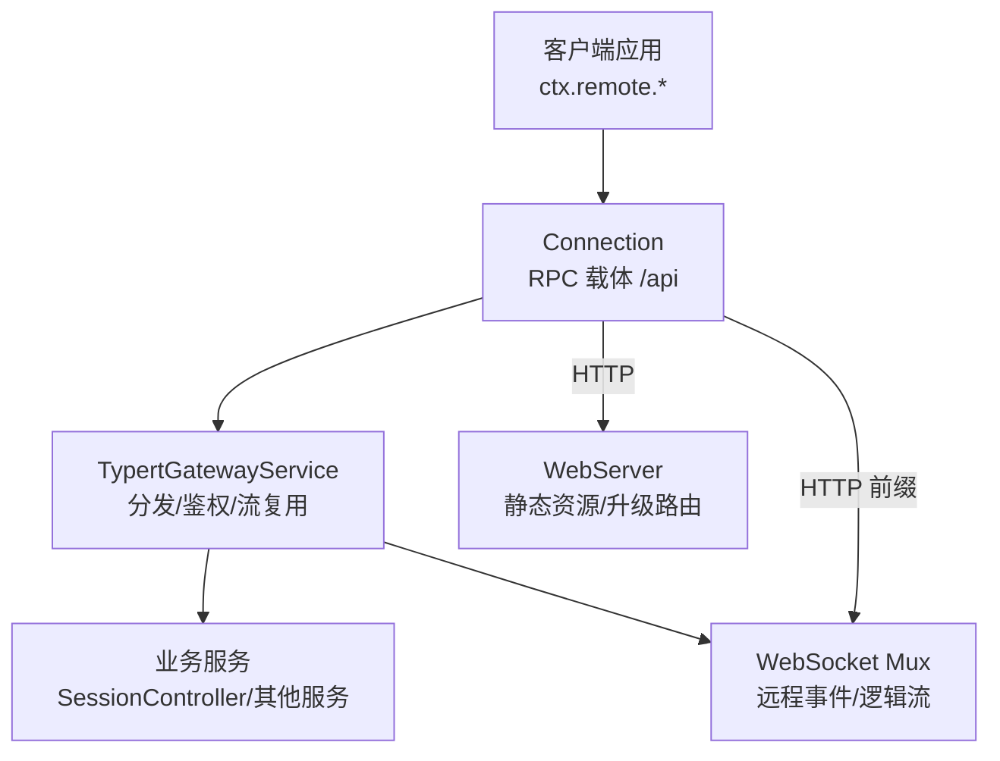
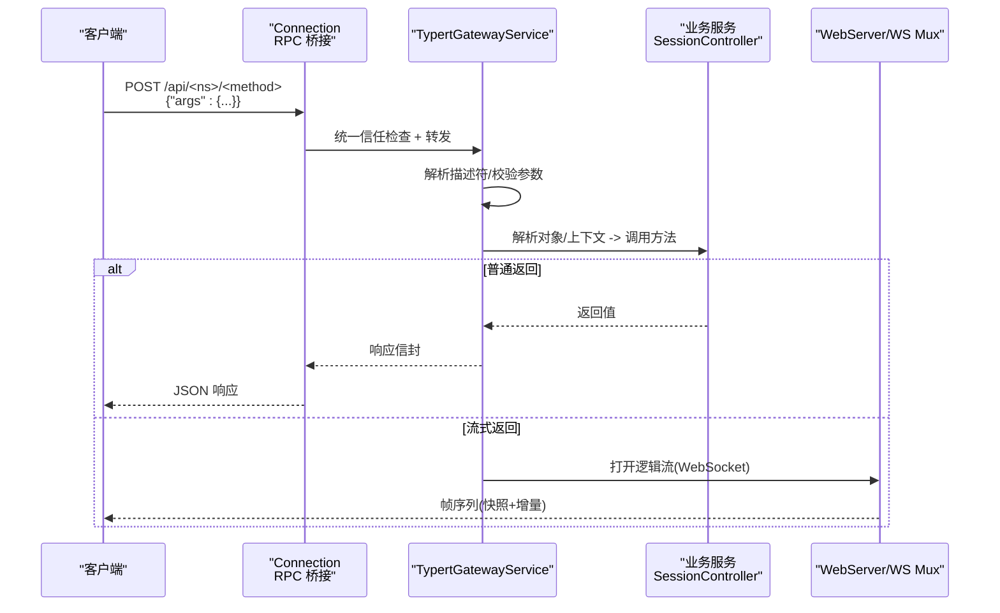
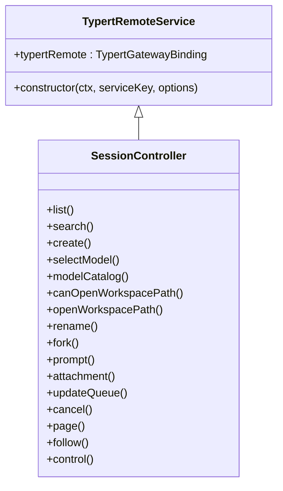
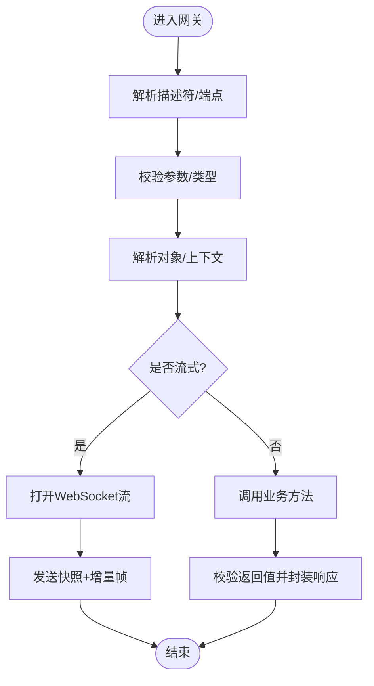
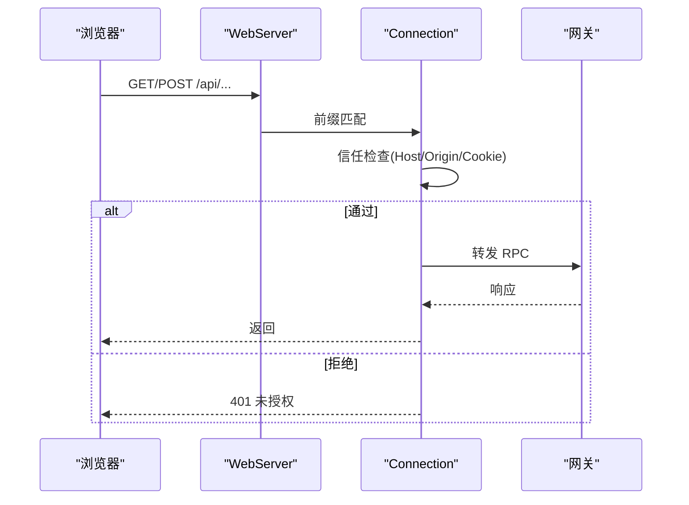
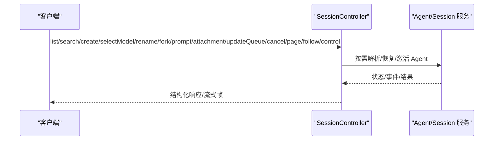
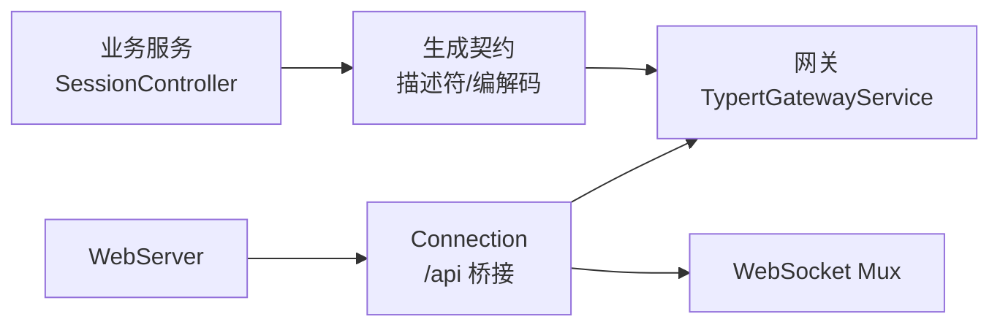

# REST API接口

<cite>
**本文引用的文件**
- [packages/api/gateway/src/index.ts](file://packages/api/gateway/src/index.ts)
- [packages/typert/protocol/src/index.ts](file://packages/typert/protocol/src/index.ts)
- [docs/api-gateway.md](file://docs/api-gateway.md)
- [docs/subsystems/web-server.md](file://docs/subsystems/web-server.md)
- [packages/client/connection/src/index.ts](file://packages/client/connection/src/index.ts)
- [packages/api/session-controller/src/index.ts](file://packages/api/session-controller/src/index.ts)
- [packages/api/session-controller/src/control.ts](file://packages/api/session-controller/src/control.ts)
- [packages/subagent/subagent/src/control.ts](file://packages/subagent/subagent/src/control.ts)
- [packages/api/gateway/src/stream-protocol.ts](file://packages/api/gateway/src/stream-protocol.ts)
</cite>

## 目录
1. [简介](#简介)
2. [项目结构](#项目结构)
3. [核心组件](#核心组件)
4. [架构总览](#架构总览)
5. [详细组件分析](#详细组件分析)
6. [依赖关系分析](#依赖关系分析)
7. [性能考虑](#性能考虑)
8. [故障排查指南](#故障排查指南)
9. [结论](#结论)
10. [附录：API端点参考与最佳实践](#附录api端点参考与最佳实践)

## 简介
本文件面向集成开发者，系统化说明 DeepSeek Harness 基于 Typert 协议构建的远程调用 REST 接口。内容涵盖：
- HTTP 方法、URL 模式、请求/响应体结构与认证机制
- @Remote 与 @RemoteScope 装饰器的工作原理与服务注册发现
- 会话管理、Agent 控制、工具执行等核心能力
- 参数校验、错误处理策略、性能优化建议与最佳实践
- 端到端调用流程与代码级图示，帮助快速集成与排障

## 项目结构
DeepSeek Harness 将“业务服务声明”“生成契约”“网关分发”“连接载体”“Web 服务器”分层解耦：
- 业务服务通过 @Remote/@RemoteScope 标记可暴露的方法，并继承 TypertRemoteService 或显式绑定 typertRemote
- 构建期生成严格描述符、编解码器与客户端类型；运行期由 Gateway 解析并调度到真实服务
- 客户端通过 Connection 的 /api RPC 桥接为 POST /api/<namespace>/<method>
- WebServer 提供浏览器 HTTP 承载与升级路由（如 WebSocket）

图表来源
- [packages/api/gateway/src/index.ts:191-234](file://packages/api/gateway/src/index.ts#L191-L234)
- [packages/client/connection/src/index.ts:92-120](file://packages/client/connection/src/index.ts#L92-L120)
- [docs/subsystems/web-server.md:9-53](file://docs/subsystems/web-server.md#L9-L53)

章节来源
- [docs/api-gateway.md:1-165](file://docs/api-gateway.md#L1-L165)
- [docs/subsystems/web-server.md:1-155](file://docs/subsystems/web-server.md#L1-L155)

## 核心组件
- Typert 协议层：定义 @Remote/@RemoteScope、服务绑定、查找与上下文映射、失败类型与描述符
- API 网关：实现 /api 分发、参数校验、对象/上下文解析、返回值校验、流式传输与心跳
- 连接层：统一信任检查、请求关联、取消、响应信封，以及 /api 到 HTTP 的桥接
- Web 服务器：提供命名路由、升级路由、回退处理器与索引注入
- 会话控制器：对外暴露 session 命名空间，覆盖列表、搜索、创建、模型选择、重命名、fork、prompt、附件、队列更新、取消、分页、follow、control 等

章节来源
- [packages/typert/protocol/src/index.ts:1-326](file://packages/typert/protocol/src/index.ts#L1-L326)
- [packages/api/gateway/src/index.ts:1-200](file://packages/api/gateway/src/index.ts#L1-L200)
- [packages/client/connection/src/index.ts:92-120](file://packages/client/connection/src/index.ts#L92-L120)
- [packages/api/session-controller/src/index.ts:1-397](file://packages/api/session-controller/src/index.ts#L1-L397)

## 架构总览
Typert Remote 调用从客户端发起，经 Connection 的 /api 桥接到 Host 的 TypertGatewayService，再由网关根据严格描述符解析参数、查找服务与上下文、执行方法并返回结果。流式能力通过 WebSocket 多路复用通道承载。

图表来源
- [packages/api/gateway/src/index.ts:191-234](file://packages/api/gateway/src/index.ts#L191-L234)
- [packages/client/connection/src/index.ts:92-120](file://packages/client/connection/src/index.ts#L92-L120)
- [packages/api/session-controller/src/index.ts:372-391](file://packages/api/session-controller/src/index.ts#L372-L391)

## 详细组件分析

### 装饰器与服务绑定：@Remote 与 @RemoteScope
- @Remote：将公共实例方法标记为直接远程调用；支持自定义导出名或 mode:'stream' 逻辑流
- @RemoteScope(key, exportName?)：先通过 Context 映射解析作用域上下文，再获取服务并调用方法
- TypertRemoteService：基类自动完成服务键与命名空间的绑定；也可用 bindTypertRemote 显式绑定
- 构建期严格分析签名，运行期 SRC 模式可降级为保守推断以支持开发调试

图表来源
- [packages/typert/protocol/src/index.ts:175-189](file://packages/typert/protocol/src/index.ts#L175-L189)
- [packages/typert/protocol/src/index.ts:192-256](file://packages/typert/protocol/src/index.ts#L192-L256)
- [packages/api/session-controller/src/index.ts:82-116](file://packages/api/session-controller/src/index.ts#L82-L116)

章节来源
- [packages/typert/protocol/src/index.ts:1-326](file://packages/typert/protocol/src/index.ts#L1-L326)
- [docs/api-gateway.md:7-16](file://docs/api-gateway.md#L7-L16)

### 网关分发与流式传输
- 网关在构造时拦截 /api RPC，并将远程流升级为 WebSocket 多路复用
- 每次调用都解析严格描述符，校验 args，解析对象/上下文，调用服务，校验返回值
- 流式方法使用 RemoteStreamMuxServer，支持心跳与失败传播

图表来源
- [packages/api/gateway/src/index.ts:191-234](file://packages/api/gateway/src/index.ts#L191-L234)
- [packages/api/gateway/src/stream-protocol.ts:343-379](file://packages/api/gateway/src/stream-protocol.ts#L343-L379)

章节来源
- [packages/api/gateway/src/index.ts:1-200](file://packages/api/gateway/src/index.ts#L1-L200)
- [packages/api/gateway/src/stream-protocol.ts:343-379](file://packages/api/gateway/src/stream-protocol.ts#L343-L379)

### 连接层与认证
- Connection 对 /api 前缀进行统一信任检查（Host/Origin 与浏览器会话认证），再分发给网关
- 认证失败返回未授权；请求体大小受配置限制
- 所有 /api 请求均经过此安全边界

图表来源
- [packages/client/connection/src/index.ts:92-120](file://packages/client/connection/src/index.ts#L92-L120)
- [docs/subsystems/web-server.md:9-53](file://docs/subsystems/web-server.md#L9-L53)

章节来源
- [packages/client/connection/src/index.ts:92-120](file://packages/client/connection/src/index.ts#L92-L120)
- [docs/subsystems/web-server.md:1-155](file://docs/subsystems/web-server.md#L1-L155)

### 会话管理、Agent 控制与工具执行
- 会话控制器提供 session 命名空间，覆盖会话生命周期、历史、队列、控制流等
- 列表/搜索/附件/历史页等可在不激活 Agent 的情况下读取持久化数据
- 队列变更/取消需要活跃状态；模型选择、重命名、prompt、文件引用可解析或恢复普通会话
- create/fork 会直接创建新 Agent；skill 目录优先使用已有 Agent 或记录的作用域

图表来源
- [packages/api/session-controller/src/index.ts:208-391](file://packages/api/session-controller/src/index.ts#L208-L391)
- [packages/api/session-controller/src/control.ts:18-47](file://packages/api/session-controller/src/control.ts#L18-L47)

章节来源
- [packages/api/session-controller/src/index.ts:1-397](file://packages/api/session-controller/src/index.ts#L1-L397)
- [packages/api/session-controller/src/control.ts:18-47](file://packages/api/session-controller/src/control.ts#L18-L47)

## 依赖关系分析
- 业务包通过 @Remote/@RemoteScope 暴露方法；构建期生成严格契约
- 网关依赖 Typert 注册表与 Provider，负责运行时解析与调度
- 连接层提供统一的 RPC 载体与安全边界
- WebServer 提供 HTTP/升级承载

图表来源
- [docs/api-gateway.md:80-115](file://docs/api-gateway.md#L80-L115)
- [packages/api/gateway/src/index.ts:191-234](file://packages/api/gateway/src/index.ts#L191-L234)
- [packages/client/connection/src/index.ts:92-120](file://packages/client/connection/src/index.ts#L92-L120)

章节来源
- [docs/api-gateway.md:80-165](file://docs/api-gateway.md#L80-L165)

## 性能考虑
- 流式传输：长任务与日志跟随使用 follow/control 流，避免大响应体阻塞
- 心跳与超时：网关支持 WebSocket 心跳间隔配置，防止空闲连接堆积
- 请求体限制：连接层限制最大请求体大小，防止恶意或误用导致内存压力
- 冷读优先：列表/搜索/附件/历史页等尽量不激活 Agent，降低启动开销
- 压缩：WebServer 可选 gzip，适用于大响应且长度已知场景

[本节为通用指导，无需特定文件来源]

## 故障排查指南
- 参数校验失败：网关会返回 bad-request，包含字段与 Zod 问题详情
- 身份解析失败：lookup 不可用或拒绝时会返回 lookup-unavailable 或业务侧保留的错误码
- 流式失败：远端事件拒绝会被规范化为 name/message/code/details 结构
- 取消与中断：AbortSignal 传递至业务方法；若业务侧抛错但已取消，网关包装为 cancelled
- 认证失败：/api 前缀未通过信任检查将返回 401

章节来源
- [packages/subagent/subagent/src/control.ts:72-113](file://packages/subagent/subagent/src/control.ts#L72-L113)
- [packages/api/gateway/src/stream-protocol.ts:343-379](file://packages/api/gateway/src/stream-protocol.ts#L343-L379)
- [packages/client/connection/src/index.ts:92-120](file://packages/client/connection/src/index.ts#L92-L120)

## 结论
DeepSeek Harness 通过 Typert 协议实现了强类型、可验证、可扩展的远程调用体系。结合 Connection 的安全边界与 WebServer 的灵活承载，既能满足高性能流式交互，又能保证跨进程/跨边界的稳定性与可观测性。集成方只需关注业务服务的 @Remote/@RemoteScope 声明与参数/返回值设计，即可获得一致的客户端体验。

[本节为总结性内容，无需特定文件来源]

## 附录：API端点参考与最佳实践

### 协议与传输
- 传输：HTTP POST /api/<namespace>/<method>，请求体仅包含名为 args 的对象
- 流式：通过 WebSocket 多路复用通道承载，支持心跳与失败传播
- 认证：/api 前缀统一进行 Host/Origin 与浏览器会话认证

章节来源
- [docs/api-gateway.md:119-127](file://docs/api-gateway.md#L119-L127)
- [packages/api/gateway/src/index.ts:191-234](file://packages/api/gateway/src/index.ts#L191-L234)
- [packages/client/connection/src/index.ts:92-120](file://packages/client/connection/src/index.ts#L92-L120)

### 会话管理（session 命名空间）
以下为 SessionController 暴露的核心端点（按功能分组）。实际调用通过 ctx.remote.session.<method>(args, signal?)。

- 列表与搜索
  - list(args): 列出可见会话摘要（不激活 Agent）
  - search(args): 搜索会话内容（不激活 Agent）
- 会话生命周期
  - create(args): 创建或幂等接管会话
  - fork(args): 基于已完成轮次前缀派生新会话
  - rename(args): 重命名会话（需恢复/激活）
  - selectModel(args): 选择会话模型（需恢复/激活）
  - modelCatalog(): 查询当前可路由模型目录
- 交互与附件
  - prompt(args, signal?): 提交用户消息（需恢复/激活）
  - attachment(args): 读取图片等附件（需授权）
- 队列与控制
  - updateQueue(args): 修改待处理队列项（需活跃）
  - cancel(args): 取消活跃 Agent 轮次（不丢弃待入队）
  - page(args, signal?): 读取历史分页（冷读）
  - follow(args, signal?): 订阅会话日志流（快照+增量）
  - control(signal?): 订阅控制态（队列/jobs/投影）

章节来源
- [packages/api/session-controller/src/index.ts:208-391](file://packages/api/session-controller/src/index.ts#L208-L391)

### Agent 控制与工具执行
- 工具执行通常由 Agent 内部驱动，外部通过会话 prompt/队列控制触发
- 工具调用失败会以结构化错误码与详情返回，便于重试/沙箱插件分支处理

章节来源
- [packages/api/session-controller/src/index.ts:319-359](file://packages/api/session-controller/src/index.ts#L319-L359)

### 认证与信任边界
- /api 前缀统一进行 Host/Origin 与浏览器会话认证
- 未通过信任检查的请求返回 401
- 请求体大小受连接层配置限制

章节来源
- [packages/client/connection/src/index.ts:92-120](file://packages/client/connection/src/index.ts#L92-L120)

### 参数校验与错误处理
- 参数校验：严格描述符 + 编解码器；失败返回 bad-request，附带字段与问题详情
- 身份解析：lookup 不可用或拒绝返回 lookup-unavailable 或业务侧保留错误
- 流式拒绝：规范化为 name/message/code/details
- 取消：业务方法接收 AbortSignal；取消后抛错包装为 cancelled

章节来源
- [packages/subagent/subagent/src/control.ts:72-113](file://packages/subagent/subagent/src/control.ts#L72-L113)
- [packages/api/gateway/src/stream-protocol.ts:343-379](file://packages/api/gateway/src/stream-protocol.ts#L343-L379)

### 最佳实践
- 明确区分同步返回与流式返回：大数据/长任务使用 stream
- 最小化请求体：只传必要字段，复杂对象通过 lookup 传递稳定标识
- 合理使用冷读：列表/搜索/附件/历史页尽量避免激活 Agent
- 合理设置心跳与超时：避免空闲连接堆积与僵尸流
- 错误分类：使用稳定的 code 与 details，便于上层重试/降级

[本节为通用指导，无需特定文件来源]