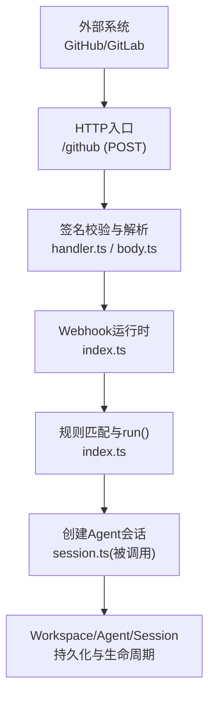
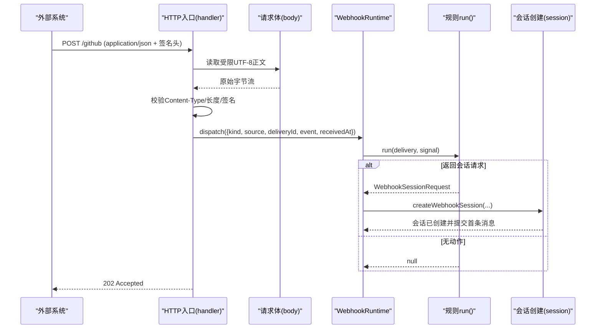
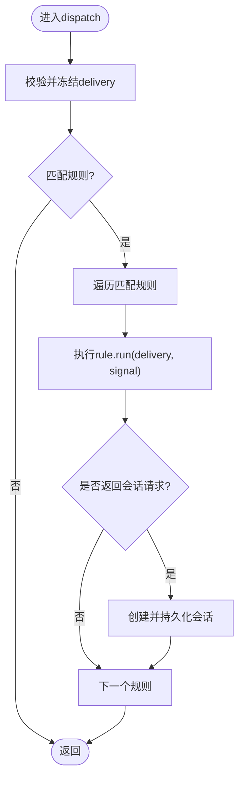
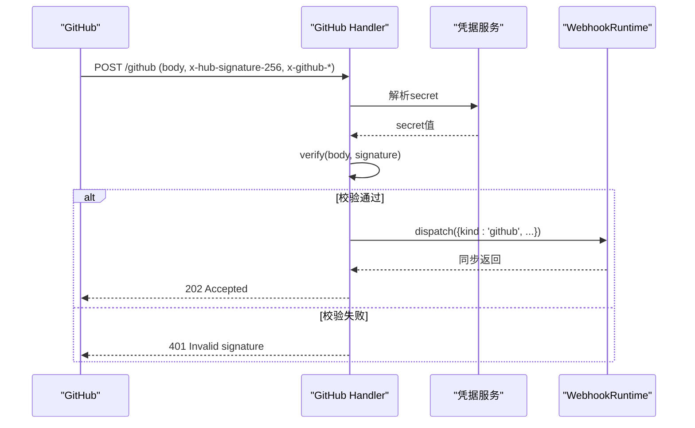
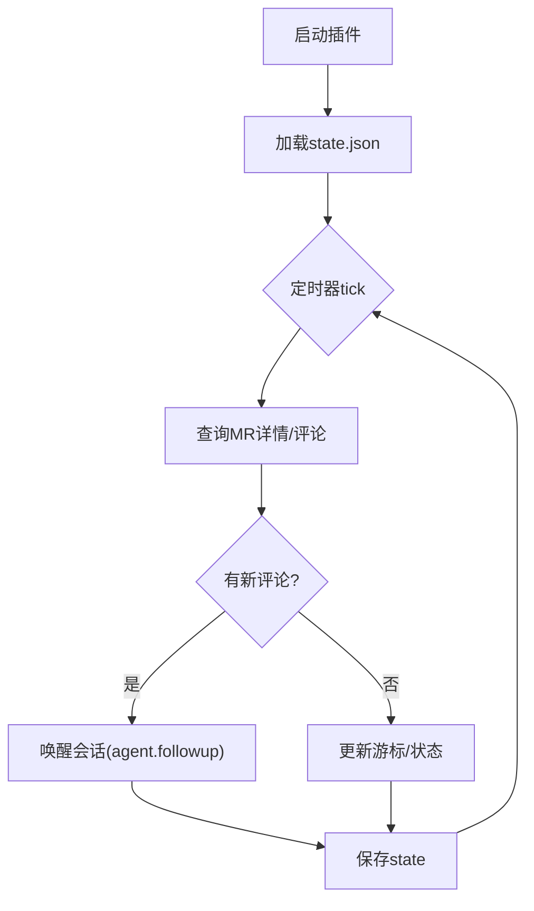
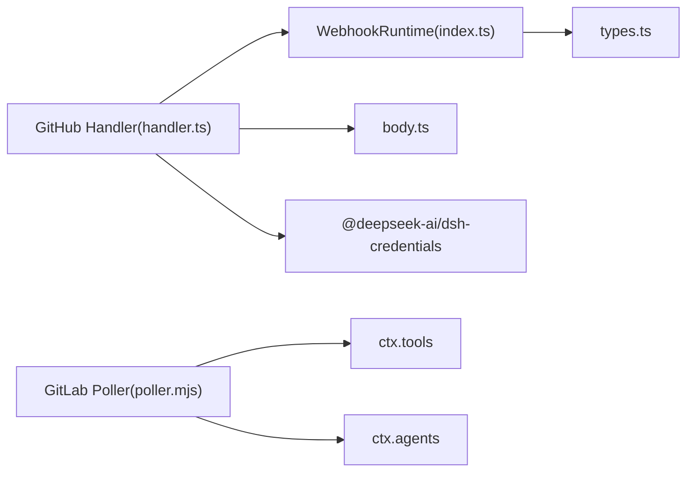

# Webhook集成API

<cite>
**本文引用的文件**
- [packages/webhook/webhook/src/index.ts](file://packages/webhook/webhook/src/index.ts)
- [packages/webhook/webhook/src/types.ts](file://packages/webhook/webhook/src/types.ts)
- [packages/webhook/webhook-github/src/handler.ts](file://packages/webhook/webhook-github/src/handler.ts)
- [packages/webhook/webhook-github/src/body.ts](file://packages/webhook/webhook-github/src/body.ts)
- [docs/subsystems/webhook.md](file://docs/subsystems/webhook.md)
- [docs/user/guide/github-review.md](file://docs/user/guide/github-review.md)
- [gitlab-mr/gitlab-mr-poller.mjs](file://gitlab-mr/gitlab-mr-poller.mjs)
</cite>

## 目录
1. [简介](#简介)
2. [项目结构](#项目结构)
3. [核心组件](#核心组件)
4. [架构总览](#架构总览)
5. [详细组件分析](#详细组件分析)
6. [依赖关系分析](#依赖关系分析)
7. [性能与可靠性](#性能与可靠性)
8. [故障排查指南](#故障排查指南)
9. [结论](#结论)
10. [附录：端点、事件与示例](#附录：端点、事件与示例)

## 简介
本文件面向DeepSeek Harness的Webhook集成REST API，系统性说明Webhook的注册、触发与处理机制，覆盖事件订阅、回调URL配置、签名验证、负载格式、重试策略、队列管理、失败处理与监控告警，并给出GitHub与GitLab集成的具体实现方法。需要特别说明的是：当前Webhook运行时采用“发后即忘”模型，不内置队列、重试、去重或执行状态持久化；会话创建成功后由普通Session生命周期接管。

## 项目结构
- Webhook运行时（provider-neutral）
  - 规则注册与分发：packages/webhook/webhook/src/index.ts
  - 类型定义与契约：packages/webhook/webhook/src/types.ts
- GitHub适配器
  - HTTP入口与签名校验：packages/webhook/webhook-github/src/handler.ts
  - 请求体读取与错误封装：packages/webhook/webhook-github/src/body.ts
- 文档与使用指南
  - Webhook子系统说明：docs/subsystems/webhook.md
  - GitHub Review使用指南：docs/user/guide/github-review.md
- GitLab集成（轮询模式）
  - 插件与工具：gitlab-mr/gitlab-mr-poller.mjs

图表来源
- [packages/webhook/webhook-github/src/handler.ts:78-131](file://packages/webhook/webhook-github/src/handler.ts#L78-L131)
- [packages/webhook/webhook-github/src/body.ts:36-70](file://packages/webhook/webhook-github/src/body.ts#L36-L70)
- [packages/webhook/webhook/src/index.ts:58-179](file://packages/webhook/webhook/src/index.ts#L58-L179)

章节来源
- [docs/subsystems/webhook.md:1-71](file://docs/subsystems/webhook.md#L1-L71)

## 核心组件
- WebhookRuntime（服务）
  - 提供register(rule)注册可信规则，返回可等待的销毁器以中止并排空活跃调用。
  - 提供dispatch(delivery)对已认证投递进行快照、冻结后分发给所有匹配规则，立即返回。
  - 关闭时按规则粒度中止并清理活跃任务，避免卸载期代码继续执行。
- VerifiedWebhookDelivery
  - 包含kind/source/deliveryId/event/receivedAt，经运行时校验并深拷贝冻结，保证跨规则安全共享。
- WebhookRule<K>
  - 唯一id、provider kind、run(delivery, signal)，可返回null或一个WebhookSessionRequest。
- WebhookSessionRequest
  - 指定workspacePath/title/prompt/agentPreset/permissionPreset及可选model选择，用于创建根会话。

章节来源
- [packages/webhook/webhook/src/index.ts:58-179](file://packages/webhook/webhook/src/index.ts#L58-L179)
- [packages/webhook/webhook/src/types.ts:1-85](file://packages/webhook/webhook/src/types.ts#L1-L85)

## 架构总览
Webhook整体流程为：外部平台通过HTTPS将事件推送到受保护的HTTP入口；入口完成内容类型、长度限制、签名校验与JSON规范化后，构造VerifiedWebhookDelivery并交给WebhookRuntime；运行时根据规则kind匹配并异步执行rule.run()；若返回会话请求，则创建并挂载Agent，提交初始提示消息，后续由Session生命周期负责持久化与恢复。

图表来源
- [packages/webhook/webhook-github/src/handler.ts:78-131](file://packages/webhook/webhook-github/src/handler.ts#L78-L131)
- [packages/webhook/webhook-github/src/body.ts:36-70](file://packages/webhook/webhook-github/src/body.ts#L36-L70)
- [packages/webhook/webhook/src/index.ts:126-162](file://packages/webhook/webhook/src/index.ts#L126-L162)

## 详细组件分析

### Webhook运行时（Fire-and-forget）
- 规则注册
  - 校验id/kind/run函数；重复id会报错；关闭中注册会拒绝。
  - 每个规则维护AbortController与活跃Promise集合，支持优雅销毁。
- 分发调度
  - 对delivery做字段校验与不可变快照；按kind匹配规则并发启动；异常逐规则捕获并记录。
- 会话创建
  - 非空结果在异步预检前快照；校验预设、解析/创建工作区、挂载Agent预设、持久化会话并提交首条消息；失败路径会回滚Agent与工作区挂载。

图表来源
- [packages/webhook/webhook/src/index.ts:126-179](file://packages/webhook/webhook/src/index.ts#L126-L179)

章节来源
- [packages/webhook/webhook/src/index.ts:58-179](file://packages/webhook/webhook/src/index.ts#L58-L179)
- [docs/subsystems/webhook.md:19-32](file://docs/subsystems/webhook.md#L19-L32)

### GitHub适配器（HTTP入口与签名验证）
- 路由与方法
  - 仅接受POST application/json；其他方法返回405并提示允许的方法。
- 请求体限制
  - 基于Content-Length与流式读取双重保护，超过阈值或中断即拒绝。
- 签名验证
  - 要求x-hub-signature-256与x-github-delivery/x-github-event头；使用Octokit Webhooks库校验签名。
- 响应语义
  - 成功校验并派发后立即返回202；不等待规则执行结果。
- 错误映射
  - 非法输入/签名失败/不可用等分别返回4xx/5xx，并附带人类可读消息。

图表来源
- [packages/webhook/webhook-github/src/handler.ts:78-131](file://packages/webhook/webhook-github/src/handler.ts#L78-L131)
- [packages/webhook/webhook-github/src/body.ts:36-70](file://packages/webhook/webhook-github/src/body.ts#L36-L70)

章节来源
- [packages/webhook/webhook-github/src/handler.ts:1-131](file://packages/webhook/webhook-github/src/handler.ts#L1-L131)
- [packages/webhook/webhook-github/src/body.ts:1-70](file://packages/webhook/webhook-github/src/body.ts#L1-L70)
- [docs/user/guide/github-review.md:40-72](file://docs/user/guide/github-review.md#L40-L72)

### GitLab集成（轮询入站）
- 模式说明
  - 不使用公开回调URL；通过插件定时拉取MR评论与状态变化，唤醒对应会话。
- 登记机制
  - 提供gitlab_watch_mr工具，将“当前会话↔MR”绑定并持久化游标；重启后可恢复。
- 事件处理
  - 新评论（过滤bot作者与系统笔记）→ 唤醒会话；合并/关闭 → 唤醒并移除跟踪。
- 配置项
  - tokenEnv/apiBase/botUsername/pollIntervalMs/stateFilePath/perPage等。

图表来源
- [gitlab-mr/gitlab-mr-poller.mjs:82-324](file://gitlab-mr/gitlab-mr-poller.mjs#L82-L324)

章节来源
- [gitlab-mr/README.md:1-110](file://gitlab-mr/README.md#L1-L110)
- [gitlab-mr/gitlab-mr-poller.mjs:1-324](file://gitlab-mr/gitlab-mr-poller.mjs#L1-L324)

## 依赖关系分析
- Webhook运行时依赖Cordis上下文中的agents、agentDefaultModel、agentPresets、permissionPresets、sessionTitle、workspaceRegistry等服务，用于会话创建与权限控制。
- GitHub适配器依赖@octokit/webhooks进行签名校验，依赖dsh-credentials获取webhook secret。
- GitLab插件依赖Node标准库与fetch，通过ctx.credentials解析token，并通过tools/agents服务暴露工具与唤醒会话。

图表来源
- [packages/webhook/webhook/src/index.ts:58-66](file://packages/webhook/webhook/src/index.ts#L58-L66)
- [packages/webhook/webhook-github/src/handler.ts:3-16](file://packages/webhook/webhook-github/src/handler.ts#L3-L16)
- [gitlab-mr/gitlab-mr-poller.mjs:19-21](file://gitlab-mr/gitlab-mr-poller.mjs#L19-L21)

章节来源
- [packages/webhook/webhook/src/index.ts:58-66](file://packages/webhook/webhook/src/index.ts#L58-L66)
- [packages/webhook/webhook-github/src/handler.ts:3-16](file://packages/webhook/webhook-github/src/handler.ts#L3-L16)
- [gitlab-mr/gitlab-mr-poller.mjs:19-21](file://gitlab-mr/gitlab-mr-poller.mjs#L19-L21)

## 性能与可靠性
- 队列与重试
  - 运行时没有队列、重试、去重或执行状态表；重复投递可能产生重复会话。
- 幂等性建议
  - 建议在规则层依据deliveryId或事件主键做业务幂等控制。
- 资源保护
  - 请求体大小限制、严格Content-Type校验、签名校验，降低滥用风险。
- 可观测性
  - 运行时对失败调用记录警告日志；GitHub入口在不可用时返回503。
- 会话持久化
  - 会话一旦创建并注入首条消息，即由Session持久化与Agent生命周期保障，不受Webhook进程重启影响。

章节来源
- [docs/subsystems/webhook.md:19-32](file://docs/subsystems/webhook.md#L19-L32)
- [packages/webhook/webhook-github/src/handler.ts:121-128](file://packages/webhook/webhook-github/src/handler.ts#L121-L128)

## 故障排查指南
- 常见HTTP错误
  - 400：请求体非JSON/UTF-8、Content-Length无效、请求被中断。
  - 401：签名校验失败或缺少必需头。
  - 405：非POST方法。
  - 413：请求体过大。
  - 415：Content-Type不是application/json。
  - 503：Webhook运行时不可用或凭据缺失。
- 定位步骤
  - 检查网关/反向代理是否正确转发POST与头部。
  - 确认GitHub webhook配置的事件类型、内容类型与Secret一致。
  - 查看应用日志中webhook-github与webhookRuntime相关警告信息。
  - 对于GitLab轮询，检查state文件、token与API可达性。

章节来源
- [packages/webhook/webhook-github/src/body.ts:6-27](file://packages/webhook/webhook-github/src/body.ts#L6-L27)
- [packages/webhook/webhook-github/src/handler.ts:82-128](file://packages/webhook/webhook-github/src/handler.ts#L82-L128)
- [gitlab-mr/gitlab-mr-poller.mjs:120-152](file://gitlab-mr/gitlab-mr-poller.mjs#L120-L152)

## 结论
DeepSeek Harness的Webhook子系统以“发后即忘”的方式提供高吞吐、低耦合的外部事件接入能力。通过严格的HTTP入口校验与不可变交付对象，确保规则执行的稳定性与安全性；会话创建完成后交由Session体系负责持久化与恢复。对于需要可靠投递与重试的场景，可在上层通过规则逻辑或外部编排实现幂等与补偿。

## 附录：端点、事件与示例

### HTTP端点
- POST /github
  - 用途：接收GitHub Webhook事件并进行签名校验与派发。
  - 必需头：Content-Type: application/json；x-hub-signature-256；x-github-delivery；x-github-event。
  - 响应：202 Accepted（成功派发），或4xx/5xx错误码。
  - 注意：该端点由GitHub适配器注册；如需隔离浏览器API，可通过独立WebServer暴露。

章节来源
- [packages/webhook/webhook-github/src/handler.ts:78-131](file://packages/webhook/webhook-github/src/handler.ts#L78-L131)
- [docs/user/guide/github-review.md:40-72](file://docs/user/guide/github-review.md#L40-L72)

### 事件类型与负载
- 事件载体
  - VerifiedWebhookDelivery包含kind/source/deliveryId/event/receivedAt；event为各provider归一化的lossless JSON。
- GitHub事件
  - 由适配器从x-github-event与payload组装；规则需消费所需字段。
- 扩展性
  - WebhookEventMap允许按provider kind扩展事件类型；未知kind仍支持通用JsonValue。

章节来源
- [packages/webhook/webhook/src/types.ts:1-25](file://packages/webhook/webhook/src/types.ts#L1-L25)
- [packages/webhook/webhook-github/src/handler.ts:106-113](file://packages/webhook/webhook-github/src/handler.ts#L106-L113)

### 回调响应与幂等
- 回调响应
  - 入口在派发成功后立即返回202；不等待规则执行结果。
- 幂等建议
  - 由于无去重与重试，建议在规则内基于deliveryId或事件主键实现幂等。

章节来源
- [packages/webhook/webhook-github/src/handler.ts:114-120](file://packages/webhook/webhook-github/src/handler.ts#L114-L120)
- [docs/subsystems/webhook.md:19-24](file://docs/subsystems/webhook.md#L19-L24)

### 签名验证机制
- GitHub
  - 使用Octokit Webhooks库对原始body与x-hub-signature-256进行校验；secret通过凭据服务解析。
- 安全要点
  - 仅校验未修改的application/json；严格限制字符集与长度；非法请求直接拒绝。

章节来源
- [packages/webhook/webhook-github/src/handler.ts:95-105](file://packages/webhook/webhook-github/src/handler.ts#L95-L105)
- [packages/webhook/webhook-github/src/body.ts:17-27](file://packages/webhook/webhook-github/src/body.ts#L17-L27)

### 队列管理与失败处理
- 队列
  - 无内置队列；规则执行在内存中并发运行，随进程结束而消失。
- 失败处理
  - 单规则异常被捕获并记录；会话创建失败会尝试回滚Agent与工作区挂载。
- 监控告警
  - 运行时与入口均输出警告日志；可将日志接入集中监控系统设置告警。

章节来源
- [packages/webhook/webhook/src/index.ts:136-179](file://packages/webhook/webhook/src/index.ts#L136-L179)
- [docs/subsystems/webhook.md:25-32](file://docs/subsystems/webhook.md#L25-L32)

### 第三方平台集成方法
- GitHub
  - 通过GitHub适配器注册POST /github；在GitHub控制台配置Payload URL、Content type、Secret与事件；遵循隔离WebServer部署建议。
- GitLab
  - 使用轮询插件gitlab-mr-poller.mjs；通过gitlab_watch_mr工具登记MR；后台定时拉取评论与状态变更并唤醒会话。

章节来源
- [docs/user/guide/github-review.md:40-72](file://docs/user/guide/github-review.md#L40-L72)
- [gitlab-mr/README.md:1-110](file://gitlab-mr/README.md#L1-L110)