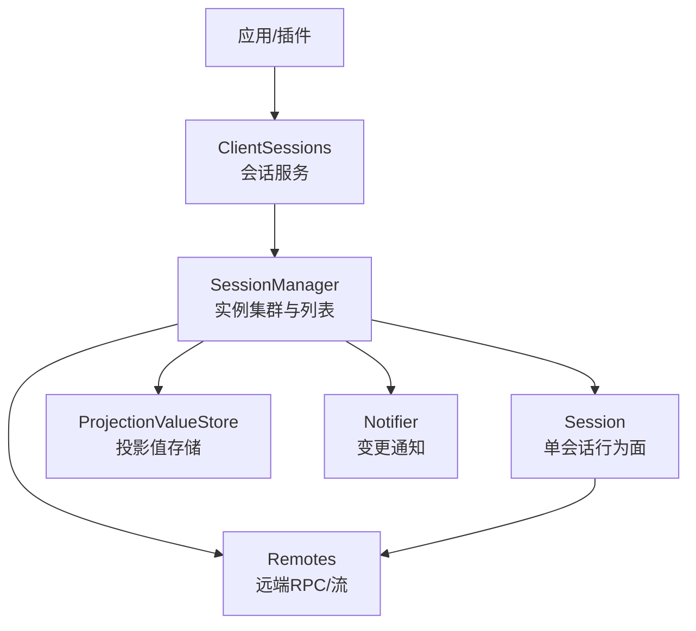
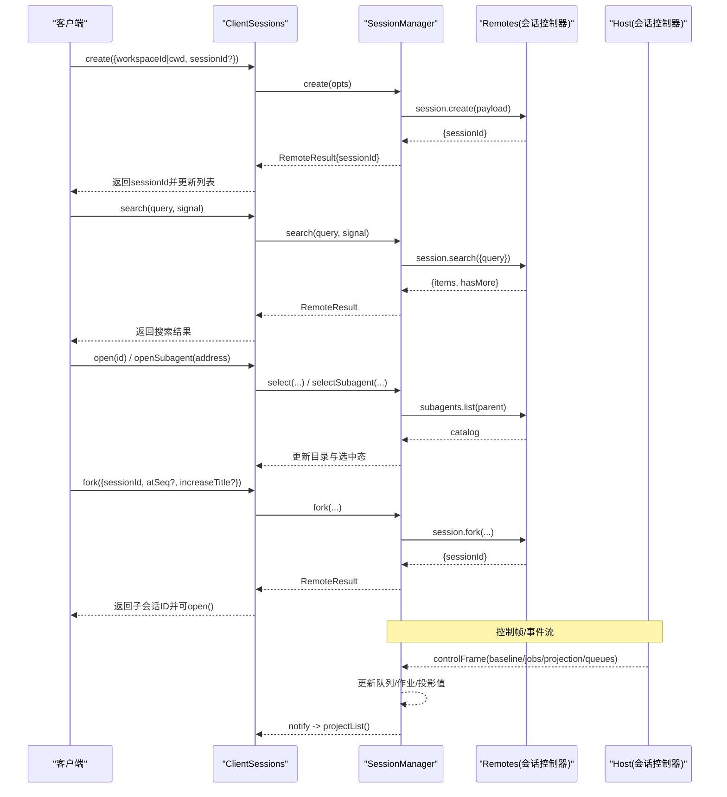
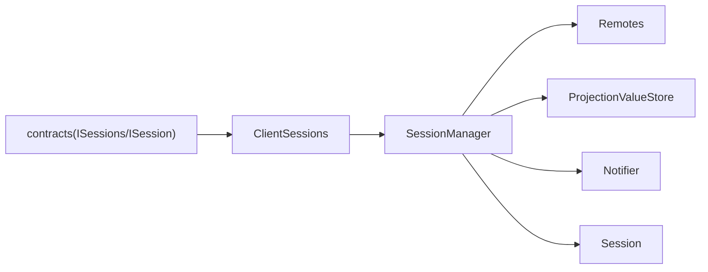

# 会话管理API

<cite>
**本文引用的文件**
- [packages/api/session-controller/src/client/contract/sessions.ts](file://packages/api/session-controller/src/client/contract/sessions.ts)
- [packages/api/session-controller/src/client/contract/session.ts](file://packages/api/session-controller/src/client/contract/session.ts)
- [packages/api/session-controller/src/client/sessions/service.ts](file://packages/api/session-controller/src/client/sessions/service.ts)
- [packages/api/session-controller/src/client/sessions/manager.ts](file://packages/api/session-controller/src/client/sessions/manager.ts)
</cite>

## 目录
1. [简介](#简介)
2. [项目结构](#项目结构)
3. [核心组件](#核心组件)
4. [架构总览](#架构总览)
5. [详细组件分析](#详细组件分析)
6. [依赖关系分析](#依赖关系分析)
7. [性能考量](#性能考量)
8. [故障排查指南](#故障排查指南)
9. [结论](#结论)
10. [附录](#附录)

## 简介
本文件面向DeepSeek Harness的“会话管理”能力，聚焦客户端侧会话服务与控制器（session-controller）如何暴露并实现会话的创建、查询、更新、删除、分支、恢复、事件流与状态同步。文档以HTTP REST视角组织端点契约与调用流程，同时给出内部对象层（ClientSessions/SessionManager/Session）的职责边界、并发控制、持久化策略与错误处理机制，帮助读者快速理解并正确使用会话相关API。

## 项目结构
- 会话对外接口定义位于 contracts：ISessions、ISession、SessionFace 等，明确功能面与输入输出类型。
- 会话服务实现位于 sessions 子目录：
  - service.ts：根会话服务 ClientSessions，维护列表快照、当前选择、作用域树、绑定缓存、面包屑路由等。
  - manager.ts：实例集群 SessionManager，负责会话清单刷新、子代理目录、投影值存储、控制帧处理、搜索、创建/分支等。
  - session.ts：单个会话的行为面（prompt、cancel、rename、loadOlder/loadThrough、command 等）。
- 其他辅助模块：notifier、projection-store、lineage、remotes、queue-mirror 等用于事件通知、投影值、血缘、远程调用与队列镜像。

图表来源
- [packages/api/session-controller/src/client/sessions/service.ts:181-264](file://packages/api/session-controller/src/client/sessions/service.ts#L181-L264)
- [packages/api/session-controller/src/client/sessions/manager.ts:95-160](file://packages/api/session-controller/src/client/sessions/manager.ts#L95-L160)
- [packages/api/session-controller/src/client/contract/session.ts:62-149](file://packages/api/session-controller/src/client/contract/session.ts#L62-L149)

章节来源
- [packages/api/session-controller/src/client/sessions/service.ts:181-264](file://packages/api/session-controller/src/client/sessions/service.ts#L181-L264)
- [packages/api/session-controller/src/client/sessions/manager.ts:95-160](file://packages/api/session-controller/src/client/sessions/manager.ts#L95-L160)
- [packages/api/session-controller/src/client/contract/session.ts:62-149](file://packages/api/session-controller/src/client/contract/session.ts#L62-L149)

## 核心组件
- ISessions（会话服务面）
  - create：创建或接管会话，返回会话ID；支持指定 workspaceId/cwd/预分配 sessionId。
  - open/openSubagent：选择当前会话或通过子代理地址打开。
  - refresh/search：刷新会话列表；搜索可见消息内容（结果请求局部）。
  - fork：从源会话完成轮次前缀分支出新会话；可选锚定事件序列号与自动递增标题。
  - scope/sessionOf/binding：解析Agent作用域上下文与会话绑定。
- ISession（会话行为面）
  - beginSubmission/prompt：注册本地提交回显并发送提示；支持 queue/steer 模式。
  - updateQueue/cancel：对排队项执行编辑/移除/中断；取消运行中的轮次。
  - rename/loadOlder/loadThrough/command：重命名、历史分页、跳转加载、执行斜杠命令。
- ClientSessions（会话服务实现）
  - 维护 list 快照、current 选择、scope 树、binding 缓存、面包屑路由。
  - 通过 Manager 订阅列表变化并投影到 store；跟随 current 打开窗口。
- SessionManager（会话管理器）
  - 维护会话实例 Map、队列、完成提醒、投影值存储、子代理目录、控制帧处理。
  - 提供 refreshList/create/fork/search/refreshSubagents 等方法。
  - 处理 host 事件：新增/移除/状态/活动/错误，以及连接恢复。

章节来源
- [packages/api/session-controller/src/client/contract/sessions.ts:20-123](file://packages/api/session-controller/src/client/contract/sessions.ts#L20-L123)
- [packages/api/session-controller/src/client/contract/session.ts:62-149](file://packages/api/session-controller/src/client/contract/session.ts#L62-L149)
- [packages/api/session-controller/src/client/sessions/service.ts:181-720](file://packages/api/session-controller/src/client/sessions/service.ts#L181-L720)
- [packages/api/session-controller/src/client/sessions/manager.ts:95-800](file://packages/api/session-controller/src/client/sessions/manager.ts#L95-L800)

## 架构总览
下图展示从客户端到服务端的主要交互路径：创建、查询、更新、删除、分支、事件流与状态同步。

图表来源
- [packages/api/session-controller/src/client/sessions/service.ts:406-453](file://packages/api/session-controller/src/client/sessions/service.ts#L406-L453)
- [packages/api/session-controller/src/client/sessions/manager.ts:452-615](file://packages/api/session-controller/src/client/sessions/manager.ts#L452-L615)
- [packages/api/session-controller/src/client/sessions/manager.ts:656-703](file://packages/api/session-controller/src/client/sessions/manager.ts#L656-L703)

## 详细组件分析

### 会话生命周期与REST端点映射
- POST /api/sessions
  - 语义：创建新会话或接管已有会话。
  - 入参：workspaceId 或 cwd；可选 sessionId（预分配）。
  - 出参：sessionId。
  - 行为：立即将新建会话合并进列表（blank=true），后续由宿主推送标题/元数据。
  - 失败：返回业务/传输错误；若已发布但附件未附加，会作为“未分组”会话出现在列表中以便重试。
  - 参考：[create:553-585](file://packages/api/session-controller/src/client/sessions/manager.ts#L553-L585)、[ClientSessions.create:406-411](file://packages/api/session-controller/src/client/sessions/service.ts#L406-L411)

- GET /api/sessions/:id
  - 语义：获取会话详情（通过会话绑定与事件源读取）。
  - 行为：通过 binding(id) 获取 SessionBinding，包含 session、eventSource、ctx；可读取会话快照与投影值。
  - 参考：[binding:509-511](file://packages/api/session-controller/src/client/sessions/service.ts#L509-L511)、[SessionBinding:127-135](file://packages/api/session-controller/src/client/sessions/service.ts#L127-L135)

- PUT /api/sessions/:id
  - 语义：更新会话配置（如重命名）。
  - 行为：调用 session.rename(title)，返回标准化后的标题与事件序列号。
  - 参考：[rename:113-119](file://packages/api/session-controller/src/client/contract/session.ts#L113-L119)

- DELETE /api/sessions/:id
  - 语义：删除会话（由宿主侧决定策略）。
  - 行为：宿主通过事件通知移除会话；客户端收到 handleSessionRemoved 后清理队列/作业/投影值，必要时标记子代理父不可用。
  - 参考：[handleSessionRemoved:728-758](file://packages/api/session-controller/src/client/sessions/manager.ts#L728-L758)

- PATCH /api/sessions/:id/queue/:itemId
  - 语义：对排队项执行编辑/移除/严格转向等操作。
  - 行为：调用 session.updateQueue(itemId, action)。
  - 参考：[updateQueue:100-106](file://packages/api/session-controller/src/client/contract/session.ts#L100-L106)

- POST /api/sessions/:id/cancel
  - 语义：取消运行中的轮次（排队工作保留并在空闲后按FIFO继续）。
  - 行为：调用 session.cancel。
  - 参考：[cancel:107-112](file://packages/api/session-controller/src/client/contract/session.ts#L107-L112)

- POST /api/sessions/:id/fork
  - 语义：从源会话的完成轮次前缀分支出新会话。
  - 行为：可选 atSeq 锚定切割点；可选 increaseTitle 自动递增标题；成功后子会话非空且带 parentSessionId。
  - 参考：[fork:587-615](file://packages/api/session-controller/src/client/sessions/manager.ts#L587-L615)、[ClientSessions.fork:413-453](file://packages/api/session-controller/src/client/sessions/service.ts#L413-L453)

- GET /api/sessions/search?q=...
  - 语义：搜索宿主可见的消息内容索引。
  - 行为：返回 items 与 hasMore；结果请求局部，不改变列表快照。
  - 参考：[search:524-544](file://packages/api/session-controller/src/client/sessions/manager.ts#L524-L544)

- GET /api/sessions (列表)
  - 语义：拉取宿主权威会话列表。
  - 行为：首次拉取建立基线；后续通过事件增量更新；支持子代理目录刷新。
  - 参考：[refreshList:452-522](file://packages/api/session-controller/src/client/sessions/manager.ts#L452-L522)

章节来源
- [packages/api/session-controller/src/client/sessions/manager.ts:452-615](file://packages/api/session-controller/src/client/sessions/manager.ts#L452-L615)
- [packages/api/session-controller/src/client/sessions/service.ts:406-453](file://packages/api/session-controller/src/client/sessions/service.ts#L406-L453)
- [packages/api/session-controller/src/client/contract/session.ts:100-119](file://packages/api/session-controller/src/client/contract/session.ts#L100-L119)

### 会话ID生成规则与持久化策略
- ID生成
  - 支持调用方预分配 sessionId（create/fork 均接受可选 sessionId），便于后续流/列表对齐。
  - 未指定时由宿主生成稳定ID。
  - 参考：[create payload:553-564](file://packages/api/session-controller/src/client/sessions/manager.ts#L553-L564)、[fork 参数:596-603](file://packages/api/session-controller/src/client/sessions/manager.ts#L596-L603)

- 持久化
  - 列表选择（current）持久化到本地存储，键名 dsh.sessions.current；重启后恢复选择。
  - 会话日志为宿主权威持久化事实；客户端在 open() 时按需回填历史窗口。
  - 投影值（如标题）通过 per-session ProjectionValueStore 持久化与合并，避免冷启动缺失。
  - 参考：[selection持久化:225-233](file://packages/api/session-controller/src/client/sessions/service.ts#L225-L233)、[open触发回填:520-537](file://packages/api/session-controller/src/client/sessions/service.ts#L520-L537)、[投影值存储](file://packages/api/session-controller/src/client/sessions/manager.ts:338-L349)

章节来源
- [packages/api/session-controller/src/client/sessions/service.ts:225-233](file://packages/api/session-controller/src/client/sessions/service.ts#L225-L233)
- [packages/api/session-controller/src/client/sessions/service.ts:520-537](file://packages/api/session-controller/src/client/sessions/service.ts#L520-L537)
- [packages/api/session-controller/src/client/sessions/manager.ts:338-349](file://packages/api/session-controller/src/client/sessions/manager.ts#L338-L349)

### 并发控制与状态同步
- 列表刷新
  - 单飞（single-flight）：重复调用 refreshList 复用同一请求；完成后合并基线与回放中间变更。
  - 参考：[refreshList:452-522](file://packages/api/session-controller/src/client/sessions/manager.ts#L452-L522)

- 子代理目录
  - 单飞刷新；关闭菜单时防抖；打开时立即刷新；成员变化时延迟一次追加刷新。
  - 参考：[refreshSubagents:351-429](file://packages/api/session-controller/src/client/sessions/manager.ts#L351-L429)、[setSubagentCatalogOpen:431-448](file://packages/api/session-controller/src/client/sessions/manager.ts#L431-L448)

- 作用域与窗口
  - 作用域懒创建；stage 跟随 current；离开列表的作用域延后销毁直到 stage 移动。
  - 参考：[followCurrent/pruneScopes/dropScope:520-694](file://packages/api/session-controller/src/client/sessions/service.ts#L520-L694)

- 事件流与状态同步
  - 控制帧（baseline/jobs/projection/queues）统一进入 handleControlFrame，更新队列/作业/投影值并通知。
  - 宿主事件（新增/移除/状态/活动/错误）驱动列表与实例状态一致。
  - 参考：[handleControlFrame:656-703](file://packages/api/session-controller/src/client/sessions/manager.ts#L656-L703)、[handleSessionAdded/Removed/Status/Activity/Error:705-787](file://packages/api/session-controller/src/client/sessions/manager.ts#L705-L787)

章节来源
- [packages/api/session-controller/src/client/sessions/manager.ts:351-448](file://packages/api/session-controller/src/client/sessions/manager.ts#L351-L448)
- [packages/api/session-controller/src/client/sessions/service.ts:520-694](file://packages/api/session-controller/src/client/sessions/service.ts#L520-L694)
- [packages/api/session-controller/src/client/sessions/manager.ts:656-787](file://packages/api/session-controller/src/client/sessions/manager.ts#L656-L787)

### 权限验证、访问控制与错误处理
- 权限与访问控制
  - 会话作用域（Agent scope）通过 ctx.sessions.scope(sessionId) 解析，限制跨会话访问。
  - 子代理目录仅对健康条目开放导航；父不可用时降级显示。
  - 参考：[scope/sessionOf:455-501](file://packages/api/session-controller/src/client/sessions/service.ts#L455-L501)、[selectSubagent校验:187-203](file://packages/api/session-controller/src/client/sessions/manager.ts#L187-L203)

- 错误处理
  - 统一使用 RemoteResult 包装成功/失败；失败包含 code/message。
  - 创建/分支失败抛出结构化异常（SessionCreateError/SessionForkError），携带请求上下文。
  - 列表/目录拉取失败设置 error 状态，保持界面可降级。
  - 参考：[SessionCreateError/SessionForkError:95-125](file://packages/api/session-controller/src/client/sessions/service.ts#L95-L125)、[search/refreshList错误分支:507-519](file://packages/api/session-controller/src/client/sessions/manager.ts#L507-L519)

章节来源
- [packages/api/session-controller/src/client/sessions/service.ts:95-125](file://packages/api/session-controller/src/client/sessions/service.ts#L95-L125)
- [packages/api/session-controller/src/client/sessions/manager.ts:187-203](file://packages/api/session-controller/src/client/sessions/manager.ts#L187-L203)
- [packages/api/session-controller/src/client/sessions/manager.ts:507-519](file://packages/api/session-controller/src/client/sessions/manager.ts#L507-L519)

### 会话恢复、分支管理与版本控制
- 会话恢复
  - 连接恢复时重新拉取列表与目录；已选会话的子代理目录也会刷新。
  - 参考：[handleConnected:789-800](file://packages/api/session-controller/src/client/sessions/manager.ts#L789-L800)

- 分支管理
  - fork 支持 atSeq 锚定切割点；increaseTitle 自动递增标题；子会话继承工作目录与血缘。
  - 参考：[fork:587-615](file://packages/api/session-controller/src/client/sessions/manager.ts#L587-L615)、[ClientSessions.fork:413-453](file://packages/api/session-controller/src/client/sessions/service.ts#L413-L453)

- 版本控制
  - 投影值采用序列号（asOfSeq）进行版本化合并；控制帧也携带 seq，确保高序覆盖低序。
  - 参考：[投影值apply:693-703](file://packages/api/session-controller/src/client/sessions/manager.ts#L693-L703)、[list baseline seed:494-506](file://packages/api/session-controller/src/client/sessions/manager.ts#L494-L506)

章节来源
- [packages/api/session-controller/src/client/sessions/manager.ts:789-800](file://packages/api/session-controller/src/client/sessions/manager.ts#L789-L800)
- [packages/api/session-controller/src/client/sessions/manager.ts:587-615](file://packages/api/session-controller/src/client/sessions/manager.ts#L587-L615)
- [packages/api/session-controller/src/client/sessions/service.ts:413-453](file://packages/api/session-controller/src/client/sessions/service.ts#L413-L453)

### 事件流与状态同步机制
- 事件来源
  - 控制帧：baseline/jobs/projection/queues，集中处理并广播变更。
  - 宿主事件：新增/移除/状态/活动/错误，驱动列表与实例一致性。
- 通知机制
  - Notifier 批量通知；列表快照惰性重建；投影值变更触发行级刷新。
- 参考
  - [handleControlFrame:656-703](file://packages/api/session-controller/src/client/sessions/manager.ts#L656-L703)
  - [handleSessionAdded/Removed/Status/Activity/Error:705-787](file://packages/api/session-controller/src/client/sessions/manager.ts#L705-L787)
  - [projectList:576-647](file://packages/api/session-controller/src/client/sessions/service.ts#L576-L647)

章节来源
- [packages/api/session-controller/src/client/sessions/manager.ts:656-787](file://packages/api/session-controller/src/client/sessions/manager.ts#L656-L787)
- [packages/api/session-controller/src/client/sessions/service.ts:576-647](file://packages/api/session-controller/src/client/sessions/service.ts#L576-L647)

## 依赖关系分析
- 组件耦合
  - ClientSessions 依赖 SessionManager 提供列表与实例管理；SessionManager 依赖 Remotes 与 Notifier。
  - Session 行为面通过 Remotes 与宿主交互；投影值通过 ProjectionValueStore 共享。
- 外部依赖
  - typert 协议 RemoteResult/RemoteFailure 统一错误模型。
  - client-store 提供 ObservableSnapshot 与持久化能力。
- 循环依赖
  - 通过 contract 解耦对外面与内部实现，避免循环引用。

图表来源
- [packages/api/session-controller/src/client/contract/sessions.ts:20-123](file://packages/api/session-controller/src/client/contract/sessions.ts#L20-L123)
- [packages/api/session-controller/src/client/contract/session.ts:62-149](file://packages/api/session-controller/src/client/contract/session.ts#L62-L149)
- [packages/api/session-controller/src/client/sessions/service.ts:181-264](file://packages/api/session-controller/src/client/sessions/service.ts#L181-L264)
- [packages/api/session-controller/src/client/sessions/manager.ts:95-160](file://packages/api/session-controller/src/client/sessions/manager.ts#L95-L160)

章节来源
- [packages/api/session-controller/src/client/contract/sessions.ts:20-123](file://packages/api/session-controller/src/client/contract/sessions.ts#L20-L123)
- [packages/api/session-controller/src/client/contract/session.ts:62-149](file://packages/api/session-controller/src/client/contract/session.ts#L62-L149)
- [packages/api/session-controller/src/client/sessions/service.ts:181-264](file://packages/api/session-controller/src/client/sessions/service.ts#L181-L264)
- [packages/api/session-controller/src/client/sessions/manager.ts:95-160](file://packages/api/session-controller/src/client/sessions/manager.ts#L95-L160)

## 性能考量
- 列表刷新单飞与惰性快照构建，减少重复网络请求与渲染开销。
- 子代理目录刷新去抖与延迟追加，降低频繁交互带来的压力。
- 投影值按 key 合并与序列号版本控制，避免全量覆盖导致的抖动。
- 作用域懒创建与延后销毁，保证资源释放与视图冻结的一致性。

## 故障排查指南
- 常见问题
  - 创建失败：检查 workspaceId/cwd 是否有效；关注 SessionCreateError 的 code/message。
  - 分支失败：确认 atSeq 指向已完成轮次；关注 SessionForkError。
  - 列表为空：等待 phase 从 pending 转为 ready；检查 refreshList 错误分支。
  - 子代理目录错误：查看 state/error；确认父可用性与成员变化。
- 定位步骤
  - 通过 list 快照与 phase/state/error 判断列表健康度。
  - 检查控制帧与宿主事件是否到达；必要时触发 handleConnected 修复。
  - 对特定会话调用 binding 获取 eventSource 与 session 行为面，进一步诊断。

章节来源
- [packages/api/session-controller/src/client/sessions/service.ts:95-125](file://packages/api/session-controller/src/client/sessions/service.ts#L95-L125)
- [packages/api/session-controller/src/client/sessions/manager.ts:452-522](file://packages/api/session-controller/src/client/sessions/manager.ts#L452-L522)
- [packages/api/session-controller/src/client/sessions/manager.ts:789-800](file://packages/api/session-controller/src/client/sessions/manager.ts#L789-L800)

## 结论
DeepSeek Harness 的会话管理通过清晰的契约面与稳健的对象层实现，提供了完整的会话CRUD、分支、恢复、事件流与状态同步能力。借助单飞刷新、投影值版本控制与作用域懒创建，系统在可用性、一致性与性能之间取得平衡。开发者应优先通过 contracts 提供的 ISessions/ISession 进行集成，遵循错误模型与并发约束，以获得稳定的体验。

## 附录
- 典型请求/响应要点（基于契约与实现）
  - POST /api/sessions
    - 请求体：{ workspaceId?: string; cwd?: string; sessionId?: string }
    - 响应：{ sessionId: string }
    - 说明：创建后立即入列（blank=true），后续宿主推送标题/元数据。
  - GET /api/sessions/:id
    - 响应：会话详情（通过 binding 获取 session/eventSource/ctx）
  - PUT /api/sessions/:id
    - 请求体：{ title: string }
    - 响应：{ title: string; seq: number }
  - DELETE /api/sessions/:id
    - 响应：无；宿主事件通知移除
  - PATCH /api/sessions/:id/queue/:itemId
    - 请求体：{ action: QueueAction }
    - 响应：{ accepted: true }
  - POST /api/sessions/:id/cancel
    - 响应：{ accepted: true }
  - POST /api/sessions/:id/fork
    - 请求体：{ sessionId: string; atSeq?: number; increaseTitle?: boolean }
    - 响应：{ sessionId: string }
  - GET /api/sessions/search?q=...
    - 响应：{ items: [{ sessionId, snippet }], hasMore: boolean }
  - GET /api/sessions
    - 响应：{ items: [...], current, phase, subagentsByParent, jobsBySession, currentAddress }

- 字段说明
  - SessionSummary：id/title/displayTitle/cwd/parentId/origin/running/completed/blank/updatedAt/projectionValues
  - SessionListState：ids/byId/current/phase/subagentsByParent/jobsBySession/currentAddress
  - 参考：[SessionSummary/SessionListState:38-87](file://packages/api/session-controller/src/client/sessions/service.ts#L38-L87)

章节来源
- [packages/api/session-controller/src/client/sessions/service.ts:38-87](file://packages/api/session-controller/src/client/sessions/service.ts#L38-L87)
- [packages/api/session-controller/src/client/sessions/manager.ts:452-615](file://packages/api/session-controller/src/client/sessions/manager.ts#L452-L615)
- [packages/api/session-controller/src/client/contract/session.ts:100-149](file://packages/api/session-controller/src/client/contract/session.ts#L100-L149)