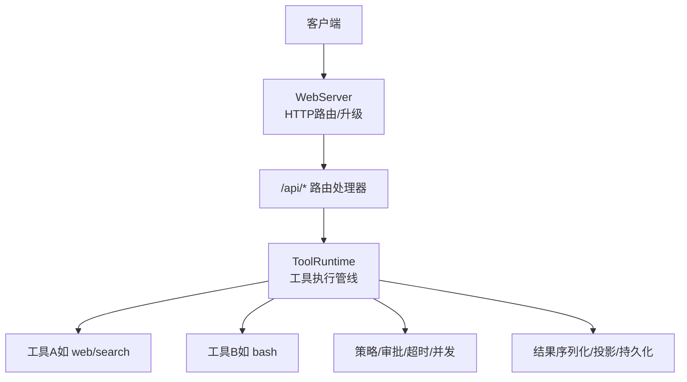
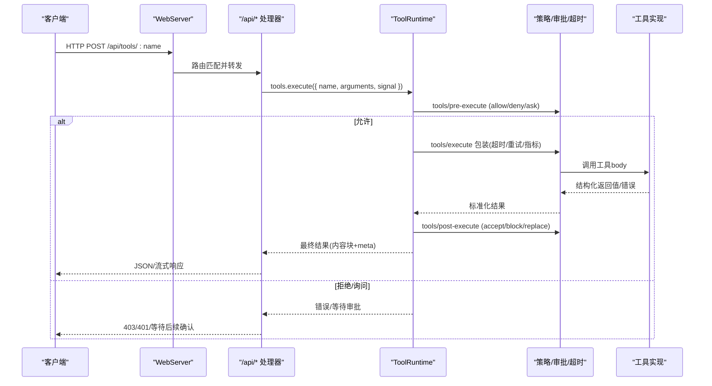
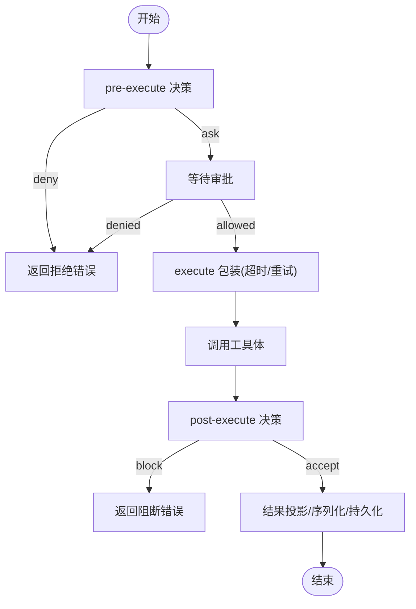
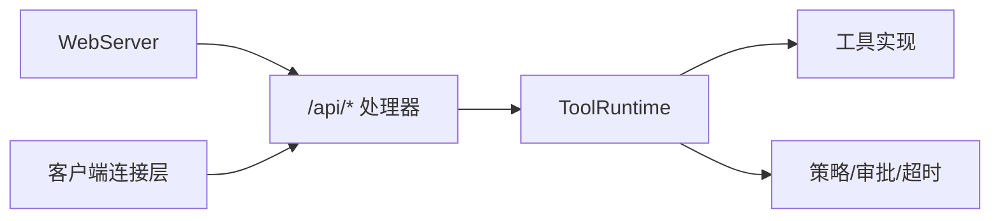

# 工具执行API

<cite>
**本文引用的文件**
- [packages/core/tools/src/index.ts](file://packages/core/tools/src/index.ts)
- [packages/host/webserver/src/index.js](file://packages/host/webserver/src/index.js)
- [packages/client/connection/src/api-path.ts](file://packages/client/connection/src/api-path.ts)
- [packages/web/tool-web/tests/integration.spec.ts](file://packages/web/tool-web/tests/integration.spec.ts)
- [packages/core/tools/tests/invariant.spec.ts](file://packages/core/tools/tests/invariant.spec.ts)
- [packages/core/tools/tests/ptc.spec.ts](file://packages/core/tools/tests/ptc.spec.ts)
</cite>

## 目录
1. [简介](#简介)
2. [项目结构](#项目结构)
3. [核心组件](#核心组件)
4. [架构总览](#架构总览)
5. [详细组件分析](#详细组件分析)
6. [依赖关系分析](#依赖关系分析)
7. [性能考虑](#性能考虑)
8. [故障排查指南](#故障排查指南)
9. [结论](#结论)
10. [附录：API参考与示例](#附录api参考与示例)

## 简介
本文件面向DeepSeek Harness的“工具执行”能力，聚焦于通过REST API调用工具的完整流程：从HTTP路由注册、参数校验、权限与安全策略、异步执行与超时控制，到结果序列化、流式响应与错误恢复。文档同时给出端点清单、请求/响应示例、以及缓存、批量执行与性能优化的实践建议。

## 项目结构
- Web服务器层：提供HTTP路由注册与升级（WebSocket等）能力，统一处理未匹配请求的回退逻辑。
- 工具运行时层：集中管理工具注册、可见性、执行管线（pre-execute / execute / post-execute）、并发与超时、结果投影与持久化。
- 客户端连接层：定义统一的API路径前缀，便于前后端一致的路由约定。
- 工具实现层：具体工具（如Web搜索/抓取）在各自包中声明schema、输出投影、呈现元数据，并通过工具运行时调度执行。

图表来源
- [packages/host/webserver/src/index.js:103-193](file://packages/host/webserver/src/index.js#L103-L193)
- [packages/core/tools/src/index.ts:780-800](file://packages/core/tools/src/index.ts#L780-L800)

章节来源
- [packages/host/webserver/src/index.js:103-193](file://packages/host/webserver/src/index.js#L103-L193)
- [packages/client/connection/src/api-path.ts:1-7](file://packages/client/connection/src/api-path.ts#L1-L7)

## 核心组件
- WebServer：提供精确匹配与最长前缀匹配的路由表，支持HTTP Upgrade；对未匹配请求提供回退处理器；异常时记录日志并返回400或销毁socket。
- ToolRuntime：工具注册与执行中枢，维护pre-execute、execute、post-execute水线事件，支持并发安全标记、超时预算、最终结果冻结与可观测事件。
- 工具定义：每个工具声明JSON Schema参数、输出投影render/presentationMeta、可选presentCall/presentResult用于UI展示，以及timeoutMs等元信息。

章节来源
- [packages/host/webserver/src/index.js:20-87](file://packages/host/webserver/src/index.js#L20-L87)
- [packages/core/tools/src/index.ts:203-280](file://packages/core/tools/src/index.ts#L203-L280)
- [packages/core/tools/src/index.ts:780-800](file://packages/core/tools/src/index.ts#L780-L800)

## 架构总览
下图展示了从HTTP请求到工具执行再到结果返回的关键路径，包括策略拦截、超时控制、并发调度与结果投影。

图表来源
- [packages/core/tools/src/index.ts:129-200](file://packages/core/tools/src/index.ts#L129-L200)
- [packages/core/tools/src/index.ts:1592-1612](file://packages/core/tools/src/index.ts#L1592-L1612)
- [packages/host/webserver/src/index.js:103-193](file://packages/host/webserver/src/index.js#L103-L193)

## 详细组件分析

### Web服务器与API路由
- 路由匹配：优先精确匹配，其次最长前缀匹配；未命中则进入回退处理器。
- 升级支持：HTTP Upgrade按精确路径分发，失败时记录警告并销毁socket。
- 错误处理：请求处理抛错会记录warning；若已发送响应头则销毁socket，否则返回400。

章节来源
- [packages/host/webserver/src/index.js:103-193](file://packages/host/webserver/src/index.js#L103-L193)
- [packages/host/webserver/src/index.js:195-208](file://packages/host/webserver/src/index.js#L195-L208)

### 工具运行时与执行管线
- 执行阶段：
  - pre-execute：允许/拒绝/询问（审批）。
  - execute：around-dispatch包装，支持超时、重试、指标收集；工具体必须消费exec.signal以支持取消。
  - post-execute：接受/替换/阻止结果，并可附加上下文。
- 结果处理：
  - 成功：value经output.schema校验后生成content与meta；presentationMeta用于UI呈现。
  - 失败：标准化为ToolExecutionFailure，包含message与info。
- 并发与超时：
  - isConcurrencySafe：声明是否可与兄弟调用并行。
  - timeoutMs：声明超时预算，由策略插件强制。
- 可观测性：tools/result、tools/change等事件。

图表来源
- [packages/core/tools/src/index.ts:129-200](file://packages/core/tools/src/index.ts#L129-L200)
- [packages/core/tools/src/index.ts:1592-1612](file://packages/core/tools/src/index.ts#L1592-L1612)

章节来源
- [packages/core/tools/src/index.ts:129-200](file://packages/core/tools/src/index.ts#L129-L200)
- [packages/core/tools/src/index.ts:203-280](file://packages/core/tools/src/index.ts#L203-L280)
- [packages/core/tools/src/index.ts:780-800](file://packages/core/tools/src/index.ts#L780-L800)

### 工具定义与参数/结果序列化
- 参数校验：基于JSON Schema，执行前完成解析与校验，确保lossless JSON。
- 输出投影：output.render将结构化value转为ContentBlock[]；presentationMeta用于UI元数据。
- 结果冻结：最终结果深拷贝并冻结，保证可回放与一致性。

章节来源
- [packages/core/tools/src/index.ts:203-280](file://packages/core/tools/src/index.ts#L203-L280)
- [packages/core/tools/src/index.ts:548-573](file://packages/core/tools/src/index.ts#L548-L573)

### 权限验证、沙箱隔离与安全限制
- 权限：pre-execute水线可拒绝或要求审批；未知工具调用抛出UNKNOWN_TOOL错误。
- 沙箱：工具体在受限环境中运行（例如PTC模式），仅暴露受控接口；外部网络访问受策略控制。
- 安全：所有结果需满足lossless JSON约束；投影失败会抛出INVALID_TOOL_OUTPUT。

章节来源
- [packages/core/tools/src/index.ts:481-515](file://packages/core/tools/src/index.ts#L481-L515)
- [packages/core/tools/src/index.ts:517-546](file://packages/core/tools/src/index.ts#L517-L546)

### 异步执行、超时控制与错误恢复
- 异步：工具体返回Promise；管线在await期间保持信号融合，确保取消传播。
- 超时：timeoutMs由策略插件强制执行；超时会转换为ABORTED或ABORTED_BEFORE_DISPATCH。
- 恢复：post-execute可将纠正反馈转为错误结果；tools/result事件可用于监控与重试策略。

章节来源
- [packages/core/tools/src/index.ts:129-200](file://packages/core/tools/src/index.ts#L129-L200)
- [packages/core/tools/src/index.ts:1592-1612](file://packages/core/tools/src/index.ts#L1592-L1612)

### 流式响应处理
- WebServer支持HTTP Upgrade，适合长连接/流式传输（如SSE/WebSocket）。
- 工具结果可通过content块逐步推送；UI侧根据ToolCallView/ToolResultView渲染进度。

章节来源
- [packages/host/webserver/src/index.js:136-171](file://packages/host/webserver/src/index.js#L136-L171)
- [packages/core/tools/src/index.ts:263-279](file://packages/core/tools/src/index.ts#L263-L279)

## 依赖关系分析
- WebServer依赖Node http模块与Cordis Service；提供路由与升级能力。
- ToolRuntime依赖Schema校验、Scope机制、LLM类型与工具实现；对外暴露execute入口与事件。
- 客户端连接层统一API路径前缀，便于前后端一致。

图表来源
- [packages/host/webserver/src/index.js:103-193](file://packages/host/webserver/src/index.js#L103-L193)
- [packages/core/tools/src/index.ts:780-800](file://packages/core/tools/src/index.ts#L780-L800)
- [packages/client/connection/src/api-path.ts:1-7](file://packages/client/connection/src/api-path.ts#L1-L7)

章节来源
- [packages/host/webserver/src/index.js:103-193](file://packages/host/webserver/src/index.js#L103-L193)
- [packages/core/tools/src/index.ts:780-800](file://packages/core/tools/src/index.ts#L780-L800)
- [packages/client/connection/src/api-path.ts:1-7](file://packages/client/connection/src/api-path.ts#L1-L7)

## 性能考虑
- 并发控制：通过isConcurrencySafe与maxParallelSubCalls限制重叠子调用，避免资源争用。
- 超时预算：合理设置timeoutMs，结合重试与熔断策略提升鲁棒性。
- 结果投影：尽量使用纯函数进行render/presentationMeta，减少副作用与序列化成本。
- 流式传输：对长耗时任务使用Upgrade通道分片推送，降低首字节延迟。

[本节为通用指导，不直接分析具体文件]

## 故障排查指南
- 未知工具：检查工具是否已注册，或是否在PTC模式下被折叠为run_code。
- 参数校验失败：核对JSON Schema与传入参数类型/必填项。
- 超时/取消：确认工具体是否正确消费exec.signal并在可中断点及时退出。
- 结果投影失败：检查output.render/presentationMeta是否返回lossless JSON。
- 路由错误：确认WebServer路由是否重复注册或未命中回退处理器。

章节来源
- [packages/core/tools/src/index.ts:481-515](file://packages/core/tools/src/index.ts#L481-L515)
- [packages/core/tools/src/index.ts:517-546](file://packages/core/tools/src/index.ts#L517-L546)
- [packages/host/webserver/src/index.js:121-134](file://packages/host/webserver/src/index.js#L121-L134)

## 结论
DeepSeek Harness的工具执行API通过WebServer提供稳定的HTTP入口，借助ToolRuntime实现强类型的参数校验、可扩展的策略与审批、严格的超时与并发控制，以及可回放的结果投影与持久化。结合流式响应与完善的错误恢复机制，可满足复杂工具调用的生产需求。

[本节为总结，不直接分析具体文件]

## 附录：API参考与示例

### 端点清单
- POST /api/tools/:name
  - 功能：执行指定名称的工具。
  - 请求体：{ name, arguments, signal }（signal用于取消）。
  - 响应：标准化结果（成功含content/meta，失败含error/info）。
- GET /api/tools
  - 功能：列出当前可见工具集合（名称、描述、参数schema等）。
  - 响应：工具列表。
- 其他：/api/* 下任何未匹配路径将由WebServer回退处理器响应（默认404或SPA回退）。

说明：
- /api为统一前缀，由客户端连接层定义。
- WebServer负责路由匹配与升级；/api/*的具体处理器由上层应用注册。

章节来源
- [packages/client/connection/src/api-path.ts:1-7](file://packages/client/connection/src/api-path.ts#L1-L7)
- [packages/host/webserver/src/index.js:103-193](file://packages/host/webserver/src/index.js#L103-L193)

### 请求/响应示例
- 执行工具POST /api/tools/bash
  - 请求体：{ name: "bash", arguments: { command: "ls -la" }, signal: AbortSignal }
  - 成功响应：{ isError: false, content: [...], meta: {...} }
  - 失败响应：{ isError: true, error: { message, info: { name, code } } }
- 列出工具GET /api/tools
  - 响应：[{ name, description, parameters: {...} }, ...]

注意：
- 实际字段以工具定义的schema与output为准；content为ContentBlock数组，meta为工具私有元数据。
- 流式场景可使用Upgrade通道分片推送content块。

章节来源
- [packages/core/tools/src/index.ts:203-280](file://packages/core/tools/src/index.ts#L203-L280)
- [packages/core/tools/src/index.ts:548-573](file://packages/core/tools/src/index.ts#L548-L573)

### 参数序列化与返回值转换
- 参数：执行前按JSON Schema解析与校验，确保lossless JSON。
- 返回值：工具体返回结构化值，经output.schema校验后生成content与meta；presentationMeta用于UI呈现。
- 冻结：最终结果深拷贝并冻结，保证可回放。

章节来源
- [packages/core/tools/src/index.ts:203-280](file://packages/core/tools/src/index.ts#L203-L280)
- [packages/core/tools/src/index.ts:517-546](file://packages/core/tools/src/index.ts#L517-L546)

### 权限验证、沙箱隔离与安全限制
- 权限：pre-execute可拒绝或要求审批；未知工具调用抛出UNKNOWN_TOOL。
- 沙箱：PTC模式下仅暴露run_code；工具体在受限环境运行。
- 安全：结果必须满足lossless JSON；投影失败抛出INVALID_TOOL_OUTPUT。

章节来源
- [packages/core/tools/src/index.ts:481-515](file://packages/core/tools/src/index.ts#L481-L515)
- [packages/core/tools/src/index.ts:517-546](file://packages/core/tools/src/index.ts#L517-L546)

### 缓存、批量执行与性能优化
- 缓存：可在策略层实现结果缓存（key为工具名+参数hash），注意失效与一致性。
- 批量执行：通过并发安全的工具组合调用，或使用run_code程序内聚合多个工具调用。
- 性能：合理设置timeoutMs与maxParallelSubCalls；使用流式响应降低首字节延迟。

[本节为通用指导，不直接分析具体文件]

### 测试与行为验证
- 工具管线不变式：确保pre-execute/execute/post-execute顺序正确，结果冻结。
- PTC模式：throwing pre-execute会在子调用中正确落盘为错误事件，且跳过post-execute。

章节来源
- [packages/core/tools/tests/invariant.spec.ts:40-70](file://packages/core/tools/tests/invariant.spec.ts#L40-L70)
- [packages/core/tools/tests/ptc.spec.ts:984-1013](file://packages/core/tools/tests/ptc.spec.ts#L984-L1013)