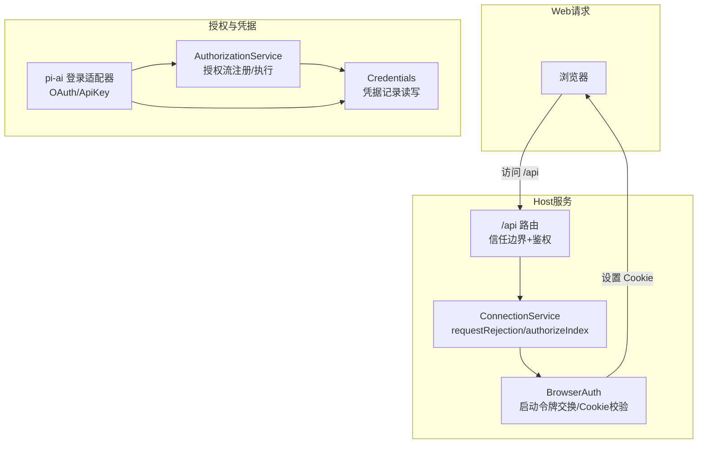
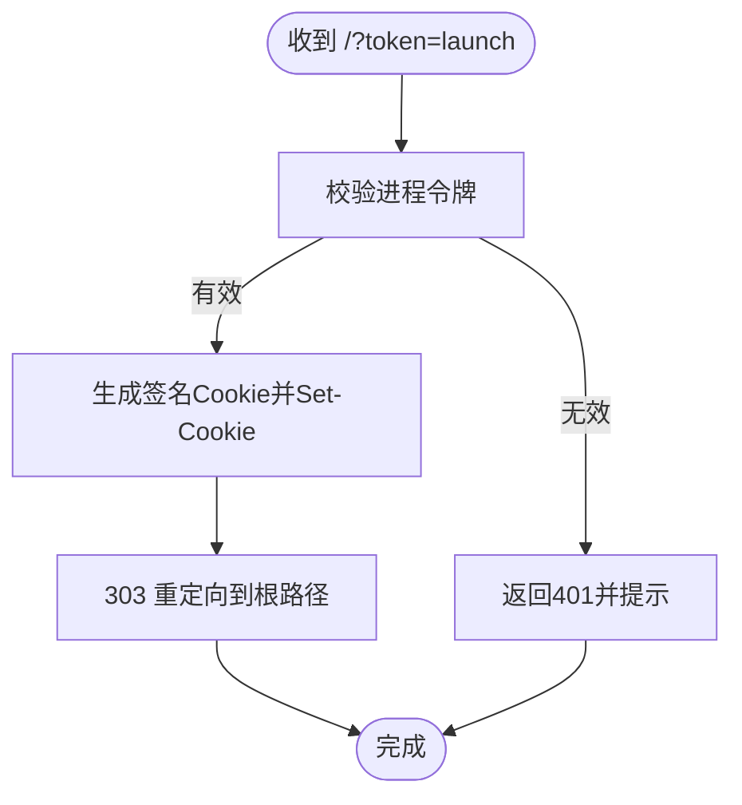
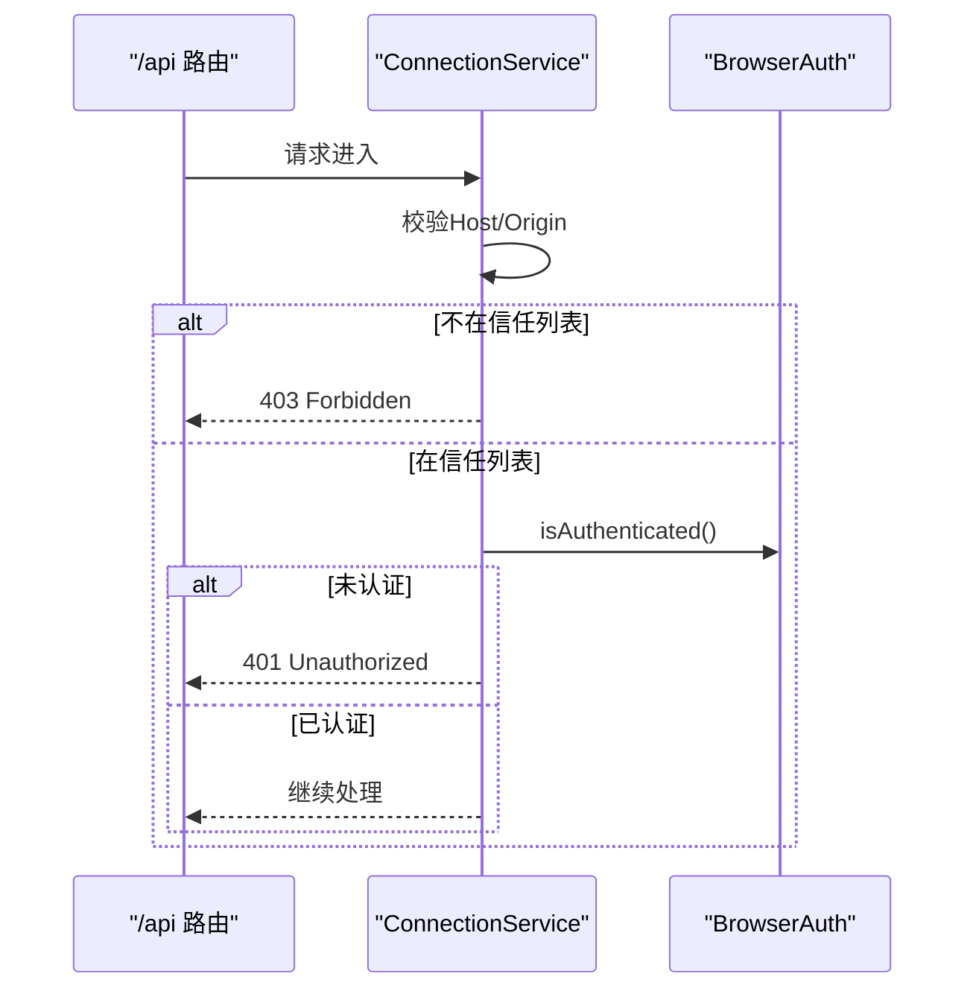
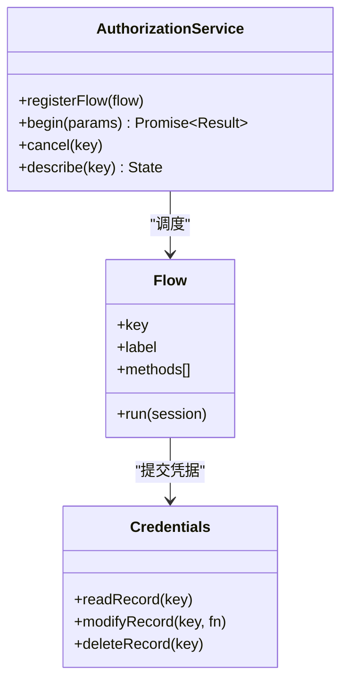
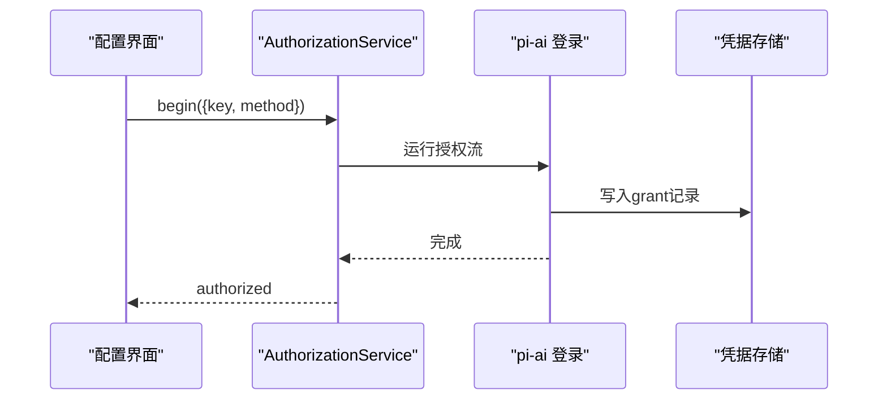
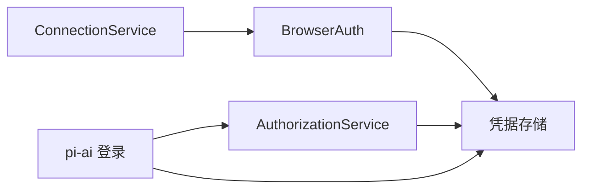

# 认证授权API

<cite>
**本文引用的文件**
- [packages/client/connection/src/index.ts](file://packages/client/connection/src/index.ts)
- [packages/client/connection/src/rpc-host.ts](file://packages/client/connection/src/rpc-host.ts)
- [packages/client/connection/src/api-path.ts](file://packages/client/connection/src/api-path.ts)
- [packages/client/connection/tests/browser-auth.host.spec.ts](file://packages/client/connection/tests/browser-auth.host.spec.ts)
- [packages/client/connection/tests/node-half.host.spec.ts](file://packages/client/connection/tests/node-half.host.spec.ts)
- [packages/credentials/authorization/src/index.ts](file://packages/credentials/authorization/src/index.ts)
- [packages/credentials/authorization/tests/authorization.spec.ts](file://packages/credentials/authorization/tests/authorization.spec.ts)
- [packages/llm/llm-pi-ai/src/login.ts](file://packages/llm/llm-pi-ai/src/login.ts)
- [packages/llm/llm-pi-ai/src/auth.ts](file://packages/llm/llm-pi-ai/src/auth.ts)
- [packages/llm/llm-pi-ai/src/provider.ts](file://packages/llm/llm-pi-ai/src/provider.ts)
- [packages/llm/llm-pi-ai/tests/catalog.spec.ts](file://packages/llm/llm-pi-ai/tests/catalog.spec.ts)
- [.agents/notes/implemented/architecture/2026-08-24-browser-token-authentication.zh.md](file://.agents/notes/implemented/architecture/2026-08-24-browser-token-authentication.zh.md)
</cite>

## 目录
1. [简介](#简介)
2. [项目结构](#项目结构)
3. [核心组件](#核心组件)
4. [架构总览](#架构总览)
5. [详细组件分析](#详细组件分析)
6. [依赖关系分析](#依赖关系分析)
7. [性能与安全考量](#性能与安全考量)
8. [故障排查指南](#故障排查指南)
9. [结论](#结论)
10. [附录：API端点与示例](#附录api端点与示例)

## 简介
本文件面向DeepSeek Harness的认证与授权能力，聚焦浏览器到Host的认证流程、凭据管理、会话与令牌机制，以及与第三方提供商（如OAuth）的集成方式。需要特别说明的是：仓库中并未实现通用的REST /api/auth/*端点（如POST /api/auth/login或POST /api/auth/token/refresh）。实际的认证入口是浏览器通过进程内生成的“启动令牌”进行一次性交换，随后获得一个与主机绑定的持久Cookie；所有后续对/api前缀的请求均基于该Cookie完成鉴权。对于第三方登录（OAuth等），Harness通过“授权流”抽象与凭据记录存储协同工作，由具体插件（如pi-ai）注册并驱动交互。

## 项目结构
与认证授权直接相关的代码主要分布在以下模块：
- 客户端连接与服务端路由：负责挂载/api前缀、信任边界校验、浏览器认证与会话建立
- 授权服务：提供统一的授权流注册、执行、取消与结果回调
- 凭据存储与第三方登录适配：将第三方OAuth/密钥等凭据写入统一记录格式，供上层使用
- 测试用例：覆盖浏览器令牌交换、Cookie验证、重放保护、过期与撤销等行为



图表来源
- [packages/client/connection/src/index.ts:93-121](file://packages/client/connection/src/index.ts#L93-L121)
- [packages/client/connection/src/rpc-host.ts:88-110](file://packages/client/connection/src/rpc-host.ts#L88-L110)
- [packages/credentials/authorization/src/index.ts:1-31](file://packages/credentials/authorization/src/index.ts#L1-L31)
- [packages/llm/llm-pi-ai/src/login.ts:111-133](file://packages/llm/llm-pi-ai/src/login.ts#L111-L133)

章节来源
- [packages/client/connection/src/index.ts:93-121](file://packages/client/connection/src/index.ts#L93-L121)
- [packages/client/connection/src/rpc-host.ts:88-110](file://packages/client/connection/src/rpc-host.ts#L88-L110)
- [packages/client/connection/src/api-path.ts:1-7](file://packages/client/connection/src/api-path.ts#L1-L7)

## 核心组件
- 浏览器认证（BrowserAuth）
  - 生成一次性进程令牌，引导浏览器打开带token的URL
  - 在index页面请求时交换为与主机绑定的持久Cookie
  - 校验Cookie签名、有效期、签发时间、主机域绑定，拒绝篡改与过期
- 连接服务（ConnectionService）
  - 在/api前缀上统一拦截请求，先做Host/Origin信任检查，再做浏览器认证
  - 未通过返回401/403，通过后桥接到实际处理器
- 授权服务（AuthorizationService）
  - 提供统一的授权流注册与执行接口，支持多方法（如OAuth、API Key）
  - 处理并发尝试、取消、失败与已提交凭据确认
- 第三方登录适配（以pi-ai为例）
  - 注册授权流，驱动用户完成OAuth或粘贴API Key
  - 将最终凭据写入统一凭据记录，供模型调用链解析

章节来源
- [packages/client/connection/tests/browser-auth.host.spec.ts:93-168](file://packages/client/connection/tests/browser-auth.host.spec.ts#L93-L168)
- [packages/client/connection/src/rpc-host.ts:96-110](file://packages/client/connection/src/rpc-host.ts#L96-L110)
- [packages/credentials/authorization/src/index.ts:1-31](file://packages/credentials/authorization/src/index.ts#L1-L31)
- [packages/llm/llm-pi-ai/src/login.ts:111-133](file://packages/llm/llm-pi-ai/src/login.ts#L111-L133)

## 架构总览
下图展示了从浏览器发起/api请求到最终被允许或拒绝的完整链路，以及第三方登录如何把凭据写入统一存储。

```mermaid
sequenceDiagram
participant U as "浏览器"
participant H as "Host /api 路由"
participant C as "ConnectionService"
participant A as "BrowserAuth"
participant Z as "AuthorizationService"
participant P as "pi-ai 登录适配器"
participant S as "凭据存储"
U->>H : GET /api/...
H->>C : 进入网关
C->>C : 校验Host/Origin信任
C->>A : isAuthenticated()
alt 未认证
A-->>U : 401 + 提示重新打开带token的URL
else 已认证
C-->>U : 转发至下游处理器
end
Note over U,A : 首次访问需通过进程令牌交换Cookie
U->>A : GET /?token=launch
A-->>U : 303 重定向 + Set-Cookie(绑定主机)
U->>H : 携带Cookie再次请求/api
H->>C->>A : 校验Cookie成功
C-->>U : 放行
Note over Z,P,S : 第三方登录流程
U->>Z : begin({key, method})
Z->>P : 运行授权流(OAuth/ApiKey)
P->>S : 写入凭据记录(grant)
Z-->>U : authorized/cancelled/failed
```

图表来源
- [packages/client/connection/src/index.ts:93-121](file://packages/client/connection/src/index.ts#L93-L121)
- [packages/client/connection/src/rpc-host.ts:96-110](file://packages/client/connection/src/rpc-host.ts#L96-L110)
- [packages/client/connection/tests/browser-auth.host.spec.ts:93-168](file://packages/client/connection/tests/browser-auth.host.spec.ts#L93-L168)
- [packages/credentials/authorization/tests/authorization.spec.ts:108-192](file://packages/credentials/authorization/tests/authorization.spec.ts#L108-L192)
- [packages/llm/llm-pi-ai/src/login.ts:111-133](file://packages/llm/llm-pi-ai/src/login.ts#L111-L133)

## 详细组件分析

### 浏览器令牌与Cookie认证（BrowserAuth）
- 启动令牌与重定向
  - 服务端生成一次性进程令牌，构造带token的URL供浏览器打开
  - 浏览器访问该URL后，服务端返回303重定向并设置Set-Cookie
- Cookie校验规则
  - 必须包含有效签名、正确版本、签发时间与过期时间
  - 必须与当前主机一致（Authority绑定）
  - 超过最大存活天数或系统时间异常将被拒绝
- 撤销与轮换
  - 删除凭据记录后，下一次激活会生成新密钥，旧Cookie失效
  - 重启进程会轮换启动令牌，旧launch URL不可复用



图表来源
- [packages/client/connection/tests/browser-auth.host.spec.ts:93-168](file://packages/client/connection/tests/browser-auth.host.spec.ts#L93-L168)
- [packages/client/connection/tests/browser-auth.host.spec.ts:170-228](file://packages/client/connection/tests/browser-auth.host.spec.ts#L170-L228)

章节来源
- [packages/client/connection/tests/browser-auth.host.spec.ts:93-168](file://packages/client/connection/tests/browser-auth.host.spec.ts#L93-L168)
- [packages/client/connection/tests/browser-auth.host.spec.ts:170-228](file://packages/client/connection/tests/browser-auth.host.spec.ts#L170-L228)
- [.agents/notes/implemented/architecture/2026-08-24-browser-token-authentication.zh.md:33-43](file://.agents/notes/implemented/architecture/2026-08-24-browser-token-authentication.zh.md#L33-L43)

### 连接网关与信任边界（ConnectionService）
- 统一在/api前缀上拦截请求
- 先校验Host/Origin是否在可信列表，否则返回403
- 再调用BrowserAuth进行认证，未通过返回401
- 通过后桥接到具体处理器



图表来源
- [packages/client/connection/src/index.ts:93-121](file://packages/client/connection/src/index.ts#L93-L121)
- [packages/client/connection/src/rpc-host.ts:96-110](file://packages/client/connection/src/rpc-host.ts#L96-L110)

章节来源
- [packages/client/connection/src/index.ts:93-121](file://packages/client/connection/src/index.ts#L93-L121)
- [packages/client/connection/src/rpc-host.ts:96-110](file://packages/client/connection/src/rpc-host.ts#L96-L110)
- [packages/client/connection/tests/node-half.host.spec.ts:181-195](file://packages/client/connection/tests/node-half.host.spec.ts#L181-L195)

### 授权流与凭据记录（AuthorizationService + Credentials）
- 授权流注册
  - 每个提供方（如pi-ai）可注册一个或多个方法（OAuth、API Key）
  - begin()启动流程，支持指定方法或默认首个方法
- 并发与取消
  - 同一key同时只能有一个attempt在运行
  - 支持AbortSignal或cancel()中断进行中流程
- 凭据提交与确认
  - 流程必须提交对应key的凭据记录，否则视为失败
  - 若流程删除了记录或提交了其他key的记录，会被拒绝
- 事件与状态
  - settled事件广播authorized/cancelled/failed
  - describe()可查询inFlight状态



图表来源
- [packages/credentials/authorization/src/index.ts:1-31](file://packages/credentials/authorization/src/index.ts#L1-L31)
- [packages/credentials/authorization/tests/authorization.spec.ts:59-106](file://packages/credentials/authorization/tests/authorization.spec.ts#L59-L106)
- [packages/credentials/authorization/tests/authorization.spec.ts:108-192](file://packages/credentials/authorization/tests/authorization.spec.ts#L108-L192)
- [packages/credentials/authorization/tests/authorization.spec.ts:281-345](file://packages/credentials/authorization/tests/authorization.spec.ts#L281-L345)

章节来源
- [packages/credentials/authorization/tests/authorization.spec.ts:59-106](file://packages/credentials/authorization/tests/authorization.spec.ts#L59-L106)
- [packages/credentials/authorization/tests/authorization.spec.ts:108-192](file://packages/credentials/authorization/tests/authorization.spec.ts#L108-L192)
- [packages/credentials/authorization/tests/authorization.spec.ts:281-345](file://packages/credentials/authorization/tests/authorization.spec.ts#L281-L345)

### 第三方登录与OAuth集成（以pi-ai为例）
- 登录方法注册
  - 插件安装时自动注册各提供方的登录方法（OAuth、API Key等）
- 凭据解析与注入
  - 通过harnessApiKeyAuth为声明了apiKey方法的提供方注入请求级密钥
  - OAuth-only提供方若无apiKey方法，则保持原行为，由协议层决定是否要求密钥
- 与授权流协作
  - pi-ai通过credentialStoreFrom桥接到Harness凭据记录
  - 登录完成后，凭据记录可用于后续模型调用



图表来源
- [packages/llm/llm-pi-ai/src/login.ts:111-133](file://packages/llm/llm-pi-ai/src/login.ts#L111-L133)
- [packages/llm/llm-pi-ai/src/auth.ts:124-151](file://packages/llm/llm-pi-ai/src/auth.ts#L124-L151)
- [packages/llm/llm-pi-ai/src/provider.ts:53-85](file://packages/llm/llm-pi-ai/src/provider.ts#L53-L85)
- [packages/llm/llm-pi-ai/tests/catalog.spec.ts:565-587](file://packages/llm/llm-pi-ai/tests/catalog.spec.ts#L565-L587)

章节来源
- [packages/llm/llm-pi-ai/src/login.ts:111-133](file://packages/llm/llm-pi-ai/src/login.ts#L111-L133)
- [packages/llm/llm-pi-ai/src/auth.ts:124-151](file://packages/llm/llm-pi-ai/src/auth.ts#L124-L151)
- [packages/llm/llm-pi-ai/src/provider.ts:53-85](file://packages/llm/llm-pi-ai/src/provider.ts#L53-L85)
- [packages/llm/llm-pi-ai/tests/catalog.spec.ts:565-587](file://packages/llm/llm-pi-ai/tests/catalog.spec.ts#L565-L587)

## 依赖关系分析
- BrowserAuth依赖凭据存储中的签名密钥，用于Cookie签名与校验
- ConnectionService依赖BrowserAuth与可信主机列表，形成网关式鉴权
- AuthorizationService依赖凭据存储，协调第三方登录适配器完成凭据写入
- pi-ai适配器依赖AuthorizationService与凭据存储，将OAuth/ApiKey转换为统一记录



图表来源
- [packages/client/connection/src/index.ts:93-121](file://packages/client/connection/src/index.ts#L93-L121)
- [packages/credentials/authorization/src/index.ts:1-31](file://packages/credentials/authorization/src/index.ts#L1-L31)
- [packages/llm/llm-pi-ai/src/auth.ts:124-151](file://packages/llm/llm-pi-ai/src/auth.ts#L124-L151)

章节来源
- [packages/client/connection/src/index.ts:93-121](file://packages/client/connection/src/index.ts#L93-L121)
- [packages/credentials/authorization/src/index.ts:1-31](file://packages/credentials/authorization/src/index.ts#L1-L31)
- [packages/llm/llm-pi-ai/src/auth.ts:124-151](file://packages/llm/llm-pi-ai/src/auth.ts#L124-L151)

## 性能与安全考量
- 性能
  - Cookie校验为本地签名验证，开销低
  - 授权流可能涉及网络往返（OAuth），应合理设置超时与重试策略
- 安全
  - 启动令牌仅一次有效，避免重放
  - Cookie绑定主机域，防止跨站重用
  - 每次激活轮换签名密钥，降低泄露风险
  - 信任边界（Host/Origin）前置拦截，减少非法请求到达后端
- 审计
  - 当前仓库未提供统一的认证审计日志实现；建议在网关层记录关键事件（认证成功/失败、Cookie刷新、授权流开始/结束）

[本节为通用指导，不直接分析具体文件]

## 故障排查指南
- 401 Unauthorized
  - 未携带Cookie或Cookie无效（签名错误、过期、主机不匹配）
  - 未通过Host/Origin信任检查（应为403，但部分场景可能表现为401）
- 403 Forbidden
  - Host/Origin不在可信列表
- 授权流失败
  - 未提交凭据记录、删除了记录或提交了错误的key
  - 用户取消或拒绝输入
- OAuth相关
  - 仅OAuth提供方未配置apiKey时，按提供方协议拒绝
  - 凭据记录不存在或格式不支持会导致创建失败

章节来源
- [packages/client/connection/tests/node-half.host.spec.ts:181-195](file://packages/client/connection/tests/node-half.host.spec.ts#L181-L195)
- [packages/client/connection/tests/browser-auth.host.spec.ts:170-228](file://packages/client/connection/tests/browser-auth.host.spec.ts#L170-L228)
- [packages/credentials/authorization/tests/authorization.spec.ts:281-345](file://packages/credentials/authorization/tests/authorization.spec.ts#L281-L345)
- [packages/llm/llm-pi-ai/tests/catalog.spec.ts:565-587](file://packages/llm/llm-pi-ai/tests/catalog.spec.ts#L565-L587)

## 结论
DeepSeek Harness采用“进程令牌→Cookie”的浏览器认证模式，结合网关信任边界与统一的授权流框架，实现了安全、可扩展的身份与权限管理。对于第三方登录，通过插件化授权流将OAuth/API Key等凭据标准化写入统一记录，便于上层服务消费。当前仓库未提供通用REST /api/auth/*端点，认证入口集中在浏览器令牌交换与授权流调用。建议在生产环境中补充审计日志与更细粒度的访问控制策略。

[本节为总结性内容，不直接分析具体文件]

## 附录：API端点与示例

说明
- 本项目未实现通用REST /api/auth/login或/api/auth/token/refresh端点。认证入口为浏览器通过进程令牌交换Cookie，随后所有/api请求基于Cookie鉴权。
- 第三方登录通过AuthorizationService.begin触发，由具体插件（如pi-ai）实现。

常用端点与行为
- GET /?token=launch
  - 作用：用一次性进程令牌换取绑定主机的持久Cookie
  - 响应：303重定向，Set-Cookie包含签名、有效期与主机绑定信息
  - 参考：[packages/client/connection/tests/browser-auth.host.spec.ts:93-168](file://packages/client/connection/tests/browser-auth.host.spec.ts#L93-L168)
- 任意 /api/* 请求
  - 鉴权：先校验Host/Origin，再校验Cookie；未通过返回401/403
  - 参考：[packages/client/connection/src/index.ts:93-121](file://packages/client/connection/src/index.ts#L93-L121)、[packages/client/connection/src/rpc-host.ts:96-110](file://packages/client/connection/src/rpc-host.ts#L96-L110)

第三方登录（OAuth/API Key）
- 调用方式：AuthorizationService.begin({ key, method?, interaction })
- 行为：运行注册的授权流，最终写入凭据记录；返回authorized/cancelled/failed
- 参考：[packages/credentials/authorization/tests/authorization.spec.ts:108-192](file://packages/credentials/authorization/tests/authorization.spec.ts#L108-L192)、[packages/llm/llm-pi-ai/src/login.ts:111-133](file://packages/llm/llm-pi-ai/src/login.ts#L111-L133)

请求/响应示例（概念性）
- 启动令牌交换
  - 请求：GET http://127.0.0.1:3080/?token=launch
  - 响应：303 Location:/，Set-Cookie: harness_auth=v1.<payload>.<sig>; Max-Age=2592000; Path=/; HttpOnly; SameSite=Strict
  - 参考：[packages/client/connection/tests/browser-auth.host.spec.ts:93-168](file://packages/client/connection/tests/browser-auth.host.spec.ts#L93-L168)
- 后续/api请求
  - 请求：GET http://127.0.0.1:3080/api/sessions
    头：Cookie: harness_auth=...
  - 响应：200 或 401/403（未认证/非信任主机）
  - 参考：[packages/client/connection/src/index.ts:93-121](file://packages/client/connection/src/index.ts#L93-L121)

角色权限与细粒度访问控制
- 当前仓库未暴露基于角色的HTTP端点；权限控制主要通过Host/Origin信任与Cookie认证实现
- 如需细粒度控制，可在网关层扩展策略（例如基于用户标识或会话上下文）

会话管理与安全策略
- 会话：以Cookie作为会话载体，绑定主机域，具备签名与有效期
- 撤销：删除凭据记录或重启进程可撤销既有会话
- 安全：启动令牌一次性、Cookie签名校验、主机绑定、信任边界前置

OAuth集成与单点登录
- OAuth：通过pi-ai等插件的授权流完成，凭据写入统一记录
- SSO：可通过外部身份源对接AuthorizationService，将SSO结果转为凭据记录

[本节为概念性说明，引用了具体文件以支撑行为描述]