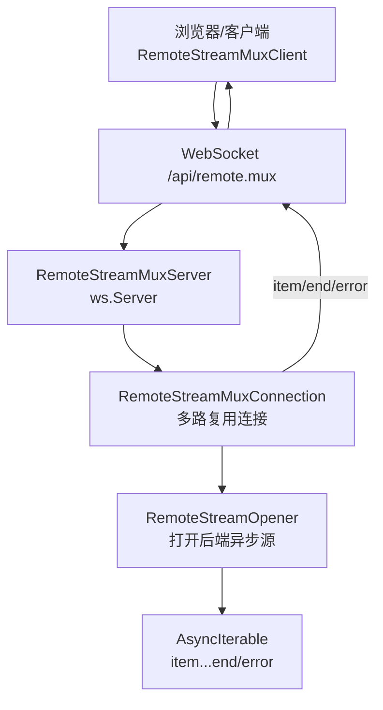
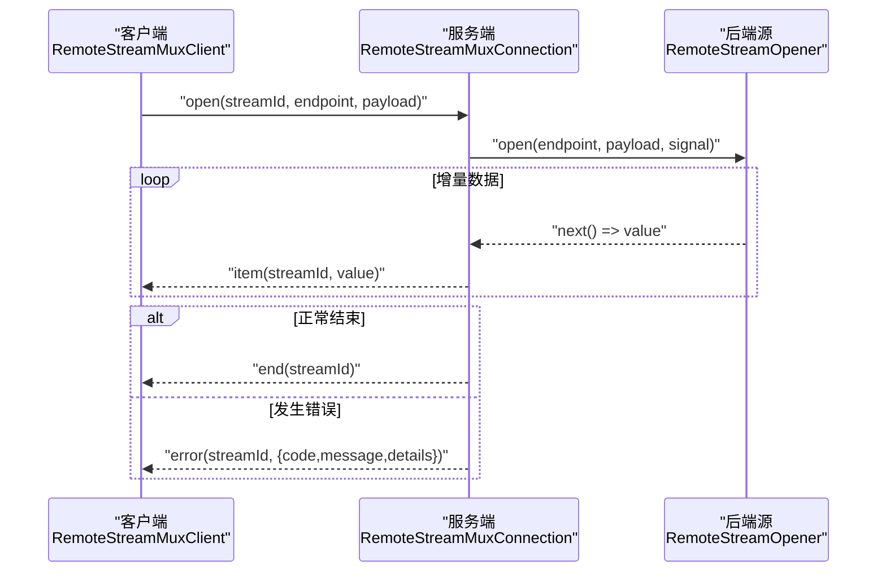
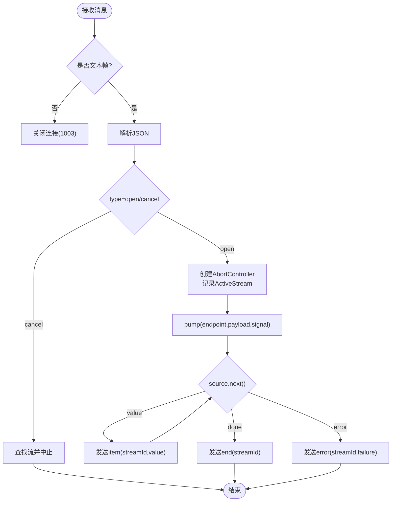
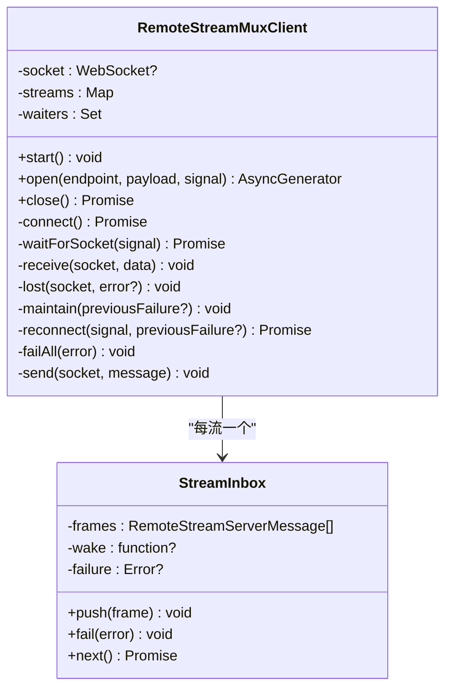
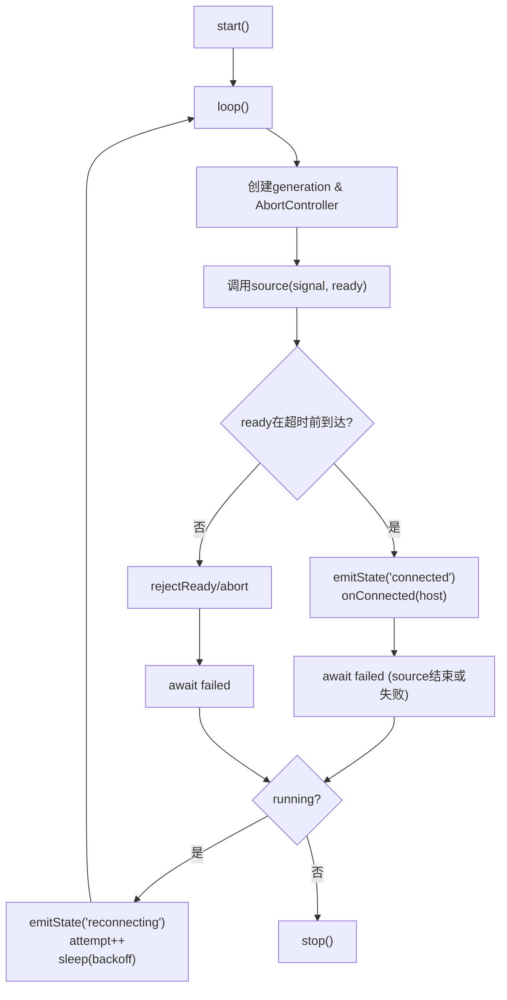
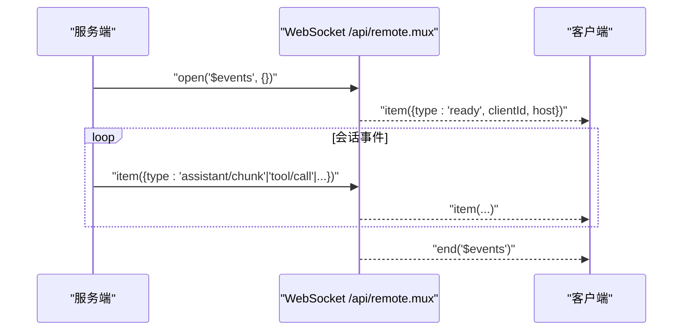
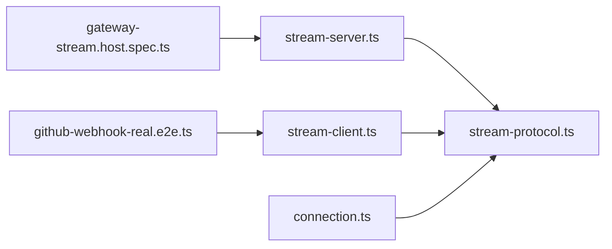

# WebSocket实时通信

<cite>
**本文引用的文件**
- [packages/api/gateway/src/stream-server.ts](file://packages/api/gateway/src/stream-server.ts)
- [packages/api/gateway/src/stream-protocol.ts](file://packages/api/gateway/src/stream-protocol.ts)
- [packages/api/gateway/src/client/stream-client.ts](file://packages/api/gateway/src/client/stream-client.ts)
- [packages/client/connection/src/client/connection.ts](file://packages/client/connection/src/client/connection.ts)
- [apps/cli/tests/github-webhook-real.e2e.ts](file://apps/cli/tests/github-webhook-real.e2e.ts)
- [packages/api/gateway/tests/gateway-stream.host.spec.ts](file://packages/api/gateway/tests/gateway-stream.host.spec.ts)
- [docs/subsystems/session.md](file://docs/subsystems/session.md)
</cite>

## 目录
1. [简介](#简介)
2. [项目结构](#项目结构)
3. [核心组件](#核心组件)
4. [架构总览](#架构总览)
5. [详细组件分析](#详细组件分析)
6. [依赖关系分析](#依赖关系分析)
7. [性能考量](#性能考量)
8. [故障排查指南](#故障排查指南)
9. [结论](#结论)
10. [附录：客户端集成示例与最佳实践](#附录客户端集成示例与最佳实践)

## 简介
本文件面向实时应用开发者，系统化说明 DeepSeek Harness 的 WebSocket 实时通信能力。内容涵盖连接建立、消息格式、事件类型、会话事件流、增量数据传输、流式响应处理、连接生命周期管理（连接管理、错误重试、心跳检测）、以及客户端连接示例、事件监听模式、数据同步机制和性能优化建议。目标是提供一份可直接落地的 WebSocket 集成指南。

## 项目结构
DeepSeek Harness 的 WebSocket 实时通信由网关层（服务端）与客户端库共同实现，并通过统一的协议定义进行解耦：
- 服务端：基于 ws 的 WebSocketServer，负责 HTTP Upgrade、多路复用逻辑流、心跳 Ping、错误映射与终止。
- 客户端：维护一个持久物理连接，按逻辑流（streamId）区分多个并发流，支持自动重连与指数退避。
- 协议：严格校验的 JSON 文本帧，包含 open/cancel/item/end/error 等消息类型。
- 上层事件：通过内部端点 $events 转发 Cordis 会话事件，供前端订阅。

图表来源
- [packages/api/gateway/src/stream-server.ts:23-79](file://packages/api/gateway/src/stream-server.ts#L23-L79)
- [packages/api/gateway/src/stream-protocol.ts:242-313](file://packages/api/gateway/src/stream-protocol.ts#L242-L313)
- [packages/api/gateway/src/client/stream-client.ts:53-119](file://packages/api/gateway/src/client/stream-client.ts#L53-L119)

章节来源
- [packages/api/gateway/src/stream-server.ts:23-79](file://packages/api/gateway/src/stream-server.ts#L23-L79)
- [packages/api/gateway/src/stream-protocol.ts:242-313](file://packages/api/gateway/src/stream-protocol.ts#L242-L313)
- [packages/api/gateway/src/client/stream-client.ts:53-119](file://packages/api/gateway/src/client/stream-client.ts#L53-L119)

## 核心组件
- RemoteStreamMuxServer（服务端）
  - 持有 ws 服务器实例，处理 HTTP Upgrade，启动心跳定时器，为每个连接创建 RemoteStreamMuxConnection。
  - 对二进制帧拒绝并关闭连接；对无效请求返回特定状态码。
- RemoteStreamMuxConnection（服务端）
  - 解析客户端消息，维护活跃逻辑流 Map，调用 RemoteStreamOpener 获取数据源，将 item 逐条推送，结束时发送 end，异常时发送 error。
  - 保证写顺序串行化，避免竞态。
- RemoteStreamMuxClient（客户端）
  - 维护单一物理 WebSocket，支持多逻辑流并发；open 返回 AsyncGenerator 消费 item，遇到 error 抛出结构化错误，收到 end 结束迭代。
  - 内置指数退避重连、失败传播、取消传播。
- ConnectionController（通用连接控制器）
  - 封装“生成源”的启动、就绪等待、状态切换（connected/reconnecting）、指数退避重试、超时控制。
- 协议 stream-protocol.ts
  - 定义远程流消息类型、校验器、端点常量、事件相关类型与工具函数。

章节来源
- [packages/api/gateway/src/stream-server.ts:23-184](file://packages/api/gateway/src/stream-server.ts#L23-L184)
- [packages/api/gateway/src/client/stream-client.ts:53-349](file://packages/api/gateway/src/client/stream-client.ts#L53-L349)
- [packages/client/connection/src/client/connection.ts:1-243](file://packages/client/connection/src/client/connection.ts#L1-L243)
- [packages/api/gateway/src/stream-protocol.ts:1-408](file://packages/api/gateway/src/stream-protocol.ts#L1-L408)

## 架构总览
下图展示了从客户端发起逻辑流到服务端推送数据的完整时序，包括开流、增量项、结束或错误分支。

图表来源
- [packages/api/gateway/src/stream-server.ts:118-162](file://packages/api/gateway/src/stream-server.ts#L118-L162)
- [packages/api/gateway/src/client/stream-client.ts:78-119](file://packages/api/gateway/src/client/stream-client.ts#L78-L119)
- [packages/api/gateway/src/stream-protocol.ts:242-313](file://packages/api/gateway/src/stream-protocol.ts#L242-L313)

## 详细组件分析

### 服务端：RemoteStreamMuxServer 与 RemoteStreamMuxConnection
- 升级与心跳
  - handleUpgrade 接收受信任的 HTTP Upgrade，启动心跳定时器，周期向所有 OPEN 状态的 socket 发送 Ping。
  - close 清理定时器、终止所有 socket、等待连接完成。
- 消息处理
  - 仅接受文本帧，否则以 1003 关闭。
  - 解析客户端消息：open 创建新流，cancel 中止对应流，重复 streamId 报错。
  - pump 循环读取后端源，逐项发送 item；正常结束发送 end；异常发送 error。
  - 写队列串行化，确保帧顺序稳定。
- 资源清理
  - 连接关闭时中止所有活跃流的 AbortController，并等待其 done Promise 完成。

图表来源
- [packages/api/gateway/src/stream-server.ts:96-184](file://packages/api/gateway/src/stream-server.ts#L96-L184)

章节来源
- [packages/api/gateway/src/stream-server.ts:23-184](file://packages/api/gateway/src/stream-server.ts#L23-L184)

### 客户端：RemoteStreamMuxClient
- 连接维护
  - start 启动 keepAlive 任务，维持物理连接；多次调用幂等。
  - connect 建立 WebSocket，注册 open/error/message/close 事件；失败时触发 lost 进入重连流程。
  - maintain/reconnect 实现指数退避重连，带随机抖动与最大延迟上限。
- 逻辑流
  - open(endpoint, payload, signal) 分配 streamId，发送 open 帧，阻塞等待 item/end/error。
  - 收到 item 则 yield；收到 error 抛出 RemoteStreamError；收到 end 结束迭代。
  - 流提前取消时发送 cancel 帧。
- 错误传播
  - 非法帧导致 failAll 并关闭连接；所有活跃流被标记失败。

图表来源
- [packages/api/gateway/src/client/stream-client.ts:53-349](file://packages/api/gateway/src/client/stream-client.ts#L53-L349)

章节来源
- [packages/api/gateway/src/client/stream-client.ts:53-349](file://packages/api/gateway/src/client/stream-client.ts#L53-L349)

### 连接控制器：ConnectionController
- 职责
  - 管理“生成源”的生命周期：启动、就绪等待、失败重试、状态上报。
  - 指数退避：backoffBaseMs/backoffFactor/backoffMaxMs，带随机抖动。
  - 状态去重：仅在 connected/reconnecting 之间切换时通知。
- 关键流程
  - loop 中创建 AbortController，调用 source(signal, ready)。
  - 使用 Promise.race 等待 ready 或 sourceLost，超时则失败。
  - 成功后 onConnected 回调；失败后 onStateChange('reconnecting') 并重试。

图表来源
- [packages/client/connection/src/client/connection.ts:78-243](file://packages/client/connection/src/client/connection.ts#L78-L243)

章节来源
- [packages/client/connection/src/client/connection.ts:1-243](file://packages/client/connection/src/client/connection.ts#L1-L243)

### 协议与消息格式
- 路由
  - REMOTE_STREAM_MUX_PATH = "/api/remote.mux"
- 客户端消息
  - open{ type:'open', streamId, endpoint, payload }
  - cancel{ type:'cancel', streamId }
- 服务端消息
  - item{ type:'item', streamId, value? }
  - end{ type:'end', streamId }
  - error{ type:'error', streamId, error:{ code,message,details } }
- 事件流端点
  - $events：用于转发 Cordis 会话事件，首个 item 为 ready{ type:'ready', clientId, host }
  - $events/result：HTTP RPC 回传客户端对 waterfall 的处理结果

章节来源
- [packages/api/gateway/src/stream-protocol.ts:1-408](file://packages/api/gateway/src/stream-protocol.ts#L1-L408)

### 会话事件流与增量传输
- 会话事件模型
  - SessionEventMap 定义了 turn/start、turn/end、step/start、step/end、user/message、assistant/chunk、assistant/message、tool/call、tool/result、request/header、request/context、session/end-seed 等事件。
  - assistant/chunk 提供 token 级增量片段，保证回放保真；assistant/message 提供组装后的消息及 usage。
- 增量传输
  - 通过 $events 流将上述事件以 item 形式推送到客户端；客户端可订阅并按需渲染。
  - 序列号连续且无丢失，便于持久化与回放。

图表来源
- [packages/api/gateway/src/stream-protocol.ts:8-19](file://packages/api/gateway/src/stream-protocol.ts#L8-L19)
- [docs/subsystems/session.md:20-132](file://docs/subsystems/session.md#L20-L132)

章节来源
- [docs/subsystems/session.md:20-132](file://docs/subsystems/session.md#L20-L132)
- [packages/api/gateway/src/stream-protocol.ts:8-19](file://packages/api/gateway/src/stream-protocol.ts#L8-L19)

## 依赖关系分析
- 服务端依赖
  - ws 库的 WebSocketServer 与 WebSocket。
  - 协议模块 stream-protocol.ts 提供消息解析与校验。
- 客户端依赖
  - 协议模块 stream-protocol.ts 提供消息构造与解析。
  - 连接控制器 connection.ts 提供通用重连与状态管理。
- 测试与示例
  - e2e 用例演示了真实环境下的连接、消息收发与结束处理。
  - 主机侧测试验证了心跳间隔、错误映射、关闭行为等。

图表来源
- [packages/api/gateway/src/stream-server.ts:1-209](file://packages/api/gateway/src/stream-server.ts#L1-L209)
- [packages/api/gateway/src/stream-protocol.ts:1-408](file://packages/api/gateway/src/stream-protocol.ts#L1-L408)
- [packages/api/gateway/src/client/stream-client.ts:1-349](file://packages/api/gateway/src/client/stream-client.ts#L1-L349)
- [packages/client/connection/src/client/connection.ts:1-243](file://packages/client/connection/src/client/connection.ts#L1-L243)
- [packages/api/gateway/tests/gateway-stream.host.spec.ts:180-218](file://packages/api/gateway/tests/gateway-stream.host.spec.ts#L180-L218)
- [apps/cli/tests/github-webhook-real.e2e.ts:172-225](file://apps/cli/tests/github-webhook-real.e2e.ts#L172-L225)

章节来源
- [packages/api/gateway/tests/gateway-stream.host.spec.ts:180-218](file://packages/api/gateway/tests/gateway-stream.host.spec.ts#L180-L218)
- [apps/cli/tests/github-webhook-real.e2e.ts:172-225](file://apps/cli/tests/github-webhook-real.e2e.ts#L172-L225)

## 性能考量
- 心跳检测
  - 服务端周期性 Ping 空闲连接，及时释放僵尸连接，降低资源占用。
- 背压与序列化
  - 服务端写队列串行化，避免并发写导致的帧交错。
  - 客户端使用 AsyncGenerator 消费流，天然具备背压能力。
- 重连策略
  - 指数退避+随机抖动，避免雪崩；最大延迟上限保护系统稳定性。
- 内存与缓冲
  - 服务端不缓存大量数据，直接透传 item；客户端按需消费，避免堆积。
- 压缩与分片
  - 会话持久化层支持 zstd 压缩与分块，减少网络与存储开销（适用于离线回放场景）。

[本节为通用性能指导，不直接分析具体文件]

## 故障排查指南
- 连接建立失败
  - 检查 Upgrade 路径是否正确（/api/remote.mux），认证是否通过。
  - 客户端日志关注 RemoteStreamCarrierError 与重连次数。
- 消息格式错误
  - 服务端会关闭连接并返回 1008/1003；客户端收到非法帧会触发 failAll。
  - 核对 streamId 唯一性，endpoint 非空，payload 可 JSON 序列化。
- 流未结束
  - 确认服务端是否正常发送 end；若异常，检查后端源是否抛错并被映射为 error。
- 心跳与断开
  - 长时间无 Ping 可能表示代理或防火墙丢弃控制帧；调整心跳间隔或启用中间件保活。
- 事件流订阅
  - 首次 item 应为 ready；若缺失，检查 $events 端点配置与鉴权。

章节来源
- [packages/api/gateway/src/stream-server.ts:96-184](file://packages/api/gateway/src/stream-server.ts#L96-L184)
- [packages/api/gateway/src/client/stream-client.ts:221-245](file://packages/api/gateway/src/client/stream-client.ts#L221-L245)
- [packages/api/gateway/src/stream-protocol.ts:265-313](file://packages/api/gateway/src/stream-protocol.ts#L265-L313)

## 结论
DeepSeek Harness 的 WebSocket 实时通信采用“单物理连接 + 多逻辑流”的多路复用设计，配合严格的协议校验、稳定的心跳与指数退避重连，提供了高可靠、可扩展的实时数据通道。结合 $events 会话事件流，可实现 token 级增量渲染与完整的会话回放。对于实时应用开发者，建议优先使用 RemoteStreamMuxClient 提供的 open API 与 ConnectionController 的重连能力，并在业务层做好取消、错误与背压处理。

[本节为总结性内容，不直接分析具体文件]

## 附录：客户端集成示例与最佳实践

### 连接建立与事件监听
- 使用 RemoteStreamMuxClient.open 打开逻辑流，传入 endpoint 与 payload，并携带 AbortSignal 以便取消。
- 遍历 AsyncGenerator 消费 item，捕获 error 并处理，收到 end 后结束。
- 对 $events 端点，先等待 ready 帧，再订阅后续事件。

章节来源
- [packages/api/gateway/src/client/stream-client.ts:78-119](file://packages/api/gateway/src/client/stream-client.ts#L78-L119)
- [packages/api/gateway/src/stream-protocol.ts:8-19](file://packages/api/gateway/src/stream-protocol.ts#L8-L19)

### 数据同步机制
- 会话事件具有连续 seq，客户端可按 seq 合并增量，保证最终一致性。
- 对于 assistant/chunk 等细粒度增量，建议在前端做增量拼接与防抖渲染。

章节来源
- [docs/subsystems/session.md:20-132](file://docs/subsystems/session.md#L20-L132)

### 性能优化建议
- 合理设置心跳间隔，避免过于频繁或过慢。
- 对大体积 payload 进行分片或压缩（如图片、长文档）。
- 使用虚拟滚动或分页加载历史事件，降低 UI 压力。
- 利用 ConnectionController 的重连参数调优，平衡恢复速度与负载。

[本节为通用实践建议，不直接分析具体文件]