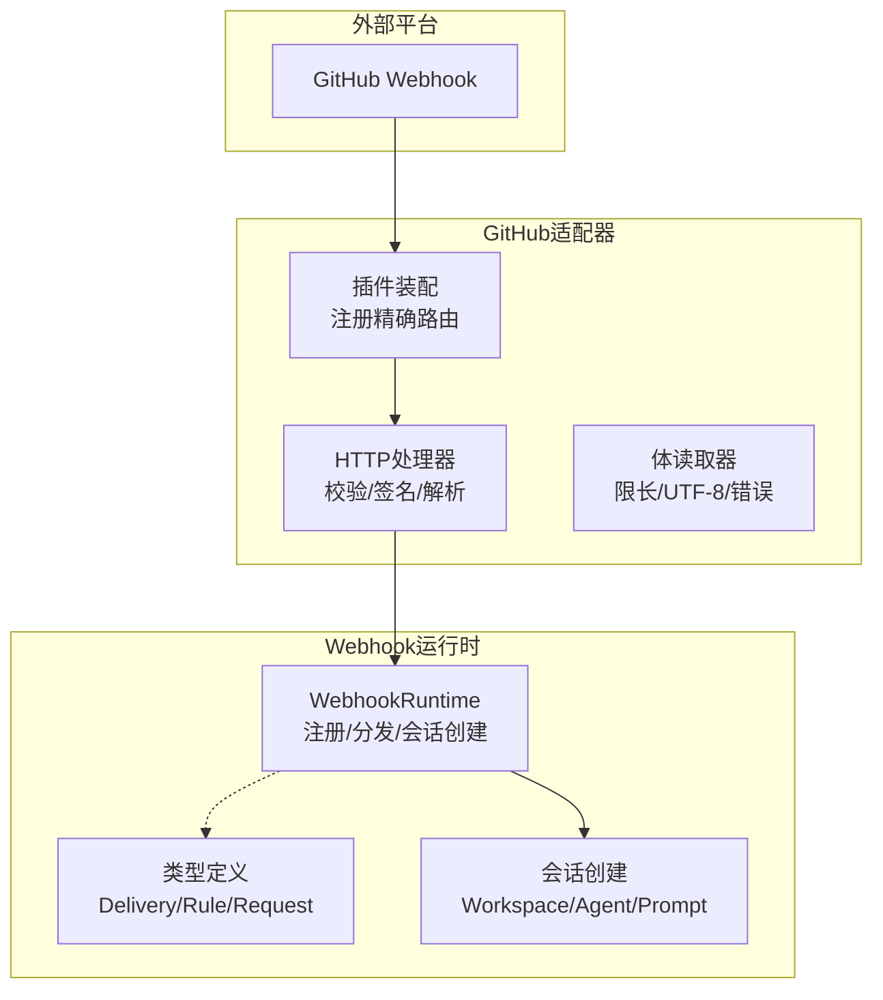
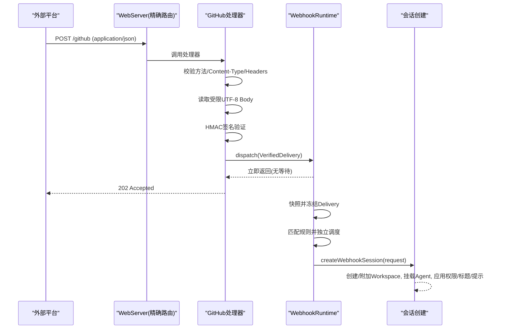
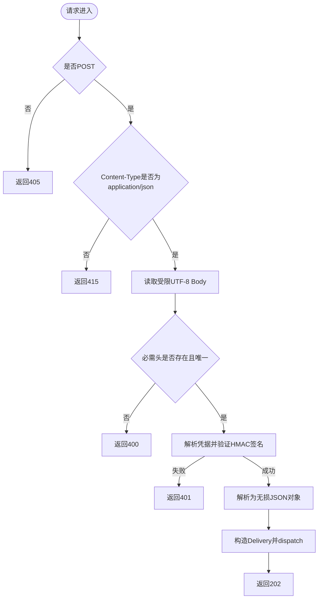
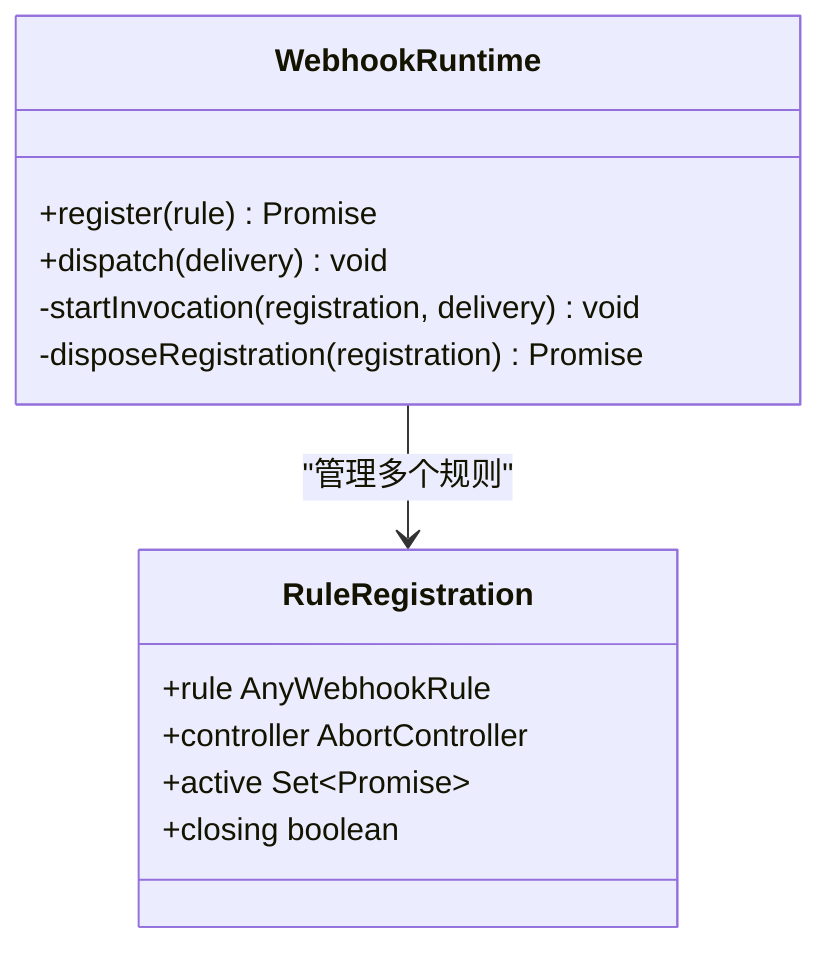
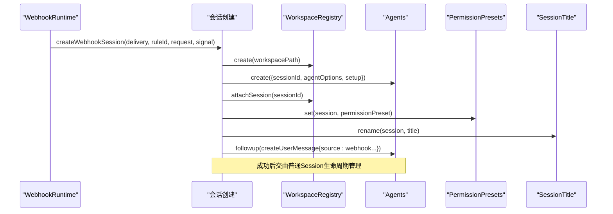
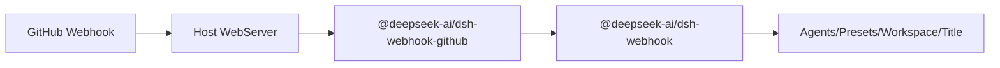

# Webhook集成

<cite>
**本文引用的文件**
- [packages/webhook/webhook/src/index.ts](file://packages/webhook/webhook/src/index.ts)
- [packages/webhook/webhook/src/types.ts](file://packages/webhook/webhook/src/types.ts)
- [packages/webhook/webhook/src/session.ts](file://packages/webhook/webhook/src/session.ts)
- [packages/webhook/webhook-github/src/handler.ts](file://packages/webhook/webhook-github/src/handler.ts)
- [packages/webhook/webhook-github/src/body.ts](file://packages/webhook/webhook-github/src/body.ts)
- [packages/webhook/webhook-github/src/index.ts](file://packages/webhook/webhook-github/src/index.ts)
- [packages/webhook/webhook-github/src/types.ts](file://packages/webhook/webhook-github/src/types.ts)
- [apps/cli/config/examples/github-review/cordis.yml](file://apps/cli/config/examples/github-review/cordis.yml)
- [apps/cli/config/examples/github-review/github-ready-review-rule.mjs](file://apps/cli/config/examples/github-review/github-ready-review-rule.mjs)
- [docs/subsystems/webhook.md](file://docs/subsystems/webhook.md)
- [docs/user/guide/github-review.md](file://docs/user/guide/github-review.md)
</cite>

## 目录
1. [简介](#简介)
2. [项目结构](#项目结构)
3. [核心组件](#核心组件)
4. [架构总览](#架构总览)
5. [详细组件分析](#详细组件分析)
6. [依赖关系分析](#依赖关系分析)
7. [性能考虑](#性能考虑)
8. [故障排除指南](#故障排除指南)
9. [结论](#结论)
10. [附录：平台集成示例与最佳实践](#附录平台集成示例与最佳实践)

## 简介
本文件面向DeepSeek Harness的Webhook集成，系统性说明Webhook接收机制、事件处理流程与安全验证方法；梳理支持的Webhook事件类型、数据格式与回调机制；提供GitHub等平台的集成配置、签名验证与错误处理参考；并给出路由规则、过滤条件、批量处理能力、安全最佳实践、性能考量与故障排除指南。目标是帮助开发者快速完成第三方平台接入与扩展。

## 项目结构
Webhook子系统由“运行时”和“提供方适配器”两部分组成：
- 运行时（webhook）：负责规则注册、分发、Session创建与生命周期管理。
- GitHub适配器（webhook-github）：负责HTTP入口、请求校验、签名验证、载荷解析与向运行时投递。
- 示例与文档：提供GitHub PR就绪即评审的完整Overlay配置与规则实现，以及系统级说明文档。

图表来源
- [packages/webhook/webhook/src/index.ts:58-179](file://packages/webhook/webhook/src/index.ts#L58-L179)
- [packages/webhook/webhook/src/types.ts:1-85](file://packages/webhook/webhook/src/types.ts#L1-L85)
- [packages/webhook/webhook/src/session.ts:110-182](file://packages/webhook/webhook/src/session.ts#L110-L182)
- [packages/webhook/webhook-github/src/handler.ts:78-131](file://packages/webhook/webhook-github/src/handler.ts#L78-L131)
- [packages/webhook/webhook-github/src/body.ts:1-69](file://packages/webhook/webhook-github/src/body.ts#L1-L69)
- [packages/webhook/webhook-github/src/index.ts:46-62](file://packages/webhook/webhook-github/src/index.ts#L46-L62)

章节来源
- [docs/subsystems/webhook.md:1-71](file://docs/subsystems/webhook.md#L1-L71)

## 核心组件
- WebhookRuntime：提供规则注册与fire-and-forget分发；对每次交付进行快照、冻结后分发给所有匹配规则；按规则独立调度并隔离异常；在卸载时中止并排空活动调用。
- VerifiedWebhookDelivery：包含提供方种类、来源、交付ID、标准化事件与接收时间；仅用于溯源，不做去重或持久化。
- WebhookRule：受信任的规则回调，可基于delivery进行条件判断与外部调用，返回null或一个WebhookSessionRequest。
- WebhookSessionRequest：指定工作区路径、标题、提示词、agent preset、权限preset及可选模型选择；运行时据此创建并挂载Agent、应用权限、写入初始消息。
- GitHub适配器：精确路由、POST限制、JSON内容类型校验、HMAC签名验证、无损JSON解析、最大Body限制、立即202响应与内存分发。

章节来源
- [packages/webhook/webhook/src/index.ts:58-179](file://packages/webhook/webhook/src/index.ts#L58-L179)
- [packages/webhook/webhook/src/types.ts:1-85](file://packages/webhook/webhook/src/types.ts#L1-L85)
- [packages/webhook/webhook/src/session.ts:110-182](file://packages/webhook/webhook/src/session.ts#L110-L182)
- [packages/webhook/webhook-github/src/handler.ts:78-131](file://packages/webhook/webhook-github/src/handler.ts#L78-L131)
- [packages/webhook/webhook-github/src/body.ts:1-69](file://packages/webhook/webhook-github/src/body.ts#L1-L69)

## 架构总览
Webhook整体采用“适配器+运行时”解耦设计：
- 适配器负责协议层安全与规范化（如GitHub的HMAC签名、头字段校验、无损JSON）。
- 运行时负责业务编排（规则匹配、异步执行、Session创建），不关心具体平台细节。
- 通过Cordis上下文注入服务（agents、agentPresets、permissionPresets、workspaceRegistry、sessionTitle等）完成会话落地。

图表来源
- [packages/webhook/webhook-github/src/handler.ts:78-131](file://packages/webhook/webhook-github/src/handler.ts#L78-L131)
- [packages/webhook/webhook/src/index.ts:126-162](file://packages/webhook/webhook/src/index.ts#L126-L162)
- [packages/webhook/webhook/src/session.ts:120-182](file://packages/webhook/webhook/src/session.ts#L120-L182)

## 详细组件分析

### GitHub HTTP处理器
职责：
- 限定POST方法与application/json内容类型。
- 读取受限UTF-8 Body，防止过大与非法编码。
- 校验必需头字段（x-hub-signature-256、x-github-delivery、x-github-event）。
- 动态解析凭据引用，使用Octokit Webhooks库验证HMAC签名。
- 将原始body解析为无损JSON对象，构造VerifiedWebhookDelivery并调用运行时dispatch。
- 立即返回202，不等待规则执行结果。

关键行为与错误码：
- 405：非POST方法。
- 415：非application/json。
- 413：Body超过maxBodyBytes。
- 400：JSON无效/非对象/非无损/UTF-8非法/缺失头。
- 401：签名验证失败。
- 503：凭据不可用/运行时不可用/入口异常。

图表来源
- [packages/webhook/webhook-github/src/handler.ts:78-131](file://packages/webhook/webhook-github/src/handler.ts#L78-L131)
- [packages/webhook/webhook-github/src/body.ts:1-69](file://packages/webhook/webhook-github/src/body.ts#L1-L69)

章节来源
- [packages/webhook/webhook-github/src/handler.ts:78-131](file://packages/webhook/webhook-github/src/handler.ts#L78-L131)
- [packages/webhook/webhook-github/src/body.ts:1-69](file://packages/webhook/webhook-github/src/body.ts#L1-L69)

### Webhook运行时（规则注册与分发）
职责：
- register(rule)：注册受信任规则，校验id/kind/run函数，绑定effect生命周期，支持卸载时中止与排空。
- dispatch(delivery)：快照并冻结delivery，遍历匹配规则，独立启动每个rule.run，捕获并隔离异常。
- 若rule返回WebhookSessionRequest，则调用会话创建流程。

并发与可靠性：
- fire-and-forget：立即返回，不排队、不重试、不去重。
- 每个规则的执行被AbortController隔离，卸载时中止活跃调用。
- 异常按规则隔离，不影响其他规则。

图表来源
- [packages/webhook/webhook/src/index.ts:58-179](file://packages/webhook/webhook/src/index.ts#L58-L179)

章节来源
- [packages/webhook/webhook/src/index.ts:58-179](file://packages/webhook/webhook/src/index.ts#L58-L179)

### 会话创建（Workspace/Agent/Prompt）
职责：
- 解析并校验WebhookSessionRequest（workspacePath/title/prompt/agentPreset/permissionPreset/model）。
- 解析或创建Workspace，创建Agent并挂载agent preset，设置初始模型选择。
- 附加到Workspace，应用权限预设，重命名会话标题，写入初始follow-up消息（source.kind=webhook，携带provider/source/delivery/rule溯源信息）。
- 失败时尝试回滚（detach/释放Agent），保证资源一致性。

图表来源
- [packages/webhook/webhook/src/session.ts:120-182](file://packages/webhook/webhook/src/session.ts#L120-L182)

章节来源
- [packages/webhook/webhook/src/session.ts:120-182](file://packages/webhook/webhook/src/session.ts#L120-L182)

### 事件类型与数据格式
- 提供方事件映射：通过模块声明扩展WebhookEventMap，当前已实现github事件类型。
- GitHub事件：name为X-GitHub-Event值（如pull_request），payload为原始无损JSON对象。
- Delivery：包含kind/source/deliveryId/event/receivedAt，仅用于溯源，不做去重存储。

章节来源
- [packages/webhook/webhook-github/src/types.ts:1-22](file://packages/webhook/webhook-github/src/types.ts#L1-L22)
- [packages/webhook/webhook/src/types.ts:13-25](file://packages/webhook/webhook/src/types.ts#L13-L25)

### 路由规则与过滤条件
- 路由：GitHub适配器以exact模式注册单一绝对路径（不允许根路径、尾斜杠、查询或片段）。
- 过滤：规则内基于delivery.source、event.name、payload字段进行条件过滤，返回null表示忽略该次交付。
- 示例：仅处理特定source、仓库、事件与action（如pull_request的ready_for_review）。

章节来源
- [packages/webhook/webhook-github/src/index.ts:35-62](file://packages/webhook/webhook-github/src/index.ts#L35-L62)
- [apps/cli/config/examples/github-review/github-ready-review-rule.mjs:15-66](file://apps/cli/config/examples/github-review/github-ready-review-rule.mjs#L15-L66)

### 回调机制与批量处理
- 回调：rule.run可为同步或异步，必须监听AbortSignal以支持卸载中断。
- 批量：dispatch会并行启动所有匹配规则的run，但彼此隔离；无队列与重试，重复交付可能产生重复会话。

章节来源
- [packages/webhook/webhook/src/index.ts:126-162](file://packages/webhook/webhook/src/index.ts#L126-L162)
- [docs/subsystems/webhook.md:19-23](file://docs/subsystems/webhook.md#L19-L23)

## 依赖关系分析
- 适配器依赖：Node http、@octokit/webhooks、凭证解析、Host WebServer。
- 运行时依赖：Cordis Context、Agents、AgentPresets、PermissionPresets、WorkspaceRegistry、SessionTitle。
- 配置注入：通过Cordis overlay组合webhook运行时、GitHub适配器与独立WebServer。

图表来源
- [apps/cli/config/examples/github-review/cordis.yml:1-36](file://apps/cli/config/examples/github-review/cordis.yml#L1-L36)
- [packages/webhook/webhook-github/src/index.ts:46-62](file://packages/webhook/webhook-github/src/index.ts#L46-L62)
- [packages/webhook/webhook/src/index.ts:58-82](file://packages/webhook/webhook/src/index.ts#L58-L82)

章节来源
- [apps/cli/config/examples/github-review/cordis.yml:1-36](file://apps/cli/config/examples/github-review/cordis.yml#L1-L36)

## 性能考虑
- 入站限流与体积控制：通过maxBodyBytes限制请求体大小，避免内存与CPU滥用。
- 即时响应：签名通过后立即返回202，降低网关超时风险。
- 无队列与重试：减少状态维护开销，但需在上游做好幂等与重试策略。
- 规则隔离：每个规则独立执行与异常隔离，避免单条规则阻塞整体。
- 会话创建成本：首次Workspace创建有I/O开销，后续复用；注意合理缓存与复用。

[本节为通用指导，无需列出具体文件]

## 故障排除指南
常见问题与定位要点：
- 401签名失败：检查GitHub配置的Secret与DSH_GITHUB_WEBHOOK_SECRET是否一致；确认Content-Type为application/json且未修改body。
- 415/400：确保Content-Type为application/json；请求体为合法UTF-8 JSON对象。
- 413：请求体过大，调整maxBodyBytes或上游压缩。
- 503：凭据不可用或运行时不可用；检查credentials服务与webhookRuntime是否可用。
- 规则未触发：检查delivery.source、event.name与payload字段是否符合规则过滤条件。
- 会话未创建：查看日志中createWebhookSession阶段错误；确认workspacePath有效、agent/permission preset存在。

章节来源
- [packages/webhook/webhook-github/src/handler.ts:82-131](file://packages/webhook/webhook-github/src/handler.ts#L82-L131)
- [packages/webhook/webhook-github/src/body.ts:18-69](file://packages/webhook/webhook-github/src/body.ts#L18-L69)
- [packages/webhook/webhook/src/session.ts:120-182](file://packages/webhook/webhook/src/session.ts#L120-L182)

## 结论
DeepSeek Harness的Webhook子系统通过适配器与运行时的清晰分层，实现了高内聚、低耦合的事件接入能力。GitHub适配器提供严格的安全校验与轻量入站处理，运行时负责规则编排与会话落地，既保证了安全性，又提供了灵活的扩展点。结合示例配置与文档，开发者可以快速完成GitHub等平台集成，并在规则层实现精细化的业务逻辑。

[本节为总结性内容，无需列出具体文件]

## 附录：平台集成示例与最佳实践

### GitHub集成步骤
- 生成并保存高熵Secret（DSH_GITHUB_WEBHOOK_SECRET）。
- 使用提供的overlay启用webhook运行时与GitHub适配器，监听独立WebServer端口（默认127.0.0.1:3081）。
- 通过反向代理暴露仅包含/ github的路径，并配置GitHub Webhook订阅Pull requests事件，内容为application/json。
- 在规则中过滤source、事件与payload字段，返回WebhookSessionRequest以创建评审会话。

章节来源
- [docs/user/guide/github-review.md:1-103](file://docs/user/guide/github-review.md#L1-L103)
- [apps/cli/config/examples/github-review/cordis.yml:1-36](file://apps/cli/config/examples/github-review/cordis.yml#L1-L36)
- [apps/cli/config/examples/github-review/github-ready-review-rule.mjs:15-66](file://apps/cli/config/examples/github-review/github-ready-review-rule.mjs#L15-L66)

### 签名验证与错误处理
- 使用Octokit Webhooks库对body与x-hub-signature-256进行HMAC-SHA256验证。
- 对缺失或重复头、非法Content-Type、非法JSON/UTF-8、超大Body分别返回明确状态码。
- 对凭据不可用或运行时不可用返回503，便于上游重试与告警。

章节来源
- [packages/webhook/webhook-github/src/handler.ts:92-105](file://packages/webhook/webhook-github/src/handler.ts#L92-L105)
- [packages/webhook/webhook-github/src/body.ts:18-69](file://packages/webhook/webhook-github/src/body.ts#L18-L69)

### 路由规则与过滤条件
- 路由：exact模式，绝对路径，禁止根路径、尾斜杠、查询与片段。
- 过滤：在rule.run中基于delivery.source、event.name、payload字段进行条件判断，返回null忽略。
- 示例：仅处理primary-github来源、指定仓库、pull_request事件的ready_for_review动作。

章节来源
- [packages/webhook/webhook-github/src/index.ts:35-62](file://packages/webhook/webhook-github/src/index.ts#L35-L62)
- [apps/cli/config/examples/github-review/github-ready-review-rule.mjs:20-32](file://apps/cli/config/examples/github-review/github-ready-review-rule.mjs#L20-L32)

### 批量处理能力
- 运行时会对所有匹配规则并行调度，互不阻塞。
- 无队列与重试，重复交付可能产生重复会话；建议在规则层做幂等或在上游控制重试策略。

章节来源
- [packages/webhook/webhook/src/index.ts:126-162](file://packages/webhook/webhook/src/index.ts#L126-L162)
- [docs/subsystems/webhook.md:19-23](file://docs/subsystems/webhook.md#L19-L23)

### 安全最佳实践
- 使用高熵Secret并妥善保管，仅在可信环境暴露Webhook入口。
- 仅暴露最小必要路径（/github），其余路径返回404。
- 严格校验Content-Type与Body，拒绝非JSON或非UTF-8。
- 规则代码应遵循最小权限原则，避免写操作与敏感网络访问。
- 对外部传入的payload视为不受信元数据，不在提示词中直接作为指令执行。

章节来源
- [docs/user/guide/github-review.md:66-103](file://docs/user/guide/github-review.md#L66-L103)
- [packages/webhook/webhook-github/src/handler.ts:82-131](file://packages/webhook/webhook-github/src/handler.ts#L82-L131)

### 第三方平台扩展参考
- 新增平台适配器：实现HTTP入口、签名验证、无损JSON解析，构造VerifiedWebhookDelivery并调用ctx.webhookRuntime.dispatch。
- 扩展事件类型：在适配器中合并声明WebhookEventMap，使规则获得类型安全的payload。
- 复用运行时：无需实现Session创建逻辑，仅需在规则中返回WebhookSessionRequest。

章节来源
- [packages/webhook/webhook/src/types.ts:6-11](file://packages/webhook/webhook/src/types.ts#L6-L11)
- [packages/webhook/webhook/src/index.ts:58-179](file://packages/webhook/webhook/src/index.ts#L58-L179)