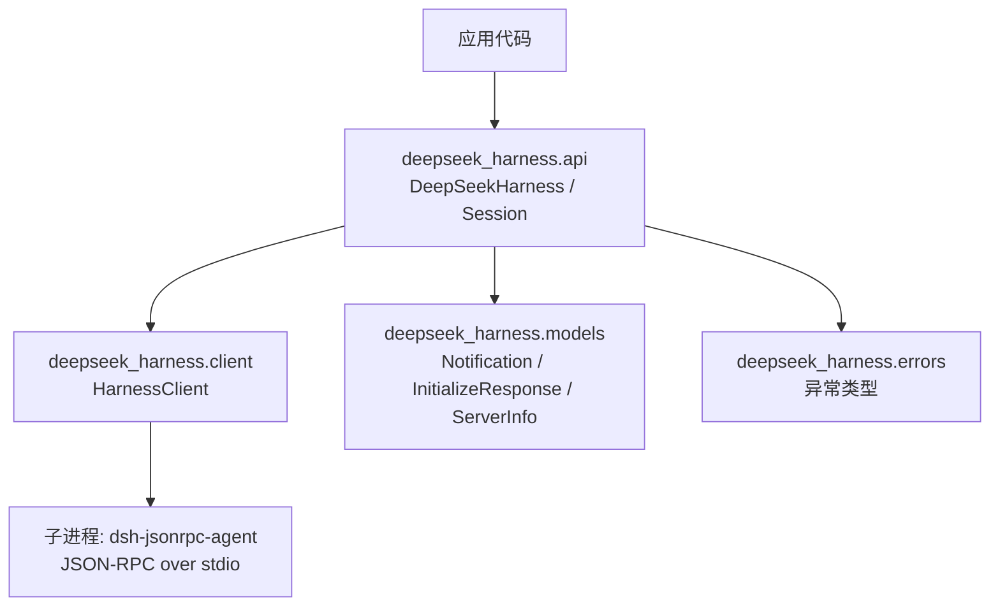
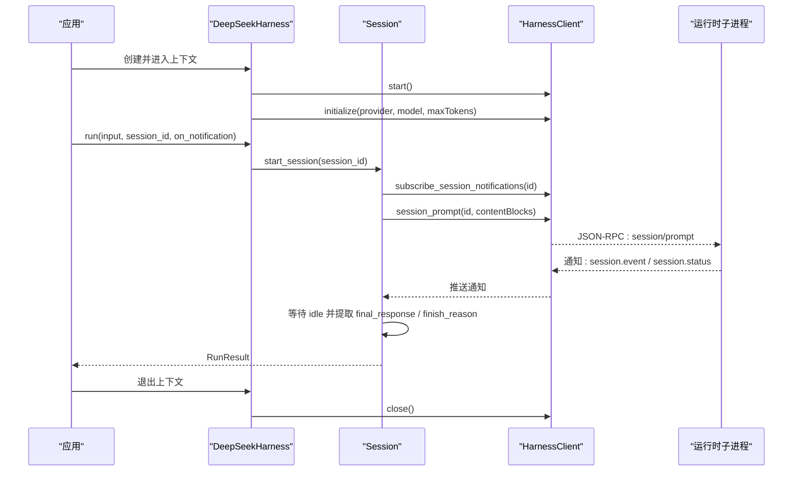
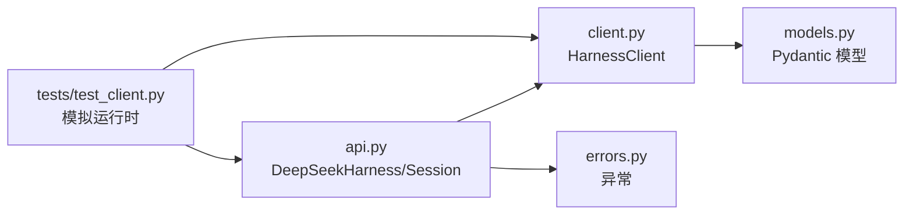

# API 参考

<cite>
**本文引用的文件**
- [__init__.py](file://python/sdk/src/deepseek_harness/__init__.py)
- [api.py](file://python/sdk/src/deepseek_harness/api.py)
- [client.py](file://python/sdk/src/deepseek_harness/client.py)
- [models.py](file://python/sdk/src/deepseek_harness/models.py)
- [errors.py](file://python/sdk/src/deepseek_harness/errors.py)
- [README.md](file://python/sdk/README.md)
- [test_client.py](file://python/sdk/tests/test_client.py)
</cite>

## 目录
1. [简介](#简介)
2. [项目结构](#项目结构)
3. [核心组件](#核心组件)
4. [架构总览](#架构总览)
5. [详细组件分析](#详细组件分析)
6. [依赖关系分析](#依赖关系分析)
7. [性能与超时](#性能与超时)
8. [故障排查指南](#故障排查指南)
9. [结论](#结论)
10. [附录：数据模型与事件](#附录数据模型与事件)

## 简介
本参考文档面向 DeepSeek Harness Python SDK，系统化说明公共接口、数据模型、错误类型、异步/同步差异以及使用示例。SDK 通过 JSON-RPC over stdio 启动并复用本地运行时子进程，提供高层的会话式调用能力，同时暴露低层客户端以支持更细粒度的控制。

## 项目结构
Python SDK 位于 python/sdk/src/deepseek_harness，主要模块如下：
- api.py：高层同步 API（DeepSeekHarness、Session、RunResult、配置）
- client.py：底层 JSON-RPC 客户端（HarnessClient、通知订阅、子进程管理）
- models.py：通用数据类型（Notification、IncomingRequest、InitializeResponse、ServerInfo、JSON 类型别名）
- errors.py：异常体系（TransportClosedError、SdkProtocolError、JsonRpcError）
- __init__.py：对外导出符号

**图示来源**
- [api.py:48-183](file://python/sdk/src/deepseek_harness/api.py#L48-L183)
- [client.py:37-155](file://python/sdk/src/deepseek_harness/client.py#L37-L155)
- [models.py:13-33](file://python/sdk/src/deepseek_harness/models.py#L13-L33)
- [errors.py:4-24](file://python/sdk/src/deepseek_harness/errors.py#L4-L24)

**章节来源**
- [__init__.py:1-20](file://python/sdk/src/deepseek_harness/__init__.py#L1-L20)
- [api.py:13-46](file://python/sdk/src/deepseek_harness/api.py#L13-L46)
- [client.py:24-55](file://python/sdk/src/deepseek_harness/client.py#L24-L55)
- [models.py:1-33](file://python/sdk/src/deepseek_harness/models.py#L1-L33)
- [errors.py:1-24](file://python/sdk/src/deepseek_harness/errors.py#L1-L24)

## 核心组件
- DeepSeekHarness：高层同步入口，封装运行时生命周期与会话执行，返回 RunResult。
- Session：会话对象，封装一次 run 的输入、通知收集与结束条件。
- RunResult：单次运行的结果，包含最终响应、结束原因、事件与通知。
- HarnessClient：底层 JSON-RPC 客户端，负责子进程启动、请求/通知路由、超时与关闭。
- NotificationSubscription：通知订阅句柄，支持按会话树过滤与批量消费。
- 配置类：DeepSeekHarnessConfig、HarnessConfig，控制运行时、环境、超时等。

**章节来源**
- [api.py:13-46](file://python/sdk/src/deepseek_harness/api.py#L13-L46)
- [api.py:48-183](file://python/sdk/src/deepseek_harness/api.py#L48-L183)
- [client.py:24-55](file://python/sdk/src/deepseek_harness/client.py#L24-L55)
- [client.py:507-546](file://python/sdk/src/deepseek_harness/client.py#L507-L546)

## 架构总览
SDK 采用“高层 API + 低层客户端”的分层设计。高层 API 隐藏子进程细节，提供上下文管理器与便捷方法；低层客户端直接操作 JSON-RPC 消息流，支持自定义桥接或调试。

**图示来源**
- [api.py:97-124](file://python/sdk/src/deepseek_harness/api.py#L97-L124)
- [api.py:127-183](file://python/sdk/src/deepseek_harness/api.py#L127-L183)
- [client.py:117-155](file://python/sdk/src/deepseek_harness/client.py#L117-L155)
- [client.py:228-296](file://python/sdk/src/deepseek_harness/client.py#L228-L296)

## 详细组件分析

### 高层 API：DeepSeekHarness
- 作用：启动/初始化运行时，提供 run() 与 start_session() 等便捷方法。
- 关键行为：
  - 懒启动：首次调用时启动子进程并发送 initialize。
  - 环境变量注入：将 base_url、api_key、session_root、cordis、cwd 等转为环境变量传递给子进程。
  - 上下文管理：支持 with 语句自动启动与关闭。
- 重要方法
  - __init__(config=None, **kwargs)
  - start()
  - close()
  - start_session(session_id=None) -> Session
  - run(input, *, session_id=None, on_notification=None) -> RunResult
- 参数验证规则
  - config 与 kwargs 不可同时传入，否则抛出 TypeError。
  - cwd/runtime_cwd 会解析为绝对路径后注入到环境与 wire 中。
- 返回值
  - run() 返回 RunResult，包含 final_response、finish_reason、events、notifications、session_root。

**章节来源**
- [api.py:13-36](file://python/sdk/src/deepseek_harness/api.py#L13-L36)
- [api.py:48-124](file://python/sdk/src/deepseek_harness/api.py#L48-L124)
- [api.py:199-202](file://python/sdk/src/deepseek_harness/api.py#L199-L202)

### 会话与运行：Session
- 作用：封装一次会话的运行流程，包括输入归一化、通知订阅、等待空闲、结果聚合。
- 关键行为
  - normalize_input：字符串输入会被包装为文本块列表。
  - 订阅会话及后代通知：仅收集属于当前会话树的通知。
  - 等待结束：直到收到 session.status=idle 才结束。
  - 结果提取：从 events 中提取最后一条 assistant/message 文本作为 final_response；从最后一条 turn/end 提取 finish_reason。
- 异常
  - 若最后一条 turn/end 缺少 data.reason.kind，抛出 SdkProtocolError。

**章节来源**
- [api.py:127-183](file://python/sdk/src/deepseek_harness/api.py#L127-L183)
- [api.py:205-242](file://python/sdk/src/deepseek_harness/api.py#L205-L242)

### 低层客户端：HarnessClient
- 作用：管理子进程生命周期、JSON-RPC 请求/响应、通知分发、超时与诊断。
- 关键能力
  - start/close：启动/关闭子进程，优雅 shutdown 与强制终止。
  - initialize：向运行时发送 initialize，携带 cwd/provider/model/maxTokens。
  - session_prompt：提交会话提示，返回 messageId。
  - request/notify：通用请求与通知发送。
  - subscribe_notifications/subscribe_session_notifications：订阅通知，支持过滤器与会话树匹配。
  - next_request/respond/respond_error：处理来自运行时的入站请求。
- 超时与关闭
  - request_timeout_seconds：请求等待超时，超时会附加 stderr 诊断信息。
  - shutdown_timeout_seconds：关闭等待超时，未响应则 kill 子进程。
- 通知过滤
  - 基于 subagent.started/finished 维护父子会话关系，确保只投递给相关订阅者。

**章节来源**
- [client.py:37-155](file://python/sdk/src/deepseek_harness/client.py#L37-L155)
- [client.py:157-296](file://python/sdk/src/deepseek_harness/client.py#L157-L296)
- [client.py:424-454](file://python/sdk/src/deepseek_harness/client.py#L424-L454)
- [client.py:460-504](file://python/sdk/src/deepseek_harness/client.py#L460-L504)

### 通知订阅：NotificationSubscription
- 作用：会话级通知订阅句柄，支持阻塞 next() 与非阻塞 drain(on_notification)。
- 行为
  - 上下文管理：with 块结束时自动取消订阅。
  - 错误传播：若订阅队列中出现异常，next()/drain() 会抛出该异常。
  - 会话树感知：由 HarnessClient 根据 subagent 生命周期维护父子关系，过滤通知。

**章节来源**
- [client.py:507-546](file://python/sdk/src/deepseek_harness/client.py#L507-L546)
- [client.py:192-204](file://python/sdk/src/deepseek_harness/client.py#L192-L204)

### 数据模型
- Notification：method + payload（任意 JSON 对象）。
- IncomingRequest：id + method + payload，用于接收运行时发起的请求。
- ServerInfo：name/version，initialize 响应中的服务器信息。
- InitializeResponse：serverInfo。
- JSON 类型别名：JsonValue/JsonObject/JsonScalar。

**章节来源**
- [models.py:1-33](file://python/sdk/src/deepseek_harness/models.py#L1-L33)

### 异常体系
- HarnessError：基础异常。
- TransportClosedError：运行时子进程退出或 stdout 关闭。
- SdkProtocolError：运行时数据不符合 SDK 协议（如 turn/end 缺少 reason.kind）。
- JsonRpcError：运行时返回 JSON-RPC error，包含 code/message/data。

**章节来源**
- [errors.py:4-24](file://python/sdk/src/deepseek_harness/errors.py#L4-L24)

## 依赖关系分析
- 高层 API 依赖低层客户端与环境变量注入逻辑。
- 低层客户端依赖 pydantic 进行响应模型校验。
- 运行时通过 JSON-RPC over stdio 通信，SDK 负责消息路由与超时控制。
- 测试用例通过 launch_args_override 注入模拟运行时，验证行为与边界。

**图示来源**
- [api.py:48-183](file://python/sdk/src/deepseek_harness/api.py#L48-L183)
- [client.py:37-155](file://python/sdk/src/deepseek_harness/client.py#L37-L155)
- [models.py:13-33](file://python/sdk/src/deepseek_harness/models.py#L13-L33)
- [errors.py:4-24](file://python/sdk/src/deepseek_harness/errors.py#L4-L24)
- [test_client.py:15-124](file://python/sdk/tests/test_client.py#L15-L124)

**章节来源**
- [test_client.py:15-124](file://python/sdk/tests/test_client.py#L15-L124)
- [test_client.py:453-486](file://python/sdk/tests/test_client.py#L453-L486)

## 性能与超时
- 子进程复用：DeepSeekHarness 在实例生命周期内复用同一运行时，减少启动开销。
- 请求超时：request_timeout_seconds 控制单次请求等待时间，超时包含 stderr 诊断。
- 关闭超时：shutdown_timeout_seconds 控制优雅关闭等待，超时后强制 kill。
- 通知批处理：drain() 可批量消费通知，避免频繁阻塞。
- 建议
  - 合理设置超时以避免长时间阻塞。
  - 对长任务使用独立 session_id，避免状态污染。
  - 使用 on_notification 实时处理中间事件，提升交互体验。

[本节为通用指导，不直接分析具体文件]

## 故障排查指南
- 常见异常
  - TransportClosedError：子进程已退出或 stdout 关闭，检查运行时是否崩溃或权限问题。
  - SdkProtocolError：turn/end 缺少 reason.kind，检查运行时协议实现。
  - JsonRpcError：运行时返回错误码与消息，查看 code/message/data。
- 诊断信息
  - 超时与关闭失败会附带 stderr 尾部输出与退出码，便于定位。
- 典型场景
  - 初始化失败：ensure 子进程可执行且环境变量正确。
  - 通知未到达：确认订阅会话树是否正确，检查 subagent.started/finished 是否记录父子关系。
  - 非 JSON 行：忽略非 JSON 输出行，不影响正常消息处理。

**章节来源**
- [errors.py:4-24](file://python/sdk/src/deepseek_harness/errors.py#L4-L24)
- [client.py:399-422](file://python/sdk/src/deepseek_harness/client.py#L399-L422)
- [test_client.py:720-783](file://python/sdk/tests/test_client.py#L720-L783)

## 结论
DeepSeek Harness Python SDK 提供了清晰的高层 API 与强大的低层客户端，支持会话式调用、通知订阅、超时控制与健壮的错误处理。通过合理的配置与超时策略，可在生产环境中稳定驱动 Agent 工作流。

[本节为总结性内容，不直接分析具体文件]

## 附录：数据模型与事件

### 数据模型定义
- Notification
  - method: 字符串，事件方法名
  - payload: 字典，事件载荷
- IncomingRequest
  - id: 字符串或整数，请求标识
  - method: 字符串，请求方法
  - payload: 字典，请求参数
- ServerInfo
  - name: 可选字符串
  - version: 可选字符串
- InitializeResponse
  - serverInfo: 可选 ServerInfo

**章节来源**
- [models.py:13-33](file://python/sdk/src/deepseek_harness/models.py#L13-L33)

### 事件与字段说明
- session.event：会话事件，payload 中包含 event 对象，常见 type 包括：
  - agent/inbox/spliced：表示消息插入，data.inserted 包含消息 ID 列表。
  - assistant/message：助手消息，data.message.content 为内容块列表。
  - turn/end：回合结束，data.reason.kind 为结束原因（如 completed、max-tokens、error）。
- session.status：会话状态，payload.sessionId 与 payload.status（running/idle）。
- subagent.started/finished：子代理生命周期事件，包含 parentSessionId/childSessionId 等。

注意：final_response 仅聚合根会话的 assistant/message 文本；finish_reason 取自最后一条 turn/end 的 reason.kind。

**章节来源**
- [api.py:186-242](file://python/sdk/src/deepseek_harness/api.py#L186-L242)
- [test_client.py:15-124](file://python/sdk/tests/test_client.py#L15-L124)
- [test_client.py:240-339](file://python/sdk/tests/test_client.py#L240-L339)

## 使用示例与最佳实践

### 基本用法（同步）
- 使用上下文管理器启动并运行一次对话，获取最终响应与结束原因。
- 示例参考路径：
  - [python/sdk/README.md:18-23](file://python/sdk/README.md#L18-L23)
  - [docs/user/guide/python-sdk.md:56-79](file://docs/user/guide/python-sdk.md#L56-L79)

### 自定义运行时与配置
- 通过 cordis 指定插件组合，或通过 env/base_url/api_key 覆盖运行时环境。
- 示例参考路径：
  - [python/sdk/README.md:29-43](file://python/sdk/README.md#L29-L43)
  - [python/sdk/tests/test_client.py:94-124](file://python/sdk/tests/test_client.py#L94-L124)

### 通知回调与会话树
- 使用 on_notification 实时处理中间事件；SDK 会自动收集所属会话及其后代的通知。
- 示例参考路径：
  - [python/sdk/tests/test_client.py:127-163](file://python/sdk/tests/test_client.py#L127-L163)
  - [python/sdk/tests/test_client.py:240-339](file://python/sdk/tests/test_client.py#L240-L339)

### 超时与关闭
- 设置 request_timeout_seconds 与 shutdown_timeout_seconds 控制行为。
- 示例参考路径：
  - [python/sdk/tests/test_client.py:720-783](file://python/sdk/tests/test_client.py#L720-L783)

### 异步与同步
- 当前 SDK 提供的是同步接口；所有 I/O 在后台线程中处理，主线程阻塞等待响应或通知。
- 如需异步，请在应用层使用线程或协程封装同步调用。

[本节为使用指导，不直接分析具体文件]