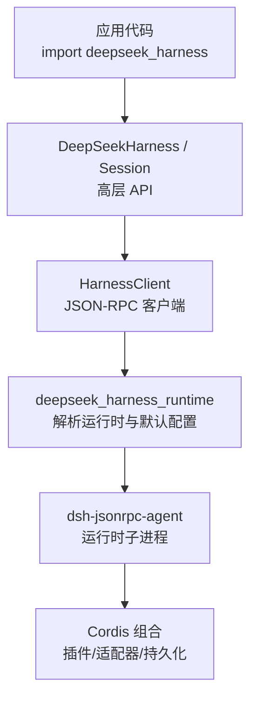
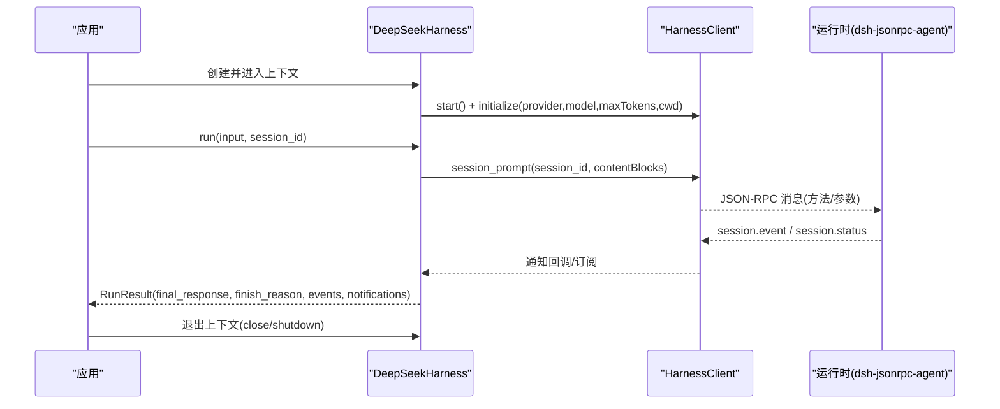
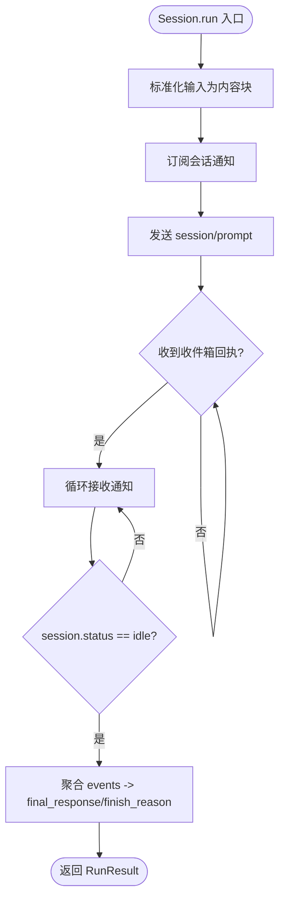
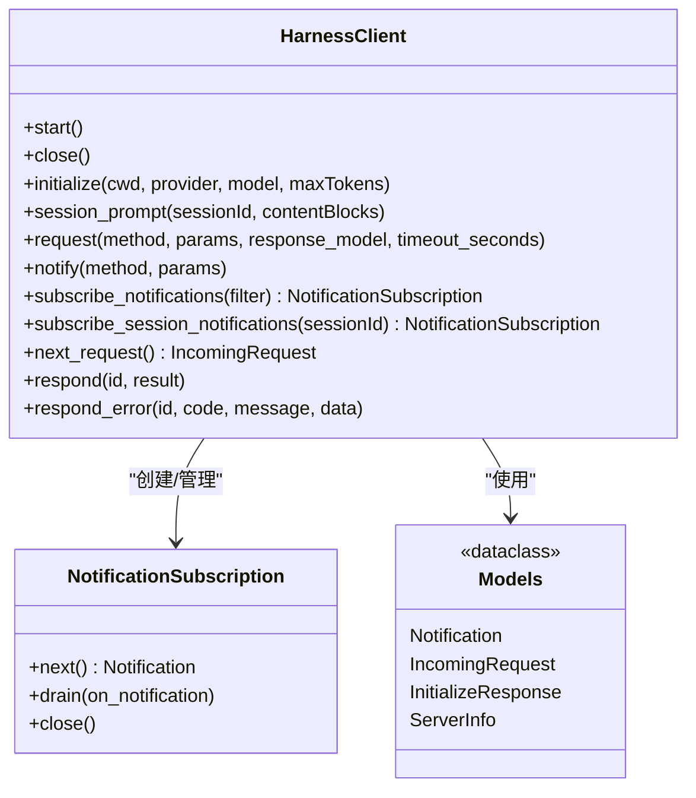
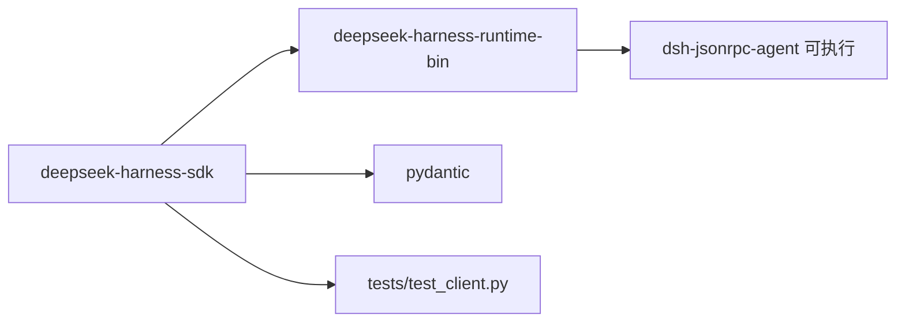

# Python SDK

<cite>
**本文引用的文件**
- [python/sdk/README.md](file://python/sdk/README.md)
- [python/sdk/pyproject.toml](file://python/sdk/pyproject.toml)
- [python/sdk/src/deepseek_harness/__init__.py](file://python/sdk/src/deepseek_harness/__init__.py)
- [python/sdk/src/deepseek_harness/api.py](file://python/sdk/src/deepseek_harness/api.py)
- [python/sdk/src/deepseek_harness/client.py](file://python/sdk/src/deepseek_harness/client.py)
- [python/sdk/src/deepseek_harness/errors.py](file://python/sdk/src/deepseek_harness/errors.py)
- [python/sdk/src/deepseek_harness/models.py](file://python/sdk/src/deepseek_harness/models.py)
- [python/sdk-runtime/README.md](file://python/sdk-runtime/README.md)
- [python/sdk-runtime/pyproject.toml](file://python/sdk-runtime/pyproject.toml)
- [python/sdk-runtime/src/deepseek_harness_runtime/__init__.py](file://python/sdk-runtime/src/deepseek_harness_runtime/__init__.py)
- [examples/jsonrpc-agent/minimal.py](file://examples/jsonrpc-agent/minimal.py)
- [examples/jsonrpc-agent/README.md](file://examples/jsonrpc-agent/README.md)
- [docs/user/guide/python-sdk.md](file://docs/user/guide/python-sdk.md)
- [python/sdk/tests/test_client.py](file://python/sdk/tests/test_client.py)
</cite>

## 目录
1. [简介](#简介)
2. [项目结构](#项目结构)
3. [核心组件](#核心组件)
4. [架构总览](#架构总览)
5. [详细组件分析](#详细组件分析)
6. [依赖关系分析](#依赖关系分析)
7. [性能与最佳实践](#性能与最佳实践)
8. [故障排查指南](#故障排查指南)
9. [结论](#结论)
10. [附录：API 参考与示例路径](#附录api-参考与示例路径)

## 简介
DeepSeek Harness Python SDK 通过 JSON-RPC over stdio 启动并驱动 DeepSeek Harness Agent 运行时子进程，提供同步、可复用的会话式调用能力。SDK 默认使用打包的运行时二进制（无需系统 Node），并通过注入默认 Cordis 配置实现“零配置”运行；同时支持自定义 Cordis 组合以挂载更多插件（如 MCP 工具、持久化策略等）。

- 安装方式：通过 PyPI 安装 deepseek-harness-sdk，导入模块为 deepseek_harness。
- 环境变量：继承父进程的 DEEPSEEK_API_KEY、DEEPSEEK_BASE_URL 等，便于直接对接真实模型端点或本地代理。
- 基本用法：使用上下文管理器管理生命周期，run() 返回 RunResult，包含最终响应、结束原因、事件与通知。

**章节来源**
- [python/sdk/README.md:1-52](file://python/sdk/README.md#L1-L52)
- [docs/user/guide/python-sdk.md:1-105](file://docs/user/guide/python-sdk.md#L1-L105)

## 项目结构
Python SDK 由两个包组成：
- deepseek-harness-sdk：Python 客户端 API，负责进程管理、JSON-RPC 通信、会话编排与结果聚合。
- deepseek-harness-runtime-bin：运行时载体包，提供平台特定的单文件可执行与默认 Cordis 配置，供 SDK 自动发现与注入。

**图表来源**
- [python/sdk/src/deepseek_harness/api.py:48-124](file://python/sdk/src/deepseek_harness/api.py#L48-L124)
- [python/sdk/src/deepseek_harness/client.py:37-155](file://python/sdk/src/deepseek_harness/client.py#L37-L155)
- [python/sdk-runtime/src/deepseek_harness_runtime/__init__.py:46-123](file://python/sdk-runtime/src/deepseek_harness_runtime/__init__.py#L46-L123)

**章节来源**
- [python/sdk/pyproject.toml:1-38](file://python/sdk/pyproject.toml#L1-L38)
- [python/sdk-runtime/pyproject.toml:1-32](file://python/sdk-runtime/pyproject.toml#L1-L32)
- [python/sdk-runtime/README.md:1-32](file://python/sdk-runtime/README.md#L1-L32)

## 核心组件
- DeepSeekHarnessConfig：定义运行时启动参数（provider、model、max_tokens、cwd、runtime_cwd、session_root、cordis、env、runtime_bin、launch_args_override、超时、base_url、api_key）。
- DeepSeekHarness：高层同步 API，懒启动子进程，维护会话与生命周期，封装 run()/start_session()。
- Session：会话级入口，将输入标准化为内容块，订阅 session 通知，等待 idle 后聚合结果。
- HarnessClient：底层 JSON-RPC 客户端，管理子进程、读写线程、请求-响应队列、通知订阅与过滤、子会话祖先关系追踪。
- 数据模型：Notification、IncomingRequest、InitializeResponse、ServerInfo、通用 JsonValue/JsonObject。
- 错误类型：TransportClosedError、SdkProtocolError、JsonRpcError。

**章节来源**
- [python/sdk/src/deepseek_harness/api.py:13-124](file://python/sdk/src/deepseek_harness/api.py#L13-L124)
- [python/sdk/src/deepseek_harness/client.py:24-155](file://python/sdk/src/deepseek_harness/client.py#L24-L155)
- [python/sdk/src/deepseek_harness/models.py:8-33](file://python/sdk/src/deepseek_harness/models.py#L8-L33)
- [python/sdk/src/deepseek_harness/errors.py:4-24](file://python/sdk/src/deepseek_harness/errors.py#L4-L24)

## 架构总览
SDK 通过 JSON-RPC over stdio 与运行时子进程通信。启动流程包括：
- 解析并选择运行时载体（生产 exe 或开发 node 模式）。
- 注入默认 Cordis 配置（当未显式指定且使用捆绑运行时）。
- 初始化会话上下文（provider/model/maxTokens/cwd）。
- 发送 session/prompt，订阅 session.event 与 session.status，直到 idle 结束一轮。
- 聚合 events 得到 final_response 与 finish_reason，并收集通知。

**图表来源**
- [python/sdk/src/deepseek_harness/api.py:97-124](file://python/sdk/src/deepseek_harness/api.py#L97-L124)
- [python/sdk/src/deepseek_harness/client.py:63-155](file://python/sdk/src/deepseek_harness/client.py#L63-L155)
- [python/sdk-runtime/src/deepseek_harness_runtime/__init__.py:103-123](file://python/sdk-runtime/src/deepseek_harness_runtime/__init__.py#L103-L123)

## 详细组件分析

### 高层 API：DeepSeekHarness 与 Session
- 职责：
  - 懒启动子进程，缓存已初始化状态。
  - 将配置项转换为环境变量与 wire 参数（如 DSH_CWD、DSH_SESSION_ROOT、DSH_CORDIS_CONFIG、DEEPSEEK_*）。
  - 提供 run() 便捷方法，内部委托 Session.run()。
  - Session.run() 标准化输入、订阅通知、等待 idle 并聚合结果。
- 关键行为：
  - 输入标准化：字符串转为 text 内容块。
  - 结果提取：从 events 中反向查找 assistant/message 得到 final_response。
  - 结束原因：从最后一个 turn/end 事件提取 reason.kind，缺失时抛出 SdkProtocolError。
  - 通知收集：根会话事件放入 events；所有已知后代通知放入 notifications。

**图表来源**
- [python/sdk/src/deepseek_harness/api.py:127-183](file://python/sdk/src/deepseek_harness/api.py#L127-L183)
- [python/sdk/src/deepseek_harness/api.py:199-243](file://python/sdk/src/deepseek_harness/api.py#L199-L243)

**章节来源**
- [python/sdk/src/deepseek_harness/api.py:13-183](file://python/sdk/src/deepseek_harness/api.py#L13-L183)
- [python/sdk/src/deepseek_harness/api.py:186-243](file://python/sdk/src/deepseek_harness/api.py#L186-L243)

### 底层客户端：HarnessClient
- 职责：
  - 启动/关闭子进程，处理 stdin/stdout/stderr。
  - 维护请求-响应映射与通知队列。
  - 支持全局通知与按会话树的通知订阅。
  - 记录 subagent.started/finished 以构建父子会话关系，用于过滤后代通知。
  - 提供 request()/notify()/next_notification()/subscribe_notifications() 等低层接口。
- 关键机制：
  - 读线程解析 JSON 行，分发到响应队列或通知队列。
  - 写线程加锁保证顺序写入。
  - 超时控制：请求超时与关闭超时分别可控。
  - 诊断信息：失败时附带退出码与 stderr 尾部，便于定位问题。

**图表来源**
- [python/sdk/src/deepseek_harness/client.py:37-210](file://python/sdk/src/deepseek_harness/client.py#L37-L210)
- [python/sdk/src/deepseek_harness/models.py:13-33](file://python/sdk/src/deepseek_harness/models.py#L13-L33)

**章节来源**
- [python/sdk/src/deepseek_harness/client.py:63-558](file://python/sdk/src/deepseek_harness/client.py#L63-L558)
- [python/sdk/src/deepseek_harness/models.py:8-33](file://python/sdk/src/deepseek_harness/models.py#L8-L33)

### 运行时载体：deepseek-harness-runtime-bin
- 职责：
  - 提供平台特定单文件可执行 dsh-jsonrpc-agent 及其 ripgrep 侧车。
  - 提供默认 Cordis 配置文件路径，供 SDK 在零配置场景注入。
  - 暴露 resolve_bundled_launch_args() 与 bundled_default_config_path() 等解析 API。
- 模式选择：
  - 优先使用生产 exe；如需开发模式，需显式设置 DSH_RUNTIME_MODE=node。
  - 自动模式下不会选择开发 node 载体，避免生产误用源码构建。

**章节来源**
- [python/sdk-runtime/README.md:1-32](file://python/sdk-runtime/README.md#L1-L32)
- [python/sdk-runtime/src/deepseek_harness_runtime/__init__.py:46-123](file://python/sdk-runtime/src/deepseek_harness_runtime/__init__.py#L46-L123)

### 示例与教程
- minimal.py：演示如何通过命令行参数与 SDK 运行最小化 Agent 组合，输出最终响应。
- 用户指南：提供从零开始安装、设置凭据、运行任务与理解组合配置的步骤。

**章节来源**
- [examples/jsonrpc-agent/minimal.py:1-44](file://examples/jsonrpc-agent/minimal.py#L1-L44)
- [docs/user/guide/python-sdk.md:15-105](file://docs/user/guide/python-sdk.md#L15-L105)

## 依赖关系分析
- SDK 包依赖 pydantic 进行模型校验，依赖 deepseek-harness-runtime-bin 获取运行时与默认配置。
- 运行时包通过构建钩子将平台可执行与默认配置打包进 wheel，并在安装后被 SDK 自动发现。
- 测试用例通过 launch_args_override 指向模拟运行时，验证环境注入、通知路由、超时与关闭等行为。

**图表来源**
- [python/sdk/pyproject.toml:13-16](file://python/sdk/pyproject.toml#L13-L16)
- [python/sdk-runtime/pyproject.toml:20-27](file://python/sdk-runtime/pyproject.toml#L20-L27)
- [python/sdk/tests/test_client.py:15-124](file://python/sdk/tests/test_client.py#L15-L124)

**章节来源**
- [python/sdk/pyproject.toml:1-38](file://python/sdk/pyproject.toml#L1-L38)
- [python/sdk-runtime/pyproject.toml:1-32](file://python/sdk-runtime/pyproject.toml#L1-L32)
- [python/sdk/tests/test_client.py:15-124](file://python/sdk/tests/test_client.py#L15-L124)

## 性能与最佳实践
- 复用 Harness：同一进程内复用 DeepSeekHarness 实例可减少子进程启动开销，并保持会话状态（如 Bash 工作目录、导出变量）。
- 合理设置 max_tokens：限制每轮输出 token 数，避免过长响应影响延迟与成本。
- 使用 session_root：将会话日志与状态隔离到独立目录，便于审计与恢复。
- 自定义 Cordis：按需挂载插件（如 MCP 工具、持久化策略），减少不必要的功能加载。
- 超时与关闭：根据业务需求调整 request_timeout_seconds 与 shutdown_timeout_seconds，确保资源及时释放。
- 通知处理：仅在需要时订阅通知，避免过多回调造成阻塞；对过滤器异常进行防护，防止污染其他订阅。

[本节为通用指导，不直接分析具体文件]

## 故障排查指南
- 运行时不可用：若找不到捆绑运行时或侧车，会抛出 FileNotFoundError，提示通过构建脚本或安装匹配 wheel 获取。
- 传输中断：子进程退出或 stdout 关闭会抛出 TransportClosedError，并附带退出码与 stderr 尾部诊断。
- 协议违规：turn/end 缺少 reason.kind 会抛出 SdkProtocolError。
- JSON-RPC 错误：服务端返回 error 字段会封装为 JsonRpcError，包含 code、message、data。
- 超时：请求或关闭超时会抛出 TimeoutError，并附带 stderr 尾部信息辅助定位。

**章节来源**
- [python/sdk/src/deepseek_harness/errors.py:4-24](file://python/sdk/src/deepseek_harness/errors.py#L4-L24)
- [python/sdk/src/deepseek_harness/client.py:386-422](file://python/sdk/src/deepseek_harness/client.py#L386-L422)
- [python/sdk/src/deepseek_harness/api.py:225-243](file://python/sdk/src/deepseek_harness/api.py#L225-L243)
- [python/sdk-runtime/src/deepseek_harness_runtime/__init__.py:70-100](file://python/sdk-runtime/src/deepseek_harness_runtime/__init__.py#L70-L100)

## 结论
DeepSeek Harness Python SDK 提供了简洁、稳定、可扩展的 Agent 运行接口。通过懒启动子进程、默认配置注入、会话通知与结果聚合，开发者可以快速集成并定制 Agent 工作流。结合合理的配置与最佳实践，可在不同环境中高效、可靠地运行复杂任务。

[本节为总结性内容，不直接分析具体文件]

## 附录：API 参考与示例路径
- 安装与快速开始
  - 安装 SDK：见 [python/sdk/README.md:10-23](file://python/sdk/README.md#L10-L23)
  - 用户指南：见 [docs/user/guide/python-sdk.md:15-105](file://docs/user/guide/python-sdk.md#L15-L105)
- 高层 API
  - DeepSeekHarnessConfig：见 [python/sdk/src/deepseek_harness/api.py:13-36](file://python/sdk/src/deepseek_harness/api.py#L13-L36)
  - DeepSeekHarness.run()/start_session()：见 [python/sdk/src/deepseek_harness/api.py:97-124](file://python/sdk/src/deepseek_harness/api.py#L97-L124)
  - Session.run()：见 [python/sdk/src/deepseek_harness/api.py:127-183](file://python/sdk/src/deepseek_harness/api.py#L127-L183)
- 底层 API
  - HarnessClient.initialize()/session_prompt()/request()：见 [python/sdk/src/deepseek_harness/client.py:117-178](file://python/sdk/src/deepseek_harness/client.py#L117-L178)
  - 通知订阅与过滤：见 [python/sdk/src/deepseek_harness/client.py:192-205](file://python/sdk/src/deepseek_harness/client.py#L192-L205)
- 运行时载体
  - 解析与默认配置：见 [python/sdk-runtime/src/deepseek_harness_runtime/__init__.py:46-123](file://python/sdk-runtime/src/deepseek_harness_runtime/__init__.py#L46-L123)
- 示例
  - minimal.py：见 [examples/jsonrpc-agent/minimal.py:16-44](file://examples/jsonrpc-agent/minimal.py#L16-L44)
  - jsonrpc-agent 说明：见 [examples/jsonrpc-agent/README.md:1-41](file://examples/jsonrpc-agent/README.md#L1-L41)
- 测试参考
  - 行为验证（环境注入、通知路由、超时、关闭）：见 [python/sdk/tests/test_client.py:15-800](file://python/sdk/tests/test_client.py#L15-L800)