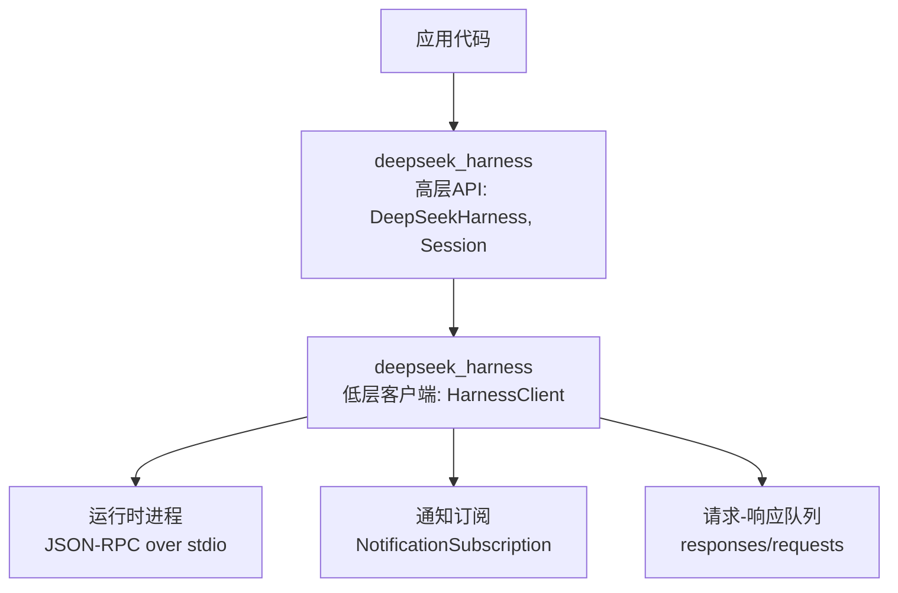
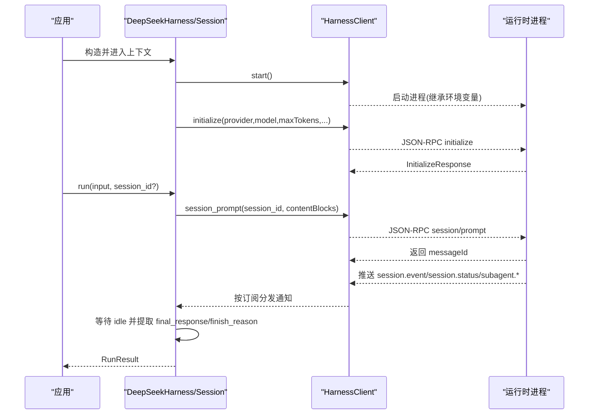
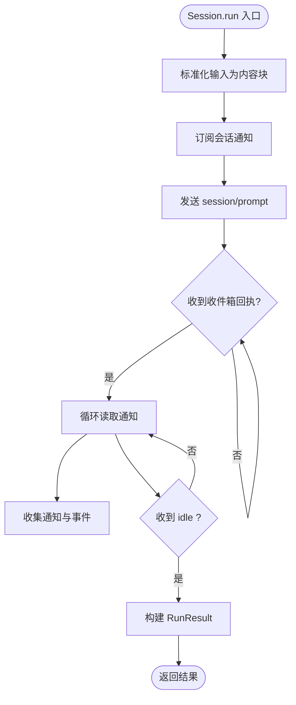
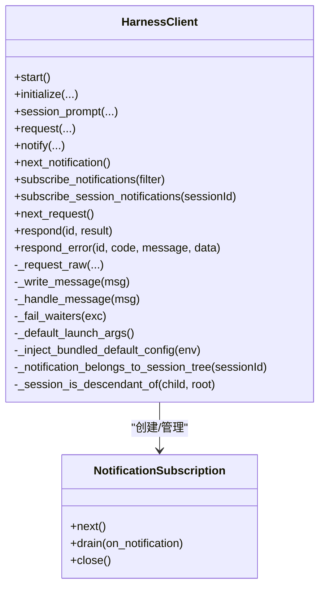
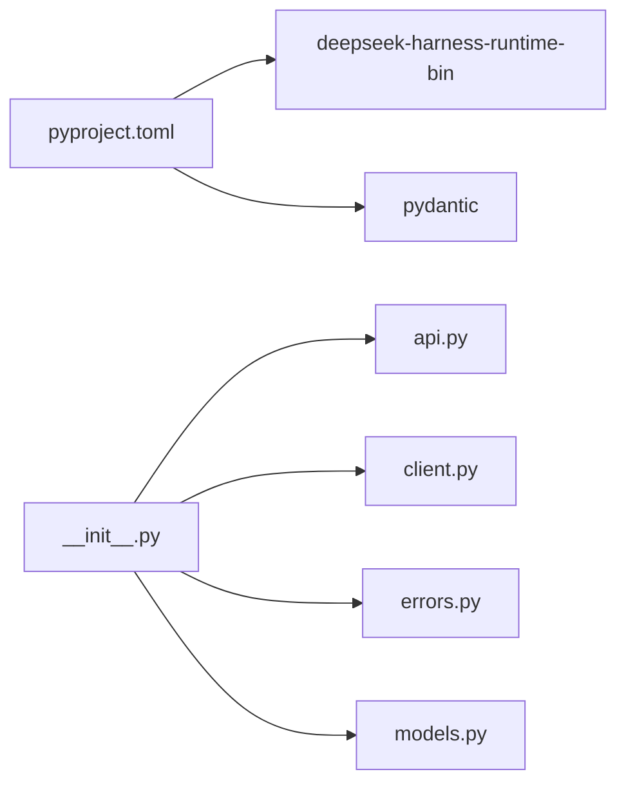

# 基础使用

<cite>
**本文引用的文件**
- [README.md](file://python/sdk/README.md)
- [pyproject.toml](file://python/sdk/pyproject.toml)
- [__init__.py](file://python/sdk/src/deepseek_harness/__init__.py)
- [api.py](file://python/sdk/src/deepseek_harness/api.py)
- [client.py](file://python/sdk/src/deepseek_harness/client.py)
- [models.py](file://python/sdk/src/deepseek_harness/models.py)
- [errors.py](file://python/sdk/src/deepseek_harness/errors.py)
- [minimal.py](file://examples/jsonrpc-agent/minimal.py)
- [test_client.py](file://python/sdk/tests/test_client.py)
</cite>

## 目录
1. [简介](#简介)
2. [项目结构](#项目结构)
3. [核心组件](#核心组件)
4. [架构总览](#架构总览)
5. [详细组件分析](#详细组件分析)
6. [依赖关系分析](#依赖关系分析)
7. [性能与可靠性](#性能与可靠性)
8. [故障排查指南](#故障排查指南)
9. [结论](#结论)
10. [附录：常见用法示例路径](#附录：常见用法示例路径)

## 简介
本文件面向首次使用 DeepSeek Harness Python SDK 的开发者，聚焦“如何快速上手”和“基本交互模式”。你将了解：
- 如何安装并初始化客户端连接
- 如何创建会话、发送消息、等待结果
- 如何处理通知、事件与子代理（subagent）生命周期
- 如何进行错误处理与异常捕获的最佳实践
- 如何通过配置切换模型、工作目录、会话根目录等运行参数

SDK 通过 JSON-RPC over stdio 启动一个本地运行时进程，复用该进程完成多次对话轮次。你可以使用高层 API（DeepSeekHarness/Session）或低层 API（HarnessClient）进行控制。

## 项目结构
Python SDK 位于 python/sdk 目录，核心代码在 src/deepseek_harness 下，提供高层 API、JSON-RPC 客户端、数据模型与错误类型；测试与示例位于 tests 与 examples 目录。

图表来源
- [api.py:48-124](file://python/sdk/src/deepseek_harness/api.py#L48-L124)
- [client.py:37-155](file://python/sdk/src/deepseek_harness/client.py#L37-L155)

章节来源
- [pyproject.toml:1-38](file://python/sdk/pyproject.toml#L1-L38)
- [__init__.py:1-20](file://python/sdk/src/deepseek_harness/__init__.py#L1-L20)

## 核心组件
- DeepSeekHarness：高层入口，封装运行时进程生命周期、初始化与会话管理，支持上下文管理器。
- Session：表示一次会话，封装 run() 方法，负责等待会话空闲并收集最终回复与事件。
- RunResult：单次 run() 的结果，包含 session_id、final_response、finish_reason、events、notifications、session_root。
- HarnessConfig / DeepSeekHarnessConfig：运行时与高层配置，如 provider、model、max_tokens、cwd、runtime_cwd、session_root、cordis、env、超时等。
- HarnessClient：低层 JSON-RPC 客户端，负责启动/关闭进程、发送请求、接收通知、维护订阅与父子会话关系。
- NotificationSubscription：通知订阅句柄，支持 next()/drain() 与自动关闭。
- 数据模型：Notification、IncomingRequest、ServerInfo、InitializeResponse、JsonObject/JsonValue。
- 错误类型：HarnessError、TransportClosedError、SdkProtocolError、JsonRpcError。

章节来源
- [api.py:13-46](file://python/sdk/src/deepseek_harness/api.py#L13-L46)
- [api.py:48-183](file://python/sdk/src/deepseek_harness/api.py#L48-L183)
- [client.py:24-55](file://python/sdk/src/deepseek_harness/client.py#L24-L55)
- [client.py:37-155](file://python/sdk/src/deepseek_harness/client.py#L37-L155)
- [models.py:1-33](file://python/sdk/src/deepseek_harness/models.py#L1-L33)
- [errors.py:1-24](file://python/sdk/src/deepseek_harness/errors.py#L1-L24)

## 架构总览
SDK 采用“进程内调用 + 外部运行时”的架构：应用通过 Python 进程启动一个独立的运行时进程，两者通过标准输入输出以 JSON-RPC 协议通信。SDK 内部维护请求-响应映射、通知订阅与子代理关系图，确保多会话并发下的正确路由与隔离。

图表来源
- [api.py:97-124](file://python/sdk/src/deepseek_harness/api.py#L97-L124)
- [api.py:127-183](file://python/sdk/src/deepseek_harness/api.py#L127-L183)
- [client.py:63-155](file://python/sdk/src/deepseek_harness/client.py#L63-L155)

## 详细组件分析

### 高层 API：DeepSeekHarness 与 Session
- 初始化与启动：支持传入配置对象或关键字参数；内部会解析 cwd/runtime_cwd，注入环境变量（如 DSH_SESSION_ROOT、DSH_CORDIS_CONFIG、DEEPSEEK_BASE_URL、DEEPSEEK_API_KEY），然后启动底层客户端并执行 initialize。
- 会话创建：start_session() 可复用已启动的运行时，并为每次 run 生成或复用 session_id。
- 运行流程：Session.run() 将字符串输入标准化为内容块，订阅会话通知，发送 prompt，循环读取通知直到收到目标会话的 idle 状态，最后从事件中提取最终回复与结束原因。
- 结果语义：RunResult.events 仅包含根会话事件；notifications 包含根会话及已知后代的所有通知（包括子代理生命周期）。

图表来源
- [api.py:127-183](file://python/sdk/src/deepseek_harness/api.py#L127-L183)
- [api.py:199-243](file://python/sdk/src/deepseek_harness/api.py#L199-L243)

章节来源
- [api.py:48-124](file://python/sdk/src/deepseek_harness/api.py#L48-L124)
- [api.py:127-183](file://python/sdk/src/deepseek_harness/api.py#L127-L183)
- [api.py:199-243](file://python/sdk/src/deepseek_harness/api.py#L199-L243)

### 低层客户端：HarnessClient
- 进程管理：start() 根据配置选择运行时二进制或桥接程序，注入默认配置（当未显式覆盖且未设置 DSH_CORDIS_CONFIG 时），启动子进程并开启读写线程。
- 请求-响应：request() 包装 _request_raw()，支持超时、通知回调、通知过滤与订阅；失败时清理资源。
- 通知系统：subscribe_notifications()/subscribe_session_notifications() 基于过滤器匹配通知归属；维护子代理父子关系，使父会话能收到后代通知。
- 关闭流程：close() 先尝试 graceful shutdown，再终止进程，清理等待者与订阅者，报告诊断信息（退出码、stderr 尾部）。

图表来源
- [client.py:37-155](file://python/sdk/src/deepseek_harness/client.py#L37-L155)
- [client.py:157-296](file://python/sdk/src/deepseek_harness/client.py#L157-L296)
- [client.py:507-546](file://python/sdk/src/deepseek_harness/client.py#L507-L546)

章节来源
- [client.py:63-155](file://python/sdk/src/deepseek_harness/client.py#L63-L155)
- [client.py:157-296](file://python/sdk/src/deepseek_harness/client.py#L157-L296)
- [client.py:318-397](file://python/sdk/src/deepseek_harness/client.py#L318-L397)
- [client.py:424-504](file://python/sdk/src/deepseek_harness/client.py#L424-L504)
- [client.py:507-546](file://python/sdk/src/deepseek_harness/client.py#L507-L546)

### 数据模型与错误类型
- 数据模型：
  - Notification：method + payload
  - IncomingRequest：id + method + payload
  - ServerInfo/InitializeResponse：用于 initialize 响应
  - JsonObject/JsonValue：通用 JSON 类型别名
- 错误类型：
  - HarnessError：基类
  - TransportClosedError：运行时进程退出或 stdout 关闭
  - SdkProtocolError：运行时违反 SDK 协议（例如 turn/end 缺少 reason.kind）
  - JsonRpcError：运行时返回 JSON-RPC 错误

章节来源
- [models.py:1-33](file://python/sdk/src/deepseek_harness/models.py#L1-L33)
- [errors.py:1-24](file://python/sdk/src/deepseek_harness/errors.py#L1-L24)

## 依赖关系分析
- 包元数据：依赖 pydantic 与 deepseek-harness-runtime-bin；可通过 uv 的 editable 指向 sdk-runtime 以便开发调试。
- 模块导入：顶层 __init__.py 统一导出高层 API、客户端、错误与模型，便于应用直接 import deepseek_harness。

图表来源
- [pyproject.toml:1-38](file://python/sdk/pyproject.toml#L1-L38)
- [__init__.py:1-20](file://python/sdk/src/deepseek_harness/__init__.py#L1-L20)

章节来源
- [pyproject.toml:1-38](file://python/sdk/pyproject.toml#L1-L38)
- [__init__.py:1-20](file://python/sdk/src/deepseek_harness/__init__.py#L1-L20)

## 性能与可靠性
- 进程复用：DeepSeekHarness 持有运行时进程，多次 run() 无需重复启动，降低开销。
- 超时控制：
  - request_timeout_seconds：限制单个请求等待响应的最长时间。
  - shutdown_timeout_seconds：限制优雅关闭的最长时间，超时后强制终止。
- 通知与事件：
  - events 仅包含根会话事件，避免子代理消息污染最终回复。
  - notifications 包含根会话与已知后代的通知，适合追踪完整执行轨迹。
- 健壮性：
  - 忽略非 JSON 行输出，提升对运行时日志的容忍度。
  - 关闭时收集 stderr 尾部与退出码，便于定位问题。
- 并发安全：读写锁保护 stdin 写入；线程安全的队列与订阅机制。

[本节为通用指导，不直接分析具体文件]

## 故障排查指南
- 运行时未启动或已退出：
  - 现象：抛出 TransportClosedError。
  - 排查：检查进程是否成功启动；查看 close() 中收集的 stderr 尾部与退出码。
- 请求超时：
  - 现象：TimeoutError，提示等待响应超时。
  - 排查：增大 request_timeout_seconds；确认运行时是否卡住；查看 stderr 诊断。
- 协议违规：
  - 现象：SdkProtocolError，例如 turn/end 缺少 reason.kind。
  - 排查：检查运行时事件是否符合 SDK 协议约定。
- JSON-RPC 错误：
  - 现象：JsonRpcError，携带 code/message/data。
  - 排查：根据错误码与消息定位运行时侧问题。
- 通知过滤异常：
  - 现象：自定义过滤器抛异常会被传播到对应订阅者，不影响其他订阅。
  - 排查：修复过滤器逻辑；必要时移除有问题的订阅。

章节来源
- [errors.py:1-24](file://python/sdk/src/deepseek_harness/errors.py#L1-L24)
- [client.py:87-116](file://python/sdk/src/deepseek_harness/client.py#L87-L116)
- [client.py:228-296](file://python/sdk/src/deepseek_harness/client.py#L228-L296)
- [client.py:399-422](file://python/sdk/src/deepseek_harness/client.py#L399-L422)
- [api.py:225-243](file://python/sdk/src/deepseek_harness/api.py#L225-L243)

## 结论
DeepSeek Harness Python SDK 提供了从高层到低层的完整能力：高层 API 简化了会话管理与结果处理，低层客户端提供了灵活的进程控制与通知路由。通过合理的配置与错误处理策略，你可以在文本对话、文件处理与工具调用等场景中稳定地驱动 Agent 执行。

[本节为总结，不直接分析具体文件]

## 附录：常见用法示例路径
- 最小化端到端示例：命令行脚本演示如何启动 harness 并打印最终回复。
  - 参考路径：[examples/jsonrpc-agent/minimal.py](file://examples/jsonrpc-agent/minimal.py)
- 单元测试中的典型流程：
  - 验证高层 API 运行一轮并收集最终回复与结束原因。
  - 验证通知回调在返回前被调用。
  - 验证子代理生命周期通知的归属与聚合。
  - 验证相对路径在工作目录与环境变量中的一致性。
  - 验证请求超时与关闭超时的行为。
  - 参考路径：[python/sdk/tests/test_client.py](file://python/sdk/tests/test_client.py)
- 手动冒烟测试：
  - 通过内置默认配置与本地 HTTP 模型端点，验证 SDK 与运行时集成。
  - 参考路径：[python/sdk/tests/manual_sdk_agent_smoke.py](file://python/sdk/tests/manual_sdk_agent_smoke.py)
- 官方 README 中的安装与快速开始：
  - 参考路径：[python/sdk/README.md](file://python/sdk/README.md)