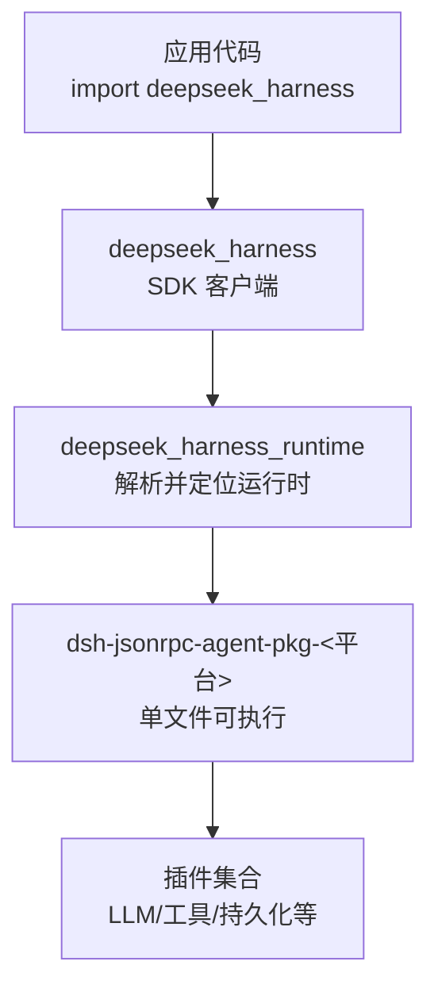
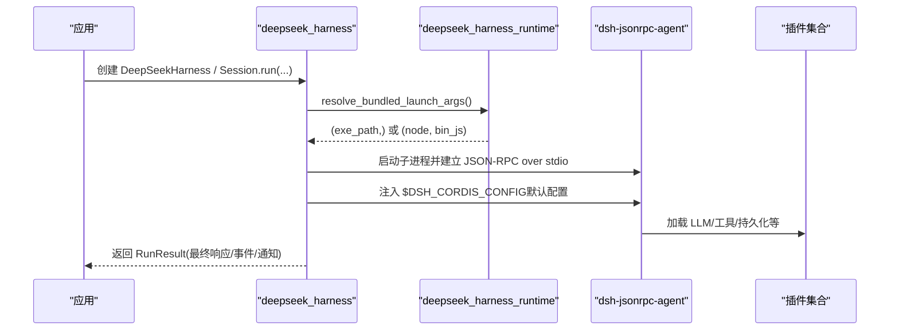
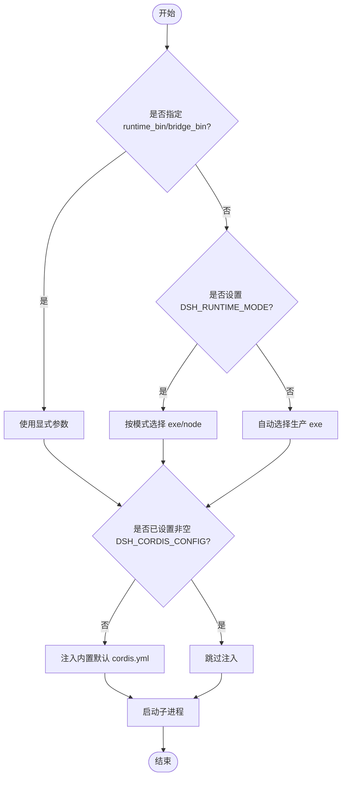

# 安装与配置

<cite>
**本文引用的文件**
- [python/sdk/pyproject.toml](file://python/sdk/pyproject.toml)
- [python/sdk-runtime/pyproject.toml](file://python/sdk-runtime/pyproject.toml)
- [python/README.md](file://python/README.md)
- [python/sdk/README.md](file://python/sdk/README.md)
- [python/sdk-runtime/README.md](file://python/sdk-runtime/README.md)
- [docs/user/guide/python-sdk.md](file://docs/user/guide/python-sdk.md)
- [examples/jsonrpc-agent/README.md](file://examples/jsonrpc-agent/README.md)
- [examples/jsonrpc-agent/cordis.yml](file://examples/jsonrpc-agent/cordis.yml)
- [python/sdk/src/deepseek_harness/__init__.py](file://python/sdk/src/deepseek_harness/__init__.py)
- [python/sdk/src/deepseek_harness/client.py](file://python/sdk/src/deepseek_harness/client.py)
- [python/sdk/src/deepseek_harness/errors.py](file://python/sdk/src/deepseek_harness/errors.py)
- [python/sdk-runtime/src/deepseek_harness_runtime/__init__.py](file://python/sdk-runtime/src/deepseek_harness_runtime/__init__.py)
</cite>

## 目录
1. [简介](#简介)
2. [项目结构](#项目结构)
3. [核心组件](#核心组件)
4. [架构总览](#架构总览)
5. [详细组件分析](#详细组件分析)
6. [依赖与兼容性](#依赖与兼容性)
7. [安装方法](#安装方法)
8. [运行时环境配置](#运行时环境配置)
9. [不同部署场景的配置示例](#不同部署场景的配置示例)
10. [故障排除指南](#故障排除指南)
11. [结论](#结论)

## 简介
本章节面向首次使用 DeepSeek Harness Python SDK 的用户，说明如何安装、配置并运行 SDK。SDK 通过子进程启动内置的运行时（JSON-RPC over stdio），并提供高层 API 以调用模型、工具与持久化能力。默认情况下无需系统级 Node.js 即可运行生产构建的单文件可执行产物；开发模式可使用源码树中的 Node 闭包进行调试。

## 项目结构
Python SDK 由两个主要包组成：
- deepseek-harness-sdk（模块名 deepseek_harness）：提供高层会话 API 与低层 JSON-RPC 客户端。
- deepseek-harness-runtime-bin（模块名 deepseek_harness_runtime）：打包平台相关的运行时二进制与默认配置，供 SDK 自动发现与注入。

图表来源
- [python/sdk/README.md:10-27](file://python/sdk/README.md#L10-L27)
- [python/sdk-runtime/README.md:7-18](file://python/sdk-runtime/README.md#L7-L18)

章节来源
- [python/README.md:7-16](file://python/README.md#L7-L16)
- [python/sdk/README.md:10-27](file://python/sdk/README.md#L10-L27)
- [python/sdk-runtime/README.md:7-18](file://python/sdk-runtime/README.md#L7-L18)

## 核心组件
- 高层入口：DeepSeekHarness、Session、RunResult 等，封装了子进程生命周期、会话管理与结果语义。
- 低层客户端：HarnessClient/HarnessConfig，负责选择运行时通道、注入默认配置、环境变量与路径解析。
- 运行时载体：deepseek_harness_runtime 提供 resolve_bundled_launch_args、bundled_runtime_path、bundled_default_config_path 等解析接口，确保 SDK 能定位到正确的可执行与默认配置。

章节来源
- [python/sdk/src/deepseek_harness/__init__.py:1-19](file://python/sdk/src/deepseek_harness/__init__.py#L1-L19)
- [python/sdk/src/deepseek_harness/client.py:424-439](file://python/sdk/src/deepseek_harness/client.py#L424-L439)
- [python/sdk-runtime/src/deepseek_harness_runtime/__init__.py:55-100](file://python/sdk-runtime/src/deepseek_harness_runtime/__init__.py#L55-L100)

## 架构总览
SDK 启动流程概览（从应用调用到运行时执行）：

图表来源
- [python/sdk/README.md:25-51](file://python/sdk/README.md#L25-L51)
- [python/sdk-runtime/README.md:22-31](file://python/sdk-runtime/README.md#L22-L31)
- [python/sdk/src/deepseek_harness/client.py:424-439](file://python/sdk/src/deepseek_harness/client.py#L424-L439)

## 详细组件分析

### SDK 客户端与运行时选择
- 运行时选择优先级：显式 runtime_bin/bridge_bin > 环境变量 DSH_RUNTIME_MODE > 自动选择（仅生产 exe）。
- 当未显式传入 cordis 且未设置非空 DSH_CORDIS_CONFIG 时，SDK 会注入内置默认配置文件路径至 DSH_CORDIS_CONFIG。
- 若缺少 deepseek_harness_runtime 模块，将抛出 FileNotFoundError，提示安装对应 wheel 或设置 runtime_bin。

图表来源
- [python/sdk-runtime/README.md:22-31](file://python/sdk-runtime/README.md#L22-L31)
- [python/sdk/README.md:27-51](file://python/sdk/README.md#L27-L51)
- [python/sdk/src/deepseek_harness/client.py:424-439](file://python/sdk/src/deepseek_harness/client.py#L424-L439)

章节来源
- [python/sdk/src/deepseek_harness/client.py:424-439](file://python/sdk/src/deepseek_harness/client.py#L424-L439)
- [python/sdk-runtime/README.md:22-31](file://python/sdk-runtime/README.md#L22-L31)
- [python/sdk/README.md:27-51](file://python/sdk/README.md#L27-L51)

### 默认配置与插件集
- 默认配置位于运行时包的 runtime/cordis.yml，包含 JSON-RPC 服务端、Agent 核心、预装 DeepSeek 适配器、JSONL 会话持久化、本地 Bash、文件系统提供者等。
- 该配置通过环境变量读取关键行为，如工作目录、会话根目录、系统提示词、最大 token 策略等。

章节来源
- [python/sdk-runtime/README.md:29-31](file://python/sdk-runtime/README.md#L29-L31)
- [examples/jsonrpc-agent/cordis.yml:1-90](file://examples/jsonrpc-agent/cordis.yml#L1-L90)

## 依赖与兼容性
- Python 版本要求：>= 3.10。
- 平台支持：Linux x64、Linux arm64、macOS（arm64 需 macOS 14+）。
- 依赖项：
  - pydantic（用于数据模型校验）
  - deepseek-harness-runtime-bin（平台相关运行时 wheel，含 dsh-jsonrpc-agent 及 ripgrep 侧车）
- 可选：Node.js 仅在开发模式下使用源码闭包（node 载体）；生产模式无需 Node。

章节来源
- [python/sdk/pyproject.toml:5-16](file://python/sdk/pyproject.toml#L5-L16)
- [python/sdk-runtime/pyproject.toml:5-10](file://python/sdk-runtime/pyproject.toml#L5-L10)
- [docs/user/guide/python-sdk.md:7-13](file://docs/user/guide/python-sdk.md#L7-L13)
- [python/sdk-runtime/README.md:7-18](file://python/sdk-runtime/README.md#L7-L18)

## 安装方法

### 通过 pip 安装（推荐）
- 安装 SDK 包会自动安装同版本的运行时 wheel：
  - 命令参考：python -m pip install deepseek-harness-sdk
- 安装后无需额外参数即可使用默认配置运行。

章节来源
- [python/sdk/README.md:10-23](file://python/sdk/README.md#L10-L23)
- [python/sdk/pyproject.toml:13-16](file://python/sdk/pyproject.toml#L13-L16)

### 源码安装（开发者）
- 在仓库中可通过 uv 的 editable 源指向 sdk-runtime，便于本地开发与验证。
- 贡献者如需构建运行时或 wheels，请参考 Python 贡献工作流文档。

章节来源
- [python/sdk/pyproject.toml:34-37](file://python/sdk/pyproject.toml#L34-L37)
- [docs/user/guide/python-sdk.md:27-27](file://docs/user/guide/python-sdk.md#L27-L27)

## 运行时环境配置

### 环境变量
- DEEPSEEK_API_KEY：认证凭据，传递给 OpenAI 兼容端点。
- DEEPSEEK_BASE_URL：OpenAI 兼容端点地址（代理或自建服务）。
- DSH_CWD：Agent 工作目录（bash 与文件系统工具）。
- DSH_SESSION_ROOT：JSONL 会话目录。
- DSH_SYSTEM_PROMPT：部署提供的系统提示词。
- DSH_MODEL：默认模型（可由命令行或配置覆盖）。
- DSH_MAX_TOKENS_AS_SUCCESS：是否将 token 限制的结果视为成功（默认 true）。
- DSH_CORDIS_CONFIG：显式指定 Cordis 配置文件路径；SDK 在未显式传入时会注入内置默认配置路径。
- DSH_HOME：覆盖默认用户数据根目录（~/.dsh）。

章节来源
- [examples/jsonrpc-agent/README.md:16-29](file://examples/jsonrpc-agent/README.md#L16-L29)
- [examples/jsonrpc-agent/cordis.yml:22-44](file://examples/jsonrpc-agent/cordis.yml#L22-L44)
- [packages/util/home-paths/src/index.ts:76-112](file://packages/util/home-paths/src/index.ts#L76-L112)

### 配置文件格式与路径
- Cordis 配置文件采用 YAML 列表形式，定义插件 ID、名称与配置项。
- 默认配置路径由运行时包提供；SDK 会在合适时机将其注入为 DSH_CORDIS_CONFIG。
- 自定义配置可替换默认配置，保留 @deepseek-ai/dsh-sdk-jsonrpc-server 条目以启用 JSON-RPC 通道。

章节来源
- [python/sdk-runtime/README.md:29-31](file://python/sdk-runtime/README.md#L29-L31)
- [python/sdk/README.md:27-43](file://python/sdk/README.md#L27-L43)
- [examples/jsonrpc-agent/cordis.yml:1-90](file://examples/jsonrpc-agent/cordis.yml#L1-L90)

## 不同部署场景的配置示例

### 本地开发
- 使用 SDK 默认配置快速运行，或通过 cordis 参数指定本地配置文件。
- 设置 DEEPSEEK_API_KEY 与可选的 DEEPSEEK_BASE_URL。
- 通过 cwd 与 session_root 指定工作区与会话目录。

章节来源
- [docs/user/guide/python-sdk.md:15-48](file://docs/user/guide/python-sdk.md#L15-L48)
- [python/sdk/README.md:27-43](file://python/sdk/README.md#L27-L43)

### 测试环境
- 使用独立的 session_root 隔离会话日志。
- 通过 DSH_MAX_TOKENS_AS_SUCCESS=false 将 token 限制视为错误，便于断言。
- 可选择最小化插件集（如 minimal.cordis.yml）以减少副作用。

章节来源
- [examples/jsonrpc-agent/README.md:31-41](file://examples/jsonrpc-agent/README.md#L31-L41)
- [examples/jsonrpc-agent/cordis.yml:39-44](file://examples/jsonrpc-agent/cordis.yml#L39-L44)

### 生产环境
- 使用生产可执行（dsh-jsonrpc-agent-pkg-<平台>），无需 Node.js。
- 通过 DSH_CORDIS_CONFIG 指向受控的配置文件，避免注入默认配置。
- 明确设置 DEEPSEEK_BASE_URL 指向内部代理或网关，配合密钥管理。
- 建议固定会话根目录与权限控制，结合压缩策略（zstd）提升存储效率。

章节来源
- [python/sdk-runtime/README.md:7-18](file://python/sdk-runtime/README.md#L7-L18)
- [examples/jsonrpc-agent/cordis.yml:39-44](file://examples/jsonrpc-agent/cordis.yml#L39-L44)
- [python/sdk/README.md:27-51](file://python/sdk/README.md#L27-L51)

## 故障排除指南

### 常见错误与处理
- 缺少运行时可执行或侧车：
  - 现象：FileNotFoundError，提示无法定位 bundled runtime。
  - 处理：安装 deepseek-harness-runtime-bin 或设置 HarnessConfig.runtime_bin；确保平台 wheel 匹配。
- 缺少默认配置文件：
  - 现象：FileNotFoundError，提示缺失 runtime/cordis.yml。
  - 处理：重新安装运行时包或检查包完整性。
- 传输关闭或协议错误：
  - 现象：TransportClosedError、SdkProtocolError、JsonRpcError。
  - 处理：检查子进程状态、stderr 输出与 JSON-RPC 响应；确认配置与插件加载正确。

章节来源
- [python/sdk/src/deepseek_harness/client.py:424-439](file://python/sdk/src/deepseek_harness/client.py#L424-L439)
- [python/sdk-runtime/src/deepseek_harness_runtime/__init__.py:55-100](file://python/sdk-runtime/src/deepseek_harness_runtime/__init__.py#L55-L100)
- [python/sdk/src/deepseek_harness/errors.py:4-24](file://python/sdk/src/deepseek_harness/errors.py#L4-L24)

### 环境与路径问题
- 工作目录与会话目录：
  - 确保 cwd 与 session_root 为绝对路径，避免相对路径导致权限或可见性问题。
- 系统提示词与模型：
  - 通过 DSH_SYSTEM_PROMPT 与 DSH_MODEL 调整行为；注意命令行参数优先于环境变量。
- 用户数据根目录：
  - 通过 DSH_HOME 覆盖默认 ~/.dsh 位置，确保目标路径存在且可写。

章节来源
- [examples/jsonrpc-agent/README.md:16-29](file://examples/jsonrpc-agent/README.md#L16-L29)
- [examples/jsonrpc-agent/cordis.yml:22-44](file://examples/jsonrpc-agent/cordis.yml#L22-L44)
- [packages/util/home-paths/src/index.ts:76-112](file://packages/util/home-paths/src/index.ts#L76-L112)

## 结论
DeepSeek Harness Python SDK 提供了简洁的高层 API 与稳定的运行时载体，支持零配置快速上手与灵活的生产部署。通过合理设置环境变量与 Cordis 配置，可在本地、测试与生产环境中稳定运行。遇到安装或运行时问题时，依据错误信息定位缺失的可执行、侧车或配置文件，并按指引修复。