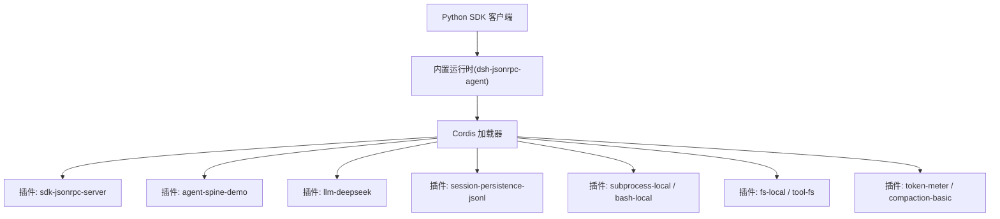
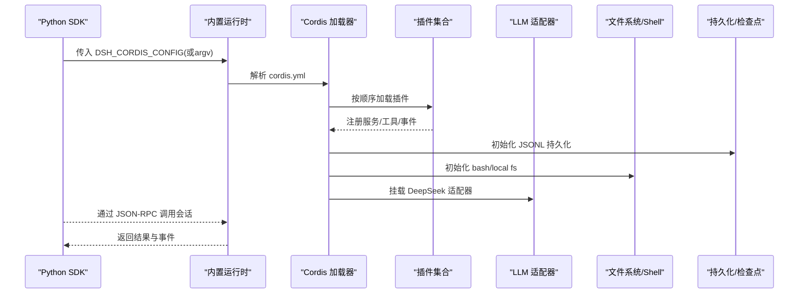
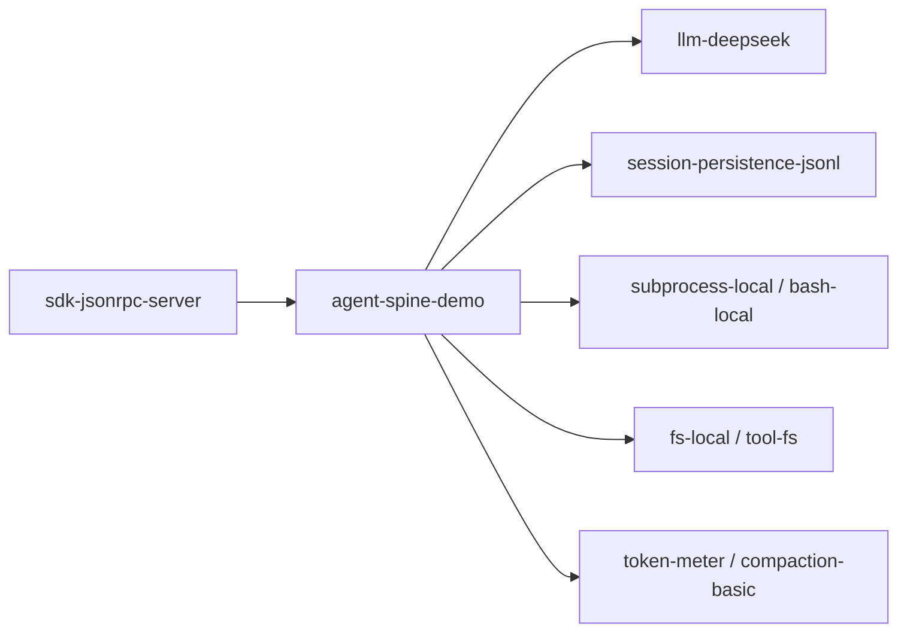

# 运行时配置

<cite>
**本文引用的文件**
- [python/sdk-runtime/README.md](file://python/sdk-runtime/README.md)
- [python/sdk-runtime/README.zh.md](file://python/sdk-runtime/README.zh.md)
- [python/sdk-runtime/src/deepseek_harness_runtime/runtime/cordis.yml](file://python/sdk-runtime/src/deepseek_harness_runtime/runtime/cordis.yml)
- [python/sdk/README.md](file://python/sdk/README.md)
- [examples/jsonrpc-agent/cordis.yml](file://examples/jsonrpc-agent/cordis.yml)
- [examples/headless-agent/cordis.yml](file://examples/headless-agent/cordis.yml)
- [apps/cli/config/agent-presets/standard/agent.cordis.yml](file://apps/cli/config/agent-presets/standard/agent.cordis.yml)
- [docs/config-catalog.md](file://docs/config-catalog.md)
- [docs/cordis-api/registry.md](file://docs/cordis-api/registry.md)
- [packages/session/session-telemetry-otel/src/index.ts](file://packages/session/session-telemetry-otel/src/index.ts)
</cite>

## 目录
1. [简介](#简介)
2. [项目结构](#项目结构)
3. [核心组件](#核心组件)
4. [架构总览](#架构总览)
5. [详细组件分析](#详细组件分析)
6. [依赖关系分析](#依赖关系分析)
7. [性能与资源限制](#性能与资源限制)
8. [故障排查指南](#故障排查指南)
9. [结论](#结论)
10. [附录](#附录)

## 简介
本文件面向 DeepSeek Harness Python SDK 的运行时配置，聚焦以下目标：
- 说明运行时的配置选项与环境变量设置。
- 解释 Cordis 配置文件结构与语法（插件注册、服务配置、权限相关）。
- 提供不同运行模式的配置示例：无头模式、Web 模式、集成模式。
- 给出性能调优参数与资源限制建议。
- 说明运行时监控与日志的配置方法。

## 项目结构
Python SDK 通过子进程启动内置的 JSON-RPC 运行时，默认使用仓库内嵌的 cordis.yml 作为“零配置”组合；也可通过环境变量或构造参数切换到自定义组合。关键路径包括：
- 运行时载体与默认配置：python/sdk-runtime/*
- Python SDK 客户端注入逻辑与约定：python/sdk/README.md
- 示例组合：examples/*/cordis.yml
- CLI 预设组合（Web/CLI 场景）：apps/cli/config/agent-presets/*
- 全量插件配置目录：docs/config-catalog.md
- Cordis 插件注册与依赖注入规范：docs/cordis-api/registry.md

图表来源
- [python/sdk-runtime/README.md:22-31](file://python/sdk-runtime/README.md#L22-L31)
- [python/sdk-runtime/src/deepseek_harness_runtime/runtime/cordis.yml:1-50](file://python/sdk-runtime/src/deepseek_harness_runtime/runtime/cordis.yml#L1-L50)
- [examples/jsonrpc-agent/cordis.yml:1-90](file://examples/jsonrpc-agent/cordis.yml#L1-L90)

章节来源
- [python/sdk-runtime/README.md:22-31](file://python/sdk-runtime/README.md#L22-L31)
- [python/sdk-runtime/src/deepseek_harness_runtime/runtime/cordis.yml:1-50](file://python/sdk-runtime/src/deepseek_harness_runtime/runtime/cordis.yml#L1-L50)
- [python/sdk/README.md:25-52](file://python/sdk/README.md#L25-L52)

## 核心组件
- 运行时载体与解析 API
  - 支持 exe（生产）与 node（开发）两种载体；自动选择策略优先生产 exe。
  - 提供解析启动参数、定位内置可执行、默认配置路径等能力。
- 零配置设计
  - 运行时始终要求显式配置（DSH_CORDIS_CONFIG 或 argv 位置参数）。
  - SDK 在默认情况下将内置 cordis.yml 路径注入到 DSH_CORDIS_CONFIG，实现“零配置”体验。
- 默认组合内容
  - 包含 JSON-RPC 服务端、Agent 核心、DeepSeek 适配器、JSONL 持久化、检查点策略、本地 Bash、本地文件系统提供者等。

章节来源
- [python/sdk-runtime/README.md:7-31](file://python/sdk-runtime/README.md#L7-L31)
- [python/sdk-runtime/README.zh.md:7-31](file://python/sdk-runtime/README.zh.md#L7-L31)
- [python/sdk-runtime/src/deepseek_harness_runtime/runtime/cordis.yml:1-50](file://python/sdk-runtime/src/deepseek_harness_runtime/runtime/cordis.yml#L1-L50)
- [python/sdk/README.md:25-52](file://python/sdk/README.md#L25-L52)

## 架构总览
下图展示 Python SDK 启动内置运行时并加载 Cordis 配置的典型流程。

图表来源
- [python/sdk-runtime/src/deepseek_harness_runtime/runtime/cordis.yml:1-50](file://python/sdk-runtime/src/deepseek_harness_runtime/runtime/cordis.yml#L1-L50)
- [examples/jsonrpc-agent/cordis.yml:1-90](file://examples/jsonrpc-agent/cordis.yml#L1-L90)

## 详细组件分析

### Cordis 配置文件结构与语法
- 基本语法
  - 以 YAML 列表形式声明插件条目，每个条目包含 id、name、config。
  - 可使用 !!js 表达式读取环境变量或计算值。
- 插件注册与服务装配
  - 通过 name 指定插件包名，id 用于唯一标识。
  - 插件之间通过服务键进行依赖与装配，遵循 Cordis 注册表与依赖注入规则。
- 权限与安全
  - 权限策略由宿主层与沙箱策略共同决定；插件自身不直接持有全局权限开关。
  - 工作区与文件系统访问受沙箱策略与工作目录控制。

章节来源
- [python/sdk-runtime/src/deepseek_harness_runtime/runtime/cordis.yml:1-50](file://python/sdk-runtime/src/deepseek_harness_runtime/runtime/cordis.yml#L1-L50)
- [docs/cordis-api/registry.md:60-153](file://docs/cordis-api/registry.md#L60-L153)

### 环境变量与运行时开关
- 运行时与配置
  - DSH_CORDIS_CONFIG：指定要加载的 cordis.yml 路径；SDK 默认会注入内置配置路径。
  - DSH_RUNTIME_MODE：选择内置运行时载体模式（exe | node），仅开发调试使用。
- 模型与凭据
  - DEEPSEEK_API_KEY、DEEPSEEK_BASE_URL：被 DeepSeek 适配器读取，用于鉴权与端点。
- 工作区与持久化
  - DSH_SESSION_ROOT：JSONL 持久化根目录（未设置时回退至进程当前目录下的 .sessions）。
  - DSH_CWD：bash 与本地文件系统提供者的工作目录（未设置时回退至进程当前目录）。
  - DSH_SNAPSHOT：影响 JSONL 压缩格式（zstd 或 none）。
- Web/CLI 相关
  - DSH_WEB_URL、DSH_WEB_MODE：由宿主注入，供 shell 工具感知 Web 环境。
  - DSH_SYSTEM_PROMPT：覆盖系统提示词。
  - DSH_MAX_TOKENS_AS_SUCCESS：控制达到最大 token 是否视为成功。

章节来源
- [python/sdk-runtime/README.md:22-31](file://python/sdk-runtime/README.md#L22-L31)
- [python/sdk-runtime/src/deepseek_harness_runtime/runtime/cordis.yml:23-49](file://python/sdk-runtime/src/deepseek_harness_runtime/runtime/cordis.yml#L23-L49)
- [examples/jsonrpc-agent/cordis.yml:6-8,24-27,41-44,30-37:6-8](file://examples/jsonrpc-agent/cordis.yml#L6-L8)
- [examples/headless-agent/cordis.yml:6-17,23-33,38-42,63-68,157-160:6-17](file://examples/headless-agent/cordis.yml#L6-L17)
- [apps/cli/config/agent-presets/standard/agent.cordis.yml:37-43](file://apps/cli/config/agent-presets/standard/agent.cordis.yml#L37-L43)

### 不同运行模式的配置示例

#### 无头模式（Headless）
- 特点
  - 一次性编码助手，stdout 保持纯输出，适合自动化任务。
  - 预创建 main Agent，启用持久化、检查点、子代理与工具集。
- 关键配置要点
  - 设置 DeepSeek 适配器与模型上下文窗口。
  - 配置 bash 超时、工作目录。
  - 启用 JSONL 持久化与压缩策略。
  - 启用 token meter 与基础压缩策略。
  - 可选：启用 subagent/fork 工具、workflow、tool-ralph、todo、fs 工具等。

章节来源
- [examples/headless-agent/cordis.yml:1-167](file://examples/headless-agent/cordis.yml#L1-L167)

#### Web 模式（CLI/Web）
- 特点
  - 通过 CLI 启动 Web 服务，浏览器与后端交互。
  - 使用 preset 组合（如 standard）挂载模型可见的工具与技能。
- 关键配置要点
  - 平台相关的 bash/pwsh 工具启用策略。
  - 工作区指令加载、计划模式、压缩策略、委派与工具链。
  - Web 服务信任主机、请求体大小限制等由宿主侧管理。

章节来源
- [apps/cli/config/agent-presets/standard/agent.cordis.yml:1-253](file://apps/cli/config/agent-presets/standard/agent.cordis.yml#L1-L253)

#### 集成模式（JSON-RPC 集成）
- 特点
  - 通过 stdio JSON-RPC 暴露给外部进程（Python SDK）调用。
  - 默认组合包含 JSON-RPC 服务器、Agent 核心、DeepSeek 适配器、持久化、bash、文件系统、token meter、压缩策略。
- 关键配置要点
  - 设置 maxTokensAsSuccess 行为。
  - 配置 bash 超时与工作目录。
  - 配置 JSONL 持久化与压缩。
  - 启用子代理、工具、token meter、压缩策略。

章节来源
- [examples/jsonrpc-agent/cordis.yml:1-90](file://examples/jsonrpc-agent/cordis.yml#L1-L90)

### 插件注册、服务配置与权限设置
- 插件入口与依赖注入
  - 插件可通过函数、类或对象形式注册，声明所需服务 inject 与提供的服务 provide。
  - 加载器在可用服务满足后才启动插件，确保依赖就绪。
- 服务装配与拦截
  - 插件可声明对特定服务的拦截配置，实现横切关注点（如限流、审计）。
- 权限边界
  - 权限策略由宿主层与沙箱策略统一治理；插件不应自行突破安全边界。
  - 工作区与文件系统访问需遵循沙箱策略与工作目录约束。

章节来源
- [docs/cordis-api/registry.md:60-153](file://docs/cordis-api/registry.md#L60-L153)

## 依赖关系分析
- 插件间依赖
  - 许多插件需要宿主提供的服务（如 agents、sessions、llm、tools、systemPrompt 等）。
  - 配置目录 docs/config-catalog.md 列出各插件的 Requires 行，便于编排组合。
- 运行时依赖
  - 内置运行时依赖 Node 可执行及 ripgrep 伴随文件；macOS 还需 spawn-helper。
  - Python SDK 负责注入 DSH_CORDIS_CONFIG，使运行时无需额外参数即可启动。

图表来源
- [examples/jsonrpc-agent/cordis.yml:1-90](file://examples/jsonrpc-agent/cordis.yml#L1-L90)
- [docs/config-catalog.md:135-295](file://docs/config-catalog.md#L135-L295)

章节来源
- [docs/config-catalog.md:1-800](file://docs/config-catalog.md#L1-L800)
- [python/sdk-runtime/README.md:7-20](file://python/sdk-runtime/README.md#L7-L20)

## 性能与资源限制
- 工作区上下文预算
  - workspaceContext.maxBytes：限制工作区指令加载的字节上限，避免过大上下文影响性能。
- Bash/Shell 执行限制
  - timeoutMs、maxTimeoutMs：命令执行超时与上限。
  - maxOutputBytes、maxSpillBytes：输出缓冲与溢出落盘限制。
  - graceMs：终止升级宽限期，受定时器上限约束。
- 代码执行与内存
  - code-runtime-worker-thread：computeMs、maxWallMs、maxOutputBytes、maxOldGenerationSizeMb。
- 压缩与令牌计量
  - compaction-basic：thresholdRatio、retainRatio/retainTokens、maxTokens、compactionRetries、maxOverflowRetries。
  - token-meter：统计与投影，配合 UI 与策略。
- 网络与请求体
  - client-connection：trustedHosts、maxRequestBodyBytes。

章节来源
- [docs/config-catalog.md:345-468](file://docs/config-catalog.md#L345-L468)
- [docs/config-catalog.md:470-514](file://docs/config-catalog.md#L470-L514)
- [docs/config-catalog.md:392-413](file://docs/config-catalog.md#L392-L413)

## 故障排查指南
- 常见错误与定位
  - 缺少内置运行时可执行或伴随文件：安装对应平台的 wheel 或在源码中构建。
  - 未提供 DSH_CORDIS_CONFIG：运行时强制要求显式配置，需设置环境变量或传递 argv。
  - 凭据缺失：确保 DEEPSEEK_API_KEY 已正确设置或通过凭据服务提供。
  - 工作目录与持久化路径：确认 DSH_CWD 与 DSH_SESSION_ROOT 指向有效目录。
- 退出码与信号处理
  - Headless：完成返回 0，业务错误返回 1，SIGINT 返回 130，SIGTERM 返回 143。
  - Web：SIGTERM 返回 0，SIGINT 返回 130。
  - 优雅关闭：首次信号触发优雅处置与 5 秒硬退出兜底，后续信号立即退出。
- 监控与遥测
  - session-telemetry-otel：mode、exporter.url、processor、shutdownTimeoutMillis。
  - 注意：DISABLED 模式不读取 exporter；其他模式需在加载时验证端点与关闭时限。

章节来源
- [python/sdk-runtime/README.md:18-31](file://python/sdk-runtime/README.md#L18-L31)
- [.agents/notes/implemented/bug-fix/2026-08-03-cli-signal-shutdown-escalation.md:21-30](file://.agents/notes/implemented/bug-fix/2026-08-03-cli-signal-shutdown-escalation.md#L21-L30)
- [packages/session/session-telemetry-otel/src/index.ts:86-139](file://packages/session/session-telemetry-otel/src/index.ts#L86-L139)

## 结论
- Python SDK 通过内置运行时与 Cordis 配置实现了高度可插拔的运行时装配。
- 零配置体验建立在显式的环境变量注入之上，既保证易用性又维持了部署可控性。
- 通过环境变量与 cordis.yml 的组合，可以灵活适配无头、Web 与集成等多种运行模式。
- 性能与资源限制可通过多层次的配置项精细调优，结合 token meter 与压缩策略保障稳定性。
- 监控与日志通过 OTLP 导出器与宿主日志体系协同，提供端到端的可观测性。

## 附录
- 快速参考
  - 环境变量清单：DSH_CORDIS_CONFIG、DSH_RUNTIME_MODE、DEEPSEEK_API_KEY、DEEPSEEK_BASE_URL、DSH_SESSION_ROOT、DSH_CWD、DSH_SNAPSHOT、DSH_SYSTEM_PROMPT、DSH_MAX_TOKENS_AS_SUCCESS、DSH_WEB_URL、DSH_WEB_MODE。
  - 默认组合路径：python/sdk-runtime/src/deepseek_harness_runtime/runtime/cordis.yml。
  - 示例组合：examples/jsonrpc-agent/cordis.yml、examples/headless-agent/cordis.yml、apps/cli/config/agent-presets/standard/agent.cordis.yml。
  - 插件配置目录：docs/config-catalog.md。
  - Cordis 注册与注入：docs/cordis-api/registry.md。