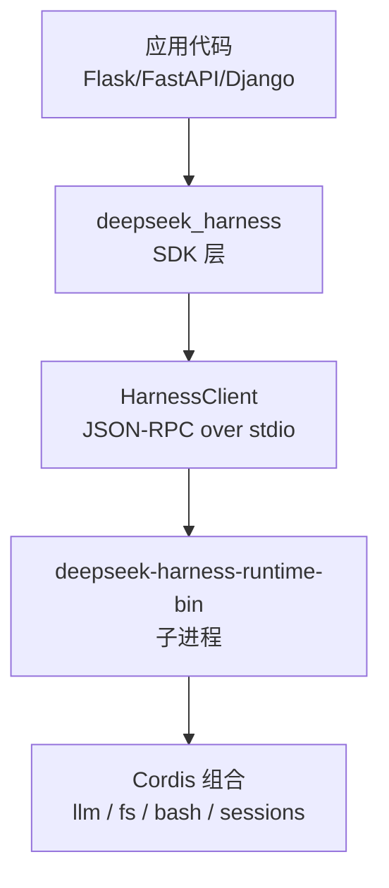
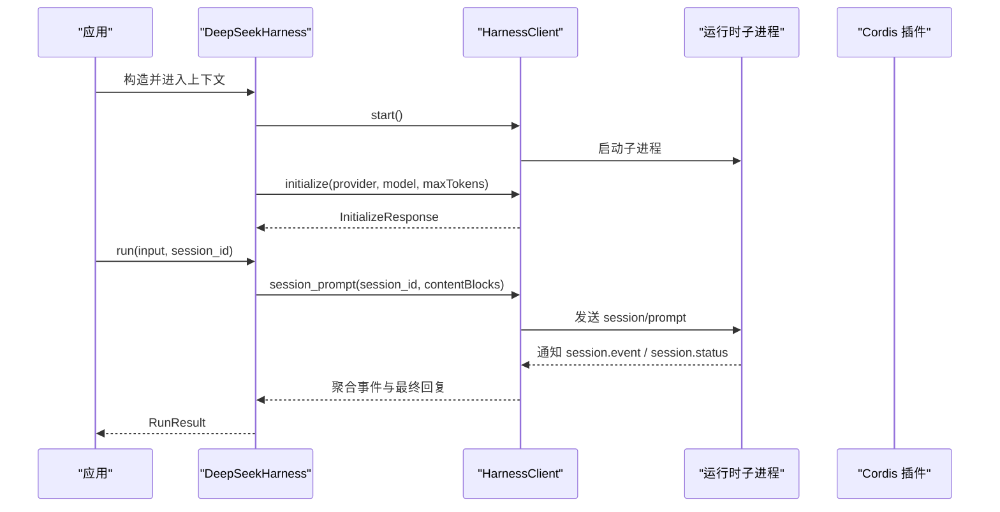
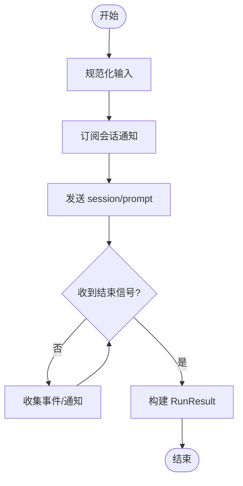
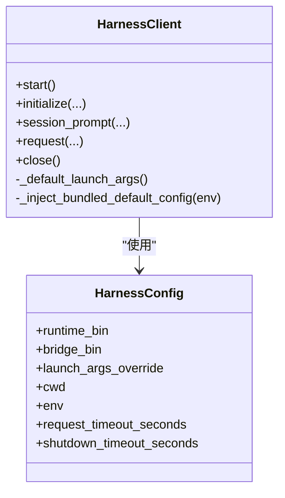
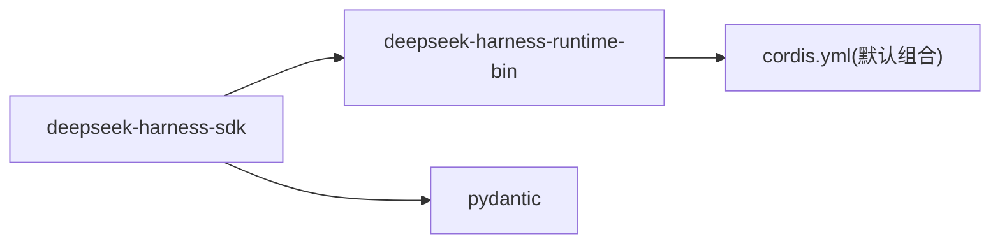

# 集成指南

<cite>
**本文引用的文件**
- [python/sdk/pyproject.toml](file://python/sdk/pyproject.toml)
- [python/sdk-runtime/pyproject.toml](file://python/sdk-runtime/pyproject.toml)
- [python/sdk/src/deepseek_harness/__init__.py](file://python/sdk/src/deepseek_harness/__init__.py)
- [python/sdk/src/deepseek_harness/api.py](file://python/sdk/src/deepseek_harness/api.py)
- [python/sdk/src/deepseek_harness/client.py](file://python/sdk/src/deepseek_harness/client.py)
- [python/sdk/src/deepseek_harness/errors.py](file://python/sdk/src/deepseek_harness/errors.py)
- [python/sdk/src/deepseek_harness/models.py](file://python/sdk/src/deepseek_harness/models.py)
- [python/sdk-runtime/src/deepseek_harness_runtime/runtime/cordis.yml](file://python/sdk-runtime/src/deepseek_harness_runtime/runtime/cordis.yml)
- [examples/jsonrpc-agent/minimal.py](file://examples/jsonrpc-agent/minimal.py)
- [examples/jsonrpc-agent/cordis.yml](file://examples/jsonrpc-agent/cordis.yml)
- [docs/user/guide/python-sdk.md](file://docs/user/guide/python-sdk.md)
</cite>

## 目录
1. [简介](#简介)
2. [项目结构](#项目结构)
3. [核心组件](#核心组件)
4. [架构总览](#架构总览)
5. [详细组件分析](#详细组件分析)
6. [依赖关系分析](#依赖关系分析)
7. [性能与可靠性](#性能与可靠性)
8. [故障排查](#故障排查)
9. [结论](#结论)
10. [附录：框架集成与部署实践](#附录框架集成与部署实践)

## 简介
本指南面向希望在现有 Python 项目中集成 DeepSeek Harness Python SDK 的开发者。内容涵盖：
- 安装与基础用法
- 与 Flask、FastAPI、Django 等 Web 框架的集成模式
- 与数据库、消息队列及其他服务的集成方法
- 微服务架构下的部署模式与最佳实践
- 容器化部署、CI/CD 流水线配置要点
- 监控、日志记录与生产环境排障

SDK 通过本地子进程启动内置运行时，使用 JSON-RPC over stdio 进行通信，支持会话持久化、工具调用（如 Bash、编辑器）和事件通知。

## 项目结构
仓库中与 Python SDK 相关的关键位置：
- python/sdk：Python SDK 包，暴露高层 API（DeepSeekHarness、Session、RunResult 等）
- python/sdk-runtime：打包并分发运行时二进制与默认配置
- examples/jsonrpc-agent：可运行的最小示例脚本与组合配置
- docs/user/guide/python-sdk.md：官方快速上手文档

图表来源
- [python/sdk/src/deepseek_harness/api.py:48-124](file://python/sdk/src/deepseek_harness/api.py#L48-L124)
- [python/sdk/src/deepseek_harness/client.py:37-155](file://python/sdk/src/deepseek_harness/client.py#L37-L155)
- [python/sdk-runtime/src/deepseek_harness_runtime/runtime/cordis.yml:1-50](file://python/sdk-runtime/src/deepseek_harness_runtime/runtime/cordis.yml#L1-L50)

章节来源
- [python/sdk/pyproject.toml:1-38](file://python/sdk/pyproject.toml#L1-L38)
- [python/sdk-runtime/pyproject.toml:1-32](file://python/sdk-runtime/pyproject.toml#L1-L32)
- [docs/user/guide/python-sdk.md:15-50](file://docs/user/guide/python-sdk.md#L15-L50)

## 核心组件
- DeepSeekHarness：高层同步 API，负责启动/初始化运行时、创建会话、执行任务并返回结果
- Session：封装单次会话的生命周期与事件收集
- HarnessClient：底层 JSON-RPC 客户端，管理子进程生命周期、请求/响应、通知订阅
- models：通用类型与数据结构（Notification、InitializeResponse 等）
- errors：异常体系（TransportClosedError、JsonRpcError、SdkProtocolError）

章节来源
- [python/sdk/src/deepseek_harness/__init__.py:1-20](file://python/sdk/src/deepseek_harness/__init__.py#L1-L20)
- [python/sdk/src/deepseek_harness/api.py:13-124](file://python/sdk/src/deepseek_harness/api.py#L13-L124)
- [python/sdk/src/deepseek_harness/client.py:24-155](file://python/sdk/src/deepseek_harness/client.py#L24-L155)
- [python/sdk/src/deepseek_harness/models.py:1-33](file://python/sdk/src/deepseek_harness/models.py#L1-L33)
- [python/sdk/src/deepseek_harness/errors.py:1-24](file://python/sdk/src/deepseek_harness/errors.py#L1-L24)

## 架构总览
SDK 采用“进程内控制面 + 进程外运行时”的架构：
- Python 侧：提供易用的同步 API，维护会话状态、事件订阅与超时控制
- 运行时侧：基于 Cordis 组合编排 LLM、文件系统、Bash、会话持久化等插件
- 通信协议：JSON-RPC over stdio，支持请求/响应与通知（session.event、session.status 等）

图表来源
- [python/sdk/src/deepseek_harness/api.py:97-124](file://python/sdk/src/deepseek_harness/api.py#L97-L124)
- [python/sdk/src/deepseek_harness/client.py:63-155](file://python/sdk/src/deepseek_harness/client.py#L63-L155)
- [examples/jsonrpc-agent/cordis.yml:1-90](file://examples/jsonrpc-agent/cordis.yml#L1-L90)

## 详细组件分析

### 运行流程与数据流
- 输入规范化：字符串或结构化内容块统一为内容块列表
- 会话订阅：按 session 树过滤通知，避免跨会话污染
- 结束判定：等待 session.status=idle 或 turn/end 事件，提取 final_response 与 finish_reason

图表来源
- [python/sdk/src/deepseek_harness/api.py:127-183](file://python/sdk/src/deepseek_harness/api.py#L127-L183)
- [python/sdk/src/deepseek_harness/api.py:199-243](file://python/sdk/src/deepseek_harness/api.py#L199-L243)

章节来源
- [python/sdk/src/deepseek_harness/api.py:127-243](file://python/sdk/src/deepseek_harness/api.py#L127-L243)

### 子进程与通信
- 启动策略：懒启动，首次调用时启动子进程；支持自定义 runtime_bin 或 launch_args_override
- 环境变量注入：自动注入 DSH_CWD、DSH_SESSION_ROOT、DSH_CORDIS_CONFIG、DEEPSEEK_BASE_URL、DEEPSEEK_API_KEY
- 关闭策略：先发送 shutdown 请求，再终止/杀死进程，确保资源释放
- 诊断信息：失败时附带退出码与 stderr 尾部，便于定位

图表来源
- [python/sdk/src/deepseek_harness/client.py:24-155](file://python/sdk/src/deepseek_harness/client.py#L24-L155)
- [python/sdk/src/deepseek_harness/client.py:424-454](file://python/sdk/src/deepseek_harness/client.py#L424-L454)

章节来源
- [python/sdk/src/deepseek_harness/client.py:63-116](file://python/sdk/src/deepseek_harness/client.py#L63-L116)
- [python/sdk/src/deepseek_harness/client.py:424-454](file://python/sdk/src/deepseek_harness/client.py#L424-L454)

### 运行时与组合配置
- 默认组合：包含 JSON-RPC 服务器、Agent Spine、DeepSeek LLM 适配器、本地 Bash、JSONL 会话持久化、子代理、令牌计量、压缩策略等
- 关键环境变量：
  - DSH_CWD：工作目录
  - DSH_SESSION_ROOT：会话根目录
  - DSH_CORDIS_CONFIG：组合配置文件路径
  - DEEPSEEK_BASE_URL / DEEPSEEK_API_KEY：模型端点与凭据

章节来源
- [python/sdk-runtime/src/deepseek_harness_runtime/runtime/cordis.yml:1-50](file://python/sdk-runtime/src/deepseek_harness_runtime/runtime/cordis.yml#L1-L50)
- [examples/jsonrpc-agent/cordis.yml:1-90](file://examples/jsonrpc-agent/cordis.yml#L1-L90)
- [docs/user/guide/python-sdk.md:31-50](file://docs/user/guide/python-sdk.md#L31-L50)

## 依赖关系分析
- 包依赖：
  - deepseek-harness-sdk 依赖 pydantic 与 deepseek-harness-runtime-bin
  - 运行时包将可执行产物作为 wheel 工件打包
- 运行时发现：
  - 未显式指定运行时路径时，SDK 尝试从 deepseek_harness_runtime 解析捆绑启动参数
  - 若未安装运行时包或未找到，抛出明确错误提示

图表来源
- [python/sdk/pyproject.toml:13-16](file://python/sdk/pyproject.toml#L13-L16)
- [python/sdk-runtime/pyproject.toml:20-27](file://python/sdk-runtime/pyproject.toml#L20-L27)
- [python/sdk/src/deepseek_harness/client.py:424-436](file://python/sdk/src/deepseek_harness/client.py#L424-L436)

章节来源
- [python/sdk/pyproject.toml:1-38](file://python/sdk/pyproject.toml#L1-L38)
- [python/sdk-runtime/pyproject.toml:1-32](file://python/sdk-runtime/pyproject.toml#L1-L32)
- [python/sdk/src/deepseek_harness/client.py:424-436](file://python/sdk/src/deepseek_harness/client.py#L424-L436)

## 性能与可靠性
- 连接复用：同一 Harness 实例可多次调用 run，复用子进程与会话，减少冷启动开销
- 超时控制：支持 request_timeout_seconds 与 shutdown_timeout_seconds，避免阻塞
- 事件驱动：通过通知订阅实现流式处理，适合长耗时任务
- 资源清理：上下文管理器保证 close 被调用，防止僵尸进程
- 诊断增强：传输关闭或超时时附加退出码与 stderr 尾部，便于快速定位

建议：
- 在 Web 服务中为每个请求创建独立 Harness 或使用连接池
- 合理设置超时，避免长时间占用线程
- 对 session_root 做定期归档与清理，控制磁盘增长

章节来源
- [python/sdk/src/deepseek_harness/api.py:48-124](file://python/sdk/src/deepseek_harness/api.py#L48-L124)
- [python/sdk/src/deepseek_harness/client.py:63-116](file://python/sdk/src/deepseek_harness/client.py#L63-L116)
- [python/sdk/src/deepseek_harness/client.py:228-296](file://python/sdk/src/deepseek_harness/client.py#L228-L296)
- [python/sdk/src/deepseek_harness/client.py:399-422](file://python/sdk/src/deepseek_harness/client.py#L399-L422)

## 故障排查
常见错误与处理：
- TransportClosedError：运行时子进程退出或 stdout 关闭，检查权限、依赖与环境变量
- JsonRpcError：运行时返回 JSON-RPC 错误，查看 code/message/data
- SdkProtocolError：运行时数据不符合协议约定，核对事件结构与字段
- 超时：增加 request_timeout_seconds，检查后端模型延迟与网络状况
- 权限问题：确保 DSH_CWD 与 DSH_SESSION_ROOT 指向可写目录

定位技巧：
- 捕获异常后读取 stderr 尾部与退出码
- 开启更详细的 Cordis 日志（由运行时内部实现）
- 使用独立 session_id 隔离问题会话

章节来源
- [python/sdk/src/deepseek_harness/errors.py:1-24](file://python/sdk/src/deepseek_harness/errors.py#L1-L24)
- [python/sdk/src/deepseek_harness/client.py:399-422](file://python/sdk/src/deepseek_harness/client.py#L399-L422)

## 结论
DeepSeek Harness Python SDK 提供了简洁稳定的进程间通信与事件驱动能力，适合嵌入各类 Python 应用。通过合理的配置、超时与资源管理，可在生产环境中可靠地运行智能体任务。结合容器化与 CI/CD，可实现一致的构建与部署体验。

## 附录：框架集成与部署实践

### 安装与快速开始
- 安装 SDK 与运行时：参考官方快速上手文档中的安装步骤与环境变量设置
- 运行示例：使用 examples/jsonrpc-agent/minimal.py 验证端到端流程

章节来源
- [docs/user/guide/python-sdk.md:15-50](file://docs/user/guide/python-sdk.md#L15-L50)
- [examples/jsonrpc-agent/minimal.py:16-39](file://examples/jsonrpc-agent/minimal.py#L16-L39)

### 与 Web 框架集成
- Flask：在视图函数中创建 Harness 上下文，调用 run 获取结果，注意设置超时与异常处理
- FastAPI：在异步路由中使用线程或进程隔离 Harness 调用，避免阻塞事件循环
- Django：在视图或 Celery 任务中调用 SDK，利用会话 ID 保持对话连续性

通用要点：
- 为每个请求或任务分配独立的 session_id，除非需要延续对话
- 将敏感配置（API Key、Base URL）通过环境变量注入，避免硬编码
- 使用 try/finally 或上下文管理器确保子进程正确关闭

章节来源
- [python/sdk/src/deepseek_harness/api.py:48-124](file://python/sdk/src/deepseek_harness/api.py#L48-L124)
- [python/sdk/src/deepseek_harness/client.py:63-116](file://python/sdk/src/deepseek_harness/client.py#L63-L116)

### 与数据库、消息队列与其他服务集成
- 数据库：将 session_root 指向持久化卷，以便查询历史会话；业务数据通过 ORM 读写
- 消息队列：将任务入队（如 Redis/RabbitMQ），消费者调用 SDK 执行；回调或轮询获取结果
- 其他服务：通过环境变量或配置注入外部服务地址；在 Cordis 组合中启用相应插件（如文件系统、子代理）

章节来源
- [python/sdk-runtime/src/deepseek_harness_runtime/runtime/cordis.yml:23-49](file://python/sdk-runtime/src/deepseek_harness_runtime/runtime/cordis.yml#L23-L49)
- [examples/jsonrpc-agent/cordis.yml:18-90](file://examples/jsonrpc-agent/cordis.yml#L18-L90)

### 微服务架构下的部署模式
- 单进程多会话：适用于低并发场景，复用子进程提升吞吐
- 每请求一进程：高隔离性，适合强安全边界与沙箱需求
- 无状态网关 + 有状态 Agent 服务：网关负责鉴权与路由，Agent 服务管理会话与持久化

章节来源
- [python/sdk/src/deepseek_harness/client.py:63-116](file://python/sdk/src/deepseek_harness/client.py#L63-L116)
- [python/sdk-runtime/src/deepseek_harness_runtime/runtime/cordis.yml:23-49](file://python/sdk-runtime/src/deepseek_harness_runtime/runtime/cordis.yml#L23-L49)

### 容器化部署
- 镜像构建：以 Python 为基础镜像，安装 deepseek-harness-sdk，挂载必要目录（workspace、sessions）
- 环境变量：传入 DEEPSEEK_API_KEY、DEEPSEEK_BASE_URL、DSH_MODEL、DSH_SYSTEM_PROMPT 等
- 资源限制：为容器设置 CPU/内存上限，避免 OOM 影响宿主

章节来源
- [docs/user/guide/python-sdk.md:31-50](file://docs/user/guide/python-sdk.md#L31-L50)
- [python/sdk-runtime/src/deepseek_harness_runtime/runtime/cordis.yml:23-49](file://python/sdk-runtime/src/deepseek_harness_runtime/runtime/cordis.yml#L23-L49)

### CI/CD 流水线配置要点
- 缓存依赖：缓存 pip/uv 依赖与 Node 模块（如需构建）
- 单元测试：运行 pytest 覆盖 SDK 用例
- 构建产物：生成 wheel 并上传至私有仓库，供下游服务拉取
- 发布流程：版本对齐 SDK 与运行时，确保兼容性

章节来源
- [python/sdk/pyproject.toml:24-32](file://python/sdk/pyproject.toml#L24-L32)
- [python/sdk-runtime/pyproject.toml:20-32](file://python/sdk-runtime/pyproject.toml#L20-L32)

### 监控、日志与排障
- 指标采集：统计请求数、延迟、错误率、token 用量（可通过 token-meter 插件）
- 日志记录：集中收集 stderr 与 JSONL 会话日志，便于审计与回溯
- 告警规则：针对超时、传输关闭、异常比例设置阈值告警

章节来源
- [examples/jsonrpc-agent/cordis.yml:79-90](file://examples/jsonrpc-agent/cordis.yml#L79-L90)
- [python/sdk/src/deepseek_harness/client.py:399-422](file://python/sdk/src/deepseek_harness/client.py#L399-L422)