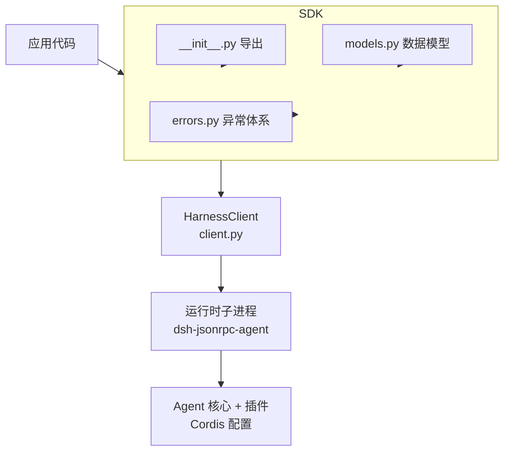
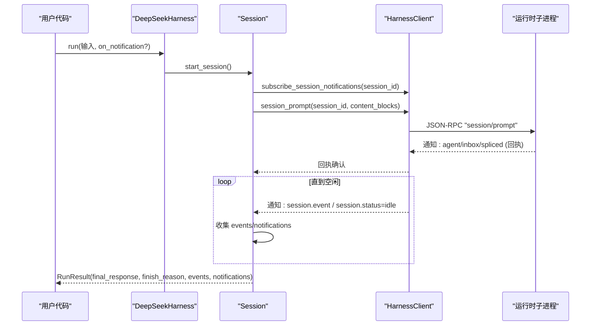
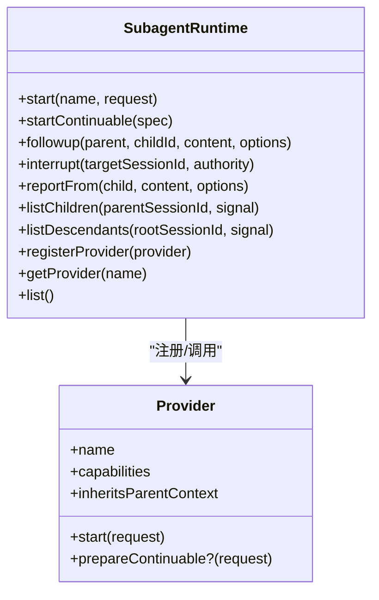
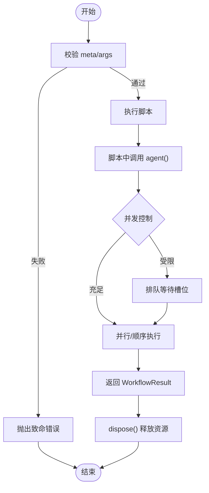
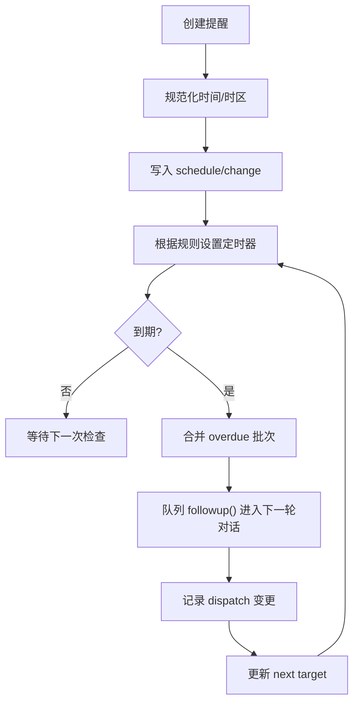
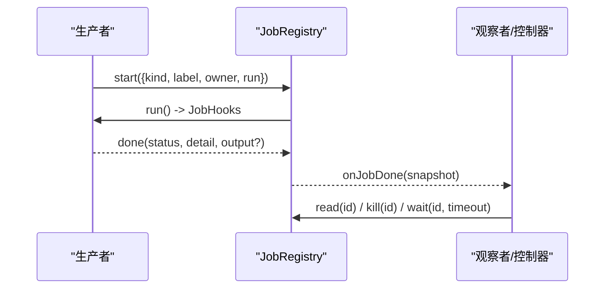
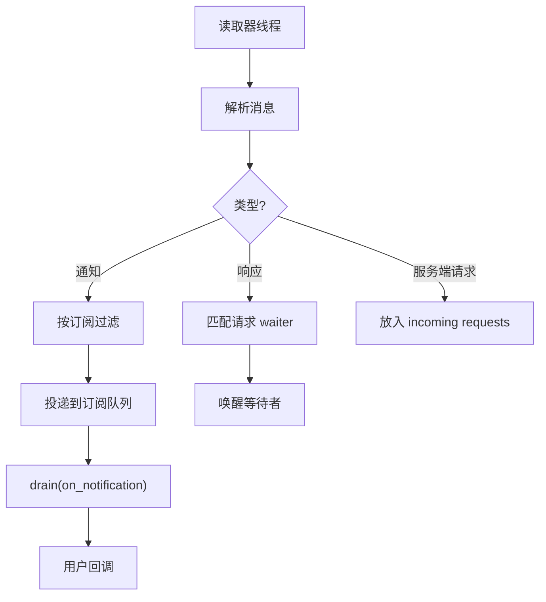
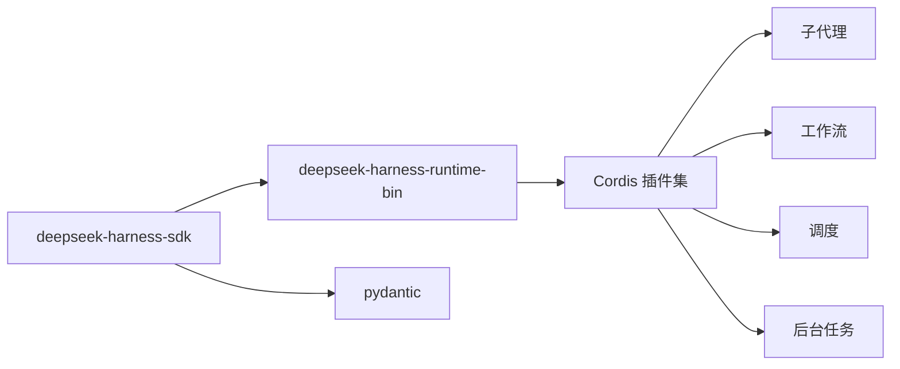

# 高级功能

<cite>
**本文引用的文件**
- [python/sdk/README.md](file://python/sdk/README.md)
- [python/sdk/pyproject.toml](file://python/sdk/pyproject.toml)
- [python/sdk/src/deepseek_harness/__init__.py](file://python/sdk/src/deepseek_harness/__init__.py)
- [python/sdk/src/deepseek_harness/client.py](file://python/sdk/src/deepseek_harness/client.py)
- [python/sdk/src/deepseek_harness/api.py](file://python/sdk/src/deepseek_harness/api.py)
- [python/sdk/src/deepseek_harness/models.py](file://python/sdk/src/deepseek_harness/models.py)
- [python/sdk/src/deepseek_harness/errors.py](file://python/sdk/src/deepseek_harness/errors.py)
- [python/sdk-runtime/README.md](file://python/sdk-runtime/README.md)
- [docs/subsystems/subagent.md](file://docs/subsystems/subagent.md)
- [docs/subsystems/workflow.md](file://docs/subsystems/workflow.md)
- [docs/subsystems/schedule.md](file://docs/subsystems/schedule.md)
- [docs/subsystems/jobs.md](file://docs/subsystems/jobs.md)
- [docs/event-producer-consumer.md](file://docs/event-producer-consumer.md)
</cite>

## 目录
1. [简介](#简介)
2. [项目结构](#项目结构)
3. [核心组件](#核心组件)
4. [架构总览](#架构总览)
5. [详细组件分析](#详细组件分析)
6. [依赖关系分析](#依赖关系分析)
7. [性能与资源管理](#性能与资源管理)
8. [故障排查指南](#故障排查指南)
9. [结论](#结论)
10. [附录](#附录)

## 简介
本章节面向 DeepSeek Harness Python SDK 的高级使用者，聚焦子代理管理、并发处理、任务调度、事件驱动编程与回调机制、复杂 Agent 工作流编排、自定义工具与插件扩展，以及性能优化、内存管理与资源清理的最佳实践。文档基于仓库中的 Python SDK、运行时载体与子系统文档进行系统化梳理，帮助你在生产环境中构建高可靠、可扩展的自动化流程。

## 项目结构
Python SDK 由“客户端”和“运行时载体”两部分组成：
- Python SDK（deepseek-harness-sdk）提供同步 API，封装 JSON-RPC over stdio 通信、子进程生命周期管理、会话与通知订阅、错误模型等。
- 运行时载体（deepseek-harness-runtime-bin）提供可执行或开发期 Node 闭包，并携带默认 Cordis 配置，使零配置启动成为可能。

图表来源
- [python/sdk/src/deepseek_harness/__init__.py:1-20](file://python/sdk/src/deepseek_harness/__init__.py#L1-L20)
- [python/sdk/src/deepseek_harness/api.py:1-125](file://python/sdk/src/deepseek_harness/api.py#L1-L125)
- [python/sdk/src/deepseek_harness/client.py:37-116](file://python/sdk/src/deepseek_harness/client.py#L37-L116)
- [python/sdk-runtime/README.md:1-32](file://python/sdk-runtime/README.md#L1-L32)

章节来源
- [python/sdk/README.md:1-52](file://python/sdk/README.md#L1-L52)
- [python/sdk/pyproject.toml:1-38](file://python/sdk/pyproject.toml#L1-L38)
- [python/sdk/src/deepseek_harness/__init__.py:1-20](file://python/sdk/src/deepseek_harness/__init__.py#L1-L20)
- [python/sdk-runtime/README.md:1-32](file://python/sdk-runtime/README.md#L1-L32)

## 核心组件
- DeepSeekHarness：高层入口，负责环境注入、初始化、会话创建与 run 编排。
- Session：封装一次对话区间，等待收件箱回执与空闲状态，聚合最终响应与结束原因。
- HarnessClient：底层 JSON-RPC 客户端，管理子进程、读写线程、请求-响应匹配、通知订阅与过滤、会话父子关系追踪。
- NotificationSubscription：通知订阅句柄，支持按会话树过滤与批量消费。
- 数据模型与异常：Notification、IncomingRequest、InitializeResponse、SdkProtocolError、JsonRpcError、TransportClosedError 等。

章节来源
- [python/sdk/src/deepseek_harness/api.py:13-183](file://python/sdk/src/deepseek_harness/api.py#L13-L183)
- [python/sdk/src/deepseek_harness/client.py:24-210](file://python/sdk/src/deepseek_harness/client.py#L24-L210)
- [python/sdk/src/deepseek_harness/models.py:1-33](file://python/sdk/src/deepseek_harness/models.py#L1-L33)
- [python/sdk/src/deepseek_harness/errors.py:1-24](file://python/sdk/src/deepseek_harness/errors.py#L1-L24)

## 架构总览
Python SDK 通过 JSON-RPC over stdio 与运行时子进程通信；运行时加载 Cordis 配置，启动 Agent 核心与插件（如 LLM 适配器、持久化、MCP 工具等）。SDK 侧维护会话父子关系，以便将子代理生命周期事件路由到正确的父会话订阅者。

图表来源
- [python/sdk/src/deepseek_harness/api.py:117-183](file://python/sdk/src/deepseek_harness/api.py#L117-L183)
- [python/sdk/src/deepseek_harness/client.py:138-178](file://python/sdk/src/deepseek_harness/client.py#L138-L178)
- [python/sdk/src/deepseek_harness/client.py:343-397](file://python/sdk/src/deepseek_harness/client.py#L343-L397)

## 详细组件分析

### 子代理管理（Subagent）
- 能力发现与一次性/可延续子代理：提供者声明能力，服务在启动前校验；可延续子代理通过 continuation manager 管理激活态、冷启动恢复、父子授权与终止。
- 枚举与发现：listChildren/listDescendants 合并活跃会话与可选持久化存储，投影出子代理身份与活动状态。
- 报告与中断：reportFrom 允许子代理向直接父代理发送内容；interrupt 以权威身份取消当前轮次。
- 事件：subagent/start、subagent/end、provider-added/removed 等用于观测生命周期。

图表来源
- [docs/subsystems/subagent.md:485-668](file://docs/subsystems/subagent.md#L485-L668)
- [docs/subsystems/subagent.md:114-243](file://docs/subsystems/subagent.md#L114-L243)
- [docs/subsystems/subagent.md:287-305](file://docs/subsystems/subagent.md#L287-L305)

章节来源
- [docs/subsystems/subagent.md:11-99](file://docs/subsystems/subagent.md#L11-L99)
- [docs/subsystems/subagent.md:114-243](file://docs/subsystems/subagent.md#L114-L243)
- [docs/subsystems/subagent.md:287-305](file://docs/subsystems/subagent.md#L287-L305)
- [docs/subsystems/subagent.md:485-668](file://docs/subsystems/subagent.md#L485-L668)

### 工作流编排（Workflow）
- 脚本化编排：通过 ctx.workflowEngine.start 运行模型编写的脚本，脚本内可启动多个子代理，具备元信息 meta、参数 args、阶段 phases 等。
- 结果与失败：result 永不拒绝，stopReason 为 completed/cancelled/error；dispose 保证有界回收。
- 事件：workflow/start、workflow/phase、workflow/log、workflow/agent-start、workflow/agent-end、workflow/end 用于观测执行过程。

图表来源
- [docs/subsystems/workflow.md:11-37](file://docs/subsystems/workflow.md#L11-L37)
- [docs/subsystems/workflow.md:63-112](file://docs/subsystems/workflow.md#L63-L112)
- [docs/subsystems/workflow.md:118-129](file://docs/subsystems/workflow.md#L118-L129)

章节来源
- [docs/subsystems/workflow.md:11-37](file://docs/subsystems/workflow.md#L11-L37)
- [docs/subsystems/workflow.md:63-112](file://docs/subsystems/workflow.md#L63-L112)
- [docs/subsystems/workflow.md:118-129](file://docs/subsystems/workflow.md#L118-L129)

### 任务调度（Schedule）
- 持久化提醒：after/at/every 三种规则，统一转换为 UTC scheduledAt；every 最小间隔 5 分钟，错过时只推进到下一个锚点。
- 投递边界：仅在当前 Session 存活时投递；因崩溃窗口存在“至少一次”语义。
- 视图与管理：schedule_create/schedule_list/schedule_delete；active view 结合墙钟计算是否 overdue。

图表来源
- [docs/subsystems/schedule.md:7-65](file://docs/subsystems/schedule.md#L7-L65)
- [docs/subsystems/schedule.md:92-103](file://docs/subsystems/schedule.md#L92-L103)
- [docs/subsystems/schedule.md:154-187](file://docs/subsystems/schedule.md#L154-L187)

章节来源
- [docs/subsystems/schedule.md:7-65](file://docs/subsystems/schedule.md#L7-L65)
- [docs/subsystems/schedule.md:92-103](file://docs/subsystems/schedule.md#L92-L103)
- [docs/subsystems/schedule.md:154-187](file://docs/subsystems/schedule.md#L154-L187)

### 后台任务（Jobs）
- 生产者契约：JobStart.run 返回 JobHooks，包含 cancel/done/readOutput；runtime 管理身份、访问控制与生命周期。
- 消费者视图：JobSnapshot/JobRead 提供只读快照与增量输出；wait/kill/list/get 提供控制面。
- 服务行为：owner 隔离、准入限制、完成监听、控制器挂载。

图表来源
- [docs/subsystems/jobs.md:24-96](file://docs/subsystems/jobs.md#L24-L96)
- [docs/subsystems/jobs.md:98-153](file://docs/subsystems/jobs.md#L98-L153)
- [docs/subsystems/jobs.md:155-285](file://docs/subsystems/jobs.md#L155-L285)

章节来源
- [docs/subsystems/jobs.md:24-96](file://docs/subsystems/jobs.md#L24-L96)
- [docs/subsystems/jobs.md:98-153](file://docs/subsystems/jobs.md#L98-L153)
- [docs/subsystems/jobs.md:155-285](file://docs/subsystems/jobs.md#L155-L285)

### 事件驱动与回调
- SDK 层：NotificationSubscription 支持按会话树过滤；request 循环中周期性 drain 通知，避免阻塞等待。
- 系统层：大量 emit/waterfall/serial/parallel 事件贯穿 Agent 循环、工具执行、会话、子代理与工作流。
- 最佳实践：使用 on_notification 回调实时处理子代理生命周期；对耗时回调使用独立线程或异步队列，避免阻塞主循环。

图表来源
- [python/sdk/src/deepseek_harness/client.py:228-296](file://python/sdk/src/deepseek_harness/client.py#L228-L296)
- [python/sdk/src/deepseek_harness/client.py:343-397](file://python/sdk/src/deepseek_harness/client.py#L343-L397)
- [docs/event-producer-consumer.md:1-80](file://docs/event-producer-consumer.md#L1-L80)

章节来源
- [python/sdk/src/deepseek_harness/client.py:228-296](file://python/sdk/src/deepseek_harness/client.py#L228-L296)
- [python/sdk/src/deepseek_harness/client.py:343-397](file://python/sdk/src/deepseek_harness/client.py#L343-L397)
- [docs/event-producer-consumer.md:1-80](file://docs/event-producer-consumer.md#L1-L80)

### 复杂工作流与多步骤编排
- 组合策略：用 workflow 脚本组织多步任务，内部通过 agent() 启动子代理；利用 phases 标注进度，log 输出诊断。
- 并发与限流：引擎内部对并发槽位进行控制；可通过 maxTotalAgents 限制每运行实例的子代理总数。
- 错误纪律：fatal 错误会立即终止脚本，避免静默降级；普通子代理失败映射为 isErrorResponse。

章节来源
- [docs/subsystems/workflow.md:11-37](file://docs/subsystems/workflow.md#L11-L37)
- [docs/subsystems/workflow.md:63-112](file://docs/subsystems/workflow.md#L63-L112)

### 自定义工具与插件开发
- 通过 Cordis 配置装载插件；运行时默认配置已包含 MCP 客户端，可将外部工具暴露给模型。
- 在 Python SDK 中通过 cordis 参数指定自定义配置文件路径，实现按需装配。
- 建议：将工具逻辑封装为独立插件，通过 provider 注册与能力声明，确保启动前能力校验生效。

章节来源
- [python/sdk/README.md:27-43](file://python/sdk/README.md#L27-L43)
- [python/sdk-runtime/README.md:14-18](file://python/sdk-runtime/README.md#L14-L18)

## 依赖关系分析
- Python SDK 依赖 deepseek-harness-runtime-bin 提供的平台二进制或开发期 Node 闭包；安装后自动解析启动参数与默认配置路径。
- SDK 内部模块职责清晰：api 暴露高层接口，client 负责传输与并发，models/errors 定义数据与异常。
- 运行时与子系统通过 Cordis 解耦：子代理、工作流、调度、任务等作为可选能力被装配。

图表来源
- [python/sdk/pyproject.toml:13-16](file://python/sdk/pyproject.toml#L13-L16)
- [python/sdk-runtime/README.md:14-18](file://python/sdk-runtime/README.md#L14-L18)

章节来源
- [python/sdk/pyproject.toml:13-16](file://python/sdk/pyproject.toml#L13-L16)
- [python/sdk-runtime/README.md:14-18](file://python/sdk-runtime/README.md#L14-L18)

## 性能与资源管理
- 子进程复用：DeepSeekHarness 保持运行时子进程复用，减少启动开销；通过上下文管理器或显式 close 确保回收。
- 超时与诊断：request_timeout_seconds 控制请求等待；关闭时尝试 graceful shutdown，必要时强制终止；诊断信息包含退出码与 stderr 尾部。
- 通知批处理：drain 在等待期间批量消费通知，降低回调频率；按会话树过滤减少无关事件处理。
- 并发与限流：工作流与任务系统提供并发控制与上限；子代理能力校验在启动前完成，避免无效工作。
- 内存与持久化：会话持久化与压缩策略由插件决定；注意大对象与流式输出的截断与落盘策略。

章节来源
- [python/sdk/src/deepseek_harness/client.py:63-116](file://python/sdk/src/deepseek_harness/client.py#L63-L116)
- [python/sdk/src/deepseek_harness/client.py:228-296](file://python/sdk/src/deepseek_harness/client.py#L228-L296)
- [python/sdk/src/deepseek_harness/client.py:386-422](file://python/sdk/src/deepseek_harness/client.py#L386-L422)
- [docs/subsystems/workflow.md:93-112](file://docs/subsystems/workflow.md#L93-L112)
- [docs/subsystems/jobs.md:155-285](file://docs/subsystems/jobs.md#L155-L285)

## 故障排查指南
- 传输关闭：当子进程退出或 stdout 关闭时抛出 TransportClosedError，附带退出码与 stderr 尾部便于定位。
- 协议错误：turn/end 缺少 reason.kind 会抛出 SdkProtocolError；JSON-RPC 错误包装为 JsonRpcError。
- 超时处理：请求超时会抛出 TimeoutError，并附加运行时诊断信息；建议合理设置 request_timeout_seconds。
- 通知丢失：确保使用 subscribe_session_notifications 并按会话树过滤；回调中避免长时间阻塞。
- 子代理问题：检查能力是否满足（depthLimit/toolFilter/persona），确认授权与父子关系；使用 listChildren/listDescendants 诊断。

章节来源
- [python/sdk/src/deepseek_harness/errors.py:4-24](file://python/sdk/src/deepseek_harness/errors.py#L4-L24)
- [python/sdk/src/deepseek_harness/client.py:386-422](file://python/sdk/src/deepseek_harness/client.py#L386-L422)
- [python/sdk/src/deepseek_harness/api.py:225-243](file://python/sdk/src/deepseek_harness/api.py#L225-L243)
- [docs/subsystems/subagent.md:11-99](file://docs/subsystems/subagent.md#L11-L99)

## 结论
DeepSeek Harness Python SDK 通过清晰的层次划分与事件驱动模型，提供了强大的子代理管理、工作流编排、任务调度与并发控制能力。配合运行时载体的插件化架构，开发者可以灵活扩展工具与能力，并在生产环境中获得可靠的性能与资源管理能力。遵循本文的最佳实践，可有效提升系统的稳定性与可维护性。

## 附录
- 安装与快速开始：参考 SDK README 中的安装与首次运行说明。
- 运行时载体：了解 exe 与 node 两种载体、默认配置注入与零配置设计。
- 事件矩阵：查阅事件生产者-消费者矩阵，理解各子系统间的事件耦合关系。

章节来源
- [python/sdk/README.md:1-52](file://python/sdk/README.md#L1-L52)
- [python/sdk-runtime/README.md:1-32](file://python/sdk-runtime/README.md#L1-L32)
- [docs/event-producer-consumer.md:1-80](file://docs/event-producer-consumer.md#L1-L80)