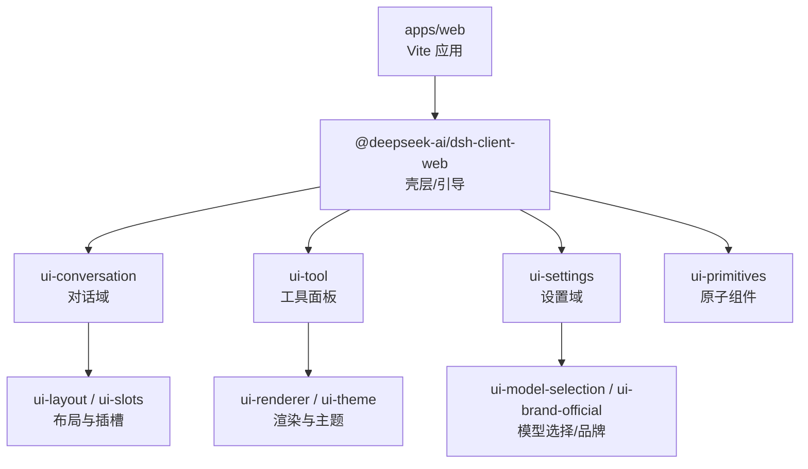
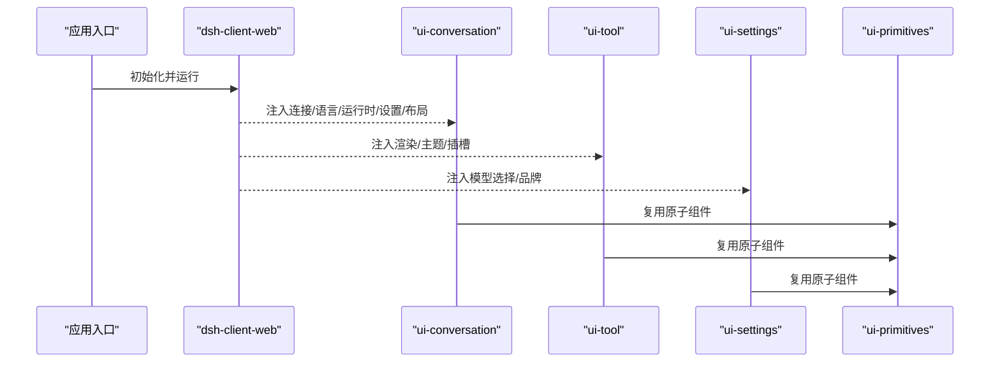
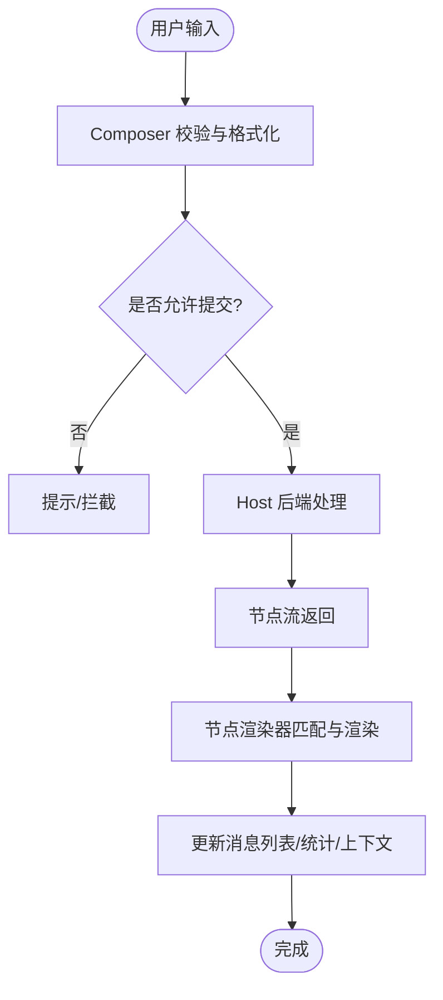
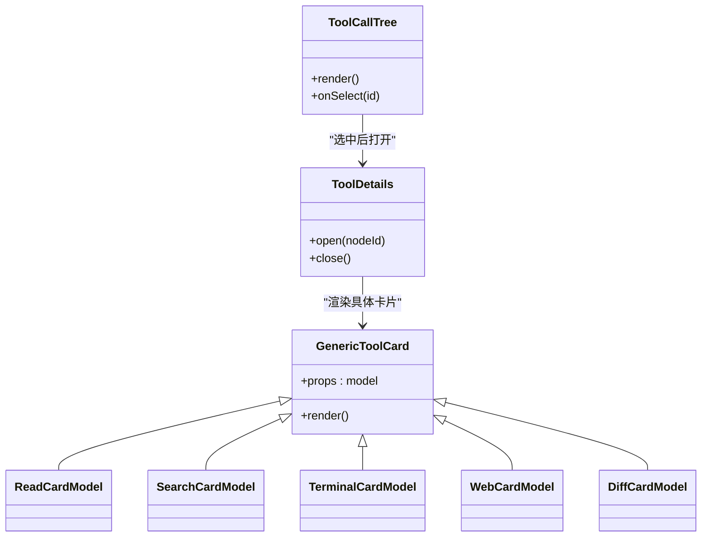
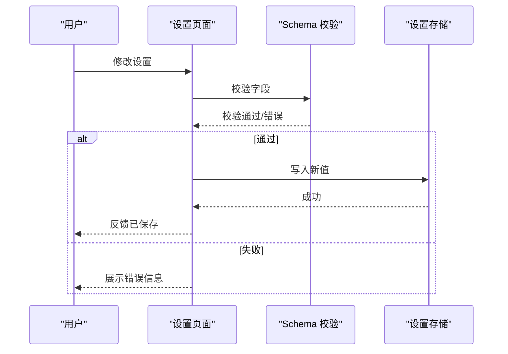
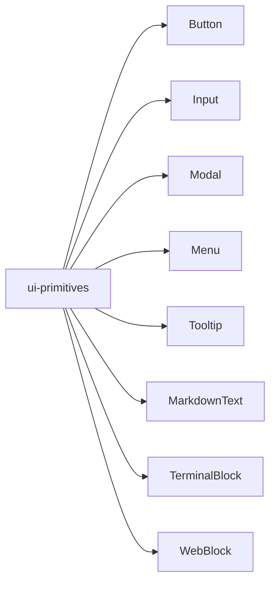
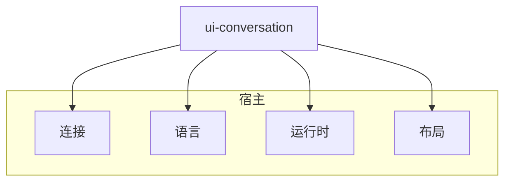

# UI 组件

<cite>
**本文引用的文件**
- [apps/web/package.json](file://apps/web/package.json)
- [apps/web/src/main.ts](file://apps/web/src/main.ts)
- [packages/client/ui-conversation/package.json](file://packages/client/ui-conversation/package.json)
- [packages/client/ui-tool/package.json](file://packages/client/ui-tool/package.json)
- [packages/client/ui-settings/package.json](file://packages/client/ui-settings/package.json)
- [packages/client/ui-primitives/package.json](file://packages/client/ui-primitives/package.json)
</cite>

## 目录
1. [简介](#简介)
2. [项目结构](#项目结构)
3. [核心组件](#核心组件)
4. [架构总览](#架构总览)
5. [详细组件分析](#详细组件分析)
6. [依赖关系分析](#依赖关系分析)
7. [性能考虑](#性能考虑)
8. [故障排查指南](#故障排查指南)
9. [结论](#结论)
10. [附录](#附录)

## 简介
本文件面向 Web 应用 UI 组件，系统性说明 React 组件库的架构设计、组件分类与复用策略，并围绕聊天界面、工具面板、设置页面等核心能力展开。文档覆盖组件属性接口、事件处理机制、样式定制选项、响应式设计、无障碍访问支持与主题切换；同时提供使用示例、最佳实践与常见问题解决方案，帮助读者快速上手并高效扩展。

## 项目结构
Web 前端入口位于 apps/web，采用 Vite 构建，通过 @deepseek-ai/dsh-client-web 壳层完成模块表初始化、启动页渲染与 UI 渲染器交接。UI 能力以 packages/client 下的多个子包形式组织，按领域划分：ui-conversation（对话）、ui-tool（工具面板）、ui-settings（设置）、ui-primitives（基础原子组件）等。每个子包通过 package.json 的 exports 暴露类型与运行时入口，并通过 dsh.client.inject 声明注入依赖，形成可组合、可替换的插件式架构。

图表来源
- [apps/web/package.json:1-49](file://apps/web/package.json#L1-L49)
- [apps/web/src/main.ts:1-11](file://apps/web/src/main.ts#L1-L11)
- [packages/client/ui-conversation/package.json:1-117](file://packages/client/ui-conversation/package.json#L1-L117)

章节来源
- [apps/web/package.json:1-49](file://apps/web/package.json#L1-L49)
- [apps/web/src/main.ts:1-11](file://apps/web/src/main.ts#L1-L11)

## 核心组件
- 聊天界面（ui-conversation）
  - 职责：会话骨架、消息流、输入框、队列、详情面板、节点渲染注册等。
  - 关键特性：有序对话流、Composer 提交策略、Host 驱动的 Enter 行为、消息元数据与统计行、上下文注入行、工具调用展示等。
  - 典型文件：ChatView、MessageItem、ContextBody、QueueDock、ConversationRoot、InputBar 等。
- 工具面板（ui-tool）
  - 职责：工具调用树、工具详情、具体工具卡片（搜索、读取、终端、Web 等）。
  - 关键特性：工具调用建模、差异/读取/搜索/终端/Web 等视图、通用工具卡片封装。
  - 典型文件：ToolCallTree、ToolDetails、GenericToolCard、read-row、search-row、web-row、terminal-card-model 等。
- 设置页面（ui-settings）
  - 职责：设置镜像、作用域管理、Schema 驱动表单、插槽扩展。
  - 关键特性：基于 Schema 的动态表单、设置作用域隔离、可插拔设置项。
  - 典型文件：settings-mirror、settings-scope、schema、slots 契约。
- 原子组件（ui-primitives）
  - 职责：按钮、输入、模态、菜单、提示、Markdown/Diff/Terminal/Web 块、图标等。
  - 关键特性：样式模块化、无障碍支持、位置锚定、剪贴板交互、增量渲染等。
  - 典型文件：Button、Input、Modal、Menu、Tooltip、MarkdownText、TerminalBlock、WebBlock 等。

章节来源
- [packages/client/ui-conversation/package.json:1-117](file://packages/client/ui-conversation/package.json#L1-L117)
- [packages/client/ui-tool/package.json:1-117](file://packages/client/ui-tool/package.json#L1-L117)
- [packages/client/ui-settings/package.json:1-117](file://packages/client/ui-settings/package.json#L1-L117)
- [packages/client/ui-primitives/package.json:1-117](file://packages/client/ui-primitives/package.json#L1-L117)

## 架构总览
整体采用“壳层 + 领域插件”的分层架构：
- 壳层（dsh-client-web）负责模块表初始化、启动流程与 UI 渲染器交接。
- 领域插件（ui-conversation、ui-tool、ui-settings 等）通过 dsh.client.inject 声明依赖，按需注入到宿主环境。
- 原子组件（ui-primitives）被各领域插件复用，保证一致性与可维护性。
- 布局与插槽（ui-layout、ui-slots）提供容器与扩展点，实现高内聚低耦合。

图表来源
- [apps/web/src/main.ts:1-11](file://apps/web/src/main.ts#L1-L11)
- [packages/client/ui-conversation/package.json:32-43](file://packages/client/ui-conversation/package.json#L32-L43)

## 详细组件分析

### 聊天界面（ui-conversation）
- 组件分层
  - 骨架与布局：ConversationRoot、HeroShell、InputBar、TodoPanel、ApprovalPanel、DetailsPanel
  - 消息与节点：MessageItem、AssistantMarkdown、ReasoningRow、CompactionItem、ContextBody、TurnTailNodeView
  - 输入与队列：composer 提交策略、QueueDock、Hub/Machine
  - 节点渲染：register-node-renderers、chat-nodes 注册表
- 数据流与事件
  - 用户输入经 Composer 进入 Host 后端，触发 Agent 执行，结果以节点流形式回推至 UI。
  - 消息状态变化驱动重渲染，统计行与上下文注入行随会话推进更新。
- 样式与主题
  - 使用 CSS Modules 进行样式隔离，结合 ui-theme 提供的主题变量实现全局换肤。
- 无障碍与响应式
  - 语义化标签、键盘可达、ARIA 属性由原子组件统一保障；布局在移动端自动折叠侧边栏与详情面板。

图表来源
- [packages/client/ui-conversation/package.json:1-117](file://packages/client/ui-conversation/package.json#L1-L117)

章节来源
- [packages/client/ui-conversation/package.json:1-117](file://packages/client/ui-conversation/package.json#L1-L117)

### 工具面板（ui-tool）
- 组件分层
  - 工具树与详情：ToolCallTree、ToolDetails
  - 工具卡片：GenericToolCard 及 read/search/terminal/web 等专用行
  - 模型层：tool-call-model、read-card-model、search-card-model、terminal-card-model、web-card-model、diff-card-model
- 数据流与事件
  - 工具调用事件从 Agent 侧产生，UI 将其映射为工具调用节点，渲染对应卡片。
  - 用户操作（如确认/取消/编辑）通过回调回写至 Host，驱动后续流程。
- 样式与主题
  - 通过 CSS Modules 与 ui-theme 变量保持一致视觉风格；复杂内容（代码/终端/网页）使用专用块组件。
- 无障碍与响应式
  - 表格/列表具备键盘导航；移动端将工具详情折叠为抽屉或底部面板。

图表来源
- [packages/client/ui-tool/package.json:1-117](file://packages/client/ui-tool/package.json#L1-L117)

章节来源
- [packages/client/ui-tool/package.json:1-117](file://packages/client/ui-tool/package.json#L1-L117)

### 设置页面（ui-settings）
- 组件分层
  - 设置镜像与作用域：settings-mirror、settings-scope
  - Schema 驱动表单：schema 定义字段、校验、默认值
  - 插槽契约：slots 定义扩展点，便于第三方插入设置项
- 数据流与事件
  - 设置变更通过 Schema 验证后写入持久化存储，并在相关组件中生效。
  - 支持分组、条件显示、联动更新。
- 样式与主题
  - 复用 ui-primitives 的 Input、Button、Modal 等，确保一致性。
- 无障碍与响应式
  - 表单控件具备完整无障碍语义；移动端采用单列布局与可滚动区域。

图表来源
- [packages/client/ui-settings/package.json:1-117](file://packages/client/ui-settings/package.json#L1-L117)

章节来源
- [packages/client/ui-settings/package.json:1-117](file://packages/client/ui-settings/package.json#L1-L117)

### 原子组件（ui-primitives）
- 组件清单
  - 交互：Button、Input、Menu、Modal、Tooltip、HoverCard、DisclosureRow、RiskConfirmation、OnboardingSurface
  - 内容：MarkdownText、CodeBlock、JsonBlock、DiffBlock、ReadBlock、SearchBlock、TerminalBlock、WebBlock、JsonTree
  - 辅助：StateDot、Pill、ConnectionBanner、BrandWordmark、FishLogo、icons
- 设计要点
  - 样式模块化、主题变量驱动、响应式断点、键盘可达、ARIA 语义完善。
  - 提供 hooks（如 useAnchoredPosition、useDismissOnOutsidePointer）简化定位与交互逻辑。

图表来源
- [packages/client/ui-primitives/package.json:1-117](file://packages/client/ui-primitives/package.json#L1-L117)

章节来源
- [packages/client/ui-primitives/package.json:1-117](file://packages/client/ui-primitives/package.json#L1-L117)

## 依赖关系分析
- 注入与装配
  - ui-conversation 通过 dsh.client.inject 注入连接、语言、运行时、设置、布局等依赖，确保与宿主解耦。
  - 其他领域插件遵循相同模式，形成统一的装配契约。
- 外部依赖
  - 共享原子组件与主题系统，避免重复实现。
  - 通过 peerDependencies 声明宿主必须提供的能力，降低打包体积。

图表来源
- [packages/client/ui-conversation/package.json:32-43](file://packages/client/ui-conversation/package.json#L32-L43)

章节来源
- [packages/client/ui-conversation/package.json:1-117](file://packages/client/ui-conversation/package.json#L1-L117)

## 性能考虑
- 虚拟滚动与分页：长列表（消息、工具调用）建议启用虚拟化，减少首屏渲染压力。
- 增量渲染：Markdown/JSON/代码块采用增量更新，避免整段重绘。
- 懒加载：非首屏面板（详情、工具卡片）按需加载与卸载。
- 防抖节流：输入与滚动场景使用节流/防抖，降低计算频率。
- 主题切换：通过 CSS 变量与最小 DOM 变更实现无闪烁切换。

## 故障排查指南
- 启动失败
  - 检查 #root 挂载点是否存在；若缺失会抛出错误。
  - 确认壳层依赖注入是否完整（连接、语言、运行时、设置、布局）。
- 聊天不刷新
  - 检查节点渲染器是否注册；确认消息节点类型与渲染器匹配。
  - 查看队列与 Host 通信是否正常，必要时开启调试日志。
- 工具面板异常
  - 确认工具调用模型是否正确构造；检查卡片模型与视图绑定。
  - 对复杂内容（终端/网页）检查沙箱与权限策略。
- 设置无法保存
  - 检查 Schema 校验规则与必填字段；确认持久化存储可用。
  - 监听设置变更事件，验证作用域隔离是否生效。
- 样式错乱
  - 确认 CSS Modules 命名空间未冲突；检查主题变量是否覆盖正确。
  - 在移动端验证响应式断点与布局折叠逻辑。

章节来源
- [apps/web/src/main.ts:1-11](file://apps/web/src/main.ts#L1-L11)
- [packages/client/ui-conversation/package.json:1-117](file://packages/client/ui-conversation/package.json#L1-L117)
- [packages/client/ui-tool/package.json:1-117](file://packages/client/ui-tool/package.json#L1-L117)
- [packages/client/ui-settings/package.json:1-117](file://packages/client/ui-settings/package.json#L1-L117)

## 结论
本 UI 组件库以“壳层 + 领域插件 + 原子组件”的分层架构为核心，实现了高内聚、低耦合与强可扩展性。聊天界面、工具面板、设置页面等核心组件通过统一的注入与插槽机制集成，配合原子组件的一致体验，满足复杂业务场景。通过响应式、无障碍与主题体系，保证了多端一致的用户体验。建议在实际项目中优先复用原子组件与插槽扩展点，遵循 Schema 驱动与事件驱动的最佳实践，以获得更高的可维护性与性能表现。

## 附录
- 使用示例
  - 在应用中引入壳层并挂载根节点，即可自动装配领域插件与原子组件。
  - 通过插槽在设置页面插入自定义配置项；在聊天界面注册自定义节点渲染器。
- 最佳实践
  - 使用 Schema 描述设置项，集中管理与校验。
  - 通过插槽与渲染器扩展 UI，避免侵入核心逻辑。
  - 利用原子组件构建界面，保持风格与行为一致。
- 常见问题
  - 主题不生效：确认主题变量注入顺序与覆盖范围。
  - 移动端布局错位：检查断点与容器高度约束。
  - 无障碍测试失败：确保所有交互元素具备必要语义与焦点管理。