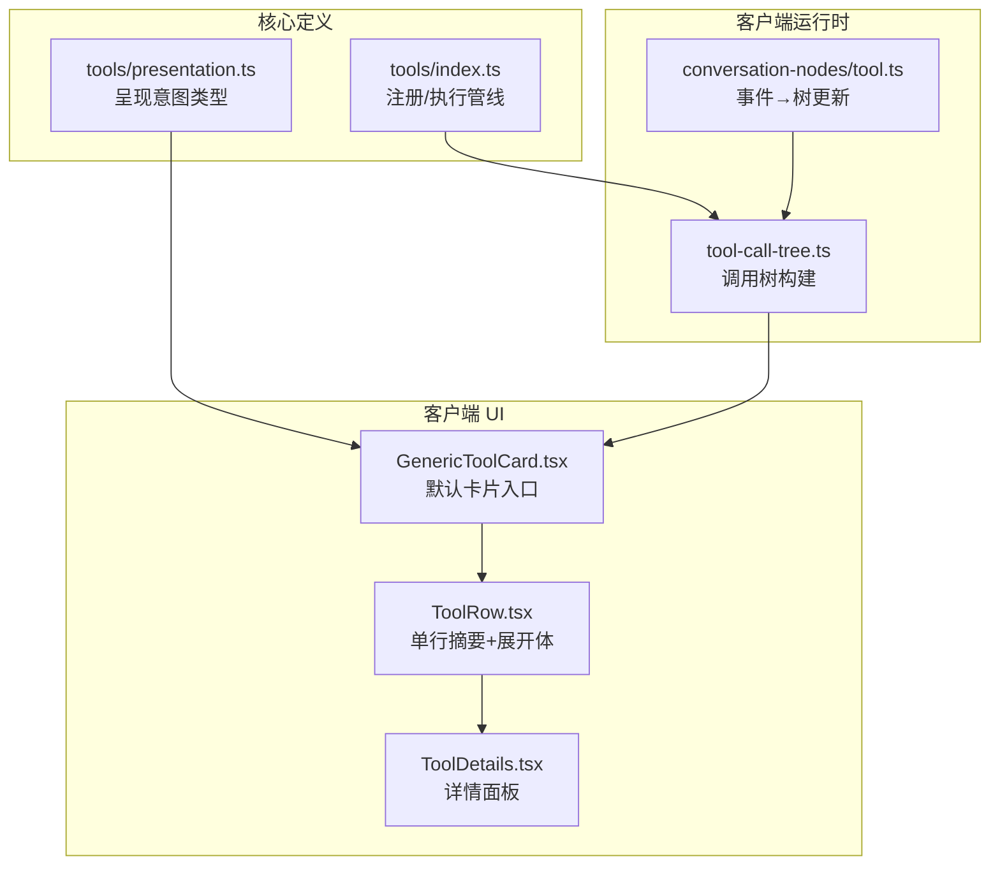
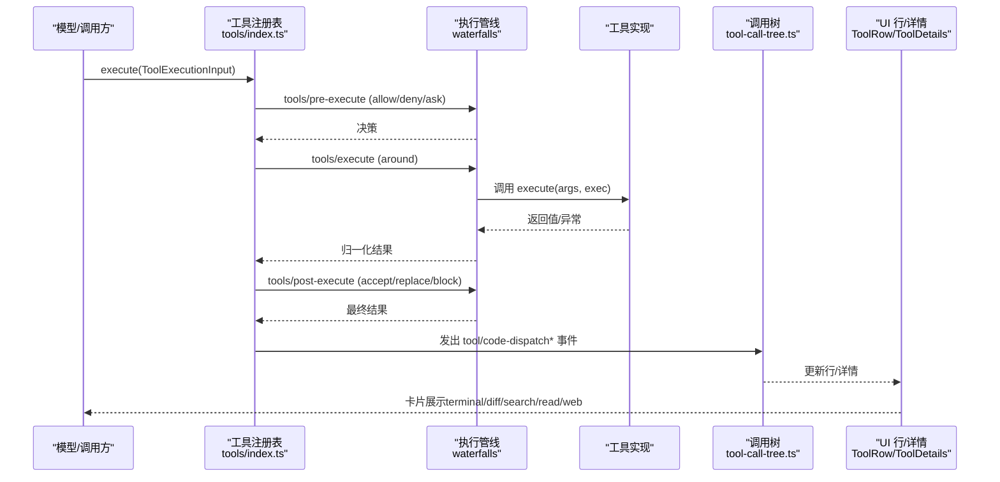
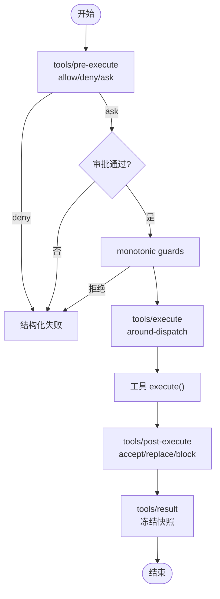
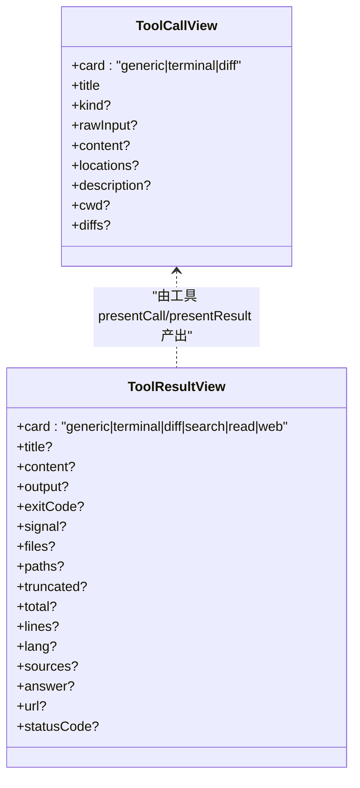
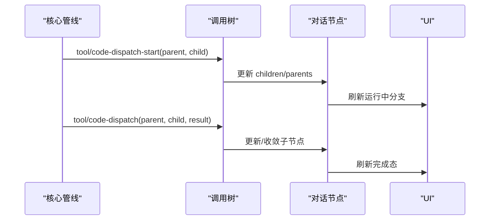
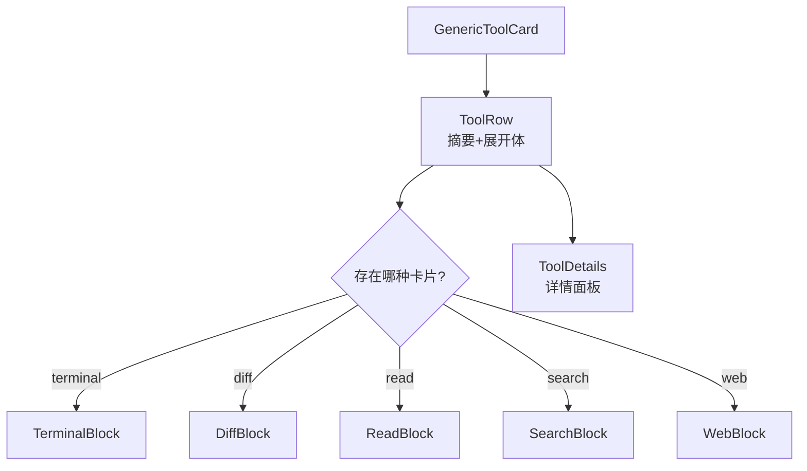
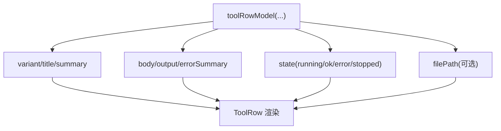
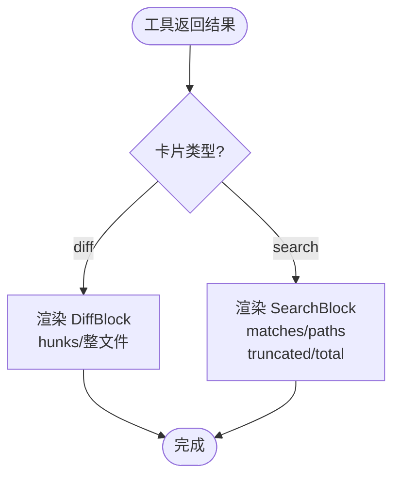
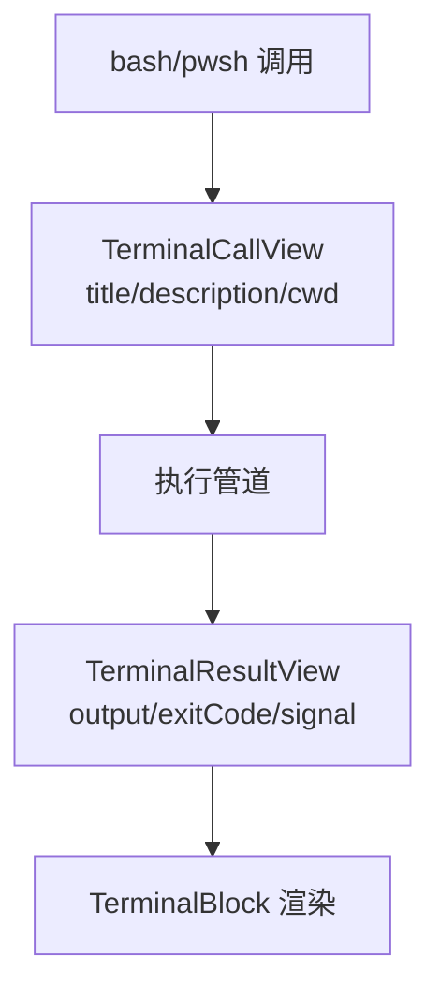
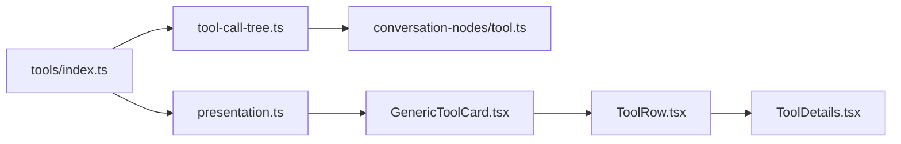

# 工具组件

<cite>
**本文引用的文件**
- [packages/core/tools/src/index.ts](file://packages/core/tools/src/index.ts)
- [packages/core/tools/src/presentation.ts](file://packages/core/tools/src/presentation.ts)
- [packages/client/ui-tool/src/client/tool/models/tool-call-model.ts](file://packages/client/ui-tool/src/client/tool/models/tool-call-model.ts)
- [packages/client/ui-tool/src/client/tool/components/ToolRow.tsx](file://packages/client/ui-tool/src/client/tool/components/ToolRow.tsx)
- [packages/client/ui-tool/src/client/tool/toolviews/GenericToolCard.tsx](file://packages/client/ui-tool/src/client/tool/toolviews/GenericToolCard.tsx)
- [packages/client/ui-tool/src/client/tool/ToolDetails.tsx](file://packages/client/ui-tool/src/client/tool/ToolDetails.tsx)
- [packages/client/runtime/src/client/sessions/tool-call-tree.ts](file://packages/client/runtime/src/client/sessions/tool-call-tree.ts)
- [packages/client/ui-conversation/src/client/conversation-nodes/tool.ts](file://packages/client/ui-conversation/src/client/conversation-nodes/tool.ts)
- [docs/subsystems/tools.md](file://docs/subsystems/tools.md)
- [docs/tool-catalog.md](file://docs/tool-catalog.md)
</cite>

## 目录
1. [简介](#简介)
2. [项目结构](#项目结构)
3. [核心组件](#核心组件)
4. [架构总览](#架构总览)
5. [详细组件分析](#详细组件分析)
6. [依赖关系分析](#依赖关系分析)
7. [性能考虑](#性能考虑)
8. [故障排查指南](#故障排查指南)
9. [结论](#结论)
10. [附录：扩展与自定义集成](#附录：扩展与自定义集成)

## 简介
本文件聚焦“工具相关 UI 组件”的实现与渲染机制，覆盖以下关键主题：
- 工具调用树、差异对比、搜索结果的可视化展示机制
- 工具状态管理、错误处理与用户反馈
- 工具卡片模型、视图组件与交互流程
- 工具执行管线（预执行、守卫、环绕、后执行、结果）与 UI 呈现的衔接
- 如何扩展与自定义工具，使其在 UI 中以卡片形式正确呈现

## 项目结构
围绕工具 UI 的关键代码分布在三层：
- 核心定义层：工具注册、执行管线、UI 呈现意图（presentation）
- 客户端运行时层：会话中的工具调用树构建与事件驱动更新
- 客户端 UI 层：行级卡片、详情面板、各类专用卡片（终端、diff、read、search、web）

图表来源
- [packages/core/tools/src/index.ts:1-200](file://packages/core/tools/src/index.ts#L1-L200)
- [packages/core/tools/src/presentation.ts:1-120](file://packages/core/tools/src/presentation.ts#L1-L120)
- [packages/client/runtime/src/client/sessions/tool-call-tree.ts:159-200](file://packages/client/runtime/src/client/sessions/tool-call-tree.ts#L159-L200)
- [packages/client/ui-conversation/src/client/conversation-nodes/tool.ts:144-170](file://packages/client/ui-conversation/src/client/conversation-nodes/tool.ts#L144-L170)
- [packages/client/ui-tool/src/client/tool/toolviews/GenericToolCard.tsx:1-62](file://packages/client/ui-tool/src/client/tool/toolviews/GenericToolCard.tsx#L1-L62)
- [packages/client/ui-tool/src/client/tool/components/ToolRow.tsx:1-93](file://packages/client/ui-tool/src/client/tool/components/ToolRow.tsx#L1-L93)
- [packages/client/ui-tool/src/client/tool/ToolDetails.tsx:1-47](file://packages/client/ui-tool/src/client/tool/ToolDetails.tsx#L1-L47)

章节来源
- [docs/subsystems/tools.md:1-120](file://docs/subsystems/tools.md#L1-L120)
- [docs/tool-catalog.md:1-45](file://docs/tool-catalog.md#L1-L45)

## 核心组件
- 工具注册与执行管线：提供 defineTool、schemas、execute、pre-execute/post-execute/execute waterfalls、result 事件等。
- 呈现意图（Presentation）：以 card-tagged union 描述 pending 与 completed 的 UI 意图（generic/terminal/diff/search/read/web）。
- 调用树：基于 tool/code-dispatch-start 与 tool/code-dispatch 事件维护父子关系，限制深度并防环。
- UI 行与详情：GenericToolCard 作为默认入口；ToolRow 统一渲染摘要与展开体；ToolDetails 承载详情面板。

章节来源
- [packages/core/tools/src/index.ts:142-200](file://packages/core/tools/src/index.ts#L142-L200)
- [packages/core/tools/src/presentation.ts:10-140](file://packages/core/tools/src/presentation.ts#L10-L140)
- [packages/client/runtime/src/client/sessions/tool-call-tree.ts:159-200](file://packages/client/runtime/src/client/sessions/tool-call-tree.ts#L159-L200)
- [packages/client/ui-tool/src/client/tool/toolviews/GenericToolCard.tsx:1-62](file://packages/client/ui-tool/src/client/tool/toolviews/GenericToolCard.tsx#L1-L62)
- [packages/client/ui-tool/src/client/tool/components/ToolRow.tsx:1-93](file://packages/client/ui-tool/src/client/tool/components/ToolRow.tsx#L1-L93)
- [packages/client/ui-tool/src/client/tool/ToolDetails.tsx:1-47](file://packages/client/ui-tool/src/client/tool/ToolDetails.tsx#L1-L47)

## 架构总览
工具从“声明 → 执行 → 结果 → 呈现”的完整链路如下：

图表来源
- [packages/core/tools/src/index.ts:142-200](file://packages/core/tools/src/index.ts#L142-L200)
- [packages/client/runtime/src/client/sessions/tool-call-tree.ts:159-200](file://packages/client/runtime/src/client/sessions/tool-call-tree.ts#L159-L200)
- [packages/client/ui-tool/src/client/tool/components/ToolRow.tsx:150-190](file://packages/client/ui-tool/src/client/tool/components/ToolRow.tsx#L150-L190)
- [packages/client/ui-tool/src/client/tool/ToolDetails.tsx:18-47](file://packages/client/ui-tool/src/client/tool/ToolDetails.tsx#L18-L47)

## 详细组件分析

### 工具执行管线与状态机
- 预执行（pre-execute）：允许、拒绝或请求审批。
- 守卫（guard）：单调性策略，只能减少权限。
- 环绕（execute）：超时、重试、指标等。
- 后执行（post-execute）：接受、替换内容或值、附加上下文或阻断。
- 结果（result）：不可变快照，供持久化与观察。

图表来源
- [packages/core/tools/src/index.ts:142-200](file://packages/core/tools/src/index.ts#L142-L200)
- [docs/subsystems/tools.md:370-405](file://docs/subsystems/tools.md#L370-L405)

章节来源
- [docs/subsystems/tools.md:170-405](file://docs/subsystems/tools.md#L170-L405)
- [packages/core/tools/src/index.ts:142-200](file://packages/core/tools/src/index.ts#L142-L200)

### 呈现意图与卡片模型
- pending 阶段：generic/terminal/diff
- completed 阶段：generic/terminal/diff/search/read/web
- 每种意图携带最小必要字段，UI 据此选择对应原语渲染

图表来源
- [packages/core/tools/src/presentation.ts:46-140](file://packages/core/tools/src/presentation.ts#L46-L140)
- [packages/core/tools/src/presentation.ts:140-390](file://packages/core/tools/src/presentation.ts#L140-L390)

章节来源
- [packages/core/tools/src/presentation.ts:10-390](file://packages/core/tools/src/presentation.ts#L10-L390)

### 调用树与事件驱动更新
- 事件：tool/code-dispatch-start（子调用开始）、tool/code-dispatch（子调用完成）
- 树维护父子关系、深度上限、防环
- conversation node 将事件映射为树节点增删改

图表来源
- [packages/client/runtime/src/client/sessions/tool-call-tree.ts:159-200](file://packages/client/runtime/src/client/sessions/tool-call-tree.ts#L159-L200)
- [packages/client/ui-conversation/src/client/conversation-nodes/tool.ts:144-170](file://packages/client/ui-conversation/src/client/conversation-nodes/tool.ts#L144-L170)

章节来源
- [packages/client/runtime/src/client/sessions/tool-call-tree.ts:159-200](file://packages/client/runtime/src/client/sessions/tool-call-tree.ts#L159-L200)
- [packages/client/ui-conversation/src/client/conversation-nodes/tool.ts:144-170](file://packages/client/ui-conversation/src/client/conversation-nodes/tool.ts#L144-L170)

### 行级卡片与详情面板
- GenericToolCard：根据工具名分类 variant，组合 Terminal/Diff/Read/Search/Web 卡片
- ToolRow：统一的单行摘要与展开体，支持文件路径链接、状态点、可访问性标签
- ToolDetails：按卡片类型选择对应原语渲染详情

图表来源
- [packages/client/ui-tool/src/client/tool/toolviews/GenericToolCard.tsx:1-62](file://packages/client/ui-tool/src/client/tool/toolviews/GenericToolCard.tsx#L1-L62)
- [packages/client/ui-tool/src/client/tool/components/ToolRow.tsx:150-190](file://packages/client/ui-tool/src/client/tool/components/ToolRow.tsx#L150-L190)
- [packages/client/ui-tool/src/client/tool/ToolDetails.tsx:18-47](file://packages/client/ui-tool/src/client/tool/ToolDetails.tsx#L18-L47)

章节来源
- [packages/client/ui-tool/src/client/tool/toolviews/GenericToolCard.tsx:1-62](file://packages/client/ui-tool/src/client/tool/toolviews/GenericToolCard.tsx#L1-L62)
- [packages/client/ui-tool/src/client/tool/components/ToolRow.tsx:1-308](file://packages/client/ui-tool/src/client/tool/components/ToolRow.tsx#L1-L308)
- [packages/client/ui-tool/src/client/tool/ToolDetails.tsx:1-47](file://packages/client/ui-tool/src/client/tool/ToolDetails.tsx#L1-L47)

### 工具行模型与交互
- 行模型：variant/title/summary/body/output/errorSummary/state/filePath
- 交互：整行点击展开、文件路径打开、Inspect 跳转轨迹、键盘可达
- 错误行：首行错误文本替代摘要，状态点提示

图表来源
- [packages/client/ui-tool/src/client/tool/models/tool-call-model.ts:17-99](file://packages/client/ui-tool/src/client/tool/models/tool-call-model.ts#L17-L99)
- [packages/client/ui-tool/src/client/tool/models/tool-call-model.ts:217-249](file://packages/client/ui-tool/src/client/tool/models/tool-call-model.ts#L217-L249)
- [packages/client/ui-tool/src/client/tool/components/ToolRow.tsx:128-190](file://packages/client/ui-tool/src/client/tool/components/ToolRow.tsx#L128-L190)

章节来源
- [packages/client/ui-tool/src/client/tool/models/tool-call-model.ts:17-249](file://packages/client/ui-tool/src/client/tool/models/tool-call-model.ts#L17-L249)
- [packages/client/ui-tool/src/client/tool/components/ToolRow.tsx:128-190](file://packages/client/ui-tool/src/client/tool/components/ToolRow.tsx#L128-L190)

### 差异对比与搜索结果可视化
- diff：pending 时展示预期变更（oldText/newText），completed 时展示已应用 hunk 或整文件 diff
- search：completed 时以 grouped-by-file 匹配或扁平路径列表呈现，附带 truncated/total 指示是否截断

图表来源
- [packages/core/tools/src/presentation.ts:178-267](file://packages/core/tools/src/presentation.ts#L178-L267)
- [packages/client/ui-tool/src/client/tool/components/ToolRow.tsx:246-260](file://packages/client/ui-tool/src/client/tool/components/ToolRow.tsx#L246-L260)

章节来源
- [packages/core/tools/src/presentation.ts:178-267](file://packages/core/tools/src/presentation.ts#L178-L267)
- [packages/client/ui-tool/src/client/tool/components/ToolRow.tsx:246-260](file://packages/client/ui-tool/src/client/tool/components/ToolRow.tsx#L246-L260)

### 终端执行可视化
- pending：terminal 卡片标题为命令，描述位于卡片上方
- completed：输出、退出码/信号，UI 可显示退出状态徽章或回退到 fenced console

图表来源
- [packages/core/tools/src/presentation.ts:77-100](file://packages/core/tools/src/presentation.ts#L77-L100)
- [packages/core/tools/src/presentation.ts:157-176](file://packages/core/tools/src/presentation.ts#L157-L176)
- [packages/client/ui-tool/src/client/tool/components/ToolRow.tsx:237-245](file://packages/client/ui-tool/src/client/tool/components/ToolRow.tsx#L237-L245)

章节来源
- [packages/core/tools/src/presentation.ts:77-176](file://packages/core/tools/src/presentation.ts#L77-L176)
- [packages/client/ui-tool/src/client/tool/components/ToolRow.tsx:237-245](file://packages/client/ui-tool/src/client/tool/components/ToolRow.tsx#L237-L245)

## 依赖关系分析
- 核心定义对 UI 呈现解耦：通过 presentation 类型约定，UI 仅消费 card-tagged union
- 运行时调用树依赖事件流，不直接耦合具体工具实现
- UI 行与详情通过模型派生，避免重复逻辑

图表来源
- [packages/core/tools/src/index.ts:1-200](file://packages/core/tools/src/index.ts#L1-L200)
- [packages/core/tools/src/presentation.ts:1-120](file://packages/core/tools/src/presentation.ts#L1-L120)
- [packages/client/runtime/src/client/sessions/tool-call-tree.ts:159-200](file://packages/client/runtime/src/client/sessions/tool-call-tree.ts#L159-L200)
- [packages/client/ui-tool/src/client/tool/toolviews/GenericToolCard.tsx:1-62](file://packages/client/ui-tool/src/client/tool/toolviews/GenericToolCard.tsx#L1-L62)
- [packages/client/ui-tool/src/client/tool/components/ToolRow.tsx:1-93](file://packages/client/ui-tool/src/client/tool/components/ToolRow.tsx#L1-L93)
- [packages/client/ui-tool/src/client/tool/ToolDetails.tsx:1-47](file://packages/client/ui-tool/src/client/tool/ToolDetails.tsx#L1-L47)

章节来源
- [packages/core/tools/src/index.ts:1-200](file://packages/core/tools/src/index.ts#L1-L200)
- [packages/core/tools/src/presentation.ts:1-120](file://packages/core/tools/src/presentation.ts#L1-L120)
- [packages/client/runtime/src/client/sessions/tool-call-tree.ts:159-200](file://packages/client/runtime/src/client/sessions/tool-call-tree.ts#L159-L200)
- [packages/client/ui-tool/src/client/tool/toolviews/GenericToolCard.tsx:1-62](file://packages/client/ui-tool/src/client/tool/toolviews/GenericToolCard.tsx#L1-L62)
- [packages/client/ui-tool/src/client/tool/components/ToolRow.tsx:1-93](file://packages/client/ui-tool/src/client/tool/components/ToolRow.tsx#L1-L93)
- [packages/client/ui-tool/src/client/tool/ToolDetails.tsx:1-47](file://packages/client/ui-tool/src/client/tool/ToolDetails.tsx#L1-L47)

## 性能考虑
- 调用树深度限制与防环：避免无限递归与恶意图结构导致崩溃
- 卡片内容截断：read/search/diff 等使用最大行数限制，防止长输出阻塞 UI
- 纯函数模型派生：行模型与卡片模型尽量无副作用，便于缓存与回放
- 事件驱动增量更新：仅更新受影响节点，降低重绘成本

[本节为通用指导，无需特定文件引用]

## 故障排查指南
- 工具未找到/未知：归类为 UNKNOWN_TOOL，进入结构化错误路径，不会中断轮次
- 参数校验失败：抛出 INVALID_ARGS，走工具错误通道
- 输出/呈现失败：被捕获为 JSON-safe isError，仍会到达 finalizeContent
- 审批缺失：ask 转为 deny，需补齐审批能力
- 调用树异常：深度超限或环检测会拒绝边，保证稳定性

章节来源
- [docs/subsystems/tools.md:370-405](file://docs/subsystems/tools.md#L370-L405)
- [packages/client/runtime/src/client/sessions/tool-call-tree.ts:159-200](file://packages/client/runtime/src/client/sessions/tool-call-tree.ts#L159-L200)

## 结论
该工具组件体系通过“强类型呈现意图 + 事件驱动的调用树 + 统一的行/详情渲染”实现了可扩展、可回放、可观测的工具 UI。工具只需声明呈现意图，即可在不同宿主中获得一致的体验；同时，执行管线的多阶段拦截保证了安全、可控与可审计。

[本节为总结，无需特定文件引用]

## 附录：扩展与自定义集成
- 新增工具
  - 使用 defineTool 声明 schema、execute、output 及可选 presentCall/presentResult
  - 在 presentCall/presentResult 中选择匹配的 card 类型（generic/terminal/diff/search/read/web）
  - 如需行为控制，注册 pre-execute/post-execute 监听器或 monotonic guard
- 自定义卡片
  - 在 GenericToolCard 或 ToolRow 中增加新的 card 分支，并对接对应的原语组件
  - 保持互斥：一次调用最多一种卡片类型
- 集成现有工具族
  - 参考 bash/pwsh（终端）、fs-search（grep/glob，search）、fs（read/write/edit，read/diff）的呈现方式
- 调试建议
  - 关注 tools/result 事件获取冻结快照
  - 检查 tool/code-dispatch* 事件序列确认调用树变化
  - 利用 ToolDetails 查看结构化输出与恢复信息（如 search 的 recovery）

章节来源
- [docs/subsystems/tools.md:459-468](file://docs/subsystems/tools.md#L459-L468)
- [docs/tool-catalog.md:17-45](file://docs/tool-catalog.md#L17-L45)
- [packages/client/ui-tool/src/client/tool/toolviews/GenericToolCard.tsx:1-62](file://packages/client/ui-tool/src/client/tool/toolviews/GenericToolCard.tsx#L1-L62)
- [packages/client/ui-tool/src/client/tool/components/ToolRow.tsx:150-190](file://packages/client/ui-tool/src/client/tool/components/ToolRow.tsx#L150-L190)
- [packages/client/ui-tool/src/client/tool/ToolDetails.tsx:18-47](file://packages/client/ui-tool/src/client/tool/ToolDetails.tsx#L18-L47)