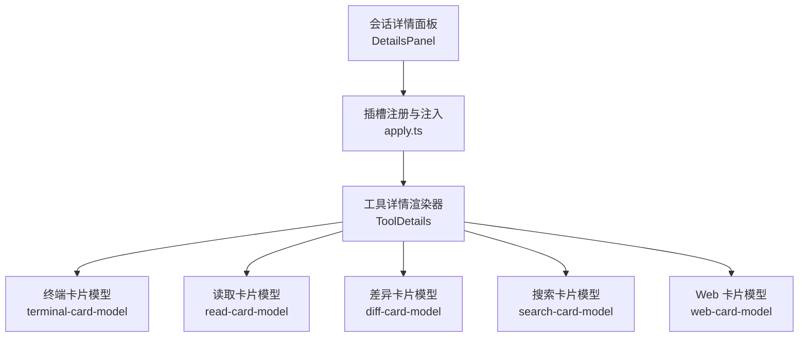
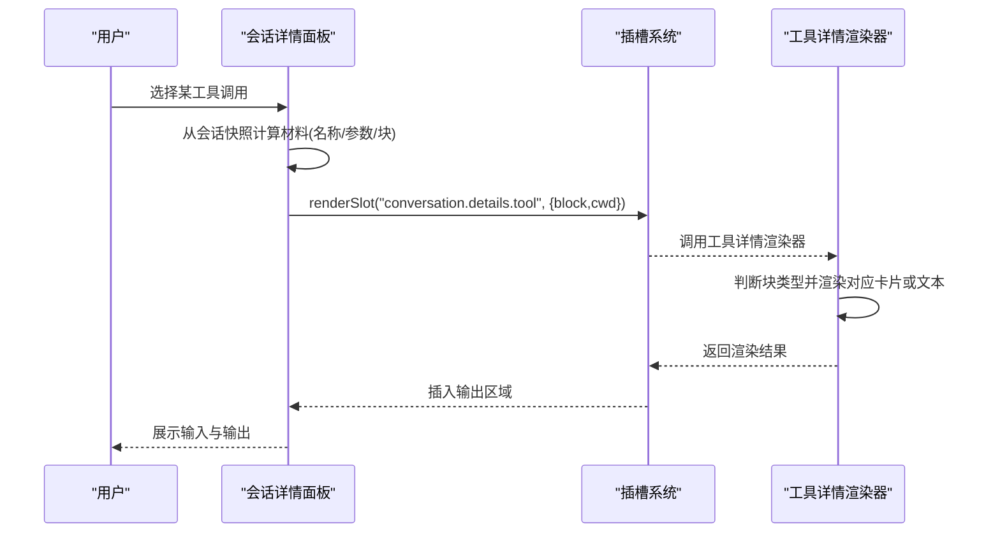
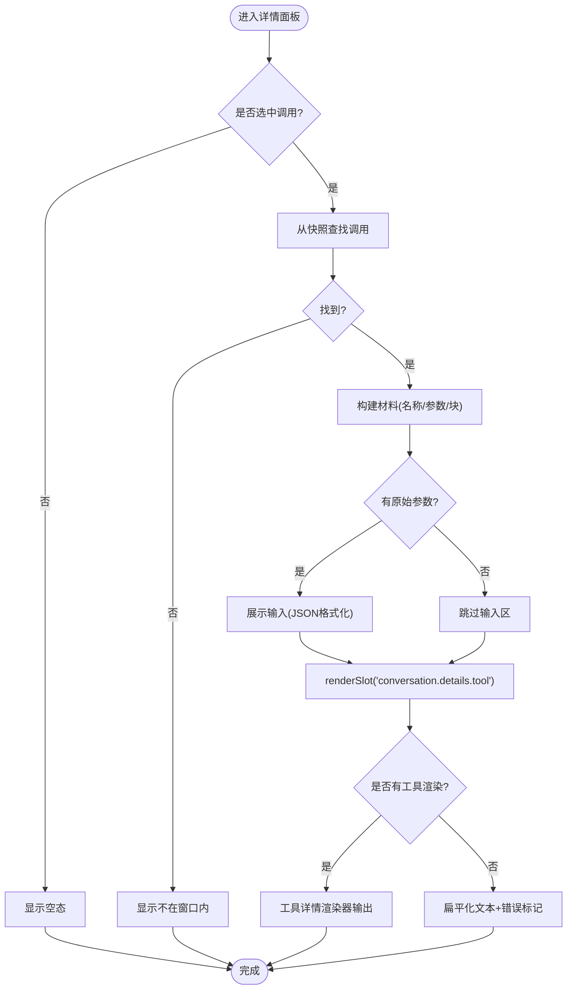
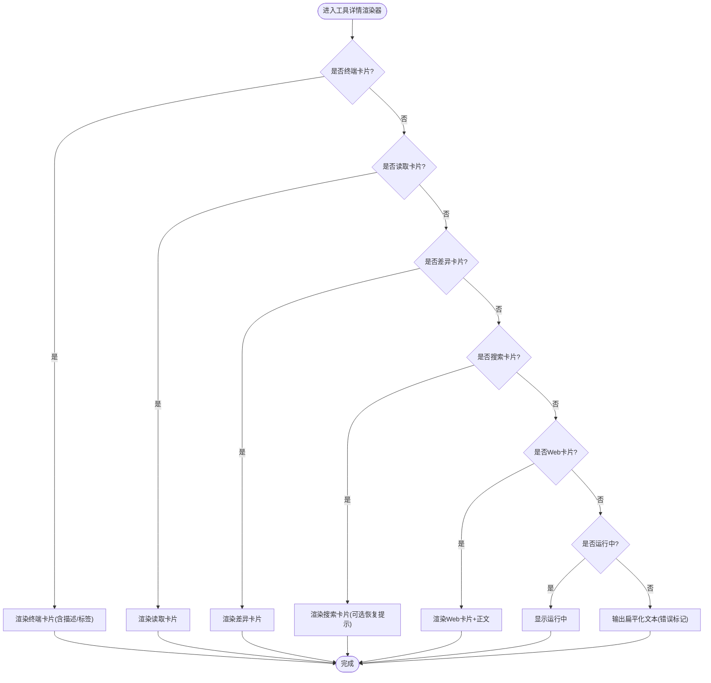
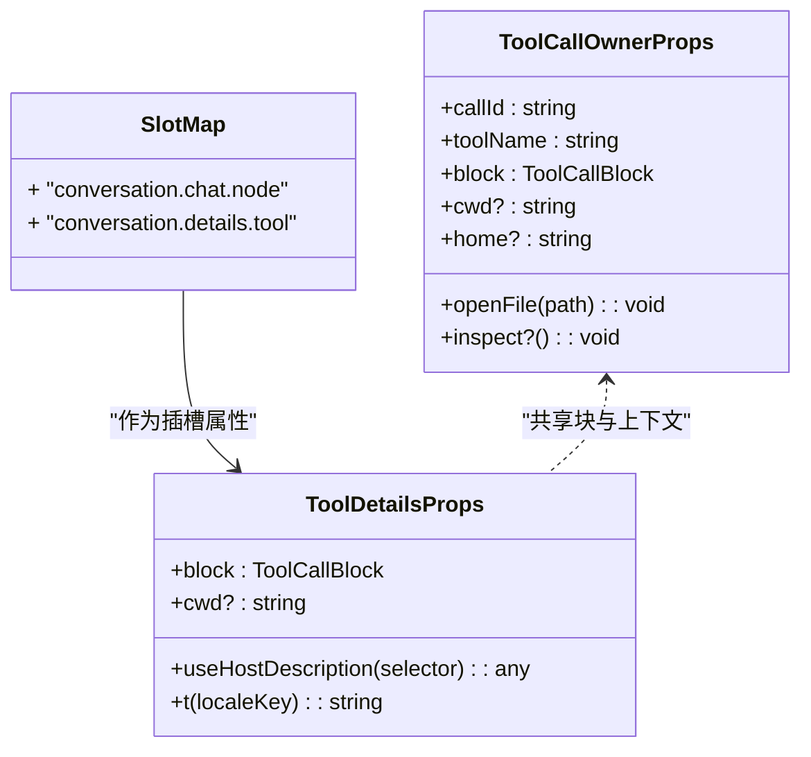
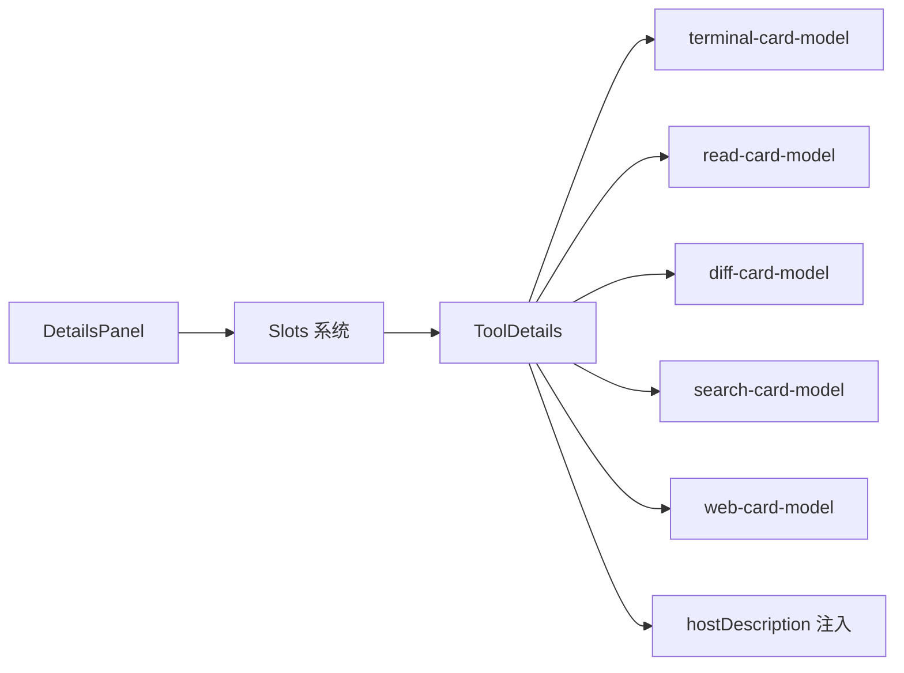

# 工具详情面板

<cite>
**本文引用的文件**
- [packages/client/ui-tool/src/client/apply.ts](file://packages/client/ui-tool/src/client/apply.ts)
- [packages/client/ui-tool/src/client/tool/ToolDetails.tsx](file://packages/client/ui-tool/src/client/tool/ToolDetails.tsx)
- [packages/client/ui-tool/src/client/contract/slots.ts](file://packages/client/ui-tool/src/client/contract/slots.ts)
- [packages/client/ui-conversation/src/client/skeleton/DetailsPanel.tsx](file://packages/client/ui-conversation/src/client/skeleton/DetailsPanel.tsx)
- [packages/client/ui-tool/tests/tool-details-render.client.tsx](file://packages/client/ui-tool/tests/tool-details-render.client.tsx)
</cite>

## 目录
1. [简介](#简介)
2. [项目结构](#项目结构)
3. [核心组件](#核心组件)
4. [架构总览](#架构总览)
5. [详细组件分析](#详细组件分析)
6. [依赖关系分析](#依赖关系分析)
7. [性能考虑](#性能考虑)
8. [故障排查指南](#故障排查指南)
9. [结论](#结论)
10. [附录](#附录)

## 简介
本文件面向“工具详情面板”的 UI 实现，围绕以下目标展开：
- 工具元数据展示、参数配置与执行历史的完整呈现
- 详情面板的数据绑定、动态渲染与状态管理机制
- 工具信息格式化、错误信息显示与用户操作反馈
- 详情面板布局设计、交互流程与用户体验优化
- 详情面板定制方法与扩展开发指南

该能力由会话侧的详情面板容器与工具插件提供的详情渲染器共同组成：会话负责选择与数据准备，工具插件负责按“块类型”进行结构化输出渲染。

## 项目结构
- 会话详情面板容器（Conversation Details Panel）
  - 负责从会话快照中定位选中的工具调用，提取名称、原始参数与冻结的“块”对象，并通过插槽机制将渲染委托给工具插件。
- 工具详情渲染器（Tool Details Renderer）
  - 根据“块”的类型（终端、读取、差异、搜索、Web 等）选择对应的卡片或通用文本输出；对运行中的调用给出占位提示；对错误结果进行标记显示。
- 插槽契约与注入
  - 定义工具详情插槽、所有者属性、宿主描述注入等类型与注册方式，确保跨模块协作一致。

图表来源
- [packages/client/ui-conversation/src/client/skeleton/DetailsPanel.tsx:66-129](file://packages/client/ui-conversation/src/client/skeleton/DetailsPanel.tsx#L66-L129)
- [packages/client/ui-tool/src/client/apply.ts:23-49](file://packages/client/ui-tool/src/client/apply.ts#L23-L49)
- [packages/client/ui-tool/src/client/tool/ToolDetails.tsx:18-62](file://packages/client/ui-tool/src/client/tool/ToolDetails.tsx#L18-L62)

章节来源
- [packages/client/ui-conversation/src/client/skeleton/DetailsPanel.tsx:66-129](file://packages/client/ui-conversation/src/client/skeleton/DetailsPanel.tsx#L66-L129)
- [packages/client/ui-tool/src/client/apply.ts:23-49](file://packages/client/ui-tool/src/client/apply.ts#L23-L49)
- [packages/client/ui-tool/src/client/tool/ToolDetails.tsx:18-62](file://packages/client/ui-tool/src/client/tool/ToolDetails.tsx#L18-L62)

## 核心组件
- 会话详情面板容器
  - 职责：维护选中项、计算材料（名称、原始参数、块）、渲染输入区与输出区、处理空态与不在窗口内的状态。
  - 关键点：通过会话快照查找工具调用；使用浅比较避免无关重渲染；将输出渲染委托给插槽。
- 工具详情渲染器
  - 职责：根据“块”类型分派到对应卡片或通用输出；对运行中调用给出提示；对错误结果进行标记。
  - 关键点：优先匹配特定卡片（终端、读取、差异、搜索、Web），否则回退为纯文本；支持宿主家目录用于路径缩写。
- 插槽契约与注入
  - 职责：声明工具详情插槽、所有者属性、宿主描述注入类型；在应用启动时完成注册。
  - 关键点：会话提供 block 与 cwd；工具插件通过注入获取 hostDescription 以支持 POSIX 家目录显示。

章节来源
- [packages/client/ui-conversation/src/client/skeleton/DetailsPanel.tsx:17-47](file://packages/client/ui-conversation/src/client/skeleton/DetailsPanel.tsx#L17-L47)
- [packages/client/ui-tool/src/client/contract/slots.ts:57-67](file://packages/client/ui-tool/src/client/contract/slots.ts#L57-L67)
- [packages/client/ui-tool/src/client/apply.ts:16-49](file://packages/client/ui-tool/src/client/apply.ts#L16-L49)

## 架构总览
详情面板采用“容器-渲染器”解耦模式：
- 容器（会话侧）只负责数据准备与基础布局，不关心具体工具的输出样式。
- 渲染器（工具插件侧）专注按“块”类型进行结构化展示，并统一处理运行中和错误状态。

图表来源
- [packages/client/ui-conversation/src/client/skeleton/DetailsPanel.tsx:66-129](file://packages/client/ui-conversation/src/client/skeleton/DetailsPanel.tsx#L66-L129)
- [packages/client/ui-tool/src/client/tool/ToolDetails.tsx:18-62](file://packages/client/ui-tool/src/client/tool/ToolDetails.tsx#L18-L62)

## 详细组件分析

### 会话详情面板（DetailsPanel）
- 数据绑定
  - 从会话快照中定位选中的工具调用，构造 CallMaterial（名称、原始参数、块）。
  - 使用浅比较缓存材料，减少无关重渲染。
- 布局与交互
  - 头部：标题与关闭按钮。
  - 主体：输入区（JSON 格式化展示）、输出区（委托给工具详情插槽）。
  - 空态：未选择、不在当前窗口、运行中等不同文案。
- 错误与回退
  - 若无工具插件渲染，回退为扁平化文本输出；若存在错误节点，附加错误信息。

图表来源
- [packages/client/ui-conversation/src/client/skeleton/DetailsPanel.tsx:33-64](file://packages/client/ui-conversation/src/client/skeleton/DetailsPanel.tsx#L33-L64)
- [packages/client/ui-conversation/src/client/skeleton/DetailsPanel.tsx:66-129](file://packages/client/ui-conversation/src/client/skeleton/DetailsPanel.tsx#L66-L129)

章节来源
- [packages/client/ui-conversation/src/client/skeleton/DetailsPanel.tsx:33-64](file://packages/client/ui-conversation/src/client/skeleton/DetailsPanel.tsx#L33-L64)
- [packages/client/ui-conversation/src/client/skeleton/DetailsPanel.tsx:66-129](file://packages/client/ui-conversation/src/client/skeleton/DetailsPanel.tsx#L66-L129)

### 工具详情渲染器（ToolDetails）
- 渲染策略
  - 终端：优先匹配终端卡片，附带可选描述与标签。
  - 读取：匹配读取卡片，传入工作目录与宿主家目录。
  - 差异：匹配差异卡片。
  - 搜索：匹配搜索卡片，必要时附加恢复提示。
  - Web：匹配 Web 卡片，并在下方附加原始正文。
  - 通用：非特定卡片时，输出扁平化文本；若为错误结果，添加错误标记。
  - 运行中：无 kind 字段时显示“运行中”。
- 数据与上下文
  - 通过注入获取宿主描述，用于路径缩写（如 POSIX 家目录）。
  - 接收 block 与 cwd，决定相对路径与摘要展示。

图表来源
- [packages/client/ui-tool/src/client/tool/ToolDetails.tsx:18-62](file://packages/client/ui-tool/src/client/tool/ToolDetails.tsx#L18-L62)

章节来源
- [packages/client/ui-tool/src/client/tool/ToolDetails.tsx:18-62](file://packages/client/ui-tool/src/client/tool/ToolDetails.tsx#L18-L62)

### 插槽契约与注入（slots.ts 与 apply.ts）
- 插槽声明
  - 工具详情插槽：类型为 conversation.details.tool，携带 locale 与注入能力。
  - 所有者属性：包含 callId、toolName、block、cwd、home、openFile、inspect 等。
- 注入机制
  - 通过 connection.hostDescription 注入宿主描述，供工具插件进行路径缩写等处理。
- 注册过程
  - 在应用启动时注册工具树节点与详情渲染器，并挂载内置原子视图（读取、搜索、Web、Todo、提问等）。

图表来源
- [packages/client/ui-tool/src/client/contract/slots.ts:8-67](file://packages/client/ui-tool/src/client/contract/slots.ts#L8-L67)
- [packages/client/ui-tool/src/client/apply.ts:23-49](file://packages/client/ui-tool/src/client/apply.ts#L23-L49)

章节来源
- [packages/client/ui-tool/src/client/contract/slots.ts:8-67](file://packages/client/ui-tool/src/client/contract/slots.ts#L8-L67)
- [packages/client/ui-tool/src/client/apply.ts:23-49](file://packages/client/ui-tool/src/client/apply.ts#L23-L49)

### 测试适配（tool-details-render.client.tsx）
- 作用：将工具详情渲染器适配到对话槽回调形状，便于直接测试。
- 要点：传递 t、description（宿主描述）以及 block/cwd，构造 renderSlot 实现。

章节来源
- [packages/client/ui-tool/tests/tool-details-render.client.tsx:52-73](file://packages/client/ui-tool/tests/tool-details-render.client.tsx#L52-L73)

## 依赖关系分析
- 会话详情面板依赖
  - 会话快照与选择状态：用于定位工具调用与计算材料。
  - 插槽系统：用于将输出渲染委托给工具插件。
- 工具详情渲染器依赖
  - 卡片模型：终端、读取、差异、搜索、Web 等。
  - 宿主描述注入：用于路径缩写与本地化。
- 插件注册依赖
  - 应用上下文：注入连接与插槽服务，完成注册与挂载。

图表来源
- [packages/client/ui-conversation/src/client/skeleton/DetailsPanel.tsx:66-129](file://packages/client/ui-conversation/src/client/skeleton/DetailsPanel.tsx#L66-L129)
- [packages/client/ui-tool/src/client/tool/ToolDetails.tsx:18-62](file://packages/client/ui-tool/src/client/tool/ToolDetails.tsx#L18-L62)
- [packages/client/ui-tool/src/client/apply.ts:23-49](file://packages/client/ui-tool/src/client/apply.ts#L23-L49)

章节来源
- [packages/client/ui-conversation/src/client/skeleton/DetailsPanel.tsx:66-129](file://packages/client/ui-conversation/src/client/skeleton/DetailsPanel.tsx#L66-L129)
- [packages/client/ui-tool/src/client/tool/ToolDetails.tsx:18-62](file://packages/client/ui-tool/src/client/tool/ToolDetails.tsx#L18-L62)
- [packages/client/ui-tool/src/client/apply.ts:23-49](file://packages/client/ui-tool/src/client/apply.ts#L23-L49)

## 性能考虑
- 数据层
  - 会话快照的结构共享与浅比较：材料对象仅当相关引用变化时才更新，避免不必要的重渲染。
- 渲染层
  - 卡片分派短路：优先匹配特定卡片，减少分支判断成本。
  - 键控渲染：输出区以 callId 为 key，隔离每调用的内部状态（如终端卡片的展开/复制）。
- 资源与 I/O
  - 路径缩写与本地化通过注入与 i18n 提供，避免重复计算。
  - JSON 格式化仅在需要时进行，非 JSON 内容原样展示。

[本节为通用性能建议，无需特定文件来源]

## 故障排查指南
- 常见问题
  - 详情面板为空：检查是否选择了有效的工具调用；确认会话快照中存在该调用。
  - 输出未渲染：确认工具插件已正确注册详情插槽；检查 renderSlot 调用是否正确传入 block 与 cwd。
  - 运行中状态：当块缺少 kind 字段时，会显示“运行中”，等待结算后重新渲染。
  - 错误显示：若无工具渲染且存在错误节点，回退文本会拼接错误名与代码。
- 调试建议
  - 在 DetailsPanel 中打印材料对象，确认名称、参数与块是否符合预期。
  - 在 ToolDetails 中逐步断点，观察卡片模型匹配顺序与最终分支。
  - 验证注入的 hostDescription 是否存在，以确保路径缩写正常。

章节来源
- [packages/client/ui-conversation/src/client/skeleton/DetailsPanel.tsx:33-64](file://packages/client/ui-conversation/src/client/skeleton/DetailsPanel.tsx#L33-L64)
- [packages/client/ui-conversation/src/client/skeleton/DetailsPanel.tsx:66-129](file://packages/client/ui-conversation/src/client/skeleton/DetailsPanel.tsx#L66-L129)
- [packages/client/ui-tool/src/client/tool/ToolDetails.tsx:18-62](file://packages/client/ui-tool/src/client/tool/ToolDetails.tsx#L18-L62)

## 结论
工具详情面板通过清晰的“容器-渲染器”分层实现了可扩展的工具输出展示：
- 会话侧负责数据准备与基础交互，保持轻量与稳定。
- 工具侧通过插槽与卡片模型实现丰富的结构化输出，易于扩展与维护。
- 统一的注入与类型契约保障了跨模块协作的一致性与可测试性。

[本节为总结性内容，无需特定文件来源]

## 附录
- 定制与扩展指南
  - 新增工具详情渲染：在工具插件中注册 conversation.details.tool 插槽，实现自定义渲染逻辑，遵循 block 类型判断与错误处理约定。
  - 新增原子视图：通过 keyed toolview 插槽注册特定工具的整行视图，覆盖默认行为或增强展示。
  - 注入宿主描述：使用注入的 hostDescription 进行路径缩写与本地化处理，提升可读性。
  - 测试适配：参考测试适配文件，将详情渲染器接入测试槽回调，便于单元测试与集成测试。

章节来源
- [packages/client/ui-tool/src/client/apply.ts:23-49](file://packages/client/ui-tool/src/client/apply.ts#L23-L49)
- [packages/client/ui-tool/tests/tool-details-render.client.tsx:52-73](file://packages/client/ui-tool/tests/tool-details-render.client.tsx#L52-L73)