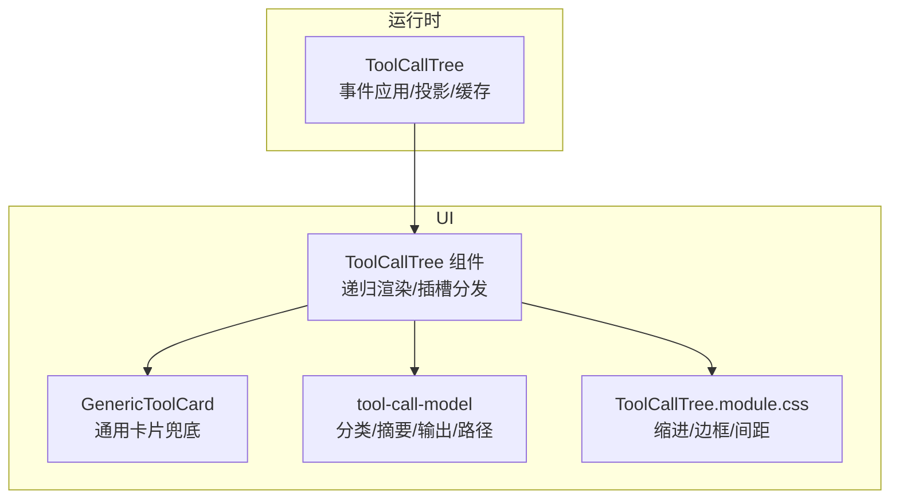
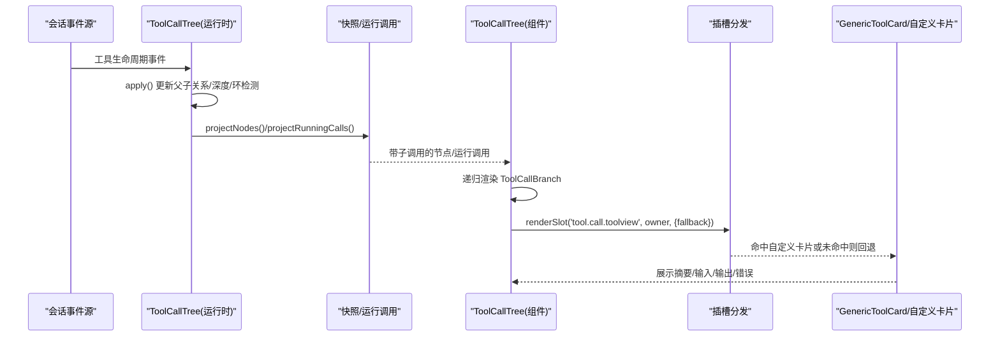
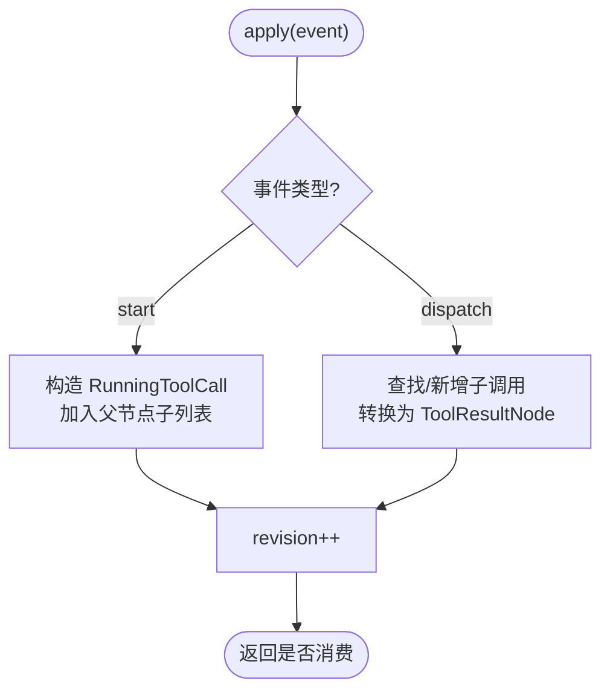
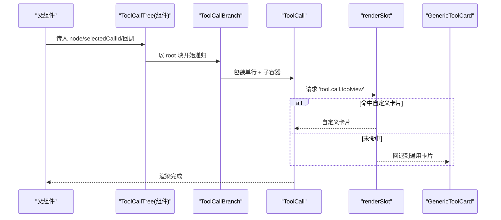
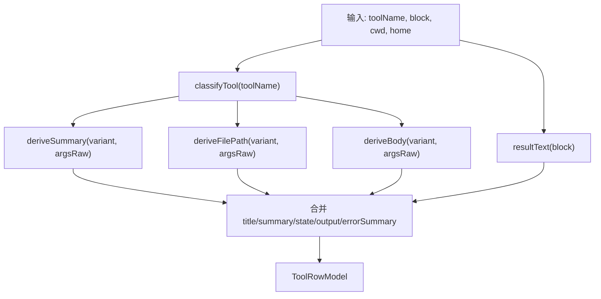
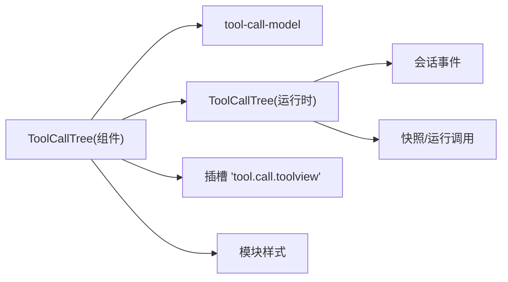

# 工具调用树

<cite>
**本文引用的文件**
- [ToolCallTree.tsx](file://packages/client/ui-tool/src/client/tool/ToolCallTree.tsx)
- [tool-call-tree.ts](file://packages/client/runtime/src/client/sessions/tool-call-tree.ts)
- [tool-call-model.ts](file://packages/client/ui-tool/src/client/tool/models/tool-call-model.ts)
- [ToolCallTree.module.css](file://packages/client/ui-tool/src/client/tool/ToolCallTree.module.css)
- [GenericToolCard.tsx](file://packages/client/ui-tool/src/client/tool/toolviews/GenericToolCard.tsx)
- [tool-call-tree.client.spec.tsx](file://packages/client/ui-tool/tests/tool-call-tree.client.spec.tsx)
- [tool-call-tree.client.spec.ts](file://packages/client/runtime/tests/tool-call-tree.client.spec.ts)
</cite>

## 目录
1. [简介](#简介)
2. [项目结构](#项目结构)
3. [核心组件](#核心组件)
4. [架构总览](#架构总览)
5. [详细组件分析](#详细组件分析)
6. [依赖关系分析](#依赖关系分析)
7. [性能考量](#性能考量)
8. [故障排查指南](#故障排查指南)
9. [结论](#结论)
10. [附录](#附录)

## 简介
本文件面向“工具调用树”相关 UI 组件与运行时模型，系统性说明：
- 调用关系的可视化展示与层级渲染逻辑
- 展开/折叠、状态同步与实时更新机制
- 调用链追踪、性能监控、错误定位与调试支持
- 调用树模型、节点组件与交互流程
- 配置选项、样式定制与扩展开发指南

该能力由两部分组成：
- 运行时层：负责从会话事件流中构建并维护“工具调用树”，提供投影（将子调用挂载到父调用）与缓存稳定化。
- UI 层：基于 React 递归渲染调用树，通过插槽机制实现可插拔的卡片视图，并提供选中态、路径解析、国际化等能力。

## 项目结构
围绕“工具调用树”的关键文件与职责如下：
- 运行时模型与投影：packages/client/runtime/src/client/sessions/tool-call-tree.ts
- UI 组件与渲染：packages/client/ui-tool/src/client/tool/ToolCallTree.tsx
- 行级模型与摘要/输出推导：packages/client/ui-tool/src/client/tool/models/tool-call-model.ts
- 通用卡片兜底视图：packages/client/ui-tool/src/client/tool/toolviews/GenericToolCard.tsx
- 样式：packages/client/ui-tool/src/client/tool/ToolCallTree.module.css
- 测试用例（UI 行为与运行时行为）：
  - packages/client/ui-tool/tests/tool-call-tree.client.spec.tsx
  - packages/client/runtime/tests/tool-call-tree.client.spec.ts

图表来源
- [tool-call-tree.ts:28-201](file://packages/client/runtime/src/client/sessions/tool-call-tree.ts#L28-L201)
- [ToolCallTree.tsx:1-113](file://packages/client/ui-tool/src/client/tool/ToolCallTree.tsx#L1-L113)
- [tool-call-model.ts:1-249](file://packages/client/ui-tool/src/client/tool/models/tool-call-model.ts#L1-L249)
- [ToolCallTree.module.css:1-13](file://packages/client/ui-tool/src/client/tool/ToolCallTree.module.css#L1-L13)

章节来源
- [tool-call-tree.ts:28-201](file://packages/client/runtime/src/client/sessions/tool-call-tree.ts#L28-L201)
- [ToolCallTree.tsx:1-113](file://packages/client/ui-tool/src/client/tool/ToolCallTree.tsx#L1-L113)
- [tool-call-model.ts:1-249](file://packages/client/ui-tool/src/client/tool/models/tool-call-model.ts#L1-L249)
- [ToolCallTree.module.css:1-13](file://packages/client/ui-tool/src/client/tool/ToolCallTree.module.css#L1-L13)

## 核心组件
- ToolCallTree（UI 组件）
  - 作用：渲染单个根工具调用及其递归子调用；通过插槽分发具体卡片视图；处理选中态与锚点标记。
  - 关键特性：
    - 使用 memo 优化重渲染
    - 通过 renderSlot('tool.call.toolview', ...) 进行可插拔渲染
    - 为每个调用行注入 data-chat-anchor-key、data-chat-call-id、data-selected 等属性，便于定位与选择
    - 通过 useHostDescription 获取 home/cwd 等信息用于路径缩写与相对化
- ToolCallTree（运行时类）
  - 作用：消费会话事件，构建父子调用关系，投影到快照/运行调用列表；提供深度限制与环检测，保证安全遍历。
  - 关键特性：
    - apply：处理 tool/code-dispatch-start 与 tool/code-dispatch 事件，维护 childrenByParent
    - projectNodes/projectRunningCalls：将子调用递归挂载到父节点，返回结构共享的稳定引用
    - acceptEdge/wouldCreateCycle：防止环与过深嵌套（MAX_TOOL_CALL_TREE_DEPTH=256）
- tool-call-model
  - 作用：根据工具名与参数/结果推导行级模型（variant/title/summary/body/output/errorSummary/state/filePath），供通用卡片或自定义卡片使用。
  - 关键特性：
    - classifyTool：工具名到变体映射
    - resultText：结果内容扁平化为文本
    - relativizeToCwd：工作区路径相对化
    - toolRowModel：综合生成一行所需的全部展示信息
- GenericToolCard
  - 作用：当未注册特定工具卡片时，作为兜底视图显示工具名称、摘要、输入/输出、错误摘要等。
- 样式
  - 子调用容器缩进、左边框、间距，形成清晰的层级视觉。

章节来源
- [ToolCallTree.tsx:1-113](file://packages/client/ui-tool/src/client/tool/ToolCallTree.tsx#L1-L113)
- [tool-call-tree.ts:28-201](file://packages/client/runtime/src/client/sessions/tool-call-tree.ts#L28-L201)
- [tool-call-model.ts:1-249](file://packages/client/ui-tool/src/client/tool/models/tool-call-model.ts#L1-L249)
- [GenericToolCard.tsx](file://packages/client/ui-tool/src/client/tool/toolviews/GenericToolCard.tsx)
- [ToolCallTree.module.css:1-13](file://packages/client/ui-tool/src/client/tool/ToolCallTree.module.css#L1-L13)

## 架构总览
下图展示了从事件到 UI 渲染的完整链路：事件进入运行时类，构建并投影调用树；UI 组件读取投影后的数据，递归渲染并通过插槽分发具体卡片。

图表来源
- [tool-call-tree.ts:57-136](file://packages/client/runtime/src/client/sessions/tool-call-tree.ts#L57-L136)
- [ToolCallTree.tsx:14-87](file://packages/client/ui-tool/src/client/tool/ToolCallTree.tsx#L14-L87)

## 详细组件分析

### 运行时：ToolCallTree 类
- 数据结构
  - childrenByParent：以父 callId 为键的子调用数组
  - depthByCall：记录每个 callId 的深度，用于深度限制
  - projectedByCall：对已投影节点的缓存，避免重复计算
  - nodesCache/runningCache：对投影结果的缓存，保证相同输入返回相同引用
- 事件处理
  - tool/code-dispatch-start：创建 RunningToolCall 并加入父节点子列表
  - tool/code-dispatch：将运行中的子调用落盘为 ToolResultNode，或新增后直接落盘
- 投影算法
  - 递归地将 childrenByParent 中的子调用挂载到对应父节点，保持结构共享
  - 若子列表无变化，直接复用原引用，减少重渲染
- 安全性
  - wouldCreateCycle：检测父子环
  - acceptEdge：限制最大深度 MAX_TOOL_CALL_TREE_DEPTH，超出则拒绝边

图表来源
- [tool-call-tree.ts:57-103](file://packages/client/runtime/src/client/sessions/tool-call-tree.ts#L57-L103)

章节来源
- [tool-call-tree.ts:28-201](file://packages/client/runtime/src/client/sessions/tool-call-tree.ts#L28-L201)

### UI：ToolCallTree 组件
- 渲染策略
  - ToolCall：包裹单行调用，注入 data-* 属性，通过 renderSlot 分发具体卡片
  - ToolCallBranch：递归渲染子调用，仅在存在子调用时渲染缩进容器
- 选中态
  - selectedCallId 与当前 block.callId 比较，设置 data-selected
- 宿主信息
  - 通过 useHostDescription 获取 home/cwd，用于路径缩写与相对化
- 插槽机制
  - 优先使用注册的 'tool.call.toolview' 卡片，否则回退到 GenericToolCard

图表来源
- [ToolCallTree.tsx:14-113](file://packages/client/ui-tool/src/client/tool/ToolCallTree.tsx#L14-L113)

章节来源
- [ToolCallTree.tsx:1-113](file://packages/client/ui-tool/src/client/tool/ToolCallTree.tsx#L1-L113)

### 行级模型：tool-call-model
- 工具变体分类：bash/read/search/write/edit/code/others
- 标题与摘要：
  - 根据工具名覆盖标题（如 pwsh -> Pwsh）
  - 摘要优先从参数关键字提取，其次回退到原始参数首行
- 输出与错误：
  - 结果文本扁平化，空结果且失败时回退到结构化错误的第一行
- 路径处理：
  - 仅 read/write/edit 等文件类工具提取 filePath
  - 支持相对化到工作区与 home 缩写

图表来源
- [tool-call-model.ts:77-249](file://packages/client/ui-tool/src/client/tool/models/tool-call-model.ts#L77-L249)

章节来源
- [tool-call-model.ts:1-249](file://packages/client/ui-tool/src/client/tool/models/tool-call-model.ts#L1-L249)

### 样式与层级视觉
- 子调用容器：左侧边框、缩进、间距，形成清晰层级
- 行圆角：提升可读性

章节来源
- [ToolCallTree.module.css:1-13](file://packages/client/ui-tool/src/client/tool/ToolCallTree.module.css#L1-L13)

## 依赖关系分析
- UI 组件依赖
  - 运行时：ToolCallTree（运行时类）提供投影后的节点/运行调用
  - 模型：tool-call-model 提供行级展示信息
  - 插槽：'tool.call.toolview' 用于替换默认卡片
  - 样式：模块 CSS
- 运行时依赖
  - 会话事件：tool/code-dispatch-start、tool/code-dispatch
  - 会话快照/运行调用：ConversationNode、RunningToolCall、ToolResultNode

图表来源
- [ToolCallTree.tsx:1-113](file://packages/client/ui-tool/src/client/tool/ToolCallTree.tsx#L1-L113)
- [tool-call-tree.ts:28-201](file://packages/client/runtime/src/client/sessions/tool-call-tree.ts#L28-L201)
- [tool-call-model.ts:1-249](file://packages/client/ui-tool/src/client/tool/models/tool-call-model.ts#L1-L249)

章节来源
- [ToolCallTree.tsx:1-113](file://packages/client/ui-tool/src/client/tool/ToolCallTree.tsx#L1-L113)
- [tool-call-tree.ts:28-201](file://packages/client/runtime/src/client/sessions/tool-call-tree.ts#L28-L201)
- [tool-call-model.ts:1-249](file://packages/client/ui-tool/src/client/tool/models/tool-call-model.ts#L1-L249)

## 性能考量
- 结构共享与缓存
  - 运行时对投影结果与节点列表进行缓存，相同输入返回相同引用，减少 UI 重渲染
  - 子列表无变化时直接复用原引用
- 深度限制
  - 最大深度 256，避免极端情况下的内存与渲染压力
- 组件优化
  - 使用 memo 包裹 ToolCall/ToolCallBranch，减少不必要的重渲染
- 建议
  - 在自定义卡片中尽量做局部更新，避免全量重建
  - 对大结果文本考虑分页/懒加载/虚拟滚动（由上层容器决定）

[本节为通用指导，不直接分析具体文件]

## 故障排查指南
- 无法看到子调用
  - 检查事件是否正确触发 tool/code-dispatch-start 与 tool/code-dispatch
  - 确认父/子 callId 匹配，且未被 acceptEdge 拒绝（环或超深）
- 选中态异常
  - 确认 selectedCallId 与 block.callId 一致
  - 检查 data-selected 属性是否被正确设置
- 路径显示不正确
  - 检查 cwd/home 是否正确传入
  - 确认路径是否为工作区绝对路径或 POSIX home 路径
- 性能问题
  - 观察是否存在大量重复投影或深层嵌套
  - 检查是否有自定义卡片导致大面积重渲染

章节来源
- [tool-call-tree.ts:164-199](file://packages/client/runtime/src/client/sessions/tool-call-tree.ts#L164-L199)
- [ToolCallTree.tsx:24-45](file://packages/client/ui-tool/src/client/tool/ToolCallTree.tsx#L24-L45)
- [tool-call-model.ts:159-164](file://packages/client/ui-tool/src/client/tool/models/tool-call-model.ts#L159-L164)

## 结论
“工具调用树”通过运行时与 UI 的分层设计，实现了：
- 安全稳定的调用关系构建（环检测、深度限制、结构共享）
- 灵活的 UI 渲染（插槽机制、通用兜底、选中态与锚点）
- 丰富的展示信息（变体分类、摘要、输出、错误、路径）
结合测试用例，可验证关键行为（选中态、递归渲染、路径缩写）。在实际使用中，可通过插槽扩展自定义卡片，满足多样化展示需求。

[本节为总结，不直接分析具体文件]

## 附录

### 配置与扩展
- 插槽扩展
  - 通过注册 'tool.call.toolview' 插槽，替换默认卡片
  - 插槽 owner 包含 callId、toolName、block、openFile、cwd、home、inspect 等上下文
- 样式定制
  - 修改 .callRow/.subCalls 等类名对应的样式
- 模型定制
  - 可在自定义卡片中复用 tool-call-model 的导出函数，获得一致的摘要/输出/路径处理

章节来源
- [ToolCallTree.tsx:24-45](file://packages/client/ui-tool/src/client/tool/ToolCallTree.tsx#L24-L45)
- [ToolCallTree.module.css:1-13](file://packages/client/ui-tool/src/client/tool/ToolCallTree.module.css#L1-L13)
- [tool-call-model.ts:77-249](file://packages/client/ui-tool/src/client/tool/models/tool-call-model.ts#L77-L249)

### 测试要点参考
- UI 行为
  - 根节点拥有锚点标记、通用兜底卡片、选中态
  - 递归渲染子调用，仅叶子被选中
  - POSIX home 路径缩写
- 运行时行为
  - 事件应用与投影的正确性
  - 深度限制与环检测

章节来源
- [tool-call-tree.client.spec.tsx:54-92](file://packages/client/ui-tool/tests/tool-call-tree.client.spec.tsx#L54-L92)
- [tool-call-tree.client.spec.ts](file://packages/client/runtime/tests/tool-call-tree.client.spec.ts)