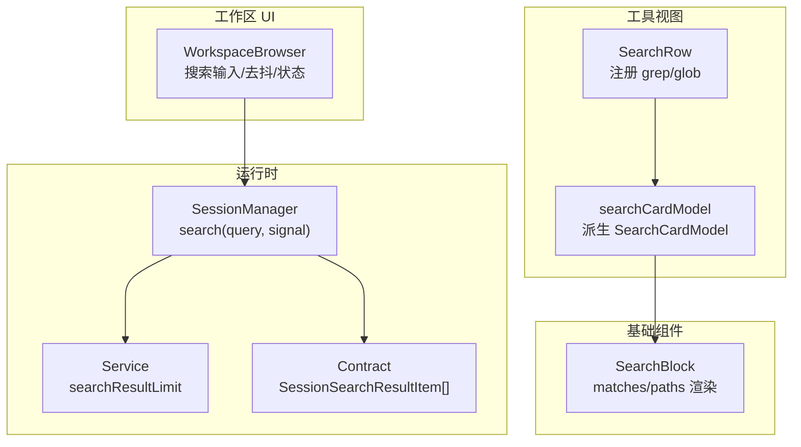
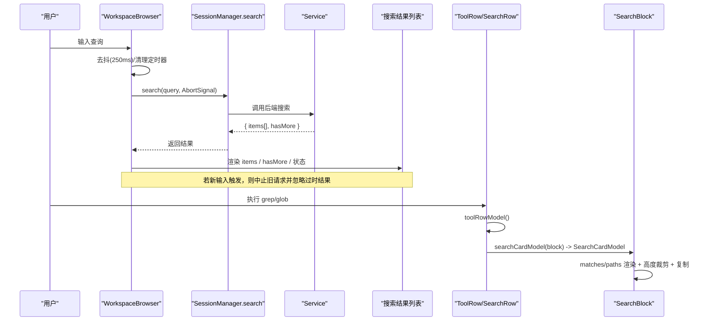
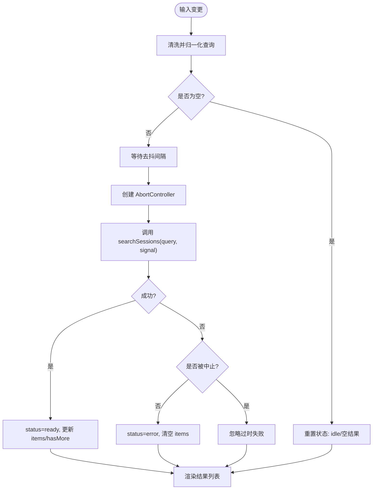
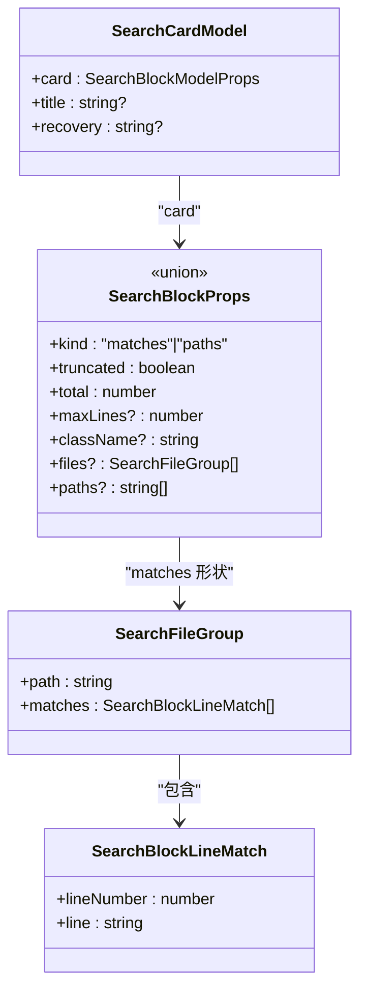
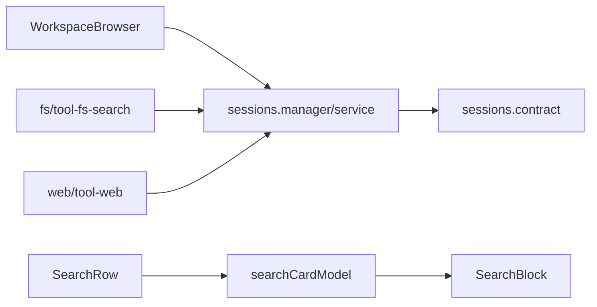

# 搜索结果组件

<cite>
**本文引用的文件**
- [packages/client/ui-tool/src/client/tool/models/search-card-model.ts](file://packages/client/ui-tool/src/client/tool/models/search-card-model.ts)
- [packages/client/ui-primitives/src/SearchBlock.tsx](file://packages/client/ui-primitives/src/SearchBlock.tsx)
- [packages/client/ui-tool/src/client/tool/toolviews/search-row.tsx](file://packages/client/ui-tool/src/client/tool/toolviews/search-row.tsx)
- [packages/client/ui-workspace/src/client/WorkspaceBrowser.tsx](file://packages/client/ui-workspace/src/client/WorkspaceBrowser.tsx)
- [packages/client/runtime/src/client/sessions/manager.ts](file://packages/client/runtime/src/client/sessions/manager.ts)
- [packages/client/runtime/src/client/sessions/service.ts](file://packages/client/runtime/src/client/sessions/service.ts)
- [packages/client/runtime/src/client/contract/sessions.ts](file://packages/client/runtime/src/client/contract/sessions.ts)
- [packages/fs/tool-fs-search/src/search-core.ts](file://packages/fs/tool-fs-search/src/search-core.ts)
- [packages/web/tool-web/src/search.ts](file://packages/web/tool-web/src/search.ts)
- [packages/context/file-reference-local/src/search.ts](file://packages/context/file-reference-local/src/search.ts)
</cite>

## 目录
1. [简介](#简介)
2. [项目结构](#项目结构)
3. [核心组件](#核心组件)
4. [架构总览](#架构总览)
5. [详细组件分析](#详细组件分析)
6. [依赖关系分析](#依赖关系分析)
7. [性能考量](#性能考量)
8. [故障排查指南](#故障排查指南)
9. [结论](#结论)
10. [附录](#附录)

## 简介
本文件围绕“搜索结果”相关 UI 组件，系统梳理搜索结果的展示、排序、筛选、匹配高亮、分页加载机制，以及搜索状态管理、结果缓存、性能优化与用户交互。重点覆盖：
- 会话侧边栏的远程搜索（输入去抖、请求取消、错误态、更多结果提示）
- 工具调用中的搜索卡片（grep/glob 的结构化结果渲染）
- 数据模型到视图的映射、高度裁剪与展开收起
- 可扩展的定制点与二次开发方法

## 项目结构
搜索结果能力由“运行时接口 + 工作区 UI + 工具视图 + 基础组件”四层协作完成：
- 运行时接口层：定义会话搜索的数据结构与 RPC 契约
- 工作区 UI 层：实现搜索输入、去抖、AbortSignal 取消、结果聚合与展示
- 工具视图层：将结构化搜索结果（matches/paths）渲染为可复制、可折叠的卡片
- 基础组件层：提供统一的搜索块渲染（行级高度裁剪、头部/尾部保留、复制反馈等）

图表来源
- [packages/client/ui-workspace/src/client/WorkspaceBrowser.tsx:790-877](file://packages/client/ui-workspace/src/client/WorkspaceBrowser.tsx#L790-L877)
- [packages/client/runtime/src/client/sessions/manager.ts:521-523](file://packages/client/runtime/src/client/sessions/manager.ts#L521-L523)
- [packages/client/runtime/src/client/sessions/service.ts:236-236](file://packages/client/runtime/src/client/sessions/service.ts#L236-L236)
- [packages/client/runtime/src/client/contract/sessions.ts:32-86](file://packages/client/runtime/src/client/contract/sessions.ts#L32-L86)
- [packages/client/ui-tool/src/client/tool/toolviews/search-row.tsx:39-65](file://packages/client/ui-tool/src/client/tool/toolviews/search-row.tsx#L39-L65)
- [packages/client/ui-tool/src/client/tool/models/search-card-model.ts:130-160](file://packages/client/ui-tool/src/client/tool/models/search-card-model.ts#L130-L160)
- [packages/client/ui-primitives/src/SearchBlock.tsx:173-278](file://packages/client/ui-primitives/src/SearchBlock.tsx#L173-L278)

章节来源
- [packages/client/ui-workspace/src/client/WorkspaceBrowser.tsx:790-877](file://packages/client/ui-workspace/src/client/WorkspaceBrowser.tsx#L790-L877)
- [packages/client/runtime/src/client/sessions/manager.ts:37-40](file://packages/client/runtime/src/client/sessions/manager.ts#L37-L40)
- [packages/client/runtime/src/client/sessions/service.ts:236-236](file://packages/client/runtime/src/client/sessions/service.ts#L236-L236)
- [packages/client/runtime/src/client/contract/sessions.ts:32-86](file://packages/client/runtime/src/client/contract/sessions.ts#L32-L86)
- [packages/client/ui-tool/src/client/tool/toolviews/search-row.tsx:39-65](file://packages/client/ui-tool/src/client/tool/toolviews/search-row.tsx#L39-L65)
- [packages/client/ui-tool/src/client/tool/models/search-card-model.ts:130-160](file://packages/client/ui-tool/src/client/tool/models/search-card-model.ts#L130-L160)
- [packages/client/ui-primitives/src/SearchBlock.tsx:173-278](file://packages/client/ui-primitives/src/SearchBlock.tsx#L173-L278)

## 核心组件
- 会话搜索（侧边栏）
  - 输入去抖、AbortSignal 取消旧请求、loading/error/ready 状态切换
  - 结果项包含 sessionId 与 snippet；支持 hasMore 提示
- 工具搜索卡片（grep/glob）
  - 通过 searchCardModel 从 resultView 派生 SearchCardModel
  - 两种形状：matches（按文件分组匹配行）、paths（路径列表）
  - 支持复制、高度裁剪、组折叠、恢复定位信息（当结果被截断时）

章节来源
- [packages/client/ui-workspace/src/client/WorkspaceBrowser.tsx:790-877](file://packages/client/ui-workspace/src/client/WorkspaceBrowser.tsx#L790-L877)
- [packages/client/ui-tool/src/client/tool/models/search-card-model.ts:130-160](file://packages/client/ui-tool/src/client/tool/models/search-card-model.ts#L130-L160)
- [packages/client/ui-primitives/src/SearchBlock.tsx:173-278](file://packages/client/ui-primitives/src/SearchBlock.tsx#L173-L278)

## 架构总览
下图展示了从用户输入到最终渲染的完整链路，包括会话搜索与工具搜索两条路径。

图表来源
- [packages/client/ui-workspace/src/client/WorkspaceBrowser.tsx:847-877](file://packages/client/ui-workspace/src/client/WorkspaceBrowser.tsx#L847-L877)
- [packages/client/runtime/src/client/sessions/manager.ts:521-523](file://packages/client/runtime/src/client/sessions/manager.ts#L521-L523)
- [packages/client/ui-tool/src/client/tool/toolviews/search-row.tsx:39-65](file://packages/client/ui-tool/src/client/tool/toolviews/search-row.tsx#L39-L65)
- [packages/client/ui-tool/src/client/tool/models/search-card-model.ts:130-160](file://packages/client/ui-tool/src/client/tool/models/search-card-model.ts#L130-L160)
- [packages/client/ui-primitives/src/SearchBlock.tsx:173-278](file://packages/client/ui-primitives/src/SearchBlock.tsx#L173-L278)

## 详细组件分析

### 会话搜索（侧边栏）
- 输入处理与去抖
  - 使用本地 state 保存 query，经 sanitize 与 trim 后作为 normalizedQuery
  - 基于 setTimeout 进行去抖，避免频繁请求
- 请求生命周期
  - 每次变更创建新的 AbortController，设置 status=loading
  - 成功后 status=ready，更新 items 与 hasMore
  - 失败时 status=error，清空 items
  - 组件卸载或新输入会清理定时器并 abort 旧请求，确保不显示过时结果
- 结果展示
  - 渲染 results.items 列表，每项通过 SearchResultItem 展示
  - pending/loading 显示“搜索中”，failed 显示“不可用”，空结果提示“无匹配”
  - hasMore 提示“还有更多结果（限制条数）”

图表来源
- [packages/client/ui-workspace/src/client/WorkspaceBrowser.tsx:842-877](file://packages/client/ui-workspace/src/client/WorkspaceBrowser.tsx#L842-L877)

章节来源
- [packages/client/ui-workspace/src/client/WorkspaceBrowser.tsx:790-877](file://packages/client/ui-workspace/src/client/WorkspaceBrowser.tsx#L790-L877)

### 工具搜索卡片（grep/glob）
- 模型派生
  - searchCardModel 仅读取 resultView，运行中返回 null
  - 校验 wire 数据：shape 必须为 'matches' 或 'paths'，files/paths 结构合法
  - 当 truncated=true 时，从 content 提取 recovery 文本（如“完整结果存储于…”）
- 视图渲染
  - SearchBlock 统一渲染两种形状：
    - matches：按文件分组，每组头按钮可折叠/展开，行号+行内容
    - paths：扁平路径列表
  - 高度裁剪：默认最大行数，超出部分隐藏，支持展开/收起
  - 复制功能：输出完整结构化文本（不受裁剪影响）
  - 摘要文案：根据 kind 显示“X 处匹配 · Y 个文件”或“X 个路径”，并在截断时显示“显示 X / 共 N …”

图表来源
- [packages/client/ui-tool/src/client/tool/models/search-card-model.ts:53-75](file://packages/client/ui-tool/src/client/tool/models/search-card-model.ts#L53-L75)
- [packages/client/ui-primitives/src/SearchBlock.tsx:24-72](file://packages/client/ui-primitives/src/SearchBlock.tsx#L24-L72)

章节来源
- [packages/client/ui-tool/src/client/tool/models/search-card-model.ts:130-160](file://packages/client/ui-tool/src/client/tool/models/search-card-model.ts#L130-L160)
- [packages/client/ui-primitives/src/SearchBlock.tsx:173-278](file://packages/client/ui-primitives/src/SearchBlock.tsx#L173-L278)

### 搜索结果数据结构
- 会话搜索结果项
  - sessionId：会话标识
  - snippet：命中片段
- 工具搜索结果
  - matches：files 数组，每个 file 含 path 与 matches（lineNumber + line）
  - paths：字符串数组
- 通用字段
  - truncated：是否被截断
  - total：截断前总数
  - title：可选标题（覆盖默认摘要）
  - recovery：当 truncated 时，原始结果中的恢复定位信息

章节来源
- [packages/client/runtime/src/client/sessions/manager.ts:37-40](file://packages/client/runtime/src/client/sessions/manager.ts#L37-L40)
- [packages/client/ui-tool/src/client/tool/models/search-card-model.ts:53-75](file://packages/client/ui-tool/src/client/tool/models/search-card-model.ts#L53-L75)
- [packages/client/ui-primitives/src/SearchBlock.tsx:24-72](file://packages/client/ui-primitives/src/SearchBlock.tsx#L24-L72)

### 匹配高亮
- 当前实现未对匹配片段进行高亮渲染，行内容以原文展示
- 如需高亮，可在 SearchBlock 的行渲染层增加正则匹配与标记逻辑（需考虑性能与 XSS 防护）

[本节为概念性说明，不直接分析具体文件]

### 分页加载机制
- 会话搜索
  - hasMore 指示是否存在更多结果；UI 显示“还有更多结果（限制条数）”
  - 可通过调整 searchResultLimit 控制单次返回数量
- 工具搜索
  - truncated + total 表示结果被截断；recovery 提供获取完整结果的线索
  - 高度裁剪（maxLines）用于前端展示压缩，不影响后端分页

章节来源
- [packages/client/ui-workspace/src/client/WorkspaceBrowser.tsx:728-732](file://packages/client/ui-workspace/src/client/WorkspaceBrowser.tsx#L728-L732)
- [packages/client/runtime/src/client/sessions/service.ts:236-236](file://packages/client/runtime/src/client/sessions/service.ts#L236-L236)
- [packages/client/ui-tool/src/client/tool/models/search-card-model.ts:135-140](file://packages/client/ui-tool/src/client/tool/models/search-card-model.ts#L135-L140)
- [packages/client/ui-primitives/src/SearchBlock.tsx:173-278](file://packages/client/ui-primitives/src/SearchBlock.tsx#L173-L278)

### 搜索状态管理与结果缓存
- 会话搜索状态
  - idle/loading/ready/error 四态，受输入变化驱动
  - 使用 AbortController 保证最新请求优先，旧请求被中止且其结果被忽略
- 结果缓存
  - 会话列表快照在 SessionManager 内部维护，搜索结果为请求级响应，未做跨查询持久缓存
  - 工具搜索卡片为纯函数派生，无额外缓存

章节来源
- [packages/client/ui-workspace/src/client/WorkspaceBrowser.tsx:842-877](file://packages/client/ui-workspace/src/client/WorkspaceBrowser.tsx#L842-L877)
- [packages/client/runtime/src/client/sessions/manager.ts:153-161](file://packages/client/runtime/src/client/sessions/manager.ts#L153-L161)

### 性能优化
- 输入去抖：250ms 延迟减少无效请求
- 请求取消：AbortController 及时中断过时请求
- 渲染裁剪：SearchBlock 默认高度限制，减少 DOM 节点
- 键值稳定：SearchBlock 行 key 设计避免不必要的重渲染
- 只读派生：searchCardModel 纯函数，避免副作用

章节来源
- [packages/client/ui-workspace/src/client/WorkspaceBrowser.tsx:847-877](file://packages/client/ui-workspace/src/client/WorkspaceBrowser.tsx#L847-L877)
- [packages/client/ui-primitives/src/SearchBlock.tsx:153-166](file://packages/client/ui-primitives/src/SearchBlock.tsx#L153-L166)
- [packages/client/ui-tool/src/client/tool/models/search-card-model.ts:130-160](file://packages/client/ui-tool/src/client/tool/models/search-card-model.ts#L130-L160)

### 用户交互
- 侧边栏搜索
  - 聚焦输入框、点击外部关闭、Esc 清空并收起
  - 状态提示：搜索中、不可用、无匹配、更多结果
- 工具搜索卡片
  - 复制按钮：一键复制完整结果
  - 文件组折叠/展开：快速定位关键文件
  - 展开其余行：按需查看被裁剪的结果

章节来源
- [packages/client/ui-workspace/src/client/WorkspaceBrowser.tsx:1018-1047](file://packages/client/ui-workspace/src/client/WorkspaceBrowser.tsx#L1018-L1047)
- [packages/client/ui-primitives/src/SearchBlock.tsx:216-278](file://packages/client/ui-primitives/src/SearchBlock.tsx#L216-L278)

## 依赖关系分析
- 工作区 UI 依赖运行时 sessions 接口进行远程搜索
- 工具视图依赖 searchCardModel 派生模型，再交由 SearchBlock 渲染
- 运行时服务暴露 searchResultLimit，约束单次返回规模
- 文件系统搜索与 Web 搜索模块提供底层搜索能力（供上层组合）

图表来源
- [packages/client/ui-workspace/src/client/WorkspaceBrowser.tsx:847-877](file://packages/client/ui-workspace/src/client/WorkspaceBrowser.tsx#L847-L877)
- [packages/client/runtime/src/client/sessions/manager.ts:521-523](file://packages/client/runtime/src/client/sessions/manager.ts#L521-L523)
- [packages/client/runtime/src/client/sessions/service.ts:236-236](file://packages/client/runtime/src/client/sessions/service.ts#L236-L236)
- [packages/client/ui-tool/src/client/tool/toolviews/search-row.tsx:39-65](file://packages/client/ui-tool/src/client/tool/toolviews/search-row.tsx#L39-L65)
- [packages/client/ui-tool/src/client/tool/models/search-card-model.ts:130-160](file://packages/client/ui-tool/src/client/tool/models/search-card-model.ts#L130-L160)
- [packages/client/ui-primitives/src/SearchBlock.tsx:173-278](file://packages/client/ui-primitives/src/SearchBlock.tsx#L173-L278)
- [packages/fs/tool-fs-search/src/search-core.ts](file://packages/fs/tool-fs-search/src/search-core.ts)
- [packages/web/tool-web/src/search.ts](file://packages/web/tool-web/src/search.ts)

章节来源
- [packages/client/ui-workspace/src/client/WorkspaceBrowser.tsx:847-877](file://packages/client/ui-workspace/src/client/WorkspaceBrowser.tsx#L847-L877)
- [packages/client/runtime/src/client/sessions/manager.ts:521-523](file://packages/client/runtime/src/client/sessions/manager.ts#L521-L523)
- [packages/client/runtime/src/client/sessions/service.ts:236-236](file://packages/client/runtime/src/client/sessions/service.ts#L236-L236)
- [packages/client/ui-tool/src/client/tool/toolviews/search-row.tsx:39-65](file://packages/client/ui-tool/src/client/tool/toolviews/search-row.tsx#L39-L65)
- [packages/client/ui-tool/src/client/tool/models/search-card-model.ts:130-160](file://packages/client/ui-tool/src/client/tool/models/search-card-model.ts#L130-L160)
- [packages/client/ui-primitives/src/SearchBlock.tsx:173-278](file://packages/client/ui-primitives/src/SearchBlock.tsx#L173-L278)
- [packages/fs/tool-fs-search/src/search-core.ts](file://packages/fs/tool-fs-search/src/search-core.ts)
- [packages/web/tool-web/src/search.ts](file://packages/web/tool-web/src/search.ts)

## 性能考量
- 网络层
  - 去抖与取消：避免重复请求与竞态
  - 限制单次返回量：searchResultLimit 控制带宽与渲染压力
- 渲染层
  - 高度裁剪与折叠：减少首屏 DOM 节点
  - 稳定 key：降低 React 重排
- 计算层
  - 纯函数派生：searchCardModel 无副作用，易于测试与复用
- 建议
  - 在高并发场景下，结合虚拟滚动进一步减少渲染开销
  - 对长路径/长行进行横向滚动而非换行，保持布局稳定

[本节提供通用指导，不直接分析具体文件]

## 故障排查指南
- 搜索无结果
  - 检查 normalizedQuery 是否为空
  - 确认 hasMore 与 items 长度
  - 查看 error 状态与后端可用性
- 请求被忽略
  - 新输入会中止旧请求，确认是否因竞态导致旧结果未显示
- 工具搜索卡片异常
  - 校验 resultView 的 shape 与 files/paths 结构
  - 若 truncated 为真，检查 recovery 文本是否可用
- 复制内容不完整
  - 复制行为输出完整结构化文本，不受高度裁剪影响；若仍缺失，检查上游数据

章节来源
- [packages/client/ui-workspace/src/client/WorkspaceBrowser.tsx:842-877](file://packages/client/ui-workspace/src/client/WorkspaceBrowser.tsx#L842-L877)
- [packages/client/ui-tool/src/client/tool/models/search-card-model.ts:135-160](file://packages/client/ui-tool/src/client/tool/models/search-card-model.ts#L135-L160)
- [packages/client/ui-primitives/src/SearchBlock.tsx:87-98](file://packages/client/ui-primitives/src/SearchBlock.tsx#L87-L98)

## 结论
该搜索结果体系通过清晰的职责分层与纯函数派生，实现了高效、可维护的搜索体验：
- 会话搜索具备健壮的状态管理与请求取消机制
- 工具搜索卡片提供一致、可复制、可折叠的展示方式
- 通过高度裁剪与限制返回量保障性能
- 扩展点明确：可在模型派生与渲染层定制行为与样式

[本节为总结性内容，不直接分析具体文件]

## 附录

### 定制选项与扩展方法
- 会话搜索
  - 调整 searchResultLimit 以改变单次返回数量
  - 自定义去抖间隔与错误提示文案
- 工具搜索卡片
  - 修改 SearchBlock 的默认 maxLines 与展开行为
  - 在 searchCardModel 中增强 recovery 文本解析或添加元数据
  - 在 SearchRow 中替换图标、标题与 locale 文案
- 高级定制
  - 在 SearchBlock 行渲染层加入匹配高亮（注意性能与安全性）
  - 接入虚拟滚动以支持超大结果集
  - 扩展 searchCardModel 以支持新的 shape 类型（需同步协议与校验）

章节来源
- [packages/client/ui-workspace/src/client/WorkspaceBrowser.tsx:847-877](file://packages/client/ui-workspace/src/client/WorkspaceBrowser.tsx#L847-L877)
- [packages/client/ui-tool/src/client/tool/models/search-card-model.ts:130-160](file://packages/client/ui-tool/src/client/tool/models/search-card-model.ts#L130-L160)
- [packages/client/ui-primitives/src/SearchBlock.tsx:173-278](file://packages/client/ui-primitives/src/SearchBlock.tsx#L173-L278)
- [packages/client/ui-tool/src/client/tool/toolviews/search-row.tsx:39-65](file://packages/client/ui-tool/src/client/tool/toolviews/search-row.tsx#L39-L65)