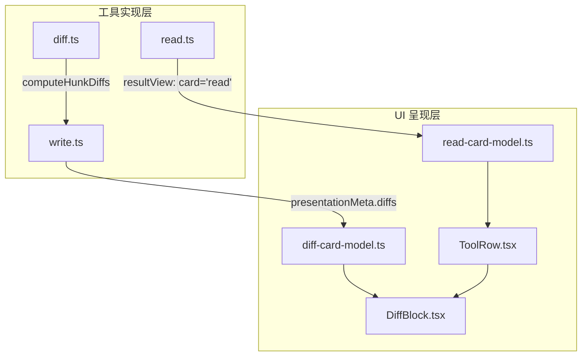
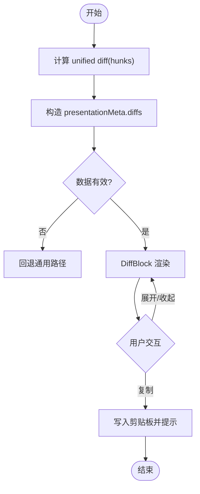
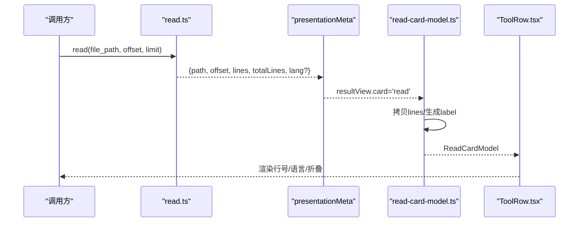
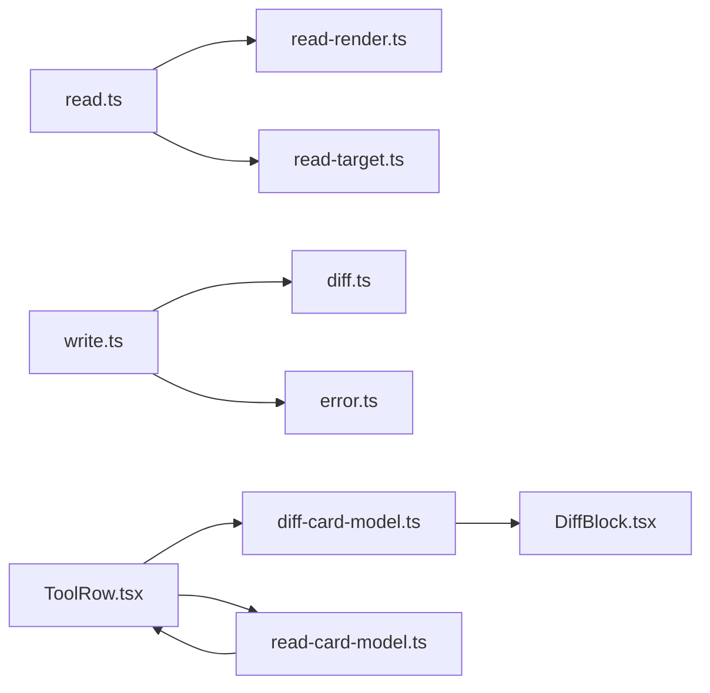

# 文件操作组件

<cite>
**本文引用的文件**
- [packages/client/ui-tool/src/client/tool/models/diff-card-model.ts](file://packages/client/ui-tool/src/client/tool/models/diff-card-model.ts)
- [packages/client/ui-tool/src/client/tool/models/read-card-model.ts](file://packages/client/ui-tool/src/client/tool/models/read-card-model.ts)
- [packages/client/ui-tool/src/client/tool/components/ToolRow.tsx](file://packages/client/ui-tool/src/client/tool/components/ToolRow.tsx)
- [packages/fs/tool-fs/src/diff.ts](file://packages/fs/tool-fs/src/diff.ts)
- [packages/fs/tool-fs/src/read.ts](file://packages/fs/tool-fs/src/read.ts)
- [packages/fs/tool-fs/src/write.ts](file://packages/fs/tool-fs/src/write.ts)
- [packages/client/ui-primitives/src/DiffBlock.tsx](file://packages/client/ui-primitives/src/DiffBlock.tsx)
- [packages/client/ui-primitives/tests/diff-block.client.spec.tsx](file://packages/client/ui-primitives/tests/diff-block.client.spec.tsx)
- [packages/client/ui-tool/tests/read-card.client.spec.tsx](file://packages/client/ui-tool/tests/read-card.client.spec.tsx)
</cite>

## 目录
1. [简介](#简介)
2. [项目结构](#项目结构)
3. [核心组件](#核心组件)
4. [架构总览](#架构总览)
5. [详细组件分析](#详细组件分析)
6. [依赖关系分析](#依赖关系分析)
7. [性能考虑](#性能考虑)
8. [故障排查指南](#故障排查指南)
9. [结论](#结论)
10. [附录：使用示例与扩展方法](#附录使用示例与扩展方法)

## 简介
本文件围绕“文件读取、差异对比、文件变更”等能力，系统梳理前端 UI 组件的渲染逻辑、数据流、状态管理与错误处理。重点覆盖：
- 文件内容展示（行号、语法高亮、窗口化）
- 代码高亮与差异标记的可视化机制
- 文件状态管理（运行中/已完成）、错误回退与用户交互
- 文件卡片模型（Diff/Read）、视图组件（DiffBlock/ReadBlock）与反馈机制
- 使用示例与自定义扩展方式

## 项目结构
该功能横跨“工具实现层（fs/tool-fs）”和“UI 呈现层（client/ui-tool + ui-primitives）”。关键组织如下：
- 工具实现层
  - read.ts：注册 read 工具，负责读取文本、构建窗口、输出结构化结果与 presentationMeta
  - write.ts：注册 write 工具，负责写入文件、计算并持久化 diff 元数据
  - diff.ts：基于 unified diff 生成按 hunk 的 FileDiff，并提供元数据校验
- UI 呈现层
  - ToolRow.tsx：工具调用行的统一入口，根据 card 类型分发到不同子卡片
  - models/*：将快照中的 call/resultView 转换为具体卡片的 props（diff-card-model.ts、read-card-model.ts）
  - ui-primitives/DiffBlock.tsx：差异块渲染器，负责行级增删、折叠、复制、统计
  - tests/*：对 Read/Diff 行为进行断言与回归保障



图表来源
- [packages/fs/tool-fs/src/read.ts:76-191](file://packages/fs/tool-fs/src/read.ts#L76-L191)
- [packages/fs/tool-fs/src/write.ts:69-149](file://packages/fs/tool-fs/src/write.ts#L69-L149)
- [packages/fs/tool-fs/src/diff.ts:33-79](file://packages/fs/tool-fs/src/diff.ts#L33-L79)
- [packages/client/ui-tool/src/client/tool/models/diff-card-model.ts:84-97](file://packages/client/ui-tool/src/client/tool/models/diff-card-model.ts#L84-L97)
- [packages/client/ui-tool/src/client/tool/models/read-card-model.ts:64-78](file://packages/client/ui-tool/src/client/tool/models/read-card-model.ts#L64-L78)
- [packages/client/ui-tool/src/client/tool/components/ToolRow.tsx:60-89](file://packages/client/ui-tool/src/client/tool/components/ToolRow.tsx#L60-L89)
- [packages/client/ui-primitives/src/DiffBlock.tsx:141-195](file://packages/client/ui-primitives/src/DiffBlock.tsx#L141-L195)

章节来源
- [packages/fs/tool-fs/src/read.ts:76-191](file://packages/fs/tool-fs/src/read.ts#L76-L191)
- [packages/fs/tool-fs/src/write.ts:69-149](file://packages/fs/tool-fs/src/write.ts#L69-L149)
- [packages/fs/tool-fs/src/diff.ts:33-79](file://packages/fs/tool-fs/src/diff.ts#L33-L79)
- [packages/client/ui-tool/src/client/tool/models/diff-card-model.ts:84-97](file://packages/client/ui-tool/src/client/tool/models/diff-card-model.ts#L84-L97)
- [packages/client/ui-tool/src/client/tool/models/read-card-model.ts:64-78](file://packages/client/ui-tool/src/client/tool/models/read-card-model.ts#L64-L78)
- [packages/client/ui-tool/src/client/tool/components/ToolRow.tsx:60-89](file://packages/client/ui-tool/src/client/tool/components/ToolRow.tsx#L60-L89)
- [packages/client/ui-primitives/src/DiffBlock.tsx:141-195](file://packages/client/ui-primitives/src/DiffBlock.tsx#L141-L195)

## 核心组件
- DiffBlock（差异块）
  - 输入：FileDiff[]（path/oldText/newText），支持高度上限与展开/收起
  - 行为：按 hunk 顺序渲染路径头、删除/新增行、同文件多段时的间隔行；统计新增/删除行数与文件数；支持一键复制为带前缀的差异文本
- ReadCardModel（读取卡片模型）
  - 仅结果侧可用；从 resultView 提取 path、lines、totalLines、lang，并生成 label（相对路径/家目录缩写）
- DiffCardModel（差异卡片模型）
  - 从 callView/resultView 的 diffs 字段推导；对跨端传输的数据做严格窄化，失败时回退通用路径
- ToolRow（工具行）
  - 统一入口，根据 card 类型（terminal/diff/read/search/web）选择对应子卡片渲染

章节来源
- [packages/client/ui-primitives/src/DiffBlock.tsx:23-44](file://packages/client/ui-primitives/src/DiffBlock.tsx#L23-L44)
- [packages/client/ui-primitives/src/DiffBlock.tsx:141-195](file://packages/client/ui-primitives/src/DiffBlock.tsx#L141-L195)
- [packages/client/ui-tool/src/client/tool/models/read-card-model.ts:20-37](file://packages/client/ui-tool/src/client/tool/models/read-card-model.ts#L20-L37)
- [packages/client/ui-tool/src/client/tool/models/read-card-model.ts:64-78](file://packages/client/ui-tool/src/client/tool/models/read-card-model.ts#L64-L78)
- [packages/client/ui-tool/src/client/tool/models/diff-card-model.ts:29-36](file://packages/client/ui-tool/src/client/tool/models/diff-card-model.ts#L29-L36)
- [packages/client/ui-tool/src/client/tool/models/diff-card-model.ts:84-97](file://packages/client/ui-tool/src/client/tool/models/diff-card-model.ts#L84-L97)
- [packages/client/ui-tool/src/client/tool/components/ToolRow.tsx:60-89](file://packages/client/ui-tool/src/client/tool/components/ToolRow.tsx#L60-L89)

## 架构总览
下图展示了“读/写工具 → 模型推导 → 视图渲染”的端到端流程，以及差异生成的关键位置。

```mermaid
sequenceDiagram
participant Model as "模型/调用方"
participant FS as "工具实现(read/write)"
participant Meta as "presentationMeta"
participant UI as "UI 模型(diff/read)"
participant View as "视图(DiffBlock/ReadBlock)"
Model->>FS : 调用 read/write
FS-->>Meta : 产出结构化 meta(lines/diffs/lang)
Meta-->>UI : 进入快照 resultView/callView
UI->>UI : 窄化/转换(读 : lines; 写 : diffs)
UI->>View : 传入 props(lines/diffs)
View-->>Model : 渲染差异/文件内容<br/>支持折叠/复制/统计
```

图表来源
- [packages/fs/tool-fs/src/read.ts:120-191](file://packages/fs/tool-fs/src/read.ts#L120-L191)
- [packages/fs/tool-fs/src/write.ts:95-149](file://packages/fs/tool-fs/src/write.ts#L95-L149)
- [packages/fs/tool-fs/src/diff.ts:33-79](file://packages/fs/tool-fs/src/diff.ts#L33-L79)
- [packages/client/ui-tool/src/client/tool/models/read-card-model.ts:64-78](file://packages/client/ui-tool/src/client/tool/models/read-card-model.ts#L64-L78)
- [packages/client/ui-tool/src/client/tool/models/diff-card-model.ts:84-97](file://packages/client/ui-tool/src/client/tool/models/diff-card-model.ts#L84-L97)
- [packages/client/ui-primitives/src/DiffBlock.tsx:141-195](file://packages/client/ui-primitives/src/DiffBlock.tsx#L141-L195)

## 详细组件分析

### 差异对比（Diff）
- 差异生成
  - 使用 unified diff 计算 before/after 的 hunks，每 hunk 携带 path/oldText/newText，并保留上下文行
  - 通过 presentationMeta 将 diffs 持久化，回放时可重建差异卡片
- 模型推导
  - 运行中：优先使用 callView 的 intended diff
  - 已完成：使用 resultView 的 applied diffs 替换
  - 对跨端数据做严格校验，异常则回退通用路径
- 视图渲染
  - 行级增删标记、同文件多段以间隔行分隔、路径头去重
  - 高度上限折叠，支持展开/收起；底部统计新增/删除行数与文件数
  - 一键复制为带前缀的差异文本，便于粘贴到外部编辑器



图表来源
- [packages/fs/tool-fs/src/diff.ts:33-79](file://packages/fs/tool-fs/src/diff.ts#L33-L79)
- [packages/fs/tool-fs/src/write.ts:95-149](file://packages/fs/tool-fs/src/write.ts#L95-L149)
- [packages/client/ui-tool/src/client/tool/models/diff-card-model.ts:48-97](file://packages/client/ui-tool/src/client/tool/models/diff-card-model.ts#L48-L97)
- [packages/client/ui-primitives/src/DiffBlock.tsx:141-195](file://packages/client/ui-primitives/src/DiffBlock.tsx#L141-L195)

章节来源
- [packages/fs/tool-fs/src/diff.ts:33-79](file://packages/fs/tool-fs/src/diff.ts#L33-L79)
- [packages/fs/tool-fs/src/write.ts:95-149](file://packages/fs/tool-fs/src/write.ts#L95-L149)
- [packages/client/ui-tool/src/client/tool/models/diff-card-model.ts:48-97](file://packages/client/ui-tool/src/client/tool/models/diff-card-model.ts#L48-L97)
- [packages/client/ui-primitives/src/DiffBlock.tsx:141-195](file://packages/client/ui-primitives/src/DiffBlock.tsx#L141-L195)
- [packages/client/ui-primitives/tests/diff-block.client.spec.tsx:35-159](file://packages/client/ui-primitives/tests/diff-block.client.spec.tsx#L35-L159)

### 文件读取（Read）
- 工具实现
  - 参数校验与默认值（offset/limit）
  - 大文件或未知大小采用流式读取，小文件整块读取
  - 构建窗口（lines/totalLines），并发安全保证
  - 输出 presentationMeta 包含 lines/lang/path/offset/totalLines，用于回放与 UI 卡片
- 模型推导
  - 仅结果侧可用；将 resultView.lines 拷贝为独立数组，避免持有运行时缓存引用
  - 标签生成：优先 title，否则相对路径+家目录缩写
- 视图渲染
  - 行号显示、语言识别（lang）
  - 聊天行内折叠（固定最大行数），详情面板保持默认上限
  - 测试覆盖：完整高度渲染、JSON Input 保留、其余行计数



图表来源
- [packages/fs/tool-fs/src/read.ts:56-163](file://packages/fs/tool-fs/src/read.ts#L56-L163)
- [packages/fs/tool-fs/src/read.ts:120-191](file://packages/fs/tool-fs/src/read.ts#L120-L191)
- [packages/client/ui-tool/src/client/tool/models/read-card-model.ts:64-78](file://packages/client/ui-tool/src/client/tool/models/read-card-model.ts#L64-L78)
- [packages/client/ui-tool/src/client/tool/components/ToolRow.tsx:72-76](file://packages/client/ui-tool/src/client/tool/components/ToolRow.tsx#L72-L76)

章节来源
- [packages/fs/tool-fs/src/read.ts:56-163](file://packages/fs/tool-fs/src/read.ts#L56-L163)
- [packages/fs/tool-fs/src/read.ts:120-191](file://packages/fs/tool-fs/src/read.ts#L120-L191)
- [packages/client/ui-tool/src/client/tool/models/read-card-model.ts:20-37](file://packages/client/ui-tool/src/client/tool/models/read-card-model.ts#L20-L37)
- [packages/client/ui-tool/src/client/tool/models/read-card-model.ts:64-78](file://packages/client/ui-tool/src/client/tool/models/read-card-model.ts#L64-L78)
- [packages/client/ui-tool/tests/read-card.client.spec.tsx:312-337](file://packages/client/ui-tool/tests/read-card.client.spec.tsx#L312-L337)

### 文件写入（Write）
- 工具实现
  - 参数校验（非空 file_path）
  - 沙箱策略解析与执行，记录观测版本
  - 输出 before/after，并通过 computeHunkDiffs 生成 diffs 存入 presentationMeta
- 模型推导
  - 运行中：callView 的 intended diff（oldText=null 表示覆盖）
  - 已完成：resultView 的 applied diffs；若缺失则回退 args.content
- 视图渲染
  - 复用 DiffBlock，统一差异展示体验

章节来源
- [packages/fs/tool-fs/src/write.ts:25-43](file://packages/fs/tool-fs/src/write.ts#L25-L43)
- [packages/fs/tool-fs/src/write.ts:69-149](file://packages/fs/tool-fs/src/write.ts#L69-L149)
- [packages/fs/tool-fs/src/diff.ts:33-79](file://packages/fs/tool-fs/src/diff.ts#L33-L79)
- [packages/client/ui-tool/src/client/tool/models/diff-card-model.ts:84-97](file://packages/client/ui-tool/src/client/tool/models/diff-card-model.ts#L84-L97)

## 依赖关系分析
- 工具实现依赖
  - read.ts 依赖 read-render.ts、read-target.ts 完成窗口构建与目标解析
  - write.ts 依赖 diff.ts 生成 hunks，error.ts 进行错误修复
- UI 层依赖
  - ToolRow 作为路由，依据 card 类型分派到 terminal/diff/read/search/web
  - diff-card-model.ts 与 read-card-model.ts 分别消费 tool-call-model.ts 的类型与工具
  - DiffBlock 为纯展示组件，不依赖业务逻辑



图表来源
- [packages/fs/tool-fs/src/read.ts:76-163](file://packages/fs/tool-fs/src/read.ts#L76-L163)
- [packages/fs/tool-fs/src/write.ts:69-149](file://packages/fs/tool-fs/src/write.ts#L69-L149)
- [packages/client/ui-tool/src/client/tool/components/ToolRow.tsx:60-89](file://packages/client/ui-tool/src/client/tool/components/ToolRow.tsx#L60-L89)
- [packages/client/ui-tool/src/client/tool/models/diff-card-model.ts:84-97](file://packages/client/ui-tool/src/client/tool/models/diff-card-model.ts#L84-L97)
- [packages/client/ui-tool/src/client/tool/models/read-card-model.ts:64-78](file://packages/client/ui-tool/src/client/tool/models/read-card-model.ts#L64-L78)
- [packages/client/ui-primitives/src/DiffBlock.tsx:141-195](file://packages/client/ui-primitives/src/DiffBlock.tsx#L141-L195)

章节来源
- [packages/fs/tool-fs/src/read.ts:76-163](file://packages/fs/tool-fs/src/read.ts#L76-L163)
- [packages/fs/tool-fs/src/write.ts:69-149](file://packages/fs/tool-fs/src/write.ts#L69-L149)
- [packages/client/ui-tool/src/client/tool/components/ToolRow.tsx:60-89](file://packages/client/ui-tool/src/client/tool/components/ToolRow.tsx#L60-L89)

## 性能考虑
- 差异渲染
  - 使用 useMemo 构建行列表，避免重复计算
  - 头部/尾部切片折叠，减少长差异的渲染压力
  - 复制操作异步且防抖，避免频繁剪贴板写入
- 文件读取
  - 大文件流式读取，避免内存峰值
  - 窗口化返回 lines/totalLines，限制单次传输量
- 回放与缓存
  - presentationMeta 持久化结构化数据，回放无需重新计算
  - 行数据在模型层拷贝，避免持有运行时缓存引用

[本节为通用指导，不直接分析具体文件]

## 故障排查指南
- 差异卡片为空或回退通用路径
  - 检查 callView/resultView 的 diffs 是否满足 narrowDiffs 约束（数组、对象、path/oldText/newText 类型）
  - 若 meta 缺失或格式错误，UI 会回退通用路径，避免崩溃
- 读取卡片未出现
  - 确认 resultView.card === 'read' 且 content 为单一 text 信封
  - 检查 presentationMeta 是否包含 lines/totalLines/path
- 差异复制无效
  - 浏览器剪贴板权限受限会导致写入失败；可重试或降级提示
- 行为验证参考测试
  - DiffBlock：路径头、删除/新增行、同文件多段、高度折叠、复制行为
  - ReadCard：完整高度渲染、JSON Input 保留、其余行计数

章节来源
- [packages/client/ui-tool/src/client/tool/models/diff-card-model.ts:48-60](file://packages/client/ui-tool/src/client/tool/models/diff-card-model.ts#L48-L60)
- [packages/fs/tool-fs/src/read.ts:172-191](file://packages/fs/tool-fs/src/read.ts#L172-L191)
- [packages/client/ui-primitives/tests/diff-block.client.spec.tsx:35-159](file://packages/client/ui-primitives/tests/diff-block.client.spec.tsx#L35-L159)
- [packages/client/ui-tool/tests/read-card.client.spec.tsx:312-337](file://packages/client/ui-tool/tests/read-card.client.spec.tsx#L312-L337)

## 结论
该文件操作组件通过“工具实现 + 模型推导 + 视图渲染”的分层设计，实现了：
- 安全的跨端数据传输与回放（presentationMeta）
- 一致的差异与文件内容展示（DiffBlock/ReadBlock）
- 健壮的错误回退与用户体验（窄化校验、折叠、复制）
- 可扩展的卡片体系（ToolRow 路由）

## 附录：使用示例与扩展方法
- 在工具中声明 read 卡片
  - 在 output.presentationMeta 中提供 path/offset/lines/totalLines/lang
  - 在 presentResult 中返回 card:'read' 的结构体
  - 参考路径：[read.ts:120-191](file://packages/fs/tool-fs/src/read.ts#L120-L191)
- 在工具中声明 diff 卡片
  - 在 output.presentationMeta 中提供 diffs（由 computeHunkDiffs 生成）
  - 在 presentCall/presentResult 中返回 card:'diff' 的结构体
  - 参考路径：[write.ts:95-149](file://packages/fs/tool-fs/src/write.ts#L95-L149)、[diff.ts:33-79](file://packages/fs/tool-fs/src/diff.ts#L33-L79)
- 自定义差异样式与交互
  - 通过 className 注入外层容器类名
  - 调整 maxLines 控制折叠阈值
  - 参考路径：[DiffBlock.tsx:37-44](file://packages/client/ui-primitives/src/DiffBlock.tsx#L37-L44)、[DiffBlock.tsx:141-195](file://packages/client/ui-primitives/src/DiffBlock.tsx#L141-L195)
- 自定义读取卡片标签与语言
  - 在 read-card-model 中重写 label 生成逻辑（如自定义路径缩写规则）
  - 通过 lang 字段启用语法高亮
  - 参考路径：[read-card-model.ts:64-78](file://packages/client/ui-tool/src/client/tool/models/read-card-model.ts#L64-L78)