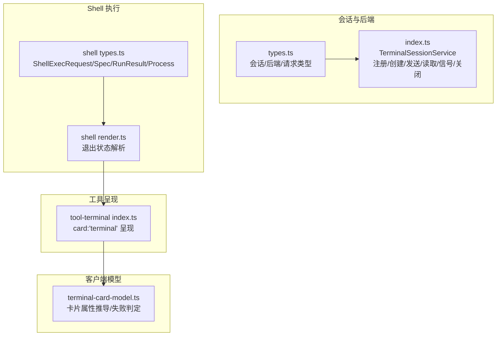
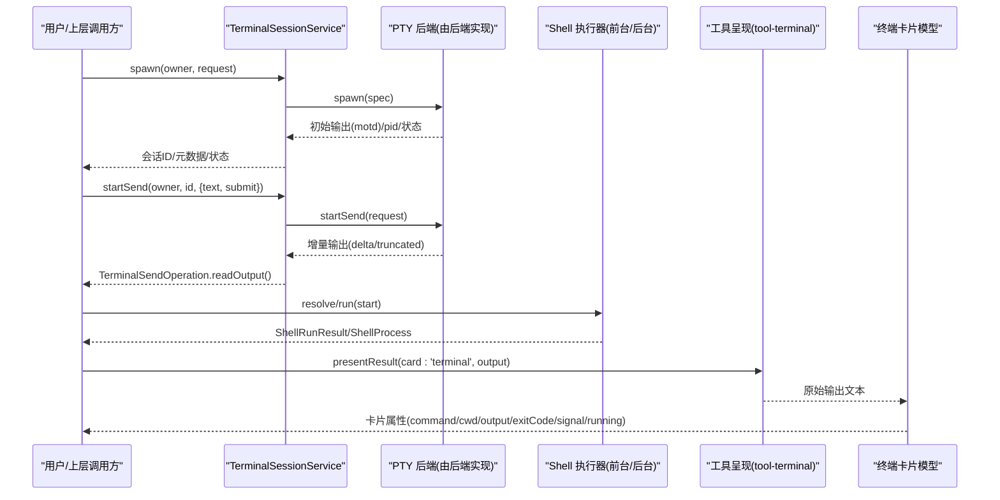
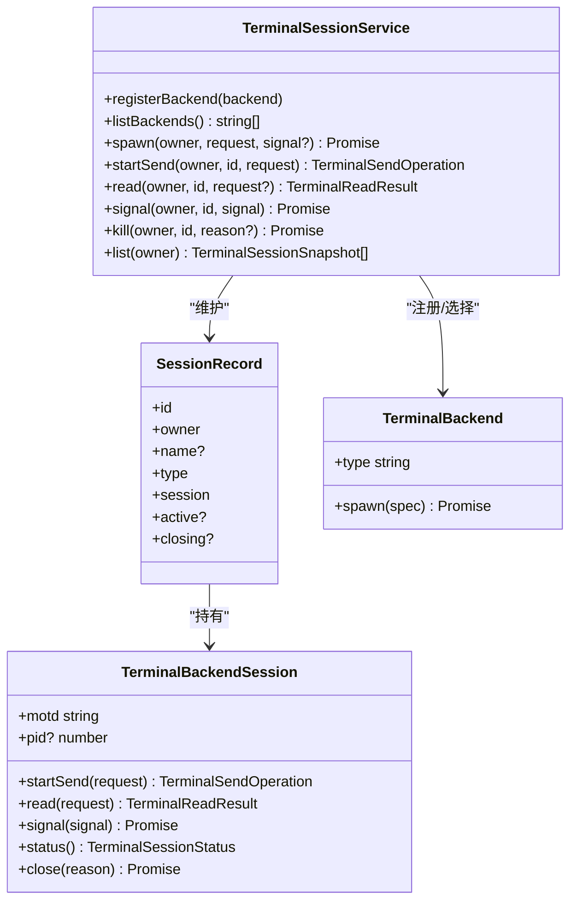
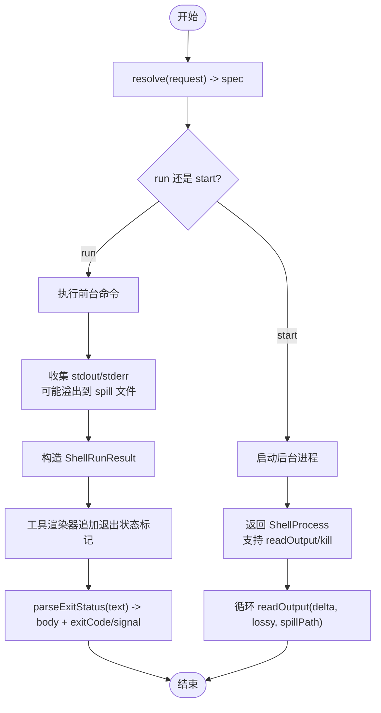
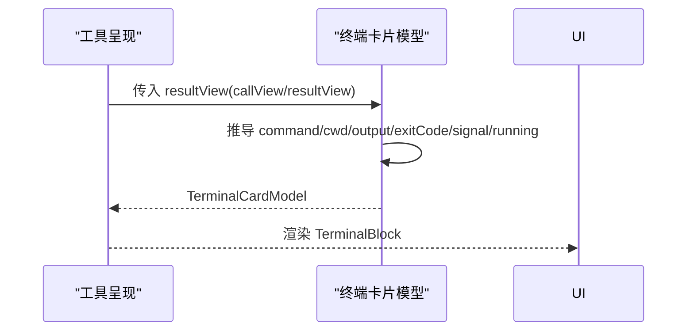
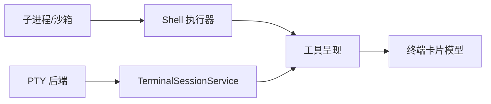

# 终端执行组件

<cite>
**本文引用的文件**
- [packages/terminal/terminal/src/types.ts](file://packages/terminal/terminal/src/types.ts)
- [packages/terminal/terminal/src/index.ts](file://packages/terminal/terminal/src/index.ts)
- [docs/subsystems/terminal.md](file://docs/subsystems/terminal.md)
- [docs/subsystems/shell.md](file://docs/subsystems/shell.md)
- [packages/shell/shell/src/types.ts](file://packages/shell/shell/src/types.ts)
- [packages/shell/shell/src/render.ts](file://packages/shell/shell/src/render.ts)
- [packages/client/ui-tool/src/client/tool/models/terminal-card-model.ts](file://packages/client/ui-tool/src/client/tool/models/terminal-card-model.ts)
- [packages/terminal/tool-terminal/src/index.ts](file://packages/terminal/tool-terminal/src/index.ts)
</cite>

## 目录
1. [简介](#简介)
2. [项目结构](#项目结构)
3. [核心组件](#核心组件)
4. [架构总览](#架构总览)
5. [详细组件分析](#详细组件分析)
6. [依赖关系分析](#依赖关系分析)
7. [性能考量](#性能考量)
8. [故障排查指南](#故障排查指南)
9. [结论](#结论)
10. [附录](#附录)

## 简介
本文件面向“终端执行相关 UI 组件”的完整实现与使用，覆盖以下主题：
- 命令行工具执行、输出展示与实时流式响应
- 终端模拟器渲染逻辑（ANSI 颜色、光标移动、行高限制与展开）
- 命令历史记录与输出格式化（退出码/信号标记解析）
- 终端会话管理、进程控制、错误捕获与用户输入处理
- 终端卡片模型、样式定制与交互式命令执行流程
- 终端组件配置选项与扩展开发指南（后端注册、会话生命周期、信号与读取）

## 项目结构
围绕终端执行能力，仓库采用分层与职责分离的组织方式：
- 会话与后端抽象层：定义 PTY 会话类型、后端接口与服务注册（TerminalSessionService）
- Shell 执行层：统一 bash/pwsh 执行契约、前台/后台进程、输出收集与环境注入
- 工具呈现层：将执行结果转换为 UI 可消费的“终端卡片”，并支持 ANSI 渲染与状态指示
- 客户端模型层：从调用快照推导终端卡片的显示属性（命令、工作目录、输出、退出状态等）

图表来源
- [packages/terminal/terminal/src/types.ts:1-178](file://packages/terminal/terminal/src/types.ts#L1-L178)
- [packages/terminal/terminal/src/index.ts:105-477](file://packages/terminal/terminal/src/index.ts#L105-L477)
- [packages/shell/shell/src/types.ts:32-184](file://packages/shell/shell/src/types.ts#L32-L184)
- [packages/shell/shell/src/render.ts:1-43](file://packages/shell/shell/src/render.ts#L1-L43)
- [packages/terminal/tool-terminal/src/index.ts:286-294](file://packages/terminal/tool-terminal/src/index.ts#L286-L294)
- [packages/client/ui-tool/src/client/tool/models/terminal-card-model.ts:1-75](file://packages/client/ui-tool/src/client/tool/models/terminal-card-model.ts#L1-L75)

章节来源
- [docs/subsystems/terminal.md:1-185](file://docs/subsystems/terminal.md#L1-L185)
- [docs/subsystems/shell.md:1-304](file://docs/subsystems/shell.md#L1-L304)

## 核心组件
- 终端会话服务（TerminalSessionService）
  - 负责 PTY 后端注册、会话创建、唯一 ID 发放、所有权校验、并发 send 控制、滚动回读、信号投递与会话关闭。
  - 提供 spawn/startSend/read/signal/kill/list 等能力，保证在 owner 作用域内安全隔离。
- Shell 执行器契约（ShellExecutor）
  - 统一前台 run 与后台 start 的执行语义；resolve 合并默认值与安全策略；返回结构化结果或进程句柄。
  - 通过 CollectedOutput 与 spill 文件保障大输出的完整性与可读性。
- 工具呈现（tool-terminal）
  - 将 shell 执行结果映射为 card:'terminal'，并在 presentResult 中输出原始文本供 UI 渲染。
- 客户端终端卡片模型（terminal-card-model）
  - 从 callView/resultView 推导 TerminalBlock 所需字段（command/cwd/output/exitCode/signal/running），并提供失败判定。

章节来源
- [packages/terminal/terminal/src/index.ts:105-477](file://packages/terminal/terminal/src/index.ts#L105-L477)
- [packages/shell/shell/src/types.ts:32-184](file://packages/shell/shell/src/types.ts#L32-L184)
- [packages/terminal/tool-terminal/src/index.ts:286-294](file://packages/terminal/tool-terminal/src/index.ts#L286-L294)
- [packages/client/ui-tool/src/client/tool/models/terminal-card-model.ts:1-75](file://packages/client/ui-tool/src/client/tool/models/terminal-card-model.ts#L1-L75)

## 架构总览
下图展示了从“用户输入”到“UI 终端卡片”的端到端流程，包括会话创建、命令发送、输出流式读取、退出状态解析与卡片渲染。

图表来源
- [packages/terminal/terminal/src/index.ts:154-312](file://packages/terminal/terminal/src/index.ts#L154-L312)
- [packages/terminal/terminal/src/types.ts:43-171](file://packages/terminal/terminal/src/types.ts#L43-L171)
- [packages/shell/shell/src/types.ts:32-184](file://packages/shell/shell/src/types.ts#L32-L184)
- [packages/terminal/tool-terminal/src/index.ts:286-294](file://packages/terminal/tool-terminal/src/index.ts#L286-L294)
- [packages/client/ui-tool/src/client/tool/models/terminal-card-model.ts:1-75](file://packages/client/ui-tool/src/client/tool/models/terminal-card-model.ts#L1-L75)

## 详细组件分析

### 终端会话服务（TerminalSessionService）
- 关键职责
  - 后端注册与列表查询：registerBackend/listBackends
  - 会话创建：spawn（含名称保留、未发布阶段取消、清理失败聚合）
  - 交互发送：startSend（每会话仅一个活跃 send，完成后自动释放）
  - 滚动回读：read（分页、偏移、总量、是否截断）
  - 信号投递：signal（仅限允许的信号集合）
  - 会话关闭：kill（幂等、等待后端清理完成）
  - 所有者生命周期：ensureOwnerCleanup/disposeOwned/disposeAll（确保资源回收）
- 并发与一致性
  - pendingSpawns 记录未发布阶段的 spawn，避免重复命名与竞态
  - active 字段保证同一会话不会并发 startSend
  - closing 字段保证 kill 幂等且可等待
- 错误与诊断
  - 标准化错误码（NO_BACKEND/FOREIGN_SESSION/SEND_ACTIVE/SERVICE_DISPOSING 等）
  - 清理失败通过 AggregateError 上报，不掩盖原始取消原因

图表来源
- [packages/terminal/terminal/src/index.ts:105-477](file://packages/terminal/terminal/src/index.ts#L105-L477)
- [packages/terminal/terminal/src/types.ts:147-171](file://packages/terminal/terminal/src/types.ts#L147-L171)

章节来源
- [packages/terminal/terminal/src/index.ts:105-477](file://packages/terminal/terminal/src/index.ts#L105-L477)
- [packages/terminal/terminal/src/types.ts:1-178](file://packages/terminal/terminal/src/types.ts#L1-L178)
- [docs/subsystems/terminal.md:1-185](file://docs/subsystems/terminal.md#L1-L185)

### Shell 执行器与输出处理
- 请求与规格
  - ShellExecRequest：面向模型/插件的请求，包含 command、可选 workdir/timeoutMs/stdoutMaxBytes/stdin/env/dshEnv/sandboxPolicy
  - ShellExecSpec：resolve 后的完整规格，必填字段补齐与安全上限应用
- 前台运行与后台进程
  - run：返回 ShellRunResult（exitCode/signal/timedOut/aborted/timeoutMs/stdout/stderr/sandbox?）
  - start：返回 ShellProcess（status/exitCode/signal/done/readOutput/kill），支持增量读取与溢出 spill 文件
- 输出格式化处理
  - 工具渲染器在结果末尾附加退出状态标记（如 “[exit code: N]”、“[killed by signal: X]”）
  - parseExitStatus 用于逆向解析，提取 body 与 exitCode/signal，便于 UI 单独展示“退出状态胶囊”

图表来源
- [packages/shell/shell/src/types.ts:32-184](file://packages/shell/shell/src/types.ts#L32-L184)
- [packages/shell/shell/src/render.ts:1-43](file://packages/shell/shell/src/render.ts#L1-L43)

章节来源
- [docs/subsystems/shell.md:1-304](file://docs/subsystems/shell.md#L1-L304)
- [packages/shell/shell/src/types.ts:32-184](file://packages/shell/shell/src/types.ts#L32-L184)
- [packages/shell/shell/src/render.ts:1-43](file://packages/shell/shell/src/render.ts#L1-L43)

### 工具呈现与终端卡片模型
- 工具呈现（tool-terminal）
  - 将执行结果以 card:'terminal' 形式呈现，presentResult 返回原始输出文本供 UI 渲染
- 终端卡片模型（terminal-card-model）
  - 从 callView/resultView 推导 TerminalBlock 的 props：command、cwd、output、exitCode、signal、running
  - 提供 terminalFailed 判断：非零退出码或终止信号即视为失败
  - 标签文案集中管理，便于多语言与一致性

图表来源
- [packages/terminal/tool-terminal/src/index.ts:286-294](file://packages/terminal/tool-terminal/src/index.ts#L286-L294)
- [packages/client/ui-tool/src/client/tool/models/terminal-card-model.ts:1-75](file://packages/client/ui-tool/src/client/tool/models/terminal-card-model.ts#L1-L75)

章节来源
- [packages/terminal/tool-terminal/src/index.ts:286-294](file://packages/terminal/tool-terminal/src/index.ts#L286-L294)
- [packages/client/ui-tool/src/client/tool/models/terminal-card-model.ts:1-75](file://packages/client/ui-tool/src/client/tool/models/terminal-card-model.ts#L1-L75)

### 终端模拟器的渲染逻辑（概念说明）
- 提示行与命令行：每条命令独占一行，首行显示工作目录标签，后续行为纯提示符
- 运行状态点：首次行左侧显示运行中/成功/失败状态点，与工具行图标一致
- 无软换行：输出区域使用 pre 风格，水平滚动保持列对齐
- 高度限制与展开：默认行数上限，超出时显示头部+尾部与展开按钮，隐藏行数提示
- ANSI 颜色与光标：按单元格维护样式状态，正确处理回车、退格、擦除序列与宽字符
- 退出状态与复制：非零退出码或信号显示状态胶囊；复制按钮复制原始输出文本

（本节为概念性说明，不直接对应具体源码文件）

## 依赖关系分析
- 会话服务依赖后端抽象，屏蔽不同 PTY 实现细节
- Shell 执行器依赖子进程与沙箱策略，统一前台/后台语义
- 工具呈现依赖 Shell 执行结果，将其转为 UI 友好的 card 类型
- 客户端模型依赖工具呈现产物，推导最终渲染属性

图表来源
- [packages/terminal/terminal/src/index.ts:105-477](file://packages/terminal/terminal/src/index.ts#L105-L477)
- [packages/shell/shell/src/types.ts:32-184](file://packages/shell/shell/src/types.ts#L32-L184)
- [packages/terminal/tool-terminal/src/index.ts:286-294](file://packages/terminal/tool-terminal/src/index.ts#L286-L294)
- [packages/client/ui-tool/src/client/tool/models/terminal-card-model.ts:1-75](file://packages/client/ui-tool/src/client/tool/models/terminal-card-model.ts#L1-L75)

章节来源
- [packages/terminal/terminal/src/index.ts:105-477](file://packages/terminal/terminal/src/index.ts#L105-L477)
- [packages/shell/shell/src/types.ts:32-184](file://packages/shell/shell/src/types.ts#L32-L184)
- [packages/terminal/tool-terminal/src/index.ts:286-294](file://packages/terminal/tool-terminal/src/index.ts#L286-L294)
- [packages/client/ui-tool/src/client/tool/models/terminal-card-model.ts:1-75](file://packages/client/ui-tool/src/client/tool/models/terminal-card-model.ts#L1-L75)

## 性能考量
- 输出截断与 spill 文件：当输出超过预算时，delta 仅保留尾部，完整内容落盘，避免内存膨胀
- 增量读取：ShellProcess.readOutput 与 TerminalSendOperation.readOutput 均支持增量消费，减少重复拷贝
- ANSI 渲染优化：按单元格维护样式状态，避免 O(n^2) 的序列累积；对无效序列进行过滤，降低 DOM 压力
- 会话并发控制：每会话仅允许一个活跃 send，避免竞争与重复输出
- 超时与取消：统一通过 AbortSignal 与 executor timeout 协调，确保及时释放资源

（本节为通用指导，不直接分析具体文件）

## 故障排查指南
- 常见错误码
  - NO_BACKEND：未注册对应 PTY 后端
  - FOREIGN_SESSION：操作不属于当前所有者
  - SEND_ACTIVE：会话已有活跃 send
  - SERVICE_DISPOSING：服务正在销毁
  - DUPLICATE_NAME/SESSION：名称或会话冲突
- 清理失败
  - 后端清理失败会聚合上报，需检查后端 close 实现与资源释放
- 输出不完整
  - 检查 truncated/lossy 标志与 spill 文件路径，定位完整输出位置
- 权限与沙箱
  - 关注 ShellSandboxInfo 的 denied/enforcement/runnerFailed，确认策略与执行环境

章节来源
- [packages/terminal/terminal/src/index.ts:54-71](file://packages/terminal/terminal/src/index.ts#L54-L71)
- [packages/shell/shell/src/types.ts:147-184](file://packages/shell/shell/src/types.ts#L147-L184)

## 结论
该终端执行体系通过清晰的层次划分与严格的契约设计，实现了：
- 安全的会话管理与后端解耦
- 统一的 Shell 执行语义与健壮的输出处理
- 高效的 UI 呈现与可扩展的终端卡片模型
- 完善的错误处理与资源回收机制

在此基础上，可通过注册新的 PTY 后端、扩展 Shell 执行器与自定义工具呈现，快速构建多样化的终端交互体验。

## 附录

### 配置与扩展开发指南
- 注册 PTY 后端
  - 实现 TerminalBackend 接口，并通过 registerBackend 注册
  - 注意 type 唯一性与生命周期管理
- 创建与管理会话
  - 使用 spawn 创建会话，获取 sessionId 与 motd
  - 通过 list/hasOwnerActivity 观察会话状态
- 交互式命令执行
  - 使用 startSend 发起一次交互，配合 readOutput 消费增量输出
  - 使用 cancel 请求中断，使用 signal 发送允许的信号
- 读取历史与滚动
  - 使用 read 分页读取 retained scrollback，结合 offset/count 控制范围
- 关闭与会话清理
  - 使用 kill 关闭会话，等待后端清理完成
- Shell 执行扩展
  - 实现 ShellExecutor 的 resolve/run/start，遵循前台/后台语义
  - 利用 dshEnv 注入受控环境变量，遵守沙箱策略
- 工具呈现与卡片
  - 在 presentResult 中返回 card:'terminal' 与原始输出
  - 使用 parseExitStatus 解析退出状态，以便 UI 单独展示

章节来源
- [packages/terminal/terminal/src/index.ts:120-312](file://packages/terminal/terminal/src/index.ts#L120-L312)
- [packages/terminal/terminal/src/types.ts:43-171](file://packages/terminal/terminal/src/types.ts#L43-L171)
- [packages/shell/shell/src/types.ts:32-184](file://packages/shell/shell/src/types.ts#L32-L184)
- [packages/shell/shell/src/render.ts:1-43](file://packages/shell/shell/src/render.ts#L1-L43)
- [packages/terminal/tool-terminal/src/index.ts:286-294](file://packages/terminal/tool-terminal/src/index.ts#L286-L294)
- [packages/client/ui-tool/src/client/tool/models/terminal-card-model.ts:1-75](file://packages/client/ui-tool/src/client/tool/models/terminal-card-model.ts#L1-L75)