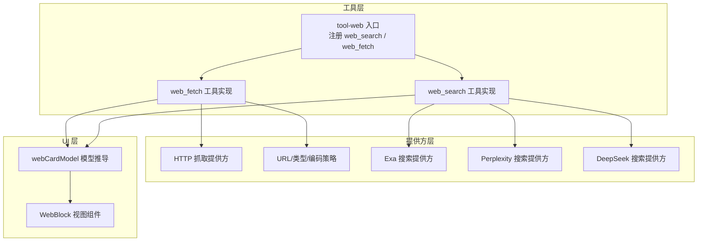
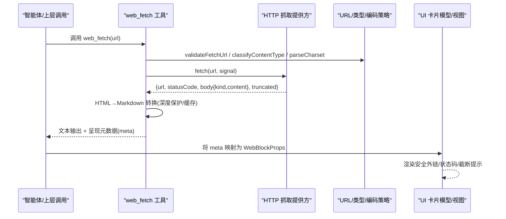
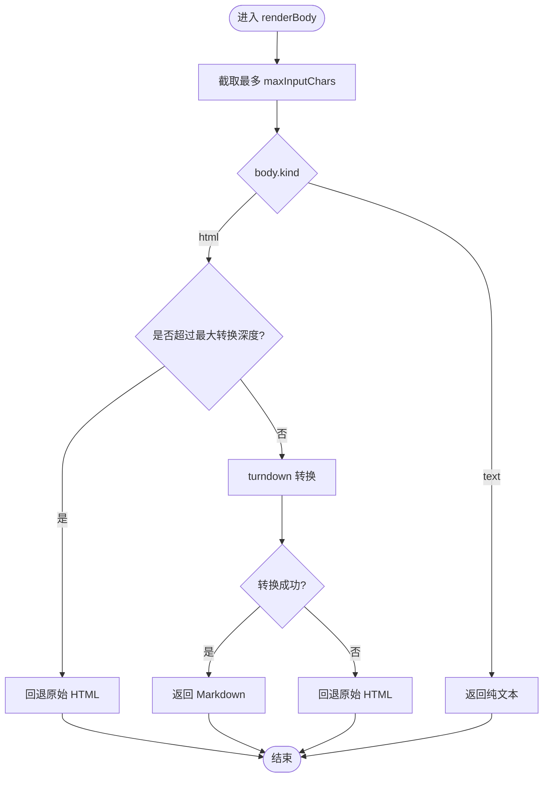
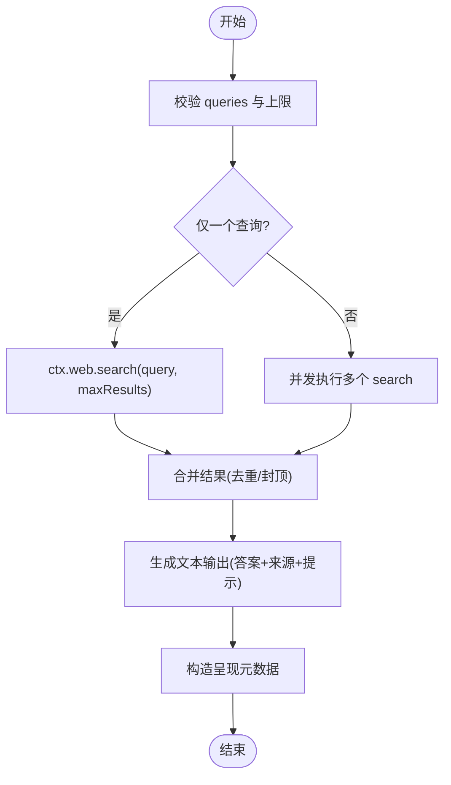
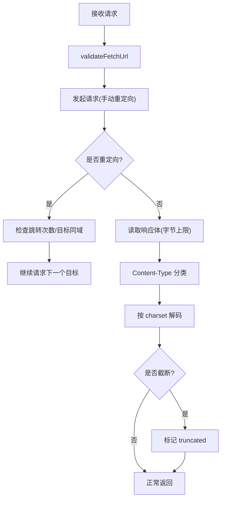
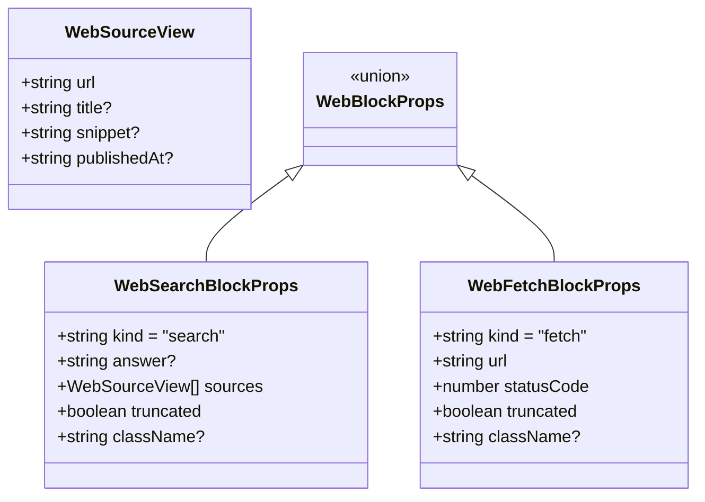
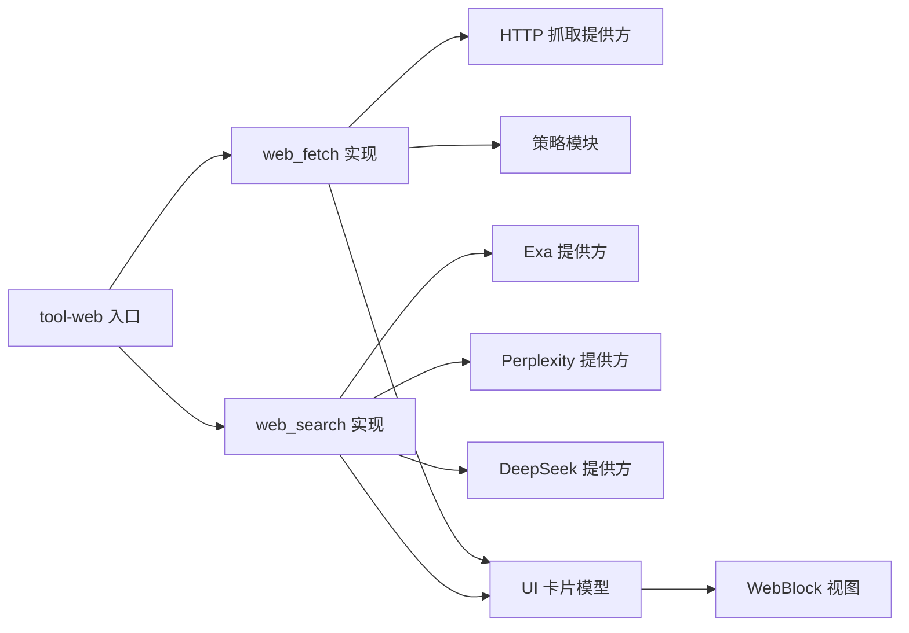

# 网页浏览组件

<cite>
**本文引用的文件**
- [packages/client/ui-tool/src/client/tool/models/web-card-model.ts](file://packages/client/ui-tool/src/client/tool/models/web-card-model.ts)
- [packages/client/ui-primitives/src/WebBlock.tsx](file://packages/client/ui-primitives/src/WebBlock.tsx)
- [packages/web/tool-web/src/index.ts](file://packages/web/tool-web/src/index.ts)
- [packages/web/tool-web/src/fetch.ts](file://packages/web/tool-web/src/fetch.ts)
- [packages/web/tool-web/src/search.ts](file://packages/web/tool-web/src/search.ts)
- [packages/web/web-fetch-http/src/provider.ts](file://packages/web/web-fetch-http/src/provider.ts)
- [packages/web/web-fetch-http/src/policy.ts](file://packages/web/web-fetch-http/src/policy.ts)
- [packages/web/web-search-perplexity/src/provider.ts](file://packages/web/web-search-perplexity/src/provider.ts)
- [packages/web/web-search-exa/README.md](file://packages/web/web-search-exa/README.md)
- [packages/web/web-search-deepseek/README.zh.md](file://packages/web/web-search-deepseek/README.zh.md)
</cite>

## 目录
1. [简介](#简介)
2. [项目结构](#项目结构)
3. [核心组件](#核心组件)
4. [架构总览](#架构总览)
5. [详细组件分析](#详细组件分析)
6. [依赖关系分析](#依赖关系分析)
7. [性能考量](#性能考量)
8. [故障排查指南](#故障排查指南)
9. [结论](#结论)
10. [附录](#附录)

## 简介
本文件面向“网页浏览”相关 UI 与工具链，系统化说明从网页内容抓取、HTML 解析到富文本渲染的完整实现架构。重点覆盖：
- 网页搜索与抓取的工具定义、参数校验、超时与输出上限控制
- HTML→Markdown 转换策略、安全与健壮性保障
- 前端卡片模型与视图组件（搜索卡片、抓取摘要卡片）
- 加载状态管理、错误处理、内容过滤与安全策略
- 配置项、性能优化与可定制渲染方式

## 项目结构
围绕网页能力，代码按“工具层—提供方—UI 展示”分层组织：
- 工具层：提供面向模型的 web_search 与 web_fetch 工具，负责参数校验、结果格式化、呈现元数据
- 提供方层：HTTP 抓取提供方、多种搜索引擎提供方（Exa、Perplexity、DeepSeek）
- UI 层：将工具结果映射为结构化卡片（WebBlock），并安全渲染链接与富文本

图表来源
- [packages/web/tool-web/src/index.ts:1-96](file://packages/web/tool-web/src/index.ts#L1-L96)
- [packages/web/tool-web/src/fetch.ts:1-496](file://packages/web/tool-web/src/fetch.ts#L1-L496)
- [packages/web/tool-web/src/search.ts:1-377](file://packages/web/tool-web/src/search.ts#L1-L377)
- [packages/web/web-fetch-http/src/provider.ts:1-241](file://packages/web/web-fetch-http/src/provider.ts#L1-L241)
- [packages/web/web-fetch-http/src/policy.ts:1-106](file://packages/web/web-fetch-http/src/policy.ts#L1-L106)
- [packages/client/ui-tool/src/client/tool/models/web-card-model.ts:1-75](file://packages/client/ui-tool/src/client/tool/models/web-card-model.ts#L1-L75)
- [packages/client/ui-primitives/src/WebBlock.tsx:1-203](file://packages/client/ui-primitives/src/WebBlock.tsx#L1-L203)

章节来源
- [packages/web/tool-web/src/index.ts:1-96](file://packages/web/tool-web/src/index.ts#L1-L96)
- [packages/web/tool-web/src/fetch.ts:1-496](file://packages/web/tool-web/src/fetch.ts#L1-L496)
- [packages/web/tool-web/src/search.ts:1-377](file://packages/web/tool-web/src/search.ts#L1-L377)
- [packages/web/web-fetch-http/src/provider.ts:1-241](file://packages/web/web-fetch-http/src/provider.ts#L1-L241)
- [packages/web/web-fetch-http/src/policy.ts:1-106](file://packages/web/web-fetch-http/src/policy.ts#L1-L106)
- [packages/client/ui-tool/src/client/tool/models/web-card-model.ts:1-75](file://packages/client/ui-tool/src/client/tool/models/web-card-model.ts#L1-L75)
- [packages/client/ui-primitives/src/WebBlock.tsx:1-203](file://packages/client/ui-primitives/src/WebBlock.tsx#L1-L203)

## 核心组件
- 工具注册与配置
  - tool-web 插件统一注册 web_search 与 web_fetch，暴露搜索/抓取开关、查询数限制、结果数限制、超时预算、输出字符上限等配置项
- 抓取工具（web_fetch）
  - 参数校验、HTML→Markdown 转换、深度保护、输出截断提示、呈现元数据携带
- 搜索工具（web_search）
  - 多查询并发执行、结果去重合并、截断标记、结构化来源列表
- HTTP 抓取提供方
  - URL 白名单、同域重定向、字节/字符上限、编码解码、超时与中止信号
- UI 卡片模型与视图
  - 将工具结果映射为 WebBlockProps；渲染安全外链、搜索答案与来源列表、抓取摘要

章节来源
- [packages/web/tool-web/src/index.ts:23-95](file://packages/web/tool-web/src/index.ts#L23-L95)
- [packages/web/tool-web/src/fetch.ts:17-33](file://packages/web/tool-web/src/fetch.ts#L17-L33)
- [packages/web/tool-web/src/fetch.ts:79-103](file://packages/web/tool-web/src/fetch.ts#L79-L103)
- [packages/web/tool-web/src/fetch.ts:214-319](file://packages/web/tool-web/src/fetch.ts#L214-L319)
- [packages/web/tool-web/src/search.ts:14-24](file://packages/web/tool-web/src/search.ts#L14-L24)
- [packages/web/tool-web/src/search.ts:219-294](file://packages/web/tool-web/src/search.ts#L219-L294)
- [packages/web/web-fetch-http/src/provider.ts:16-39](file://packages/web/web-fetch-http/src/provider.ts#L16-L39)
- [packages/web/web-fetch-http/src/policy.ts:14-41](file://packages/web/web-fetch-http/src/policy.ts#L14-L41)
- [packages/client/ui-tool/src/client/tool/models/web-card-model.ts:1-75](file://packages/client/ui-tool/src/client/tool/models/web-card-model.ts#L1-L75)
- [packages/client/ui-primitives/src/WebBlock.tsx:26-69](file://packages/client/ui-primitives/src/WebBlock.tsx#L26-L69)

## 架构总览
下图展示了从工具调用到最终 UI 展示的端到端流程，包括网络边界、转换与渲染的关键节点。

图表来源
- [packages/web/tool-web/src/fetch.ts:429-495](file://packages/web/tool-web/src/fetch.ts#L429-L495)
- [packages/web/web-fetch-http/src/provider.ts:46-147](file://packages/web/web-fetch-http/src/provider.ts#L46-L147)
- [packages/web/web-fetch-http/src/policy.ts:24-106](file://packages/web/web-fetch-http/src/policy.ts#L24-L106)
- [packages/client/ui-tool/src/client/tool/models/web-card-model.ts:39-74](file://packages/client/ui-tool/src/client/tool/models/web-card-model.ts#L39-L74)
- [packages/client/ui-primitives/src/WebBlock.tsx:183-202](file://packages/client/ui-primitives/src/WebBlock.tsx#L183-L202)

## 详细组件分析

### 抓取工具（web_fetch）
- 参数与约束
  - 非空 URL 校验；超时由部署策略通过工具超时预算控制
- HTML→Markdown 转换
  - 使用 Turndown + GFM 插件；移除 script/style/noscript
  - 自定义规则处理表格单元格与表头对齐，忽略跨列/跨行以控制复杂度
  - 深度保护：对异常嵌套进行单遍扫描，超过阈值直接回退原始 HTML
  - 输出上限：整体输出包含头部、正文、截断提示，超出则裁剪并追加提示
- 呈现元数据
  - 将 url、statusCode、effective truncated 作为 meta 持久化，供回放与 UI 卡片一致显示

图表来源
- [packages/web/tool-web/src/fetch.ts:214-244](file://packages/web/tool-web/src/fetch.ts#L214-L244)
- [packages/web/tool-web/src/fetch.ts:93-103](file://packages/web/tool-web/src/fetch.ts#L93-L103)
- [packages/web/tool-web/src/fetch.ts:128-205](file://packages/web/tool-web/src/fetch.ts#L128-L205)

章节来源
- [packages/web/tool-web/src/fetch.ts:79-103](file://packages/web/tool-web/src/fetch.ts#L79-L103)
- [packages/web/tool-web/src/fetch.ts:214-319](file://packages/web/tool-web/src/fetch.ts#L214-L319)
- [packages/web/tool-web/src/fetch.ts:321-417](file://packages/web/tool-web/src/fetch.ts#L321-L417)
- [packages/web/tool-web/src/fetch.ts:429-495](file://packages/web/tool-web/src/fetch.ts#L429-L495)

### 搜索工具（web_search）
- 参数与约束
  - queries 非空、非空白、不超过最大查询数；重复查询去重
- 并发与合并
  - 多查询并发执行，任一失败中断其余；结果按轮询顺序去重合并，受结果上限限制
- 输出格式
  - 可选答案 + 来源列表（标题/片段/发布日期）+ 截断提示 + 引用指引
- 呈现元数据
  - 结构化 sources、truncated、answer（可选）用于回放与 UI 卡片

图表来源
- [packages/web/tool-web/src/search.ts:30-52](file://packages/web/tool-web/src/search.ts#L30-L52)
- [packages/web/tool-web/src/search.ts:219-294](file://packages/web/tool-web/src/search.ts#L219-L294)
- [packages/web/tool-web/src/search.ts:296-377](file://packages/web/tool-web/src/search.ts#L296-L377)

章节来源
- [packages/web/tool-web/src/search.ts:14-24](file://packages/web/tool-web/src/search.ts#L14-L24)
- [packages/web/tool-web/src/search.ts:30-52](file://packages/web/tool-web/src/search.ts#L30-L52)
- [packages/web/tool-web/src/search.ts:66-95](file://packages/web/tool-web/src/search.ts#L66-L95)
- [packages/web/tool-web/src/search.ts:219-294](file://packages/web/tool-web/src/search.ts#L219-L294)
- [packages/web/tool-web/src/search.ts:296-377](file://packages/web/tool-web/src/search.ts#L296-L377)

### HTTP 抓取提供方
- 传输卫生
  - 仅允许 http/https；拒绝嵌入凭据；URL 长度限制
  - 仅跟随同域重定向，且每跳重新校验
  - 支持 Content-Type 分类与 charset 解码；不支持的类型直接拒绝
- 资源与时间保护
  - 响应体按字节上限读取；超长时截断并标记 truncated
  - 超时与中止信号贯穿请求与流式读取
- 错误分类
  - 区分超时、中止、网络失败等错误类型，便于上层处理

图表来源
- [packages/web/web-fetch-http/src/provider.ts:46-147](file://packages/web/web-fetch-http/src/provider.ts#L46-L147)
- [packages/web/web-fetch-http/src/policy.ts:24-106](file://packages/web/web-fetch-http/src/policy.ts#L24-L106)

章节来源
- [packages/web/web-fetch-http/src/provider.ts:16-39](file://packages/web/web-fetch-http/src/provider.ts#L16-L39)
- [packages/web/web-fetch-http/src/provider.ts:55-147](file://packages/web/web-fetch-http/src/provider.ts#L55-L147)
- [packages/web/web-fetch-http/src/provider.ts:149-207](file://packages/web/web-fetch-http/src/provider.ts#L149-L207)
- [packages/web/web-fetch-http/src/policy.ts:14-41](file://packages/web/web-fetch-http/src/policy.ts#L14-L41)
- [packages/web/web-fetch-http/src/policy.ts:56-106](file://packages/web/web-fetch-http/src/policy.ts#L56-L106)

### UI 卡片模型与视图
- 模型推导
  - 仅当工具结果明确为 web 卡片时才渲染；未知 kind 走通用路径，避免渲染畸形
  - 搜索卡片：答案 + 来源列表（含片段与日期）+ 截断提示
  - 抓取卡片：最终 URL + HTTP 状态码 + 截断提示
- 视图渲染
  - 外链安全：仅 http/https 转为可点击外链，其他原样文本
  - 链接标签：优先 title，其次 hostname，再回退原始 URL
  - 布局：来源列表固定高度滚动，避免卡片无限增长

图表来源
- [packages/client/ui-primitives/src/WebBlock.tsx:26-69](file://packages/client/ui-primitives/src/WebBlock.tsx#L26-L69)
- [packages/client/ui-primitives/src/WebBlock.tsx:117-125](file://packages/client/ui-primitives/src/WebBlock.tsx#L117-L125)
- [packages/client/ui-primitives/src/WebBlock.tsx:156-202](file://packages/client/ui-primitives/src/WebBlock.tsx#L156-L202)

章节来源
- [packages/client/ui-tool/src/client/tool/models/web-card-model.ts:1-75](file://packages/client/ui-tool/src/client/tool/models/web-card-model.ts#L1-L75)
- [packages/client/ui-primitives/src/WebBlock.tsx:26-69](file://packages/client/ui-primitives/src/WebBlock.tsx#L26-L69)
- [packages/client/ui-primitives/src/WebBlock.tsx:81-125](file://packages/client/ui-primitives/src/WebBlock.tsx#L81-L125)
- [packages/client/ui-primitives/src/WebBlock.tsx:156-202](file://packages/client/ui-primitives/src/WebBlock.tsx#L156-L202)

### 搜索提供方（Exa、Perplexity、DeepSeek）
- Exa：专用搜索端点，支持高亮摘要与多种检索模式
- Perplexity：OpenAI 兼容聊天补全端点，返回生成答案与引用来源
- DeepSeek：通过 Messages API 的服务器工具触发原生搜索，严格模式下要求结构化搜索结果块

章节来源
- [packages/web/web-search-exa/README.md:1-24](file://packages/web/web-search-exa/README.md#L1-L24)
- [packages/web/web-search-perplexity/src/provider.ts:1-34](file://packages/web/web-search-perplexity/src/provider.ts#L1-L34)
- [packages/web/web-search-deepseek/README.zh.md:1-13](file://packages/web/web-search-deepseek/README.zh.md#L1-L13)

## 依赖关系分析
- 工具层依赖提供方抽象（ctx.web），不耦合具体网络实现
- 提供方层依赖策略模块（URL/类型/编码），与网络 I/O 解耦
- UI 层仅消费工具结果的呈现元数据，保证回放一致性

图表来源
- [packages/web/tool-web/src/index.ts:1-96](file://packages/web/tool-web/src/index.ts#L1-L96)
- [packages/web/tool-web/src/fetch.ts:429-495](file://packages/web/tool-web/src/fetch.ts#L429-L495)
- [packages/web/tool-web/src/search.ts:296-377](file://packages/web/tool-web/src/search.ts#L296-L377)
- [packages/web/web-fetch-http/src/provider.ts:1-241](file://packages/web/web-fetch-http/src/provider.ts#L1-L241)
- [packages/web/web-fetch-http/src/policy.ts:1-106](file://packages/web/web-fetch-http/src/policy.ts#L1-L106)
- [packages/client/ui-tool/src/client/tool/models/web-card-model.ts:1-75](file://packages/client/ui-tool/src/client/tool/models/web-card-model.ts#L1-L75)
- [packages/client/ui-primitives/src/WebBlock.tsx:1-203](file://packages/client/ui-primitives/src/WebBlock.tsx#L1-L203)

章节来源
- [packages/web/tool-web/src/index.ts:1-96](file://packages/web/tool-web/src/index.ts#L1-L96)
- [packages/web/tool-web/src/fetch.ts:429-495](file://packages/web/tool-web/src/fetch.ts#L429-L495)
- [packages/web/tool-web/src/search.ts:296-377](file://packages/web/tool-web/src/search.ts#L296-L377)
- [packages/web/web-fetch-http/src/provider.ts:1-241](file://packages/web/web-fetch-http/src/provider.ts#L1-L241)
- [packages/web/web-fetch-http/src/policy.ts:1-106](file://packages/web/web-fetch-http/src/policy.ts#L1-L106)
- [packages/client/ui-tool/src/client/tool/models/web-card-model.ts:1-75](file://packages/client/ui-tool/src/client/tool/models/web-card-model.ts#L1-L75)
- [packages/client/ui-primitives/src/WebBlock.tsx:1-203](file://packages/client/ui-primitives/src/WebBlock.tsx#L1-L203)

## 性能考量
- 转换性能
  - HTML→Markdown 同步转换存在超线性风险，采用深度保护（阈值）与异常回退，避免长时间阻塞事件循环
  - 对同一结果与输出上限组合进行缓存，避免重复 DOM 解析与转换
- 网络与 I/O
  - 响应体按字节上限读取，避免内存膨胀；流式读取在达到上限后及时停止
  - 超时与中止信号贯穿请求与读取阶段，确保资源释放
- UI 渲染
  - 来源列表固定高度滚动，防止长列表导致页面抖动
  - 外链仅 http/https 渲染为锚点，减少不必要的安全检查开销

[本节为通用性能建议，无需特定文件引用]

## 故障排查指南
- 常见错误与定位
  - 超时：检查工具超时预算与提供方 timeoutMs；确认信号传播
  - 中止：检查上游取消或外层截止时间导致的 AbortError
  - 网络失败：查看底层错误原因，必要时调整重试或代理
  - 内容类型不支持：确认 Content-Type 是否在允许范围
  - 重定向被阻断：确认是否为跨域重定向或超过跳转次数
- 调试建议
  - 启用更详细的日志（如 provider 的错误 cause）
  - 降低输出上限或查询数量，逐步定位问题
  - 使用回放元数据核对 truncated 与来源一致性

章节来源
- [packages/web/web-fetch-http/src/provider.ts:225-241](file://packages/web/web-fetch-http/src/provider.ts#L225-L241)
- [packages/web/web-fetch-http/src/provider.ts:116-147](file://packages/web/web-fetch-http/src/provider.ts#L116-L147)
- [packages/web/web-fetch-http/src/policy.ts:24-41](file://packages/web/web-fetch-http/src/policy.ts#L24-L41)
- [packages/web/tool-web/src/fetch.ts:284-319](file://packages/web/tool-web/src/fetch.ts#L284-L319)

## 结论
该网页浏览组件通过清晰的分层设计，将工具定义、网络抓取、内容转换与 UI 展示解耦，既保证了安全性与健壮性，又提供了良好的可配置性与可扩展性。通过严格的 URL/类型/编码策略、输出与深度限制、以及一致的呈现元数据，确保了在不同环境与回放场景下的一致体验。对于生产部署，建议结合权限与审批策略，谨慎启用外部网络访问能力。

[本节为总结性内容，无需特定文件引用]

## 附录

### 配置选项速览
- tool-web
  - search/fetch：是否注册对应工具
  - searchMaxResults：单次搜索返回的最大来源数
  - searchMaxQueries：单次搜索接受的最大查询数
  - fetchTimeoutMs/searchTimeoutMs：工具调用超时预算（毫秒）
  - fetchMaxOutputChars：抓取输出的字符上限（同时限制同步转换输入）
- HTTP 抓取提供方
  - maxUrlLength：请求 URL 最大长度
  - maxResponseBytes：响应体最大字节数
  - maxBodyChars：解码后最大字符数
  - timeoutMs：默认抓取超时
  - maxRedirects：最大同域重定向次数
  - userAgent：请求 User-Agent

章节来源
- [packages/web/tool-web/src/index.ts:29-62](file://packages/web/tool-web/src/index.ts#L29-L62)
- [packages/web/web-fetch-http/src/provider.ts:16-30](file://packages/web/web-fetch-http/src/provider.ts#L16-L30)