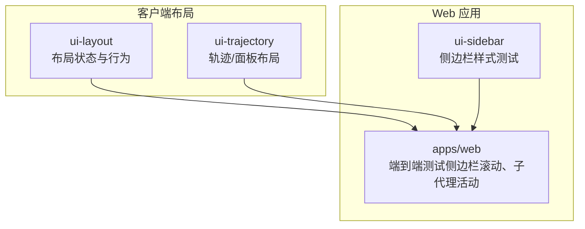
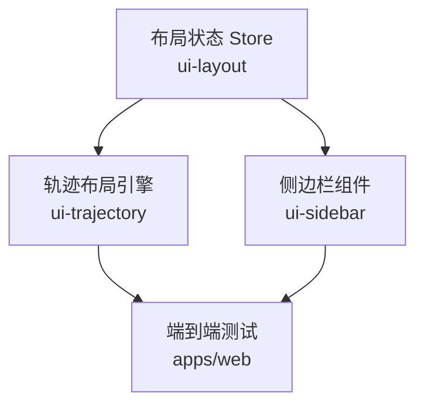
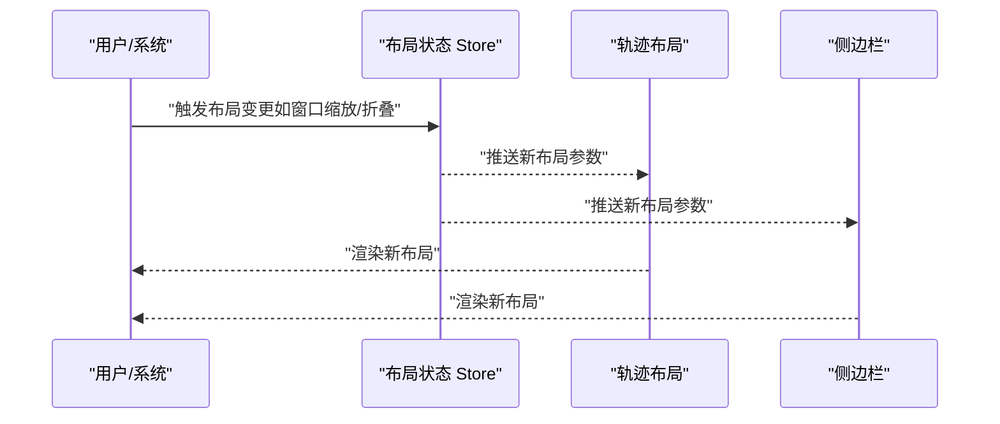
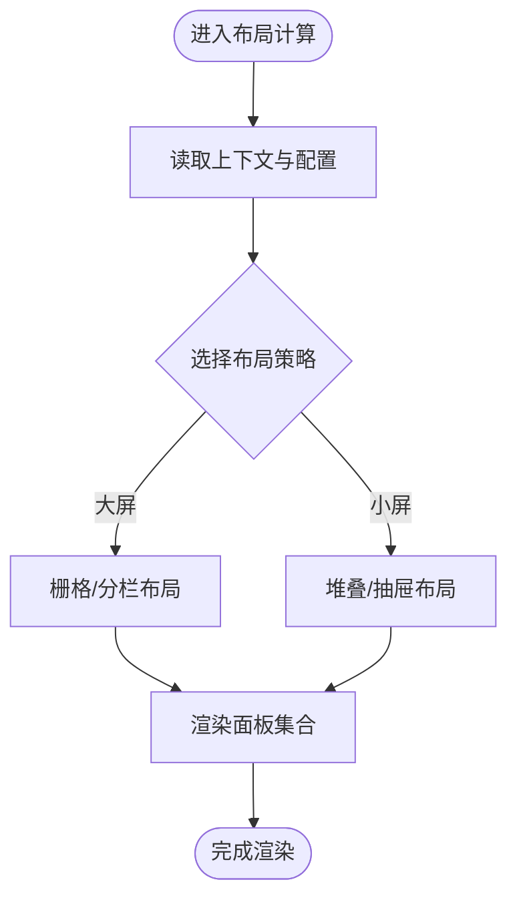
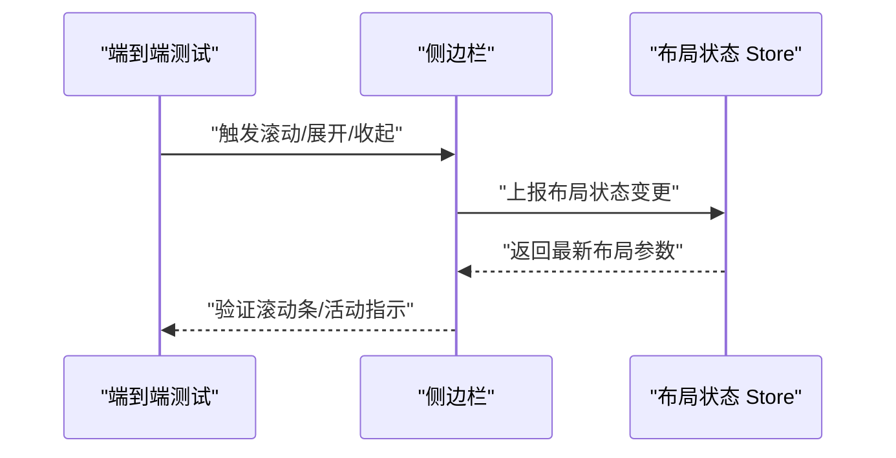
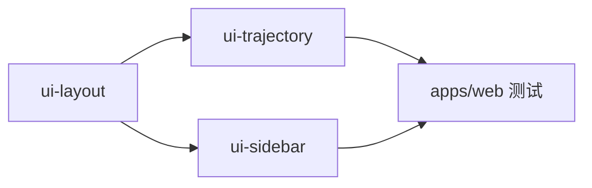

# 布局组件

<cite>
**本文引用的文件**
- [packages/client/ui-layout/tests/layout-store.client.spec.ts](file://packages/client/ui-layout/tests/layout-store.client.spec.ts)
- [packages/client/ui-trajectory/src/client/layout.ts](file://packages/client/ui-trajectory/src/client/layout.ts)
- [apps/web/tests/sidebar-scrollbar.e2e.ts](file://apps/web/tests/sidebar-scrollbar.e2e.ts)
- [apps/web/tests/sidebar-subagent-activity.e2e.ts](file://apps/web/tests/sidebar-subagent-activity.e2e.ts)
- [packages/client/ui-sidebar/tests/sidebar-styles.client.spec.ts](file://packages/client/ui-sidebar/tests/sidebar-styles.client.spec.ts)
</cite>

## 目录
1. [简介](#简介)
2. [项目结构](#项目结构)
3. [核心组件](#核心组件)
4. [架构总览](#架构总览)
5. [详细组件分析](#详细组件分析)
6. [依赖分析](#依赖分析)
7. [性能考虑](#性能考虑)
8. [故障排查指南](#故障排查指南)
9. [结论](#结论)
10. [附录](#附录)

## 简介
本章节面向“页面布局、侧边栏、标签页”等基础布局组件，聚焦以下目标：
- 解释响应式设计与自适应布局策略（移动端适配、断点与容器查询）
- 说明组件组合模式、插槽机制与动态布局调整能力
- 梳理样式模块化、主题支持与 CSS 变量使用方式
- 提供最佳实践与性能优化建议（滚动、重排/重绘、内存占用）

由于仓库中未直接暴露完整的 UI 源码实现，本文基于测试与客户端布局相关代码进行反向推导与归纳，确保读者理解布局组件的设计意图与使用要点。

## 项目结构
围绕布局能力的关键位置包括：
- 布局状态与行为：位于 packages/client 下的 ui-layout 与 ui-trajectory 模块
- 侧边栏交互与样式：位于 apps/web 的端到端测试与 packages/client/ui-sidebar 的样式测试
- 这些位置共同体现了“布局状态管理 + 视图渲染 + 样式主题化”的分层组织

图表来源
- [packages/client/ui-layout/tests/layout-store.client.spec.ts](file://packages/client/ui-layout/tests/layout-store.client.spec.ts)
- [packages/client/ui-trajectory/src/client/layout.ts](file://packages/client/ui-trajectory/src/client/layout.ts)
- [apps/web/tests/sidebar-scrollbar.e2e.ts](file://apps/web/tests/sidebar-scrollbar.e2e.ts)
- [apps/web/tests/sidebar-subagent-activity.e2e.ts](file://apps/web/tests/sidebar-subagent-activity.e2e.ts)
- [packages/client/ui-sidebar/tests/sidebar-styles.client.spec.ts](file://packages/client/ui-sidebar/tests/sidebar-styles.client.spec.ts)

章节来源
- [packages/client/ui-layout/tests/layout-store.client.spec.ts](file://packages/client/ui-layout/tests/layout-store.client.spec.ts)
- [packages/client/ui-trajectory/src/client/layout.ts](file://packages/client/ui-trajectory/src/client/layout.ts)
- [apps/web/tests/sidebar-scrollbar.e2e.ts](file://apps/web/tests/sidebar-scrollbar.e2e.ts)
- [apps/web/tests/sidebar-subagent-activity.e2e.ts](file://apps/web/tests/sidebar-subagent-activity.e2e.ts)
- [packages/client/ui-sidebar/tests/sidebar-styles.client.spec.ts](file://packages/client/ui-sidebar/tests/sidebar-styles.client.spec.ts)

## 核心组件
- 布局状态管理（ui-layout）
  - 职责：维护布局尺寸、可见性、激活态、区域划分等状态；驱动响应式更新
  - 关键点：通过测试用例可推断存在“布局 store”，用于集中管理布局数据与变更事件
- 轨迹/面板布局（ui-trajectory）
  - 职责：在复杂工作流或对话轨迹中，组织多面板/标签页的布局与切换
  - 关键点：layout.ts 提供布局计算与渲染入口，支撑标签页、抽屉、分栏等组合
- 侧边栏（ui-sidebar）
  - 职责：承载导航、工具列表、会话列表等左侧内容；支持展开/收起、滚动、子代理活动指示
  - 关键点：样式测试覆盖主题、间距、滚动条等视觉细节；端到端测试验证滚动与活动状态

章节来源
- [packages/client/ui-layout/tests/layout-store.client.spec.ts](file://packages/client/ui-layout/tests/layout-store.client.spec.ts)
- [packages/client/ui-trajectory/src/client/layout.ts](file://packages/client/ui-trajectory/src/client/layout.ts)
- [packages/client/ui-sidebar/tests/sidebar-styles.client.spec.ts](file://packages/client/ui-sidebar/tests/sidebar-styles.client.spec.ts)

## 架构总览
下图展示了布局组件之间的协作关系：ui-layout 作为状态中枢，ui-trajectory 负责复杂面板布局编排，ui-sidebar 提供常用侧边区域，apps/web 的端到端测试验证交互与样式表现。

图表来源
- [packages/client/ui-layout/tests/layout-store.client.spec.ts](file://packages/client/ui-layout/tests/layout-store.client.spec.ts)
- [packages/client/ui-trajectory/src/client/layout.ts](file://packages/client/ui-trajectory/src/client/layout.ts)
- [apps/web/tests/sidebar-scrollbar.e2e.ts](file://apps/web/tests/sidebar-scrollbar.e2e.ts)
- [apps/web/tests/sidebar-subagent-activity.e2e.ts](file://apps/web/tests/sidebar-subagent-activity.e2e.ts)

## 详细组件分析

### 布局状态（ui-layout）
- 设计要点
  - 集中式布局状态：包含区域尺寸、显示/隐藏、激活项、拖拽/折叠状态等
  - 响应式更新：监听窗口尺寸变化、容器尺寸变化，触发重新布局
  - 事件驱动：通过事件通知订阅者（如侧边栏、标签页）进行局部刷新
- 典型流程（基于测试推断）
  - 初始化：读取默认布局配置，建立初始状态
  - 变更：用户操作或系统事件触发状态更新
  - 同步：将新状态广播给各布局组件，完成重排与重绘

图表来源
- [packages/client/ui-layout/tests/layout-store.client.spec.ts](file://packages/client/ui-layout/tests/layout-store.client.spec.ts)

章节来源
- [packages/client/ui-layout/tests/layout-store.client.spec.ts](file://packages/client/ui-layout/tests/layout-store.client.spec.ts)

### 轨迹/面板布局（ui-trajectory）
- 设计要点
  - 多面板/标签页组织：根据当前上下文决定展示哪些面板及顺序
  - 自适应：在小屏下自动折叠为抽屉或底部面板，在大屏下并排展示
  - 插槽机制：允许外部注入自定义面板内容，保持扩展性
- 典型流程（基于 layout.ts 推断）
  - 解析当前任务/会话上下文
  - 计算面板集合与布局策略（栅格/分栏/堆叠）
  - 渲染并处理面板间通信（如选中态、滚动同步）

图表来源
- [packages/client/ui-trajectory/src/client/layout.ts](file://packages/client/ui-trajectory/src/client/layout.ts)

章节来源
- [packages/client/ui-trajectory/src/client/layout.ts](file://packages/client/ui-trajectory/src/client/layout.ts)

### 侧边栏（ui-sidebar）
- 设计要点
  - 滚动与性能：长列表需虚拟滚动或分页加载，避免主线程阻塞
  - 主题与样式：通过 CSS 变量与模块化样式控制外观，支持明暗主题
  - 活动指示：子代理活动等状态需在侧边栏内清晰呈现
- 端到端验证（基于测试）
  - 滚动行为：验证滚动条出现/消失、滚动位置恢复
  - 活动状态：验证子代理活动时的视觉反馈与交互

图表来源
- [apps/web/tests/sidebar-scrollbar.e2e.ts](file://apps/web/tests/sidebar-scrollbar.e2e.ts)
- [apps/web/tests/sidebar-subagent-activity.e2e.ts](file://apps/web/tests/sidebar-subagent-activity.e2e.ts)
- [packages/client/ui-layout/tests/layout-store.client.spec.ts](file://packages/client/ui-layout/tests/layout-store.client.spec.ts)

章节来源
- [apps/web/tests/sidebar-scrollbar.e2e.ts](file://apps/web/tests/sidebar-scrollbar.e2e.ts)
- [apps/web/tests/sidebar-subagent-activity.e2e.ts](file://apps/web/tests/sidebar-subagent-activity.e2e.ts)
- [packages/client/ui-sidebar/tests/sidebar-styles.client.spec.ts](file://packages/client/ui-sidebar/tests/sidebar-styles.client.spec.ts)

## 依赖分析
- 组件耦合
  - ui-layout 与 ui-trajectory、ui-sidebar 存在松耦合：通过状态与事件通信，降低直接依赖
- 外部依赖
  - 浏览器 API：ResizeObserver、IntersectionObserver、Scroll API 等用于响应式与滚动优化
  - 样式系统：CSS 变量、模块化样式、主题切换机制
- 潜在风险
  - 过度重排：频繁尺寸计算可能导致卡顿，应合并更新或使用 requestAnimationFrame
  - 内存泄漏：监听器未正确移除会导致内存增长

图表来源
- [packages/client/ui-layout/tests/layout-store.client.spec.ts](file://packages/client/ui-layout/tests/layout-store.client.spec.ts)
- [packages/client/ui-trajectory/src/client/layout.ts](file://packages/client/ui-trajectory/src/client/layout.ts)
- [apps/web/tests/sidebar-scrollbar.e2e.ts](file://apps/web/tests/sidebar-scrollbar.e2e.ts)
- [apps/web/tests/sidebar-subagent-activity.e2e.ts](file://apps/web/tests/sidebar-subagent-activity.e2e.ts)

章节来源
- [packages/client/ui-layout/tests/layout-store.client.spec.ts](file://packages/client/ui-layout/tests/layout-store.client.spec.ts)
- [packages/client/ui-trajectory/src/client/layout.ts](file://packages/client/ui-trajectory/src/client/layout.ts)
- [apps/web/tests/sidebar-scrollbar.e2e.ts](file://apps/web/tests/sidebar-scrollbar.e2e.ts)
- [apps/web/tests/sidebar-subagent-activity.e2e.ts](file://apps/web/tests/sidebar-subagent-activity.e2e.ts)

## 性能考虑
- 滚动优化
  - 使用虚拟滚动或分页加载减少 DOM 节点数量
  - 节流/防抖滚动事件，避免频繁重排
- 布局计算
  - 批量更新布局状态，合并多次变更
  - 使用 requestAnimationFrame 调度重绘
- 样式与主题
  - 通过 CSS 变量切换主题，减少样式重建
  - 模块化样式，按需加载，避免全局污染
- 内存管理
  - 及时移除事件监听与观察者
  - 清理大对象引用，避免内存泄漏

[本节为通用指导，不直接分析具体文件]

## 故障排查指南
- 侧边栏滚动异常
  - 现象：滚动条不出现、滚动位置丢失、卡顿
  - 排查：检查滚动容器高度设置、是否启用虚拟滚动、是否有阻塞脚本
  - 参考：端到端测试覆盖了滚动行为与活动状态
- 主题/样式问题
  - 现象：主题切换无效、样式错乱
  - 排查：确认 CSS 变量是否正确注入、样式模块是否按需提供
  - 参考：侧边栏样式测试覆盖主题与视觉细节
- 布局状态不同步
  - 现象：面板显示异常、折叠/展开状态不一致
  - 排查：检查布局状态 Store 的事件发布/订阅、是否存在竞态条件
  - 参考：布局状态测试验证状态流转

章节来源
- [apps/web/tests/sidebar-scrollbar.e2e.ts](file://apps/web/tests/sidebar-scrollbar.e2e.ts)
- [apps/web/tests/sidebar-subagent-activity.e2e.ts](file://apps/web/tests/sidebar-subagent-activity.e2e.ts)
- [packages/client/ui-sidebar/tests/sidebar-styles.client.spec.ts](file://packages/client/ui-sidebar/tests/sidebar-styles.client.spec.ts)
- [packages/client/ui-layout/tests/layout-store.client.spec.ts](file://packages/client/ui-layout/tests/layout-store.client.spec.ts)

## 结论
- 布局体系以“状态集中 + 组件解耦”为核心，ui-layout 作为状态中枢，ui-trajectory 与 ui-sidebar 分别承担复杂面板与常用侧边区域
- 响应式与自适应通过布局策略与容器/窗口监听实现，结合虚拟滚动与样式模块化保障性能与可维护性
- 端到端与单元/样式测试覆盖了关键交互与视觉细节，有助于快速定位与修复问题

[本节为总结性内容，不直接分析具体文件]

## 附录
- 术语
  - 布局状态：描述界面区域尺寸、可见性、激活态等的结构化数据
  - 插槽机制：允许外部向组件内部注入内容的扩展方式
  - 主题支持：通过 CSS 变量与样式模块实现的外观切换能力
- 最佳实践
  - 优先使用容器查询与媒体查询组合实现响应式
  - 对长列表采用虚拟滚动，避免一次性渲染大量节点
  - 将布局状态与视图分离，便于测试与维护
  - 使用事件总线或状态库统一管理布局变更，避免散落的副作用

[本节为补充信息，不直接分析具体文件]