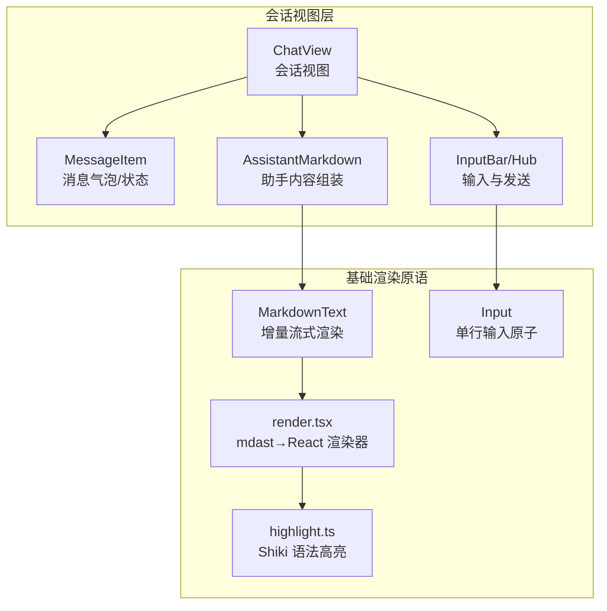
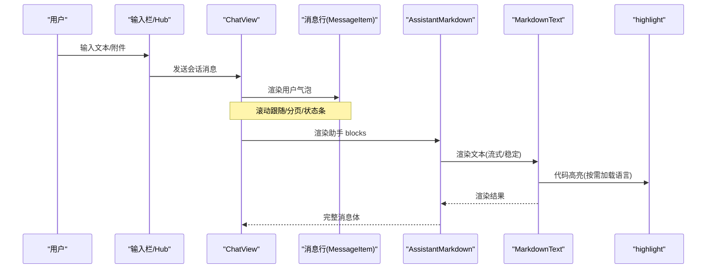
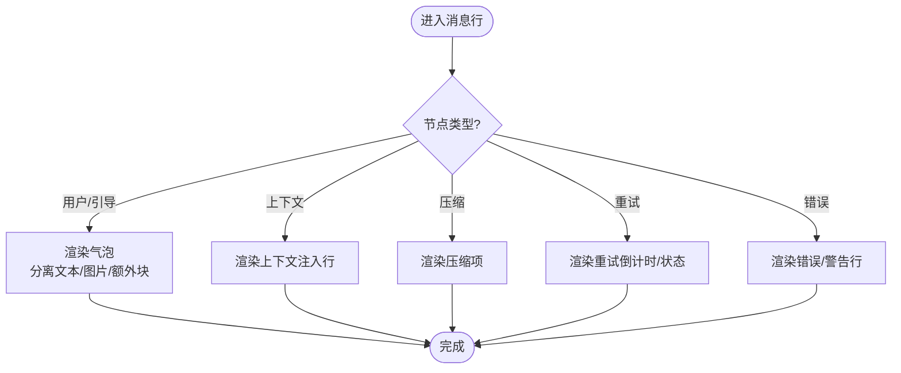
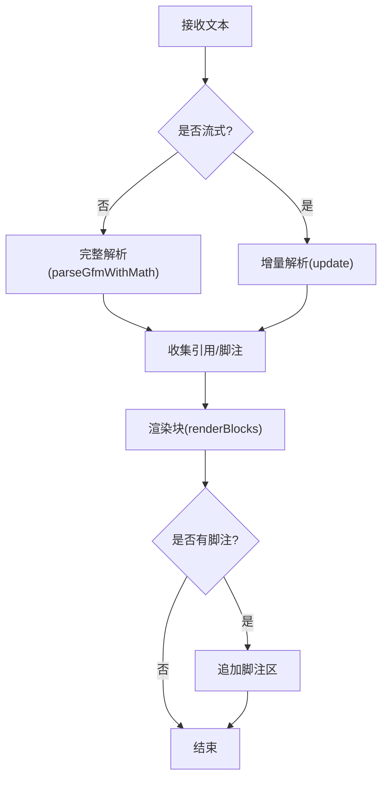
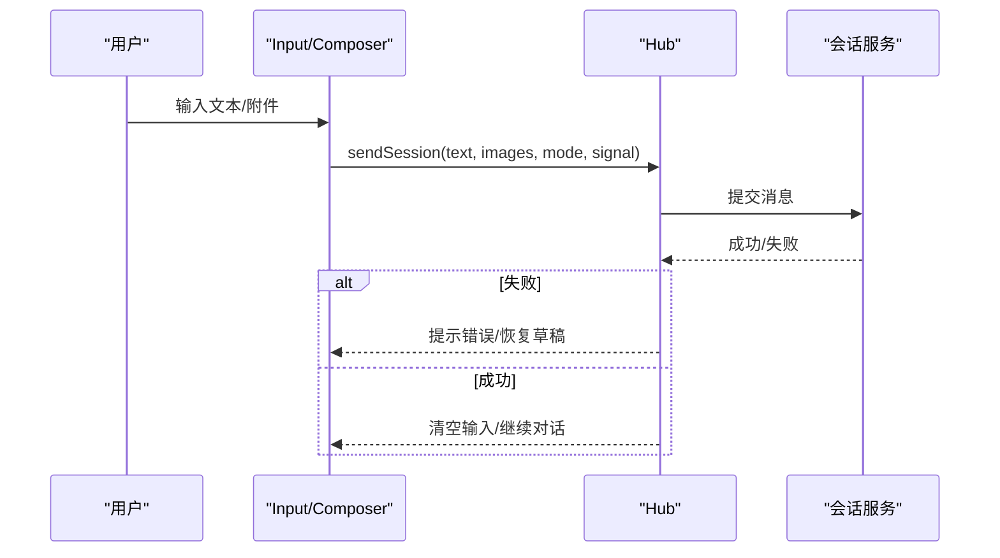
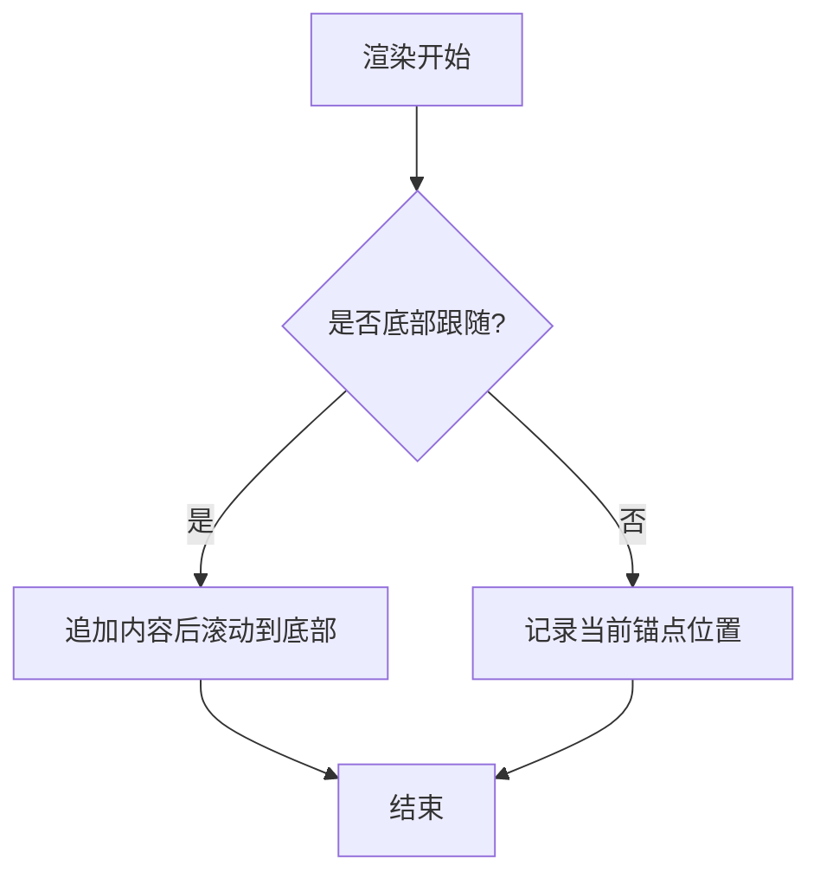
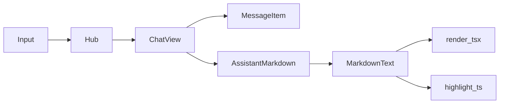

# 聊天组件

<cite>
**本文引用的文件**
- [MessageItem.tsx](file://packages/client/ui-conversation/src/client/chat/MessageItem.tsx)
- [AssistantMarkdown.tsx](file://packages/client/ui-conversation/src/client/chat/AssistantMarkdown.tsx)
- [ChatView.tsx](file://packages/client/ui-conversation/src/client/chat/ChatView.tsx)
- [MarkdownText.tsx](file://packages/client/ui-primitives/src/markdown/MarkdownText.tsx)
- [render.tsx](file://packages/client/ui-primitives/src/markdown/render.tsx)
- [highlight.ts](file://packages/client/ui-primitives/src/markdown/highlight.ts)
- [Input.tsx](file://packages/client/ui-primitives/src/Input.tsx)
- [hub.ts](file://packages/client/ui-conversation/src/client/input/hub.ts)
- [ConversationRoot.tsx](file://packages/client/ui-conversation/src/client/skeleton/ConversationRoot.tsx)
- [chat-continuous-conversation.e2e.ts](file://apps/web/tests/chat-continuous-conversation.e2e.ts)
</cite>

## 目录
1. [简介](#简介)
2. [项目结构](#项目结构)
3. [核心组件](#核心组件)
4. [架构总览](#架构总览)
5. [详细组件分析](#详细组件分析)
6. [依赖关系分析](#依赖关系分析)
7. [性能考量](#性能考量)
8. [故障排查指南](#故障排查指南)
9. [结论](#结论)
10. [附录](#附录)

## 简介
本文件面向聊天相关 UI 组件，系统梳理消息展示、输入框与会话历史等核心能力，解释消息渲染机制（含 Markdown、代码高亮与数学公式）、用户交互处理、实时通信集成与响应式布局实现。同时提供组件属性接口、事件回调与样式定制选项的说明，并给出常见使用场景的最佳实践指导。

## 项目结构
聊天 UI 由“会话视图层”和“基础渲染原语”两部分组成：
- 会话视图层（ui-conversation）：负责会话列表、消息行、输入栏、滚动跟随、分页加载、待处理提示等。
- 基础渲染原语（ui-primitives）：提供 Markdown 文本渲染、代码块、JSON 树、输入原子等通用 UI 构件。

图表来源
- [ChatView.tsx:158-491](file://packages/client/ui-conversation/src/client/chat/ChatView.tsx#L158-L491)
- [MessageItem.tsx:1-352](file://packages/client/ui-conversation/src/client/chat/MessageItem.tsx#L1-L352)
- [AssistantMarkdown.tsx:1-115](file://packages/client/ui-conversation/src/client/chat/AssistantMarkdown.tsx#L1-L115)
- [MarkdownText.tsx:1-177](file://packages/client/ui-primitives/src/markdown/MarkdownText.tsx#L1-L177)
- [render.tsx:1-584](file://packages/client/ui-primitives/src/markdown/render.tsx#L1-L584)
- [highlight.ts:1-312](file://packages/client/ui-primitives/src/markdown/highlight.ts#L1-L312)
- [Input.tsx:1-23](file://packages/client/ui-primitives/src/Input.tsx#L1-L23)

章节来源
- [ChatView.tsx:158-491](file://packages/client/ui-conversation/src/client/chat/ChatView.tsx#L158-L491)
- [MarkdownText.tsx:1-177](file://packages/client/ui-primitives/src/markdown/MarkdownText.tsx#L1-L177)

## 核心组件
- ChatView：会话主视图，管理消息节点顺序、分页加载、滚动跟随、运行中状态显示、待处理提示等。
- MessageItem：用户消息气泡、上下文注入、压缩标记、重试链、错误提示等消息行的具体呈现。
- AssistantMarkdown：将助手返回的 blocks（文本、推理、图片、工具调用头）按序渲染，图片合并为画廊，未知块以 JSON 形式展示。
- MarkdownText：对不受信任的 Markdown 进行安全渲染，支持流式增量解析、引用与脚注、数学公式与代码块。
- highlight：基于 Shiki 的代码高亮，内置常用语言，按需懒加载扩展语言，主题通过 CSS 变量输出。
- Input：单行输入原子，供搜索或内联表单使用；对话输入区在会话包内组合而成。

章节来源
- [ChatView.tsx:158-491](file://packages/client/ui-conversation/src/client/chat/ChatView.tsx#L158-L491)
- [MessageItem.tsx:1-352](file://packages/client/ui-conversation/src/client/chat/MessageItem.tsx#L1-L352)
- [AssistantMarkdown.tsx:1-115](file://packages/client/ui-conversation/src/client/chat/AssistantMarkdown.tsx#L1-L115)
- [MarkdownText.tsx:1-177](file://packages/client/ui-primitives/src/markdown/MarkdownText.tsx#L1-L177)
- [highlight.ts:1-312](file://packages/client/ui-primitives/src/markdown/highlight.ts#L1-L312)
- [Input.tsx:1-23](file://packages/client/ui-primitives/src/Input.tsx#L1-L23)

## 架构总览
聊天 UI 的数据流从会话状态到渲染：
- 会话状态（节点顺序、时间线、队列）驱动 ChatView 渲染消息行。
- 每行通过 ChatNodeSeat 分派到对应 Node 视图（用户、助手、上下文、压缩、重试、错误等）。
- 助手内容经 AssistantMarkdown 组装，文本走 MarkdownText 渲染，代码块走 highlight 高亮，数学公式走 KaTeX。
- 输入经由 hub 提交到会话服务，完成一次对话轮次。

图表来源
- [ChatView.tsx:158-491](file://packages/client/ui-conversation/src/client/chat/ChatView.tsx#L158-L491)
- [MessageItem.tsx:1-352](file://packages/client/ui-conversation/src/client/chat/MessageItem.tsx#L1-L352)
- [AssistantMarkdown.tsx:1-115](file://packages/client/ui-conversation/src/client/chat/AssistantMarkdown.tsx#L1-L115)
- [MarkdownText.tsx:1-177](file://packages/client/ui-primitives/src/markdown/MarkdownText.tsx#L1-L177)
- [highlight.ts:1-312](file://packages/client/ui-primitives/src/markdown/highlight.ts#L1-L312)

## 详细组件分析

### 消息展示（MessageItem）
- 功能要点
  - 用户消息气泡：分离文本、图片与额外块，支持引用标签装饰（如 @session、@file、/command）。
  - 待处理引导（pending steering）：与最终持久化节点一致的视觉语言，仅支持复制等操作。
  - 上下文注入、压缩标记、重试链、终止错误、最大 token 提示等专用行。
  - 图标操作（复制、时间戳等）通过统一入口注入。
- 关键行为
  - 文本投影：识别引用词法，生成可识别的 chip 样式。
  - 重试倒计时：基于宿主调度延迟与本地时钟对齐，显示剩余秒数。
  - 错误/警告行：带状态点与可读文案。

图表来源
- [MessageItem.tsx:1-352](file://packages/client/ui-conversation/src/client/chat/MessageItem.tsx#L1-L352)

章节来源
- [MessageItem.tsx:1-352](file://packages/client/ui-conversation/src/client/chat/MessageItem.tsx#L1-L352)

### 助手内容组装（AssistantMarkdown）
- 功能要点
  - 按序渲染 blocks：文本、推理（Think）、图片、工具调用头（由外层分组）、未知块（JSON）。
  - 连续图片合并为画廊，减少重复挂载开销。
  - 流式模式下，尾部文本增量渲染，推理行末尾可能显示运行指示。
- 属性接口
  - blocks：助手返回的块数组。
  - streaming：是否处于流式阶段。
  - interrupted：是否被中断（停止）。
  - renderMessageImages：图片渲染插槽。
  - mentions：文件提及解析器（仅稳定渲染时生效）。
  - t：翻译函数。

章节来源
- [AssistantMarkdown.tsx:1-115](file://packages/client/ui-conversation/src/client/chat/AssistantMarkdown.tsx#L1-L115)

### Markdown 渲染（MarkdownText + render.tsx）
- 功能要点
  - 安全策略：仅允许 http/https/mailto 链接，图片必须绝对 HTTP(S)，原始 HTML 保持字面量。
  - 流式渲染：除尾部两行外冻结已解析块为 React 元素，增量重解析尾部，显著降低流式成本。
  - 引用与脚注：收集定义、按首次出现顺序编号，尾部追加脚注区。
  - 数学公式：行内与块级 TeX 通过 KaTeX 渲染。
  - 代码块：非流式下启用语法高亮；流式下降级为纯文本，稳定后切换。
- 属性接口
  - text：Markdown 源文本。
  - streaming：是否流式。
  - codeLabels：代码块复制按钮文案。
  - fileMentions：文件提及解析器（仅稳定渲染）。
- 内部流程
  - parseGfmWithMath → 增量解析 → 收集引用 → 渲染块 → 追加脚注。

图表来源
- [MarkdownText.tsx:1-177](file://packages/client/ui-primitives/src/markdown/MarkdownText.tsx#L1-L177)
- [render.tsx:146-172](file://packages/client/ui-primitives/src/markdown/render.tsx#L146-L172)
- [render.tsx:543-583](file://packages/client/ui-primitives/src/markdown/render.tsx#L543-L583)

章节来源
- [MarkdownText.tsx:1-177](file://packages/client/ui-primitives/src/markdown/MarkdownText.tsx#L1-L177)
- [render.tsx:1-584](file://packages/client/ui-primitives/src/markdown/render.tsx#L1-L584)

### 代码高亮（highlight.ts）
- 功能要点
  - 基于 Shiki 的同步高亮引擎，默认预载 TypeScript、Shell、JSON 三种语言。
  - 其他语言按需动态导入，首次使用时回退为纯文本，完成后通知订阅者重新高亮。
  - 颜色通过 CSS 变量（--shiki-*）输出，遵循主题包样式规范。
- 接口
  - highlightToHtml(code, lang)：返回高亮 HTML 或 undefined（未就绪/未知语言）。
  - highlightLines(code, lang)：返回按行分组的 token 片段，便于自定义行号等布局。
  - subscribeGrammarLoaded(listener)：监听语言加载完成。
  - grammarLoadCount()：用于外部 store 快照触发重渲染。

章节来源
- [highlight.ts:1-312](file://packages/client/ui-primitives/src/markdown/highlight.ts#L1-L312)

### 输入与发送（Input + Hub）
- 输入原子（Input）
  - 单行输入控件，支持前缀图标与透传原生属性。
- 会话输入（Hub）
  - 将用户输入与附件提交给会话服务，空输入直接成功返回。
  - 失败路径通过 banner 提示，草稿仅在未被修改时恢复。
- 输入栏装配（ConversationRoot）
  - 通过插槽注入左侧/右侧/覆盖层/底部统计栏等区域，占位符根据模式动态设置。

图表来源
- [Input.tsx:1-23](file://packages/client/ui-primitives/src/Input.tsx#L1-L23)
- [hub.ts:159-221](file://packages/client/ui-conversation/src/client/input/hub.ts#L159-L221)
- [ConversationRoot.tsx:149-157](file://packages/client/ui-conversation/src/client/skeleton/ConversationRoot.tsx#L149-L157)

章节来源
- [Input.tsx:1-23](file://packages/client/ui-primitives/src/Input.tsx#L1-L23)
- [hub.ts:159-221](file://packages/client/ui-conversation/src/client/input/hub.ts#L159-L221)
- [ConversationRoot.tsx:149-157](file://packages/client/ui-conversation/src/client/skeleton/ConversationRoot.tsx#L149-L157)

### 会话视图与滚动（ChatView）
- 功能要点
  - 维护消息节点顺序、分页加载（加载更多历史）、滚动跟随（自动到底部）、运行中状态计时。
  - 通过锚点定位与视口检测，保证 prepend 历史时不丢失阅读位置。
  - 文件打开失败时弹出模态提示，支持重试。
- 交互细节
  - 新消息到达或待处理引导出现时，若读者位于底部则自动跟随。
  - 滚动事件区分读者输入与程序写入，避免误判跟随状态。

图表来源
- [ChatView.tsx:219-391](file://packages/client/ui-conversation/src/client/chat/ChatView.tsx#L219-L391)
- [ChatView.tsx:399-491](file://packages/client/ui-conversation/src/client/chat/ChatView.tsx#L399-L491)

章节来源
- [ChatView.tsx:158-491](file://packages/client/ui-conversation/src/client/chat/ChatView.tsx#L158-L491)

## 依赖关系分析
- ChatView 依赖会话状态与插槽机制，分派到各 Node 视图。
- AssistantMarkdown 依赖 MarkdownText 与图片插槽。
- MarkdownText 依赖增量解析器、引用收集与安全渲染逻辑。
- highlight 作为独立模块，被 MarkdownText 与 CodeBlock 消费。
- Input 与 Hub 共同构成输入与发送链路。

图表来源
- [ChatView.tsx:158-491](file://packages/client/ui-conversation/src/client/chat/ChatView.tsx#L158-L491)
- [AssistantMarkdown.tsx:1-115](file://packages/client/ui-conversation/src/client/chat/AssistantMarkdown.tsx#L1-L115)
- [MarkdownText.tsx:1-177](file://packages/client/ui-primitives/src/markdown/MarkdownText.tsx#L1-L177)
- [render.tsx:1-584](file://packages/client/ui-primitives/src/markdown/render.tsx#L1-L584)
- [highlight.ts:1-312](file://packages/client/ui-primitives/src/markdown/highlight.ts#L1-L312)
- [Input.tsx:1-23](file://packages/client/ui-primitives/src/Input.tsx#L1-L23)
- [hub.ts:159-221](file://packages/client/ui-conversation/src/client/input/hub.ts#L159-L221)

章节来源
- [ChatView.tsx:158-491](file://packages/client/ui-conversation/src/client/chat/ChatView.tsx#L158-L491)
- [AssistantMarkdown.tsx:1-115](file://packages/client/ui-conversation/src/client/chat/AssistantMarkdown.tsx#L1-L115)
- [MarkdownText.tsx:1-177](file://packages/client/ui-primitives/src/markdown/MarkdownText.tsx#L1-L177)
- [render.tsx:1-584](file://packages/client/ui-primitives/src/markdown/render.tsx#L1-L584)
- [highlight.ts:1-312](file://packages/client/ui-primitives/src/markdown/highlight.ts#L1-L312)
- [Input.tsx:1-23](file://packages/client/ui-primitives/src/Input.tsx#L1-L23)
- [hub.ts:159-221](file://packages/client/ui-conversation/src/client/input/hub.ts#L159-L221)

## 性能考量
- 流式渲染优化：MarkdownText 将已冻结块缓存为 React 元素，仅对尾部增量重解析，使每块工作随尾部大小增长而非全文。
- 高亮懒加载：非必需语言按需动态导入，首次渲染回退为纯文本，完成后触发重渲染，避免首屏体积与初始化开销。
- 图片画廊合并：连续图片合并为一组，减少重复挂载与布局抖动。
- 滚动与分页：基于锚点与视口检测，避免全量重排；ResizeObserver 配合滚动跟随，减少不必要的计算。
- 主题与样式：代码高亮通过 CSS 变量输出，避免内联样式风暴，利于主题切换与性能。

[本节为通用性能建议，不直接分析具体文件]

## 故障排查指南
- 链接与图片不可用
  - 检查链接协议是否在允许列表（http/https/mailto），图片是否为绝对 HTTP(S)。
  - 参考安全过滤与远程图片校验逻辑。
- 代码高亮不生效
  - 确认语言标识在别名映射中；若为懒加载语言，等待加载完成后会重新高亮。
  - 流式阶段会降级为纯文本，稳定后会切换。
- 数学公式未渲染
  - 确保使用正确的 TeX 语法；流式阶段会保持字面量，稳定后渲染。
- 输入发送无响应
  - 检查输入是否为空（空输入直接成功）；查看会话服务是否可用；关注错误提示与草稿恢复。
- 滚动位置异常
  - 检查是否处于底部跟随；确认锚点记录与视口检测逻辑；避免频繁程序写入 scrollTop。

章节来源
- [render.tsx:37-62](file://packages/client/ui-primitives/src/markdown/render.tsx#L37-L62)
- [render.tsx:471-487](file://packages/client/ui-primitives/src/markdown/render.tsx#L471-L487)
- [highlight.ts:228-242](file://packages/client/ui-primitives/src/markdown/highlight.ts#L228-L242)
- [MarkdownText.tsx:140-155](file://packages/client/ui-primitives/src/markdown/MarkdownText.tsx#L140-L155)
- [hub.ts:159-221](file://packages/client/ui-conversation/src/client/input/hub.ts#L159-L221)
- [ChatView.tsx:219-391](file://packages/client/ui-conversation/src/client/chat/ChatView.tsx#L219-L391)

## 结论
该聊天 UI 通过清晰的层次划分与模块化设计，实现了高性能的消息渲染、安全的 Markdown 处理、灵活的代码高亮与数学公式支持，以及健壮的输入与滚动体验。借助流式渲染、懒加载与插槽机制，系统在可扩展性与性能之间取得良好平衡。

[本节为总结性内容，不直接分析具体文件]

## 附录

### 组件属性与插槽（摘要）
- MarkdownText
  - 属性：text、streaming、codeLabels、fileMentions
  - 行为：安全渲染、流式增量、引用/脚注、数学公式、代码块
- AssistantMarkdown
  - 属性：blocks、streaming、interrupted、renderMessageImages、mentions、t
  - 行为：按序渲染、图片合并、未知块 JSON 展示
- ChatView
  - 属性：useSession/useSessions/useStore、renderSlot、sessionId、openFile/loadOlder/loadImage/inspectCall/forkAt、chatScroll、fileMentions、t
  - 行为：消息列表、分页、滚动跟随、运行状态、文件打开错误弹窗
- MessageItem
  - 行为：用户气泡、上下文注入、压缩、重试、错误提示、图标操作
- Input
  - 属性：icon、className 及原生 input 属性
  - 行为：单行输入，透传原生特性
- Hub
  - 行为：sendSession(text, imageIds, mode, signal)，失败提示与草稿恢复

章节来源
- [MarkdownText.tsx:140-177](file://packages/client/ui-primitives/src/markdown/MarkdownText.tsx#L140-L177)
- [AssistantMarkdown.tsx:21-32](file://packages/client/ui-conversation/src/client/chat/AssistantMarkdown.tsx#L21-L32)
- [ChatView.tsx:158-176](file://packages/client/ui-conversation/src/client/chat/ChatView.tsx#L158-L176)
- [MessageItem.tsx:215-352](file://packages/client/ui-conversation/src/client/chat/MessageItem.tsx#L215-L352)
- [Input.tsx:8-23](file://packages/client/ui-primitives/src/Input.tsx#L8-L23)
- [hub.ts:159-221](file://packages/client/ui-conversation/src/client/input/hub.ts#L159-L221)

### 常见使用场景与最佳实践
- 流式消息展示
  - 使用 MarkdownText 的 streaming 模式，结合 codeLabels 提供复制反馈；注意流式阶段代码块与公式降级，稳定后自动切换。
- 大量历史加载
  - 利用 ChatView 的分页与锚点机制，避免滚动跳跃；在请求期间记录可视锚点，完成后恢复。
- 代码高亮与数学公式
  - 确保语言标识在别名映射中；如需更多语言，依赖懒加载机制；数学公式使用标准 TeX 语法。
- 输入与发送
  - 通过 Hub 提交消息；空输入直接成功；失败时展示错误并恢复草稿。
- 样式定制
  - 代码高亮通过 CSS 变量主题；Markdown 与组件均提供 CSS 类名，可按需覆盖。

章节来源
- [MarkdownText.tsx:140-177](file://packages/client/ui-primitives/src/markdown/MarkdownText.tsx#L140-L177)
- [ChatView.tsx:219-391](file://packages/client/ui-conversation/src/client/chat/ChatView.tsx#L219-L391)
- [highlight.ts:1-312](file://packages/client/ui-primitives/src/markdown/highlight.ts#L1-L312)
- [hub.ts:159-221](file://packages/client/ui-conversation/src/client/input/hub.ts#L159-L221)

### 端到端验证参考
- 连续对话测试覆盖了流式结束、输入清空、启用状态与事件断言，可作为集成验证参考。

章节来源
- [chat-continuous-conversation.e2e.ts:258-277](file://apps/web/tests/chat-continuous-conversation.e2e.ts#L258-L277)