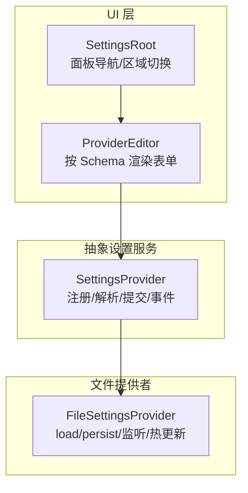
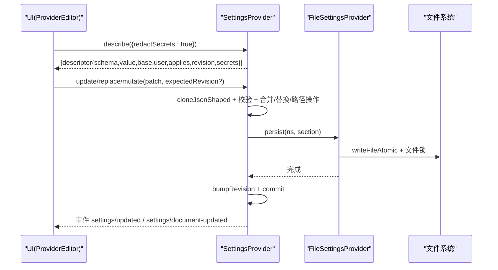
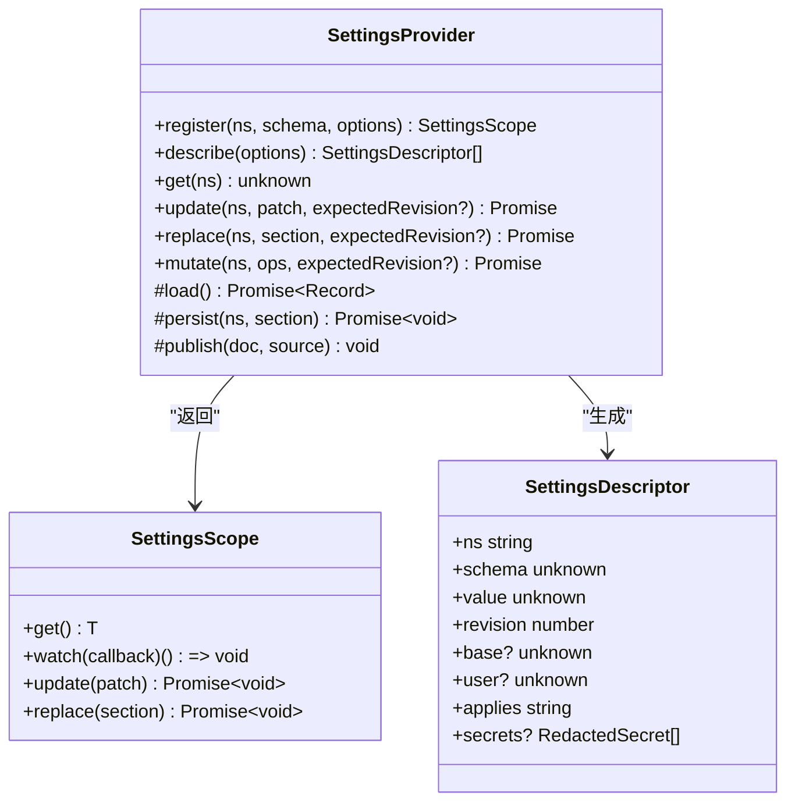
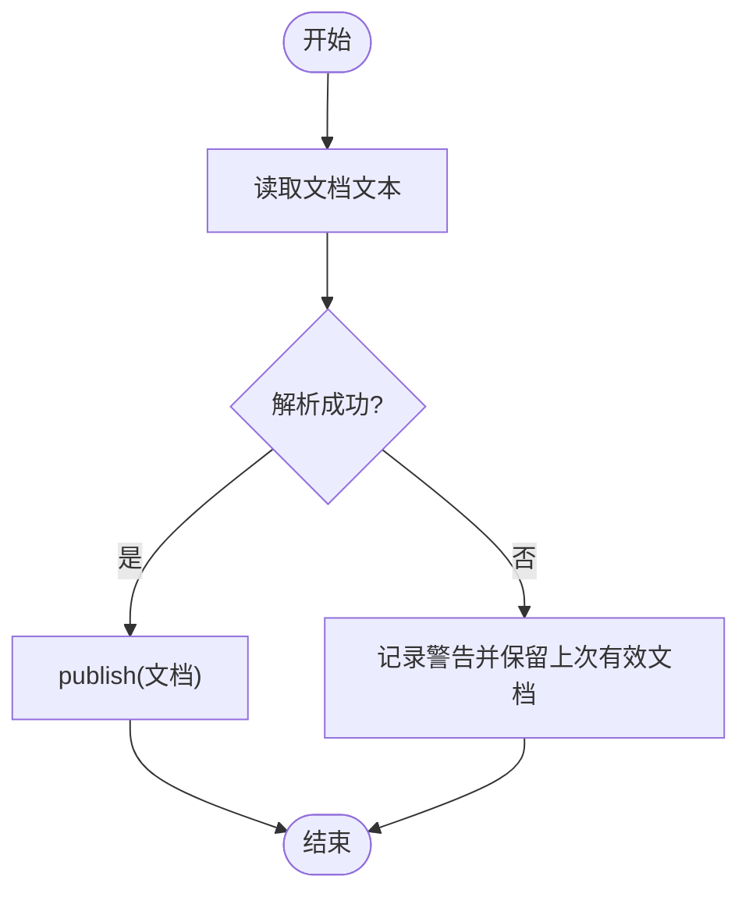
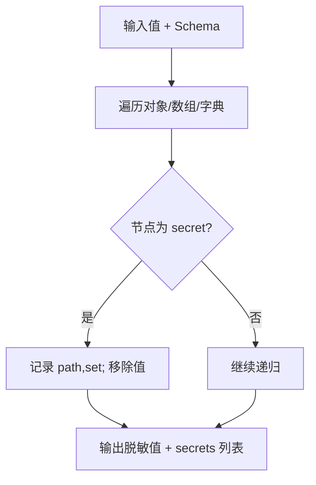
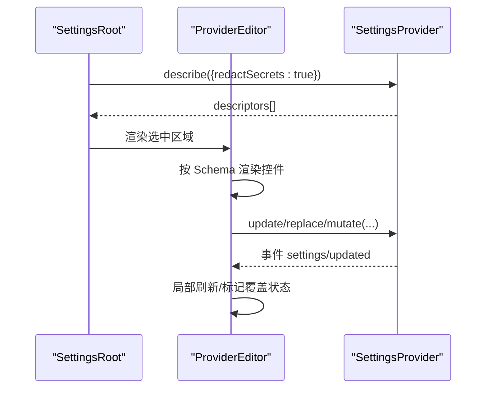
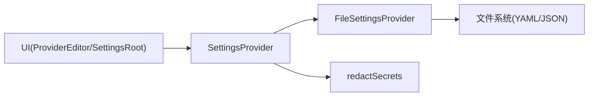

# 设置组件

<cite>
**本文引用的文件**
- [packages/settings/settings/src/index.ts](file://packages/settings/settings/src/index.ts)
- [packages/settings/settings/src/types.ts](file://packages/settings/settings/src/types.ts)
- [packages/settings/settings/src/redact.ts](file://packages/settings/settings/src/redact.ts)
- [packages/settings/settings-file/src/index.ts](file://packages/settings/settings-file/src/index.ts)
- [docs/subsystems/settings.md](file://docs/subsystems/settings.md)
- [packages/client/ui-settings-general/src/client/SettingsRoot.tsx](file://packages/client/ui-settings-general/src/client/SettingsRoot.tsx)
- [packages/client/ui-settings-models/src/client/ProviderEditor.tsx](file://packages/client/ui-settings-models/src/client/ProviderEditor.tsx)
</cite>

## 目录
1. [简介](#简介)
2. [项目结构](#项目结构)
3. [核心组件](#核心组件)
4. [架构总览](#架构总览)
5. [详细组件分析](#详细组件分析)
6. [依赖关系分析](#依赖关系分析)
7. [性能与并发特性](#性能与并发特性)
8. [故障排查指南](#故障排查指南)
9. [结论](#结论)
10. [附录：扩展与集成指南](#附录扩展与集成指南)

## 简介
本文件面向“设置相关 UI 组件”的文档目标，围绕配置面板、模型设置、权限管理等设置组件的实现原理与使用方法进行系统化说明。内容覆盖：
- 配置验证机制（Schema 校验 + 自定义 validate）
- 数据持久化（文件提供者 YAML/JSON，原子写入与注释保留）
- 实时更新（观察者 watch、事件 settings/updated、settings/document-updated）
- 通用设置元素封装（表单、开关、选择器等由 Schema 驱动渲染）
- 设置项的组织结构与分组管理（命名空间 namespace、描述符 descriptor）
- 导入导出能力（基于文件提供者的文档路径与外部编辑热更新）
- 扩展开发指南（注册新命名空间、实现自定义 Provider、接入 UI 表单）

## 项目结构
设置子系统由“抽象服务 + 文件提供者 + UI 层”构成：
- 抽象服务：定义命名空间注册、值解析、变更提交、事件发布等核心能力
- 文件提供者：将用户设置落地为 YAML/JSON 文档，支持外部编辑热更新与注释保留
- UI 层：通过 describe() 暴露 Schema 与当前值，驱动表单、开关、选择器等控件；支持只读/可写、敏感字段脱敏展示

图表来源
- [packages/settings/settings/src/index.ts:350-800](file://packages/settings/settings/src/index.ts#L350-L800)
- [packages/settings/settings-file/src/index.ts:105-368](file://packages/settings/settings-file/src/index.ts#L105-L368)
- [packages/client/ui-settings-general/src/client/SettingsRoot.tsx:63-100](file://packages/client/ui-settings-general/src/client/SettingsRoot.tsx#L63-L100)
- [packages/client/ui-settings-models/src/client/ProviderEditor.tsx:170-181](file://packages/client/ui-settings-models/src/client/ProviderEditor.tsx#L170-L181)

章节来源
- [docs/subsystems/settings.md:1-311](file://docs/subsystems/settings.md#L1-L311)

## 核心组件
- SettingsProvider（抽象服务）
  - 命名空间注册 register(ns, schema, options)
  - 值解析 resolve(schema, base, section, validate)
  - 变更提交 update/replace/mutate，含 JSON 兼容校验、冲突检测、序列化队列
  - 事件发布 settings/updated、settings/document-updated
  - 描述 describe() 输出 Schema、value、base、user、applies、revision、secrets
- FileSettingsProvider（文件提供者）
  - load/persist 实现 YAML/JSON 读写，保持注释与锚点
  - 文件监听 chokidar 热更新，去抖合并，避免竞态
  - 原子写入 writeFileAtomic + 文件锁 withFileLock
  - 文档路径 documentPath、prepareDocument 创建空文档
- UI 组件
  - SettingsRoot 负责设置面板布局、导航、关闭、区域渲染
  - ProviderEditor 根据 Schema 渲染具体表单控件（输入、开关、选择器），处理协议选择等布局差异

章节来源
- [packages/settings/settings/src/index.ts:350-800](file://packages/settings/settings/src/index.ts#L350-L800)
- [packages/settings/settings-file/src/index.ts:105-368](file://packages/settings/settings-file/src/index.ts#L105-L368)
- [packages/client/ui-settings-general/src/client/SettingsRoot.tsx:63-100](file://packages/client/ui-settings-general/src/client/SettingsRoot.tsx#L63-L100)
- [packages/client/ui-settings-models/src/client/ProviderEditor.tsx:170-181](file://packages/client/ui-settings-models/src/client/ProviderEditor.tsx#L170-L181)

## 架构总览
设置系统采用“服务 + 提供者 + UI”的分层设计：
- 服务层：统一注册、解析、提交、事件，屏蔽存储细节
- 提供者层：实现具体存储（文件、远程等），对外暴露 load/persist
- UI 层：消费 describe() 的 Schema 与值，渲染表单并调用 update/replace/mutate

图表来源
- [packages/settings/settings/src/index.ts:479-512](file://packages/settings/settings/src/index.ts#L479-L512)
- [packages/settings/settings/src/index.ts:534-648](file://packages/settings/settings/src/index.ts#L534-L648)
- [packages/settings/settings-file/src/index.ts:184-230](file://packages/settings/settings-file/src/index.ts#L184-L230)
- [packages/settings/settings/src/types.ts:18-49](file://packages/settings/settings/src/types.ts#L18-L49)

## 详细组件分析

### 抽象设置服务（SettingsProvider）
- 命名空间注册与生命周期
  - register(ns, schema, options)：绑定 Schema、base、applies、validate；返回 Scope(get/watch/update/replace)
  - 作用域 Scope 保证 get 返回深冻结快照，watch 串行回调，update/replace/mutate 走同一队列
- 值解析与验证
  - resolve(schema, base, section, validate)：先合并 base 与 user 层，再经 Schema 校验，最后执行 owner 自定义 validate
- 变更提交与冲突控制
  - update/replace/mutate：JSON 兼容克隆、路径操作、expectedRevision 冲突检测、持久化后提交
  - write 内部维护 per-namespace 队列，失败不污染后续任务
- 事件与观察
  - settings/updated：值变化时发出（深相等不触发）
  - settings/document-updated：原始用户段变化时发出（即使值未变也触发，用于 UI 感知继承/覆盖状态）
- 描述接口
  - describe({redactSecrets?})：输出 Schema、value、base、user、applies、revision、secrets；跨进程必须开启脱敏

图表来源
- [packages/settings/settings/src/index.ts:350-800](file://packages/settings/settings/src/index.ts#L350-L800)
- [packages/settings/settings/src/types.ts:18-49](file://packages/settings/settings/src/types.ts#L18-L49)

章节来源
- [packages/settings/settings/src/index.ts:350-800](file://packages/settings/settings/src/index.ts#L350-L800)
- [packages/settings/settings/src/types.ts:1-51](file://packages/settings/settings/src/types.ts#L1-L51)
- [docs/subsystems/settings.md:18-153](file://docs/subsystems/settings.md#L18-L153)

### 文件设置提供者（FileSettingsProvider）
- 文档格式与路径
  - 支持 .yaml/.yml/.json，默认位于 harness home 下的 settings.yaml
  - documentPath 暴露本地路径，prepareDocument 可创建空文档
- 读取与解析
  - load：读取文本并解析为各命名空间的原始段；YAML 使用 yaml 库，JSON 使用 JSON.parse
- 写入与持久化
  - persist：对单命名空间进行最小差异 patch（YAML 保留注释/锚点），原子写入 + 文件锁
  - reconcileFromDisk：比较缓存文本，避免重复刷新
- 热更新与并发
  - chokidar 监听文件变化，去抖合并，ready 时做一次 reconcile 消除启动窗口竞态
  - operations 队列串行化所有操作，确保写与重载互斥

图表来源
- [packages/settings/settings-file/src/index.ts:170-182](file://packages/settings/settings-file/src/index.ts#L170-L182)
- [packages/settings/settings-file/src/index.ts:232-268](file://packages/settings/settings-file/src/index.ts#L232-L268)
- [packages/settings/settings-file/src/index.ts:304-338](file://packages/settings/settings-file/src/index.ts#L304-L338)

章节来源
- [packages/settings/settings-file/src/index.ts:21-67](file://packages/settings/settings-file/src/index.ts#L21-L67)
- [packages/settings/settings-file/src/index.ts:105-168](file://packages/settings/settings-file/src/index.ts#L105-L168)
- [packages/settings/settings-file/src/index.ts:170-230](file://packages/settings/settings-file/src/index.ts#L170-L230)
- [packages/settings/settings-file/src/index.ts:232-368](file://packages/settings/settings-file/src/index.ts#L232-L368)

### 敏感字段脱敏（redactSecrets）
- 依据 Schema 中 role('secret') 标记，递归移除 value/base/user 中的敏感字段
- 同时输出 secrets 列表，包含每个敏感字段的路径与是否已设置
- UI 据此渲染“仅写”输入框，无需接收真实值

图表来源
- [packages/settings/settings/src/redact.ts:50-109](file://packages/settings/settings/src/redact.ts#L50-L109)

章节来源
- [packages/settings/settings/src/redact.ts:1-110](file://packages/settings/settings/src/redact.ts#L1-L110)

### UI 组件：设置面板与表单
- SettingsRoot
  - 提供设置面板容器、导航区、关闭按钮、区域渲染槽位
  - 支持 loopback 提示与动作插槽
- ProviderEditor
  - 基于 Schema 渲染具体控件（输入、开关、选择器）
  - 根据布局策略（如 pi-ai）动态决定协议选择等交互
  - 通过 schema.getPath 定位字段，结合 provider 上下文渲染

图表来源
- [packages/client/ui-settings-general/src/client/SettingsRoot.tsx:63-100](file://packages/client/ui-settings-general/src/client/SettingsRoot.tsx#L63-L100)
- [packages/client/ui-settings-models/src/client/ProviderEditor.tsx:170-181](file://packages/client/ui-settings-models/src/client/ProviderEditor.tsx#L170-L181)
- [packages/settings/settings/src/index.ts:479-512](file://packages/settings/settings/src/index.ts#L479-L512)

章节来源
- [packages/client/ui-settings-general/src/client/SettingsRoot.tsx:63-100](file://packages/client/ui-settings-general/src/client/SettingsRoot.tsx#L63-L100)
- [packages/client/ui-settings-models/src/client/ProviderEditor.tsx:170-181](file://packages/client/ui-settings-models/src/client/ProviderEditor.tsx#L170-L181)

## 依赖关系分析
- SettingsProvider 依赖：
  - Cordis Context/Service/Events
  - schemastery 类型与 Schema 实例
  - redact 工具用于脱敏
- FileSettingsProvider 依赖：
  - SettingsProvider 抽象
  - chokidar 文件监听
  - node fs/promises、path、yaml、atomic-write、home-paths
- UI 层依赖：
  - SettingsProvider.describe 输出的 Schema 与值
  - 布局策略与国际化资源（不在本节展开）

图表来源
- [packages/settings/settings/src/index.ts:350-800](file://packages/settings/settings/src/index.ts#L350-L800)
- [packages/settings/settings-file/src/index.ts:105-368](file://packages/settings/settings-file/src/index.ts#L105-L368)
- [packages/settings/settings/src/redact.ts:1-110](file://packages/settings/settings/src/redact.ts#L1-L110)

章节来源
- [packages/settings/settings/src/index.ts:350-800](file://packages/settings/settings/src/index.ts#L350-L800)
- [packages/settings/settings-file/src/index.ts:105-368](file://packages/settings/settings-file/src/index.ts#L105-L368)

## 性能与并发特性
- 写入队列
  - 每个命名空间独立队列，顺序执行，失败不污染后续任务
  - 在队列前端重新读取当前 section，避免基于陈旧快照的覆盖
- 冲突检测
  - expectedRevision 与当前 revision 不一致则拒绝写入，防止多端并发覆盖
- 观察者串行化
  - 每个 watcher 的回调按提交顺序串行执行，避免乱序
- 文件 I/O
  - 原子写入 + 文件锁，避免并发写损坏文档
  - 监听去抖合并，减少频繁刷新
- 值冻结
  - 解析后的值 deepFreeze，保证快照不可变，降低 UI 重渲染风险

章节来源
- [packages/settings/settings/src/index.ts:577-648](file://packages/settings/settings/src/index.ts#L577-L648)
- [packages/settings/settings/src/index.ts:719-799](file://packages/settings/settings/src/index.ts#L719-L799)
- [packages/settings/settings-file/src/index.ts:184-230](file://packages/settings/settings-file/src/index.ts#L184-L230)
- [packages/settings/settings-file/src/index.ts:232-268](file://packages/settings/settings-file/src/index.ts#L232-L268)

## 故障排查指南
- 文档无效或无法解析
  - 文件提供者会记录警告并保留上次有效文档；检查 YAML/JSON 语法错误
  - 参考加载与解析流程定位问题行
- 写入被拒绝
  - 非 JSON 兼容数据类型会被拒绝，查看错误信息中的路径
  - expectedRevision 不匹配导致冲突，需重新获取 descriptor 后再写
- 监听异常
  - 文件监听报错会记录警告；检查路径权限与磁盘状态
- 敏感字段未显示
  - 确认 describe 已开启 redactSecrets；检查 Schema 是否正确标注 role('secret')

章节来源
- [packages/settings/settings-file/src/index.ts:271-295](file://packages/settings/settings-file/src/index.ts#L271-L295)
- [packages/settings/settings-file/src/index.ts:304-338](file://packages/settings/settings-file/src/index.ts#L304-L338)
- [packages/settings/settings/src/index.ts:253-288](file://packages/settings/settings/src/index.ts#L253-L288)
- [packages/settings/settings/src/index.ts:621-648](file://packages/settings/settings/src/index.ts#L621-L648)

## 结论
设置子系统通过“抽象服务 + 文件提供者 + UI”的分层设计，实现了：
- 强类型的 Schema 驱动表单与校验
- 安全的持久化与并发控制
- 实时的变更通知与热更新
- 安全的敏感字段脱敏与只写输入
- 可扩展的 Provider 与 UI 集成方式

该体系既满足复杂场景下的稳定性与一致性要求，也为插件与扩展提供了清晰的接入点。

## 附录：扩展与集成指南
- 新增设置项（插件侧）
  - 使用 settingsNamespace 创建命名空间
  - 通过 ctx.settings.register 注册 Schema、base、applies、validate
  - 使用 Scope.get/watch 读取与监听，update/replace/mutate 提交变更
- 自定义 Provider
  - 继承 SettingsProvider，实现 load/persist
  - 如需本地文件存储，可直接复用 FileSettingsProvider
  - 通过 publish 推送外部变更（如远程同步）
- UI 集成
  - 调用 describe({redactSecrets:true}) 获取 descriptors
  - 基于 schema.toJSON() 渲染表单控件（输入、开关、选择器等）
  - 使用 base/user 判断字段是否被用户覆盖，支持重置
  - 对 secrets 列表渲染“仅写”输入框
- 导入导出
  - 使用 FileSettingsProvider.documentPath 打开本地文档
  - 外部编辑通过 chokidar 热更新自动生效
  - 支持 YAML/JSON 两种格式，YAML 保留注释与锚点

章节来源
- [packages/settings/settings/src/index.ts:26-31](file://packages/settings/settings/src/index.ts#L26-L31)
- [packages/settings/settings/src/index.ts:435-470](file://packages/settings/settings/src/index.ts#L435-L470)
- [packages/settings/settings/src/index.ts:479-512](file://packages/settings/settings/src/index.ts#L479-L512)
- [packages/settings/settings-file/src/index.ts:147-168](file://packages/settings/settings-file/src/index.ts#L147-L168)
- [packages/settings/settings-file/src/index.ts:232-268](file://packages/settings/settings-file/src/index.ts#L232-L268)
- [docs/subsystems/settings.md:96-153](file://docs/subsystems/settings.md#L96-L153)