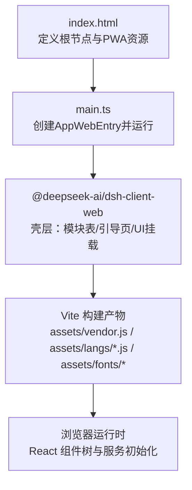
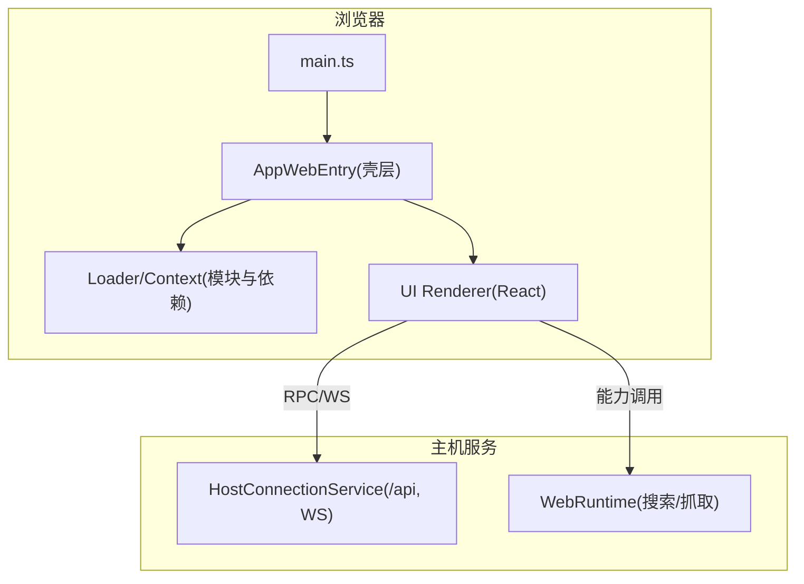
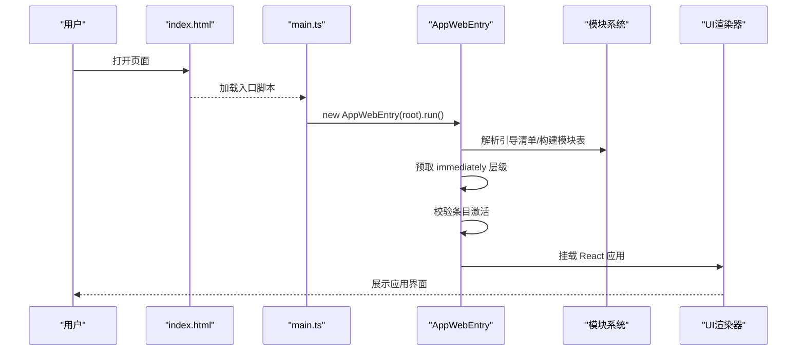
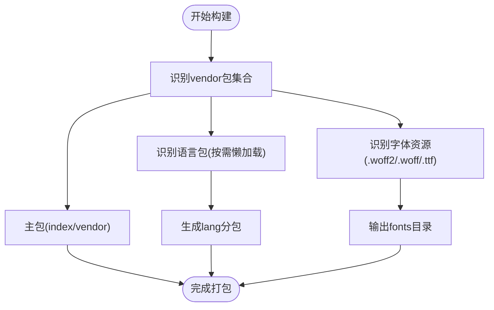
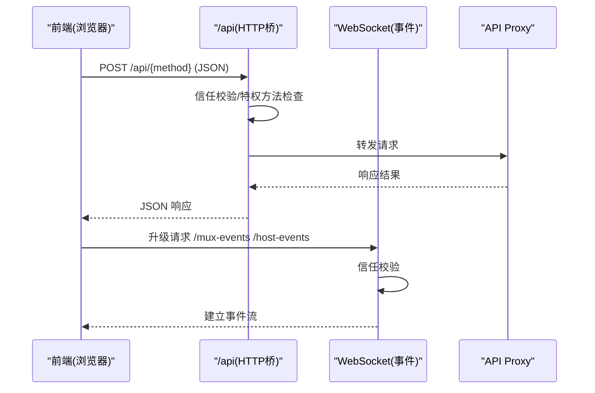
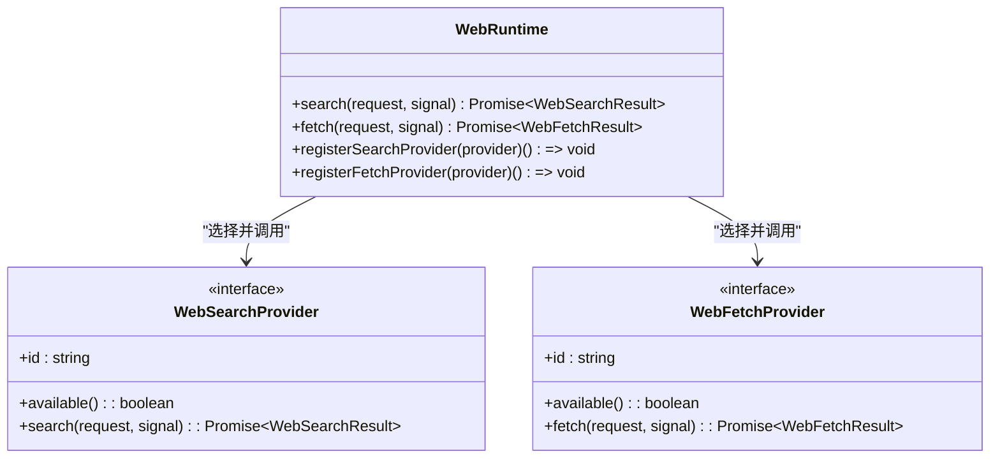
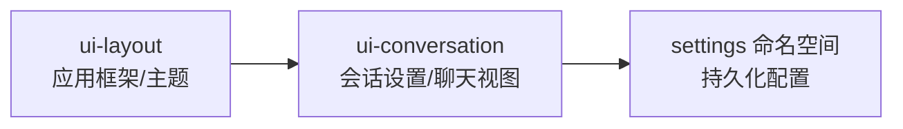
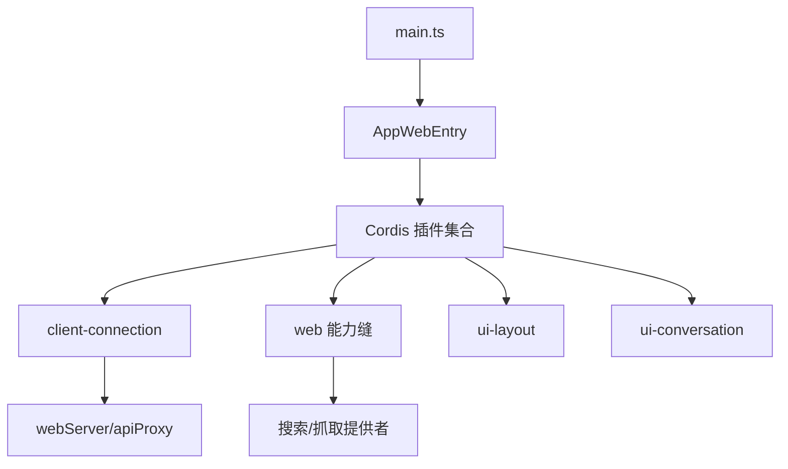

# Web 应用

<cite>
**本文引用的文件**
- [apps/web/package.json](file://apps/web/package.json)
- [apps/web/src/main.ts](file://apps/web/src/main.ts)
- [apps/web/vite.config.ts](file://apps/web/vite.config.ts)
- [apps/web/index.html](file://apps/web/index.html)
- [packages/client/connection/src/index.ts](file://packages/client/connection/src/index.ts)
- [packages/client/runtime/src/index.ts](file://packages/client/runtime/src/index.ts)
- [packages/web/web/src/index.ts](file://packages/web/web/src/index.ts)
- [packages/client/ui-conversation/src/index.ts](file://packages/client/ui-conversation/src/index.ts)
- [packages/client/ui-layout/src/index.ts](file://packages/client/ui-layout/src/index.ts)
</cite>

## 目录
1. [简介](#简介)
2. [项目结构](#项目结构)
3. [核心组件](#核心组件)
4. [架构总览](#架构总览)
5. [详细组件分析](#详细组件分析)
6. [依赖关系分析](#依赖关系分析)
7. [性能考量](#性能考量)
8. [故障排查指南](#故障排查指南)
9. [结论](#结论)
10. [附录](#附录)

## 简介
本文件面向 DeepSeek Harness Web 应用的开发者与集成者，系统性说明 React 组件架构、状态管理与路由导航系统；详述客户端 SDK 的使用方法与实时通信机制；解释用户界面组件的视觉外观、行为模式与交互流程；提供组件属性、事件、插槽与自定义选项参考；给出响应式设计指南与无障碍访问合规性说明；介绍主题定制与样式自定义方法；并提供与后端服务集成的示例与性能优化建议。

## 项目结构
Web 应用以 apps/web 为入口，基于 Vite 构建，采用 React 作为 UI 框架，并通过 @deepseek-ai/dsh-client-web 提供的壳层完成模块加载、引导页渲染与 UI 挂载。关键要点：
- 入口脚本仅负责查找挂载节点并启动 AppWebEntry，其余能力由插件化 shell 承担。
- Vite 配置将重型渲染依赖（数学、语法高亮、Markdown）拆分到 vendor chunk，提升缓存命中与首屏性能。
- HTML 模板注入 PWA manifest、favicon 与动态标题，确保基础体验与可发现性。

**图表来源**
- [apps/web/index.html:1-15](file://apps/web/index.html#L1-L15)
- [apps/web/src/main.ts:1-11](file://apps/web/src/main.ts#L1-L11)
- [apps/web/vite.config.ts:110-146](file://apps/web/vite.config.ts#L110-L146)

**章节来源**
- [apps/web/package.json:1-49](file://apps/web/package.json#L1-L49)
- [apps/web/src/main.ts:1-11](file://apps/web/src/main.ts#L1-L11)
- [apps/web/vite.config.ts:1-177](file://apps/web/vite.config.ts#L1-L177)
- [apps/web/index.html:1-15](file://apps/web/index.html#L1-L15)

## 核心组件
- 应用壳层与引导：AppWebEntry 负责解析引导清单、构建模块系统、预取立即执行层级、创建 Cordis 上下文与条目，最终交由 UI 渲染器挂载。
- 连接与 RPC：client-connection 插件在主机端暴露 /api 前缀的 HTTP 桥接，并对特权方法进行回环地址限制；同时注册 WebSocket 升级路径用于事件流。
- Web 能力缝：web 服务通过 Provider 选择机制统一对外暴露搜索与抓取能力，支持显式配置或自动选择唯一可用提供者。
- UI 布局与对话：ui-layout 提供应用框架与主题呈现；ui-conversation 注册会话相关设置命名空间，承载聊天视图与消息渲染。

**章节来源**
- [packages/client/connection/src/index.ts:1-197](file://packages/client/connection/src/index.ts#L1-L197)
- [packages/web/web/src/index.ts:1-203](file://packages/web/web/src/index.ts#L1-L203)
- [packages/client/ui-conversation/src/index.ts:1-24](file://packages/client/ui-conversation/src/index.ts#L1-L24)
- [packages/client/ui-layout/src/index.ts:1-5](file://packages/client/ui-layout/src/index.ts#L1-L5)

## 架构总览
Web 应用采用“壳层 + 插件”的模块化架构：
- 壳层（dsh-client-web）负责引导、模块加载、上下文装配与 UI 挂载。
- 插件体系（Cordis）按职责划分：连接、Web 能力、UI 布局、对话、工具等。
- 构建期通过 Vite 手动分包策略，将稳定且体积大的第三方库抽离至 vendor，语言包按需懒加载，字体资源归类管理。

**图表来源**
- [apps/web/src/main.ts:1-11](file://apps/web/src/main.ts#L1-L11)
- [packages/client/connection/src/index.ts:120-197](file://packages/client/connection/src/index.ts#L120-L197)
- [packages/web/web/src/index.ts:74-164](file://packages/web/web/src/index.ts#L74-L164)

## 详细组件分析

### 应用引导与壳层（AppWebEntry）
- 职责：解析引导清单、构建模块系统、预取立即执行层级、校验条目激活、挂载 UI。
- 关键点：预取阶段必须等待，避免同步 require 时的竞态问题；对未激活条目进行诊断并报错。
- 错误处理：缺失引导门面、清单格式错误、重复条目、条目未激活等场景均会渲染友好提示。

**图表来源**
- [apps/web/index.html:1-15](file://apps/web/index.html#L1-L15)
- [apps/web/src/main.ts:1-11](file://apps/web/src/main.ts#L1-L11)

**章节来源**
- [apps/web/src/main.ts:1-11](file://apps/web/src/main.ts#L1-L11)

### 构建与分包策略（Vite 配置）
- 目标：将稳定且体积大的第三方库（如 KaTeX、Shiki、Markdown 解析链）放入 vendor 以提升缓存命中率；语言包按需懒加载；字体资源集中输出。
- 实现：通过 manualChunks 精确控制包归属；assetFileNames 分类输出；dedupe 保证单一 React 实例；define 注入构建时常量。

**图表来源**
- [apps/web/vite.config.ts:59-146](file://apps/web/vite.config.ts#L59-L146)

**章节来源**
- [apps/web/vite.config.ts:1-177](file://apps/web/vite.config.ts#L1-L177)

### 客户端连接与实时通信（client-connection）
- HTTP 桥接：在主机端注册 /api 前缀，所有请求先经过信任校验（DNS 重绑定与跨站防护），特权方法强制回环地址。
- WebSocket 事件：注册 MUX_EVENTS_PATH 与 HOST_EVENTS_PATH 的升级处理器，建立双向事件通道。
- 安全边界：通过 trustedHosts 白名单与最大请求体大小限制，防止滥用与放大攻击。

**图表来源**
- [packages/client/connection/src/index.ts:120-197](file://packages/client/connection/src/index.ts#L120-L197)

**章节来源**
- [packages/client/connection/src/index.ts:1-197](file://packages/client/connection/src/index.ts#L1-L197)

### Web 能力缝（搜索与抓取）
- 设计：通过 Provider 注册与选择逻辑，屏蔽具体实现差异；支持显式配置或自动选择唯一可用提供者。
- 约束：search 结果受 maxResults 上限保护，超出部分截断并标记 truncated。
- 错误：未注册、不可用、多提供者歧义等情形抛出明确错误码。

**图表来源**
- [packages/web/web/src/index.ts:74-164](file://packages/web/web/src/index.ts#L74-L164)

**章节来源**
- [packages/web/web/src/index.ts:1-203](file://packages/web/web/src/index.ts#L1-L203)

### UI 布局与对话（ui-layout 与 ui-conversation）
- 布局：提供应用框架、列布局与主题呈现，支撑整体页面结构与视觉一致性。
- 对话：注册会话设置命名空间，承载聊天视图、消息渲染与交互行为。
- 扩展点：通过设置项与插槽机制，允许外部定制行为与内容。

**图表来源**
- [packages/client/ui-layout/src/index.ts:1-5](file://packages/client/ui-layout/src/index.ts#L1-L5)
- [packages/client/ui-conversation/src/index.ts:1-24](file://packages/client/ui-conversation/src/index.ts#L1-L24)

**章节来源**
- [packages/client/ui-layout/src/index.ts:1-5](file://packages/client/ui-layout/src/index.ts#L1-L5)
- [packages/client/ui-conversation/src/index.ts:1-24](file://packages/client/ui-conversation/src/index.ts#L1-L24)

## 依赖关系分析
- 壳层与插件：AppWebEntry 依赖 Loader 与 Context，插件通过 inject 声明依赖，形成松耦合的依赖图。
- 构建依赖：Vite 通过 dedupe 与 alias 控制依赖版本与别名，确保单一 React 实例与浏览器兼容。
- 运行时依赖：client-connection 依赖 webServer 与 apiProxy；web 能力缝依赖 settings 与 provider 注册。

**图表来源**
- [apps/web/src/main.ts:1-11](file://apps/web/src/main.ts#L1-L11)
- [packages/client/connection/src/index.ts:46-197](file://packages/client/connection/src/index.ts#L46-L197)
- [packages/web/web/src/index.ts:74-164](file://packages/web/web/src/index.ts#L74-L164)

**章节来源**
- [apps/web/src/main.ts:1-11](file://apps/web/src/main.ts#L1-L11)
- [packages/client/connection/src/index.ts:1-197](file://packages/client/connection/src/index.ts#L1-L197)
- [packages/web/web/src/index.ts:1-203](file://packages/web/web/src/index.ts#L1-L203)

## 性能考量
- 分包策略：将稳定第三方库抽离至 vendor，减少重建成本；语言包按需懒加载，降低首屏体积。
- 资源组织：字体资源集中输出，便于缓存与 CDN 管理。
- 依赖去重：dedupe react/react-dom，避免多实例导致的 Hook 与元素身份分裂。
- 构建常量：define 注入构建时环境常量，消除运行时分支判断开销。

[本节为通用指导，不直接分析具体文件]

## 故障排查指南
- 引导失败：检查 window.__ModuleLoader__ 是否存在、window.__DSH_BOOT__ 是否合法、是否有重复条目。
- 条目未激活：查看控制台错误信息，确认依赖服务是否已就绪；必要时调整插件顺序或补充缺失服务。
- 连接受限：确认 trustedHosts 配置正确；特权方法仅在回环地址可用；WebSocket 升级需满足信任校验。
- 能力不可用：检查搜索/抓取提供者是否注册且 available；若存在多个可用提供者，需显式配置其一。

**章节来源**
- [packages/client/connection/src/index.ts:120-197](file://packages/client/connection/src/index.ts#L120-L197)
- [packages/web/web/src/index.ts:171-194](file://packages/web/web/src/index.ts#L171-L194)

## 结论
DeepSeek Harness Web 应用通过壳层与插件化的架构实现了高度可扩展的 Web 体验。借助 Vite 的分包策略与严格的信任边界，系统在性能与安全之间取得平衡。结合统一的 Web 能力缝与丰富的 UI 组件，开发者可以快速集成搜索、抓取与对话能力，并通过设置与插槽进行定制化扩展。

[本节为总结性内容，不直接分析具体文件]

## 附录

### 组件属性、事件、插槽与自定义选项参考
- 会话设置（ui-conversation）
  - 命名空间：CONVERSATION_SETTINGS_NAMESPACE
  - 字段：BUSY_ENTER_FIELD、DEFAULT_BUSY_ENTER_BEHAVIOR、BUSY_ENTER_BEHAVIORS
  - 作用：注册会话相关的持久化配置项，供 UI 读取与更新
- 应用框架（ui-layout）
  - 作用：提供应用级布局与主题呈现，支撑页面结构与视觉一致性
  - 扩展点：通过主题呈现器与布局服务进行样式与行为定制

**章节来源**
- [packages/client/ui-conversation/src/index.ts:1-24](file://packages/client/ui-conversation/src/index.ts#L1-L24)
- [packages/client/ui-layout/src/index.ts:1-5](file://packages/client/ui-layout/src/index.ts#L1-L5)

### 响应式设计指南与无障碍访问合规性
- 响应式：使用弹性布局与媒体查询适配不同屏幕尺寸；确保交互控件在移动端可触达。
- 无障碍：为关键控件提供语义化标签与键盘可达性；确保颜色对比度符合 WCAG 标准；为图片提供替代文本。

[本节为通用指导，不直接分析具体文件]

### 主题定制与样式自定义
- 主题：通过 ui-layout 的主题呈现器覆盖默认主题变量，实现品牌色、字体与间距的统一定制。
- 样式：利用 CSS Modules 与全局样式分层，避免样式冲突；按需引入字体与图标资源。

[本节为通用指导，不直接分析具体文件]

### 与后端服务的集成示例
- HTTP 桥接：通过 /api/{method} 调用宿主能力，注意特权方法的回环限制与最大请求体大小。
- WebSocket 事件：升级至 /mux-events 与 /host-events 获取实时事件流，用于进度、日志与状态同步。
- Web 能力：使用 ctx.web.search 与 ctx.web.fetch 调用搜索与抓取能力，遵循 maxResults 限制。

**章节来源**
- [packages/client/connection/src/index.ts:120-197](file://packages/client/connection/src/index.ts#L120-L197)
- [packages/web/web/src/index.ts:140-163](file://packages/web/web/src/index.ts#L140-L163)