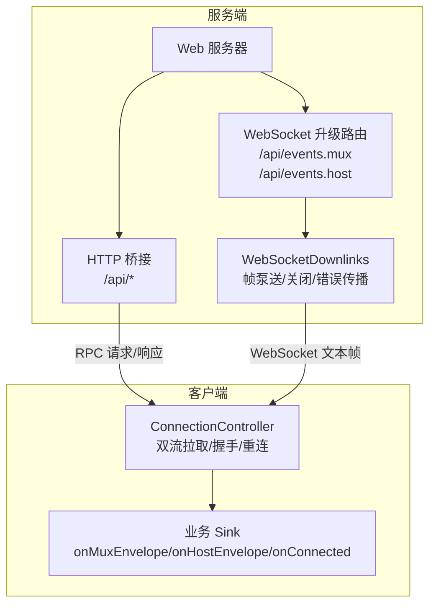
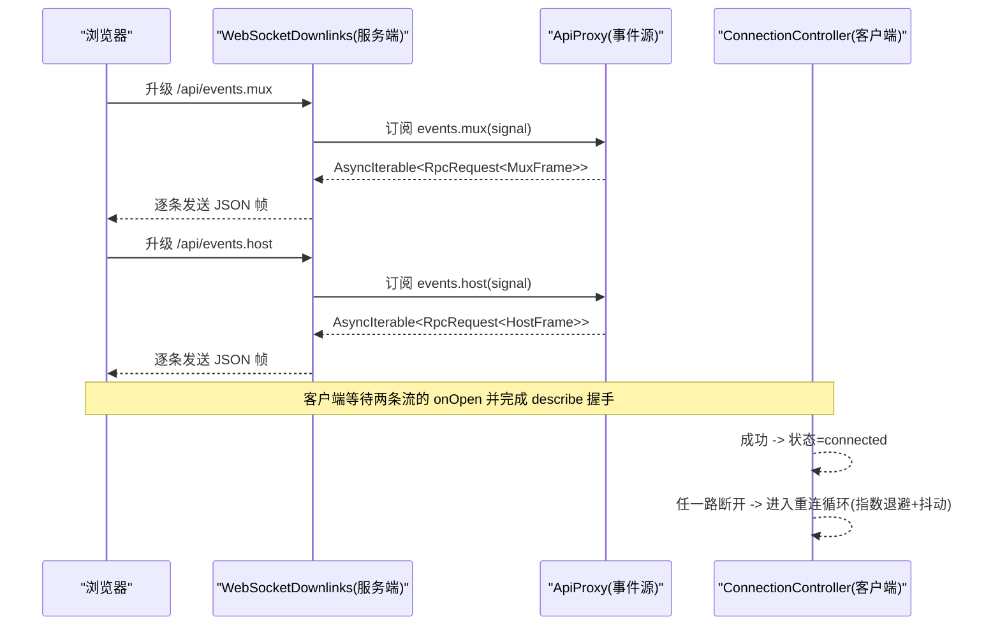
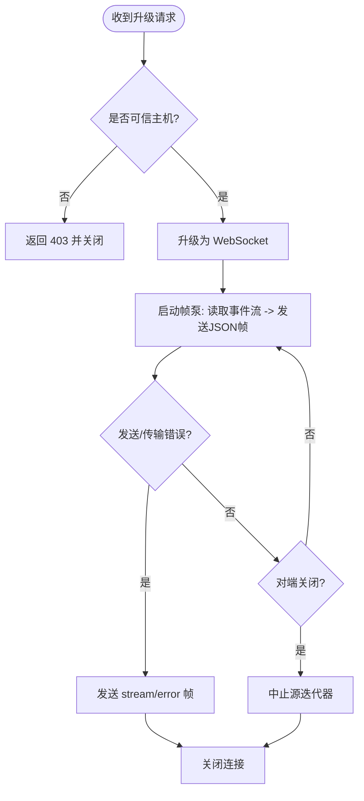
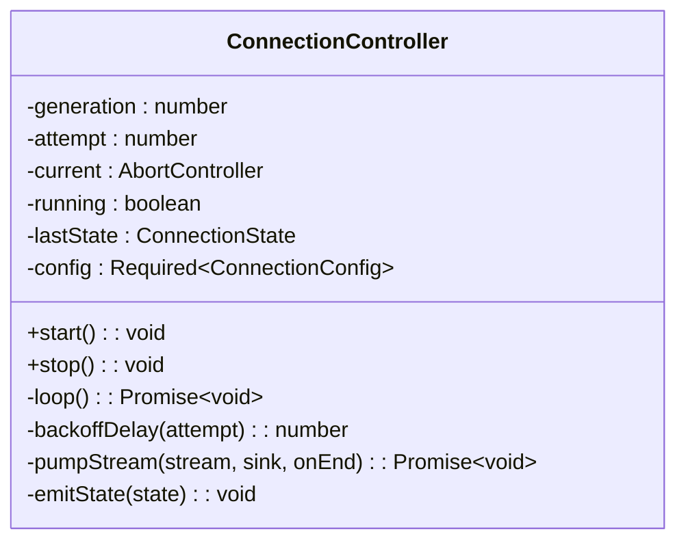
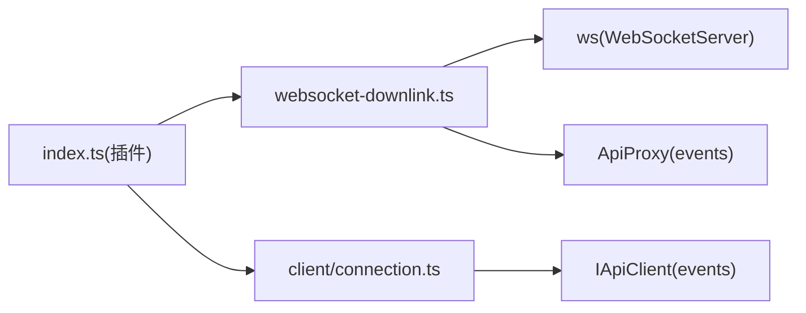

# WebSocket 连接管理

<cite>
**本文引用的文件**
- [packages/client/connection/src/websocket-downlink.ts](file://packages/client/connection/src/websocket-downlink.ts)
- [packages/client/connection/src/index.ts](file://packages/client/connection/src/index.ts)
- [packages/client/connection/src/client/connection.ts](file://packages/client/connection/src/client/connection.ts)
- [packages/mcp/mcp-client/src/connection.ts](file://packages/mcp/mcp-client/src/connection.ts)
- [packages/client/connection/tests/websocket-downlink.host.spec.ts](file://packages/client/connection/tests/websocket-downlink.host.spec.ts)
- [packages/client/connection/tests/client-apply.client.spec.ts](file://packages/client/connection/tests/client-apply.client.spec.ts)
- [.agents/notes/implemented/architecture/2026-08-04-websocket-downlink-carrier.md](file://.agents/notes/implemented/architecture/2026-08-04-websocket-downlink-carrier.md)
</cite>

## 目录
1. [简介](#简介)
2. [项目结构](#项目结构)
3. [核心组件](#核心组件)
4. [架构总览](#架构总览)
5. [详细组件分析](#详细组件分析)
6. [依赖关系分析](#依赖关系分析)
7. [性能与监控](#性能与监控)
8. [故障排查指南](#故障排查指南)
9. [结论](#结论)
10. [附录：配置与最佳实践](#附录配置与最佳实践)

## 简介
本文件系统性梳理仓库中的 WebSocket 连接管理能力，覆盖连接建立、维护与销毁的生命周期；解释连接状态机、自动重连机制与“下行通道”（downlink）的承载方式；说明连接配置选项、超时处理与心跳检测策略；并提供连接监控、性能优化与故障恢复的最佳实践。文档同时给出完整的代码示例路径与错误处理策略，帮助读者在浏览器端与服务端正确集成与维护长连接。

## 项目结构
WebSocket 连接能力由“服务端下行通道”和“客户端连接控制器”两部分组成，并通过插件注册到 Web 服务器：
- 服务端：提供两个独立的 WebSocket 下行通道（mux/host），将事件流推送到浏览器。
- 客户端：维护两条流的打开、读取、失败与重连，并在握手成功后上报连接状态。
- 插件装配：将 HTTP 路由与 WebSocket 升级路由挂载到 Web 服务器，并执行信任校验。

图表来源
- [packages/client/connection/src/index.ts:130-195](file://packages/client/connection/src/index.ts#L130-L195)
- [packages/client/connection/src/websocket-downlink.ts:51-137](file://packages/client/connection/src/websocket-downlink.ts#L51-L137)
- [packages/client/connection/src/client/connection.ts:61-169](file://packages/client/connection/src/client/connection.ts#L61-L169)

章节来源
- [packages/client/connection/src/index.ts:130-195](file://packages/client/connection/src/index.ts#L130-L195)
- [packages/client/connection/src/websocket-downlink.ts:51-137](file://packages/client/connection/src/websocket-downlink.ts#L51-L137)
- [packages/client/connection/src/client/connection.ts:61-169](file://packages/client/connection/src/client/connection.ts#L61-L169)

## 核心组件
- WebSocketDownlinks（服务端）：负责接收 HTTP 升级请求，创建 WebSocket 实例，并将服务端的 mux/host 事件流以 JSON 帧形式推送给客户端；在任意一侧关闭或出错时终止源迭代器并清理资源。
- ConnectionController（客户端）：维护两路事件的拉取循环，完成握手（describe + onOpen），在任一链路断开后按指数退避重试，并向外部暴露连接状态变化。
- 插件装配（index.ts）：注册 /api 前缀的 HTTP 路由与两个 WebSocket 升级路由，执行可信主机校验，并在关闭时统一释放资源。

章节来源
- [packages/client/connection/src/websocket-downlink.ts:51-137](file://packages/client/connection/src/websocket-downlink.ts#L51-L137)
- [packages/client/connection/src/client/connection.ts:61-169](file://packages/client/connection/src/client/connection.ts#L61-L169)
- [packages/client/connection/src/index.ts:130-195](file://packages/client/connection/src/index.ts#L130-L195)

## 架构总览
下图展示了从浏览器发起连接到服务端推送事件、再到断线重连的完整流程。

图表来源
- [packages/client/connection/src/websocket-downlink.ts:64-137](file://packages/client/connection/src/websocket-downlink.ts#L64-L137)
- [packages/client/connection/src/client/connection.ts:107-169](file://packages/client/connection/src/client/connection.ts#L107-L169)
- [packages/client/connection/tests/client-apply.client.spec.ts:197-218](file://packages/client/connection/tests/client-apply.client.spec.ts#L197-L218)

## 详细组件分析

### 服务端：WebSocketDownlinks
职责
- 接受 HTTP 升级请求，分别处理 mux 与 host 两类下行通道。
- 将服务端的异步事件流转换为 WebSocket 文本帧推送。
- 在客户端关闭、传输错误或上游迭代结束时，中止源并关闭连接。
- 拒绝不受信任的升级请求。

关键行为
- 每个连接仅允许下行数据，若客户端尝试上行消息则立即关闭（协议约定）。
- 发送失败会封装为 stream/error 帧并关闭连接。
- close() 会终止所有已连接 socket，等待所有 pump 任务结束。

图表来源
- [packages/client/connection/src/websocket-downlink.ts:23-44](file://packages/client/connection/src/websocket-downlink.ts#L23-L44)
- [packages/client/connection/src/websocket-downlink.ts:99-137](file://packages/client/connection/src/websocket-downlink.ts#L99-L137)
- [packages/client/connection/src/index.ts:180-190](file://packages/client/connection/src/index.ts#L180-L190)

章节来源
- [packages/client/connection/src/websocket-downlink.ts:51-137](file://packages/client/connection/src/websocket-downlink.ts#L51-L137)
- [packages/client/connection/src/index.ts:180-190](file://packages/client/connection/src/index.ts#L180-L190)

### 客户端：ConnectionController
职责
- 并行打开两条流，等待双方 onOpen，并通过 describe 完成握手。
- 将收到的帧投递到业务 sink，隔离 sink 异常，避免影响连接层。
- 任一链路断开即进入重连循环，使用指数退避与抖动策略。
- 对外暴露连接状态（connected/reconnecting）与连接描述。

关键行为
- 严格握手：必须两条流均 onOpen 且 describe 成功才认为连接就绪。
- 超时保护：streamOpenTimeoutMs 防止代理或载体不触发 onOpen 导致死等。
- 退避策略：backoffBaseMs、backoffFactor、backoffMaxMs 控制重试间隔，带随机抖动。
- 状态去抖：仅在状态变化时通知上层。

图表来源
- [packages/client/connection/src/client/connection.ts:61-203](file://packages/client/connection/src/client/connection.ts#L61-L203)

章节来源
- [packages/client/connection/src/client/connection.ts:1-203](file://packages/client/connection/src/client/connection.ts#L1-L203)

### 插件装配与路由
职责
- 注册 /api 前缀的 HTTP 路由，转发 RPC 请求。
- 注册两个 WebSocket 升级路由（events.mux、events.host），用于下行事件推送。
- 对非可信主机或受限方法进行拦截，保障安全边界。

关键行为
- 对 GET 请求访问事件路径返回 426 升级提示。
- 对受保护方法在非环回地址下返回 403。
- 在进程关闭时统一释放 WebSocketDownlinks 资源。

章节来源
- [packages/client/connection/src/index.ts:130-195](file://packages/client/connection/src/index.ts#L130-L195)

### MCP 连接管理与自动重连（参考）
虽然 MCP 连接并非基于 WebSocket，但其重连策略与生命周期管理可作为同类能力的参考：
- 支持启用/禁用自动重连、初始延迟、最大延迟、最大尝试次数。
- 采用指数退避，超过最大尝试次数后注销工具并停止重连。
- 通过稳定性窗口重置尝试计数，避免崩溃循环无限重启。

章节来源
- [packages/mcp/mcp-client/src/connection.ts:27-90](file://packages/mcp/mcp-client/src/connection.ts#L27-L90)
- [packages/mcp/mcp-client/src/connection.ts:192-225](file://packages/mcp/mcp-client/src/connection.ts#L192-L225)
- [packages/mcp/mcp-client/src/connection.ts:237-305](file://packages/mcp/mcp-client/src/connection.ts#L237-L305)

## 依赖关系分析
- 服务端依赖 ws 库实现 WebSocketServer，并通过 ApiProxy 获取事件源。
- 客户端依赖 IApiClient 提供的 events.mux/host 接口进行拉取。
- 插件装配依赖 Web 服务器的路由与升级能力，以及信任校验模块。

图表来源
- [packages/client/connection/src/index.ts:130-195](file://packages/client/connection/src/index.ts#L130-L195)
- [packages/client/connection/src/websocket-downlink.ts:51-137](file://packages/client/connection/src/websocket-downlink.ts#L51-L137)
- [packages/client/connection/src/client/connection.ts:61-169](file://packages/client/connection/src/client/connection.ts#L61-L169)

章节来源
- [packages/client/connection/src/index.ts:130-195](file://packages/client/connection/src/index.ts#L130-L195)
- [packages/client/connection/src/websocket-downlink.ts:51-137](file://packages/client/connection/src/websocket-downlink.ts#L51-L137)
- [packages/client/connection/src/client/connection.ts:61-169](file://packages/client/connection/src/client/connection.ts#L61-L169)

## 性能与监控
- 连接并发：每个页面维持两条独立 WebSocket 下行通道，避免占用浏览器 HTTP/1.1 连接配额，提升并发能力。
- 退避与抖动：客户端使用指数退避加随机抖动，降低雪崩风险。
- 握手超时：streamOpenTimeoutMs 防止代理或网络问题导致握手长期阻塞。
- 资源释放：服务端 close() 会终止所有 socket 并等待泵任务结束，确保无悬挂定时器或迭代器。
- 监控建议：
  - 监听 onStateChange 统计 connected/reconnecting 时长分布。
  - 记录每次重连的 attempt 编号与退避时长，观察异常波动。
  - 在服务端统计 upgrade 成功率与关闭原因码。

[本节为通用指导，无需特定文件引用]

## 故障排查指南
常见问题与定位要点
- 无法升级：检查 trustedHosts 配置与请求 Host 头是否匹配；确认 GET 访问事件路径返回 426 升级提示。
- 连接后立即关闭：检查客户端是否意外发送了上行消息（协议不允许），或服务端检测到传输错误。
- 长时间重连：关注 backoffBaseMs/backoffFactor/backoffMaxMs 配置是否合理；观察是否存在代理丢弃连接或证书问题。
- 资源未释放：确认调用 stop()/dispose() 或进程退出时 downlinks.close() 被调用。

可复现用例与测试参考
- 验证每条下行通道独立、帧解析与 abort 行为：参见测试用例中对两条流打开与 abort 的断言。
- 验证 send 回调失败会关闭连接并发送错误帧：参见测试中对 send 失败的模拟与关闭断言。
- 验证 acceptor 已关闭时再次 close 抛出错误：参见测试中对重复关闭的断言。

章节来源
- [packages/client/connection/tests/websocket-downlink.host.spec.ts:78-308](file://packages/client/connection/tests/websocket-downlink.host.spec.ts#L78-L308)
- [packages/client/connection/tests/client-apply.client.spec.ts:197-218](file://packages/client/connection/tests/client-apply.client.spec.ts#L197-L218)

## 结论
该实现通过“服务端独立 WebSocket 下行通道 + 客户端双流拉取与握手”的方式，解耦了应用协议与物理载体，有效规避浏览器连接数限制带来的性能瓶颈。结合严格的信任校验、超时保护与指数退避重连，提供了健壮的连接生命周期管理。配合监控与测试用例，可在生产环境中稳定运行并快速定位问题。

[本节为总结性内容，无需特定文件引用]

## 附录：配置与最佳实践

### 连接配置选项
- 客户端 ConnectionConfig
  - backoffBaseMs：首次重试基础延迟（毫秒），实际延迟为该值的一半到全值之间随机抖动。
  - backoffFactor：连续失败时的指数增长因子。
  - backoffMaxMs：退避上限（毫秒）。
  - streamOpenTimeoutMs：等待两条流 onOpen 的最大时间（毫秒），防止握手卡死。
- 插件 ConnectionConfig（服务端）
  - trustedHosts：允许的非环回主机列表，用于信任校验。
  - maxRequestBodyBytes：/api 请求体大小上限。

章节来源
- [packages/client/connection/src/client/connection.ts:5-24](file://packages/client/connection/src/client/connection.ts#L5-L24)
- [packages/client/connection/src/index.ts:50-67](file://packages/client/connection/src/index.ts#L50-L67)

### 自动重连策略
- 客户端：指数退避 + 抖动，任一链路断开即进入重连循环。
- MCP 连接（参考）：支持 enabled、initialDelayMs、maxDelayMs、maxAttempts，具备稳定性窗口重置与最大尝试次数熔断。

章节来源
- [packages/client/connection/src/client/connection.ts:91-95](file://packages/client/connection/src/client/connection.ts#L91-L95)
- [packages/mcp/mcp-client/src/connection.ts:27-90](file://packages/mcp/mcp-client/src/connection.ts#L27-L90)
- [packages/mcp/mcp-client/src/connection.ts:192-225](file://packages/mcp/mcp-client/src/connection.ts#L192-L225)

### 超时与心跳
- 握手超时：streamOpenTimeoutMs 防止代理不触发 onOpen 导致阻塞。
- 心跳检测：当前实现未内置应用层心跳；可通过业务层周期性消息或底层 ping/pong 扩展。若需增强，建议在 ConnectionController 中增加空闲检测与告警。

[本节为通用指导，无需特定文件引用]

### 连接池与并发
- 设计选择：每个页面维持两条独立 WebSocket 下行通道，绕过浏览器 HTTP/1.1 连接限制，提高并发度。
- 部署建议：在生产环境使用 HTTP/2 或反向代理以提升整体并发能力。

章节来源
- [.agents/notes/implemented/architecture/2026-08-04-websocket-downlink-carrier.md:1-40](file://.agents/notes/implemented/architecture/2026-08-04-websocket-downlink-carrier.md#L1-L40)

### 错误处理策略
- 服务端：发送失败封装为 stream/error 帧并关闭连接；不可信升级直接拒绝。
- 客户端：sink 异常隔离，不影响连接层；任一链路断开触发重连；握手失败抛出明确错误信息。

章节来源
- [packages/client/connection/src/websocket-downlink.ts:23-44](file://packages/client/connection/src/websocket-downlink.ts#L23-L44)
- [packages/client/connection/src/websocket-downlink.ts:118-137](file://packages/client/connection/src/websocket-downlink.ts#L118-L137)
- [packages/client/connection/src/client/connection.ts:178-203](file://packages/client/connection/src/client/connection.ts#L178-L203)

### 代码示例路径
- 服务端下行通道实现与帧泵送：
  - [packages/client/connection/src/websocket-downlink.ts:51-137](file://packages/client/connection/src/websocket-downlink.ts#L51-L137)
- 客户端连接控制器与重连逻辑：
  - [packages/client/connection/src/client/connection.ts:61-203](file://packages/client/connection/src/client/connection.ts#L61-L203)
- 插件装配与路由注册：
  - [packages/client/connection/src/index.ts:130-195](file://packages/client/connection/src/index.ts#L130-L195)
- 测试用例（行为验证）：
  - [packages/client/connection/tests/websocket-downlink.host.spec.ts:78-308](file://packages/client/connection/tests/websocket-downlink.host.spec.ts#L78-L308)
  - [packages/client/connection/tests/client-apply.client.spec.ts:197-218](file://packages/client/connection/tests/client-apply.client.spec.ts#L197-L218)