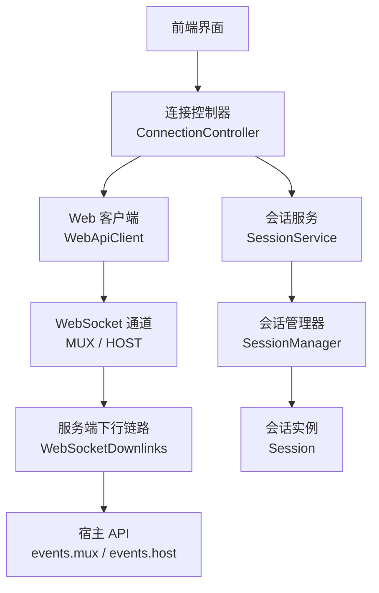
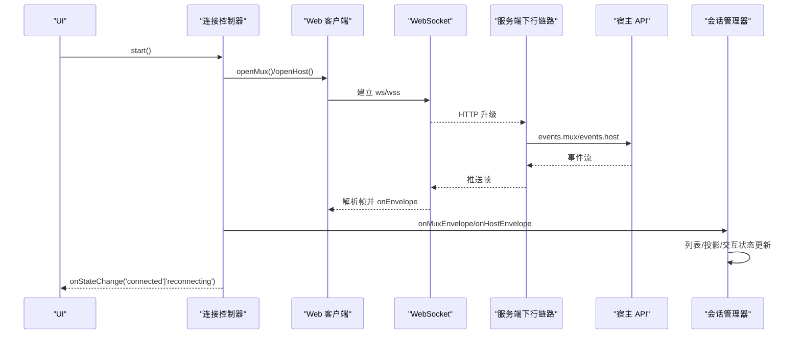
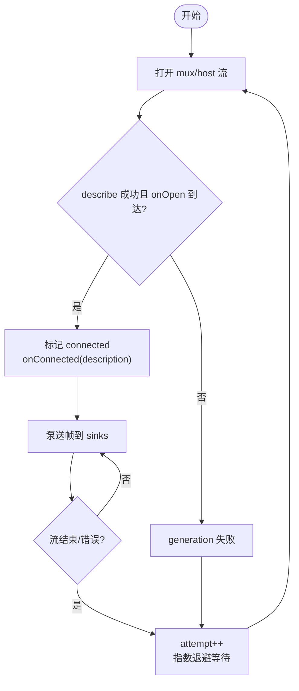
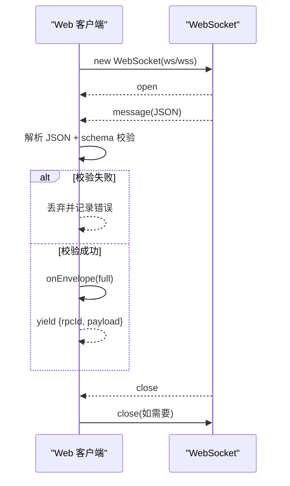
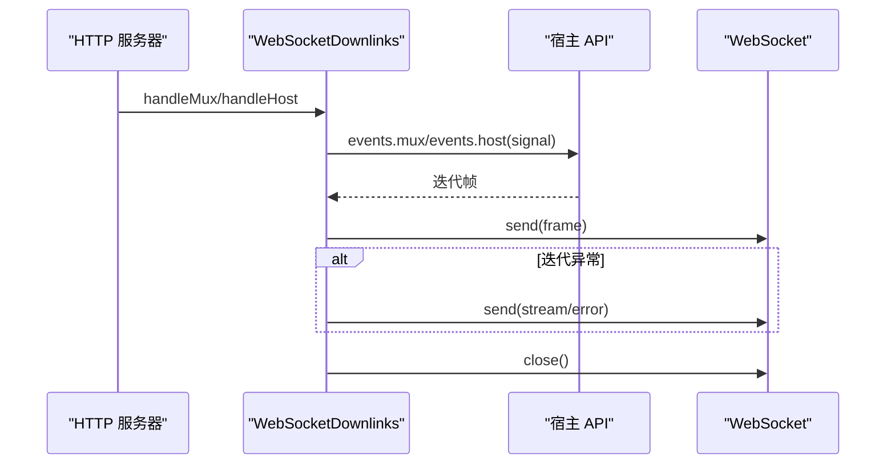
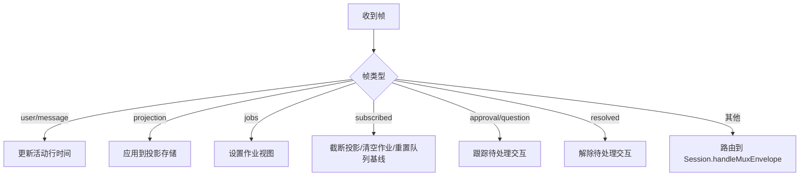
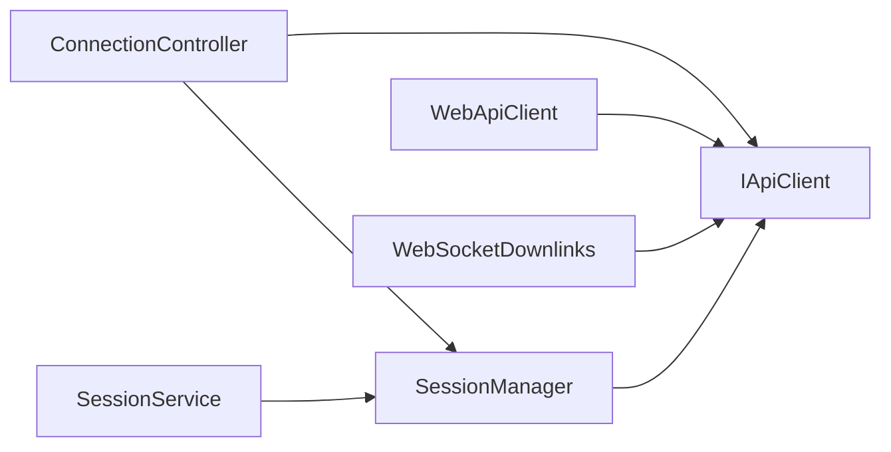

# 实时通信

<cite>
**本文引用的文件**
- [packages/client/connection/src/client/web-api-client.ts](file://packages/client/connection/src/client/web-api-client.ts)
- [packages/client/connection/src/client/connection.ts](file://packages/client/connection/src/client/connection.ts)
- [packages/client/connection/src/websocket-downlink.ts](file://packages/client/connection/src/websocket-downlink.ts)
- [packages/client/runtime/src/client/sessions/manager.ts](file://packages/client/runtime/src/client/sessions/manager.ts)
- [packages/client/runtime/src/client/sessions/service.ts](file://packages/client/runtime/src/client/sessions/service.ts)
- [packages/client/connection/src/client/api.ts](file://packages/client/connection/src/client/api.ts)
- [packages/api/gateway/src/client/index.ts](file://packages/api/gateway/src/client/index.ts)
- [packages/api/gateway/tests/gateway.client.spec.ts](file://packages/api/gateway/tests/gateway.client.spec.ts)
</cite>

## 目录
1. [简介](#简介)
2. [项目结构](#项目结构)
3. [核心组件](#核心组件)
4. [架构总览](#架构总览)
5. [详细组件分析](#详细组件分析)
6. [依赖分析](#依赖分析)
7. [性能考虑](#性能考虑)
8. [故障排除指南](#故障排除指南)
9. [结论](#结论)
10. [附录](#附录)

## 简介
本文件面向 Web 应用中的实时通信机制，围绕 WebSocket 连接管理、消息协议设计、状态同步、客户端 SDK 使用、事件监听与错误处理、流式响应、断线重连、消息队列管理等主题展开。文档基于仓库中客户端连接层、会话管理层与服务端下行链路实现进行系统化梳理，并提供架构图、流程图与排错建议，帮助读者快速理解并集成到实际项目中。

## 项目结构
实时通信相关代码主要分布在以下模块：
- 客户端连接层：负责建立和维护 WebSocket 双通道（mux/host），封装重试与状态机，提供统一的连接控制器。
- 服务端下行链路：负责 HTTP 升级、WebSocket 帧泵送、错误帧下发与资源清理。
- 会话管理层：负责将下行帧路由到具体 Session，维护列表快照、投影值、待处理交互与队列等。
- API 契约与类型：集中导出 RPC、Frame、Host/Mux Frame 等类型与工具函数，保证浏览器与宿主环境一致。

图表来源
- [packages/client/connection/src/client/connection.ts:54-203](file://packages/client/connection/src/client/connection.ts#L54-L203)
- [packages/client/connection/src/client/web-api-client.ts:14-101](file://packages/client/connection/src/client/web-api-client.ts#L14-L101)
- [packages/client/connection/src/websocket-downlink.ts:51-138](file://packages/client/connection/src/websocket-downlink.ts#L51-L138)
- [packages/client/runtime/src/client/sessions/service.ts:426-467](file://packages/client/runtime/src/client/sessions/service.ts#L426-L467)
- [packages/client/runtime/src/client/sessions/manager.ts:675-789](file://packages/client/runtime/src/client/sessions/manager.ts#L675-L789)

章节来源
- [packages/client/connection/src/client/connection.ts:54-203](file://packages/client/connection/src/client/connection.ts#L54-L203)
- [packages/client/connection/src/client/web-api-client.ts:14-101](file://packages/client/connection/src/client/web-api-client.ts#L14-L101)
- [packages/client/connection/src/websocket-downlink.ts:51-138](file://packages/client/connection/src/websocket-downlink.ts#L51-L138)
- [packages/client/runtime/src/client/sessions/service.ts:426-467](file://packages/client/runtime/src/client/sessions/service.ts#L426-L467)
- [packages/client/runtime/src/client/sessions/manager.ts:675-789](file://packages/client/runtime/src/client/sessions/manager.ts#L675-L789)

## 核心组件
- 连接控制器（ConnectionController）
  - 职责：启动/停止连接循环；维护“已连接/重连”粗粒度状态；指数退避重连；等待双通道就绪握手；隔离业务 sink 异常。
  - 关键行为：同时打开 mux 与 host 两个下行流；在 describe 成功且 onOpen 触发后认为连接就绪；失败时进入重连流程。
- Web 客户端（WebApiClient）
  - 职责：浏览器端 API 载体；HTTP 用于上行请求；为每个下游事件流建立独立 WebSocket；解析并派发帧。
  - 关键行为：根据协议自动切换 ws/wss；对畸形帧丢弃并记录；支持 AbortSignal 取消。
- 服务端下行链路（WebSocketDownlinks）
  - 职责：HTTP 升级；为 mux/host 分别创建 WebSocket；泵送宿主事件流至客户端；发送错误帧；关闭时清理所有 socket 与泵任务。
  - 关键行为：拒绝上游消息（downlink only）；统一错误包装为 stream/error 帧。
- 会话管理器（SessionManager）
  - 职责：接收来自连接层的 Mux/Host 帧；维护会话列表快照、投影值、子代理目录、后台作业；缓冲未实例化会话的应答型帧；处理审批/问答交互状态。
  - 关键行为：session/subscribed 作为新代际基线；pendingBuffers 缓存 approval/question/queue；handleConnected 触发重建。

章节来源
- [packages/client/connection/src/client/connection.ts:54-203](file://packages/client/connection/src/client/connection.ts#L54-L203)
- [packages/client/connection/src/client/web-api-client.ts:14-101](file://packages/client/connection/src/client/web-api-client.ts#L14-L101)
- [packages/client/connection/src/websocket-downlink.ts:51-138](file://packages/client/connection/src/websocket-downlink.ts#L51-L138)
- [packages/client/runtime/src/client/sessions/manager.ts:675-789](file://packages/client/runtime/src/client/sessions/manager.ts#L675-L789)

## 架构总览
下图展示从 UI 到宿主的端到端数据流，包括连接生命周期、双通道设计与帧分发路径。

图表来源
- [packages/client/connection/src/client/connection.ts:107-169](file://packages/client/connection/src/client/connection.ts#L107-L169)
- [packages/client/connection/src/client/web-api-client.ts:28-42](file://packages/client/connection/src/client/web-api-client.ts#L28-L42)
- [packages/client/connection/src/websocket-downlink.ts:64-82](file://packages/client/connection/src/websocket-downlink.ts#L64-L82)
- [packages/client/runtime/src/client/sessions/manager.ts:675-789](file://packages/client/runtime/src/client/sessions/manager.ts#L675-L789)

## 详细组件分析

### 连接控制器：断线重连与状态同步
- 连接生命周期
  - 启动 loop：递增 generation，创建 AbortController，并行打开 mux/host 流。
  - 严格就绪握手：并发执行 host.describe 与 streamsOpen Promise.race(streamsOpen, timeout)，成功后重置 attempt=0 并触发 onConnected。
  - 失败处理：任一 stream 结束或 describe 失败则 abort 当前 generation，进入重连。
- 指数退避
  - backoffDelay(attempt) = min(backoffMaxMs, backoffBaseMs * factor^(attempt-1))，并在区间内抖动。
- 状态去抖
  - emitState 仅当状态变化时通知 UI，避免频繁闪烁。

图表来源
- [packages/client/connection/src/client/connection.ts:107-169](file://packages/client/connection/src/client/connection.ts#L107-L169)
- [packages/client/connection/src/client/connection.ts:178-201](file://packages/client/connection/src/client/connection.ts#L178-L201)

章节来源
- [packages/client/connection/src/client/connection.ts:54-203](file://packages/client/connection/src/client/connection.ts#L54-L203)

### Web 客户端：WebSocket 流式读取与帧解析
- 双通道
  - openMux/openHost 返回 AsyncIterable<RpcRequest<MuxFrame|HostFrame>>，内部通过 readWebSocket 实现。
- 帧解析与容错
  - 仅接受文本帧；JSON 解析后按 schema 校验；失败丢弃并记录日志。
  - 每次解析成功调用 onEnvelope 以关联 rpcId。
- 取消与清理
  - 监听 AbortSignal，必要时关闭 socket；finally 中移除所有事件监听并关闭连接。

图表来源
- [packages/client/connection/src/client/web-api-client.ts:44-101](file://packages/client/connection/src/client/web-api-client.ts#L44-L101)

章节来源
- [packages/client/connection/src/client/web-api-client.ts:14-101](file://packages/client/connection/src/client/web-api-client.ts#L14-L101)

### 服务端下行链路：帧泵送与错误处理
- 升级与限制
  - 仅允许服务器向客户端推送；首次收到客户端消息即关闭（downlink only）。
- 泵送逻辑
  - 将宿主事件流逐帧写入 WebSocket；捕获异常并发送 stream/error 帧；finally 确保关闭与中止。
- 资源清理
  - close 方法终止所有 socket，等待 server 关闭与所有 pump 完成。

图表来源
- [packages/client/connection/src/websocket-downlink.ts:64-138](file://packages/client/connection/src/websocket-downlink.ts#L64-L138)

章节来源
- [packages/client/connection/src/websocket-downlink.ts:51-138](file://packages/client/connection/src/websocket-downlink.ts#L51-L138)

### 会话管理器：消息协议与状态同步
- 帧路由
  - session/event.user/message：更新列表活动行时间戳。
  - session/projection：写入 per-session 投影存储（如标题），供列表行读取。
  - session/jobs：全量覆盖后台作业视图。
  - session/subscribed：截断旧投影、清理 jobs、重置队列快照基线。
- 待处理交互与缓冲
  - pendingInteractions：跟踪 approval/question 的活跃态，驱动侧边栏提示。
  - pendingBuffers：在未实例化会话阶段缓存 approval/requested、question/requested、session/queue，实例化时回放。
- 连接就绪重建
  - handleConnected：触发列表刷新与窗口重建，确保状态一致性。

图表来源
- [packages/client/runtime/src/client/sessions/manager.ts:675-789](file://packages/client/runtime/src/client/sessions/manager.ts#L675-L789)
- [packages/client/runtime/src/client/sessions/manager.ts:878-899](file://packages/client/runtime/src/client/sessions/manager.ts#L878-L899)

章节来源
- [packages/client/runtime/src/client/sessions/manager.ts:675-789](file://packages/client/runtime/src/client/sessions/manager.ts#L675-L789)
- [packages/client/runtime/src/client/sessions/manager.ts:878-899](file://packages/client/runtime/src/client/sessions/manager.ts#L878-L899)

### 事件监听器与错误处理策略
- 事件分发
  - 客户端远程事件分发会快照订阅者并按注册顺序投递；若监听器抛出或返回被拒绝的 Promise，会被捕获并记录错误，不会导致未处理拒绝。
- 测试验证
  - 异步监听器抛错场景已通过测试覆盖，确保错误被安全捕获。

章节来源
- [packages/api/gateway/src/client/index.ts:130-156](file://packages/api/gateway/src/client/index.ts#L130-L156)
- [packages/api/gateway/tests/gateway.client.spec.ts:766-787](file://packages/api/gateway/tests/gateway.client.spec.ts#L766-L787)

## 依赖分析
- 连接层依赖
  - ConnectionController 依赖 IApiClient 提供的 events.mux/events.host 与 host.describe。
  - WebApiClient 依赖 AbstractApiClient 与 schema 校验器，以及路径常量。
  - WebSocketDownlinks 依赖 ws 库与宿主 ApiProxy。
- 会话层依赖
  - SessionManager 依赖 IApiClient 的 sessions/subagents 等接口，以及 transportError 工具。
  - SessionService 暴露 refresh/search/handle* 等方法，桥接 UI 与 SessionManager。

图表来源
- [packages/client/connection/src/client/connection.ts:61-75](file://packages/client/connection/src/client/connection.ts#L61-L75)
- [packages/client/connection/src/client/web-api-client.ts:14-42](file://packages/client/connection/src/client/web-api-client.ts#L14-L42)
- [packages/client/connection/src/websocket-downlink.ts:51-56](file://packages/client/connection/src/websocket-downlink.ts#L51-L56)
- [packages/client/runtime/src/client/sessions/service.ts:426-467](file://packages/client/runtime/src/client/sessions/service.ts#L426-L467)

章节来源
- [packages/client/connection/src/client/connection.ts:61-75](file://packages/client/connection/src/client/connection.ts#L61-L75)
- [packages/client/connection/src/client/web-api-client.ts:14-42](file://packages/client/connection/src/client/web-api-client.ts#L14-L42)
- [packages/client/connection/src/websocket-downlink.ts:51-56](file://packages/client/connection/src/websocket-downlink.ts#L51-L56)
- [packages/client/runtime/src/client/sessions/service.ts:426-467](file://packages/client/runtime/src/client/sessions/service.ts#L426-L467)

## 性能考虑
- 连接层
  - 指数退避+抖动降低雪崩风险；streamOpenTimeout 防止无 onOpen 的死锁。
  - sink 异常隔离，避免业务层错误影响连接泵。
- 会话层
  - 列表快照惰性构建与变更合并，减少重复渲染。
  - 投影存储 per-session 独立，避免跨会话污染；subscribed 基线重置避免陈旧数据。
  - pendingBuffers 按身份去重，避免重复回放。
- 传输层
  - 仅文本帧；schema 校验失败即丢弃，避免后续处理开销。
  - 服务端 downlink 单路泵送，异常时发送错误帧并关闭，避免僵尸连接。

[本节为通用指导，不直接分析具体文件]

## 故障排除指南
- 连接无法就绪
  - 检查 host.describe 是否成功；确认 mux/host 流的 onOpen 是否在超时前触发。
  - 关注 onStateChange 是否为 'reconnecting'，查看重连次数与退避间隔。
- 帧丢失或乱序
  - 确认 session/subscribed 是否到达；它用于重置队列与投影基线。
  - 对于未实例化会话，检查 pendingBuffers 是否正确回放。
- 事件监听器崩溃
  - 异步监听器抛错会被捕获并记录；检查控制台错误日志定位问题监听器。
- 服务端异常
  - 观察是否收到 stream/error 帧；该帧由 downlink 在泵送异常时发送。

章节来源
- [packages/client/connection/src/client/connection.ts:132-169](file://packages/client/connection/src/client/connection.ts#L132-L169)
- [packages/client/runtime/src/client/sessions/manager.ts:714-735](file://packages/client/runtime/src/client/sessions/manager.ts#L714-L735)
- [packages/api/gateway/src/client/index.ts:130-156](file://packages/api/gateway/src/client/index.ts#L130-L156)
- [packages/client/connection/src/websocket-downlink.ts:118-137](file://packages/client/connection/src/websocket-downlink.ts#L118-L137)

## 结论
本系统通过“连接控制器 + 双通道 WebSocket + 会话管理器”的分层设计，实现了高可用的实时通信：连接层负责健壮的重连与握手，传输层保障帧的正确解析与错误上报，会话层负责状态同步与交互管理。结合投影存储、待处理交互追踪与缓冲回放机制，系统在弱网与重启场景下仍能保持 UI 与后端状态一致。

[本节为总结性内容，不直接分析具体文件]

## 附录

### 客户端 SDK 使用要点
- 初始化连接控制器并传入 sinks：onMuxEnvelope、onHostEnvelope、onConnected、onStateChange。
- 通过 SessionService 暴露的方法刷新列表、搜索、处理帧与连接就绪重建。
- 使用 AbortSignal 控制流的生命周期，避免泄漏。

章节来源
- [packages/client/connection/src/client/connection.ts:61-89](file://packages/client/connection/src/client/connection.ts#L61-L89)
- [packages/client/runtime/src/client/sessions/service.ts:426-467](file://packages/client/runtime/src/client/sessions/service.ts#L426-L467)

### 安全考虑
- 仅允许服务器向客户端推送，首次客户端消息即拒绝。
- 所有帧经 schema 校验，非法帧丢弃并记录。
- 使用 ws/wss 自动适配 HTTPS 上下文，避免明文传输。

章节来源
- [packages/client/connection/src/websocket-downlink.ts:109-111](file://packages/client/connection/src/websocket-downlink.ts#L109-L111)
- [packages/client/connection/src/client/web-api-client.ts:61-73](file://packages/client/connection/src/client/web-api-client.ts#L61-L73)

### 调试方法
- 启用连接层日志：关注 reconnection 警告与 sink 异常日志。
- 监控会话管理器状态：列表 phase/state/error、投影值、jobs、pending interactions。
- 使用测试用例参考：事件监听器异常捕获行为可参考网关客户端测试。

章节来源
- [packages/client/connection/src/client/connection.ts:161-169](file://packages/client/connection/src/client/connection.ts#L161-L169)
- [packages/client/runtime/src/client/sessions/manager.ts:438-509](file://packages/client/runtime/src/client/sessions/manager.ts#L438-L509)
- [packages/api/gateway/tests/gateway.client.spec.ts:766-787](file://packages/api/gateway/tests/gateway.client.spec.ts#L766-L787)