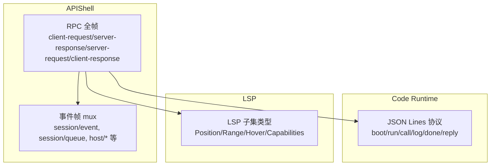
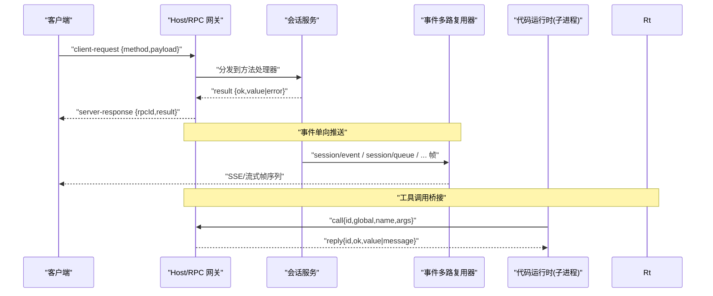
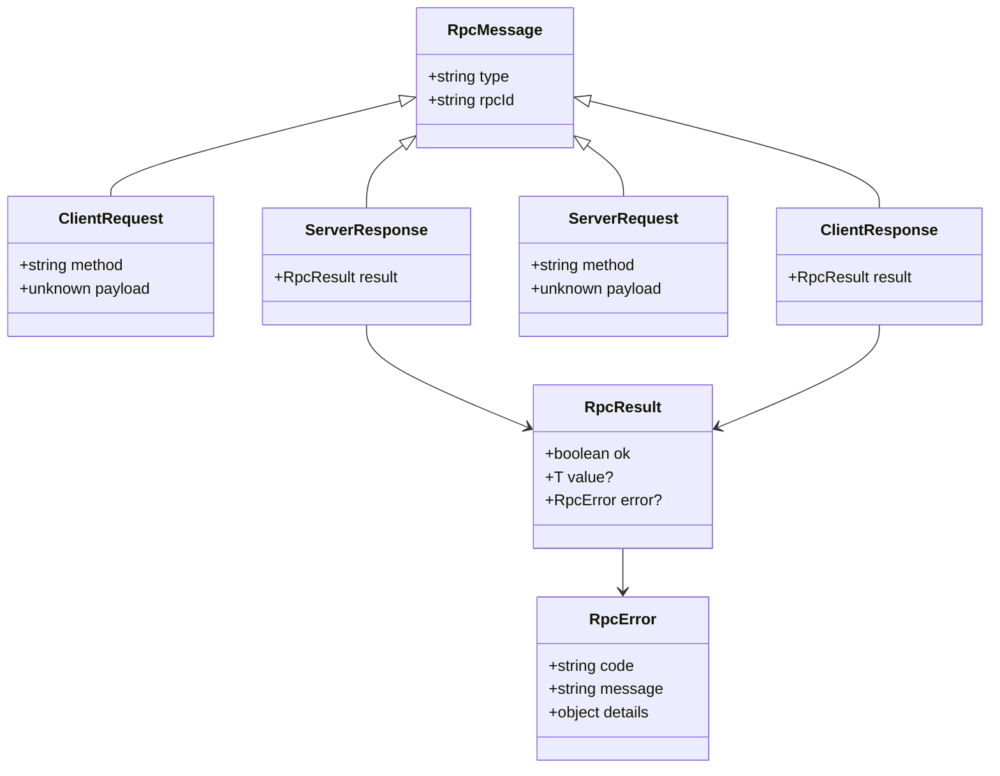
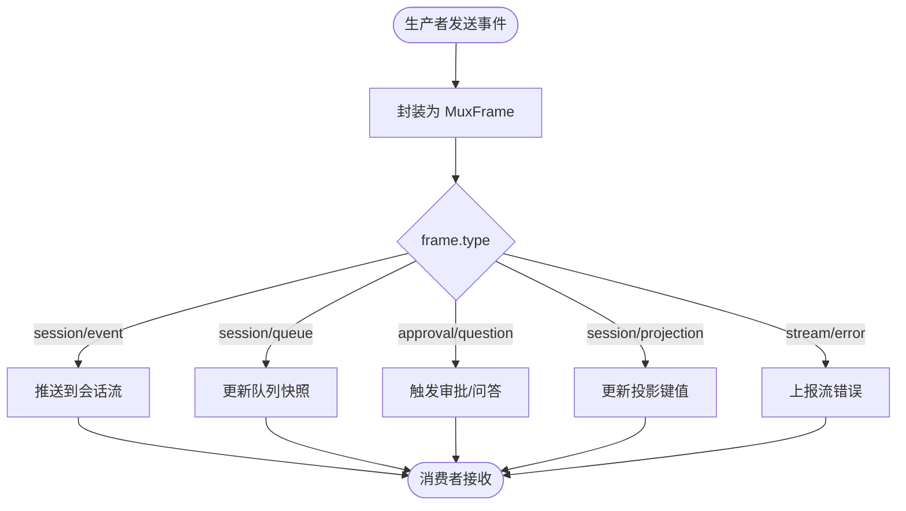
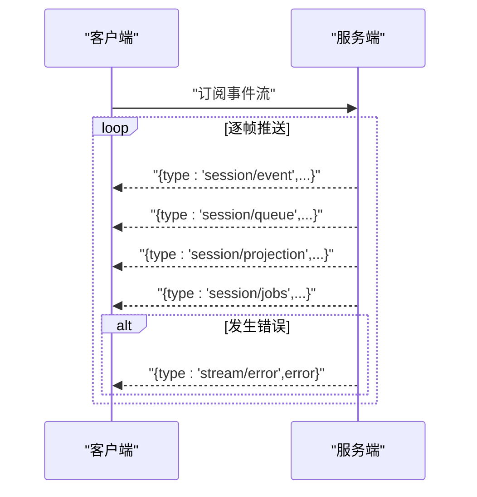
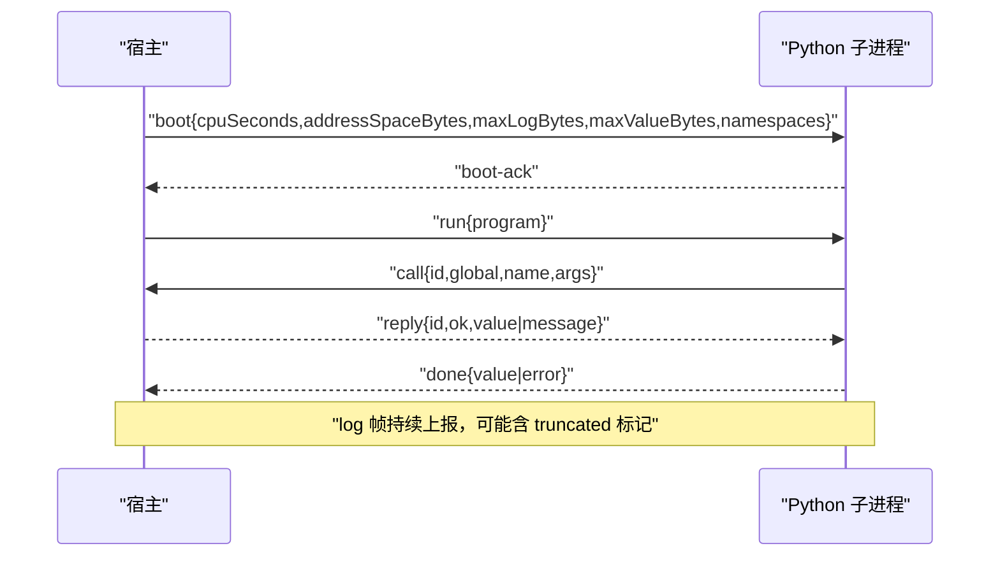
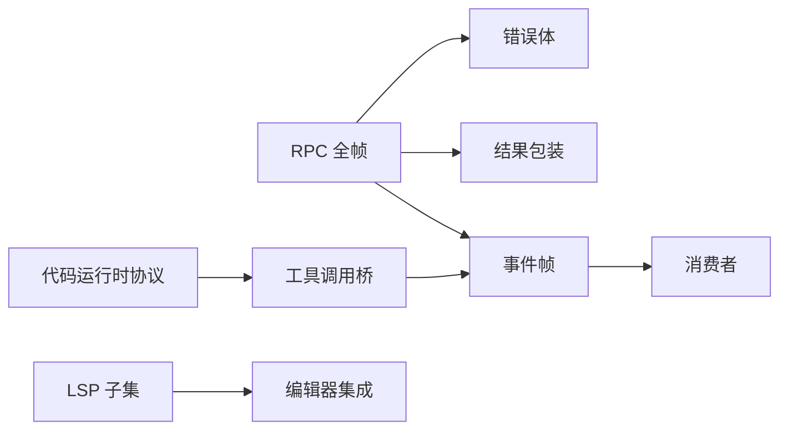

# 消息协议设计

<cite>
**本文引用的文件**
- [rpc.schema.ts](file://packages/host/apiproxy/src/api/rpc.schema.ts)
- [rpc-schemas.spec.ts](file://packages/host/apiproxy/tests/rpc-schemas.spec.ts)
- [events.schema.ts](file://packages/host/apiproxy/src/api/events.schema.ts)
- [sessions.schema.ts](file://packages/host/apiproxy/src/api/sessions.schema.ts)
- [protocol.ts（代码运行时）](file://packages/code-runtime/code-runtime-python/src/protocol.ts)
- [protocol.ts（LSP）](file://packages/lsp/lsp-stdio/src/protocol.ts)
- [client-handler.spec.ts](file://packages/host/apiproxy/tests/client-handler.spec.ts)
- [api-proxy-projections.spec.ts](file://packages/host/apiproxy/tests/api-proxy-projections.spec.ts)
</cite>

## 目录
1. [简介](#简介)
2. [项目结构](#项目结构)
3. [核心组件](#核心组件)
4. [架构总览](#架构总览)
5. [详细组件分析](#详细组件分析)
6. [依赖关系分析](#依赖关系分析)
7. [性能考虑](#性能考虑)
8. [故障排查指南](#故障排查指南)
9. [结论](#结论)
10. [附录：消息示例与验证规则](#附录消息示例与验证规则)

## 简介
本文件系统化梳理了仓库中的消息协议设计，覆盖以下方面：
- 消息格式规范、类型定义与序列化机制
- 请求-响应模式、事件发布订阅模式与流式数据传输
- 消息路由、优先级处理与批量传输优化
- 协议版本管理、向后兼容性与扩展机制
- 完整的消息示例与验证规则

该协议体系由多段“线协议”组成：统一的 RPC 全帧格式、领域事件帧、跨进程 JSON Lines 协议以及 LSP 子集协议。各部分通过严格的 Zod Schema 校验与双阶段解析保证安全性与可扩展性。

## 项目结构
- 统一 RPC 全帧与错误体定义位于 apiproxy 的 schema 层，提供四象限消息（客户端请求/响应、服务端请求/响应）与结果包装。
- 领域事件与多路复用帧在 events.schema 中集中描述，承载会话事件、审批、问题、队列快照、投影等。
- 代码运行时（Python 子进程）使用 JSON Lines 协议在固定 fd 上交换 boot/run/call/log/done/reply 帧，具备严格的安全边界与预算限制。
- LSP 子集协议仅声明必要的类型，用于能力协商与轻量交互。

**图表来源**
- [rpc.schema.ts:97-139](file://packages/host/apiproxy/src/api/rpc.schema.ts#L97-L139)
- [events.schema.ts](file://packages/host/apiproxy/src/api/events.schema.ts)
- [protocol.ts（代码运行时）:46-154](file://packages/code-runtime/code-runtime-python/src/protocol.ts#L46-L154)
- [protocol.ts（LSP）:9-81](file://packages/lsp/lsp-stdio/src/protocol.ts#L9-L81)

**章节来源**
- [rpc.schema.ts:1-140](file://packages/host/apiproxy/src/api/rpc.schema.ts#L1-L140)
- [events.schema.ts](file://packages/host/apiproxy/src/api/events.schema.ts)
- [protocol.ts（代码运行时）:1-657](file://packages/code-runtime/code-runtime-python/src/protocol.ts#L1-L657)
- [protocol.ts（LSP）:1-81](file://packages/lsp/lsp-stdio/src/protocol.ts#L1-L81)

## 核心组件
- 统一 RPC 全帧：以 type 字段区分四种消息；payload/result.value 保持宽类型，业务层进行二次解析；结果采用 ok/value 或 ok/error 的统一包装；支持回执 receipt。
- 错误模型：基于 code 分发的错误体，每个分支附带强约束 details。
- 事件多路复用：以 frame.type 区分不同事件，包含会话事件、审批、问题、队列、投影、作业、主机事件与流错误。
- 代码运行时协议：fd 3 上的 JSON Lines，严格校验入站帧，预算控制（CPU、内存、日志、返回值大小），安全地桥接工具调用。
- LSP 子集：最小必要类型集合，用于能力协商与轻量数据交换。

**章节来源**
- [rpc.schema.ts:33-139](file://packages/host/apiproxy/src/api/rpc.schema.ts#L33-L139)
- [events.schema.ts](file://packages/host/apiproxy/src/api/events.schema.ts)
- [protocol.ts（代码运行时）:46-154](file://packages/code-runtime/code-runtime-python/src/protocol.ts#L46-L154)
- [protocol.ts（LSP）:9-81](file://packages/lsp/lsp-stdio/src/protocol.ts#L9-L81)

## 架构总览
下图展示请求-响应、事件推送与流式传输的整体交互：

**图表来源**
- [rpc.schema.ts:97-139](file://packages/host/apiproxy/src/api/rpc.schema.ts#L97-L139)
- [events.schema.ts](file://packages/host/apiproxy/src/api/events.schema.ts)
- [protocol.ts（代码运行时）:74-154](file://packages/code-runtime/code-runtime-python/src/protocol.ts#L74-L154)

## 详细组件分析

### 统一 RPC 全帧与结果包装
- 四象限消息：client-request、server-response、server-request、client-response，均以 type 区分。
- 标识符：rpcId 为不透明回显令牌，不做长度限制，便于关联错误报告。
- 结果包装：rpcResultSchema(value) 返回 {ok:true,value} 或 {ok:false,error} 两种分支。
- 错误体：rpcErrorSchema 按 code 分发，每个分支要求对应的 details 字段。
- 回执：rpcReceiptSchema 表示接收方是否接受（accepted）及拒绝原因。

**图表来源**
- [rpc.schema.ts:97-139](file://packages/host/apiproxy/src/api/rpc.schema.ts#L97-L139)
- [rpc.schema.ts:33-90](file://packages/host/apiproxy/src/api/rpc.schema.ts#L33-L90)

**章节来源**
- [rpc.schema.ts:25-139](file://packages/host/apiproxy/src/api/rpc.schema.ts#L25-L139)
- [rpc-schemas.spec.ts:41-135](file://packages/host/apiproxy/tests/rpc-schemas.spec.ts#L41-L135)

### 事件多路复用与发布订阅
- 事件帧以 type 区分，如 session/event、session/subscribed、approval/requested、question/requested、session/queue、session/projection、session/jobs、stream/error、host/* 等。
- 事件携带 sessionId、seq/time、data 等元信息，确保有序与可追溯。
- 消费端通过订阅接口接收事件，未订阅的事件被静默丢弃。

**图表来源**
- [events.schema.ts](file://packages/host/apiproxy/src/api/events.schema.ts)
- [rpc-schemas.spec.ts:442-536](file://packages/host/apiproxy/tests/rpc-schemas.spec.ts#L442-L536)

**章节来源**
- [events.schema.ts](file://packages/host/apiproxy/src/api/events.schema.ts)
- [rpc-schemas.spec.ts:442-536](file://packages/host/apiproxy/tests/rpc-schemas.spec.ts#L442-L536)

### 流式数据传输（SSE/流式帧）
- 客户端可通过流式接口订阅事件，服务端按序 yield 帧，跳过注释前导行。
- 流中包含多种帧类型，包括事件、队列、投影、作业与错误帧。
- 流错误通过 stream/error 帧表达，便于上层快速失败。

**图表来源**
- [client-handler.spec.ts:445-464](file://packages/host/apiproxy/tests/client-handler.spec.ts#L445-L464)
- [events.schema.ts](file://packages/host/apiproxy/src/api/events.schema.ts)

**章节来源**
- [client-handler.spec.ts:445-464](file://packages/host/apiproxy/tests/client-handler.spec.ts#L445-L464)
- [events.schema.ts](file://packages/host/apiproxy/src/api/events.schema.ts)

### 代码运行时协议（JSON Lines）
- 通道：fd 3，每行一个 JSON 对象，stdout/stderr 留给程序输出。
- 帧类型：boot、run、boot-ack、call、log、done、reply。
- 安全与预算：CPU/地址空间/日志字节/返回值字节上限；入站帧严格重建并校验，拒绝非预期字段与非法数值。
- 工具调用：子进程发起 call，宿主回复 reply；done 携带 value 或 error，且需满足 lossless JSON 与字节预算。

**图表来源**
- [protocol.ts（代码运行时）:46-154](file://packages/code-runtime/code-runtime-python/src/protocol.ts#L46-L154)
- [protocol.ts（代码运行时）:594-657](file://packages/code-runtime/code-runtime-python/src/protocol.ts#L594-L657)

**章节来源**
- [protocol.ts（代码运行时）:1-657](file://packages/code-runtime/code-runtime-python/src/protocol.ts#L1-L657)

### LSP 子集协议
- 仅声明必要的类型：位置、范围、位置链接、悬停内容、文本同步选项与服务端能力。
- 用于初始化能力协商与轻量数据交换，翻译层将外部负载归一化为内部闭联合。

**章节来源**
- [protocol.ts（LSP）:9-81](file://packages/lsp/lsp-stdio/src/protocol.ts#L9-L81)

## 依赖关系分析
- RPC 全帧依赖错误体与结果包装；业务层通过方法名进行二次解析。
- 事件帧与 RPC 解耦，作为单向推送通道，供 UI/控制台消费。
- 代码运行时协议独立于 RPC，但通过宿主桥接到工具调用，最终影响会话状态与事件。
- LSP 协议与主流程解耦，仅用于编辑器集成场景。

**图表来源**
- [rpc.schema.ts:33-139](file://packages/host/apiproxy/src/api/rpc.schema.ts#L33-L139)
- [events.schema.ts](file://packages/host/apiproxy/src/api/events.schema.ts)
- [protocol.ts（代码运行时）:74-154](file://packages/code-runtime/code-runtime-python/src/protocol.ts#L74-L154)
- [protocol.ts（LSP）:9-81](file://packages/lsp/lsp-stdio/src/protocol.ts#L9-L81)

**章节来源**
- [rpc.schema.ts:33-139](file://packages/host/apiproxy/src/api/rpc.schema.ts#L33-L139)
- [events.schema.ts](file://packages/host/apiproxy/src/api/events.schema.ts)
- [protocol.ts（代码运行时）:74-154](file://packages/code-runtime/code-runtime-python/src/protocol.ts#L74-L154)
- [protocol.ts（LSP）:9-81](file://packages/lsp/lsp-stdio/src/protocol.ts#L9-L81)

## 性能考虑
- 双阶段解析：全帧层只做轻量校验，业务层再按方法解析 payload/value，降低通用路径开销。
- 预算控制：代码运行时对 CPU、内存、日志与返回值设置严格上限，避免恶意或失控负载导致资源耗尽。
- 流式推送：事件与队列快照以帧为单位增量推送，减少整批重传成本。
- 批量优化：队列快照与投影更新适合批量合并后推送，降低网络与渲染压力。
- 安全扫描：入站帧重建与字段白名单，防止注入与畸形负载造成额外分配。

[本节为通用指导，无需特定文件引用]

## 故障排查指南
- 解析失败：检查 type 是否在允许集合内；payload/value 是否符合业务层 Schema。
- 错误码定位：根据 rpcErrorSchema 的 code 分支定位问题域（会话、工作区、命令、凭据等）。
- 流错误：关注 stream/error 帧，结合上下文判断是上游错误或下游消费者异常。
- 代码运行时异常：done.error 的 kind 指示异常类型（exception/invalid-output/output-limit），优先检查日志与预算。
- 回执拒绝：rpcReceiptSchema.reason 为 not-pending 或 bad-response 时，检查请求时序与载荷合法性。

**章节来源**
- [rpc.schema.ts:33-139](file://packages/host/apiproxy/src/api/rpc.schema.ts#L33-L139)
- [rpc-schemas.spec.ts:58-135](file://packages/host/apiproxy/tests/rpc-schemas.spec.ts#L58-L135)
- [protocol.ts（代码运行时）:594-657](file://packages/code-runtime/code-runtime-python/src/protocol.ts#L594-L657)

## 结论
该协议体系通过统一的全帧格式、严格的错误模型与事件多路复用，实现了高内聚、低耦合的消息通信。代码运行时的 JSON Lines 协议提供了安全的工具调用边界，LSP 子集则支撑编辑器集成。整体设计强调可扩展性（开放字符串事件名、业务层二次解析）、向后兼容性（宽类型与可选字段）与高性能（流式与预算控制）。

[本节为总结性内容，无需特定文件引用]

## 附录：消息示例与验证规则
- 四象限消息示例（来自测试断言）：
  - 客户端请求：{type:"client-request", rpcId:"r1", method:"session.list", payload:{}}
  - 服务端响应：{type:"server-response", rpcId:"r1", result:{ok:true,value:1}}
  - 服务端请求：{type:"server-request", rpcId:"r2", method:"session/event", payload:{a:1}}
  - 客户端响应：{type:"client-response", rpcId:"r2", result:{ok:true,value:null}}
- 事件帧示例（来自测试断言）：
  - 会话事件：{type:"session/event", sessionId:"s", event:{type:"t", seq:0, time:1, data:null}}
  - 队列快照：{type:"session/queue", sessionId:"s", items:[{id:"m1", placement:"queued", message:{...}}]}
  - 审批请求：{type:"approval/requested", sessionId:"s", approvalId:"a", toolName:"bash", callId:"c", reason:"r"}
  - 问题请求：{type:"question/requested", sessionId:"s", questions:[{id:"q", question:"Q?", options:[{label:"L"}], multiSelect:true}]}
  - 投影更新：{type:"session/projection", sessionId:"s", key:"todos", value:[{content:"x", status:"pending"}], seq:7}
  - 作业列表：{type:"session/jobs", sessionId:"s", jobs:[{id:"bash-1", kind:"bash", label:"pnpm run build", status:"running", startedAt:5}]}
  - 流错误：{type:"stream/error", error:{code:"internal", message:"m", details:{}}}
- 代码运行时帧示例（来自协议定义）：
  - 启动：{type:"boot", cpuSeconds:10, addressSpaceBytes:268435456, maxLogBytes:1048576, maxValueBytes:1048576, namespaces:[...]}
  - 运行：{type:"run", program:"..."}
  - 调用：{type:"call", id:1, global:"tools", name:"bash", args:["ls"]}
  - 日志：{type:"log", text:"...", truncated?:true}
  - 完成：{type:"done", value:{"result":true}} 或 {type:"done", error:{kind:"exception", message:"..."}}
  - 回复：{type:"reply", id:1, ok:true, value:"output"} 或 {type:"reply", id:1, ok:false, message:"..."}
- 验证规则要点：
  - 全帧 type 必须属于允许集合；缺失必需字段会失败。
  - 结果包装必须为 ok/value 或 ok/error 之一，禁止混合。
  - 错误体必须匹配 code 分支并携带 required details。
  - 事件帧的 closed 集合（如 job status、placement）必须合法；未知值将被拒绝。
  - 代码运行时入站帧会被重建并严格校验，非法字段或数值将被丢弃或拒绝。

**章节来源**
- [rpc-schemas.spec.ts:103-135](file://packages/host/apiproxy/tests/rpc-schemas.spec.ts#L103-L135)
- [rpc-schemas.spec.ts:442-536](file://packages/host/apiproxy/tests/rpc-schemas.spec.ts#L442-L536)
- [protocol.ts（代码运行时）:46-154](file://packages/code-runtime/code-runtime-python/src/protocol.ts#L46-L154)
- [protocol.ts（代码运行时）:594-657](file://packages/code-runtime/code-runtime-python/src/protocol.ts#L594-L657)