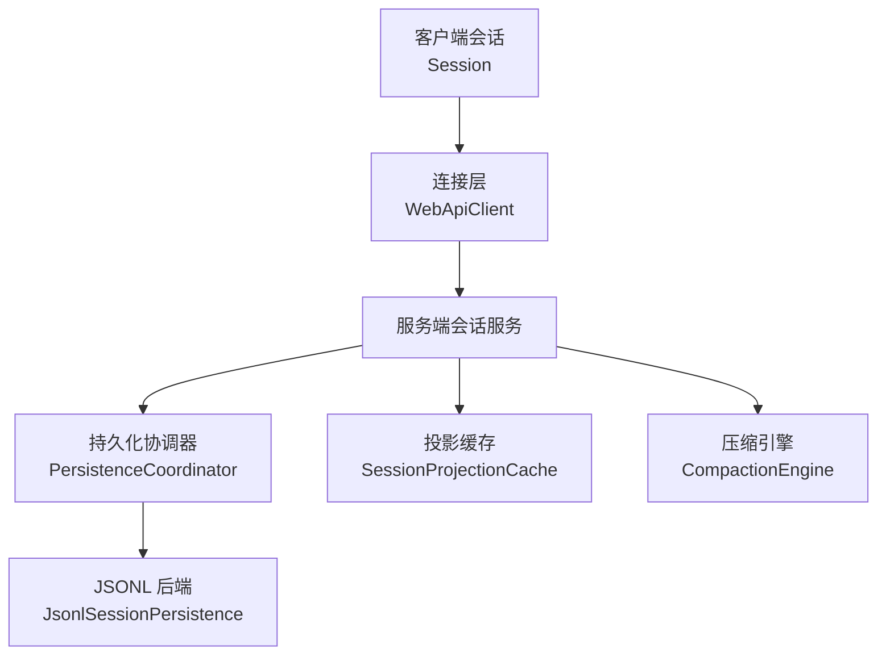
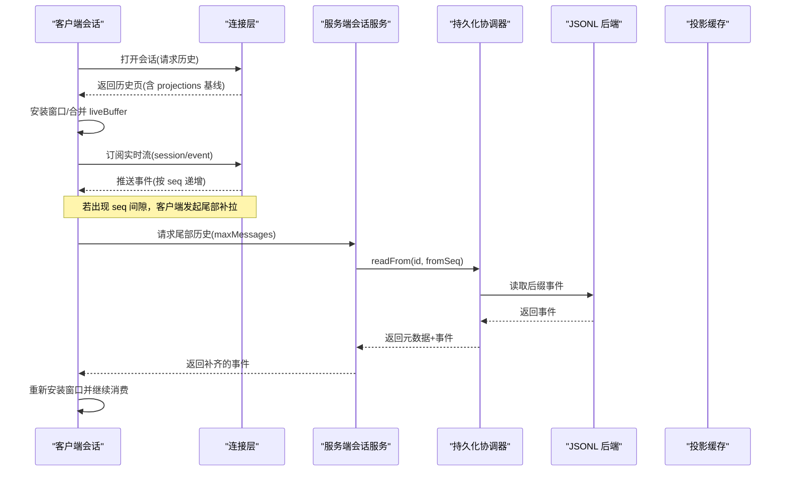
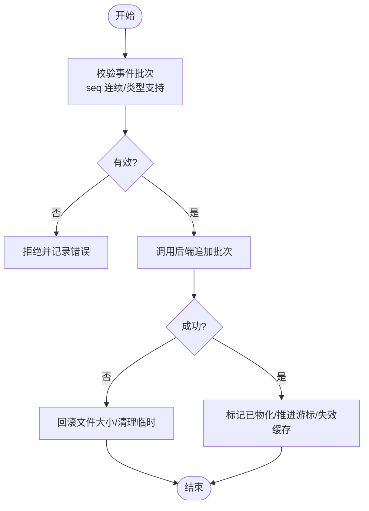
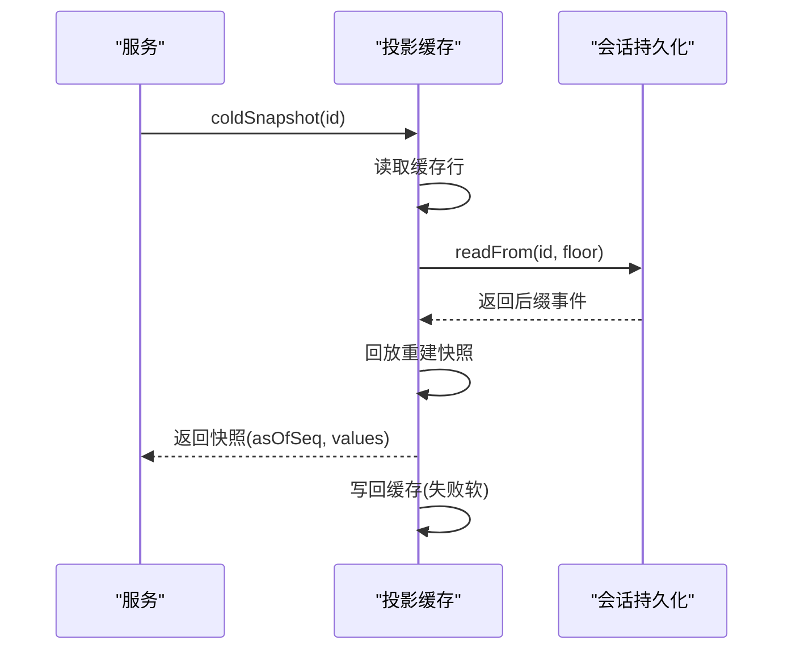
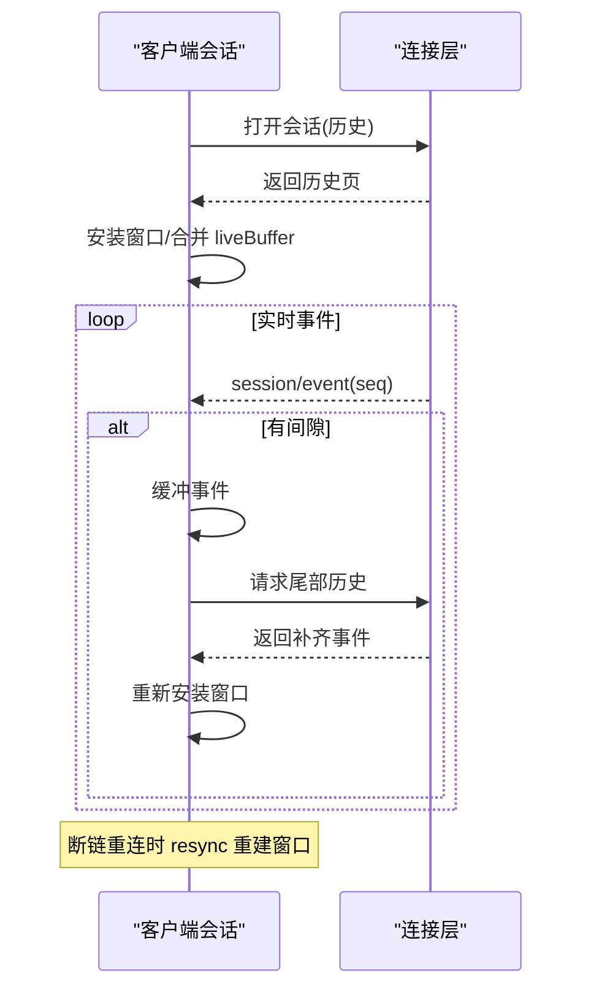
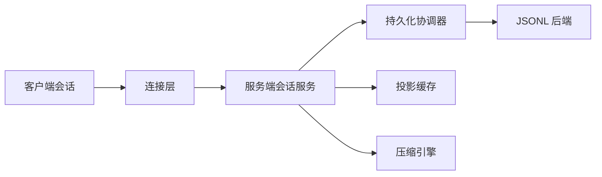

# 状态同步机制

<cite>
**本文引用的文件**
- [packages/session/session-persistence/src/coordinator.ts](file://packages/session/session-persistence/src/coordinator.ts)
- [packages/session/session-persistence-jsonl/src/index.ts](file://packages/session/session-persistence-jsonl/src/index.ts)
- [packages/session/session-projection-cache/src/index.ts](file://packages/session/session-projection-cache/src/index.ts)
- [packages/client/runtime/src/client/sessions/session.ts](file://packages/client/runtime/src/client/sessions/session.ts)
- [packages/client/connection/src/client/web-api-client.ts](file://packages/client/connection/src/client/web-api-client.ts)
- [packages/compaction/compaction/src/index.ts](file://packages/compaction/compaction/src/index.ts)
</cite>

## 目录
1. [简介](#简介)
2. [项目结构](#项目结构)
3. [核心组件](#核心组件)
4. [架构总览](#架构总览)
5. [详细组件分析](#详细组件分析)
6. [依赖关系分析](#依赖关系分析)
7. [性能考虑](#性能考虑)
8. [故障排查指南](#故障排查指南)
9. [结论](#结论)
10. [附录：示例与最佳实践](#附录示例与最佳实践)

## 简介
本文件系统性阐述客户端与服务端之间的状态同步机制，覆盖一致性保证、冲突解决策略、增量更新、乐观更新与回滚、最终一致性模型、状态压缩、差异计算、缓存策略、状态迁移、版本管理以及调试工具使用。文档基于仓库中的会话持久化、投影缓存、客户端会话窗口与连接层实现进行说明，并提供可视化图示与可操作建议。

## 项目结构
该系统的状态同步由以下关键模块协作完成：
- 服务端持久化协调器：负责事件追加、序列化、崩溃修复、准备态与加载态的编排。
- JSONL 后端：提供按会话的追加日志、压缩（Zstandard）、断尾恢复与原始内容读取。
- 投影缓存：对已注册投影单元的状态做持久化检查点，加速冷启动与回放。
- 客户端会话：维护事件窗口、历史分页、实时流拼接、断链重连与间隙修复。
- 连接层：通过 WebSocket 建立多路复用与主机通道，解析帧并投递到会话。
- 压缩引擎：在需要时把历史片段折叠为摘要节点，减少上下文体积。

**图表来源**
- [packages/client/runtime/src/client/sessions/session.ts:368-442](file://packages/client/runtime/src/client/sessions/session.ts#L368-L442)
- [packages/client/connection/src/client/web-api-client.ts:28-42](file://packages/client/connection/src/client/web-api-client.ts#L28-L42)
- [packages/session/session-persistence/src/coordinator.ts:575-710](file://packages/session/session-persistence/src/coordinator.ts#L575-L710)
- [packages/session/session-persistence-jsonl/src/index.ts:121-200](file://packages/session/session-persistence-jsonl/src/index.ts#L121-L200)
- [packages/session/session-projection-cache/src/index.ts:62-152](file://packages/session/session-projection-cache/src/index.ts#L62-L152)
- [packages/compaction/compaction/src/index.ts:87-170](file://packages/compaction/compaction/src/index.ts#L87-L170)

**章节来源**
- [packages/session/session-persistence/src/coordinator.ts:575-710](file://packages/session/session-persistence/src/coordinator.ts#L575-L710)
- [packages/session/session-persistence-jsonl/src/index.ts:121-200](file://packages/session/session-persistence-jsonl/src/index.ts#L121-L200)
- [packages/session/session-projection-cache/src/index.ts:62-152](file://packages/session/session-projection-cache/src/index.ts#L62-L152)
- [packages/client/runtime/src/client/sessions/session.ts:368-442](file://packages/client/runtime/src/client/sessions/session.ts#L368-L442)
- [packages/client/connection/src/client/web-api-client.ts:28-42](file://packages/client/connection/src/client/web-api-client.ts#L28-L42)
- [packages/compaction/compaction/src/index.ts:87-170](file://packages/compaction/compaction/src/index.ts#L87-L170)

## 核心组件
- 持久化协调器：以会话 ID 为单位串行化写路径，确保追加顺序与连续性；支持准备态、加载态、检查态与热/冷路径的统一编排；处理格式版本拒绝与损坏检测。
- JSONL 后端：按会话存储追加式日志，支持 Zstandard 压缩、断尾恢复、原始内容读取、原子发布与回滚。
- 投影缓存：在服务端对投影状态做节流写入与强制落盘点（回合结束、会话销毁），冷读时从缓存行 + 持久化尾部回放快速重建。
- 客户端会话：维护事件窗口、历史分页、实时流拼接、断链重连、间隙修复与队列镜像；通过订阅帧驱动 UI 快照。
- 连接层：每个下行流一个 WebSocket，解析帧并分发；支持 abort 信号关闭。
- 压缩引擎：根据压力或上下文溢出触发压缩，将一段表面节点替换为摘要节点，保持事务锁与幂等性。

**章节来源**
- [packages/session/session-persistence/src/coordinator.ts:575-710](file://packages/session/session-persistence/src/coordinator.ts#L575-L710)
- [packages/session/session-persistence-jsonl/src/index.ts:121-200](file://packages/session/session-persistence-jsonl/src/index.ts#L121-L200)
- [packages/session/session-projection-cache/src/index.ts:62-152](file://packages/session/session-projection-cache/src/index.ts#L62-L152)
- [packages/client/runtime/src/client/sessions/session.ts:368-442](file://packages/client/runtime/src/client/sessions/session.ts#L368-L442)
- [packages/client/connection/src/client/web-api-client.ts:28-42](file://packages/client/connection/src/client/web-api-client.ts#L28-L42)
- [packages/compaction/compaction/src/index.ts:87-170](file://packages/compaction/compaction/src/index.ts#L87-L170)

## 架构总览
下图展示一次“打开会话”的端到端流程：客户端拉取历史页，安装窗口，检测基线是否覆盖到最新序列，必要时补拉尾部；随后接收实时事件，遇到间隙则自动修补。

**图表来源**
- [packages/client/runtime/src/client/sessions/session.ts:618-669](file://packages/client/runtime/src/client/sessions/session.ts#L618-L669)
- [packages/client/runtime/src/client/sessions/session.ts:683-728](file://packages/client/runtime/src/client/sessions/session.ts#L683-L728)
- [packages/session/session-persistence-jsonl/src/index.ts:196-200](file://packages/session/session-persistence-jsonl/src/index.ts#L196-L200)
- [packages/session/session-projection-cache/src/index.ts:166-197](file://packages/session/session-projection-cache/src/index.ts#L166-L197)

## 详细组件分析

### 持久化协调器（一致性、冲突与回滚）
- 一致性保证
  - 每会话写路径串行化，避免并发写入交错。
  - 追加前校验事件 seq 连续性与类型支持，拒绝未知或废弃事件。
  - 首次 append 原子化创建会话文件头与首批事件，失败不留下半产物。
- 冲突解决
  - 重复 id 创建被拒绝；已有持久化日志必须 load/resume。
  - 外部写入导致 revision 变化时，准备/加载会重试直至稳定。
- 回滚机制
  - 追加失败时回滚文件大小至写入前，避免产生重复 seq。
  - 断尾恢复：截断不完整帧，附加合成关闭事件，保证日志完整性。
- 版本管理与迁移
  - 格式版本不支持时明确拒绝，提示升级 harness。
  - 旧版事件形状在加载时迁移到当前形态，保证回放确定性。

**图表来源**
- [packages/session/session-persistence/src/coordinator.ts:669-710](file://packages/session/session-persistence/src/coordinator.ts#L669-L710)
- [packages/session/session-persistence-jsonl/src/index.ts:646-701](file://packages/session/session-persistence-jsonl/src/index.ts#L646-L701)

**章节来源**
- [packages/session/session-persistence/src/coordinator.ts:575-710](file://packages/session/session-persistence/src/coordinator.ts#L575-L710)
- [packages/session/session-persistence-jsonl/src/index.ts:646-701](file://packages/session/session-persistence-jsonl/src/index.ts#L646-L701)

### JSONL 后端（状态压缩、断尾恢复与原始内容）
- 状态压缩
  - 默认使用 Zstandard 分帧压缩；列表仅读取首行头，避免全量解码。
  - 大文本块可选择打包为紧凑行以减少体积。
- 断尾恢复
  - 扫描完整帧，解析出完整记录；最后一帧若破损，尝试恢复部分明文并记录标记，后续由协调器截断并补充关闭事件。
- 原始内容
  - 提供 readRaw 返回物理编码后的原文（包含 packed 行、键序、换行），便于诊断与比对。

**章节来源**
- [packages/session/session-persistence-jsonl/src/index.ts:208-282](file://packages/session/session-persistence-jsonl/src/index.ts#L208-L282)
- [packages/session/session-persistence-jsonl/src/index.ts:310-419](file://packages/session/session-persistence-jsonl/src/index.ts#L310-L419)
- [packages/session/session-persistence-jsonl/src/index.ts:618-701](file://packages/session/session-persistence-jsonl/src/index.ts#L618-L701)

### 投影缓存（最终一致性与冷读优化）
- 最终一致性
  - 缓存行可能陈旧但不会错误；每次冷读都会结合持久化尾部回放重建，保证最终一致。
  - 写路径采用节流（计数/时间）与强制落盘点（回合结束、会话销毁）。
- 差异计算与缓存策略
  - 冷读时先读缓存行，再按最低水位 watermark 从持久化 readFrom 尾部回放，得到新快照后写回缓存。
  - 身份匹配保护：不同生命周期或缩容日志会丢弃旧行，避免污染。

**图表来源**
- [packages/session/session-projection-cache/src/index.ts:166-197](file://packages/session/session-projection-cache/src/index.ts#L166-L197)
- [packages/session/session-projection-cache/src/index.ts:201-239](file://packages/session/session-projection-cache/src/index.ts#L201-L239)

**章节来源**
- [packages/session/session-projection-cache/src/index.ts:62-152](file://packages/session/session-projection-cache/src/index.ts#L62-L152)
- [packages/session/session-projection-cache/src/index.ts:166-197](file://packages/session/session-projection-cache/src/index.ts#L166-L197)
- [packages/session/session-projection-cache/src/index.ts:201-239](file://packages/session/session-projection-cache/src/index.ts#L201-L239)

### 客户端会话（增量更新、乐观更新与回滚）
- 增量更新
  - 历史分页拉取后安装窗口；实时事件按 seq 追加，重叠 seq 直接丢弃。
  - 检测到间隙时，缓冲事件并请求尾部补齐，完成后统一安装窗口。
- 乐观更新
  - 本地维护 pending 交互与队列镜像，收到确认后再移除；断链重连时通过 resync 重建窗口并重新下发等待。
- 回滚机制
  - 断链重连时清空 openPromise/openState，重置 baseSeq 与视图，重新执行 open；无效的历史请求结果被丢弃。

**图表来源**
- [packages/client/runtime/src/client/sessions/session.ts:368-442](file://packages/client/runtime/src/client/sessions/session.ts#L368-L442)
- [packages/client/runtime/src/client/sessions/session.ts:618-728](file://packages/client/runtime/src/client/sessions/session.ts#L618-L728)

**章节来源**
- [packages/client/runtime/src/client/sessions/session.ts:368-442](file://packages/client/runtime/src/client/sessions/session.ts#L368-L442)
- [packages/client/runtime/src/client/sessions/session.ts:618-728](file://packages/client/runtime/src/client/sessions/session.ts#L618-L728)

### 连接层（WebSocket 多路复用与帧解析）
- 每个下行流独立 WebSocket，解析服务器请求帧并投递给上层。
- 支持 abort 信号关闭连接；错误帧会被记录并丢弃，不影响整体流。

**章节来源**
- [packages/client/connection/src/client/web-api-client.ts:28-42](file://packages/client/connection/src/client/web-api-client.ts#L28-L42)
- [packages/client/connection/src/client/web-api-client.ts:44-101](file://packages/client/connection/src/client/web-api-client.ts#L44-L101)

### 压缩引擎（差异计算与状态压缩）
- 触发策略：压力或上下文溢出时考虑压缩；手动压缩需空闲任务保障。
- 差异计算：选择表面位置区间，确保助手工具调用成对平衡；用摘要节点替换原片段。
- 事务锁：通过 compaction/start/end 标记防止并发压缩同一会话。

**章节来源**
- [packages/compaction/compaction/src/index.ts:87-170](file://packages/compaction/compaction/src/index.ts#L87-L170)

## 依赖关系分析
- 客户端会话依赖连接层获取历史与实时流；依赖会话装配器构建对话视图。
- 服务端会话服务依赖持久化协调器与后端；投影缓存作为旁路加速冷读。
- 压缩引擎与会话服务解耦，通过会话接口访问事件与路由选项。

**图表来源**
- [packages/client/runtime/src/client/sessions/session.ts:368-442](file://packages/client/runtime/src/client/sessions/session.ts#L368-L442)
- [packages/client/connection/src/client/web-api-client.ts:28-42](file://packages/client/connection/src/client/web-api-client.ts#L28-L42)
- [packages/session/session-persistence/src/coordinator.ts:575-710](file://packages/session/session-persistence/src/coordinator.ts#L575-L710)
- [packages/session/session-persistence-jsonl/src/index.ts:121-200](file://packages/session/session-persistence-jsonl/src/index.ts#L121-L200)
- [packages/session/session-projection-cache/src/index.ts:62-152](file://packages/session/session-projection-cache/src/index.ts#L62-L152)
- [packages/compaction/compaction/src/index.ts:87-170](file://packages/compaction/compaction/src/index.ts#L87-L170)

**章节来源**
- [packages/client/runtime/src/client/sessions/session.ts:368-442](file://packages/client/runtime/src/client/sessions/session.ts#L368-L442)
- [packages/client/connection/src/client/web-api-client.ts:28-42](file://packages/client/connection/src/client/web-api-client.ts#L28-L42)
- [packages/session/session-persistence/src/coordinator.ts:575-710](file://packages/session/session-persistence/src/coordinator.ts#L575-L710)
- [packages/session/session-persistence-jsonl/src/index.ts:121-200](file://packages/session/session-persistence-jsonl/src/index.ts#L121-L200)
- [packages/session/session-projection-cache/src/index.ts:62-152](file://packages/session/session-projection-cache/src/index.ts#L62-L152)
- [packages/compaction/compaction/src/index.ts:87-170](file://packages/compaction/compaction/src/index.ts#L87-L170)

## 性能考虑
- 写路径批处理：协调器支持固定延迟窗口合并事件，降低 I/O 频率。
- 压缩与打包：JSONL 后端默认 Zstandard 压缩，可选打包连续 chunk 事件，显著减小日志体积。
- 冷读优化：投影缓存以最低水位 watermark 作为下界，结合 readFrom 尾部回放，避免全量日志加载。
- 列表与发现：只读取首行头与帧边界，避免解析整个日志。
- 客户端增量：历史分页与实时流拼接，仅在间隙时补拉尾部，减少不必要传输。

[本节为通用性能指导，无需特定文件引用]

## 故障排查指南
- 格式版本不支持
  - 现象：加载会话时报错提示版本过高或过低。
  - 处理：升级 harness 或回退到兼容版本；查看 raw log 定位问题。
- 断尾与损坏
  - 现象：Zstandard 帧不完整或 JSONL 记录撕裂。
  - 处理：协调器自动截断并附加关闭事件；必要时使用 readRaw 导出原始内容人工核对。
- 追加失败与回滚
  - 现象：写入中途失败。
  - 处理：后端回滚文件大小，确保无重复 seq；重试追加。
- 客户端间隙与重连
  - 现象：实时事件出现 seq 跳跃。
  - 处理：客户端自动缓冲并请求尾部补齐；若频繁发生，检查网络与服务器负载。
- 投影缓存不一致
  - 现象：冷读返回陈旧值。
  - 处理：缓存写失败为软失败，下次冷读会自动重建；检查 writeEveryEvents 与 writeIntervalMs 配置。

**章节来源**
- [packages/session/session-persistence/src/coordinator.ts:35-81](file://packages/session/session-persistence/src/coordinator.ts#L35-L81)
- [packages/session/session-persistence-jsonl/src/index.ts:240-282](file://packages/session/session-persistence-jsonl/src/index.ts#L240-L282)
- [packages/session/session-persistence-jsonl/src/index.ts:646-701](file://packages/session/session-persistence-jsonl/src/index.ts#L646-L701)
- [packages/client/runtime/src/client/sessions/session.ts:683-728](file://packages/client/runtime/src/client/sessions/session.ts#L683-L728)
- [packages/session/session-projection-cache/src/index.ts:241-281](file://packages/session/session-projection-cache/src/index.ts#L241-L281)

## 结论
该状态同步机制通过“追加式日志 + 协调器编排 + 投影缓存 + 客户端增量拼接”的组合，实现了高可靠的一致性、高效的增量更新与良好的可扩展性。配合压缩与断尾恢复，系统在大规模会话场景下仍能保持稳定与高性能。建议在部署中合理配置批处理与缓存参数，并结合压缩引擎控制上下文大小，以获得最佳体验。

[本节为总结性内容，无需特定文件引用]

## 附录：示例与最佳实践
- 打开会话并消费实时事件
  - 客户端调用 open() 拉取历史页，安装窗口；随后订阅 session/event 帧，按 seq 追加。
  - 参考路径：[packages/client/runtime/src/client/sessions/session.ts:368-442](file://packages/client/runtime/src/client/sessions/session.ts#L368-L442)
- 处理历史分页与更早页面
  - 调用 loadOlder() 拉取更早页面，校验连续性后 prepend 到窗口。
  - 参考路径：[packages/client/runtime/src/client/sessions/session.ts:380-414](file://packages/client/runtime/src/client/sessions/session.ts#L380-L414)
- 断链重连与间隙修复
  - 连接断开后调用 resync() 重建窗口；实时事件出现间隙时自动 repairGap()。
  - 参考路径：[packages/client/runtime/src/client/sessions/session.ts:416-442](file://packages/client/runtime/src/client/sessions/session.ts#L416-L442), [packages/client/runtime/src/client/sessions/session.ts:709-728](file://packages/client/runtime/src/client/sessions/session.ts#L709-L728)
- 服务端追加事件与回滚
  - 协调器校验 seq 连续并调用后端追加；失败时回滚文件大小。
  - 参考路径：[packages/session/session-persistence/src/coordinator.ts:669-710](file://packages/session/session-persistence/src/coordinator.ts#L669-L710), [packages/session/session-persistence-jsonl/src/index.ts:646-701](file://packages/session/session-persistence-jsonl/src/index.ts#L646-L701)
- 投影缓存节流与强制落盘
  - 配置 writeEveryEvents 与 writeIntervalMs；回合结束与会话销毁强制落盘。
  - 参考路径：[packages/session/session-projection-cache/src/index.ts:42-52](file://packages/session/session-projection-cache/src/index.ts#L42-L52), [packages/session/session-projection-cache/src/index.ts:201-239](file://packages/session/session-projection-cache/src/index.ts#L201-L239)
- 压缩历史片段
  - 在压力或上下文溢出时触发 compactIfNeeded()；手动压缩使用 compactNow()。
  - 参考路径：[packages/compaction/compaction/src/index.ts:101-170](file://packages/compaction/compaction/src/index.ts#L101-L170)

**章节来源**
- [packages/client/runtime/src/client/sessions/session.ts:368-442](file://packages/client/runtime/src/client/sessions/session.ts#L368-L442)
- [packages/client/runtime/src/client/sessions/session.ts:380-414](file://packages/client/runtime/src/client/sessions/session.ts#L380-L414)
- [packages/client/runtime/src/client/sessions/session.ts:709-728](file://packages/client/runtime/src/client/sessions/session.ts#L709-L728)
- [packages/session/session-persistence/src/coordinator.ts:669-710](file://packages/session/session-persistence/src/coordinator.ts#L669-L710)
- [packages/session/session-persistence-jsonl/src/index.ts:646-701](file://packages/session/session-persistence-jsonl/src/index.ts#L646-L701)
- [packages/session/session-projection-cache/src/index.ts:42-52](file://packages/session/session-projection-cache/src/index.ts#L42-L52)
- [packages/session/session-projection-cache/src/index.ts:201-239](file://packages/session/session-projection-cache/src/index.ts#L201-L239)
- [packages/compaction/compaction/src/index.ts:101-170](file://packages/compaction/compaction/src/index.ts#L101-L170)