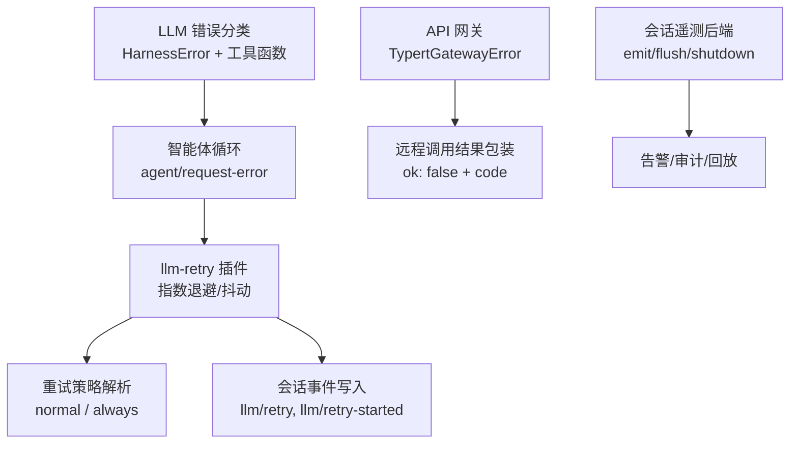
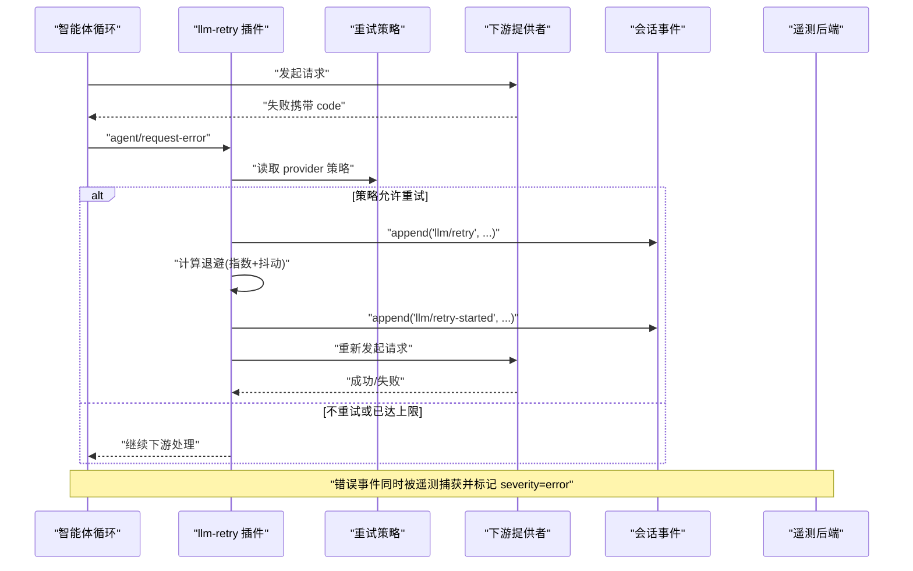
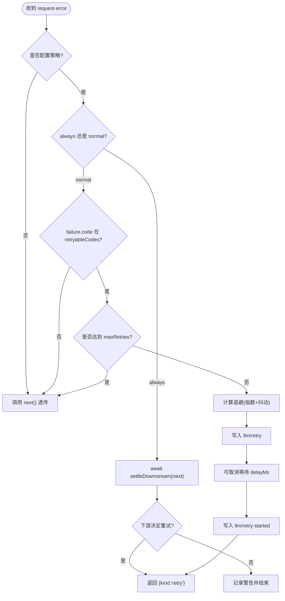
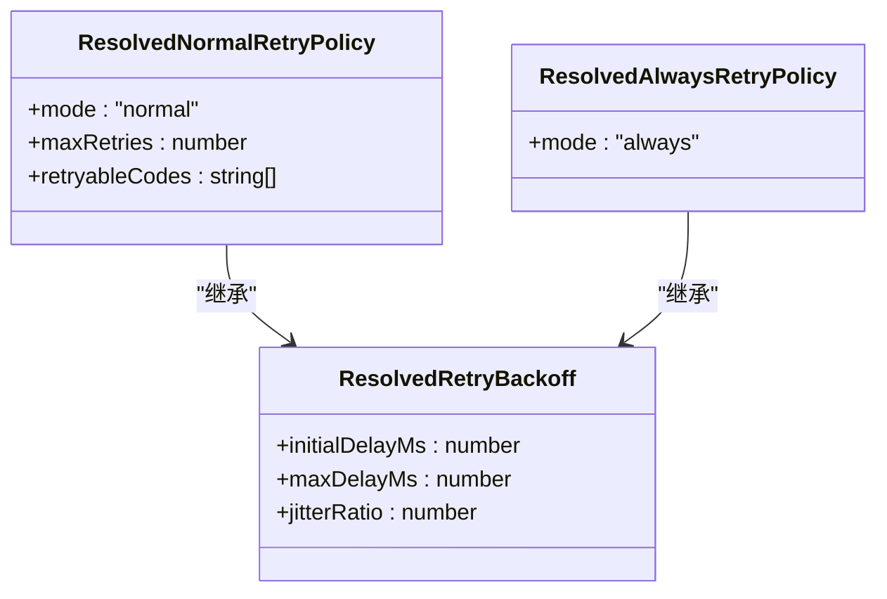
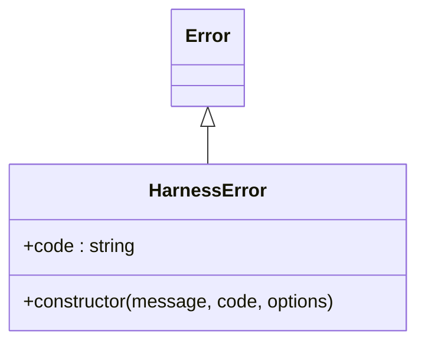
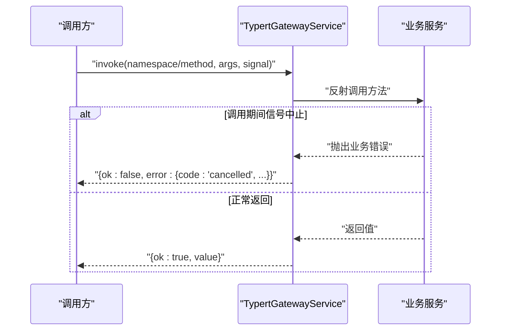
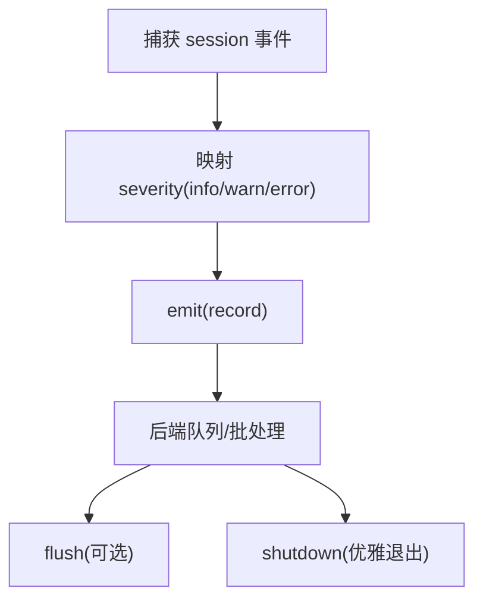
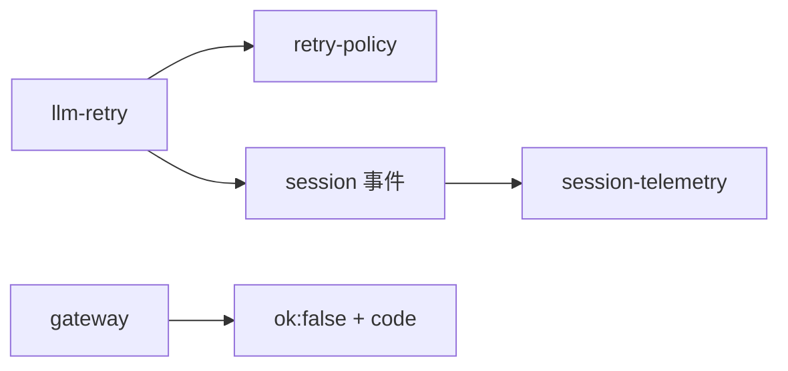

# 错误处理与重试

<cite>
**本文引用的文件**
- [packages/llm/llm-retry/src/index.ts](file://packages/llm/llm-retry/src/index.ts)
- [packages/llm/llm/src/retry-policy.ts](file://packages/llm/llm/src/retry-policy.ts)
- [packages/llm/llm/src/error.ts](file://packages/llm/llm/src/error.ts)
- [packages/api/gateway/src/index.ts](file://packages/api/gateway/src/index.ts)
- [packages/session/session-telemetry/src/index.ts](file://packages/session/session-telemetry/src/index.ts)
- [packages/session/session-telemetry-otel/src/index.ts](file://packages/session/session-telemetry-otel/src/index.ts)
- [apps/web/tests/live-interactions.e2e.ts](file://apps/web/tests/live-interactions.e2e.ts)
</cite>

## 目录
1. [简介](#简介)
2. [项目结构](#项目结构)
3. [核心组件](#核心组件)
4. [架构总览](#架构总览)
5. [详细组件分析](#详细组件分析)
6. [依赖关系分析](#依赖关系分析)
7. [性能考量](#性能考量)
8. [故障诊断指南](#故障诊断指南)
9. [结论](#结论)
10. [附录](#附录)

## 简介
本文件系统性梳理 deepseek-harness 中的错误分类、重试机制、熔断与降级策略、日志与监控告警、以及故障诊断与调优方法。重点覆盖：
- 网络异常、协议错误、业务异常的识别与分流
- 指数退避重试（含抖动）与“始终重试”模式
- 熔断器与降级的工程化落地建议
- 错误日志记录、遥测告警、用户提示
- 调试技巧、性能优化与最佳实践

## 项目结构
围绕错误与重试的关键代码分布在以下模块：
- LLM 重试插件：在智能体循环的失败扩展点拦截请求错误，按策略执行重试并持久化事件
- LLM 重试策略：定义可配置的重试策略（正常/始终）、退避参数校验与默认值
- 错误基类与工具：统一的 HarnessError 基类、错误链渲染、上下文溢出/配额超限识别
- API 网关：统一将调用期异常转换为结构化错误码，区分取消、内部错误等
- 会话遥测：捕获 session 事件并输出到后端，支持 info/warn/error 级别与告警

**图示来源**
- [packages/llm/llm-retry/src/index.ts:99-226](file://packages/llm/llm-retry/src/index.ts#L99-L226)
- [packages/llm/llm/src/retry-policy.ts:149-195](file://packages/llm/llm/src/retry-policy.ts#L149-L195)
- [packages/llm/llm/src/error.ts:13-22](file://packages/llm/llm/src/error.ts#L13-L22)
- [packages/api/gateway/src/index.ts:43-71](file://packages/api/gateway/src/index.ts#L43-L71)
- [packages/session/session-telemetry/src/index.ts:47-87](file://packages/session/session-telemetry/src/index.ts#L47-L87)

**章节来源**
- [packages/llm/llm-retry/src/index.ts:99-226](file://packages/llm/llm-retry/src/index.ts#L99-L226)
- [packages/llm/llm/src/retry-policy.ts:149-195](file://packages/llm/llm/src/retry-policy.ts#L149-L195)
- [packages/llm/llm/src/error.ts:13-22](file://packages/llm/llm/src/error.ts#L13-L22)
- [packages/api/gateway/src/index.ts:43-71](file://packages/api/gateway/src/index.ts#L43-L71)
- [packages/session/session-telemetry/src/index.ts:47-87](file://packages/session/session-telemetry/src/index.ts#L47-L87)

## 核心组件
- 重试插件（llm-retry）
  - 监听 agent/request-error，按 provider 维度的策略决定是否重试
  - 支持 normal（有限次重试）和 always（直到成功/取消/销毁）两种模式
  - 使用指数退避 + 对称抖动；尊重 provider 返回的 Retry-After
  - 通过会话事件持久化重试过程，便于回放与诊断
- 重试策略（retry-policy）
  - 提供 schema 校验与默认值：最大重试次数、可重试错误码集合、退避参数
  - 严格校验 backoff 参数范围与约束，防止非法配置导致定时器异常
- 错误基类与工具（error）
  - HarnessError：稳定 code 与 message 分离，支持 cause 链
  - 工具函数：错误链渲染、上下文窗口超限/配额耗尽识别
- API 网关（gateway）
  - 将调用期异常映射为结构化错误码（如 cancelled、internal），避免裸错误泄露
  - 对取消信号敏感，区分客户端取消与内部故障
- 会话遥测（session-telemetry）
  - 以 info/warn/error 三级严重度上报，自动将错误事件标记为 error
  - 提供 emit/flush/shutdown 接口，解耦采集与导出管线

**章节来源**
- [packages/llm/llm-retry/src/index.ts:99-226](file://packages/llm/llm-retry/src/index.ts#L99-L226)
- [packages/llm/llm/src/retry-policy.ts:149-195](file://packages/llm/llm/src/retry-policy.ts#L149-L195)
- [packages/llm/llm/src/error.ts:13-22](file://packages/llm/llm/src/error.ts#L13-L22)
- [packages/api/gateway/src/index.ts:43-71](file://packages/api/gateway/src/index.ts#L43-L71)
- [packages/session/session-telemetry/src/index.ts:47-87](file://packages/session/session-telemetry/src/index.ts#L47-L87)

## 架构总览
下图展示一次模型请求失败后的处理路径：从错误分类、策略判定、指数退避重试，到会话事件记录与遥测上报。

**图示来源**
- [packages/llm/llm-retry/src/index.ts:111-208](file://packages/llm/llm-retry/src/index.ts#L111-L208)
- [packages/llm/llm/src/retry-policy.ts:149-195](file://packages/llm/llm/src/retry-policy.ts#L149-L195)
- [packages/session/session-telemetry/src/index.ts:47-87](file://packages/session/session-telemetry/src/index.ts#L47-L87)

## 详细组件分析

### 重试插件（llm-retry）
- 关键流程
  - 监听 agent/request-error，若未配置策略则直接透传
  - always 模式：先尝试下游决策，若下游决定重试则复用其决策；否则记录警告并继续
  - normal 模式：仅当 failure.code 属于 retryableCodes 且未达到 maxRetries 时重试
  - 退避计算：localDelay 使用指数增长并限制最大值，叠加对称抖动
  - 可取消等待：cancellableDelay 结合 AbortSignal 实现可中断等待
  - 持久化：每次退避前写入 llm/retry，重试开始时写入 llm/retry-started
- 健壮性
  - 生命周期控制：插件 dispose 时中止所有活跃重试，等待完成
  - 信号融合：AbortSignal.any(signal, lifetime.signal) 确保取消优先

**图示来源**
- [packages/llm/llm-retry/src/index.ts:111-208](file://packages/llm/llm-retry/src/index.ts#L111-L208)
- [packages/llm/llm-retry/src/index.ts:78-91](file://packages/llm/llm-retry/src/index.ts#L78-L91)

**章节来源**
- [packages/llm/llm-retry/src/index.ts:99-226](file://packages/llm/llm-retry/src/index.ts#L99-L226)

### 重试策略（retry-policy）
- 策略类型
  - normal：限定可重试的错误码集合与最大重试次数
  - always：对所有失败持续重试，直到成功、取消或插件销毁
- 退避参数
  - initialDelayMs、maxDelayMs、jitterRatio，均受严格校验
  - 默认值：初始延迟 500ms，最大延迟 10s，抖动比 0.1
- 可重试错误码
  - 默认包含 EMPTY_RESPONSE、RATE_LIMIT、SERVER、TIMEOUT、TRANSPORT
- 配置校验
  - 拒绝未知键、空列表、重复项、越界数值等，保证运行时安全

**图示来源**
- [packages/llm/llm/src/retry-policy.ts:59-79](file://packages/llm/llm/src/retry-policy.ts#L59-L79)
- [packages/llm/llm/src/retry-policy.ts:121-141](file://packages/llm/llm/src/retry-policy.ts#L121-L141)

**章节来源**
- [packages/llm/llm/src/retry-policy.ts:149-195](file://packages/llm/llm/src/retry-policy.ts#L149-L195)

### 错误分类与工具（error）
- HarnessError
  - 稳定的 machine-routable code，与 message 分离，支持 cause 链
  - name 默认为子类名，便于运行时识别
- 工具函数
  - errorChain：渲染完整错误链，兼容 AggregateError，避免循环引用
  - isContextWindowExceededError：识别上下文窗口超限
  - isQuotaExceededError：识别账户配额耗尽
  - isHarnessError：运行时类型收窄

**图示来源**
- [packages/llm/llm/src/error.ts:13-22](file://packages/llm/llm/src/error.ts#L13-L22)
- [packages/llm/llm/src/error.ts:114-154](file://packages/llm/llm/src/error.ts#L114-L154)

**章节来源**
- [packages/llm/llm/src/error.ts:13-22](file://packages/llm/llm/src/error.ts#L13-L22)
- [packages/llm/llm/src/error.ts:114-154](file://packages/llm/llm/src/error.ts#L114-L154)

### API 网关错误映射（gateway）
- TypertGatewayError
  - 携带稳定 code、endpoint、可选 field，消息不含敏感边界值
- 取消语义
  - 当 carrier 信号已中止时，业务拒绝视为客户端取消而非内部故障
  - 返回 ok:false 并附带 code='cancelled'
- 其他错误
  - 内部错误映射为 code='internal'，保留 message

**图示来源**
- [packages/api/gateway/src/index.ts:145-184](file://packages/api/gateway/src/index.ts#L145-L184)
- [packages/api/gateway/src/index.ts:471-489](file://packages/api/gateway/src/index.ts#L471-L489)

**章节来源**
- [packages/api/gateway/src/index.ts:43-71](file://packages/api/gateway/src/index.ts#L43-L71)
- [packages/api/gateway/src/index.ts:145-184](file://packages/api/gateway/src/index.ts#L145-L184)
- [packages/api/gateway/src/index.ts:471-489](file://packages/api/gateway/src/index.ts#L471-L489)

### 会话遥测与告警（session-telemetry）
- 严重度映射
  - 自动将 tool-result 的 isError、turn/end 错误原因、agent-error 等操作记录标记为 error
  - 其余默认 info，warn 留给策略与后端自定义
- 后端接口
  - emit：非阻塞入队，热路径不阻塞
  - flush：可选提示，用于每轮结束后刷新
  - shutdown：优雅关闭，等待管道静默
- OTel 后端
  - 根据模式启用/禁用上报，DISABLED 模式下仅本地 warn

**图示来源**
- [packages/session/session-telemetry/src/index.ts:47-87](file://packages/session/session-telemetry/src/index.ts#L47-L87)
- [packages/session/session-telemetry/src/index.ts:94-131](file://packages/session/session-telemetry/src/index.ts#L94-L131)
- [packages/session/session-telemetry-otel/src/index.ts:141-168](file://packages/session/session-telemetry-otel/src/index.ts#L141-L168)

**章节来源**
- [packages/session/session-telemetry/src/index.ts:47-87](file://packages/session/session-telemetry/src/index.ts#L47-L87)
- [packages/session/session-telemetry-otel/src/index.ts:141-168](file://packages/session/session-telemetry-otel/src/index.ts#L141-L168)

## 依赖关系分析
- llm-retry 依赖 retry-policy 提供的策略解析与默认值
- llm-retry 依赖 session 事件写入，用于重试过程的持久化
- gateway 的错误码与取消语义影响上层重试与降级决策
- session-telemetry 作为横切关注点，对错误事件进行告警与审计

**图示来源**
- [packages/llm/llm-retry/src/index.ts:99-226](file://packages/llm/llm-retry/src/index.ts#L99-L226)
- [packages/llm/llm/src/retry-policy.ts:149-195](file://packages/llm/llm/src/retry-policy.ts#L149-L195)
- [packages/api/gateway/src/index.ts:471-489](file://packages/api/gateway/src/index.ts#L471-L489)
- [packages/session/session-telemetry/src/index.ts:47-87](file://packages/session/session-telemetry/src/index.ts#L47-L87)

**章节来源**
- [packages/llm/llm-retry/src/index.ts:99-226](file://packages/llm/llm-retry/src/index.ts#L99-L226)
- [packages/llm/llm/src/retry-policy.ts:149-195](file://packages/llm/llm/src/retry-policy.ts#L149-L195)
- [packages/api/gateway/src/index.ts:471-489](file://packages/api/gateway/src/index.ts#L471-L489)
- [packages/session/session-telemetry/src/index.ts:47-87](file://packages/session/session-telemetry/src/index.ts#L47-L87)

## 性能考量
- 指数退避与抖动
  - localDelay 使用 2^(retry-1) 增长并限制到 maxDelayMs，配合 jitterRatio 降低雪崩风险
  - 合理设置 initialDelayMs 与 maxDelayMs 平衡恢复速度与资源占用
- 可取消等待
  - cancellableDelay 结合 AbortSignal，避免无效等待与资源泄漏
- 事件写入与遥测
  - 重试事件写入会话与遥测为轻量操作，注意在高吞吐场景下评估批量与落盘策略
- 配置校验
  - 严格的 backoff 校验防止过大定时器导致的系统抖动

[本节为通用指导，无需特定文件来源]

## 故障诊断指南
- 定位重试行为
  - 查看会话事件 llm/retry 与 llm/retry-started，确认是否触发重试及退避时长
  - 检查 provider 的 retryableCodes 与 maxRetries 是否符合预期
- 区分错误类型
  - 使用 HarnessError.code 进行路由判断，避免解析 message
  - 使用 isContextWindowExceededError/isQuotaExceededError 快速识别上下文/配额问题
- 网关错误排查
  - 关注 code 为 'cancelled' 的情况，通常来自客户端断开或超时
  - 内部错误 code='internal' 需进一步查看 cause 链
- 遥测告警
  - 利用 severity=error 的事件进行告警；DISABLED 模式下仅本地 warn
- 端到端验证
  - 参考 web e2e 用例，验证 AUTH 等非可重试错误不会触发重试，SERVER 等可重试错误能恢复

**章节来源**
- [packages/llm/llm/src/error.ts:114-154](file://packages/llm/llm/src/error.ts#L114-L154)
- [packages/api/gateway/src/index.ts:471-489](file://packages/api/gateway/src/index.ts#L471-L489)
- [packages/session/session-telemetry-otel/src/index.ts:141-168](file://packages/session/session-telemetry-otel/src/index.ts#L141-L168)
- [apps/web/tests/live-interactions.e2e.ts:159-237](file://apps/web/tests/live-interactions.e2e.ts#L159-L237)

## 结论
deepseek-harness 通过统一的错误基类、可配置的重试策略、指数退避与抖动、以及会话与遥测的横切能力，构建了稳健的错误处理与重试体系。结合网关的结构化错误映射与端到端测试，可在复杂网络与协议环境下实现高可用与可观测性。建议在部署中根据业务特性调整重试策略与退避参数，并配合遥测告警实现闭环治理。

[本节为总结性内容，无需特定文件来源]

## 附录
- 最佳实践
  - 明确区分可重试与不可重试错误，避免对认证/配额类错误盲目重试
  - 合理设置 maxRetries 与 backoff，防止风暴式重试
  - 使用 HarnessError.code 进行路由与告警，避免字符串匹配
  - 在网关层统一错误码，便于前端提示与运维排障
- 示例参考
  - 重试事件与恢复流程可参考 web e2e 用例中对 AUTH 与 SERVER 错误的不同处理

[本节为补充说明，无需特定文件来源]