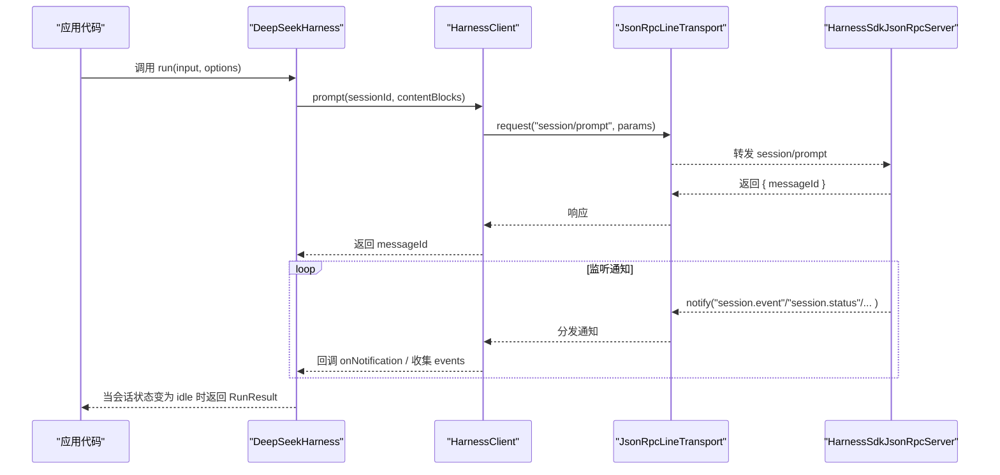
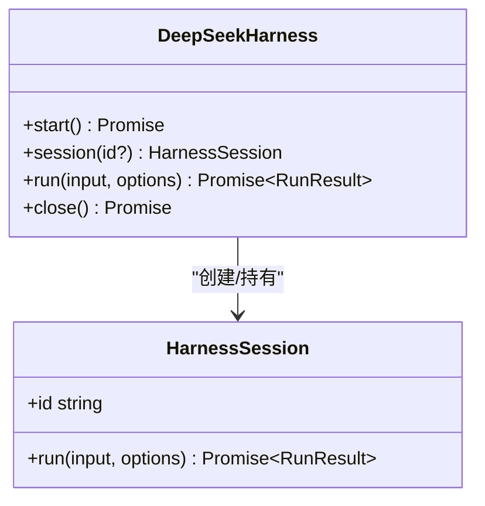
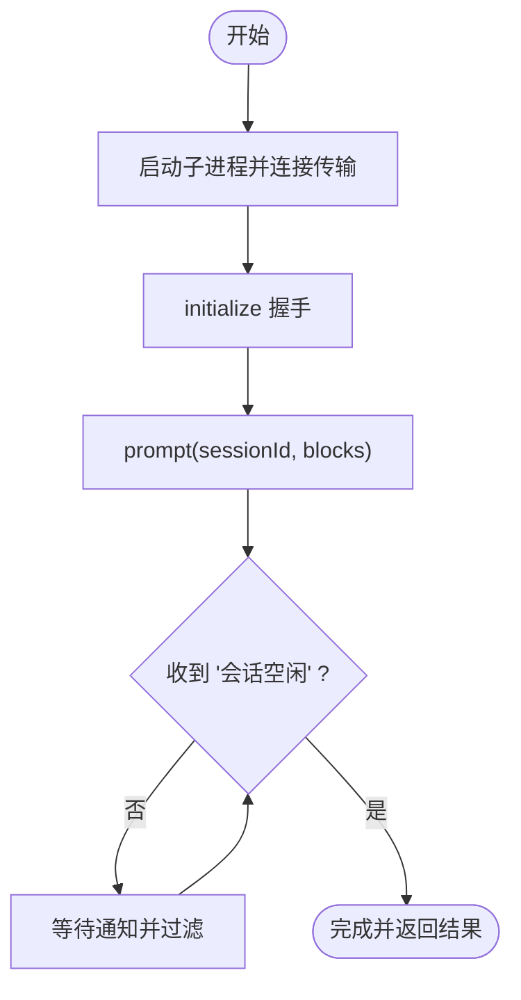
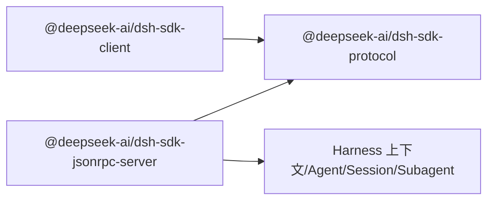

# 客户端 SDK

<cite>
**本文引用的文件**
- [packages/sdk/client/src/index.ts](file://packages/sdk/client/src/index.ts)
- [packages/sdk/client/src/api.ts](file://packages/sdk/client/src/api.ts)
- [packages/sdk/client/src/client.ts](file://packages/sdk/client/src/client.ts)
- [packages/sdk/client/src/types.ts](file://packages/sdk/client/src/types.ts)
- [packages/sdk/protocol/src/index.ts](file://packages/sdk/protocol/src/index.ts)
- [packages/sdk/protocol/src/types.ts](file://packages/sdk/protocol/src/types.ts)
- [packages/sdk/server/src/server.ts](file://packages/sdk/server/src/server.ts)
- [packages/sdk/client/package.json](file://packages/sdk/client/package.json)
- [packages/sdk/protocol/package.json](file://packages/sdk/protocol/package.json)
</cite>

## 目录
1. [简介](#简介)
2. [项目结构](#项目结构)
3. [核心组件](#核心组件)
4. [架构总览](#架构总览)
5. [详细组件分析](#详细组件分析)
6. [依赖关系分析](#依赖关系分析)
7. [性能与可靠性](#性能与可靠性)
8. [故障排查指南](#故障排查指南)
9. [结论](#结论)
10. [附录：API 参考与使用示例](#附录api-参考与使用示例)

## 简介
本 SDK 提供在浏览器或 Node.js 环境中驱动 DeepSeek Harness 运行时子进程的 TypeScript 客户端能力。它通过标准输入输出上的 JSON-RPC 协议与运行时代码通信，封装了会话管理、消息发送与接收、工具调用（由 Agent 内部执行）、以及通知订阅等核心功能。上层 API 以“进程级 Harness + 会话级 Session”的模型组织，便于在同一进程中复用单一运行时实例并开展多轮对话。

## 项目结构
SDK 分为三层：
- 协议层：定义跨进程通信的请求、响应与通知类型，以及基于换行分隔 JSON 的传输实现。
- 服务端侧：在 Harness 上下文中暴露 JSON-RPC 方法，桥接 Agent、Session、Subagent 生命周期事件到客户端。
- 客户端侧：启动并管理运行时子进程，提供高层的“运行一次对话”和底层的“请求/通知”接口。

```mermaid
graph TB
subgraph "客户端"
A["DeepSeekHarness<br/>高层 API"]
B["HarnessClient<br/>JSON-RPC 客户端"]
end
subgraph "传输"
T["JsonRpcLineTransport<br/>换行分隔 JSON-RPC over stdio"]
end
subgraph "服务端(运行时)"
S["HarnessSdkJsonRpcServer<br/>注册 initialize/session/prompt/shutdown"]
end
A --> B
B < --> T
T < --> S
```

图表来源
- [packages/sdk/client/src/api.ts:22-119](file://packages/sdk/client/src/api.ts#L22-L119)
- [packages/sdk/client/src/client.ts:184-458](file://packages/sdk/client/src/client.ts#L184-L458)
- [packages/sdk/protocol/src/index.ts:1-26](file://packages/sdk/protocol/src/index.ts#L1-L26)
- [packages/sdk/server/src/server.ts:53-201](file://packages/sdk/server/src/server.ts#L53-L201)

章节来源
- [packages/sdk/client/src/index.ts:1-30](file://packages/sdk/client/src/index.ts#L1-L30)
- [packages/sdk/protocol/src/index.ts:1-26](file://packages/sdk/protocol/src/index.ts#L1-L26)
- [packages/sdk/server/src/server.ts:1-241](file://packages/sdk/server/src/server.ts#L1-L241)

## 核心组件
- 高层 API：DeepSeekHarness 与 HarnessSession，负责启动运行时、初始化握手、创建会话、发送提示词并等待会话回到空闲状态，返回最终响应与完整事件流。
- 低层客户端：HarnessClient，负责子进程生命周期、JSON-RPC 请求/通知、超时控制、错误分类与清理。
- 协议类型：统一的请求/响应/通知类型，确保客户端与服务端契约稳定。
- 服务端：将 Harness 上下文中的会话事件、Agent 状态、子代理生命周期映射为通知，并提供 initialize/session/prompt/shutdown 方法。

章节来源
- [packages/sdk/client/src/api.ts:22-195](file://packages/sdk/client/src/api.ts#L22-L195)
- [packages/sdk/client/src/client.ts:184-458](file://packages/sdk/client/src/client.ts#L184-L458)
- [packages/sdk/protocol/src/types.ts:15-105](file://packages/sdk/protocol/src/types.ts#L15-L105)
- [packages/sdk/server/src/server.ts:53-201](file://packages/sdk/server/src/server.ts#L53-L201)

## 架构总览
下图展示了从应用调用到运行时执行的端到端流程，包括会话创建、提示入队、事件回传与结束判定。



图表来源
- [packages/sdk/client/src/api.ts:146-195](file://packages/sdk/client/src/api.ts#L146-L195)
- [packages/sdk/client/src/client.ts:283-333](file://packages/sdk/client/src/client.ts#L283-L333)
- [packages/sdk/protocol/src/types.ts:33-64](file://packages/sdk/protocol/src/types.ts#L33-L64)
- [packages/sdk/server/src/server.ts:71-103](file://packages/sdk/server/src/server.ts#L71-L103)

## 详细组件分析

### 高层 API：DeepSeekHarness 与 HarnessSession
- DeepSeekHarness
  - 职责：管理运行时子进程的生命周期；维护 provider/model/cwd/maxTokens 等会话路由参数；对外暴露 run() 便捷入口。
  - 关键行为：首次使用时懒启动子进程并完成 initialize 握手；失败时自动回收并替换客户端实例；支持 async/dispose 语义。
- HarnessSession
  - 职责：绑定一个稳定的 sessionId；run() 将文本或内容块标准化后提交，订阅该会话及其子代理的通知树，直到收到“会话空闲”为止。
  - 返回值：RunResult 包含 finalResponse、events、notifications，便于回放与审计。



图表来源
- [packages/sdk/client/src/api.ts:22-119](file://packages/sdk/client/src/api.ts#L22-L119)
- [packages/sdk/client/src/api.ts:132-195](file://packages/sdk/client/src/api.ts#L132-L195)

章节来源
- [packages/sdk/client/src/api.ts:22-195](file://packages/sdk/client/src/api.ts#L22-L195)

### 低层客户端：HarnessClient
- 进程管理：spawn 子进程，维护 stdin/stdout/stderr 管道；在 close() 中按 EOF → SIGTERM → SIGKILL 阶梯安全退出。
- 请求/通知：封装 JsonRpcLineTransport，支持 per-call 超时；统一分发消息到各订阅者。
- 会话树订阅：subscribeSessionTree 根据 subagent.started/finished 构建父子关系，仅投递目标会话及其后代的通知。
- 错误模型：TransportClosedError（进程不可用）、RequestTimeoutError（请求超时）、SdkProtocolError（协议不合规）。



图表来源
- [packages/sdk/client/src/client.ts:203-333](file://packages/sdk/client/src/client.ts#L203-L333)
- [packages/sdk/client/src/client.ts:355-372](file://packages/sdk/client/src/client.ts#L355-L372)

章节来源
- [packages/sdk/client/src/client.ts:184-458](file://packages/sdk/client/src/client.ts#L184-L458)

### 协议与类型
- 请求/响应
  - initialize：传入 cwd/provider/model/maxTokens，返回 serverInfo 标识。
  - session/prompt：提交用户消息，返回 messageId。
  - shutdown：优雅关闭服务端资源。
- 通知
  - session.event：会话日志事件，携带 SessionEvent 信封。
  - session.status：会话状态变更（idle/running）。
  - subagent.started/finished：子代理生命周期，含 parent/child 关系与停止原因。

章节来源
- [packages/sdk/protocol/src/types.ts:15-105](file://packages/sdk/protocol/src/types.ts#L15-L105)
- [packages/sdk/protocol/src/index.ts:1-26](file://packages/sdk/protocol/src/index.ts#L1-L26)

### 服务端：HarnessSdkJsonRpcServer
- 职责：在 Harness 上下文中注册 initialize/session/prompt/shutdown 方法；订阅会话事件、Agent 状态、子代理生命周期，并将其转换为通知推送到客户端。
- 会话创建：按需创建 AgentHandle，注入 provider/model/maxTokens；对已销毁会话进行防护。
- 终止：有序释放所有会话句柄与可选 LLM 适配器 Fiber，聚合异常。

章节来源
- [packages/sdk/server/src/server.ts:53-201](file://packages/sdk/server/src/server.ts#L53-L201)

## 依赖关系分析
- 客户端包依赖协议包与 LLM/Session 类型，用于内容块与会话事件建模。
- 服务端依赖 Cordis Context、Agent、Session、Subagent 等运行时能力，将内部事件桥接到 JSON-RPC 通知。
- 传输层解耦：客户端与服务端通过换行分隔的 JSON-RPC 通信，屏蔽底层进程细节。



图表来源
- [packages/sdk/client/package.json:1-48](file://packages/sdk/client/package.json#L1-L48)
- [packages/sdk/protocol/package.json:1-48](file://packages/sdk/protocol/package.json#L1-L48)
- [packages/sdk/server/src/server.ts:8-26](file://packages/sdk/server/src/server.ts#L8-L26)

章节来源
- [packages/sdk/client/package.json:1-48](file://packages/sdk/client/package.json#L1-L48)
- [packages/sdk/protocol/package.json:1-48](file://packages/sdk/protocol/package.json#L1-L48)

## 性能与可靠性
- 子进程复用：DeepSeekHarness 在同一实例内复用运行时进程，避免频繁 spawn 开销。
- 请求超时：可通过 requestTimeoutMs 限制单次请求耗时，防止长时间阻塞；注意服务端任务仍会继续执行直至结束。
- 优雅关闭：close() 先尝试协议 shutdown，再按 EOF/SIGTERM/SIGKILL 阶梯强制回收，保障资源释放。
- 通知批处理：subscribeSessionTree 在客户端维护父子关系，减少无关通知带来的处理成本。
- 内存与事件：RunResult 会累积 events/notifications，长会话建议结合 onNotification 增量消费，避免过大对象驻留。

[本节为通用指导，无需特定文件引用]

## 故障排查指南
- 进程无法启动/意外退出
  - 现象：抛出 TransportClosedError，附带 exit code 与 stderr 尾部信息。
  - 排查：检查 command/args/env/cwd 是否正确；查看子进程 stderr 输出定位崩溃原因。
- 请求超时
  - 现象：抛出 RequestTimeoutError。
  - 排查：适当增大 requestTimeoutMs；确认后端服务是否被阻塞。
- 协议不合规
  - 现象：抛出 SdkProtocolError。
  - 排查：检查服务端版本与客户端是否匹配；核对 session/event 信封结构是否符合预期。
- 会话未就绪
  - 现象：prompt 后立即收到非预期通知。
  - 排查：确保先收到 agent/inbox/spliced 回执后再消费后续事件；使用 subscribeSessionTree 过滤目标会话。

章节来源
- [packages/sdk/client/src/client.ts:38-65](file://packages/sdk/client/src/client.ts#L38-L65)
- [packages/sdk/client/src/client.ts:301-333](file://packages/sdk/client/src/client.ts#L301-L333)
- [packages/sdk/client/src/api.ts:206-229](file://packages/sdk/client/src/api.ts#L206-L229)

## 结论
本 SDK 以“进程级 Harness + 会话级 Session”的清晰分层，提供了稳定可靠的运行时驱动能力。通过统一的协议类型与健壮的错误模型，开发者可以专注于业务逻辑，而无需关心进程管理与传输细节。配合通知订阅与事件回放，既能满足实时交互，也能支持离线分析与调试。

[本节为总结性内容，无需特定文件引用]

## 附录：API 参考与使用示例

### 配置选项
- DeepSeekHarnessOptions
  - launch：子进程启动参数（command/args/cwd/env/requestTimeoutMs/shutdownTimeoutMs/disposeEofGraceMs/disposeGraceMs）
  - cwd：记录到会话头的工作目录
  - provider/model：Agent 运行的提供者与模型
  - maxTokens：最大输出 token 数
- HarnessClientOptions
  - 详见上述字段说明，用于精细控制子进程与请求行为

章节来源
- [packages/sdk/client/src/types.ts:22-59](file://packages/sdk/client/src/types.ts#L22-L59)

### 核心 API
- DeepSeekHarness
  - start()：启动并握手
  - session(id?)：创建会话句柄
  - run(input, options)：快捷运行一次对话
  - close()：关闭并回收进程
- HarnessSession
  - run(input, options)：提交提示并等待会话空闲，返回 RunResult
- HarnessClient
  - start()/initialize()/prompt()/request()/subscribe()/subscribeSessionTree()/close()

章节来源
- [packages/sdk/client/src/api.ts:22-195](file://packages/sdk/client/src/api.ts#L22-L195)
- [packages/sdk/client/src/client.ts:268-372](file://packages/sdk/client/src/client.ts#L268-L372)

### 使用模式与最佳实践
- 推荐模式
  - 使用 DeepSeekHarness 作为单例，多次调用 run() 复用进程。
  - 对长对话使用 HarnessSession 保持会话连续性。
  - 通过 onNotification 增量处理事件，避免全部缓存。
- 错误处理
  - 捕获 TransportClosedError/RequestTimeoutError/SdkProtocolError，分别对应进程异常、超时与协议不一致。
- 资源管理
  - 使用 try/finally 或 async/dispose 确保 close() 被调用。
- 工具调用
  - 工具由 Agent 在服务端执行，客户端通过 session.event 观察执行过程与结果。

章节来源
- [packages/sdk/client/src/api.ts:146-195](file://packages/sdk/client/src/api.ts#L146-L195)
- [packages/sdk/client/src/client.ts:301-333](file://packages/sdk/client/src/client.ts#L301-L333)
- [packages/sdk/server/src/server.ts:71-103](file://packages/sdk/server/src/server.ts#L71-L103)

### 与后端服务的集成方案
- 进程边界：客户端通过 stdio 与 dsh-jsonrpc-agent 通信，适合嵌入 CLI、Web Worker、Node 服务或 Electron 主进程。
- 环境隔离：通过 env/cwd 控制运行环境与工作目录，便于权限与安全策略。
- 可扩展性：服务端可挂载不同 LLM 适配器与插件，客户端无需感知具体实现。

章节来源
- [packages/sdk/server/src/server.ts:111-125](file://packages/sdk/server/src/server.ts#L111-L125)
- [packages/sdk/client/src/types.ts:22-45](file://packages/sdk/client/src/types.ts#L22-L45)