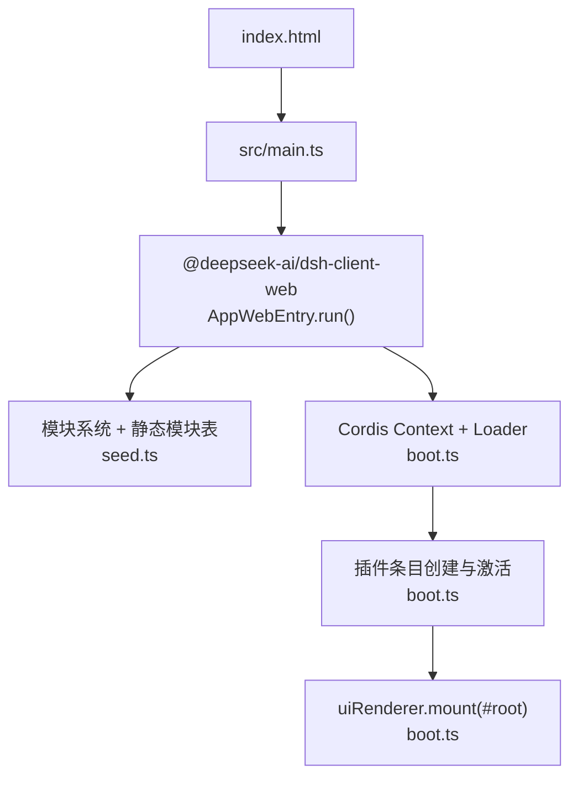
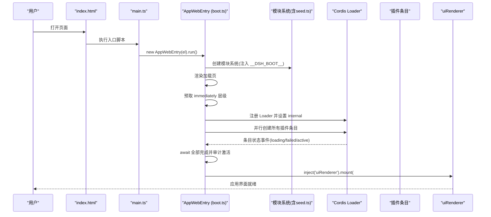
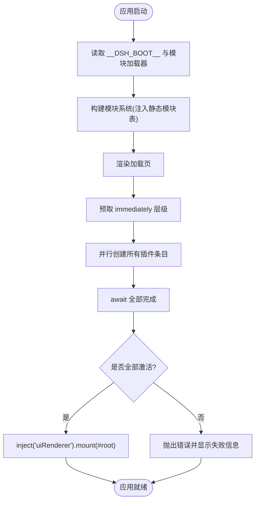
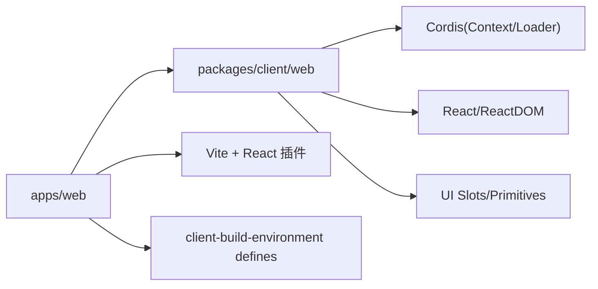

# 应用架构

<cite>
**本文引用的文件**
- [apps/web/package.json](file://apps/web/package.json)
- [apps/web/vite.config.ts](file://apps/web/vite.config.ts)
- [apps/web/index.html](file://apps/web/index.html)
- [apps/web/src/main.ts](file://apps/web/src/main.ts)
- [apps/web/src/node-module-stub.ts](file://apps/web/src/node-module-stub.ts)
- [packages/client/web/src/boot.ts](file://packages/client/web/src/boot.ts)
- [packages/client/web/src/seed.ts](file://packages/client/web/src/seed.ts)
- [scripts/client-build-environment.ts](file://scripts/client-build-environment.ts)
</cite>

## 目录
1. [简介](#简介)
2. [项目结构](#项目结构)
3. [核心组件](#核心组件)
4. [架构总览](#架构总览)
5. [详细组件分析](#详细组件分析)
6. [依赖分析](#依赖分析)
7. [性能考虑](#性能考虑)
8. [故障排查指南](#故障排查指南)
9. [结论](#结论)
10. [附录](#附录)

## 简介
本文件面向 DeepSeek Harness Web 应用的工程与运行时架构，聚焦以下目标：
- React 应用的启动流程、模块加载机制与依赖注入系统
- Vite 构建配置、开发服务器限制与生产优化
- 整体目录结构、核心模块职责与组件层次关系
- 前端工程化配置、代码分割策略与性能优化方案
- 应用初始化流程图与关键配置文件说明

该 Web 应用以 apps/web 为入口，通过 Vite 构建产物由 CLI 的 web 服务提供；实际壳层与插件体系位于 packages/client/web，采用 Cordis 上下文与 Loader 实现插件化与依赖注入。

## 项目结构
- apps/web
  - index.html：浏览器入口 HTML，挂载 #root，并引入 /src/main.ts
  - src/main.ts：极薄入口，仅定位挂载点并调用 AppWebEntry.run()
  - vite.config.ts：Vite 构建与开发期行为（禁止独立 serve、标题注入、分包策略、别名与 define）
  - package.json：脚本与依赖声明（React、Vite、@vitejs/plugin-react、工作区包等）
- packages/client/web
  - boot.ts：Web 启动内核，负责模块系统、Cordis Loader、预取、创建条目、激活审计与 UI 挂载
  - seed.ts：静态模块表，向模块系统暴露平台单例（React、Cordis、UI Slots/Primitives）
- scripts
  - client-build-environment.ts：客户端构建环境解析、define 注入、构建记录与校验

图表来源
- [apps/web/index.html:1-15](file://apps/web/index.html#L1-L15)
- [apps/web/src/main.ts:1-11](file://apps/web/src/main.ts#L1-L11)
- [packages/client/web/src/boot.ts:1-144](file://packages/client/web/src/boot.ts#L1-L144)
- [packages/client/web/src/seed.ts:1-36](file://packages/client/web/src/seed.ts#L1-L36)

章节来源
- [apps/web/package.json:1-49](file://apps/web/package.json#L1-L49)
- [apps/web/vite.config.ts:1-177](file://apps/web/vite.config.ts#L1-L177)
- [apps/web/index.html:1-15](file://apps/web/index.html#L1-L15)
- [apps/web/src/main.ts:1-11](file://apps/web/src/main.ts#L1-L11)

## 核心组件
- 应用入口 main.ts
  - 职责：查找 #root，实例化并运行 AppWebEntry
  - 关键点：将挂载点交给壳层，自身不承载业务逻辑
- Web 启动内核 boot.ts
  - 职责：读取 window.__DSH_BOOT__，构造模块系统，渲染加载页，预取 immediately 层级，创建并等待所有插件条目激活，最后通过 uiRenderer.mount 挂载 UI
  - 关键点：prefetching 必须在 create 之前 await，避免同步 require 竞态
- 静态模块表 seed.ts
  - 职责：向模块系统暴露平台级单例（React、react-dom、Cordis、UI Slots/Primitives），确保跨 bundle 唯一实例
- 构建环境 scripts/client-build-environment.ts
  - 职责：收集 DSH_CLIENT_* 环境变量，生成 define 替换，写入构建记录，保证制品可追溯与一致性
- Vite 配置 vite.config.ts
  - 职责：插件链（拒绝独立 serve、注入标题、React）、分包策略（vendor/langs/fonts）、别名与 define、源码映射

章节来源
- [apps/web/src/main.ts:1-11](file://apps/web/src/main.ts#L1-L11)
- [packages/client/web/src/boot.ts:1-144](file://packages/client/web/src/boot.ts#L1-L144)
- [packages/client/web/src/seed.ts:1-36](file://packages/client/web/src/seed.ts#L1-L36)
- [scripts/client-build-environment.ts:1-312](file://scripts/client-build-environment.ts#L1-L312)
- [apps/web/vite.config.ts:1-177](file://apps/web/vite.config.ts#L1-L177)

## 架构总览
Web 应用采用“壳层 + 插件”的架构：
- 壳层（apps/web + packages/client/web）负责启动、模块系统、加载页、依赖注入与 UI 挂载
- 插件（由 BootManifest 描述）按需加载，通过 Cordis Context 共享服务，最终由 uiRenderer 渲染界面

图表来源
- [apps/web/index.html:1-15](file://apps/web/index.html#L1-L15)
- [apps/web/src/main.ts:1-11](file://apps/web/src/main.ts#L1-L11)
- [packages/client/web/src/boot.ts:1-144](file://packages/client/web/src/boot.ts#L1-L144)
- [packages/client/web/src/seed.ts:1-36](file://packages/client/web/src/seed.ts#L1-L36)

## 详细组件分析

### 启动流程与依赖注入
- 启动阶段
  - 读取 window.__ModuleLoader__ 与 window.__DSH_BOOT__，构建 ClientModuleSystem
  - 渲染加载页，统计插件总数，监听内部状态事件更新 UI
  - 预取 immediately 层级，随后创建所有条目并等待激活
  - 审计激活结果，失败则抛出错误并在加载页展示
- 依赖注入
  - 基于 Cordis Context：插件通过 inject(['...']) 声明依赖，Context 在 fiber 生命周期内提供与回收
  - 静态模块表确保 React、Cordis、UI 插槽/原语等全局单例一致
  - uiRenderer 作为约定服务，由某个插件提供，壳层通过 inject 获取并 mount

图表来源
- [packages/client/web/src/boot.ts:1-144](file://packages/client/web/src/boot.ts#L1-L144)
- [packages/client/web/src/seed.ts:1-36](file://packages/client/web/src/seed.ts#L1-L36)

章节来源
- [packages/client/web/src/boot.ts:1-144](file://packages/client/web/src/boot.ts#L1-L144)
- [packages/client/web/src/seed.ts:1-36](file://packages/client/web/src/seed.ts#L1-L36)

### Vite 构建配置与开发服务器
- 开发服务器保护
  - 自定义插件 rejectStandaloneServe：当使用 Vite 原生 serve 时直接报错，强制通过 dsh web 或 dev:web 启动，以确保 window.__DSH_BOOT__ 注入
- 文档标题注入
  - 自定义插件 clientDocumentTitle：根据环境变量 DSH_CLIENT_TITLE 替换初始 HTML title
- 分包与资源组织
  - manualChunks：按 npm 包名划分 vendor，特殊处理 @shikijs/langs 的语法文件，将启动所需语法归入 vendor，其余按需懒加载
  - chunkFileNames：index/vendor 放 assets/，lang 相关语法放 assets/langs/，字体放 assets/fonts/
  - assetFileNames：字体走 assets/fonts/
- 解析与别名
  - dedupe react/react-dom：确保单一实例，避免 hooks/元素身份分裂
  - alias node:module -> node-module-stub.ts：浏览器端不可用 createRequire，统一抛错
- 编译期常量
  - define：注入 process.env.* 的 DSH_CLIENT_* 值；屏蔽 Node 特性（process.versions.node、process.execArgv、CORDIS_SHARED）

章节来源
- [apps/web/vite.config.ts:1-177](file://apps/web/vite.config.ts#L1-L177)
- [apps/web/src/node-module-stub.ts:1-13](file://apps/web/src/node-module-stub.ts#L1-L13)

### 构建环境与制品可追溯
- 环境变量选择
  - resolveClientBuildEnvironment：支持 official 模式，要求必须提供 DSH_CLIENT_COMMIT_HASH
  - clientBuildProcessEnvironment：清理子进程环境，仅保留公开变量
- 构建期注入
  - clientBuildEnvironmentDefines：将 DSH_CLIENT_* 注入到 process.env.*，供运行时读取
- 构建记录
  - writeClientBuildRecord：记录环境与环境对应的产物摘要（SHA-256）
  - readClientBuildRecord：校验当前产物与记录一致，防止误用不同构建产物

章节来源
- [scripts/client-build-environment.ts:1-312](file://scripts/client-build-environment.ts#L1-L312)

### 目录结构与职责
- apps/web
  - index.html：HTML 模板与入口脚本引用
  - src/main.ts：最小化入口，委托给壳层
  - vite.config.ts：构建与开发期配置
  - package.json：脚本与依赖
- packages/client/web
  - boot.ts：启动内核、模块系统装配、插件加载与 UI 挂载
  - seed.ts：静态模块表（平台单例）
- scripts
  - client-build-environment.ts：构建环境解析与注入、构建记录

章节来源
- [apps/web/index.html:1-15](file://apps/web/index.html#L1-L15)
- [apps/web/src/main.ts:1-11](file://apps/web/src/main.ts#L1-L11)
- [apps/web/vite.config.ts:1-177](file://apps/web/vite.config.ts#L1-L177)
- [apps/web/package.json:1-49](file://apps/web/package.json#L1-L49)
- [packages/client/web/src/boot.ts:1-144](file://packages/client/web/src/boot.ts#L1-L144)
- [packages/client/web/src/seed.ts:1-36](file://packages/client/web/src/seed.ts#L1-L36)
- [scripts/client-build-environment.ts:1-312](file://scripts/client-build-environment.ts#L1-L312)

## 依赖分析
- 运行时依赖
  - React 与 react-dom：通过 dedupe 保证单例，避免多份拷贝导致 hooks 失效
  - Cordis：Context/Loader/Registry 等用于插件化与依赖注入
  - UI 插槽/原语：通过静态模块表注入，供各插件消费
- 构建期依赖
  - Vite 与 @vitejs/plugin-react：开发与构建
  - 自定义插件：rejectStandaloneServe、clientDocumentTitle
  - 脚本工具：client-build-environment.ts 提供 define 与构建记录

图表来源
- [apps/web/vite.config.ts:1-177](file://apps/web/vite.config.ts#L1-L177)
- [packages/client/web/src/boot.ts:1-144](file://packages/client/web/src/boot.ts#L1-L144)
- [packages/client/web/src/seed.ts:1-36](file://packages/client/web/src/seed.ts#L1-L36)
- [scripts/client-build-environment.ts:1-312](file://scripts/client-build-environment.ts#L1-L312)

章节来源
- [apps/web/vite.config.ts:1-177](file://apps/web/vite.config.ts#L1-L177)
- [packages/client/web/src/boot.ts:1-144](file://packages/client/web/src/boot.ts#L1-L144)
- [packages/client/web/src/seed.ts:1-36](file://packages/client/web/src/seed.ts#L1-L36)
- [scripts/client-build-environment.ts:1-312](file://scripts/client-build-environment.ts#L1-L312)

## 性能考虑
- 代码分割策略
  - vendor 包：包含数学、高亮、Markdown 解析等重型且变更频率低的第三方库，提升缓存命中率
  - langs 分包：@shikijs/langs 的语法按需懒加载，减少首屏体积
  - 字体分包：KaTeX 字体集中到 assets/fonts/，便于单独缓存
- 预取优化
  - immediately 层级在 Context/Loader 初始化期间并行预取，缩短后续同步 require 的冷启动延迟
- 依赖去重
  - dedupe react/react-dom，避免重复实例导致的内存与行为问题
- 构建期常量
  - 通过 define 注入 DSH_CLIENT_*，消除运行时分支，利于 Tree-shaking
- 资源路径规划
  - 稳定的输出布局使浏览器可长期缓存稳定 chunk，提高二次访问速度

[本节为通用性能建议，无需特定文件来源]

## 故障排查指南
- 启动时报 missing #root
  - 现象：index.html 未提供 #root 节点
  - 处理：检查 HTML 模板是否正确挂载根容器
  - 参考
    - [apps/web/src/main.ts:8-10](file://apps/web/src/main.ts#L8-L10)
- 开发服务器被拒绝
  - 现象：直接使用 Vite serve 报错，提示需通过 dsh web 启动
  - 原因：rejectStandaloneServe 插件阻止裸 serve，确保 __DSH_BOOT__ 注入
  - 参考
    - [apps/web/vite.config.ts:29-37](file://apps/web/vite.config.ts#L29-L37)
- 模块加载失败或未激活
  - 现象：加载页显示 failed/pending，控制台有 import 错误或缺少服务
  - 处理：检查插件依赖的服务是否已提供；确认 immediately 层级预取成功
  - 参考
    - [packages/client/web/src/boot.ts:108-143](file://packages/client/web/src/boot.ts#L108-L143)
- 浏览器端 node:module 不可用
  - 现象：尝试 createRequire 抛错
  - 原因：alias 指向 stub，浏览器环境不支持
  - 参考
    - [apps/web/src/node-module-stub.ts:6-9](file://apps/web/src/node-module-stub.ts#L6-L9)

章节来源
- [apps/web/src/main.ts:8-10](file://apps/web/src/main.ts#L8-L10)
- [apps/web/vite.config.ts:29-37](file://apps/web/vite.config.ts#L29-L37)
- [packages/client/web/src/boot.ts:108-143](file://packages/client/web/src/boot.ts#L108-L143)
- [apps/web/src/node-module-stub.ts:6-9](file://apps/web/src/node-module-stub.ts#L6-L9)

## 结论
DeepSeek Harness Web 应用通过“壳层 + 插件”的架构实现了高度可插拔的前端能力。启动流程清晰：HTML 入口 -> 最小化 main.ts -> AppWebEntry 装配模块系统与加载器 -> 预取与创建插件 -> 激活审计 -> 挂载 UI。Vite 构建配置在保证开发体验的同时，通过分包与常量注入优化了生产性能。依赖注入基于 Cordis Context，配合静态模块表确保全局单例一致性。构建环境管理提供了制品可追溯与一致性保障。

[本节为总结性内容，无需特定文件来源]

## 附录
- 关键配置文件说明
  - apps/web/index.html：定义页面元信息、PWA manifest、图标与根容器，并引入入口脚本
  - apps/web/vite.config.ts：开发服务器保护、标题注入、分包策略、别名与 define
  - apps/web/package.json：脚本与依赖声明
  - packages/client/web/src/boot.ts：Web 启动内核与插件生命周期
  - packages/client/web/src/seed.ts：静态模块表
  - scripts/client-build-environment.ts：构建环境解析、define 注入与构建记录

章节来源
- [apps/web/index.html:1-15](file://apps/web/index.html#L1-L15)
- [apps/web/vite.config.ts:1-177](file://apps/web/vite.config.ts#L1-L177)
- [apps/web/package.json:1-49](file://apps/web/package.json#L1-L49)
- [packages/client/web/src/boot.ts:1-144](file://packages/client/web/src/boot.ts#L1-L144)
- [packages/client/web/src/seed.ts:1-36](file://packages/client/web/src/seed.ts#L1-L36)
- [scripts/client-build-environment.ts:1-312](file://scripts/client-build-environment.ts#L1-L312)