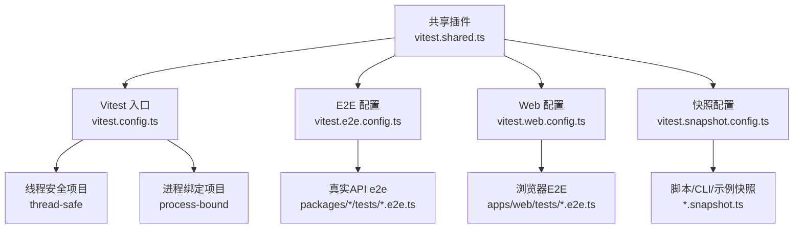
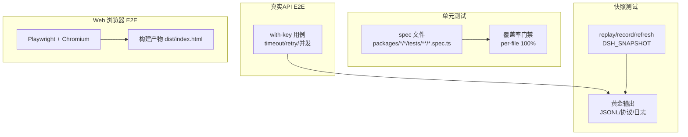
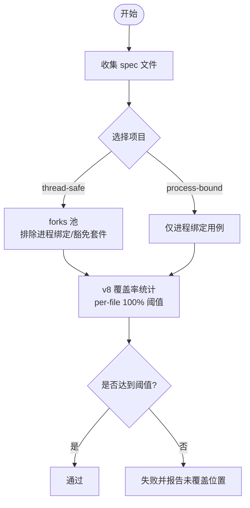
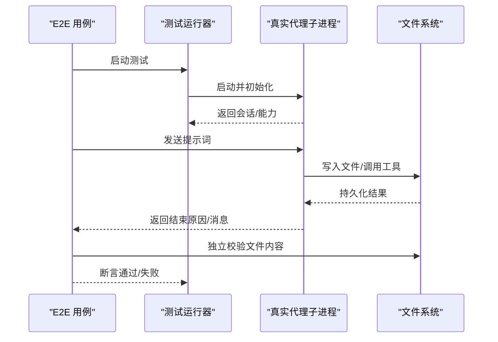
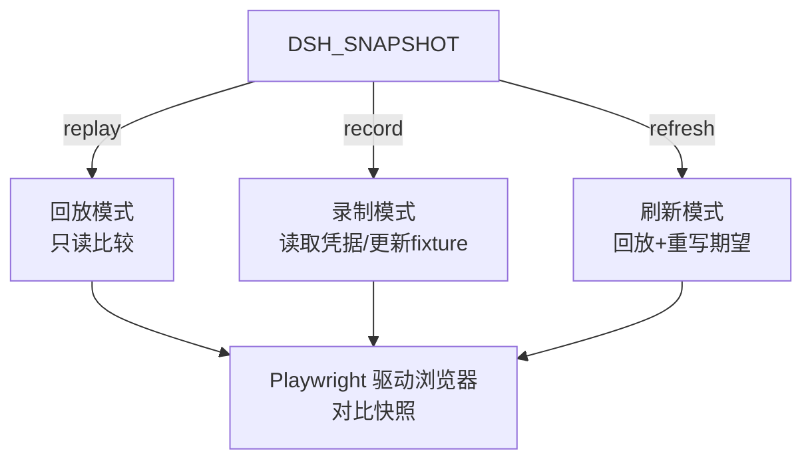
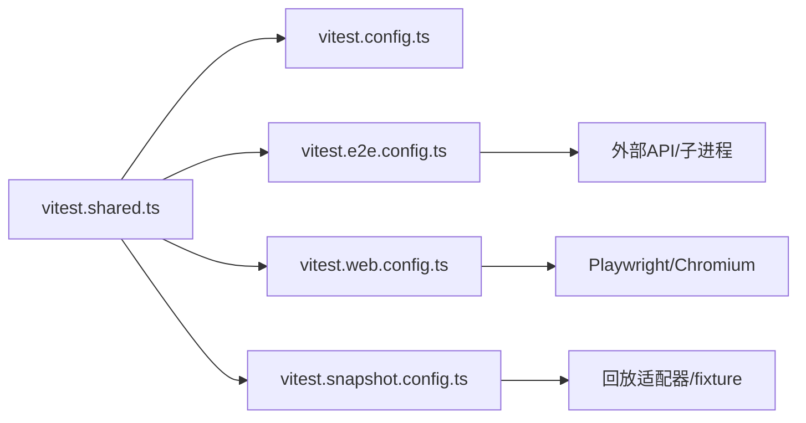

# 测试策略

<cite>
**本文引用的文件**
- [vitest.config.ts](file://vitest.config.ts)
- [vitest.e2e.config.ts](file://vitest.e2e.config.ts)
- [vitest.web.config.ts](file://vitest.web.config.ts)
- [vitest.snapshot.config.ts](file://vitest.snapshot.config.ts)
- [vitest.shared.ts](file://vitest.shared.ts)
- [docs/testing.md](file://docs/testing.md)
- [apps/web/tests/README.md](file://apps/web/tests/README.md)
- [apps/web/tests/support.ts](file://apps/web/tests/support.ts)
- [apps/web/tests/scaffold.ts](file://apps/web/tests/scaffold.ts)
- [examples/acp-agent/tests/acp.e2e.ts](file://examples/acp-agent/tests/acp.e2e.ts)
- [scripts/coverage-exempt.ts](file://scripts/coverage-exempt.ts)
</cite>

## 目录
1. [简介](#简介)
2. [项目结构](#项目结构)
3. [核心组件](#核心组件)
4. [架构总览](#架构总览)
5. [详细组件分析](#详细组件分析)
6. [依赖关系分析](#依赖关系分析)
7. [性能考量](#性能考量)
8. [故障排查指南](#故障排查指南)
9. [结论](#结论)
10. [附录](#附录)

## 简介
本文件面向仓库中的 Web 应用与相关工具链，系统化阐述单元测试、集成测试、端到端（E2E）测试与快照测试的实施方案；说明测试数据管理、测试环境配置、浏览器自动化与用例编写规范；给出覆盖率要求、持续集成要点与性能测试方法；并总结最佳实践与常见问题解决方案。内容基于仓库内现有测试配置与文档，确保可落地执行。

## 项目结构
仓库采用多包 + 多应用的 monorepo 结构，测试按“层”组织：
- 单元测试：Vitest 运行 packages 与 scripts 下的 spec 文件，严格覆盖率门禁。
- 真实 API E2E：针对外部模型/服务的 with-key 测试，具备超时、重试与并发控制。
- 快照测试：keyless 回放模式为主，支持 record/refresh 更新黄金输出。
- Web 浏览器 E2E：使用 Playwright + Chromium 驱动真实前端构建产物，进行 UI 回归与快照比对。

图表来源
- [vitest.config.ts:128-170](file://vitest.config.ts#L128-L170)
- [vitest.e2e.config.ts:31-58](file://vitest.e2e.config.ts#L31-L58)
- [vitest.web.config.ts:16-36](file://vitest.web.config.ts#L16-L36)
- [vitest.snapshot.config.ts:39-68](file://vitest.snapshot.config.ts#L39-L68)
- [vitest.shared.ts:1-43](file://vitest.shared.ts#L1-L43)

章节来源
- [docs/testing.md:7-15](file://docs/testing.md#L7-L15)
- [vitest.config.ts:90-170](file://vitest.config.ts#L90-L170)
- [vitest.e2e.config.ts:31-58](file://vitest.e2e.config.ts#L31-L58)
- [vitest.web.config.ts:16-36](file://vitest.web.config.ts#L16-L36)
- [vitest.snapshot.config.ts:39-68](file://vitest.snapshot.config.ts#L39-L68)

## 核心组件
- Vitest 多项目与覆盖率门禁：通过 projects 将“线程安全”和“进程绑定”两类测试隔离，统一 v8 覆盖率统计，强制 per-file 100% 阈值（可通过分区模式关闭）。
- E2E 配置：加载 .env，设置较长超时与重试，限制并发以保护共享配额。
- Web 浏览器 E2E：串行执行避免竞争，配合 Playwright 驱动真实构建产物，CI 强制 replay 模式。
- 快照测试：默认 keyless replay，record/refresh 分别用于采集与刷新黄金输出；并发受环境变量控制。
- 共享能力：TypeScript 装饰器预转换、Node Web Storage 标志处理等。

章节来源
- [vitest.config.ts:128-298](file://vitest.config.ts#L128-L298)
- [vitest.e2e.config.ts:1-58](file://vitest.e2e.config.ts#L1-L58)
- [vitest.web.config.ts:1-36](file://vitest.web.config.ts#L1-L36)
- [vitest.snapshot.config.ts:1-68](file://vitest.snapshot.config.ts#L1-L68)
- [vitest.shared.ts:1-43](file://vitest.shared.ts#L1-L43)

## 架构总览
下图展示四层测试在仓库中的职责边界与交互关系：

图表来源
- [vitest.config.ts:171-298](file://vitest.config.ts#L171-L298)
- [vitest.e2e.config.ts:45-56](file://vitest.e2e.config.ts#L45-L56)
- [vitest.snapshot.config.ts:24-68](file://vitest.snapshot.config.ts#L24-L68)
- [vitest.web.config.ts:24-35](file://vitest.web.config.ts#L24-L35)

## 详细组件分析

### 单元测试与覆盖率门禁
- 目标范围：packages 与 scripts 的 spec 文件；通过 tsconfig.base.json 路径映射解析源码，避免加载已构建产物导致单例重复。
- 项目划分：
  - thread-safe：默认池为 forks，排除进程绑定与覆盖豁免的重型套件。
  - process-bound：仅包含进程绑定用例，保证稳定性。
- 覆盖率：v8 provider，include 限定到 src，exclude 剔除类型/入口/客户端未就绪区域；阈值 perFile 且语句/分支/函数/行均为 100%。
- 重型套件豁免：当开启 DSH_COVERAGE_EXEMPT_HEAVY=1，重负载套件在不插桩并行门中运行，不影响正确性信号但降低编译/子进程开销。

图表来源
- [vitest.config.ts:128-170](file://vitest.config.ts#L128-L170)
- [vitest.config.ts:171-298](file://vitest.config.ts#L171-L298)
- [scripts/coverage-exempt.ts:1-43](file://scripts/coverage-exempt.ts#L1-L43)

章节来源
- [vitest.config.ts:90-170](file://vitest.config.ts#L90-L170)
- [vitest.config.ts:171-298](file://vitest.config.ts#L171-L298)
- [scripts/coverage-exempt.ts:1-43](file://scripts/coverage-exempt.ts#L1-L43)

### 真实 API 集成/E2E 测试
- 适用范围：packages/*/tests/*.e2e.ts、apps/cli/tests/*.e2e.ts、examples/*/tests/*.e2e.ts。
- 关键特性：
  - 自动加载根目录 .env（若存在），便于本地凭据注入。
  - 长超时与重试，缓解网络抖动与配额限制。
  - 并发可控：通过 DSH_E2E_MAX_WORKERS 调节文件级并发与最大工作进程数。
- 典型场景：启动真实代理子进程，发送提示词，断言文件系统结果或协议输出，验证“世界状态”而非自报告。

图表来源
- [vitest.e2e.config.ts:1-58](file://vitest.e2e.config.ts#L1-L58)
- [examples/acp-agent/tests/acp.e2e.ts:14-127](file://examples/acp-agent/tests/acp.e2e.ts#L14-L127)

章节来源
- [vitest.e2e.config.ts:1-58](file://vitest.e2e.config.ts#L1-L58)
- [examples/acp-agent/tests/acp.e2e.ts:14-127](file://examples/acp-agent/tests/acp.e2e.ts#L14-L127)

### 快照测试（含 Web 浏览器快照）
- 模式：
  - replay（默认）：keyless 回放，不写盘，比较预期输出。
  - record：读取凭据，调用真实 API，采集并更新 fixture 与期望输出。
  - refresh：keyless 回放并重写当前期望输出。
- 并发：replay 支持并行，maxConcurrency 由 DSH_SNAPSHOT_MAX_CONCURRENCY 控制；record/refresh 保持串行以避免竞态写。
- Web 浏览器快照：
  - 使用 Playwright + Chromium 驱动真实构建产物（dist/index.html）。
  - CI 强制 replay 模式，禁止写入；记录/刷新仅限本地。
  - 通过 scaffold 注入 LLM Replay 适配器，屏蔽真实模型调用，保证稳定与可重现。

图表来源
- [vitest.snapshot.config.ts:24-68](file://vitest.snapshot.config.ts#L24-L68)
- [vitest.web.config.ts:5-35](file://vitest.web.config.ts#L5-L35)
- [apps/web/tests/scaffold.ts:85-97](file://apps/web/tests/scaffold.ts#L85-L97)

章节来源
- [vitest.snapshot.config.ts:1-68](file://vitest.snapshot.config.ts#L1-L68)
- [vitest.web.config.ts:1-36](file://vitest.web.config.ts#L1-L36)
- [apps/web/tests/scaffold.ts:85-97](file://apps/web/tests/scaffold.ts#L85-L97)

### 测试数据管理与环境配置
- 环境变量：
  - DSH_SNAPSHOT：控制快照模式（replay/record/refresh）。
  - DSH_SNAPSHOT_MAX_CONCURRENCY：快照并发上限。
  - DSH_E2E_MAX_WORKERS：E2E 并发上限。
  - DSH_COVERAGE_EXEMPT_HEAVY：启用重型套件豁免。
  - DEEPSEEK_API_KEY 等：真实 API 凭据（可选，keyless 用例会跳过）。
- 配置文件：
  - vitest.*.config.ts：各测试层的入口配置。
  - .env：可选的环境变量文件，E2E/Web/快照按需加载。
- Web 测试支撑：
  - support.ts 提供端口探测、页面创建、工作区连接、失败截图等通用能力。
  - scaffold.ts 负责真实 web 组合装配、LLM Replay 注入、临时工作区与持久化根隔离。

章节来源
- [vitest.e2e.config.ts:1-58](file://vitest.e2e.config.ts#L1-L58)
- [vitest.snapshot.config.ts:1-68](file://vitest.snapshot.config.ts#L1-L68)
- [vitest.web.config.ts:1-36](file://vitest.web.config.ts#L1-L36)
- [apps/web/tests/support.ts:1-137](file://apps/web/tests/support.ts#L1-L137)
- [apps/web/tests/scaffold.ts:1-200](file://apps/web/tests/scaffold.ts#L1-L200)

### 浏览器自动化与用例编写规范
- 框架：Playwright + Chromium，通过 vitest.web.config.ts 纳入 apps/web/tests/*.e2e.ts。
- 运行约束：
  - 串行执行避免竞争（fileParallelism: false）。
  - 更长超时与钩子超时，适配真实前端生命周期。
  - CI 强制 replay，禁止写入快照。
- 用例规范：
  - 优先断言“世界状态”（如文件、协议帧、UI 文本），而非仅检查自报告。
  - 每个用例拥有并释放资源（afterEach 清理）。
  - 避免从 Host 侧导入 Client 包，防止构建图污染；必要时镜像常量。
  - 使用 support.ts 提供的 helper 完成工作区连接、截图等。

章节来源
- [vitest.web.config.ts:16-36](file://vitest.web.config.ts#L16-L36)
- [apps/web/tests/README.md:1-47](file://apps/web/tests/README.md#L1-L47)
- [apps/web/tests/support.ts:1-137](file://apps/web/tests/support.ts#L1-L137)

### 测试覆盖率要求
- 强制 per-file 100% 阈值（语句/分支/函数/行），确保每文件充分覆盖，避免大文件补贴小文件。
- 对无法在 jsdom 或 Node 环境下覆盖的客户端代码，通过 exclude 列表暂放，后续逐步补齐。
- 重型套件可在覆盖门中豁免，但不影响正确性信号。

章节来源
- [vitest.config.ts:171-298](file://vitest.config.ts#L171-L298)
- [scripts/coverage-exempt.ts:1-43](file://scripts/coverage-exempt.ts#L1-L43)

### 持续集成要点
- 分层运行：
  - 单元测试：聚合两个项目，严格覆盖率门禁。
  - E2E：with-key 用例具备重试与并发控制。
  - 快照：默认 replay，CI 禁止写入；record/refresh 本地执行。
  - Web：CI 强制 replay，先构建再运行。
- 凭据管理：E2E/Web/快照按需加载 .env；无凭据时用例自跳过，保障 keyless CI 绿色。

章节来源
- [vitest.config.ts:128-298](file://vitest.config.ts#L128-L298)
- [vitest.e2e.config.ts:1-58](file://vitest.e2e.config.ts#L1-L58)
- [vitest.snapshot.config.ts:24-68](file://vitest.snapshot.config.ts#L24-L68)
- [vitest.web.config.ts:5-35](file://vitest.web.config.ts#L5-L35)

### 性能测试方法
- 压力测试：stress-tests 目录提供针对推理分片等场景的压力用例，可用于评估吞吐与内存占用。
- 快照并发：通过 DSH_SNAPSHOT_MAX_CONCURRENCY 调整回放并发，平衡速度与稳定性。
- E2E 并发：通过 DSH_E2E_MAX_WORKERS 控制文件级并行度，避免触发配额限制。

章节来源
- [vitest.snapshot.config.ts:19-22](file://vitest.snapshot.config.ts#L19-L22)
- [vitest.e2e.config.ts:16-29](file://vitest.e2e.config.ts#L16-L29)

## 依赖关系分析
- 共享插件 vitest.shared.ts 被所有 Vitest 配置复用，提供装饰器转译与 execArgv 处理。
- 各层配置通过 include/exclude 精确控制测试范围，避免无关模块进入运行图。
- Web 测试依赖 Playwright 与构建产物；E2E 依赖真实子进程与外部服务；快照依赖回放适配器与固定 fixture。

图表来源
- [vitest.shared.ts:1-43](file://vitest.shared.ts#L1-L43)
- [vitest.config.ts:128-170](file://vitest.config.ts#L128-L170)
- [vitest.e2e.config.ts:31-58](file://vitest.e2e.config.ts#L31-L58)
- [vitest.web.config.ts:16-36](file://vitest.web.config.ts#L16-L36)
- [vitest.snapshot.config.ts:39-68](file://vitest.snapshot.config.ts#L39-L68)

章节来源
- [vitest.shared.ts:1-43](file://vitest.shared.ts#L1-L43)
- [vitest.config.ts:128-170](file://vitest.config.ts#L128-L170)
- [vitest.e2e.config.ts:31-58](file://vitest.e2e.config.ts#L31-L58)
- [vitest.web.config.ts:16-36](file://vitest.web.config.ts#L16-L36)
- [vitest.snapshot.config.ts:39-68](file://vitest.snapshot.config.ts#L39-L68)

## 性能考量
- 使用 forks 池提升 Node 稳定性，避免 worker 线程在某些平台上的崩溃问题。
- 对重型套件（编译器分析、子进程）在覆盖门中豁免，减少插桩成本。
- E2E 与快照并发可调，兼顾速度与稳定性；CI 下优先稳定性。
- Web 测试串行执行，避免 HMR/动态装配导致的竞争条件。

[本节为通用指导，无需特定文件引用]

## 故障排查指南
- 覆盖率失败：查看 per-file 未覆盖位置报告，确认是否为死代码或需补充测试；必要时调整 exclude 并附理由。
- E2E 不稳定：适当降低 DSH_E2E_MAX_WORKERS；增加重试；检查凭据与配额。
- 快照不一致：确认 DSH_SNAPSHOT 模式；replay 不应写盘；record/refresh 后需人工审查差异。
- Web 测试失败：确保已构建 dist；检查浏览器语言与视图尺寸；使用 saveFailureShot 保存失败截图。

章节来源
- [vitest.config.ts:171-298](file://vitest.config.ts#L171-L298)
- [vitest.e2e.config.ts:45-56](file://vitest.e2e.config.ts#L45-L56)
- [vitest.snapshot.config.ts:24-68](file://vitest.snapshot.config.ts#L24-L68)
- [apps/web/tests/support.ts:34-39](file://apps/web/tests/support.ts#L34-L39)
- [apps/web/tests/support.ts:113-122](file://apps/web/tests/support.ts#L113-L122)

## 结论
本仓库建立了分层清晰、可复现、可扩展的测试体系：单元测试严格覆盖率门禁，E2E 聚焦真实世界状态验证，快照测试保障协议与呈现一致性，Web 浏览器 E2E 守护前端体验。通过环境变量与配置项灵活控制并发与模式，结合 CI 门禁与本地开发流程，形成闭环质量保障。建议在新功能或变更时同步扩展对应层级用例与快照，确保长期可维护性。

[本节为总结性内容，无需特定文件引用]

## 附录
- 命令参考（来自 docs/testing.md）：
  - 单元测试：pnpm run test
  - 覆盖率门禁：pnpm run test:coverage
  - 真实 API E2E：pnpm run test:e2e
  - 快照测试：pnpm run test:snapshot（record/refresh 见下文）
  - Web 浏览器 E2E：pnpm run test:web（CI 强制 replay）

章节来源
- [docs/testing.md:7-15](file://docs/testing.md#L7-L15)