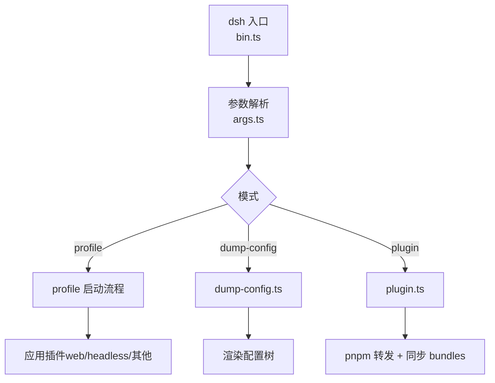
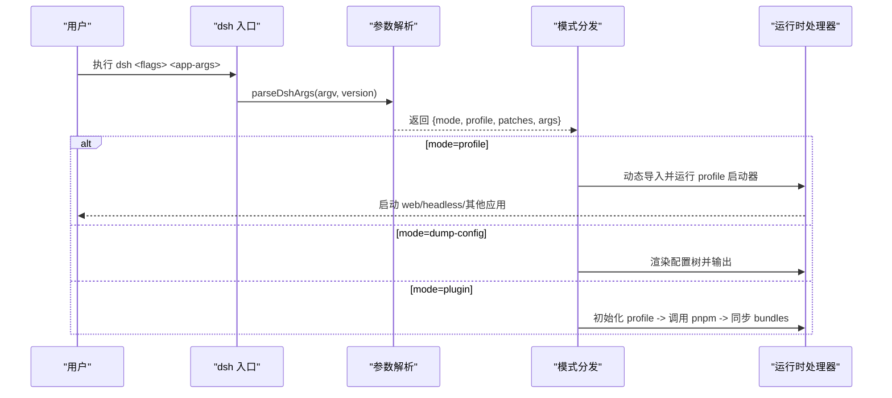
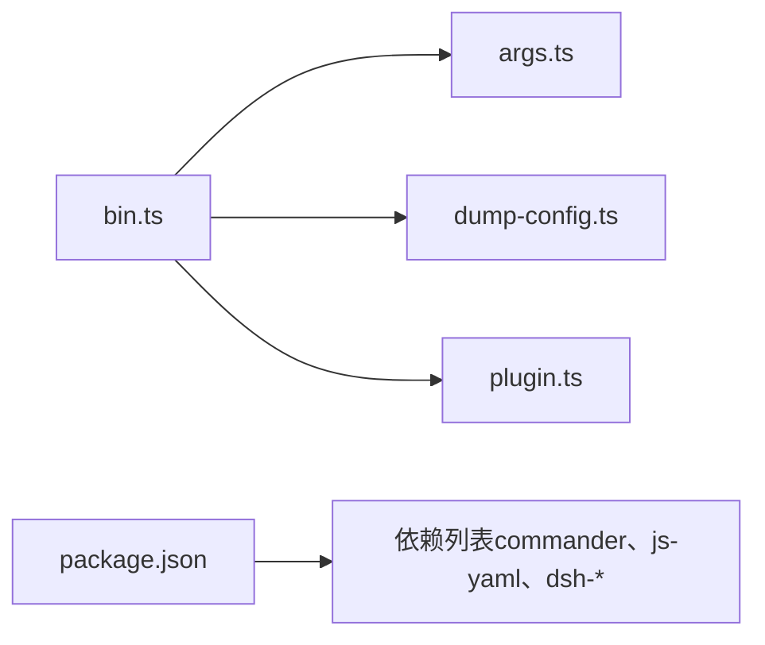

# 命令行工具

<cite>
**本文引用的文件**
- [apps/cli/src/bin.ts](file://apps/cli/src/bin.ts)
- [apps/cli/src/args.ts](file://apps/cli/src/args.ts)
- [apps/cli/src/dump-config.ts](file://apps/cli/src/dump-config.ts)
- [apps/cli/src/plugin.ts](file://apps/cli/src/plugin.ts)
- [apps/cli/package.json](file://apps/cli/package.json)
- [apps/cli/README.md](file://apps/cli/README.md)
- [apps/cli/README.zh.md](file://apps/cli/README.zh.md)
- [apps/cli/config/agent-presets/code/preset.yml](file://apps/cli/config/agent-presets/code/preset.yml)
- [apps/cli/config/agent-presets/cordis/preset.yml](file://apps/cli/config/agent-presets/cordis/preset.yml)
- [apps/cli/config/agent-presets/minimal/preset.yml](file://apps/cli/config/agent-presets/minimal/preset.yml)
- [apps/cli/config/agent-presets/standard/preset.yml](file://apps/cli/config/agent-presets/standard/preset.yml)
</cite>

## 目录
1. [简介](#简介)
2. [项目结构](#项目结构)
3. [核心组件](#核心组件)
4. [架构总览](#架构总览)
5. [详细组件分析](#详细组件分析)
6. [依赖关系分析](#依赖关系分析)
7. [性能与启动特性](#性能与启动特性)
8. [故障排除指南](#故障排除指南)
9. [结论](#结论)
10. [附录：常用工作流与示例](#附录：常用工作流与示例)

## 简介
本文件面向 DeepSeek Harness 的命令行工具 dsh，系统化说明其命令、参数、配置与运行模式（web、headless、serve），并提供预设配置管理、脚本自动化、调试技巧、日志输出格式与常见工作流的命令行实现。dsh 通过“profile”机制组合插件与补丁层，支持在首次使用时自动初始化 web 与 headless profile，并通过子命令 plugin 管理 profile 的插件依赖。

## 项目结构
- 入口与调度
  - 二进制入口负责解析版本、加载环境变量、解析参数并动态分发到不同模式。
  - 参数解析器仅处理 dsh 自身标志，将剩余参数原样传递给已启动的应用插件。
- 功能模块
  - dump-config：在不启动应用的情况下渲染组合后的配置树。
  - plugin：以 pnpm 为后端管理 profile 插件，并在安装后同步 bundles 列表。
- 预设配置
  - 内置 agent preset 定义名称、描述与排序，用于 UI 或上层选择。

图表来源
- [apps/cli/src/bin.ts:1-54](file://apps/cli/src/bin.ts#L1-L54)
- [apps/cli/src/args.ts:1-192](file://apps/cli/src/args.ts#L1-L192)
- [apps/cli/src/dump-config.ts:1-54](file://apps/cli/src/dump-config.ts#L1-L54)
- [apps/cli/src/plugin.ts:1-159](file://apps/cli/src/plugin.ts#L1-L159)

章节来源
- [apps/cli/src/bin.ts:1-54](file://apps/cli/src/bin.ts#L1-L54)
- [apps/cli/src/args.ts:1-192](file://apps/cli/src/args.ts#L1-L192)
- [apps/cli/README.zh.md:1-48](file://apps/cli/README.zh.md#L1-L48)

## 核心组件
- 入口调度（bin.ts）
  - 读取版本、加载分层环境变量、解析参数，按模式动态导入对应处理器。
- 参数解析（args.ts）
  - 定义 dsh 主命令与子命令 web、plugin；支持 --profile、--patch、--dump-config、--dump-default-config；将未知参数透传给被启动的应用。
- 配置转储（dump-config.ts）
  - 基于 include 插件的 patch 算法，逐层渲染配置，不启动应用，便于诊断。
- 插件管理（plugin.ts）
  - 首次使用自动初始化 profile；转发 pnpm 命令；根据实际安装状态同步 dsh.profile.bundles；对 git 依赖构建失败给出提示。

章节来源
- [apps/cli/src/bin.ts:1-54](file://apps/cli/src/bin.ts#L1-L54)
- [apps/cli/src/args.ts:1-192](file://apps/cli/src/args.ts#L1-L192)
- [apps/cli/src/dump-config.ts:1-54](file://apps/cli/src/dump-config.ts#L1-L54)
- [apps/cli/src/plugin.ts:1-159](file://apps/cli/src/plugin.ts#L1-L159)

## 架构总览
dsh 采用“启动器 + 注入式应用插件”的架构：启动器只负责最小化的 CLI 与 profile 装配，具体行为由注入的插件提供。web、headless 等模式通过不同的 profile 与 bundles 组合实现。

图表来源
- [apps/cli/src/bin.ts:1-54](file://apps/cli/src/bin.ts#L1-L54)
- [apps/cli/src/args.ts:1-192](file://apps/cli/src/args.ts#L1-L192)

## 详细组件分析

### 命令与参数总览
- 顶层命令
  - dsh --profile <name> [--patch <path>...] [--dump-config | --dump-default-config] [<app-args...>]
  - dsh web [--patch <path>...] [--dump-config | --dump-default-config] [<app-args...>]
  - dsh plugin --profile <name> <pnpm-args...>
- 关键选项
  - --profile：指定要启动的 profile 名称。
  - --patch：追加一层覆盖配置，可重复。
  - --dump-config：打印组合后的 profile 配置树并退出。
  - --dump-default-config：仅打印 bundle 层（不含用户层与 --patch），用于恢复诊断。
  - --help/--version：分别打印帮助与版本。
- 参数传递规则
  - 启动器先解析自身 flags；第一个无法识别的 token 开始即为应用参数，交由被启动的应用插件解析。

章节来源
- [apps/cli/src/args.ts:1-192](file://apps/cli/src/args.ts#L1-L192)
- [apps/cli/README.zh.md:1-48](file://apps/cli/README.zh.md#L1-L48)

### 运行模式：web、headless、serve
- web
  - 用途：启动 Web 界面，适合交互式开发与调试。
  - 用法：dsh web 或 dsh --profile web；端口等参数由 web 应用自身解析。
- headless
  - 用途：无头模式，适合批处理任务、CI 与脚本化执行。
  - 用法：dsh --profile headless "<任务>"；一次性持久会话，完成后退出。
- serve
  - 说明：当前 dsh 入口未直接暴露 serve 子命令；如需服务化能力，通常通过 web 模式对外提供服务或通过外部进程管理。
  - 建议：结合 web 模式的端口与环境变量进行部署。

章节来源
- [apps/cli/README.zh.md:1-48](file://apps/cli/README.zh.md#L1-L48)
- [apps/cli/src/args.ts:1-192](file://apps/cli/src/args.ts#L1-L192)

### 配置与预设管理
- Profile 组成顺序
  - 空根 → bundles 中各组合包的 patch → profile 自身的 cordis.patch.yml → $DSH_HOME/cordis.patch.yml → --patch 覆盖层。
- 查看组合结果
  - --dump-default-config：仅显示 bundle 层，便于定位默认行为。
  - --dump-config：显示完整组合树（含用户层与 --patch）。
- 预设配置（agent presets）
  - 内置 preset 包含 name、description、order，用于 UI 展示与选择。
  - 位置：apps/cli/config/agent-presets/*。

章节来源
- [apps/cli/README.zh.md:1-48](file://apps/cli/README.zh.md#L1-L48)
- [apps/cli/config/agent-presets/standard/preset.yml:1-4](file://apps/cli/config/agent-presets/standard/preset.yml#L1-L4)
- [apps/cli/config/agent-presets/code/preset.yml:1-4](file://apps/cli/config/agent-presets/code/preset.yml#L1-L4)
- [apps/cli/config/agent-presets/cordis/preset.yml:1-4](file://apps/cli/config/agent-presets/cordis/preset.yml#L1-L4)
- [apps/cli/config/agent-presets/minimal/preset.yml:1-4](file://apps/cli/config/agent-presets/minimal/preset.yml#L1-L4)

### 插件管理与自动化
- 首次使用自动初始化
  - web 与 headless 会在首次使用时从模板初始化 profile。
- 插件安装与同步
  - dsh plugin --profile <name> <pnpm-args> 会：
    - 若不存在 package.json 则初始化 profile；
    - 在 profile 目录下执行 pnpm；
    - 成功后根据实际安装状态同步 dsh.profile.bundles。
- 相对路径锚定
  - 对 file:/link: 形式的相对路径会自动锚定到 dsh 的调用目录，避免误解析到 profile 目录。
- Git 依赖构建失败提示
  - 当 pnpm 因安全策略阻止 prepare 脚本时，会提示在 pnpm-workspace.yaml 中添加 allowBuilds。

章节来源
- [apps/cli/src/plugin.ts:1-159](file://apps/cli/src/plugin.ts#L1-L159)
- [apps/cli/README.zh.md:1-48](file://apps/cli/README.zh.md#L1-L48)

### 错误处理与退出码
- 参数错误
  - 缺少必要参数、互斥选项冲突、向 dump-config 传入应用参数等都会报错并退出非零。
- 环境缺失
  - 未找到 pnpm 时返回特定退出码并提示安装。
- 配置与启动失败
  - 配置错误、启动失败均会导致非零退出，便于 CI 集成。

章节来源
- [apps/cli/src/args.ts:1-192](file://apps/cli/src/args.ts#L1-L192)
- [apps/cli/src/plugin.ts:1-159](file://apps/cli/src/plugin.ts#L1-L159)

## 依赖关系分析
- 包声明
  - bin 入口映射到 lib/bin.js；依赖 commander、js-yaml 及大量 dsh-* 插件包。
- 运行时依赖
  - 通过 Cordis 插件体系注入能力；web、headless 等由不同 bundles 提供。

图表来源
- [apps/cli/src/bin.ts:1-54](file://apps/cli/src/bin.ts#L1-L54)
- [apps/cli/src/args.ts:1-192](file://apps/cli/src/args.ts#L1-L192)
- [apps/cli/src/dump-config.ts:1-54](file://apps/cli/src/dump-config.ts#L1-L54)
- [apps/cli/src/plugin.ts:1-159](file://apps/cli/src/plugin.ts#L1-L159)
- [apps/cli/package.json:1-103](file://apps/cli/package.json#L1-L103)

章节来源
- [apps/cli/package.json:1-103](file://apps/cli/package.json#L1-L103)

## 性能与启动特性
- 动态导入
  - 入口按模式动态导入处理器，减少无关代码进入启动路径，缩短冷启动时间。
- 配置转储
  - dump-config 不启动应用，仅计算并渲染配置树，适合快速诊断。
- 插件同步
  - 仅在 pnpm 成功时同步 bundles，避免不必要的写入。

章节来源
- [apps/cli/src/bin.ts:1-54](file://apps/cli/src/bin.ts#L1-L54)
- [apps/cli/src/dump-config.ts:1-54](file://apps/cli/src/dump-config.ts#L1-L54)
- [apps/cli/src/plugin.ts:1-159](file://apps/cli/src/plugin.ts#L1-L159)

## 故障排除指南
- 常见问题
  - 未指定 --profile：需显式指定 profile 名称。
  - 互斥选项冲突：--dump-config 与 --dump-default-config 不可同时使用。
  - 向 dump-config 传入应用参数：不被允许。
  - pnpm 未安装或未在 PATH：安装 pnpm 后再试。
  - Git 依赖构建失败：按提示在 pnpm-workspace.yaml 添加 allowBuilds。
- 诊断步骤
  - 使用 --dump-default-config 查看默认层是否异常。
  - 使用 --dump-config 查看完整组合树，定位覆盖来源。
  - 检查 profile 目录是否存在 cordis.patch.yml 与 dsh.profile。
- 日志与输出
  - 启动器与插件管理器会输出错误与警告信息；应用自身帮助与日志由其插件提供。

章节来源
- [apps/cli/src/args.ts:1-192](file://apps/cli/src/args.ts#L1-L192)
- [apps/cli/src/plugin.ts:1-159](file://apps/cli/src/plugin.ts#L1-L159)
- [apps/cli/src/dump-config.ts:1-54](file://apps/cli/src/dump-config.ts#L1-L54)

## 结论
dsh 通过“profile + bundles + patch”的组合方式，提供了高度可配置的启动体验。web 与 headless 模式覆盖了交互与自动化场景；plugin 子命令简化了插件生命周期管理；dump-config 提供了强大的配置诊断能力。遵循参数传递规则与最佳实践，可在本地开发、CI 与生产环境中稳定运行。

## 附录：常用工作流与示例
- 启动 Web 界面
  - dsh web
  - dsh --profile web --port 8080
- 运行一次无头任务
  - dsh --profile headless "run the tests"
- 自定义覆盖层
  - dsh --profile tui --patch ./extra.yml
- 查看组合配置
  - dsh --profile web --dump-default-config
  - dsh --profile tui --dump-config
- 管理插件
  - dsh plugin --profile tui add <package>
  - dsh plugin --profile tui remove <package>
  - dsh plugin --profile tui why <package>
- 源码执行与构建
  - 生产运行需先构建产物；开发时可从仓库根运行 TypeScript 入口并转发参数。

章节来源
- [apps/cli/README.zh.md:1-48](file://apps/cli/README.zh.md#L1-L48)
- [apps/cli/src/args.ts:1-192](file://apps/cli/src/args.ts#L1-L192)
- [apps/cli/src/plugin.ts:1-159](file://apps/cli/src/plugin.ts#L1-L159)