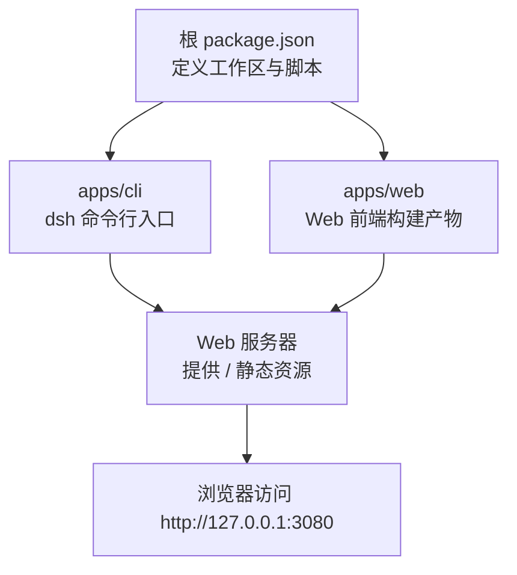
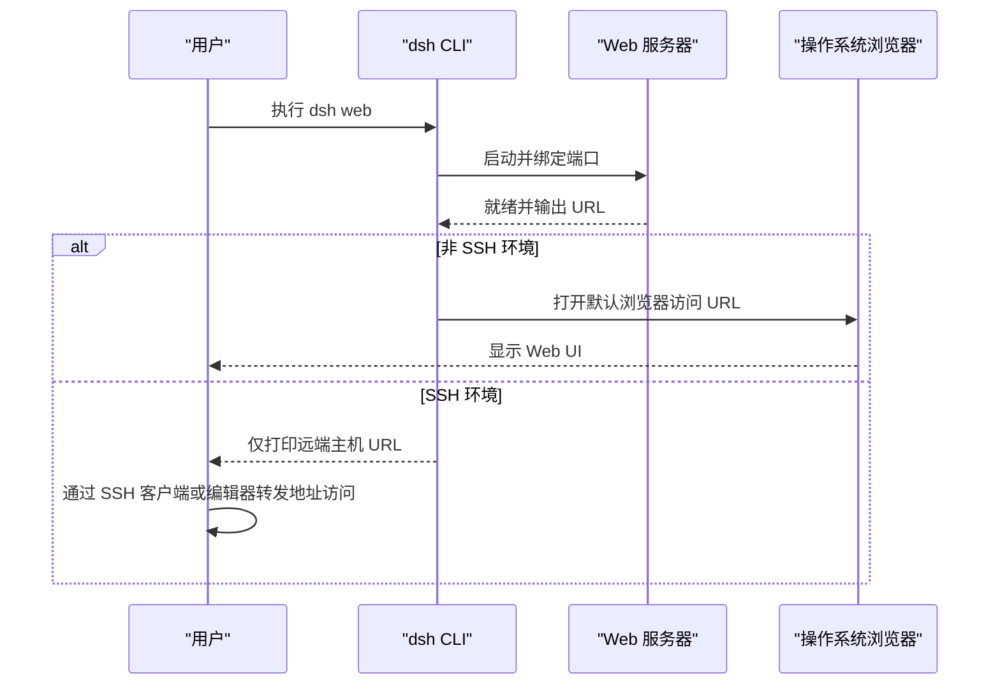
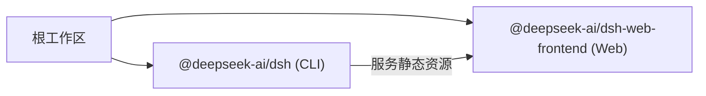

# 快速开始

<cite>
**本文引用的文件**
- [package.json](file://package.json)
- [README.md](file://README.md)
- [apps/cli/README.md](file://apps/cli/README.md)
- [apps/cli/src/bin.ts](file://apps/cli/src/bin.ts)
- [apps/web/package.json](file://apps/web/package.json)
- [docs/user/guide/index.md](file://docs/user/guide/index.md)
- [docs/user/guide/index.zh.md](file://docs/user/guide/index.zh.md)
- [apps/cli/tests/web-browser-open.expected.e2e.ts](file://apps/cli/tests/web-browser-open.expected.e2e.ts)
</cite>

## 目录
1. [简介](#简介)
2. [项目结构](#项目结构)
3. [核心组件](#核心组件)
4. [架构总览](#架构总览)
5. [详细组件分析](#详细组件分析)
6. [依赖关系分析](#依赖关系分析)
7. [性能注意事项](#性能注意事项)
8. [故障排除指南](#故障排除指南)
9. [结论](#结论)
10. [附录](#附录)

## 简介
本指南帮助你在最短时间内安装并运行 DeepSeek Harness（dsh），体验 Web 界面的核心功能。你将了解：
- 环境要求（Node.js、pnpm）
- 两种安装方式（从 npm 包直接运行、从源码构建）
- 基本启动命令与常用选项
- Web 界面本地启动与 SSH 模式的区别
- 常见问题的排查方法

## 项目结构
仓库采用 monorepo 组织，核心入口与应用如下：
- CLI 应用：apps/cli，提供 dsh 命令与 web 模式
- Web 前端：apps/web，使用 Vite 构建静态资源，由 CLI 的 web 模式服务
- 用户指南：docs/user/guide，包含 Web UI 使用说明

图表来源
- [package.json:1-20](file://package.json#L1-L20)
- [apps/cli/README.md:1-20](file://apps/cli/README.md#L1-L20)
- [apps/web/package.json:1-30](file://apps/web/package.json#L1-L30)

章节来源
- [package.json:1-20](file://package.json#L1-L20)
- [apps/cli/README.md:1-20](file://apps/cli/README.md#L1-L20)
- [apps/web/package.json:1-30](file://apps/web/package.json#L1-L30)

## 核心组件
- dsh CLI：统一的应用启动器，支持 web、headless、sdk 等 profile；web 是 Web UI 的别名
- Web 前端：Vite 构建的 React 应用，作为静态资源被 CLI 的 web 模式提供
- 用户指南：说明如何配置模型、选择工作区、运行任务

章节来源
- [apps/cli/README.md:1-20](file://apps/cli/README.md#L1-L20)
- [apps/web/package.json:1-30](file://apps/web/package.json#L1-L30)
- [docs/user/guide/index.zh.md:1-31](file://docs/user/guide/index.zh.md#L1-L31)

## 架构总览
下图展示从命令行到 Web 界面的调用流程，包括本地自动打开浏览器与 SSH 模式的行为差异。

图表来源
- [apps/cli/src/bin.ts:1-51](file://apps/cli/src/bin.ts#L1-L51)
- [apps/cli/tests/web-browser-open.expected.e2e.ts:147-191](file://apps/cli/tests/web-browser-open.expected.e2e.ts#L147-L191)

## 详细组件分析

### 环境要求
- Node.js：^22.19.0 或 >=24.0.0
- pnpm：11.7.0（由根 packageManager 指定）
- 可选：系统默认浏览器（用于本地自动打开）

章节来源
- [package.json:1-10](file://package.json#L1-L10)

### 安装与运行

#### 方式一：从 npm 包运行（推荐新手）
- 安装 Node.js
- 运行以下命令即可启动 Web UI，默认监听 http://127.0.0.1:3080，并在本地自动打开浏览器
- 如需仅启动服务器而不打开浏览器，可添加 --no-open

章节来源
- [README.md:17-28](file://README.md#L17-L28)

#### 方式二：从源码构建并运行
- 克隆仓库并进入目录
- 使用 pnpm 安装依赖
- 构建产物
- 运行 dsh web

章节来源
- [README.md:29-42](file://README.md#L29-L42)

### 启动命令与常用选项
- 基本命令：dsh web
- 常用选项：
  - --port <端口>：设置监听端口
  - --no-open：不自动打开浏览器
  - --help：查看 web 应用的参数帮助
- 注意：第一个不被 CLI 识别的参数将交给已启动的 profile（如 web）处理

章节来源
- [apps/cli/README.md:21-31](file://apps/cli/README.md#L21-L31)

### Web 界面使用方法
- 启动后，在浏览器中访问输出的 URL
- 首次使用需配置模型（设置 → 模型），输入 API 密钥后即可使用
- 选择工作区（Choose workspace）以启用会话编辑能力
- 发送消息即可让 Agent 读取/编辑文件、运行命令、委派任务并维护计划

章节来源
- [docs/user/guide/index.zh.md:1-31](file://docs/user/guide/index.zh.md#L1-L31)

### 本地启动与 SSH 模式的区别
- 本地启动：默认自动打开浏览器访问已就绪页面；可通过 --no-open 关闭自动打开
- SSH 模式：进程检测到 SSH 环境变量时不会尝试打开本地浏览器，仅打印远端主机 URL；由你的 SSH 客户端或编辑器负责转发并打开本地地址

章节来源
- [apps/cli/tests/web-browser-open.expected.e2e.ts:147-191](file://apps/cli/tests/web-browser-open.expected.e2e.ts#L147-L191)

## 依赖关系分析
- 根工作区管理 apps/cli 与 apps/web 等子包
- CLI 提供 web 命令，服务 Web 前端的构建产物
- Web 前端通过 Vite 构建为静态资源，供 CLI 的 web 模式提供

图表来源
- [package.json:11-18](file://package.json#L11-L18)
- [apps/web/package.json:1-30](file://apps/web/package.json#L1-L30)

章节来源
- [package.json:11-18](file://package.json#L11-L18)
- [apps/web/package.json:1-30](file://apps/web/package.json#L1-L30)

## 性能注意事项
- 首次构建可能较慢，后续运行可直接使用已构建产物
- 若仅需服务器而不需要自动打开浏览器，使用 --no-open 可减少一次外部进程交互
- 在远程服务器部署时，优先使用 SSH 模式并通过端口转发访问，避免不必要的本地浏览器操作

[本节为通用建议，无需特定文件引用]

## 故障排除指南
- 无法自动打开浏览器
  - 现象：本地启动未弹出浏览器
  - 处理：确认系统默认浏览器可用；或使用 --no-open 手动复制 URL 访问
- SSH 环境下未打开浏览器
  - 现象：SSH 启动只打印远端 URL，不打开本地浏览器
  - 处理：这是预期行为；请通过 SSH 客户端或编辑器的端口转发访问本地地址
- 端口占用
  - 现象：启动失败或端口冲突
  - 处理：更换 --port 指定其他端口
- 构建失败
  - 现象：从源码构建时报错
  - 处理：确认 Node.js 版本满足要求；清理缓存后重试；确保 pnpm 版本正确
- 无工作区导致不可用
  - 现象：会话输入框不可用
  - 处理：在 Web UI 中选择工作区后再进行对话

章节来源
- [apps/cli/tests/web-browser-open.expected.e2e.ts:147-191](file://apps/cli/tests/web-browser-open.expected.e2e.ts#L147-L191)
- [README.md:17-42](file://README.md#L17-L42)

## 结论
通过以上步骤，你可以在本地或远程环境中快速安装并运行 DeepSeek Harness，体验 Web 界面的核心功能。建议在本地开发时使用自动打开浏览器的便捷模式，在远程服务器上使用 SSH 模式并通过端口转发访问。遇到常见问题时，参考故障排除部分进行定位与解决。

[本节为总结性内容，无需特定文件引用]

## 附录
- 更多用法与进阶配置请参考用户指南与 CLI 文档
- 如需了解更多架构细节，可阅读仓库中的架构与子系统文档

[本节为补充信息，无需特定文件引用]