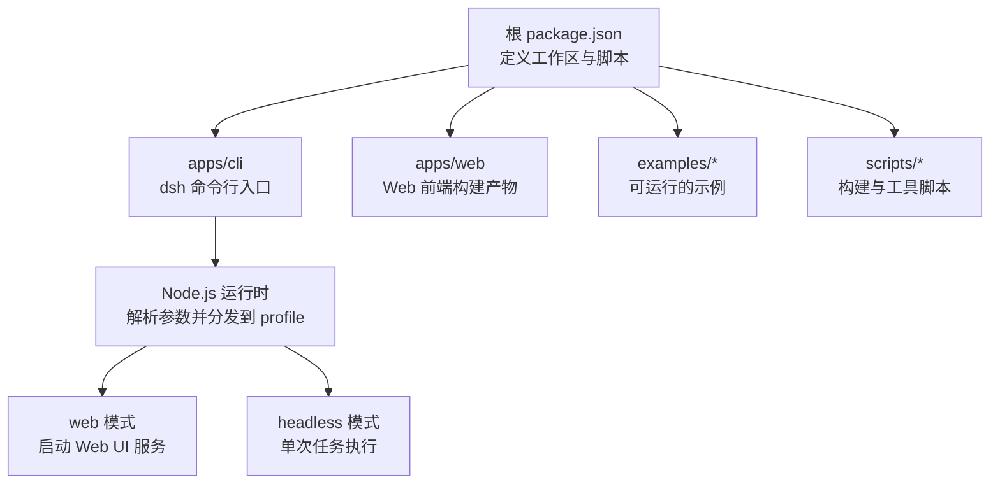
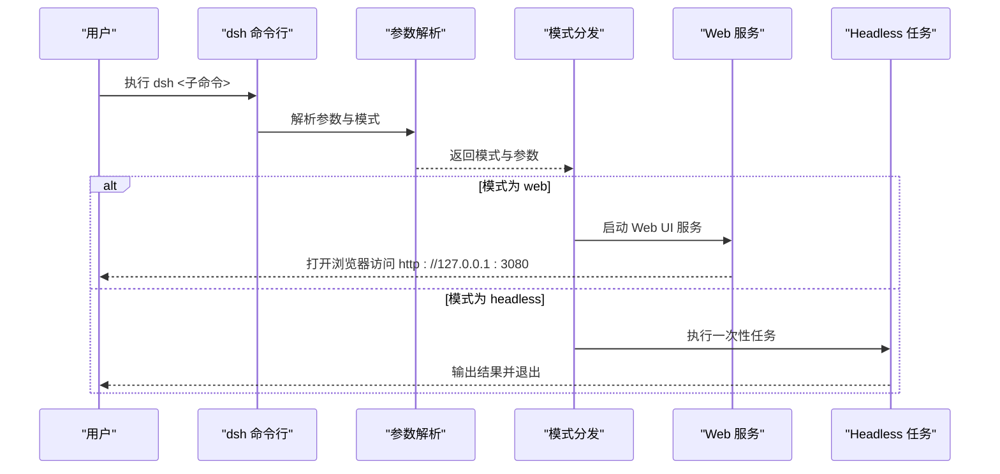
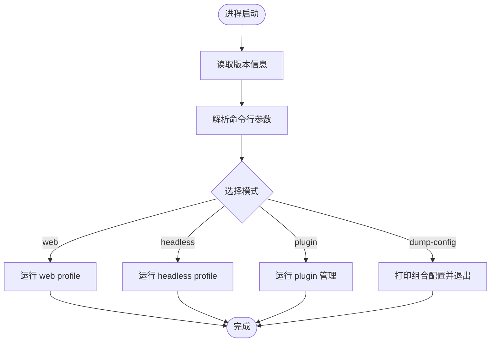
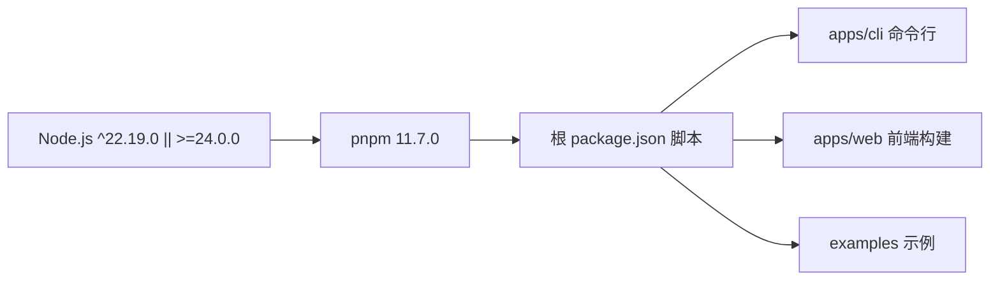

# 快速开始

<cite>
**本文引用的文件**
- [README.md](file://README.md)
- [package.json](file://package.json)
- [apps/cli/README.md](file://apps/cli/README.md)
- [apps/cli/src/bin.ts](file://apps/cli/src/bin.ts)
- [apps/cli/src/args.ts](file://apps/cli/src/args.ts)
- [apps/web/package.json](file://apps/web/package.json)
- [examples/headless-agent/README.md](file://examples/headless-agent/README.md)
- [examples/web-cordis/README.md](file://examples/web-cordis/README.md)
- [scripts/setup-dsh/setup.env.example](file://scripts/setup-dsh/setup.env.example)
</cite>

## 目录
1. [简介](#简介)
2. [项目结构](#项目结构)
3. [核心组件](#核心组件)
4. [架构总览](#架构总览)
5. [详细组件分析](#详细组件分析)
6. [依赖关系分析](#依赖关系分析)
7. [性能注意事项](#性能注意事项)
8. [故障排除指南](#故障排除指南)
9. [结论](#结论)
10. [附录：运行模式与示例命令](#附录运行模式与示例命令)

## 简介
DeepSeek Harness（简称 dsh）是一个开源的 Agent 运行框架，采用“一切皆插件”的架构，由 Cordis 驱动。它提供多种运行模式：Web UI、CLI（命令行）、以及无头模式（headless），便于在浏览器中交互、在终端中执行任务或在自动化流程中集成。

本快速开始指南将帮助你：
- 准备环境并安装依赖
- 通过 npm 或源码两种方式启动
- 配置必要的密钥与环境变量
- 运行第一个 Agent 示例
- 了解 Web UI、CLI、无头模式的快速启动方式
- 排查常见问题

## 项目结构
仓库采用 monorepo 组织，核心入口位于 apps/cli，Web 前端位于 apps/web，示例集中在 examples，构建脚本位于 scripts。根 package.json 定义了工作区与工作流脚本，包括构建、测试和 dsh CLI 的本地开发入口。

图表来源
- [package.json:19-47](file://package.json#L19-L47)
- [apps/cli/README.md:7-16](file://apps/cli/README.md#L7-L16)
- [apps/web/package.json:1-26](file://apps/web/package.json#L1-L26)

章节来源
- [README.md:13-37](file://README.md#L13-L37)
- [package.json:1-18](file://package.json#L1-L18)
- [apps/cli/README.md:7-16](file://apps/cli/README.md#L7-L16)
- [apps/web/package.json:1-26](file://apps/web/package.json#L1-L26)

## 核心组件
- dsh 命令行入口：负责解析参数、加载环境变量、根据模式动态导入并运行对应 profile（如 web、headless）。
- Web 前端：基于 Vite 构建，作为 dsh web 的服务内容被托管。
- 示例：提供 headless-agent、web-cordis 等可直接运行的演示。
- 环境配置：通过 .env 或 setup 脚本管理 API Key 等敏感信息。

章节来源
- [apps/cli/src/bin.ts:1-54](file://apps/cli/src/bin.ts#L1-L54)
- [apps/web/package.json:1-26](file://apps/web/package.json#L1-L26)
- [examples/headless-agent/README.md:7-16](file://examples/headless-agent/README.md#L7-L16)
- [scripts/setup-dsh/setup.env.example:1-55](file://scripts/setup-dsh/setup.env.example#L1-L55)

## 架构总览
dsh 的启动流程如下：
- 用户执行 dsh 命令
- 命令行解析参数并选择模式（web、headless 等）
- 根据模式动态加载对应的 profile 并启动应用
- Web 模式会启动本地服务并在默认浏览器打开；headless 模式执行一次性任务后退出

图表来源
- [apps/cli/src/bin.ts:27-53](file://apps/cli/src/bin.ts#L27-L53)
- [apps/cli/src/args.ts:147-169](file://apps/cli/src/args.ts#L147-L169)
- [README.md:15-37](file://README.md#L15-L37)

## 详细组件分析

### 命令行入口与参数解析
- 入口文件读取版本信息，解析命令行参数，并根据模式动态导入对应处理逻辑。
- 支持 --profile、web、plugin、dump-config 等能力，确保无效命令或错误选项以非零退出码结束。

图表来源
- [apps/cli/src/bin.ts:19-53](file://apps/cli/src/bin.ts#L19-L53)
- [apps/cli/src/args.ts:147-169](file://apps/cli/src/args.ts#L147-L169)

章节来源
- [apps/cli/src/bin.ts:1-54](file://apps/cli/src/bin.ts#L1-L54)
- [apps/cli/src/args.ts:147-169](file://apps/cli/src/args.ts#L147-L169)
- [apps/cli/README.md:7-16](file://apps/cli/README.md#L7-L16)

### Web 前端与构建
- Web 前端使用 Vite 构建，产物由 dsh web 托管。
- 开发时可通过根脚本 dev:web 进行监听与热更新。

章节来源
- [apps/web/package.json:1-26](file://apps/web/package.json#L1-L26)
- [package.json:22-26](file://package.json#L22-L26)
- [package.json:141-147](file://package.json#L141-L147)

### Headless 示例
- headless-agent 示例展示了如何以非交互方式执行一次任务，并输出最终结果。
- 需要设置 DEEPSEEK_API_KEY 等环境变量。

章节来源
- [examples/headless-agent/README.md:7-16](file://examples/headless-agent/README.md#L7-L16)
- [scripts/setup-dsh/setup.env.example:26-33](file://scripts/setup-dsh/setup.env.example#L26-L33)

### Web-Cordis 示例
- web-cordis 示例展示了如何在浏览器界面中查看与修改内存中的插件树。
- 需要设置 DEEPSEEK_API_KEY。

章节来源
- [examples/web-cordis/README.md:7-21](file://examples/web-cordis/README.md#L7-L21)
- [scripts/setup-dsh/setup.env.example:26-33](file://scripts/setup-dsh/setup.env.example#L26-L33)

## 依赖关系分析
- Node.js 版本要求：^22.19.0 或 >=24.0.0
- 包管理器：pnpm@11.7.0
- 工作区包含 vendor、packages、native、apps、website 等子目录
- 根脚本提供构建、测试、类型检查、文档生成等能力

图表来源
- [package.json:1-18](file://package.json#L1-L18)
- [package.json:19-47](file://package.json#L19-L47)

章节来源
- [package.json:1-18](file://package.json#L1-L18)
- [package.json:19-47](file://package.json#L19-L47)

## 性能注意事项
- 首次构建可能耗时较长，建议先执行构建再运行，避免重复编译。
- Web 模式默认监听本地端口并在浏览器自动打开；如需仅启动服务不打开浏览器，可使用相应参数。
- Headless 模式适合自动化场景，执行完成后立即退出，资源占用较低。

[本节为通用指导，不直接分析具体文件]

## 故障排除指南
- 无法找到 API Key：确认已在 .env 或环境中设置了 DEEPSEEK_API_KEY。
- Web 页面白屏或提示缺少引导对象：请通过 dsh web 启动，而不是直接运行 Vite；只有宿主会注入必要的引导对象。
- 端口冲突：若默认端口被占用，可在 web 模式下传入端口参数调整。
- 构建失败：确保 Node.js 版本满足要求，并使用 pnpm 安装依赖后再执行构建。

章节来源
- [scripts/setup-dsh/setup.env.example:26-33](file://scripts/setup-dsh/setup.env.example#L26-L33)
- [README.md:15-37](file://README.md#L15-L37)
- [apps/cli/README.md:7-16](file://apps/cli/README.md#L7-L16)

## 结论
通过以上步骤，你可以在最短时间内完成 DeepSeek Harness 的安装、配置与运行，体验 Web UI、CLI 和无头模式的不同用法。遇到问题时，可参考故障排除部分定位常见原因。随着你对项目的熟悉，可以进一步探索示例与扩展点。

[本节为总结性内容，不直接分析具体文件]

## 附录：运行模式与示例命令

- 从 npm 安装并运行 Web UI
  - 安装 Node.js 后，执行 npx @deepseek-ai/dsh web
  - 默认在 http://127.0.0.1:3080 启动并自动打开浏览器；如需不自动打开，可添加相应参数

- 从源码构建并运行
  - 克隆仓库后进入目录
  - 使用 pnpm install 安装依赖
  - 使用 pnpm run build 构建产物
  - 使用 pnpm dsh web 启动 Web UI

- 运行 Headless 示例
  - 设置 DEEPSEEK_API_KEY 等环境变量
  - 执行 pnpm dsh --profile headless "你的任务描述"

- 运行 Web-Cordis 示例
  - 设置 DEEPSEEK_API_KEY
  - 执行 pnpm run demo:cordis 或 pnpm run demo:cordis acp

章节来源
- [README.md:15-37](file://README.md#L15-L37)
- [examples/headless-agent/README.md:7-16](file://examples/headless-agent/README.md#L7-L16)
- [examples/web-cordis/README.md:7-21](file://examples/web-cordis/README.md#L7-L21)
- [scripts/setup-dsh/setup.env.example:26-33](file://scripts/setup-dsh/setup.env.example#L26-L33)